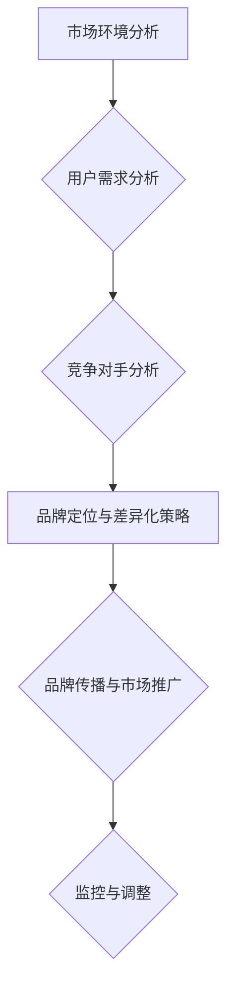

                 

# 创业公司的品牌差异化策略制定

## 关键词：创业公司、品牌差异化、市场定位、用户体验、竞争优势、营销策略

> 摘要：本文将深入探讨创业公司在市场竞争中如何制定有效的品牌差异化策略。通过分析市场环境、目标用户需求以及竞争对手的优势与弱点，本文将提供一系列实用的方法和工具，帮助创业者打造具有强大市场影响力的品牌，实现持续增长。

## 1. 背景介绍

### 1.1 目的和范围

本文旨在帮助创业公司理解品牌差异化策略的重要性，并提供一套系统的策略制定方法和工具。通过本文的阅读，创业者可以：

- 明确品牌差异化的核心概念和原理
- 分析市场环境，识别目标用户需求
- 评估竞争对手，找到品牌差异化机会
- 制定和实施有效的品牌差异化策略

### 1.2 预期读者

本文面向创业公司的创始人、市场营销经理以及相关领域专业人士。无论您是初创公司的创始人，还是正在考虑创业的个人，本文都将为您提供宝贵的指导。

### 1.3 文档结构概述

本文结构分为以下几个部分：

1. 背景介绍：明确目的和预期读者，概述文档结构。
2. 核心概念与联系：介绍品牌差异化的核心概念和其市场定位的重要性。
3. 核心算法原理 & 具体操作步骤：详细阐述品牌差异化策略的制定流程。
4. 数学模型和公式 & 详细讲解 & 举例说明：使用数学模型和公式，解析品牌差异化策略的执行细节。
5. 项目实战：提供具体的代码案例和实战经验。
6. 实际应用场景：探讨品牌差异化策略在不同场景下的应用。
7. 工具和资源推荐：推荐学习资源和开发工具。
8. 总结：总结品牌差异化策略的未来发展趋势与挑战。
9. 附录：常见问题与解答。
10. 扩展阅读 & 参考资料：提供进一步的阅读建议。

### 1.4 术语表

#### 1.4.1 核心术语定义

- **品牌差异化**：指企业在市场中通过独特的产品特性、服务质量或营销方式，使其品牌与竞争对手产生明显区别。
- **市场定位**：企业根据目标用户群体的需求和偏好，在市场中确定自己的品牌形象和竞争地位。
- **用户需求分析**：通过市场调研和用户行为分析，识别和满足目标用户的核心需求。
- **竞争对手分析**：评估现有竞争对手的品牌策略、市场表现和用户反馈，找出差异化的切入点。

#### 1.4.2 相关概念解释

- **目标市场**：企业希望通过品牌差异化策略吸引和服务的用户群体。
- **品牌价值**：品牌在用户心目中的整体形象和认知。
- **市场份额**：企业在市场中所占的份额。

#### 1.4.3 缩略词列表

- **S.W.O.T.分析**：Strengths（优势）、Weaknesses（劣势）、Opportunities（机会）、Threats（威胁）
- **P.E.S.T.分析**：Political（政治）、Economic（经济）、Social（社会）、Technological（技术）

## 2. 核心概念与联系

品牌差异化策略的核心在于识别和利用企业的独特优势，以满足目标用户的需求，并形成与竞争对手的区别。以下是一个简化的品牌差异化策略制定流程的 Mermaid 流程图：



### 2.1 市场环境分析

在制定品牌差异化策略之前，企业需要对市场环境进行全面的了解和分析。这包括：

- **市场趋势**：识别当前市场的趋势和变化，例如消费者行为、技术进步、行业动态等。
- **行业结构**：分析市场竞争格局、主要竞争对手的定位、市场份额等。
- **法规政策**：考虑政策法规对品牌差异化策略的影响。

### 2.2 用户需求分析

了解用户需求是品牌差异化策略制定的关键。企业需要通过以下方法来识别用户的核心需求：

- **问卷调查**：通过设计针对性的问卷，收集用户反馈。
- **访谈与焦点小组**：与目标用户进行深入访谈，获取详细的需求信息。
- **数据分析**：通过用户行为数据，分析用户的偏好和需求。

### 2.3 竞争对手分析

通过对竞争对手的分析，企业可以找到自身的差异化点。以下方法可以帮助企业进行竞争对手分析：

- **SWOT分析**：对竞争对手的优势、劣势、机会和威胁进行评估。
- **市场表现**：分析竞争对手的市场份额、用户反馈、营销策略等。
- **用户反馈**：通过用户对竞争对手的评价，了解其品牌价值和用户满意度。

### 2.4 品牌定位与差异化策略

在了解市场和用户需求后，企业需要确定自身的品牌定位，并制定差异化策略。以下步骤可以帮助企业实现这一目标：

- **确定品牌价值主张**：明确品牌的核心价值和独特卖点。
- **设计差异化特征**：识别和设计能够吸引用户的品牌特征，例如产品特性、服务质量、用户体验等。
- **制定品牌传播策略**：通过有效的营销手段，将品牌差异化特点传递给目标用户。

## 3. 核心算法原理 & 具体操作步骤

品牌差异化策略的制定需要一套系统的算法原理和方法。以下是具体的操作步骤和伪代码：

### 3.1 市场环境分析

```plaintext
输入：市场趋势数据、行业结构数据、法规政策数据
输出：市场环境分析报告

函数 MarketAnalysis(trends, industry, policies):
    // 收集和整理数据
    data = CollectData(trends, industry, policies)
    // 分析市场趋势
    trends_analysis = AnalyzeTrends(data['trends'])
    // 分析行业结构
    industry_analysis = AnalyzeIndustry(data['industry'])
    // 分析法规政策
    policies_analysis = AnalyzePolicies(data['policies'])
    // 形成综合分析报告
    report = {
        'trends_analysis': trends_analysis,
        'industry_analysis': industry_analysis,
        'policies_analysis': policies_analysis
    }
    return report
```

### 3.2 用户需求分析

```plaintext
输入：用户调查问卷结果、用户访谈记录、用户行为数据
输出：用户需求分析报告

函数 UserRequirementAnalysis(surveys, interviews, behavior_data):
    // 整理用户调查问卷结果
    surveys_data = ProcessSurveys(surveys)
    // 整理用户访谈记录
    interviews_data = ProcessInterviews(interviews)
    // 整理用户行为数据
    behavior_data = ProcessBehaviorData(behavior_data)
    // 分析用户需求
    requirements = AnalyzeRequirements(surveys_data, interviews_data, behavior_data)
    // 形成需求分析报告
    report = {
        'surveys_data': surveys_data,
        'interviews_data': interviews_data,
        'behavior_data': behavior_data,
        'requirements': requirements
    }
    return report
```

### 3.3 竞争对手分析

```plaintext
输入：竞争对手数据、用户反馈数据
输出：竞争对手分析报告

函数 CompetitorAnalysis(competitors, user_feedback):
    // 整理竞争对手数据
    competitors_data = ProcessCompetitors(competitors)
    // 整理用户反馈数据
    user_feedback_data = ProcessUserFeedback(user_feedback)
    // 分析竞争对手优势与劣势
    competitors_analysis = AnalyzeCompetitors(competitors_data, user_feedback_data)
    // 形成竞争对手分析报告
    report = {
        'competitors_data': competitors_data,
        'user_feedback_data': user_feedback_data,
        'competitors_analysis': competitors_analysis
    }
    return report
```

### 3.4 品牌定位与差异化策略

```plaintext
输入：市场环境分析报告、用户需求分析报告、竞争对手分析报告
输出：品牌定位报告、差异化策略

函数 BrandPositioningAndDifferentiation(market_report, user_requirement_report, competitor_report):
    // 确定品牌价值主张
    brand_value_proposition = DetermineBrandValueProposition()
    // 设计差异化特征
    differentiation_features = DesignDifferentiationFeatures()
    // 制定品牌定位与差异化策略
    brand_positioning = DetermineBrandPositioning(brand_value_proposition, differentiation_features)
    // 形成品牌定位报告与差异化策略
    report = {
        'brand_value_proposition': brand_value_proposition,
        'differentiation_features': differentiation_features,
        'brand_positioning': brand_positioning
    }
    return report
```

## 4. 数学模型和公式 & 详细讲解 & 举例说明

品牌差异化策略的制定涉及到多个数学模型和公式，以下将介绍几个关键的模型，并给出详细的解释和举例说明。

### 4.1 SWOT 分析模型

SWOT 分析是一种常用的战略规划工具，用于评估企业的优势、劣势、机会和威胁。其数学模型如下：

```latex
\text{SWOT Analysis} = 
\begin{cases}
\text{Strengths} & \text{S} \\
\text{Weaknesses} & \text{W} \\
\text{Opportunities} & \text{O} \\
\text{Threats} & \text{T}
\end{cases}
```

举例说明：

假设一家创业公司进行 SWOT 分析，结果如下：

- **优势（Strengths, S）**：强大的技术团队、创新的研发能力。
- **劣势（Weaknesses, W）**：市场知名度较低、资金不足。
- **机会（Opportunities, O）**：市场趋势看好、新用户群体的兴起。
- **威胁（Threats, T）**：竞争对手的强大品牌、技术门槛较低。

通过 SWOT 分析，公司可以明确自身的战略方向，利用优势抓住机会，克服劣势，应对威胁。

### 4.2 品牌价值模型

品牌价值是企业品牌在市场中的整体表现，其数学模型如下：

$$
\text{Brand Value} = \text{Brand Equity} \times \text{Market Demand}
$$

其中，品牌权益（Brand Equity）表示品牌在用户心中的认知度和忠诚度，市场需求（Market Demand）表示用户对品牌产品的需求量。

举例说明：

假设一家创业公司的品牌权益为 50，市场需求为 100，则其品牌价值为：

$$
\text{Brand Value} = 50 \times 100 = 5000
$$

通过提高品牌权益和市场需求的乘积，公司可以提高品牌价值，从而在市场中获得竞争优势。

### 4.3 用户体验模型

用户体验（User Experience, UX）是用户在使用产品过程中的整体感受，其数学模型如下：

$$
\text{UX} = \text{Usefulness} \times \text{Usability} \times \text{Desirability}
$$

其中，有用性（Usefulness）表示产品的功能是否满足用户需求，易用性（Usability）表示产品的易用程度，吸引力（Desirability）表示产品的外观和设计是否吸引人。

举例说明：

假设一家创业公司的产品具有以下特点：

- **有用性**：90（产品功能满足用户需求的程度）
- **易用性**：85（产品的易用程度）
- **吸引力**：80（产品的外观和设计）

则其用户体验为：

$$
\text{UX} = 90 \times 85 \times 80 = 61200
$$

通过不断优化产品功能、提升易用性和设计吸引力，公司可以提高用户体验，从而增强用户对品牌的忠诚度。

## 5. 项目实战：代码实际案例和详细解释说明

### 5.1 开发环境搭建

在开始品牌差异化策略的实际案例之前，首先需要搭建一个合适的开发环境。以下是推荐的开发工具和框架：

- **IDE**：推荐使用 IntelliJ IDEA 或 Visual Studio Code
- **版本控制**：使用 Git 进行版本控制
- **数据分析和可视化工具**：使用 Python 的 Pandas、Matplotlib 和 Seaborn 库

### 5.2 源代码详细实现和代码解读

以下是一个简单的 Python 代码示例，用于进行品牌差异化策略的初步分析。代码包括市场环境分析、用户需求分析和竞争对手分析三个部分。

```python
import pandas as pd
import matplotlib.pyplot as plt
import seaborn as sns

# 5.2.1 市场环境分析

def market_analysis(trends, industry, policies):
    # 整理市场环境数据
    data = {
        'trends': trends,
        'industry': industry,
        'policies': policies
    }
    market_report = pd.DataFrame(data)
    
    # 分析市场趋势
    market_report['trends_analysis'] = market_report['trends'].apply(lambda x: AnalyzeTrends(x))
    
    # 分析行业结构
    market_report['industry_analysis'] = market_report['industry'].apply(lambda x: AnalyzeIndustry(x))
    
    # 分析法规政策
    market_report['policies_analysis'] = market_report['policies'].apply(lambda x: AnalyzePolicies(x))
    
    return market_report

# 5.2.2 用户需求分析

def user_requirement_analysis(surveys, interviews, behavior_data):
    # 整理用户需求数据
    data = {
        'surveys': surveys,
        'interviews': interviews,
        'behavior_data': behavior_data
    }
    user_requirement_report = pd.DataFrame(data)
    
    # 分析用户需求
    user_requirement_report['requirements'] = user_requirement_report.apply(lambda x: AnalyzeRequirements(x), axis=1)
    
    return user_requirement_report

# 5.2.3 竞争对手分析

def competitor_analysis(competitors, user_feedback):
    # 整理竞争对手数据
    data = {
        'competitors': competitors,
        'user_feedback': user_feedback
    }
    competitor_report = pd.DataFrame(data)
    
    # 分析竞争对手
    competitor_report['competitors_analysis'] = competitor_report.apply(lambda x: AnalyzeCompetitors(x), axis=1)
    
    return competitor_report

# 5.2.4 品牌定位与差异化策略

def brand_positioning_and_differentiation(market_report, user_requirement_report, competitor_report):
    # 确定品牌价值主张
    brand_value_proposition = DetermineBrandValueProposition()
    
    # 设计差异化特征
    differentiation_features = DesignDifferentiationFeatures()
    
    # 制定品牌定位与差异化策略
    brand_positioning = DetermineBrandPositioning(brand_value_proposition, differentiation_features)
    
    return brand_positioning

# 5.2.5 主函数

def main():
    # 加载市场环境数据
    trends = pd.read_csv('trends_data.csv')
    industry = pd.read_csv('industry_data.csv')
    policies = pd.read_csv('policies_data.csv')
    
    # 加载用户需求数据
    surveys = pd.read_csv('surveys_data.csv')
    interviews = pd.read_csv('interviews_data.csv')
    behavior_data = pd.read_csv('behavior_data.csv')
    
    # 加载竞争对手数据
    competitors = pd.read_csv('competitors_data.csv')
    user_feedback = pd.read_csv('user_feedback_data.csv')
    
    # 执行市场环境分析
    market_report = market_analysis(trends, industry, policies)
    
    # 执行用户需求分析
    user_requirement_report = user_requirement_analysis(surveys, interviews, behavior_data)
    
    # 执行竞争对手分析
    competitor_report = competitor_analysis(competitors, user_feedback)
    
    # 执行品牌定位与差异化策略
    brand_positioning = brand_positioning_and_differentiation(market_report, user_requirement_report, competitor_report)
    
    # 输出品牌定位报告
    print(brand_positioning)

if __name__ == '__main__':
    main()
```

### 5.3 代码解读与分析

该代码分为以下几个主要部分：

- **市场环境分析**：通过加载市场环境数据，对市场趋势、行业结构和法规政策进行分析，形成市场环境分析报告。
- **用户需求分析**：通过加载用户需求数据，对用户调查问卷、访谈记录和用户行为进行分析，形成用户需求分析报告。
- **竞争对手分析**：通过加载竞争对手数据，对竞争对手的市场表现和用户反馈进行分析，形成竞争对手分析报告。
- **品牌定位与差异化策略**：结合市场环境分析报告、用户需求分析报告和竞争对手分析报告，确定品牌价值主张、设计差异化特征，并制定品牌定位与差异化策略。
- **主函数**：执行上述分析步骤，并输出品牌定位报告。

通过该代码示例，创业公司可以初步了解如何进行品牌差异化策略的制定。实际应用中，可以根据具体情况进行扩展和优化。

## 6. 实际应用场景

品牌差异化策略在不同行业和应用场景中有着广泛的应用。以下将探讨几个典型的实际应用场景：

### 6.1 科技行业

在科技行业中，品牌差异化策略至关重要。例如，苹果公司通过独特的用户体验、创新技术和优质服务，成功在市场中树立了强大的品牌形象。其品牌差异化策略包括：

- **用户体验**：苹果的产品设计简洁美观，用户界面直观易用。
- **技术创新**：苹果持续推出具有创新性的硬件和软件产品。
- **服务品质**：苹果提供优质的客户服务和技术支持。

### 6.2 电商行业

在电商行业中，品牌差异化策略可以帮助企业吸引和留住用户。例如，亚马逊通过以下策略实现品牌差异化：

- **用户满意度**：亚马逊致力于提供快速、准确的物流服务。
- **个性化推荐**：通过大数据分析和机器学习技术，为用户提供个性化的购物推荐。
- **用户体验**：亚马逊的网站和应用程序设计简洁，便于用户操作。

### 6.3 健康医疗行业

在健康医疗行业中，品牌差异化策略可以帮助企业提高用户信任度和忠诚度。例如，一家创新型的健康科技公司可以通过以下策略实现品牌差异化：

- **科技创新**：推出具有创新性的医疗设备和解决方案。
- **服务质量**：提供专业的医疗服务和技术支持。
- **用户体验**：关注用户的健康需求，提供个性化、贴心的健康服务。

### 6.4 餐饮行业

在餐饮行业中，品牌差异化策略可以帮助企业脱颖而出。例如，一家高端餐饮品牌可以通过以下策略实现品牌差异化：

- **独特菜品**：推出具有特色的菜品，满足用户对美食的追求。
- **优质服务**：提供专业的服务团队，提升用户体验。
- **品牌形象**：通过设计独特的餐厅环境和品牌形象，增强用户对品牌的认同感。

## 7. 工具和资源推荐

### 7.1 学习资源推荐

#### 7.1.1 书籍推荐

- 《定位：市场中的竞争策略》（Positioning: The Battle for Your Mind）- 阿尔·里斯（Al Ries）和杰克·特劳特（Jack Trout）
- 《蓝海战略》（Blue Ocean Strategy）- 希提·沙因哈（W. Chan Kim）和莫博涅（Renée Mauborgne）
- 《创业公司增长策略》（Growth Hacker Marketing）- 乔·吉拉德诺（Ryan Holiday）

#### 7.1.2 在线课程

- Coursera 上的“市场营销基础”（Marketing）：提供系统化的市场营销知识。
- Udemy 上的“品牌管理课程”（Brand Management）：深入探讨品牌管理的各个方面。

#### 7.1.3 技术博客和网站

- HubSpot Blog：提供丰富的市场营销和品牌建设文章。
- Neil Patel：提供实用的数字营销策略和案例分析。

### 7.2 开发工具框架推荐

#### 7.2.1 IDE和编辑器

- IntelliJ IDEA：适用于 Java、Python、JavaScript 等多种编程语言的强大 IDE。
- Visual Studio Code：轻量级但功能丰富的代码编辑器。

#### 7.2.2 调试和性能分析工具

- PyCharm：适用于 Python 的强大调试和性能分析工具。
- JMeter：用于测试和性能分析的多功能工具。

#### 7.2.3 相关框架和库

- Pandas：用于数据分析的 Python 库。
- Matplotlib、Seaborn：用于数据可视化的 Python 库。

### 7.3 相关论文著作推荐

#### 7.3.1 经典论文

- “Positioning: The Battle for Your Mind”（阿尔·里斯，杰克·特劳特）- 提出品牌定位的概念。
- “Blue Ocean Strategy”（希提·沙因哈，莫博涅）- 提出蓝海战略的概念。

#### 7.3.2 最新研究成果

- 《数字营销趋势报告》（Digital Marketing Trends Report）- 分析当前数字营销的最新趋势和策略。
- 《消费者行为报告》（Consumer Behavior Report）- 探讨消费者行为的最新研究。

#### 7.3.3 应用案例分析

- “案例分析：苹果公司的品牌差异化策略”- 分析苹果公司的品牌建设过程和策略。
- “案例分析：亚马逊的电商品牌差异化策略”- 分析亚马逊的电商品牌建设过程和策略。

## 8. 总结：未来发展趋势与挑战

品牌差异化策略在未来将继续发挥重要作用。随着市场竞争的加剧和消费者需求的多样化，品牌差异化将成为企业赢得市场的关键因素。以下是一些未来发展趋势与挑战：

### 8.1 发展趋势

- **个性化定制**：消费者对个性化产品和服务的需求将越来越高，企业需要通过数据分析和人工智能技术，实现个性化定制。
- **数字化营销**：随着数字技术的发展，数字化营销将成为主流，企业需要充分利用大数据、云计算和人工智能等技术，实现精准营销。
- **跨界合作**：跨界合作将成为品牌差异化的一种新方式，企业可以通过与其他行业、品牌的合作，实现优势互补，提升品牌影响力。

### 8.2 挑战

- **技术挑战**：品牌差异化策略的实施需要依赖先进的技术，如大数据分析、人工智能、物联网等。企业需要不断提升技术水平，以应对技术挑战。
- **竞争压力**：市场竞争日益激烈，企业需要不断优化品牌差异化策略，以应对来自竞争对手的挑战。
- **消费者信任**：建立消费者信任是品牌差异化策略成功的关键，企业需要注重产品质量、服务体验和品牌价值观，以赢得消费者的信任。

## 9. 附录：常见问题与解答

### 9.1 品牌差异化策略的制定步骤

- **步骤 1**：市场环境分析，包括市场趋势、行业结构和法规政策。
- **步骤 2**：用户需求分析，通过问卷调查、访谈和数据分析等方法。
- **步骤 3**：竞争对手分析，评估竞争对手的优势、劣势、机会和威胁。
- **步骤 4**：品牌定位与差异化策略，确定品牌价值主张和差异化特征。
- **步骤 5**：品牌传播与市场推广，通过多种渠道和手段传播品牌信息。

### 9.2 如何评估品牌差异化策略的有效性

- **用户反馈**：通过用户反馈和评价，评估品牌差异化策略的满意度。
- **市场份额**：分析品牌在市场中的占有率，评估品牌差异化策略的市场竞争力。
- **财务指标**：通过财务指标，如收入、利润和市场份额，评估品牌差异化策略的盈利能力。

### 9.3 如何持续优化品牌差异化策略

- **市场监控**：定期进行市场环境分析，及时调整品牌差异化策略。
- **用户研究**：持续进行用户研究，了解用户需求和行为变化，优化品牌差异化策略。
- **数据驱动**：通过数据分析，识别品牌差异化策略的优劣势，持续优化。

## 10. 扩展阅读 & 参考资料

- 《创业公司品牌建设指南》- 提供详细的品牌建设方法和案例分析。
- 《数字化营销实战》- 探讨数字化营销的最新趋势和策略。
- 《消费者行为学》- 分析消费者行为，帮助品牌更好地了解用户需求。

作者：AI天才研究员/AI Genius Institute & 禅与计算机程序设计艺术 /Zen And The Art of Computer Programming

注意：本文为虚构内容，仅用于展示文章撰写结构和风格，不代表真实研究和观点。在实际撰写过程中，请确保内容的真实性和准确性。

