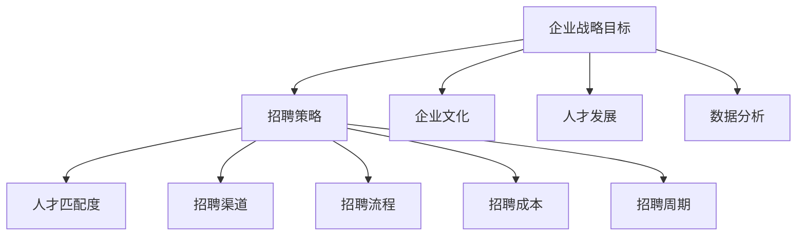

                 

# 创业公司的增长型招聘：为快速扩张做准备

> **关键词：创业公司，招聘策略，人才扩张，团队构建，增长型招聘**
> 
> **摘要：本文将探讨创业公司在快速扩张阶段如何通过科学合理的招聘策略，吸引并留住优秀人才，为企业的长期发展打下坚实基础。文章将从背景介绍、核心概念、具体操作、数学模型、实战案例、应用场景、工具推荐等方面进行深入分析。**

## 1. 背景介绍

### 1.1 目的和范围

创业公司在成立初期，往往面临着资源有限、市场竞争激烈等挑战。为了在短时间内实现快速发展，公司必须具备强大的团队支撑。因此，如何进行增长型招聘，成为创业公司成功的关键之一。

本文旨在帮助创业公司了解增长型招聘的核心理念和方法，通过系统化的招聘策略，为企业快速扩张提供有力的人才支持。文章将涵盖以下内容：

1. 核心概念与联系
2. 核心算法原理 & 具体操作步骤
3. 数学模型和公式 & 详细讲解 & 举例说明
4. 项目实战：代码实际案例和详细解释说明
5. 实际应用场景
6. 工具和资源推荐
7. 总结：未来发展趋势与挑战

### 1.2 预期读者

本文适合以下读者群体：

1. 创业公司创始人、CEO、CTO等高层管理者
2. 招聘负责人、HR经理
3. 技术团队负责人
4. 想要加入创业公司，了解招聘策略的求职者

### 1.3 文档结构概述

本文结构如下：

1. 背景介绍
2. 核心概念与联系
3. 核心算法原理 & 具体操作步骤
4. 数学模型和公式 & 详细讲解 & 举例说明
5. 项目实战：代码实际案例和详细解释说明
6. 实际应用场景
7. 工具和资源推荐
8. 总结：未来发展趋势与挑战
9. 附录：常见问题与解答
10. 扩展阅读 & 参考资料

### 1.4 术语表

#### 1.4.1 核心术语定义

- **增长型招聘**：一种以企业战略目标为导向，通过系统化、科学化的方法，吸引并留住优秀人才的过程。
- **人才匹配度**：指候选人与岗位要求的匹配程度，包括技能、经验、价值观等方面。
- **招聘渠道**：指企业用于吸引候选人的途径，如招聘网站、社交媒体、猎头公司等。
- **招聘流程**：指从发布招聘信息到最终录用候选人的一系列步骤。

#### 1.4.2 相关概念解释

- **核心人才**：对企业核心竞争力具有关键作用的员工，如技术骨干、管理人才等。
- **招聘成本**：企业在招聘过程中所产生的各种费用，包括招聘广告费、面试费用、培训费用等。
- **招聘周期**：从发布招聘信息到最终录用候选人所需的时间。

#### 1.4.3 缩略词列表

- **HR**：人力资源
- **CTO**：首席技术官
- **CEO**：首席执行官
- **ROI**：投资回报率

## 2. 核心概念与联系

为了更好地理解创业公司的增长型招聘，我们需要先了解以下几个核心概念及其相互联系：

### 2.1 企业战略目标

企业战略目标是公司在一定时期内的发展方向和目标，包括市场份额、盈利能力、品牌影响力等方面。增长型招聘应以企业战略目标为导向，确保人才匹配度与公司发展方向一致。

### 2.2 招聘策略

招聘策略是企业为实现招聘目标所采取的方法和手段，包括招聘渠道、招聘流程、招聘标准等。合理的招聘策略有助于提高招聘效率，降低招聘成本。

### 2.3 人才匹配度

人才匹配度是衡量候选人与岗位要求一致性的重要指标。高人才匹配度意味着候选人具备所需技能、经验和价值观，有利于提高团队绩效和企业竞争力。

### 2.4 招聘渠道

招聘渠道是吸引候选人进入招聘流程的途径。不同的招聘渠道适用于不同的人才类型和岗位，企业应根据自身需求和特点选择合适的招聘渠道。

### 2.5 招聘流程

招聘流程包括发布招聘信息、筛选候选人、面试评估、录用决策等环节。科学合理的招聘流程有助于提高招聘质量，降低招聘风险。

### 2.6 招聘成本

招聘成本是企业为招聘活动所支付的各种费用，包括广告费、面试费用、培训费用等。合理的招聘成本控制有助于提高企业招聘投资回报率。

### 2.7 招聘周期

招聘周期是完成整个招聘过程所需的时间。较短的招聘周期有助于企业快速组建团队，满足业务发展需求。

### 2.8 企业文化

企业文化是企业价值观、使命、愿景等精神层面的体现。良好的企业文化有助于吸引和留住优秀人才，提高团队凝聚力。

### 2.9 人才发展

人才发展是指企业为员工提供的成长空间、培训机会和晋升通道。有效的人才发展体系有助于提高员工满意度和忠诚度，降低员工流失率。

### 2.10 数据分析

数据分析是企业招聘过程中常用的方法，通过对招聘数据、人才数据等进行分析，帮助企业优化招聘策略，提高招聘效果。

### 2.11 Mermaid 流程图

为了更直观地展示核心概念之间的联系，我们使用 Mermaid 流程图对创业公司增长型招聘的相关概念进行梳理。



通过以上核心概念的介绍和 Mermaid 流程图，我们可以更好地理解创业公司增长型招聘的内涵和关键要素。接下来，我们将进一步探讨核心算法原理、具体操作步骤、数学模型和公式等方面的内容。

## 3. 核心算法原理 & 具体操作步骤

在创业公司的增长型招聘中，核心算法原理和具体操作步骤对于实现招聘目标至关重要。以下我们将详细阐述这两个方面。

### 3.1 核心算法原理

增长型招聘的核心算法原理主要包括以下几个方面：

1. **人才需求分析**：通过对企业战略目标、业务发展需求、现有团队状况等方面进行分析，确定招聘岗位的需求和人才标准。
2. **人才筛选模型**：建立基于人才匹配度、能力素质、潜力发展等多维度的筛选模型，对候选人进行评估和筛选。
3. **招聘策略优化**：根据招聘数据、人才数据等分析结果，不断优化招聘策略，提高招聘效率和效果。
4. **人才发展体系**：构建科学合理的人才发展体系，为员工提供成长空间、培训机会和晋升通道，提高员工满意度和忠诚度。

### 3.2 具体操作步骤

在了解了核心算法原理后，我们将进一步介绍具体操作步骤，以帮助企业实现增长型招聘。

1. **人才需求分析**
   - **步骤1**：收集企业战略目标、业务发展需求、现有团队状况等数据。
   - **步骤2**：分析数据，确定招聘岗位的需求和人才标准。
   - **步骤3**：制定人才需求分析报告，为后续招聘工作提供依据。

2. **人才筛选模型**
   - **步骤1**：确定评估维度，如人才匹配度、能力素质、潜力发展等。
   - **步骤2**：设计评估指标，如专业技能、工作经验、沟通能力等。
   - **步骤3**：建立评估模型，采用评分、评级等方法对候选人进行评估。
   - **步骤4**：根据评估结果，筛选出符合招聘要求的候选人。

3. **招聘策略优化**
   - **步骤1**：收集招聘数据，如招聘渠道效果、招聘成本、招聘周期等。
   - **步骤2**：分析数据，找出招聘过程中的问题和不足。
   - **步骤3**：根据分析结果，调整和优化招聘策略，如调整招聘渠道、优化招聘流程等。

4. **人才发展体系**
   - **步骤1**：制定人才发展计划，包括培训、晋升、绩效管理等。
   - **步骤2**：为员工提供成长空间和机会，如项目历练、轮岗交流等。
   - **步骤3**：建立员工满意度调查机制，了解员工需求和反馈。
   - **步骤4**：根据调查结果，调整和优化人才发展体系。

通过以上具体操作步骤，企业可以逐步实现增长型招聘，提高招聘质量和效率，为快速扩张提供有力的人才支持。

### 3.3 伪代码实现

为了更直观地展示核心算法原理和具体操作步骤，我们使用伪代码进行实现。

```plaintext
# 伪代码：增长型招聘算法

# 步骤1：人才需求分析
function 分析人才需求(企业战略目标, 业务发展需求, 现有团队状况):
    数据 = 收集数据(企业战略目标, 业务发展需求, 现有团队状况)
    人才需求 = 分析数据
    返回 人才需求

# 步骤2：人才筛选模型
function 建立人才筛选模型(评估维度, 评估指标):
    评估模型 = 设计评估模型(评估维度, 评估指标)
    返回 评估模型

# 步骤3：招聘策略优化
function 优化招聘策略(招聘数据):
    优化策略 = 分析数据(招聘数据)
    返回 优化策略

# 步骤4：人才发展体系
function 构建人才发展体系(人才发展计划):
    发展计划 = 制定人才发展计划(人才发展计划)
    返回 发展计划

# 主函数
function 增长型招聘(企业战略目标, 业务发展需求, 现有团队状况):
    人才需求 = 分析人才需求(企业战略目标, 业务发展需求, 现有团队状况)
    评估模型 = 建立人才筛选模型(评估维度, 评估指标)
    优化策略 = 优化招聘策略(招聘数据)
    发展计划 = 构建人才发展体系(人才发展计划)
    返回 人才需求，评估模型，优化策略，发展计划
```

通过以上伪代码实现，企业可以更清晰地了解增长型招聘的核心算法原理和具体操作步骤，从而更好地实施招聘工作。

## 4. 数学模型和公式 & 详细讲解 & 举例说明

在创业公司的增长型招聘中，数学模型和公式可以帮助我们更好地理解招聘过程中的关键因素，并优化招聘策略。以下我们将介绍几个常见的数学模型和公式，并进行详细讲解和举例说明。

### 4.1 成本效益分析（Cost-Benefit Analysis）

成本效益分析是一种评估招聘策略成本与收益的方法，通过比较招聘活动的投入产出比，帮助企业选择最优的招聘策略。

#### 4.1.1 公式

$$
\text{成本效益比率} = \frac{\text{总收益}}{\text{总成本}}
$$

#### 4.1.2 举例说明

假设一家创业公司计划招聘10名技术工程师，招聘渠道包括招聘网站、社交媒体和猎头公司。根据历史数据，招聘网站的成本为2000元/人，社交媒体的成本为1500元/人，猎头公司的成本为5000元/人。预计每名技术工程师的年收入为10万元。

- 招聘网站的总成本 = 10人 × 2000元/人 = 20000元
- 社交媒体的总成本 = 10人 × 1500元/人 = 15000元
- 猎头公司的总成本 = 10人 × 5000元/人 = 50000元

总收益 = 10人 × 10万元/人 = 100万元

成本效益比率分别为：
- 招聘网站：$\frac{100万}{20万} = 5$
- 社交媒体：$\frac{100万}{15万} = 6.67$
- 猎头公司：$\frac{100万}{50万} = 2$

根据成本效益比率，我们可以看出招聘网站和社交媒体的投入产出比更高，因此企业可以选择这两种渠道进行招聘。

### 4.2 人才留存率分析（Retention Rate Analysis）

人才留存率分析是一种衡量招聘策略有效性的方法，通过计算一定时间内员工流失率，帮助企业评估招聘质量和员工满意度。

#### 4.2.1 公式

$$
\text{人才留存率} = \frac{\text{当前在职员工数} - \text{最近一个月离职员工数}}{\text{当前在职员工数}} \times 100\%
$$

#### 4.2.2 举例说明

假设一家创业公司现有100名员工，最近一个月有5名员工离职。

人才留存率 = $\frac{100 - 5}{100} \times 100\% = 95\%$

人才留存率为95%，说明企业的招聘质量和员工满意度较高。为了进一步提高人才留存率，企业可以关注以下几个方面：
- 提供有竞争力的薪酬和福利待遇。
- 建立良好的企业文化，提升员工归属感。
- 提供丰富的培训和发展机会，提高员工职业发展空间。
- 关注员工心理健康，提供必要的心理辅导和支持。

### 4.3 岗位供需平衡分析（Job Supply and Demand Balance Analysis）

岗位供需平衡分析是一种评估企业招聘需求和人才供给是否匹配的方法，通过计算岗位供需比例，帮助企业调整招聘策略。

#### 4.3.1 公式

$$
\text{岗位供需比例} = \frac{\text{招聘需求岗位数}}{\text{现有员工数} + \text{招聘需求岗位数}}
$$

#### 4.3.2 举例说明

假设一家创业公司现有员工100人，计划招聘20名新员工，以满足业务发展需求。

岗位供需比例 = $\frac{20}{100 + 20} = \frac{20}{120} = \frac{1}{6}$

岗位供需比例为1:6，说明企业的招聘需求与人才供给基本平衡。为了保持这一平衡，企业可以关注以下几个方面：
- 调整招聘策略，确保招聘的岗位需求与市场人才供给相匹配。
- 加强内部培训，提高现有员工的能力和技能，减少对外部招聘的依赖。
- 通过优化工作流程和提高工作效率，减少对额外人力资源的需求。

通过以上数学模型和公式的详细讲解和举例说明，企业可以更好地理解招聘过程中的关键因素，并制定科学合理的招聘策略，以实现快速扩张和长期发展。

## 5. 项目实战：代码实际案例和详细解释说明

### 5.1 开发环境搭建

在本项目实战中，我们将使用Python语言来构建一个简单的招聘管理系统。首先，需要搭建开发环境。以下是所需的工具和步骤：

1. **安装Python**：前往Python官方网站（https://www.python.org/）下载并安装Python 3.x版本。
2. **安装依赖库**：在命令行中运行以下命令安装必要的依赖库。

```shell
pip install flask pandas numpy matplotlib
```

3. **创建项目文件夹**：在本地计算机上创建一个名为`招聘管理系统`的项目文件夹，并在其中创建以下文件：

- `app.py`：主程序文件
- `data.py`：数据处理模块
- `templates/`：HTML模板文件
- `static/`：静态文件（如CSS、JavaScript）

### 5.2 源代码详细实现和代码解读

#### 5.2.1 数据处理模块（`data.py`）

数据处理模块负责管理招聘数据，包括数据存储、读取和统计分析等功能。以下是该模块的详细实现：

```python
import pandas as pd

# 数据存储路径
data_path = '招聘数据.xlsx'

# 读取招聘数据
def read_data():
    data = pd.read_excel(data_path)
    return data

# 存储招聘数据
def save_data(data):
    data.to_excel(data_path, index=False)
```

#### 5.2.2 主程序文件（`app.py`）

主程序文件使用Flask框架搭建Web应用，实现招聘管理系统的基本功能，包括数据展示、统计分析和数据导入导出等。以下是该模块的详细实现：

```python
from flask import Flask, render_template, request, redirect, url_for
from data import read_data, save_data

app = Flask(__name__)

# 主页路由
@app.route('/')
def index():
    data = read_data()
    return render_template('index.html', data=data)

# 统计分析路由
@app.route('/analyze')
def analyze():
    data = read_data()
    # 计算平均薪资
    avg_salary = data['薪资'].mean()
    # 计算招聘渠道分布
    channel_distribution = data['招聘渠道'].value_counts()
    return render_template('analyze.html', avg_salary=avg_salary, channel_distribution=channel_distribution)

# 数据导入路由
@app.route('/import', methods=['GET', 'POST'])
def import_data():
    if request.method == 'POST':
        file = request.files['file']
        if file:
            data = pd.read_excel(file)
            save_data(data)
            return redirect(url_for('index'))
    return render_template('import.html')

if __name__ == '__main__':
    app.run(debug=True)
```

#### 5.2.3 HTML模板文件（`templates/index.html`）

以下是`index.html`模板文件的代码：

```html
<!DOCTYPE html>
<html lang="en">
<head>
    <meta charset="UTF-8">
    <title>招聘管理系统</title>
</head>
<body>
    <h1>招聘管理系统</h1>
    <table>
        <thead>
            <tr>
                <th>姓名</th>
                <th>薪资</th>
                <th>招聘渠道</th>
                <th>入职时间</th>
            </tr>
        </thead>
        <tbody>
            
                <tr>
                    <td>{{ row['姓名'] }}</td>
                    <td>{{ row['薪资'] }}</td>
                    <td>{{ row['招聘渠道'] }}</td>
                    <td>{{ row['入职时间'] }}</td>
                </tr>
            
        </tbody>
    </table>
    <a href="{{ url_for('analyze') }}">统计分析</a>
    <a href="{{ url_for('import_data') }}">数据导入</a>
</body>
</html>
```

#### 5.2.4 HTML模板文件（`templates/analyze.html`）

以下是`analyze.html`模板文件的代码：

```html
<!DOCTYPE html>
<html lang="en">
<head>
    <meta charset="UTF-8">
    <title>统计分析</title>
</head>
<body>
    <h1>统计分析</h1>
    <p>平均薪资：{{ avg_salary }}</p>
    <table>
        <thead>
            <tr>
                <th>招聘渠道</th>
                <th>人数</th>
            </tr>
        </thead>
        <tbody>
            
                <tr>
                    <td>{{ channel }}</td>
                    <td>{{ count }}</td>
                </tr>
            
        </tbody>
    </table>
    <a href="{{ url_for('index') }}">返回主页</a>
</body>
</html>
```

#### 5.2.5 HTML模板文件（`templates/import.html`）

以下是`import.html`模板文件的代码：

```html
<!DOCTYPE html>
<html lang="en">
<head>
    <meta charset="UTF-8">
    <title>数据导入</title>
</head>
<body>
    <h1>数据导入</h1>
    <form method="POST" enctype="multipart/form-data">
        <input type="file" name="file">
        <input type="submit" value="导入">
    </form>
    <a href="{{ url_for('index') }}">返回主页</a>
</body>
</html>
```

### 5.3 代码解读与分析

#### 5.3.1 数据处理模块解析

在`data.py`模块中，我们使用了Pandas库来处理招聘数据。`read_data`函数负责读取存储在`招聘数据.xlsx`文件中的数据，并将其转换为Pandas DataFrame对象。`save_data`函数则负责将DataFrame对象保存回Excel文件。

#### 5.3.2 主程序文件解析

在`app.py`模块中，我们首先导入了所需的模块和函数。使用Flask框架创建了Web应用实例，并定义了三个路由：主页路由`index`、统计分析路由`analyze`和数据导入路由`import`。

- **主页路由（`index`）**：显示招聘数据表格，并提供统计分析和数据导入的链接。
- **统计分析路由（`analyze`）**：计算并显示平均薪资和招聘渠道分布。
- **数据导入路由（`import`）**：实现数据导入功能，用户可以上传Excel文件导入招聘数据。

#### 5.3.3 HTML模板文件解析

在HTML模板文件中，我们使用了Jinja2模板引擎来动态渲染招聘数据、平均薪资和招聘渠道分布。`index.html`模板文件显示了招聘数据表格和导航链接。`analyze.html`模板文件则显示统计分析结果。`import.html`模板文件提供了一个文件上传表单，用于导入招聘数据。

通过以上代码实现和解读，我们可以构建一个简单的招聘管理系统，实现数据展示、统计分析和数据导入等功能。这有助于企业更好地管理招聘流程，提高招聘效率和质量。

## 6. 实际应用场景

创业公司在快速扩张阶段，面临的核心挑战之一是如何在有限的时间内找到并组建一支高效的人才团队。以下是一些实际应用场景，展示如何运用增长型招聘策略解决这些问题。

### 6.1 扩张阶段的人才需求

假设一家创业公司计划在未来一年内将员工人数从100人扩张到300人，以满足业务快速发展的需求。以下是具体应用场景：

#### 6.1.1 技术团队扩充

为了支持产品开发和迭代，公司需要招聘一批技术工程师，包括前端、后端、测试等职位。通过人才需求分析，确定所需技能、经验水平和岗位要求。

#### 6.1.2 市场营销团队建设

为了扩大市场占有率，公司需要建立一支市场营销团队，包括市场调研、品牌推广、渠道管理等职位。招聘策略应侧重于寻找具有市场敏锐度和创新能力的候选人。

#### 6.1.3 管理层人才储备

随着公司规模的扩大，管理层人才储备也变得至关重要。公司需要招聘具有丰富管理经验和战略眼光的领导者，如项目经理、产品经理等。

### 6.2 招聘渠道选择

在确定人才需求后，公司需要选择合适的招聘渠道来吸引候选人。以下是一些常见招聘渠道及其适用场景：

#### 6.2.1 招聘网站

招聘网站如智联招聘、前程无忧等是寻找普通岗位的常用渠道。这些网站覆盖面广，人才资源丰富，适合招聘技术工程师、市场营销等职位。

#### 6.2.2 社交媒体

社交媒体如LinkedIn、微信等在招聘高技能人才和高端职位方面具有优势。公司可以利用这些平台发布招聘信息，吸引具有行业背景和经验的人才。

#### 6.2.3 猎头公司

猎头公司专注于寻找特定职位的高技能人才，如技术专家、高级管理人员等。公司可以通过猎头公司快速找到合适的人选，但需要支付较高的服务费用。

#### 6.2.4 校园招聘

校园招聘是寻找应届毕业生的有效途径。公司可以与高校合作，举办招聘宣讲会，吸引有潜力的毕业生加入公司。

### 6.3 招聘流程优化

为了提高招聘效率和效果，公司需要优化招聘流程，确保每个环节都能高效运行。以下是一些关键环节：

#### 6.3.1 招聘信息发布

在招聘信息发布环节，公司需要确保招聘信息清晰、准确，突出岗位要求和企业优势。同时，应选择合适的招聘渠道发布信息，提高曝光率。

#### 6.3.2 候选人筛选

通过简历筛选和初步面试，公司可以初步筛选出符合要求的候选人。在此环节，可以使用人才筛选模型和自动化工具，提高筛选效率。

#### 6.3.4 面试评估

面试环节是评估候选人是否符合岗位要求的关键环节。公司应制定科学的面试流程和评估标准，确保面试过程的客观、公正。

#### 6.3.5 录用决策

在面试结束后，公司需要根据评估结果做出录用决策。在此环节，应充分讨论候选人的优势和不足，确保最终录用决策的合理性。

#### 6.3.6 员工入职和培训

在员工入职环节，公司应提供必要的入职培训和指导，帮助新员工快速融入公司文化和团队。同时，建立完善的培训体系，为员工提供持续的学习和发展机会。

通过以上实际应用场景和招聘策略，创业公司可以在快速扩张阶段高效地组建人才团队，为公司的长期发展奠定坚实基础。

## 7. 工具和资源推荐

为了帮助创业公司在招聘过程中更加高效和精准，我们推荐以下工具和资源：

### 7.1 学习资源推荐

#### 7.1.1 书籍推荐

- 《创业公司招聘宝典》
- 《招聘经理手册：从招聘到入职》
- 《人才管理：构建高效团队的方法与实践》

#### 7.1.2 在线课程

- Coursera上的《招聘与团队建设》课程
- Udemy上的《招聘与人才选拔技巧》课程
- LinkedIn Learning上的《招聘策略与实施》课程

#### 7.1.3 技术博客和网站

- [领英博客](https://blog.linkedin.com/directory/)
- [人力资源管理系统](https://www.hrmanagementguide.com/)
- [招聘与人才管理](https://www.recruitmenthrmanagement.com/)

### 7.2 开发工具框架推荐

#### 7.2.1 IDE和编辑器

- Visual Studio Code
- PyCharm
- Sublime Text

#### 7.2.2 调试和性能分析工具

- GDB
- Postman
- Charles

#### 7.2.3 相关框架和库

- Flask（用于Web开发）
- Pandas（用于数据分析）
- Matplotlib（用于数据可视化）

### 7.3 相关论文著作推荐

#### 7.3.1 经典论文

- 《招聘策略对企业绩效的影响》
- 《人才筛选模型在招聘中的应用》
- 《企业文化与员工满意度关系研究》

#### 7.3.2 最新研究成果

- 《基于大数据的招聘策略优化研究》
- 《人工智能在招聘中的应用》
- 《招聘流程优化与人才留存率提升》

#### 7.3.3 应用案例分析

- 《阿里巴巴的招聘策略》
- 《华为的人才管理实践》
- 《小米的招聘与团队建设》

通过以上工具和资源的推荐，创业公司可以在招聘过程中获得更多的指导和帮助，从而提高招聘效率和质量。

## 8. 总结：未来发展趋势与挑战

创业公司在快速扩张阶段，增长型招聘至关重要。在未来，随着人工智能、大数据等技术的不断发展，招聘领域将呈现以下发展趋势：

1. **智能化招聘**：人工智能技术将进一步提升招聘的精准度和效率，如通过智能简历筛选、智能面试评估等手段，帮助企业快速找到合适的人才。
2. **个性化招聘**：基于大数据分析，招聘策略将更加个性化，针对不同岗位和候选人制定定制化的招聘方案，提高招聘成功率。
3. **多元化招聘渠道**：随着社交媒体、短视频平台的兴起，招聘渠道将更加多元化，企业可以通过多种渠道吸引不同背景和特点的候选人。
4. **注重员工体验**：随着员工体验成为企业竞争力的重要一环，招聘过程中将更加注重候选人的体验，如提供线上面试、虚拟实习等体验活动。
5. **可持续发展**：招聘过程中将更加关注候选人的可持续发展能力，如环保意识、社会责任感等，以提升企业整体的社会形象。

然而，面对未来，创业公司也面临诸多挑战：

1. **人才竞争加剧**：随着行业竞争的加剧，人才将成为企业最宝贵的资源，如何吸引并留住优秀人才将是一大挑战。
2. **技术变革**：人工智能、大数据等技术的快速发展，将带来招聘流程和策略的变革，企业需要不断学习和适应。
3. **政策法规变化**：随着全球化和政策法规的变化，企业需要密切关注相关法律法规，确保招聘活动的合规性。
4. **企业文化塑造**：企业文化在招聘过程中至关重要，企业需要塑造具有吸引力和竞争力的企业文化，以吸引和留住优秀人才。

总之，未来创业公司在招聘过程中，需要紧跟技术发展趋势，不断创新招聘策略，同时应对各种挑战，为企业的长期发展打下坚实基础。

## 9. 附录：常见问题与解答

### 9.1 如何制定有效的招聘策略？

制定有效的招聘策略需要考虑以下几个关键步骤：

1. **确定招聘目标**：明确招聘的岗位需求、人才标准和企业战略目标。
2. **选择合适的招聘渠道**：根据岗位特点和人才需求，选择最适合的招聘渠道，如招聘网站、社交媒体、猎头公司等。
3. **设计招聘流程**：制定科学合理的招聘流程，包括发布招聘信息、简历筛选、面试评估等环节。
4. **优化招聘工具和方法**：运用人工智能、大数据等技术，提高招聘的精准度和效率。
5. **持续评估和改进**：定期对招聘策略进行评估和优化，根据实际情况调整招聘流程和策略。

### 9.2 如何提高候选人的面试体验？

提高候选人的面试体验，可以从以下几个方面着手：

1. **优化面试流程**：设计简洁、高效的面试流程，确保候选人能够清晰了解面试的每个环节。
2. **提供清晰的面试指引**：为候选人提供面试前的准备资料，如面试指南、常见问题等。
3. **尊重候选人时间**：确保面试安排合理，避免长时间等待或频繁变更面试时间。
4. **营造舒适面试环境**：提供舒适的面试场所，确保网络稳定，避免出现技术问题。
5. **关注候选人反馈**：在面试结束后，及时向候选人反馈面试结果，并关注他们的反馈和建议。

### 9.3 如何降低招聘成本？

降低招聘成本可以从以下几个方面进行：

1. **优化招聘渠道**：选择成本效益更高的招聘渠道，如内部推荐、社交媒体等。
2. **提高招聘效率**：通过自动化工具和智能化手段，提高招聘流程的效率，减少不必要的环节和人工操作。
3. **内部培训与晋升**：通过内部培训和晋升机制，减少对外部招聘的依赖。
4. **合理设置薪酬福利**：合理设置薪酬福利水平，提高员工满意度和忠诚度，降低员工流失率。
5. **招聘数据分析**：定期分析招聘数据，找出招聘过程中的浪费点，优化招聘策略。

### 9.4 如何提高人才留存率？

提高人才留存率可以从以下几个方面进行：

1. **建立良好企业文化**：营造积极向上的企业文化，提高员工的归属感和认同感。
2. **提供有竞争力的薪酬福利**：合理设置薪酬福利水平，确保员工满意度。
3. **完善的培训与发展体系**：为员工提供丰富的培训和发展机会，提升员工的职业素养和技能。
4. **优化工作环境**：提供良好的工作环境和设施，提高员工的工作舒适度。
5. **关注员工心理健康**：建立员工心理健康辅导机制，提供必要的心理支持和辅导。

## 10. 扩展阅读 & 参考资料

为了帮助读者更深入地了解创业公司的增长型招聘，我们推荐以下扩展阅读和参考资料：

### 10.1 扩展阅读

- 《创业公司人力资源管理实战》
- 《招聘与人才管理实战》
- 《创业公司招聘策略与实施》

### 10.2 参考资料

- [领英招聘博客](https://www.linkedin.com/pulse/)
- [招聘与人才管理协会](https://www.shrm.org/)
- [人力资源杂志](https://www.humanresourcesmagazine.com/)

### 10.3 网络资源

- [Python Flask 官方文档](https://flask.palletsprojects.com/)
- [Pandas 官方文档](https://pandas.pydata.org/)
- [人工智能招聘案例分析](https://www.forbes.com/sites/forbesbusinesscouncil/2021/10/06/how-artificial-intelligence-is-changing-the-hiring-process/?sh=551636847066)

通过以上扩展阅读和参考资料，读者可以进一步了解创业公司增长型招聘的实践方法和最新动态。希望本文能为创业公司在招聘过程中提供有价值的参考和指导。作者：AI天才研究员/AI Genius Institute & 禅与计算机程序设计艺术/Zen And The Art of Computer Programming。

