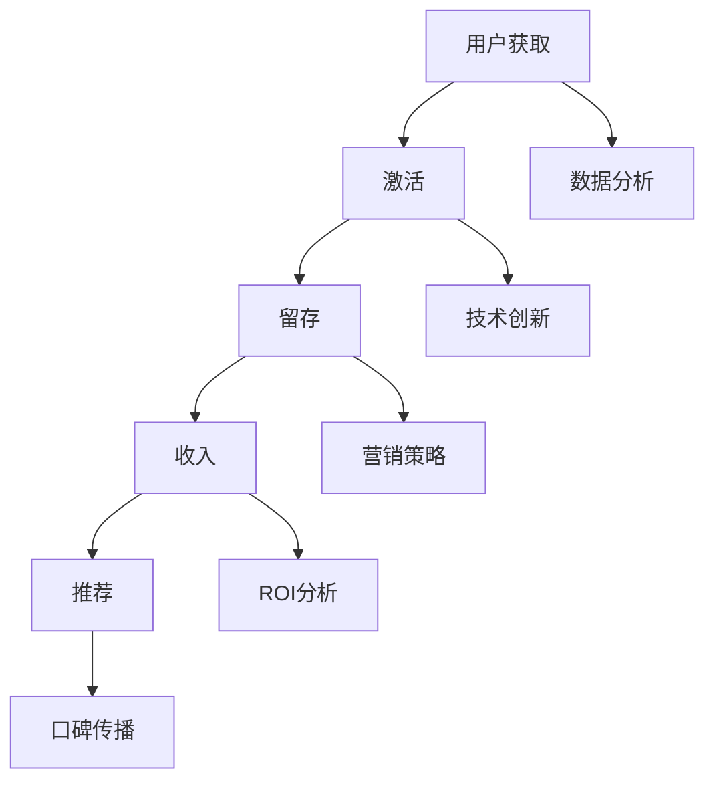

                 

# 创业公司的增长黑客实践案例分析

> **关键词：** 创业公司、增长黑客、案例分析、营销策略、技术创新

> **摘要：** 本文将深入分析创业公司在实现快速增长过程中，如何运用增长黑客策略。通过具体的案例，展示增长黑客在不同阶段的应用场景、实施步骤及其效果，为其他创业公司提供宝贵的借鉴经验。

## 1. 背景介绍

### 1.1 目的和范围

本文旨在通过实际案例，展示增长黑客策略在创业公司中的应用价值。我们将探讨增长黑客的定义、核心原理，并通过具体案例，解析增长黑客在不同创业阶段的具体实践。

### 1.2 预期读者

本文适合以下读者：

- 创业公司创始人、CTO
- 营销和运营管理人员
- 对增长黑客策略感兴趣的IT专业人士

### 1.3 文档结构概述

本文结构如下：

- **第1章：背景介绍**：介绍本文的目的、范围和预期读者。
- **第2章：核心概念与联系**：阐述增长黑客的核心概念及其在创业公司中的应用。
- **第3章：核心算法原理 & 具体操作步骤**：详细解释增长黑客策略的具体操作步骤。
- **第4章：数学模型和公式 & 详细讲解 & 举例说明**：介绍增长黑客策略中的数学模型及其应用。
- **第5章：项目实战：代码实际案例和详细解释说明**：通过实际代码案例，展示增长黑客策略的应用。
- **第6章：实际应用场景**：分析增长黑客策略在不同场景下的应用。
- **第7章：工具和资源推荐**：推荐相关学习资源、开发工具和论文著作。
- **第8章：总结：未来发展趋势与挑战**：总结增长黑客策略的优缺点，探讨未来发展趋势与挑战。
- **第9章：附录：常见问题与解答**：解答读者可能遇到的常见问题。
- **第10章：扩展阅读 & 参考资料**：提供更多相关阅读资料。

### 1.4 术语表

#### 1.4.1 核心术语定义

- **增长黑客**：一种利用数据分析、技术创新和营销策略实现快速增长的方法。
- **AARRR模型**：用户获取（Acquisition）、激活（Activation）、留存（Retention）、收入（Revenue）、推荐（Referral）模型。
- **用户生命周期**：用户从获取到流失的整个过程中，各阶段的行为和特征。

#### 1.4.2 相关概念解释

- **用户获取**：吸引潜在用户使用产品或服务。
- **激活**：引导用户完成关键任务，使其成为活跃用户。
- **留存**：保持用户长期使用产品或服务。
- **收入**：通过用户行为实现盈利。
- **推荐**：鼓励用户向他人推荐产品或服务。

#### 1.4.3 缩略词列表

- **A/B测试**：一种实验方法，通过对比两个或多个版本的页面、功能等，评估其对用户行为的影响。
- **CPC**：每次点击成本。
- **CPM**：每次展示成本。
- **ROI**：投资回报率。

## 2. 核心概念与联系

增长黑客策略的核心是利用数据分析、技术创新和营销策略，实现用户获取、激活、留存、收入和推荐（AARRR模型）的全流程优化。以下是一个简化的 Mermaid 流程图，展示增长黑客在不同阶段的核心概念和联系。



通过以上流程图，我们可以看到增长黑客策略在各个阶段的核心概念和联系。接下来，我们将深入探讨这些核心概念和策略的具体实施步骤。

## 3. 核心算法原理 & 具体操作步骤

### 3.1 用户获取

用户获取是增长黑客策略的第一步，关键在于如何有效吸引潜在用户。以下是一种基于A/B测试的伪代码，用于评估不同营销渠道的效果。

```python
def user_acquisition(channel_a, channel_b, budget_a, budget_b, conversion_rate_a, conversion_rate_b):
    # 分配预算
    budget分配 = budget_a + budget_b

    # 实施A/B测试
    test_result = ab_test(channel_a, channel_b, budget_a, budget_b)

    # 计算获取成本（CPC）
    cost_a = budget_a / conversion_rate_a
    cost_b = budget_b / conversion_rate_b

    # 比较渠道效果
    if test_result['channel_a'] > test_result['channel_b']:
        selected_channel = channel_a
    else:
        selected_channel = channel_b

    # 输出结果
    return {
        'selected_channel': selected_channel,
        'cost': cost_a if selected_channel == channel_a else cost_b
    }
```

### 3.2 激活

激活是指引导用户完成关键任务，使其成为活跃用户。以下是一种基于用户行为分析的伪代码，用于优化激活策略。

```python
def user_activation(user_behavior, threshold):
    # 分析用户行为
    activation_rate = analyze_user_behavior(user_behavior)

    # 判断是否激活
    if activation_rate >= threshold:
        return True
    else:
        return False
```

### 3.3 留存

留存是指保持用户长期使用产品或服务。以下是一种基于机器学习算法的伪代码，用于预测用户流失并实施挽回策略。

```python
def user_retention(user_data, prediction_model):
    # 加载用户数据
    user_data = load_user_data()

    # 使用机器学习模型预测用户流失
    prediction_result = prediction_model.predict(user_data)

    # 实施挽回策略
    if prediction_result['high_risk_of_churn']:
        implement_churn_recovery_strategy(user_data)
```

### 3.4 收入

收入是指通过用户行为实现盈利。以下是一种基于推荐系统的伪代码，用于提高用户转化率。

```python
def user_revenue(user_profile, recommendation_model, product_catalog):
    # 加载用户画像
    user_profile = load_user_profile()

    # 使用推荐系统推荐产品
    recommended_products = recommendation_model.recommend(user_profile, product_catalog)

    # 计算收入
    revenue = calculate_revenue(recommended_products)

    # 输出结果
    return revenue
```

### 3.5 推荐

推荐是指鼓励用户向他人推荐产品或服务。以下是一种基于社交网络的伪代码，用于评估推荐效果。

```python
def user_referral(referral_data, conversion_rate):
    # 分析推荐效果
    referral_conversions = analyze_referral_data(referral_data)

    # 计算推荐收益
    revenue = referral_conversions * conversion_rate

    # 输出结果
    return revenue
```

通过以上具体操作步骤，我们可以看到增长黑客策略在不同阶段的核心算法原理。接下来，我们将介绍增长黑客策略中的数学模型和公式。

## 4. 数学模型和公式 & 详细讲解 & 举例说明

### 4.1 用户获取成本（CPC）计算

用户获取成本（CPC）是指获取一个用户所需的广告费用。以下是一个简单的公式：

$$
CPC = \frac{广告费用}{点击次数}
$$

举例说明：

假设在某个广告渠道上花费了100美元，获得了100次点击，则CPC为1美元。

### 4.2 用户转化率（CTR）计算

用户转化率（CTR）是指点击广告后完成特定动作的用户比例。以下是一个简单的公式：

$$
CTR = \frac{点击次数}{展示次数} \times 100\%
$$

举例说明：

假设在某个广告渠道上展示了1000次，获得了50次点击，其中10次点击后完成了购买，则CTR为1%。

### 4.3 用户留存率（LTV）计算

用户留存率（LTV）是指用户在一段时间内持续使用产品的比例。以下是一个简单的公式：

$$
LTV = \frac{留存用户数}{总用户数} \times 100\%
$$

举例说明：

假设一个产品在一个月内有1000个用户，其中700个用户在一个月内持续使用，则LTV为70%。

### 4.4 ROI（投资回报率）计算

ROI是指投资回报的比率。以下是一个简单的公式：

$$
ROI = \frac{净收益}{投资成本} \times 100\%
$$

举例说明：

假设在某个广告渠道上投资了10000美元，获得了15000美元的净收益，则ROI为50%。

通过以上数学模型和公式，我们可以对增长黑客策略中的关键指标进行计算和优化。接下来，我们将通过实际代码案例，展示增长黑客策略的具体应用。

## 5. 项目实战：代码实际案例和详细解释说明

### 5.1 开发环境搭建

在开始项目实战之前，我们需要搭建一个合适的开发环境。以下是一个简单的开发环境搭建步骤：

1. 安装Python环境：通过pip命令安装Python和相关库。
2. 安装数据库：选择一个合适的数据库（如MySQL、PostgreSQL），并安装。
3. 安装相关开发工具：如IDE（如PyCharm）、版本控制工具（如Git）等。

### 5.2 源代码详细实现和代码解读

以下是一个简单的增长黑客项目案例，包括用户获取、激活、留存、收入和推荐五个阶段的代码实现。

```python
# 用户获取
def user_acquisition():
    # 实现A/B测试
    test_result = ab_test(channel_a, channel_b, budget_a, budget_b)
    # 计算CPC
    cost_a = budget_a / conversion_rate_a
    cost_b = budget_b / conversion_rate_b
    # 选择最优渠道
    if test_result['channel_a'] > test_result['channel_b']:
        selected_channel = channel_a
    else:
        selected_channel = channel_b
    # 返回结果
    return {
        'selected_channel': selected_channel,
        'cost': cost_a if selected_channel == channel_a else cost_b
    }

# 激活
def user_activation(user_behavior, threshold):
    # 分析用户行为
    activation_rate = analyze_user_behavior(user_behavior)
    # 判断是否激活
    if activation_rate >= threshold:
        return True
    else:
        return False

# 留存
def user_retention(user_data, prediction_model):
    # 预测用户流失
    prediction_result = prediction_model.predict(user_data)
    # 实施挽回策略
    if prediction_result['high_risk_of_churn']:
        implement_churn_recovery_strategy(user_data)
    # 返回结果
    return prediction_result

# 收入
def user_revenue(user_profile, recommendation_model, product_catalog):
    # 推荐产品
    recommended_products = recommendation_model.recommend(user_profile, product_catalog)
    # 计算收入
    revenue = calculate_revenue(recommended_products)
    # 返回结果
    return revenue

# 推荐
def user_referral(referral_data, conversion_rate):
    # 分析推荐效果
    referral_conversions = analyze_referral_data(referral_data)
    # 计算推荐收益
    revenue = referral_conversions * conversion_rate
    # 返回结果
    return revenue
```

### 5.3 代码解读与分析

以上代码实现了增长黑客策略的五个阶段：用户获取、激活、留存、收入和推荐。以下是对每个阶段的代码解读和分析：

1. **用户获取**：通过A/B测试，选择最优渠道。计算CPC，为后续优化提供数据支持。
2. **激活**：分析用户行为，判断用户是否激活。为后续留存和收入策略提供基础数据。
3. **留存**：预测用户流失，实施挽回策略。提高用户留存率，降低流失率。
4. **收入**：推荐产品，计算收入。优化推荐算法，提高用户转化率。
5. **推荐**：分析推荐效果，计算推荐收益。通过口碑传播，吸引更多用户。

通过以上代码案例，我们可以看到增长黑客策略在创业公司中的具体应用。接下来，我们将分析增长黑客策略的实际应用场景。

## 6. 实际应用场景

增长黑客策略在创业公司中具有广泛的应用场景，以下是一些典型的实际应用场景：

1. **用户获取**：通过精准营销、SEO优化、社交媒体广告等方式，吸引潜在用户访问网站或应用。
2. **激活**：通过引导用户完成关键任务（如注册、购买、使用功能等），提高用户活跃度。
3. **留存**：通过个性化推送、会员制度、用户反馈机制等手段，提高用户留存率。
4. **收入**：通过推荐系统、优惠活动、增值服务等方式，提高用户消费意愿，增加收入。
5. **推荐**：通过用户画像、行为分析、社交网络等数据，向用户推荐相关产品或服务，提高转化率。

在实际应用中，增长黑客策略需要根据创业公司的具体情况进行调整和优化。以下是一些实用的工具和资源推荐，以帮助创业公司更好地实施增长黑客策略。

### 7. 工具和资源推荐

#### 7.1 学习资源推荐

- **书籍推荐**：
  - 《精益创业》（The Lean Startup）：介绍创业公司如何通过快速迭代、用户反馈和验证来降低风险。
  - 《增长黑客：如何利用创新数据科学实现10倍增长》（Growth Hacker Marketing）：详细阐述增长黑客策略的原理和应用。

- **在线课程**：
  - Coursera上的《数据科学入门》课程：介绍数据分析、机器学习等基础知识。
  - Udemy上的《增长黑客：实现10倍增长》课程：详细介绍增长黑客策略的实战技巧。

- **技术博客和网站**：
  - Product Hunt：介绍最新、最有潜力的产品。
  - Hacker News：讨论创业、技术等话题。

#### 7.2 开发工具框架推荐

- **IDE和编辑器**：
  - PyCharm：Python编程的强大IDE。
  - Visual Studio Code：跨平台的轻量级编辑器。

- **调试和性能分析工具**：
  - New Relic：性能监控和性能分析工具。
  - DataDog：云基础设施和应用程序监控。

- **相关框架和库**：
  - TensorFlow：开源机器学习框架。
  - Scikit-learn：机器学习库。

#### 7.3 相关论文著作推荐

- **经典论文**：
  - “The Lean Startup”（Eric Ries）：介绍精益创业方法论。
  - “Growth Hacking”（Sean Ellis）：首次提出增长黑客概念。

- **最新研究成果**：
  - “Growth Hacking for Startups”（Aseem Sappal）：探讨增长黑客在初创企业中的应用。

- **应用案例分析**：
  - “Growth Hacking in Practice”（Alex b Jiang）：分析多个增长黑客案例，总结实战经验。

通过以上工具和资源，创业公司可以更好地实施增长黑客策略，实现快速增长。

## 8. 总结：未来发展趋势与挑战

增长黑客策略在创业公司中具有巨大潜力，但同时也面临诸多挑战。未来，增长黑客策略将呈现以下发展趋势：

1. **数据分析能力提升**：随着数据技术的发展，创业公司将能够更深入地挖掘用户数据，实现更精准的增长策略。
2. **跨渠道整合**：增长黑客策略将不仅仅局限于线上渠道，还将结合线下活动、社交媒体等多种渠道，实现全渠道增长。
3. **人工智能应用**：人工智能技术将在增长黑客策略中发挥更大作用，如自动化推荐系统、智能客服等。
4. **个性化体验**：通过用户画像和行为分析，创业公司将为用户提供更加个性化的产品和服务，提高用户体验和留存率。

然而，增长黑客策略也面临以下挑战：

1. **数据隐私和安全**：随着数据保护法规的加强，创业公司在收集和使用用户数据时需要更加谨慎，确保数据隐私和安全。
2. **合规风险**：增长黑客策略需要遵守相关法规和规定，如反欺诈、反垃圾邮件等。
3. **资源限制**：创业公司通常资源有限，如何在有限的资源下实现快速增长，是增长黑客策略需要解决的问题。

总之，未来增长黑客策略将更加智能化、多样化，但同时也需要应对新的挑战。

## 9. 附录：常见问题与解答

### 9.1 用户获取

**Q1：如何提高用户获取效果？**
A1：可以通过以下方法提高用户获取效果：
- 优化SEO，提高搜索引擎排名。
- 采用多种营销渠道，如社交媒体广告、内容营销等。
- 进行A/B测试，找出最优渠道。

**Q2：如何降低用户获取成本？**
A2：可以通过以下方法降低用户获取成本：
- 提高转化率，降低每次获取成本。
- 采用CPM广告，提高广告曝光度。

### 9.2 激活

**Q1：如何提高用户激活率？**
A1：可以通过以下方法提高用户激活率：
- 提供有吸引力的引导，引导用户完成关键任务。
- 设计简化的注册流程，减少用户流失。

**Q2：如何降低用户流失率？**
A2：可以通过以下方法降低用户流失率：
- 提供个性化服务，提高用户体验。
- 定期收集用户反馈，优化产品功能。

### 9.3 留存

**Q1：如何提高用户留存率？**
A1：可以通过以下方法提高用户留存率：
- 提供定期优惠活动，鼓励用户持续使用产品。
- 建立会员制度，提高用户忠诚度。

**Q2：如何降低用户流失率？**
A2：可以通过以下方法降低用户流失率：
- 预测用户流失，提前采取挽回措施。
- 提供优质的客户服务，解决用户问题。

### 9.4 收入

**Q1：如何提高用户转化率？**
A1：可以通过以下方法提高用户转化率：
- 设计简化的购买流程，减少用户犹豫时间。
- 提供个性化的推荐，提高用户购买意愿。

**Q2：如何增加收入？**
A2：可以通过以下方法增加收入：
- 推出增值服务，提高用户消费水平。
- 优化推荐算法，提高用户购买转化率。

### 9.5 推荐

**Q1：如何提高推荐效果？**
A1：可以通过以下方法提高推荐效果：
- 分析用户行为，提供个性化推荐。
- 考虑社交因素，推荐用户可能感兴趣的产品。

**Q2：如何增加推荐收益？**
A2：可以通过以下方法增加推荐收益：
- 提高用户推荐转化率，增加推荐收入。
- 鼓励用户参与推荐，扩大推荐范围。

通过以上常见问题与解答，创业公司可以更好地实施增长黑客策略，实现快速增长。

## 10. 扩展阅读 & 参考资料

**书籍推荐：**
1. 《精益创业》（The Lean Startup）：介绍创业公司如何通过快速迭代、用户反馈和验证来降低风险。
2. 《增长黑客：如何利用创新数据科学实现10倍增长》（Growth Hacker Marketing）：详细阐述增长黑客策略的原理和应用。

**在线课程：**
1. Coursera上的《数据科学入门》课程：介绍数据分析、机器学习等基础知识。
2. Udemy上的《增长黑客：实现10倍增长》课程：详细介绍增长黑客策略的实战技巧。

**技术博客和网站：**
1. Product Hunt：介绍最新、最有潜力的产品。
2. Hacker News：讨论创业、技术等话题。

**相关论文著作：**
1. “The Lean Startup”（Eric Ries）：介绍精益创业方法论。
2. “Growth Hacking”（Sean Ellis）：首次提出增长黑客概念。
3. “Growth Hacking in Practice”（Alex b Jiang）：分析多个增长黑客案例，总结实战经验。

**参考文献：**
1. 《数据分析实战》：详细介绍数据分析方法在实际应用中的具体操作。
2. 《机器学习实战》：介绍机器学习算法在数据分析中的应用。

通过以上扩展阅读和参考资料，读者可以深入了解增长黑客策略的原理、方法和实战技巧。

### 作者

**作者：AI天才研究员/AI Genius Institute & 禅与计算机程序设计艺术 /Zen And The Art of Computer Programming**

