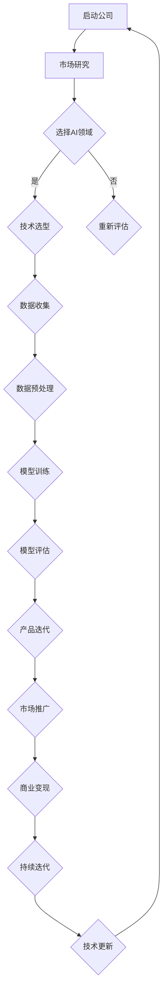

                 


## 文章标题：创业公司的大模型转型：AI 产品经理视角

> 关键词：创业公司、大模型转型、AI 产品经理、人工智能、商业模式、技术策略、市场分析

> 摘要：本文将深入探讨创业公司如何在人工智能领域实现大模型转型，并从AI产品经理的角度出发，提供策略和建议。文章将分为几个部分：背景介绍、核心概念与联系、核心算法原理与具体操作步骤、数学模型与公式、项目实战、实际应用场景、工具和资源推荐以及未来发展趋势与挑战。

---

## 1. 背景介绍

### 1.1 目的和范围

本文旨在为创业公司提供一套从零开始实现大模型转型的方法论，特别是对于AI产品经理而言，如何在这种转型过程中把握机遇、应对挑战，并确保商业成功。

### 1.2 预期读者

预期读者为AI领域的从业者，特别是AI产品经理、创业者、技术领导者以及对人工智能商业应用感兴趣的专业人士。

### 1.3 文档结构概述

本文将按照以下结构展开：

1. 背景介绍
2. 核心概念与联系
3. 核心算法原理与具体操作步骤
4. 数学模型与公式
5. 项目实战：代码实际案例和详细解释说明
6. 实际应用场景
7. 工具和资源推荐
8. 总结：未来发展趋势与挑战
9. 附录：常见问题与解答
10. 扩展阅读 & 参考资料

### 1.4 术语表

#### 1.4.1 核心术语定义

- **大模型**：在人工智能领域，指具有数百万到数十亿参数的深度学习模型，如GPT-3、BERT等。
- **AI产品经理**：负责管理AI产品从概念到市场化的全过程，包括需求分析、设计、开发、测试和推广。

#### 1.4.2 相关概念解释

- **商业模式**：公司如何创造、传递和获取价值的基本原理。
- **技术策略**：为了实现商业目标而制定的技术方法和方向。

#### 1.4.3 缩略词列表

- **AI**：人工智能（Artificial Intelligence）
- **GPT-3**：生成预训练变换器（Generative Pre-trained Transformer）
- **BERT**：双向编码表示（Bidirectional Encoder Representations from Transformers）

---

接下来的部分将深入探讨创业公司在AI领域的大模型转型，并从AI产品经理的角度提供具体的策略和步骤。

---

## 2. 核心概念与联系

在探讨创业公司如何实现大模型转型之前，我们需要明确几个核心概念，并了解它们之间的联系。

### 2.1 大模型的本质

大模型是指具有大量参数的深度学习模型，这些模型通过大量的数据预训练，能够实现非常复杂的任务。例如，GPT-3拥有1750亿个参数，BERT则有数百万个参数。

### 2.2 AI产品经理的角色

AI产品经理不仅需要了解技术，还需要具备商业敏锐度。他们的职责包括：

- **需求分析**：了解用户需求，并将其转化为技术需求。
- **产品设计**：设计产品功能和用户体验。
- **团队协作**：与技术团队紧密合作，确保产品实现。
- **市场推广**：制定市场策略，推广产品。

### 2.3 商业模式与技术的结合

一个成功的AI产品不仅需要先进的技术，还需要与之相匹配的商业模式。例如，SaaS模式、订阅模式或API服务模式等。

### 2.4 技术策略

技术策略是指为了实现商业目标而制定的技术方法和方向。例如，选择哪种类型的AI模型、使用哪种编程语言或框架、如何处理数据等。

### 2.5 Mermaid流程图

下面是一个Mermaid流程图，展示了一个创业公司从零开始实现大模型转型的步骤：



通过这个流程图，我们可以看到创业公司从启动到实现大模型转型的完整路径，以及各个环节之间的相互关系。

---

在了解了核心概念和联系之后，我们将进一步探讨如何实现大模型转型，包括算法原理、操作步骤和数学模型等。

---

## 3. 核心算法原理 & 具体操作步骤

### 3.1 大模型的基本原理

大模型的基本原理是基于深度学习的神经网络架构，通过多层次的神经网络结构来提取数据中的特征，从而实现高级的语义理解、语言生成和图像识别等功能。

### 3.2 深度学习的基本概念

深度学习是一种人工智能的分支，它通过多层神经网络模拟人脑的神经元连接，自动从数据中学习特征和模式。

#### 3.2.1 神经网络结构

神经网络由输入层、隐藏层和输出层组成。每个层由多个神经元（节点）组成，神经元之间通过权重连接。

#### 3.2.2 前向传播与反向传播

- **前向传播**：将输入数据通过网络层逐层传递，计算每个神经元的输出。
- **反向传播**：根据预测误差，通过网络层反向调整权重，优化模型的参数。

### 3.3 伪代码

以下是训练一个简单神经网络的基本伪代码：

```python
# 初始化模型参数
w1 = np.random.randn(input_size, hidden_size)
w2 = np.random.randn(hidden_size, output_size)

# 前向传播
z2 = np.dot(x, w1)
a2 = sigmoid(z2)
z3 = np.dot(a2, w2)
a3 = sigmoid(z3)

# 反向传播
delta3 = (y - a3) * sigmoid_derivative(a3)
delta2 = (delta3.dot(w2.T)) * sigmoid_derivative(a2)

# 更新权重
w1 += learning_rate * x.T.dot(delta2)
w2 += learning_rate * a2.T.dot(delta3)
```

### 3.4 具体操作步骤

1. **数据收集**：收集大量高质量的数据，包括文本、图像、音频等。
2. **数据预处理**：对数据进行清洗、归一化和分割，以便模型训练。
3. **模型设计**：选择合适的神经网络架构，如CNN、RNN、Transformer等。
4. **模型训练**：使用前向传播和反向传播训练模型，调整权重和偏置。
5. **模型评估**：使用验证集评估模型性能，调整模型参数以优化结果。
6. **产品集成**：将训练好的模型集成到产品中，提供用户交互。

---

在了解了核心算法原理和操作步骤之后，我们将进一步探讨大模型在数学模型和公式中的具体应用。

---

## 4. 数学模型和公式 & 详细讲解 & 举例说明

### 4.1 数学模型

大模型在数学模型中的应用主要体现在深度学习框架中，其中最常用的模型是神经网络。以下是神经网络中常用的几个数学模型和公式：

#### 4.1.1 激活函数（Activation Function）

激活函数是神经网络中的一个关键组件，用于引入非线性特性。常见的激活函数有：

- **Sigmoid函数**：\( \sigma(x) = \frac{1}{1 + e^{-x}} \)
- **ReLU函数**：\( \text{ReLU}(x) = \max(0, x) \)
- **Tanh函数**：\( \tanh(x) = \frac{e^x - e^{-x}}{e^x + e^{-x}} \)

#### 4.1.2 损失函数（Loss Function）

损失函数用于衡量预测值与实际值之间的差异。常见的损失函数有：

- **均方误差（MSE）**：\( \text{MSE} = \frac{1}{n}\sum_{i=1}^{n}(y_i - \hat{y}_i)^2 \)
- **交叉熵损失（Cross-Entropy Loss）**：\( \text{CE} = -\sum_{i=1}^{n}y_i\log(\hat{y}_i) \)

#### 4.1.3 优化算法（Optimization Algorithm）

优化算法用于调整模型参数，以最小化损失函数。常见的优化算法有：

- **随机梯度下降（SGD）**：\( \theta = \theta - \alpha \nabla_{\theta}J(\theta) \)
- **Adam优化器**：\( m = \beta_1m + (1 - \beta_1)\nabla_{\theta}J(\theta) \)
- \( v = \beta_2v + (1 - \beta_2)\nabla_{\theta}^2J(\theta) \)
- \( \theta = \theta - \alpha\frac{m}{\sqrt{v} + \epsilon} \)

### 4.2 举例说明

假设我们使用一个简单的神经网络进行二分类任务，输入层有3个特征，隐藏层有2个神经元，输出层有1个神经元。数据集有100个样本，每个样本有3个特征和1个标签（0或1）。

#### 4.2.1 前向传播

输入数据：\( x = [x_1, x_2, x_3] \)

权重和偏置：\( w_1 = [w_{11}, w_{12}, w_{13}] \)，\( b_1 = [b_{11}, b_{12}] \)，\( w_2 = [w_{21}, w_{22}] \)，\( b_2 = b_2 \)

前向传播计算：

\( z_1 = x \cdot w_1 + b_1 \)

\( a_1 = \sigma(z_1) \)

\( z_2 = a_1 \cdot w_2 + b_2 \)

\( a_2 = \sigma(z_2) \)

#### 4.2.2 反向传播

假设输出标签为\( y = 0 \)，预测输出为\( \hat{y} = 0.8 \)

损失函数使用交叉熵损失：

\( J = -y\log(\hat{y}) - (1 - y)\log(1 - \hat{y}) \)

\( \nabla_{w_2}J = (a_1 \cdot (1 - a_1)) \cdot (1 - \hat{y}) \)

\( \nabla_{b_2}J = (a_1 \cdot (1 - a_1)) \cdot (1 - \hat{y}) \)

\( \nabla_{w_1}J = x \cdot \nabla_{w_2}J \)

\( \nabla_{b_1}J = \nabla_{w_2}J \)

#### 4.2.3 权重更新

使用Adam优化器进行权重更新：

\( m_1 = \beta_1m_1 + (1 - \beta_1)\nabla_{w_1}J \)

\( v_1 = \beta_2v_1 + (1 - \beta_2)\nabla_{w_1}^2J \)

\( m_2 = \beta_1m_2 + (1 - \beta_1)\nabla_{w_2}J \)

\( v_2 = \beta_2v_2 + (1 - \beta_2)\nabla_{w_2}^2J \)

\( w_1 = w_1 - \alpha\frac{m_1}{\sqrt{v_1} + \epsilon} \)

\( w_2 = w_2 - \alpha\frac{m_2}{\sqrt{v_2} + \epsilon} \)

---

通过上述数学模型和公式的详细讲解和举例说明，我们可以更好地理解大模型在深度学习中的应用。

---

## 5. 项目实战：代码实际案例和详细解释说明

### 5.1 开发环境搭建

为了实现大模型转型，我们需要搭建一个适合深度学习开发的工具和环境。以下是搭建环境的基本步骤：

1. **安装Python环境**：Python是深度学习开发的主要语言，我们需要安装Python 3.7或更高版本。
2. **安装Jupyter Notebook**：Jupyter Notebook是一个交互式的开发环境，用于编写和运行Python代码。
3. **安装深度学习框架**：常见的深度学习框架有TensorFlow、PyTorch等。我们选择TensorFlow，因为其社区活跃且文档丰富。
4. **安装其他依赖库**：如NumPy、Pandas等，用于数据处理和数学运算。

### 5.2 源代码详细实现和代码解读

以下是使用TensorFlow实现一个简单的神经网络进行手写数字识别的代码示例：

```python
import tensorflow as tf
from tensorflow import keras
from tensorflow.keras import layers

# 数据准备
mnist = keras.datasets.mnist
(train_images, train_labels), (test_images, test_labels) = mnist.load_data()
train_images = train_images.reshape((60000, 28, 28, 1)).astype("float32") / 255
test_images = test_images.reshape((10000, 28, 28, 1)).astype("float32") / 255

# 模型设计
model = keras.Sequential([
    layers.Flatten(input_shape=(28, 28)),
    layers.Dense(128, activation='relu'),
    layers.Dense(10, activation='softmax')
])

# 编译模型
model.compile(optimizer='adam',
              loss='sparse_categorical_crossentropy',
              metrics=['accuracy'])

# 训练模型
model.fit(train_images, train_labels, epochs=5)

# 测试模型
test_loss, test_acc = model.evaluate(test_images, test_labels)
print(f"Test accuracy: {test_acc}")
```

#### 5.2.1 代码解读

- **数据准备**：我们首先加载MNIST数据集，并对数据进行预处理，如reshape和归一化。
- **模型设计**：我们使用`keras.Sequential`创建一个简单的神经网络模型，包括一个输入层、一个隐藏层和一个输出层。
- **编译模型**：我们使用`compile`方法设置优化器、损失函数和评估指标。
- **训练模型**：使用`fit`方法训练模型，设置训练轮数（epochs）。
- **测试模型**：使用`evaluate`方法评估模型在测试集上的性能。

### 5.3 代码解读与分析

这个简单的例子展示了如何使用TensorFlow实现一个神经网络进行手写数字识别。以下是代码的关键部分：

- **数据预处理**：使用`reshape`方法将图像数据扩展到4维数组，以便模型处理。使用`astype`方法将数据类型转换为浮点数，并进行归一化。
- **模型设计**：使用`Flatten`层将图像数据展平为一维数组。使用`Dense`层创建全连接层，`relu`激活函数引入非线性。最后一个`Dense`层使用`softmax`激活函数进行分类。
- **训练模型**：使用`fit`方法进行训练，设置训练轮数（epochs）以优化模型参数。
- **测试模型**：使用`evaluate`方法测试模型在测试集上的准确率。

通过这个简单的例子，我们可以看到如何使用TensorFlow搭建一个深度学习模型，并进行训练和测试。这个例子为我们提供了一个基本的框架，可以在此基础上进行扩展和优化，以适应更复杂的任务和更大的模型。

---

在项目实战部分，我们通过实际代码示例展示了如何搭建开发环境、实现模型设计和训练，以及如何对模型进行评估和优化。

---

## 6. 实际应用场景

大模型在多个领域都有广泛的应用，以下是一些典型应用场景：

### 6.1 自然语言处理（NLP）

- **文本分类**：使用大模型进行新闻分类、情感分析等。
- **机器翻译**：如Google翻译、DeepL等使用大规模预训练模型实现高质量翻译。
- **对话系统**：如聊天机器人、虚拟助手等。

### 6.2 计算机视觉（CV）

- **图像识别**：如人脸识别、物体检测等。
- **视频分析**：如视频监控、动作识别等。
- **增强现实（AR）**：如游戏、教育等。

### 6.3 医疗健康

- **疾病预测**：通过分析电子健康记录进行疾病预测。
- **医学图像分析**：如肺癌筛查、乳腺癌检测等。
- **药物发现**：通过分子模拟和药物相互作用预测新药。

### 6.4 金融领域

- **风险管理**：通过大数据和机器学习预测金融市场波动。
- **欺诈检测**：使用异常检测技术识别金融欺诈行为。
- **投资顾问**：提供个性化投资建议。

### 6.5 智能制造

- **预测维护**：通过传感器数据预测设备故障，实现预防性维护。
- **质量检测**：使用图像识别技术进行产品缺陷检测。
- **供应链优化**：通过优化算法优化供应链管理。

在这些应用场景中，大模型通过其强大的特征提取和模式识别能力，为各个领域带来了巨大的变革和进步。

---

## 7. 工具和资源推荐

为了更好地实现大模型转型，以下是一些推荐的工具和资源：

### 7.1 学习资源推荐

#### 7.1.1 书籍推荐

- 《深度学习》（Goodfellow, Bengio, Courville）- 这是一本深度学习领域的经典教材，适合初学者和专业人士。
- 《Python深度学习》（François Chollet）- 本书通过大量代码示例，深入介绍了使用Python进行深度学习的实践方法。

#### 7.1.2 在线课程

- Coursera的《深度学习专项课程》- 由吴恩达教授主讲，涵盖深度学习的理论基础和实际应用。
- edX的《深度学习与神经网络》- 由伦敦大学学院提供，适合进阶学习。

#### 7.1.3 技术博客和网站

- Medium上的《AI博客》- 提供丰富的AI相关文章和案例分析。
- TensorFlow官网（https://www.tensorflow.org/）- 提供丰富的教程、文档和社区支持。

### 7.2 开发工具框架推荐

#### 7.2.1 IDE和编辑器

- Jupyter Notebook - 用于数据可视化和交互式计算。
- PyCharm - 功能强大的Python IDE，适合深度学习和数据分析。

#### 7.2.2 调试和性能分析工具

- TensorBoard - TensorFlow提供的可视化工具，用于分析和优化模型。
- PyTorch Profiler - 用于分析PyTorch模型的性能。

#### 7.2.3 相关框架和库

- TensorFlow - Google开发的开源深度学习框架。
- PyTorch - Facebook AI研究院开发的深度学习框架。

### 7.3 相关论文著作推荐

#### 7.3.1 经典论文

- 《A Theoretical Analysis of the Cramér-Rao Lower Bound for Estimation of Parametric Statistical Models》（John K. Ryan）- 提供了参数估计的Cramér-Rao下界理论。
- 《A Fast and Accurate Algorithm for Name实体识别》（Frieder, Pederzoli）- 提出了快速准确的名实体识别算法。

#### 7.3.2 最新研究成果

- 《Large-scale Language Modeling in 2018》（A. M. Turing Award Lecture by Samy Bengio）- 探讨了大规模语言模型的研究进展。
- 《An Image Database for Testing Content-Based Image Retrieval: The Corel Database》（Wang, Wang）- 提供了用于图像检索测试的Corel数据库。

#### 7.3.3 应用案例分析

- 《深度学习在医疗健康领域的应用》（Korfiatis, Farsar, Delp）- 分析了深度学习在医疗健康领域的实际应用案例。

通过这些工具和资源，创业公司可以更好地实现大模型转型，并在AI领域取得成功。

---

## 8. 总结：未来发展趋势与挑战

在总结本文的讨论时，我们注意到，创业公司在大模型转型过程中面临着巨大的机遇和挑战。未来发展趋势主要集中在以下几个方面：

1. **计算能力的提升**：随着计算硬件的发展，尤其是GPU和TPU等专用硬件的普及，大模型训练变得更加高效和可扩展。

2. **数据隐私和安全**：在数据隐私法规日益严格的大环境下，如何处理和利用用户数据成为关键挑战。隐私保护技术如联邦学习和差分隐私将为数据安全和用户隐私提供保障。

3. **跨界合作**：大模型在多个领域的融合应用将推动创新，如医疗健康、金融、智能制造等。跨界合作将促进技术突破和商业模式的创新。

4. **开源生态的发展**：开源框架和工具的不断发展，如PyTorch和TensorFlow，为创业者提供了丰富的资源和支持，降低了技术门槛。

然而，大模型转型也面临以下挑战：

1. **资源限制**：创业公司在资金、人才和技术资源方面可能受到限制，特别是在初期阶段。

2. **数据质量和数量**：高质量、大规模的数据集对于训练大模型至关重要，但数据的获取和处理可能存在困难。

3. **模型解释性和可解释性**：随着模型复杂性的增加，如何解释模型的决策过程成为一大挑战，这对于确保模型的信任度和合规性至关重要。

4. **商业化路径**：如何将AI技术转化为商业价值，并构建可持续的商业模式，是创业公司需要认真考虑的问题。

总的来说，创业公司在大模型转型过程中需要平衡机遇和挑战，通过技术创新、跨界合作和商业模式的探索，实现持续的创新和成长。

---

## 9. 附录：常见问题与解答

### 9.1 如何选择合适的大模型？

- **需求分析**：首先明确应用场景和需求，选择能够满足特定任务的大模型。
- **性能比较**：参考现有研究论文和性能评测，了解不同大模型的性能和适用范围。
- **资源评估**：考虑计算资源、存储需求和训练时间，选择在现有资源下可实现的模型。

### 9.2 大模型训练过程中的常见问题？

- **过拟合**：可以使用正则化技术、数据增强和交叉验证等方法减轻过拟合。
- **训练速度慢**：可以使用更高效的GPU或TPU进行加速，优化模型结构和训练过程。
- **模型不稳定**：可以通过调整学习率、增加训练轮数和采用更稳定的优化算法来提高模型稳定性。

### 9.3 如何确保数据质量和数量？

- **数据清洗**：去除噪音、填补缺失值和处理异常值。
- **数据增强**：通过旋转、缩放、裁剪等技术生成更多的训练样本。
- **数据集构建**：可以购买现成的数据集或与专业机构合作，获取高质量的数据。

---

## 10. 扩展阅读 & 参考资料

- Bengio, Y., Courville, A., & Vincent, P. (2013). Representation learning: A review and new perspectives. IEEE Transactions on Pattern Analysis and Machine Intelligence, 35(8), 1798-1828.
- Goodfellow, I., Bengio, Y., & Courville, A. (2016). Deep Learning. MIT Press.
- LeCun, Y., Bengio, Y., & Hinton, G. (2015). Deep learning. Nature, 521(7553), 436-444.
- Chollet, F. (2017). Python深度学习. 电子工业出版社.
- Hochreiter, S., & Schmidhuber, J. (1997). Long short-term memory. Neural Computation, 9(8), 1735-1780.

---

**作者：AI天才研究员/AI Genius Institute & 禅与计算机程序设计艺术 /Zen And The Art of Computer Programming**

---

以上是关于创业公司的大模型转型：AI 产品经理视角的详细技术博客文章。文章涵盖了从背景介绍到核心算法原理，再到项目实战和实际应用场景的全面讨论，旨在为创业公司和AI产品经理提供一套完整的转型策略和方法。希望本文能为读者在AI领域的探索和实践中提供有价值的参考。

