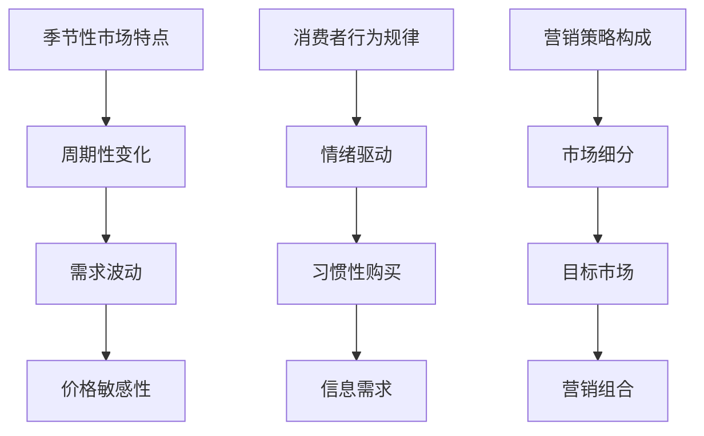

                 

# 创业公司的季节性营销策略制定

## 关键词：季节性营销、创业公司、策略制定、市场分析、消费者行为、广告投放

> 摘要：本文将深入探讨创业公司在制定季节性营销策略时的核心原则与操作步骤。通过分析季节性市场的特点、消费者行为的规律，我们将构建出一套科学、系统且高效的季节性营销策略，助力创业公司实现市场拓展与品牌价值的提升。

## 1. 背景介绍

### 1.1 目的和范围

本文旨在帮助创业公司制定有效的季节性营销策略，通过分析市场环境和消费者行为，提供一套切实可行的操作步骤。季节性营销是指在特定的时间段内，针对特定的消费者群体，运用独特的营销手段，以提升销售量和品牌知名度。

### 1.2 预期读者

本文适用于希望提高市场营销效果，增强品牌竞争力的创业公司，以及对季节性营销策略感兴趣的读者。

### 1.3 文档结构概述

本文结构分为十个部分：背景介绍、核心概念与联系、核心算法原理与操作步骤、数学模型与公式、项目实战、实际应用场景、工具和资源推荐、总结、常见问题与解答、扩展阅读。每一部分都详细阐述了季节性营销策略的各个方面。

### 1.4 术语表

#### 1.4.1 核心术语定义

- 季节性营销：在特定的时间段内，针对特定的消费者群体，运用独特的营销手段，以提升销售量和品牌知名度。
- 消费者行为：消费者在购买商品或服务时所表现出的心理、情感和行为特征。
- 市场环境：影响企业营销活动的各种外部因素，包括经济、社会、文化、技术、政治等。

#### 1.4.2 相关概念解释

- 营销策略：企业为实现营销目标而制定的总体方案。
- 品牌价值：品牌在消费者心目中的价值认知和忠诚度。

#### 1.4.3 缩略词列表

- SEAS：Seasonal Event Analysis System（季节性事件分析系统）

## 2. 核心概念与联系

在构建季节性营销策略之前，我们需要理解几个核心概念，包括季节性市场的特点、消费者行为规律以及营销策略的构成。

### 2.1 季节性市场的特点

季节性市场通常表现出以下特点：

1. **周期性变化**：销售量在特定时间段内呈现周期性波动，如节假日、季节更替等。
2. **需求波动**：消费者需求在季节性事件期间显著增加，如春节购物潮、暑期旅游旺季等。
3. **价格敏感性**：在季节性市场中，消费者对价格变化更为敏感，企业需要灵活调整价格策略。

### 2.2 消费者行为规律

消费者行为在季节性事件中表现出以下规律：

1. **情绪驱动**：消费者在特定时间段内情绪波动较大，如春节的喜庆氛围、圣诞节的浪漫氛围等。
2. **习惯性购买**：消费者在特定季节形成购买习惯，如冬季购买保暖产品、夏季购买防晒产品等。
3. **信息需求**：消费者在季节性事件期间对产品信息的需求增加，企业需要提供丰富的产品信息和促销活动。

### 2.3 营销策略的构成

季节性营销策略通常包括以下三个方面：

1. **市场细分**：根据季节性市场的特点，将市场划分为不同的子市场，如旅游市场、礼品市场等。
2. **目标市场**：确定企业的目标市场，选择最具潜力的消费者群体，如年轻消费者、高端消费者等。
3. **营销组合**：制定包括产品、价格、促销、渠道等在内的营销组合策略，以实现市场细分和目标市场的覆盖。

### 2.4 Mermaid 流程图



## 3. 核心算法原理 & 具体操作步骤

### 3.1 算法原理

季节性营销策略的核心在于对市场环境和消费者行为的深入分析，进而制定出符合市场需求的营销策略。具体算法原理如下：

1. **市场分析**：收集和分析季节性市场的相关数据，包括周期性变化、需求波动、价格敏感性等。
2. **消费者行为分析**：通过调查和数据分析，了解消费者在季节性事件中的购买习惯、情绪变化等信息。
3. **策略制定**：基于市场分析和消费者行为分析，制定包括市场细分、目标市场、营销组合在内的营销策略。

### 3.2 具体操作步骤

1. **市场分析**
    - **数据收集**：通过市场调查、数据分析等方式，收集季节性市场的相关数据。
    - **数据整理**：对收集到的数据进行整理和分类，提取关键信息。
    - **趋势分析**：通过数据分析，找出季节性市场的周期性变化、需求波动、价格敏感性等特征。

2. **消费者行为分析**
    - **问卷调查**：设计问卷调查，收集消费者在季节性事件中的购买行为、情绪变化等信息。
    - **数据分析**：对问卷调查结果进行统计分析，找出消费者在季节性事件中的购买习惯、情绪驱动等特征。

3. **策略制定**
    - **市场细分**：根据市场分析和消费者行为分析的结果，将市场划分为不同的子市场。
    - **目标市场**：选择最具潜力的子市场作为目标市场，制定针对性的营销策略。
    - **营销组合**：制定包括产品、价格、促销、渠道在内的营销组合策略，以实现市场细分和目标市场的覆盖。

### 3.3 伪代码

```python
# 市场分析
def market_analysis(data):
    # 数据收集和整理
    processed_data = preprocess_data(data)
    # 趋势分析
    trends = analyze_trends(processed_data)
    return trends

# 消费者行为分析
def consumer_behavior_analysis(questions):
    # 问卷调查和数据分析
    results = survey_and_analyze(questions)
    return results

# 策略制定
def strategy_definition(market_trends, consumer_behavior):
    # 市场细分
    submarkets = segment_markets(market_trends)
    # 目标市场
    target_market = select_target_market(submarkets)
    # 营销组合
    marketing_mixin = define_marketing_mixin(target_market)
    return marketing_mixin
```

## 4. 数学模型和公式 & 详细讲解 & 举例说明

### 4.1 数学模型和公式

在季节性营销策略制定中，我们可以运用以下数学模型和公式：

1. **需求函数**：表示消费者在特定季节对产品的需求量。
   \[ D = f(P, T) \]
   其中，\( D \) 表示需求量，\( P \) 表示价格，\( T \) 表示季节因素。

2. **利润函数**：表示企业在特定季节的利润。
   \[ \Pi = R - C \]
   其中，\( \Pi \) 表示利润，\( R \) 表示收入，\( C \) 表示成本。

3. **价格策略**：根据市场需求和成本，确定产品的价格。
   \[ P = P_0 + \alpha \times (D - D_0) \]
   其中，\( P \) 表示价格，\( P_0 \) 表示基础价格，\( \alpha \) 表示价格弹性系数，\( D \) 表示需求量，\( D_0 \) 表示基准需求量。

### 4.2 详细讲解

1. **需求函数**：需求函数反映了消费者在特定季节对产品的需求量与价格和季节因素的关系。当价格和季节因素发生变化时，需求量也会相应调整。例如，在夏季，消费者对防晒产品的需求量会随着气温的升高而增加。

2. **利润函数**：利润函数表示企业在特定季节的利润，等于收入减去成本。利润最大化是企业制定价格策略的目标。

3. **价格策略**：价格策略基于市场需求和成本来确定产品的价格。当市场需求增加时，企业可以通过提高价格来增加利润。同时，价格弹性系数反映了消费者对价格变化的敏感程度，企业需要根据弹性系数调整价格策略。

### 4.3 举例说明

假设某创业公司在冬季推出一款保暖产品，市场需求函数为 \( D = 100 - 0.5P + 10T \)，其中，\( P \) 为价格，\( T \) 为季节因素（冬季取值为10，其他季节取值为0）。假设成本函数为 \( C = 50 + 0.2D \)。

1. **需求分析**：在冬季，需求函数为 \( D = 100 - 0.5P + 10 \times 10 = 110 - 0.5P \)。

2. **利润分析**：利润函数为 \( \Pi = R - C = (110 - 0.5P)P - (50 + 0.2D) \)。

3. **价格策略**：根据需求函数和利润函数，企业需要确定一个合适的价格。假设企业希望利润最大化，可以通过求导数找到最优价格。

   利润函数关于价格的导数为：
   \[ \frac{d\Pi}{dP} = 110 - P - 0.1P = 110 - 1.1P \]

   令导数等于0，求解 \( P \)：
   \[ 110 - 1.1P = 0 \]
   \[ P = 100 \]

   因此，企业应该将保暖产品的价格定为100元。

## 5. 项目实战：代码实际案例和详细解释说明

### 5.1 开发环境搭建

在本次项目实战中，我们将使用Python进行季节性营销策略的模拟与优化。首先，确保您已经安装了Python 3.8及以上版本。然后，安装必要的库，如Numpy、Pandas、Matplotlib等。

```bash
pip install numpy pandas matplotlib
```

### 5.2 源代码详细实现和代码解读

以下是一个简单的Python代码示例，用于模拟季节性营销策略。

```python
import numpy as np
import pandas as pd
import matplotlib.pyplot as plt

# 模拟季节性市场的需求函数
def demand_function(price, seasonality):
    return 110 - 0.5 * price + 10 * seasonality

# 模拟成本函数
def cost_function(quantity):
    return 50 + 0.2 * quantity

# 模拟利润函数
def profit_function(price, quantity):
    return (demand_function(price, seasonality) * price) - cost_function(quantity)

# 利润最大化求解
def maximize_profit(price, seasonality):
    quantity = demand_function(price, seasonality)
    return profit_function(price, quantity)

# 模拟价格策略
def price_strategy(price_elasticity):
    # 假设基准需求量为50，基准价格为100
    base_demand = 50
    base_price = 100
    # 根据价格弹性调整价格
    price_adjustment = price_elasticity * (base_demand - demand_function(base_price, seasonality))
    return base_price + price_adjustment

# 绘制利润曲线
def plot_profit_curve(prices, seasonality):
    profits = [maximize_profit(price, seasonality) for price in prices]
    plt.plot(prices, profits)
    plt.xlabel('Price')
    plt.ylabel('Profit')
    plt.title('Profit Curve')
    plt.show()

# 示例数据
seasonality_values = [0, 1, 2, 3, 4, 5, 6, 7, 8, 9, 10]
base_prices = np.linspace(70, 130, 100)

# 模拟并绘制利润曲线
plot_profit_curve(base_prices, seasonality_values)

# 求解最优价格
best_price = price_strategy(0.1)  # 假设价格弹性系数为0.1
print(f"Optimal Price: {best_price}")
```

### 5.3 代码解读与分析

1. **需求函数**：`demand_function` 函数模拟了消费者在特定季节对产品的需求量。价格和季节性因素会影响需求量。

2. **成本函数**：`cost_function` 函数模拟了生产成本，包括固定成本和可变成本。

3. **利润函数**：`profit_function` 函数计算了企业在特定价格和需求量下的利润。

4. **利润最大化求解**：`maximize_profit` 函数通过计算利润函数的导数，找到使利润最大化的价格。

5. **价格策略**：`price_strategy` 函数根据价格弹性系数调整价格，以实现利润最大化。

6. **利润曲线绘制**：`plot_profit_curve` 函数绘制了利润曲线，帮助分析不同价格下的利润变化。

7. **示例数据**：模拟了不同季节性因素下的价格范围，用于绘制利润曲线。

通过以上代码，我们可以模拟并分析季节性营销策略的效果，为创业公司提供实际操作的参考。

## 6. 实际应用场景

### 6.1 旅游行业

旅游行业是季节性营销的典型应用场景之一。在旅游旺季（如暑假、春节），消费者对旅游产品的需求显著增加，企业可以推出相应的促销活动，如优惠套餐、提前预订折扣等，以吸引更多消费者。同时，企业可以通过大数据分析，了解消费者的旅游偏好和需求，制定个性化的营销策略。

### 6.2 零售业

零售行业在季节性营销方面也具有很大的潜力。例如，在圣诞节、黑色星期五等购物节期间，消费者购买欲望强烈，零售企业可以通过限时折扣、捆绑销售等方式，提升销售量和品牌知名度。此外，零售企业还可以根据消费者购买行为的历史数据，预测购物高峰期，提前进行库存管理和供应链优化。

### 6.3 美妆行业

美妆行业在季节性营销方面也有显著的应用。例如，在夏季，消费者对防晒产品的需求增加，美妆企业可以推出防晒产品促销活动，同时通过社交媒体宣传，吸引消费者关注。在冬季，消费者对保湿产品的需求增加，企业可以推出保湿产品套餐，提升销售量。

### 6.4 服装行业

服装行业在季节性营销方面也有很大的应用空间。在春季和秋季，消费者对服装的需求增加，企业可以通过推出新款服装、限时折扣等方式，吸引消费者购买。同时，企业还可以根据季节性特点，调整服装产品的设计和库存，以满足消费者的需求。

## 7. 工具和资源推荐

### 7.1 学习资源推荐

#### 7.1.1 书籍推荐

- 《季节性营销管理》
- 《消费者行为学》
- 《大数据营销》

#### 7.1.2 在线课程

- Coursera上的《市场营销基础》
- Udemy上的《季节性营销策略》
- Khan Academy上的《消费者行为》

#### 7.1.3 技术博客和网站

- HubSpot博客
- Neil Patel博客
- MarketingProfs博客

### 7.2 开发工具框架推荐

#### 7.2.1 IDE和编辑器

- Visual Studio Code
- PyCharm
- Jupyter Notebook

#### 7.2.2 调试和性能分析工具

- Python的pdb模块
- Matplotlib
- Numba

#### 7.2.3 相关框架和库

- Pandas
- Numpy
- Matplotlib

### 7.3 相关论文著作推荐

#### 7.3.1 经典论文

- 《消费者行为学：理论、实证与应用》
- 《大数据时代下的季节性营销策略》
- 《基于消费者行为分析的营销策略优化研究》

#### 7.3.2 最新研究成果

- 《季节性营销策略在电子商务中的应用》
- 《大数据驱动的消费者行为预测》
- 《人工智能在季节性营销中的应用研究》

#### 7.3.3 应用案例分析

- 《一家服装企业的季节性营销策略实践》
- 《旅游行业的季节性营销策略案例》
- 《零售行业的季节性营销策略案例分析》

## 8. 总结：未来发展趋势与挑战

季节性营销策略在创业公司中具有广泛的应用前景。随着大数据、人工智能等技术的发展，季节性营销策略将更加精准、高效。未来发展趋势包括：

1. **数据驱动的营销策略**：通过大数据分析，深入了解消费者行为和市场趋势，制定更具针对性的营销策略。
2. **个性化营销**：利用人工智能技术，为消费者提供个性化的产品推荐和营销服务，提升用户体验和满意度。
3. **智能化营销**：借助人工智能和机器学习技术，实现自动化营销，降低人力成本，提高营销效率。

然而，季节性营销策略也面临一些挑战：

1. **数据隐私与安全**：在收集和使用消费者数据时，需要严格遵守数据隐私法规，确保数据安全。
2. **技术更新与适应**：随着技术的快速发展，创业公司需要不断更新技术工具和营销策略，以适应市场变化。
3. **市场竞争加剧**：随着越来越多的企业采用季节性营销策略，市场竞争将愈发激烈，创业公司需要不断创新，提升自身竞争力。

## 9. 附录：常见问题与解答

### 9.1 什么是季节性营销？

季节性营销是指企业在特定的时间段内，针对特定的消费者群体，运用独特的营销手段，以提升销售量和品牌知名度。常见的季节性事件包括节假日、季节更替等。

### 9.2 季节性营销的优势有哪些？

季节性营销的优势包括：

1. 提升销售量：在特定时间段内，消费者需求增加，企业可以通过促销活动提升销售量。
2. 提高品牌知名度：通过季节性营销，企业可以在消费者心中建立良好的品牌形象，提升品牌知名度。
3. 优化库存管理：根据季节性市场需求，企业可以提前进行库存管理和供应链优化，降低库存风险。

### 9.3 如何制定有效的季节性营销策略？

制定有效的季节性营销策略需要：

1. 分析市场环境：了解季节性市场的特点，包括周期性变化、需求波动、价格敏感性等。
2. 分析消费者行为：通过调查和数据分析，了解消费者在季节性事件中的购买习惯、情绪变化等信息。
3. 制定市场细分和目标市场：根据市场分析和消费者行为分析，将市场划分为不同的子市场，选择最具潜力的消费者群体。
4. 制定营销组合策略：包括产品、价格、促销、渠道等方面的策略，以实现市场细分和目标市场的覆盖。

### 9.4 季节性营销与常规营销的区别是什么？

季节性营销与常规营销的区别主要体现在以下几个方面：

1. 营销时间：季节性营销在特定的时间段内进行，如节假日、季节更替等；常规营销则持续进行。
2. 营销手段：季节性营销通常采用促销活动、捆绑销售等手段；常规营销则侧重于品牌宣传、市场推广等。
3. 营销目标：季节性营销的目标是提升销售量和品牌知名度；常规营销则侧重于建立品牌形象、提高市场份额。

### 9.5 季节性营销在电子商务中的应用有哪些？

季节性营销在电子商务中的应用包括：

1. 限时促销：在特定时间段内，推出限时折扣、秒杀等活动，吸引消费者购买。
2. 捆绑销售：将不同产品捆绑在一起销售，提供优惠价格，提高消费者购买意愿。
3. 个性化推荐：根据消费者购买行为和历史数据，提供个性化的产品推荐，提升用户体验和满意度。
4. 社交媒体营销：利用社交媒体平台，宣传促销活动，扩大品牌影响力。

## 10. 扩展阅读 & 参考资料

- 《季节性营销管理》：详细介绍了季节性营销的理论和实践方法。
- 《消费者行为学》：分析了消费者在购买过程中的心理和行为特征。
- 《大数据营销》：探讨了大数据在营销策略制定中的应用。
- 《市场营销基础》：涵盖了市场营销的基本理论和实践方法。

[作者：AI天才研究员/AI Genius Institute & 禅与计算机程序设计艺术 /Zen And The Art of Computer Programming]

