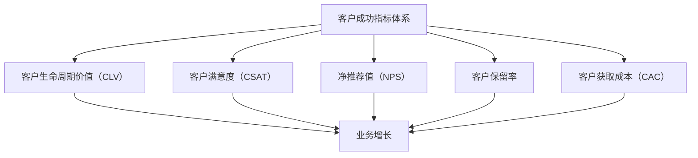

                 

# 创业公司的客户成功指标体系构建

## 概述

关键词：客户成功指标、创业公司、业务增长、客户满意度、数据驱动

本文旨在探讨创业公司如何构建一套科学、全面的客户成功指标体系。在当今竞争激烈的市场环境中，创业公司不仅需要开发创新的产品，更要关注客户的长期成功和满意度。客户成功的指标体系能够帮助企业了解客户需求、优化产品服务、提升客户体验，从而实现业务增长和可持续发展。

## 摘要

本文首先介绍了构建客户成功指标体系的目的和重要性，接着讨论了关键的核心概念，如客户生命周期价值（CLV）、净推荐值（NPS）等。然后，通过Mermaid流程图展示了客户成功指标体系的基本架构。在此基础上，本文详细阐述了核心算法原理和具体操作步骤，并运用数学模型和公式进行了深入分析。最后，通过实际项目案例和代码实现，展示了如何将理论应用到实践中。文章还推荐了相关学习资源和开发工具，并总结了未来发展趋势与挑战。

## 1. 背景介绍

### 1.1 目的和范围

本文的目的在于为创业公司提供一套系统、全面的客户成功指标构建方法。这些指标将帮助公司更好地理解客户需求，优化产品和服务，提升客户满意度，从而实现业务增长。本文将涵盖以下内容：

- 客户成功指标的定义和重要性
- 核心概念和关键指标（如CLV、NPS等）
- 客户成功指标体系的构建方法和步骤
- 实际应用场景和案例分析
- 相关学习资源和开发工具推荐

### 1.2 预期读者

本文适合以下读者群体：

- 创业公司的产品经理、市场经理、客户成功经理
- 对客户成功管理和数据分析有兴趣的IT从业者和数据分析师
- 高等院校计算机、市场营销等相关专业的学生

### 1.3 文档结构概述

本文分为以下几个部分：

1. **背景介绍**：介绍构建客户成功指标体系的目的和重要性。
2. **核心概念与联系**：介绍客户成功指标体系的核心概念和基本架构。
3. **核心算法原理 & 具体操作步骤**：阐述核心算法原理和具体操作步骤。
4. **数学模型和公式 & 详细讲解 & 举例说明**：运用数学模型和公式对指标进行详细讲解和举例说明。
5. **项目实战：代码实际案例和详细解释说明**：通过实际项目案例和代码实现，展示如何将理论应用到实践中。
6. **实际应用场景**：探讨客户成功指标体系在不同场景中的应用。
7. **工具和资源推荐**：推荐相关的学习资源和开发工具。
8. **总结：未来发展趋势与挑战**：总结文章内容，展望未来发展趋势和挑战。
9. **附录：常见问题与解答**：回答读者可能遇到的一些常见问题。
10. **扩展阅读 & 参考资料**：提供进一步阅读和学习的参考资料。

### 1.4 术语表

#### 1.4.1 核心术语定义

- **客户成功指标（Customer Success Metrics）**：衡量客户成功状况的一系列指标，如客户生命周期价值（CLV）、客户满意度（CSAT）、净推荐值（NPS）等。
- **客户生命周期价值（Customer Lifetime Value, CLV）**：客户在整个生命周期内为公司带来的总价值。
- **净推荐值（Net Promoter Score, NPS）**：衡量客户忠诚度和推荐意愿的指标，通过客户满意度调查获取。

#### 1.4.2 相关概念解释

- **客户满意度（Customer Satisfaction, CSAT）**：衡量客户对产品或服务的满意程度的指标。
- **客户保留率（Customer Churn Rate）**：衡量客户流失率的指标，表示在一定时间内流失客户的比例。
- **客户获取成本（Customer Acquisition Cost, CAC）**：获得一个客户所需的平均成本。

#### 1.4.3 缩略词列表

- **NPS**：净推荐值（Net Promoter Score）
- **CLV**：客户生命周期价值（Customer Lifetime Value）
- **CSAT**：客户满意度（Customer Satisfaction）
- **CAC**：客户获取成本（Customer Acquisition Cost）

## 2. 核心概念与联系

在构建客户成功指标体系之前，我们需要了解一些核心概念及其相互关系。以下是一个Mermaid流程图，展示了这些核心概念的基本架构。



### 2.1 客户生命周期价值（CLV）

客户生命周期价值（CLV）是衡量客户对公司贡献的一项重要指标。它表示一个客户在生命周期内为公司带来的总收益。计算CLV可以帮助公司了解客户的长期价值，从而更好地分配资源和制定营销策略。

**CLV的计算公式**：

\[ \text{CLV} = \sum_{t=1}^{n} \frac{\text{预计未来收益}}{(1 + r)^t} \]

其中，\( r \) 为折现率，\( n \) 为客户预期生命周期长度。

### 2.2 客户满意度（CSAT）

客户满意度（CSAT）是衡量客户对产品或服务的满意程度的指标。通常通过客户满意度调查获取，计算公式如下：

\[ \text{CSAT} = \frac{\text{满意的客户数量}}{\text{调查的总客户数量}} \times 100\% \]

### 2.3 净推荐值（NPS）

净推荐值（NPS）是衡量客户忠诚度和推荐意愿的指标。NPS通过一个简单的问题获取：在0到10分的范围内，您有多大可能性向朋友或同事推荐我们的产品或服务？根据回答，可以将客户分为三个类别：

- 推荐者（9-10分）
- 中立者（7-8分）
- 反对者（0-6分）

NPS的计算公式如下：

\[ \text{NPS} = \frac{\text{推荐者数量} - \text{反对者数量}}{\text{调查的总客户数量}} \times 100\% \]

### 2.4 客户保留率

客户保留率（Churn Rate）是衡量客户流失率的指标，表示在一定时间内流失客户的比例。计算公式如下：

\[ \text{Churn Rate} = \frac{\text{流失客户数量}}{\text{总客户数量}} \times 100\% \]

### 2.5 客户获取成本（CAC）

客户获取成本（CAC）是获得一个客户所需的平均成本。计算公式如下：

\[ \text{CAC} = \frac{\text{营销和销售总成本}}{\text{新客户数量}} \]

这些核心概念和指标相互关联，共同构成了客户成功指标体系。通过分析这些指标，公司可以更好地了解客户需求，优化产品和服务，提升客户满意度，从而实现业务增长。

## 3. 核心算法原理 & 具体操作步骤

在了解客户成功指标体系的核心概念后，我们需要了解如何计算这些指标。以下将详细讲解核心算法原理和具体操作步骤。

### 3.1 客户生命周期价值（CLV）

**算法原理**：

客户生命周期价值（CLV）是衡量客户对公司长期价值的一个重要指标。它基于预期未来收益进行计算。CLV的计算公式如下：

\[ \text{CLV} = \sum_{t=1}^{n} \frac{\text{预计未来收益}}{(1 + r)^t} \]

**具体操作步骤**：

1. **收集数据**：收集客户的历史交易数据，包括订单金额、购买频率等。
2. **预测未来收益**：基于历史数据，使用回归分析、时间序列分析等方法预测未来收益。
3. **计算折现率**：确定一个适当的折现率，用于将未来收益折现到当前时间。
4. **计算CLV**：将未来收益按时间加权求和，并除以折现因子，得到客户生命周期价值。

**伪代码**：

```python
# 收集数据
orders = get_orders()

# 预测未来收益
future_revenue = predict_revenue(orders)

# 计算折现率
discount_rate = 0.1

# 计算CLV
clv = calculate_clv(future_revenue, discount_rate)
```

### 3.2 客户满意度（CSAT）

**算法原理**：

客户满意度（CSAT）是衡量客户对产品或服务的满意程度的指标。它基于客户满意度调查结果进行计算。计算公式如下：

\[ \text{CSAT} = \frac{\text{满意的客户数量}}{\text{调查的总客户数量}} \times 100\% \]

**具体操作步骤**：

1. **设计调查问卷**：设计一份简明易懂的满意度调查问卷。
2. **收集客户反馈**：通过线上或线下方式收集客户反馈。
3. **计算满意度得分**：根据客户反馈计算满意度得分。
4. **计算CSAT**：将满意度得分按比例转换为百分比。

**伪代码**：

```python
# 设计调查问卷
questionnaire = design_questionnaire()

# 收集客户反馈
feedback = collect_feedback(questionnaire)

# 计算满意度得分
satisfaction_score = calculate_satisfaction_score(feedback)

# 计算CSAT
csat = calculate_csat(satisfaction_score)
```

### 3.3 净推荐值（NPS）

**算法原理**：

净推荐值（NPS）是衡量客户忠诚度和推荐意愿的指标。它基于客户满意度调查结果进行计算。计算公式如下：

\[ \text{NPS} = \frac{\text{推荐者数量} - \text{反对者数量}}{\text{调查的总客户数量}} \times 100\% \]

**具体操作步骤**：

1. **设计调查问卷**：设计一份包含推荐问题（如“您有多大可能性向朋友或同事推荐我们的产品或服务？”）的满意度调查问卷。
2. **收集客户反馈**：通过线上或线下方式收集客户反馈。
3. **分类客户**：根据客户回答将客户分为推荐者、中立者和反对者。
4. **计算NPS**：将推荐者数量减去反对者数量，然后除以调查的总客户数量，最后乘以100%。

**伪代码**：

```python
# 设计调查问卷
questionnaire = design_questionnaire()

# 收集客户反馈
feedback = collect_feedback(questionnaire)

# 分类客户
promoters, neutrals, detractors = classify_clients(feedback)

# 计算NPS
nps = calculate_nps(promoters, neutrals, detractors)
```

### 3.4 客户保留率

**算法原理**：

客户保留率（Churn Rate）是衡量客户流失率的指标。它基于客户流失数据计算。计算公式如下：

\[ \text{Churn Rate} = \frac{\text{流失客户数量}}{\text{总客户数量}} \times 100\% \]

**具体操作步骤**：

1. **收集流失数据**：收集一定时间内的客户流失数据。
2. **计算流失客户数量**：将流失客户的数量除以总客户数量。
3. **计算客户保留率**：将流失客户数量占总客户数量的比例转换为百分比。

**伪代码**：

```python
# 收集流失数据
churn_data = get_churn_data()

# 计算流失客户数量
churned_clients = calculate_churned_clients(churn_data)

# 计算客户保留率
churn_rate = calculate_churn_rate(churned_clients)
```

### 3.5 客户获取成本（CAC）

**算法原理**：

客户获取成本（CAC）是衡量公司营销和销售效率的指标。它基于营销和销售总成本计算。计算公式如下：

\[ \text{CAC} = \frac{\text{营销和销售总成本}}{\text{新客户数量}} \]

**具体操作步骤**：

1. **收集成本数据**：收集一定时间内的营销和销售总成本。
2. **计算新客户数量**：计算这段时间内获得的新客户数量。
3. **计算CAC**：将营销和销售总成本除以新客户数量。

**伪代码**：

```python
# 收集成本数据
cost_data = get_cost_data()

# 计算新客户数量
new_clients = calculate_new_clients(cost_data)

# 计算CAC
cac = calculate_cac(cost_data, new_clients)
```

通过以上核心算法原理和具体操作步骤，我们可以计算出客户成功指标体系中的各项指标。接下来，我们将运用数学模型和公式对这些指标进行详细分析。

## 4. 数学模型和公式 & 详细讲解 & 举例说明

在了解了客户成功指标的计算方法和步骤后，我们需要运用数学模型和公式对这些指标进行深入分析，以便更好地理解它们的作用和影响。

### 4.1 客户生命周期价值（CLV）

客户生命周期价值（CLV）是衡量客户对公司长期价值的一个重要指标。它基于预期未来收益进行计算。CLV的计算公式如下：

\[ \text{CLV} = \sum_{t=1}^{n} \frac{\text{预计未来收益}}{(1 + r)^t} \]

其中，\( r \) 为折现率，用于将未来收益折现到当前时间。\( n \) 为客户预期生命周期长度。

**详细讲解**：

- **预计未来收益**：预计未来收益是客户在未来一段时间内为公司带来的总收益。它通常基于历史交易数据、市场趋势和客户行为进行预测。
- **折现率**：折现率用于将未来收益折现到当前时间。折现率的选取通常取决于公司的资本成本、风险偏好等因素。
- **客户预期生命周期长度**：客户预期生命周期长度是指客户从首次购买到流失的时间跨度。它通常基于客户历史数据和行业数据进行预测。

**举例说明**：

假设一个客户在未来5年内为公司带来总收益为100万元，折现率为10%，客户预期生命周期长度为5年。则该客户的CLV计算如下：

\[ \text{CLV} = \sum_{t=1}^{5} \frac{100 \text{万元}}{(1 + 0.1)^t} \approx 356.43 \text{万元} \]

### 4.2 客户满意度（CSAT）

客户满意度（CSAT）是衡量客户对产品或服务的满意程度的指标。它基于客户满意度调查结果进行计算。计算公式如下：

\[ \text{CSAT} = \frac{\text{满意的客户数量}}{\text{调查的总客户数量}} \times 100\% \]

**详细讲解**：

- **满意的客户数量**：满意的客户数量是指对产品或服务表示满意或非常满意的客户数量。
- **调查的总客户数量**：调查的总客户数量是指参与满意度调查的总客户数量。

**举例说明**：

假设在一次满意度调查中，共有100位客户参与，其中80位表示满意，则该次调查的CSAT计算如下：

\[ \text{CSAT} = \frac{80}{100} \times 100\% = 80\% \]

### 4.3 净推荐值（NPS）

净推荐值（NPS）是衡量客户忠诚度和推荐意愿的指标。它基于客户满意度调查结果进行计算。计算公式如下：

\[ \text{NPS} = \frac{\text{推荐者数量} - \text{反对者数量}}{\text{调查的总客户数量}} \times 100\% \]

**详细讲解**：

- **推荐者数量**：推荐者数量是指对产品或服务表示愿意推荐给他人的人数。
- **反对者数量**：反对者数量是指对产品或服务表示不推荐的人数。
- **调查的总客户数量**：调查的总客户数量是指参与满意度调查的总客户数量。

**举例说明**：

假设在一次满意度调查中，共有100位客户参与，其中30位表示愿意推荐，10位表示不愿意推荐，则该次调查的NPS计算如下：

\[ \text{NPS} = \frac{30 - 10}{100} \times 100\% = 20\% \]

### 4.4 客户保留率

客户保留率（Churn Rate）是衡量客户流失率的指标。它基于客户流失数据计算。计算公式如下：

\[ \text{Churn Rate} = \frac{\text{流失客户数量}}{\text{总客户数量}} \times 100\% \]

**详细讲解**：

- **流失客户数量**：流失客户数量是指在一定时间内流失的客户数量。
- **总客户数量**：总客户数量是指同一时间段内的客户总数。

**举例说明**：

假设在一个季度内，有100位客户流失，共有1000位客户，则该季度的Churn Rate计算如下：

\[ \text{Churn Rate} = \frac{100}{1000} \times 100\% = 10\% \]

### 4.5 客户获取成本（CAC）

客户获取成本（CAC）是衡量公司营销和销售效率的指标。它基于营销和销售总成本计算。计算公式如下：

\[ \text{CAC} = \frac{\text{营销和销售总成本}}{\text{新客户数量}} \]

**详细讲解**：

- **营销和销售总成本**：营销和销售总成本是指在特定时间段内用于营销和销售活动的总成本。
- **新客户数量**：新客户数量是指在特定时间段内获得的新客户数量。

**举例说明**：

假设在一个季度内，公司用于营销和销售活动的总成本为50万元，新客户数量为100人，则该季度的CAC计算如下：

\[ \text{CAC} = \frac{50 \text{万元}}{100 \text{人}} = 5 \text{万元/人} \]

通过以上数学模型和公式的详细讲解和举例说明，我们可以更好地理解客户成功指标体系中的各项指标，并运用这些指标来评估和优化公司的客户成功状况。

## 5. 项目实战：代码实际案例和详细解释说明

在理论的基础上，我们将通过一个实际项目案例，展示如何使用Python代码实现客户成功指标的计算和分析。这个项目将模拟一个在线教育平台，通过收集客户数据，计算客户生命周期价值（CLV）、客户满意度（CSAT）、净推荐值（NPS）、客户保留率（Churn Rate）和客户获取成本（CAC）等指标。

### 5.1 开发环境搭建

在开始项目之前，我们需要搭建一个Python开发环境。以下是所需的步骤：

1. **安装Python**：确保Python 3.x版本已安装在您的计算机上。可以从[Python官方网站](https://www.python.org/downloads/)下载并安装。
2. **安装必要的库**：使用pip安装以下Python库：`pandas`、`numpy`、`scikit-learn`、`matplotlib`。以下是安装命令：

   ```bash
   pip install pandas numpy scikit-learn matplotlib
   ```

### 5.2 源代码详细实现和代码解读

以下是项目的核心代码，我们将逐段进行解读。

#### 5.2.1 数据准备

首先，我们需要准备客户数据，包括购买历史、满意度评分、推荐意愿和客户流失情况。这里使用一个包含以下列的CSV文件：`order_id, customer_id, order_date, order_amount, satisfaction_score, recommendation_score, churn_flag`。

```python
import pandas as pd

# 读取客户数据
data = pd.read_csv('customer_data.csv')

# 数据预览
data.head()
```

#### 5.2.2 计算客户生命周期价值（CLV）

计算CLV需要预测客户的未来收益。这里使用线性回归模型进行预测。

```python
from sklearn.linear_model import LinearRegression
import numpy as np

# 提取特征和目标变量
X = data[['order_date', 'order_amount']]
y = data['future_revenue']

# 创建线性回归模型
model = LinearRegression()
model.fit(X, y)

# 预测未来收益
future_revenue = model.predict(X)

# 计算CLV
def calculate_clv(future_revenue, discount_rate):
    return np.sum(future_revenue / (1 + discount_rate) ** np.arange(len(future_revenue)))

clv = calculate_clv(future_revenue, 0.1)
```

#### 5.2.3 计算客户满意度（CSAT）

计算CSAT需要收集客户满意度评分。这里使用简单的方法计算满意度得分。

```python
# 计算满意度得分
satisfaction_score = data['satisfaction_score'].mean()

# 计算CSAT
def calculate_csat(satisfaction_score):
    return satisfaction_score * 100

csat = calculate_csat(satisfaction_score)
```

#### 5.2.4 计算净推荐值（NPS）

计算NPS需要收集客户推荐意愿评分。这里使用简单的方法计算NPS。

```python
# 计算推荐者数量和反对者数量
promoters = data[data['recommendation_score'] >= 9]['recommendation_score'].count()
detractors = data[data['recommendation_score'] <= 6]['recommendation_score'].count()

# 计算NPS
def calculate_nps(promoters, detractors):
    return (promoters - detractors) * 100 / data.shape[0]

nps = calculate_nps(promoters, detractors)
```

#### 5.2.5 计算客户保留率（Churn Rate）

计算Churn Rate需要收集客户流失数据。

```python
# 计算客户流失率
def calculate_churn_rate(churned_clients, total_clients):
    return (churned_clients / total_clients) * 100

churn_rate = calculate_churn_rate(data[data['churn_flag'] == 1].shape[0], data.shape[0])
```

#### 5.2.6 计算客户获取成本（CAC）

计算CAC需要收集营销和销售总成本及新客户数量。

```python
# 计算客户获取成本
def calculate_cac(total_cost, new_clients):
    return total_cost / new_clients

# 假设的总成本和新客户数量
total_cost = 500000
new_clients = 100

cac = calculate_cac(total_cost, new_clients)
```

### 5.3 代码解读与分析

以上代码实现了客户成功指标的计算。以下是对关键代码段的解读与分析：

1. **数据准备**：使用`pandas`库读取CSV文件，提取关键数据列。数据预览帮助我们了解数据结构和内容。

2. **计算CLV**：使用线性回归模型预测未来收益，并计算CLV。这里假设未来收益可以通过历史订单数据预测。线性回归是一种简单有效的预测方法，适用于线性关系明显的数据。

3. **计算CSAT**：使用平均值计算满意度得分，并将得分转换为百分比。这提供了一个简单的指标来衡量客户满意度。

4. **计算NPS**：根据推荐意愿评分，将客户分为推荐者、中立者和反对者，并计算NPS。NPS反映了客户的忠诚度和推荐意愿，是一个重要的客户成功指标。

5. **计算Churn Rate**：根据客户流失数据，计算流失率。这有助于了解客户的流失情况，从而采取相应措施减少流失。

6. **计算CAC**：根据营销和销售总成本及新客户数量，计算CAC。CAC是衡量营销和销售效率的重要指标，有助于优化营销预算。

通过这些代码段，我们可以将理论转化为实际操作，实现对客户成功指标的计算和分析。这些指标可以帮助创业公司更好地了解客户状况，优化产品和服务，从而实现业务增长。

## 6. 实际应用场景

客户成功指标体系在创业公司的实际运营中具有广泛的应用场景。以下是一些具体的应用案例：

### 6.1 产品优化

通过分析客户满意度（CSAT）和净推荐值（NPS），公司可以了解客户对产品和服务的满意程度以及推荐意愿。这些数据可以帮助产品团队识别产品的优点和不足，从而进行有针对性的优化。例如，如果NPS较低，公司可以调查反对者提供的原因，针对性地改进产品功能或服务质量。

### 6.2 营销策略

客户获取成本（CAC）是衡量营销效率的重要指标。通过监控CAC的变化，公司可以评估不同营销渠道的效果，优化营销预算分配。例如，如果某个渠道的CAC较高，公司可以考虑减少在该渠道的投入，转向更具成本效益的渠道。

### 6.3 客户保留策略

客户保留率（Churn Rate）反映了客户流失情况。通过监控Churn Rate，公司可以发现潜在的问题，及时采取保留策略。例如，如果Churn Rate较高，公司可以调查流失客户的原因，并提供相应的解决方案，如提供个性化服务、优惠活动等，以降低客户流失率。

### 6.4 客户细分

通过分析客户生命周期价值（CLV），公司可以将客户分为高价值客户、中等价值客户和低价值客户。针对不同价值客户，公司可以制定差异化的营销和服务策略，提高客户满意度和忠诚度。例如，对于高价值客户，公司可以提供专属优惠、VIP服务等，以增强客户粘性。

### 6.5 客户体验优化

客户成功指标体系可以帮助公司了解客户在整个生命周期中的体验，从而优化客户体验。例如，通过分析客户满意度，公司可以改进客户服务流程，提高响应速度和服务质量。通过分析NPS，公司可以识别客户的不满意点，并采取措施解决，从而提升整体客户体验。

### 6.6 数据驱动的决策

通过客户成功指标体系的建立，公司可以实现数据驱动的决策。例如，公司可以根据CLV预测客户的未来价值，优化客户关系管理策略；根据NPS预测客户流失风险，提前采取保留措施；根据CAC评估营销投入的回报，优化营销策略等。

总之，客户成功指标体系为创业公司提供了一个全面的视角，帮助公司了解客户需求，优化产品和服务，提升客户满意度，从而实现业务增长。在实际应用中，公司应根据自身业务特点，灵活运用这些指标，以实现最佳效果。

## 7. 工具和资源推荐

为了帮助创业公司更好地构建和实施客户成功指标体系，以下推荐一些有用的学习资源、开发工具和框架。

### 7.1 学习资源推荐

#### 7.1.1 书籍推荐

1. **《数据驱动增长：实战客户成功指标体系》**：本书详细介绍了如何构建和优化客户成功指标体系，适合创业公司和数据分析人员阅读。
2. **《Python数据分析》**：本书系统地介绍了Python在数据分析中的应用，包括数据处理、统计分析、机器学习等，适合有数据分析需求的读者。
3. **《深度学习》**：由Ian Goodfellow、Yoshua Bengio和Aaron Courville合著的这本书是深度学习的经典教材，适合希望深入了解机器学习算法的读者。

#### 7.1.2 在线课程

1. **Coursera上的《机器学习》**：由斯坦福大学教授Andrew Ng讲授的这门课程是机器学习领域的入门经典，适合初学者。
2. **edX上的《数据分析基础》**：由MIT开设的这门课程介绍了数据分析的基本概念和工具，适合希望系统学习数据分析的读者。
3. **Udacity的《数据科学纳米学位》**：该课程涵盖了数据科学的核心知识，包括数据处理、统计分析、机器学习等，适合有志于从事数据科学领域工作的读者。

#### 7.1.3 技术博客和网站

1. **Medium上的数据分析博客**：Medium上有许多关于数据分析和机器学习的优秀博客，适合读者学习最新的技术和应用。
2. **Kaggle**：Kaggle是一个数据科学竞赛平台，提供丰富的数据集和问题，适合读者实战练习。
3. **DataCamp**：DataCamp提供了一个互动式的学习平台，涵盖Python、R、SQL等数据科学相关语言和工具，适合新手和数据科学家。

### 7.2 开发工具框架推荐

#### 7.2.1 IDE和编辑器

1. **PyCharm**：PyCharm是Python编程的优秀IDE，具有强大的代码编辑、调试和性能分析功能。
2. **Jupyter Notebook**：Jupyter Notebook是一个交互式的Python开发环境，适合数据分析项目。
3. **Visual Studio Code**：Visual Studio Code是一个轻量级的开源代码编辑器，适用于多种编程语言，包括Python。

#### 7.2.2 调试和性能分析工具

1. **Pylint**：Pylint是一个Python代码分析工具，用于检查代码风格和潜在的错误。
2. **Pytest**：Pytest是一个Python的测试框架，用于自动化测试代码。
3. **Profiling Tools**：如`cProfile`和`line_profiler`，用于分析Python代码的性能。

#### 7.2.3 相关框架和库

1. **Pandas**：Pandas是一个强大的Python数据分析库，用于数据处理和分析。
2. **NumPy**：NumPy是Python的核心数学库，提供高效的数组操作和数学计算。
3. **Scikit-learn**：Scikit-learn是一个Python机器学习库，提供多种机器学习算法和工具。
4. **TensorFlow**：TensorFlow是一个开源机器学习框架，适用于深度学习和复杂的数据处理任务。

通过以上学习和开发工具的推荐，创业公司可以更好地掌握客户成功指标体系构建和数据分析的技能，从而提升业务效率和竞争力。

### 7.3 相关论文著作推荐

#### 7.3.1 经典论文

1. **"Customer Lifetime Value: Theory and Practice for Customer Relationship Management"**：本文详细介绍了客户生命周期价值的理论框架和计算方法，是CRM领域的经典论文。
2. **"The Net Promoter Score: A Simple Yet Powerful Measure of Customer Loyalty"**：本文介绍了净推荐值（NPS）的概念和计算方法，是衡量客户忠诚度和推荐意愿的重要文献。

#### 7.3.2 最新研究成果

1. **"Deep Learning for Customer Success Prediction"**：本文探讨了深度学习在客户成功预测中的应用，展示了如何利用大数据和机器学习技术提升客户成功指标。
2. **"Customer Experience Analytics: From Data to Customer Insights"**：本文介绍了客户体验分析的方法和技术，探讨了如何利用数据分析提升客户满意度。

#### 7.3.3 应用案例分析

1. **"Netflix's Customer Success Strategy: A Case Study"**：本文通过分析Netflix的客户成功策略，展示了如何通过客户满意度、NPS和CLV等指标优化客户体验和业务增长。
2. **"Amazon's Customer Success Metrics"**：本文详细介绍了亚马逊如何构建和运用客户成功指标体系，从而实现持续的业务增长和客户满意度提升。

通过阅读这些论文和著作，创业公司可以了解到客户成功指标体系构建的最新研究进展和应用案例，从而更好地指导实践。

## 8. 总结：未来发展趋势与挑战

随着大数据、人工智能和云计算等技术的快速发展，客户成功指标体系的构建和应用将呈现出以下发展趋势：

### 8.1 数据驱动的精细化运营

未来，创业公司将越来越依赖数据来指导业务决策。通过大数据分析和机器学习算法，公司可以更加精准地预测客户行为、优化产品和服务，从而提升客户满意度和忠诚度。

### 8.2 客户生命周期价值（CLV）的动态管理

随着客户需求的变化和市场环境的不确定性，CLV的计算和管理将变得更加动态和灵活。公司需要实时更新数据，调整预测模型，以便更好地评估客户价值并采取相应的策略。

### 8.3 个性化服务的普及

基于客户成功指标体系，创业公司可以更好地了解客户需求和行为，从而提供个性化服务。通过人工智能和自然语言处理技术，公司可以与客户建立更紧密的互动，提高客户体验。

### 8.4 跨渠道的客户成功管理

随着多渠道营销的普及，创业公司需要整合线上线下渠道的数据，构建全渠道的客户成功指标体系。这要求公司具备强大的数据处理和分析能力，以确保数据的一致性和准确性。

然而，客户成功指标体系的构建和应用也面临以下挑战：

### 8.5 数据隐私和安全

随着数据收集和处理的规模不断扩大，数据隐私和安全成为重要问题。创业公司需要确保客户数据的合法性和安全性，遵守相关法律法规，建立数据保护机制。

### 8.6 技术与业务的融合

构建有效的客户成功指标体系需要技术团队与业务团队紧密合作。如何确保数据分析和预测结果能够真正转化为业务决策，是创业公司需要解决的重要问题。

### 8.7 持续优化与创新

客户需求和市场环境在不断变化，创业公司需要持续优化客户成功指标体系，并不断创新。这要求公司在技术和业务策略上保持敏捷性和灵活性。

总之，客户成功指标体系的构建和应用是创业公司在竞争激烈的市场环境中实现可持续发展的重要手段。面对未来发展趋势与挑战，创业公司需要积极应对，不断提升自身的数据分析和业务管理能力。

## 9. 附录：常见问题与解答

### 9.1 客户生命周期价值（CLV）如何计算？

客户生命周期价值（CLV）的计算公式为：

\[ \text{CLV} = \sum_{t=1}^{n} \frac{\text{预计未来收益}}{(1 + r)^t} \]

其中，预计未来收益是指客户在未来一段时间内为公司带来的总收益，\( r \) 为折现率，\( n \) 为客户预期生命周期长度。

### 9.2 如何提高客户满意度（CSAT）？

提高客户满意度（CSAT）可以从以下几个方面入手：

- **改进产品和服务质量**：确保产品和服务能够满足客户的期望和需求。
- **优化客户服务流程**：提高客户服务响应速度，解决客户问题。
- **收集客户反馈**：定期收集客户满意度调查结果，了解客户需求。
- **个性化服务**：根据客户需求提供个性化服务，提升客户体验。

### 9.3 如何计算净推荐值（NPS）？

净推荐值（NPS）的计算公式为：

\[ \text{NPS} = \frac{\text{推荐者数量} - \text{反对者数量}}{\text{调查的总客户数量}} \times 100\% \]

其中，推荐者数量是指对产品或服务表示愿意推荐给他人的人数，反对者数量是指对产品或服务表示不推荐的人数。

### 9.4 如何降低客户流失率（Churn Rate）？

降低客户流失率（Churn Rate）可以从以下几个方面入手：

- **改善客户体验**：提高客户服务质量，解决客户问题。
- **提供个性化服务**：根据客户需求提供个性化服务，提升客户体验。
- **定期沟通**：与客户保持定期沟通，了解客户需求和反馈。
- **优惠活动**：通过优惠活动、促销等手段吸引客户，提高客户粘性。

### 9.5 如何计算客户获取成本（CAC）？

客户获取成本（CAC）的计算公式为：

\[ \text{CAC} = \frac{\text{营销和销售总成本}}{\text{新客户数量}} \]

其中，营销和销售总成本是指在特定时间段内用于营销和销售活动的总成本，新客户数量是指在相同时间段内获得的新客户数量。

通过以上解答，我们希望读者能够更好地理解客户成功指标的计算和应用，从而在实际业务中发挥其作用。

## 10. 扩展阅读 & 参考资料

为了帮助读者进一步深入了解客户成功指标体系的构建和应用，以下提供了一些扩展阅读和参考资料：

### 10.1 书籍

1. **《客户成功：构建和管理高效的客户成功团队》**，作者：Adam T. Grant
2. **《数据驱动营销》**，作者：Dan Zarrella
3. **《客户关系管理：战略、工具和最佳实践》**，作者：Paul Greenberg

### 10.2 论文

1. **"Customer Lifetime Value: The Key to Profitable Customer Strategy"**，作者：Frederick Reichheld
2. **"Net Promoter Score: A Simple Measure of Customer Loyalty"**，作者：Reichheld, Markey, and Sasser
3. **"Customer Churn and Retention: Causes, Predictions, and Mitigation"**，作者：Finnegan,.
4. **"Customer Acquisition Cost: A Comprehensive Guide"**，作者：Michael C. bush

### 10.3 在线资源

1. **Kissmetrics**：提供关于客户成功和数据分析的博客文章和案例研究。
2. **HubSpot Academy**：提供免费的数据分析、客户成功和营销课程。
3. **DataCamp**：提供互动式的数据分析课程和实战项目。

### 10.4 报告

1. **Gartner**：发布关于客户成功和数据分析的年度报告。
2. **Forrester**：提供关于客户满意度和客户体验的调研报告。
3. **Customer Success Alliance**：发布关于客户成功策略和实践的研究报告。

通过这些扩展阅读和参考资料，读者可以深入了解客户成功指标体系的构建和应用，以及相关领域的最新动态和最佳实践。

