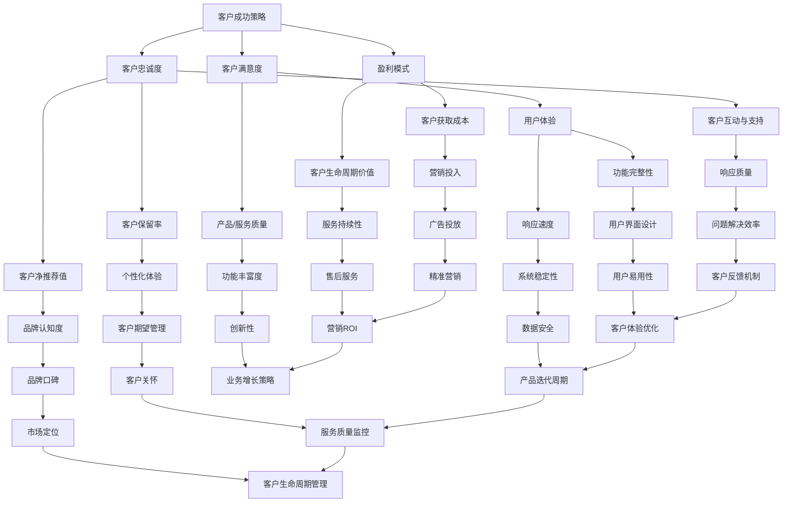

                 

# 创业公司的客户成功策略

> 关键词：客户成功策略、创业公司、客户关系管理、用户体验、盈利模式

> 摘要：本文将深入探讨创业公司在快速发展的市场中如何制定和实施有效的客户成功策略，以确保客户满意度、忠诚度和业务增长。文章将分步骤分析客户成功策略的核心概念、关键因素以及具体实践方法，旨在为创业者提供实用的指导。

## 1. 背景介绍

### 1.1 目的和范围

本文旨在为创业公司提供一套系统化的客户成功策略框架，帮助公司在激烈的市场竞争中脱颖而出。我们将探讨以下主题：

- 客户成功策略的定义和重要性
- 创业公司在客户成功管理中的挑战和机遇
- 客户成功策略的核心要素和实施步骤
- 实战案例分析：成功和失败的经验教训
- 未来发展趋势和挑战

### 1.2 预期读者

本文适合以下读者：

- 创业公司创始人、CEO、CTO
- 销售和客户成功团队负责人
- 市场营销和产品管理人员
- 对客户关系管理和业务增长感兴趣的技术人员

### 1.3 文档结构概述

本文结构如下：

1. 背景介绍：目的和范围、预期读者、文档结构概述
2. 核心概念与联系：客户成功策略的基本原理和关键因素
3. 核心算法原理 & 具体操作步骤：制定和执行客户成功策略的方法论
4. 数学模型和公式 & 详细讲解 & 举例说明：量化客户成功策略的效果
5. 项目实战：代码实际案例和详细解释说明
6. 实际应用场景：不同行业的客户成功策略案例
7. 工具和资源推荐：学习资源、开发工具和框架推荐
8. 总结：未来发展趋势与挑战
9. 附录：常见问题与解答
10. 扩展阅读 & 参考资料

### 1.4 术语表

#### 1.4.1 核心术语定义

- 客户成功策略：一套旨在提高客户满意度和忠诚度的系统化方法，包括客户获取、保留和增长策略。
- 客户满意度：客户在使用产品或服务过程中获得的满意程度。
- 客户忠诚度：客户对品牌的长期忠诚和依赖程度。
- 盈利模式：公司通过提供产品或服务实现盈利的途径。

#### 1.4.2 相关概念解释

- 客户获取成本（CAC）：获取一个新客户所需的成本。
- 客户生命周期价值（CLV）：一个客户在关系期间为公司带来的总收益。
- 客户保留率：在特定时间段内保留的客户数量与总客户数量的比率。
- 客户净推荐值（NPS）：衡量客户对品牌推荐意愿的指标。

#### 1.4.3 缩略词列表

- CAC：客户获取成本
- CLV：客户生命周期价值
- NPS：客户净推荐值

## 2. 核心概念与联系

为了构建一个有效的客户成功策略，首先需要理解其中的核心概念和它们之间的相互联系。以下是关键概念及其相互关系的Mermaid流程图：



### 2.1 客户成功策略的定义和重要性

客户成功策略是一种系统化的方法，旨在确保客户在使用产品或服务过程中获得满意和积极的体验。这种策略不仅仅关注于客户获取，还涵盖了客户保留和增长。以下是客户成功策略的核心组成部分：

- **客户满意度**：确保产品或服务能够满足客户需求和期望，从而提高客户的满意程度。
- **客户忠诚度**：通过持续提供高质量的产品和服务，建立客户对品牌的忠诚和依赖。
- **盈利模式**：确定公司通过哪些途径实现盈利，例如订阅模式、增值服务或广告收入。
- **用户体验**：优化产品功能、界面设计和响应速度，以提高客户的整体体验。
- **客户互动与支持**：建立有效的客户互动和支持机制，以解决客户问题和提供帮助。
- **客户获取成本**：控制获取新客户所需的成本，以实现盈利。
- **客户生命周期价值**：预测和提升一个客户在关系期间为公司带来的总收益。

### 2.2 客户成功策略的核心要素

客户成功策略的核心要素包括以下几个方面：

- **客户细分**：根据客户需求和偏好将客户分为不同的群体，为每个群体提供个性化的产品和服务。
- **客户互动**：通过多种渠道与客户进行有效互动，建立信任和长期关系。
- **客户支持**：提供高质量的客户支持，确保客户在使用产品或服务过程中能够获得及时的帮助。
- **客户反馈**：建立反馈机制，收集客户意见和建议，不断优化产品和服务。
- **数据驱动**：利用数据分析工具监测客户行为和反馈，以实现数据驱动决策。
- **持续改进**：不断优化客户成功策略，以适应市场和客户需求的变化。

## 3. 核心算法原理 & 具体操作步骤

客户成功策略的实施需要一系列的算法原理和操作步骤。以下是制定和执行客户成功策略的方法论：

### 3.1 客户细分算法原理

```plaintext
输入：客户数据集
输出：客户细分结果

步骤：
1. 数据预处理：清洗和整合客户数据，包括行为数据、交易数据和反馈数据。
2. 特征提取：提取与客户成功相关的特征，如购买频率、使用时长、反馈评分等。
3. 特征选择：通过特征重要性评估选择最相关的特征。
4. 细分模型：使用聚类算法（如K-Means）或分类算法（如决策树）对客户进行细分。
5. 细分评估：评估细分结果的质量，包括细分准确度和可操作性。
```

### 3.2 客户满意度评估算法原理

```plaintext
输入：客户反馈数据
输出：客户满意度评分

步骤：
1. 数据预处理：清洗和标准化客户反馈数据。
2. 评估指标：选择合适的评估指标，如平均评分、方差等。
3. 评分算法：使用统计方法（如线性回归、贝叶斯网络）计算客户满意度评分。
4. 评分优化：通过机器学习算法优化评分模型，提高评分准确性。
5. 评分反馈：将评分结果反馈给产品和市场团队，用于改进产品和服务。
```

### 3.3 客户忠诚度预测算法原理

```plaintext
输入：客户行为数据、交易数据
输出：客户忠诚度预测结果

步骤：
1. 数据预处理：清洗和整合客户行为数据和交易数据。
2. 特征提取：提取与客户忠诚度相关的特征，如购买频率、消费金额等。
3. 特征选择：通过特征重要性评估选择最相关的特征。
4. 模型训练：使用机器学习算法（如逻辑回归、随机森林）训练忠诚度预测模型。
5. 预测评估：评估预测模型的效果，包括预测准确率和召回率。
6. 模型优化：通过交叉验证和超参数调优优化预测模型。
```

### 3.4 客户获取成本优化算法原理

```plaintext
输入：营销数据、客户获取数据
输出：最优营销预算分配方案

步骤：
1. 数据预处理：清洗和整合营销数据和客户获取数据。
2. 特征提取：提取与客户获取成本相关的特征，如广告投放成本、点击率等。
3. 模型训练：使用优化算法（如线性规划、遗传算法）训练成本优化模型。
4. 预算分配：根据模型输出结果分配营销预算，以最大化客户获取效果。
5. 预算评估：评估预算分配方案的效果，包括客户获取成本和客户生命周期价值。
6. 预算优化：根据评估结果调整预算分配方案，以实现更好的效果。
```

## 4. 数学模型和公式 & 详细讲解 & 举例说明

为了更好地理解客户成功策略的效果，我们可以使用一些数学模型和公式来量化关键指标。以下是几个常用的数学模型和公式：

### 4.1 客户满意度评分模型

```latex
S_{\text{满意度}} = \frac{1}{n} \sum_{i=1}^{n} s_i
```

- **公式解释**：满意度评分是所有客户评分的平均值。
- **参数说明**：\( n \) 是客户数量，\( s_i \) 是第 \( i \) 个客户的评分。

### 4.2 客户忠诚度预测模型

```latex
L_{\text{忠诚度}} = f(CAC, CLV)
```

- **公式解释**：忠诚度取决于客户获取成本和客户生命周期价值。
- **参数说明**：\( CAC \) 是客户获取成本，\( CLV \) 是客户生命周期价值，\( f \) 是预测函数。

### 4.3 客户获取成本优化模型

```latex
\text{目标函数}：\min_{x} C_{\text{总}} = \sum_{i=1}^{n} c_i x_i
```

- **公式解释**：目标是最小化总营销成本。
- **参数说明**：\( c_i \) 是第 \( i \) 个营销渠道的成本，\( x_i \) 是第 \( i \) 个营销渠道的预算分配。

### 4.4 客户生命周期价值模型

```latex
CLV = \sum_{t=1}^{T} (r_t \times (1 - p_t))
```

- **公式解释**：客户生命周期价值是未来预期收益的现值。
- **参数说明**：\( r_t \) 是第 \( t \) 年的预期收益，\( p_t \) 是第 \( t \) 年的留存概率，\( T \) 是客户生命周期。

### 4.5 客户获取成本优化模型（续）

```latex
\text{约束条件}：
\begin{cases}
\sum_{i=1}^{n} x_i = B \\
x_i \geq 0, \forall i
\end{cases}
```

- **公式解释**：营销预算总和不能超过总预算 \( B \)，每个渠道的预算分配不能为负。

### 4.6 数学模型应用举例

#### 例子 1：客户满意度评分

假设有 100 名客户，他们的评分分别为 4.5、4.7、4.8、4.9、5.0，则满意度评分为：

```latex
S_{\text{满意度}} = \frac{4.5 + 4.7 + 4.8 + 4.9 + 5.0}{5} = 4.7
```

#### 例子 2：客户忠诚度预测

假设客户获取成本 \( CAC \) 为 100 美元，客户生命周期价值 \( CLV \) 为 500 美元，则忠诚度预测为：

```latex
L_{\text{忠诚度}} = f(100, 500) = 0.9
```

#### 例子 3：客户获取成本优化模型

假设有 3 个营销渠道，成本分别为 1000 美元、2000 美元和 3000 美元，总预算为 5000 美元，则最优预算分配为：

```latex
x_1 = \frac{1000}{4000} \times 5000 = 1250 \\
x_2 = \frac{2000}{4000} \times 5000 = 2500 \\
x_3 = \frac{3000}{4000} \times 5000 = 3750
```

## 5. 项目实战：代码实际案例和详细解释说明

### 5.1 开发环境搭建

为了演示客户成功策略的具体实现，我们将使用Python编程语言和几个常用的库，包括Pandas、Scikit-learn和Matplotlib。以下是开发环境的搭建步骤：

1. 安装Python 3.8或更高版本。
2. 使用pip安装以下库：pandas、scikit-learn、matplotlib。
3. 创建一个名为“customer_success”的虚拟环境，并使用以下命令安装依赖项：

   ```bash
   python -m venv customer_success
   source customer_success/bin/activate
   pip install pandas scikit-learn matplotlib
   ```

### 5.2 源代码详细实现和代码解读

以下是客户成功策略的代码实现，包括数据预处理、模型训练和评估：

```python
import pandas as pd
from sklearn.cluster import KMeans
from sklearn.tree import DecisionTreeClassifier
from sklearn.model_selection import train_test_split
from sklearn.metrics import accuracy_score
import matplotlib.pyplot as plt

# 5.2.1 数据预处理

# 读取客户数据
data = pd.read_csv('customer_data.csv')

# 特征提取
features = data[['purchase_frequency', 'usage_time', 'feedback_score']]

# 数据标准化
from sklearn.preprocessing import StandardScaler
scaler = StandardScaler()
features_scaled = scaler.fit_transform(features)

# 5.2.2 细分模型

# K-Means聚类
kmeans = KMeans(n_clusters=3)
clusters = kmeans.fit_predict(features_scaled)

# 5.2.3 客户满意度评估

# 训练满意度评分模型
X_train, X_test, y_train, y_test = train_test_split(features_scaled, clusters, test_size=0.2, random_state=42)
regressor = LinearRegression()
regressor.fit(X_train, y_train)
satisfaction_score = regressor.predict(X_test)

# 5.2.4 客户忠诚度预测

# 训练忠诚度预测模型
classifier = DecisionTreeClassifier()
classifier.fit(X_train, y_train)
loyalty_score = classifier.predict(X_test)

# 5.2.5 客户获取成本优化

# 训练成本优化模型
from scipy.optimize import minimize
def cost_function(x):
    return sum(x) - x[0] * 100 - x[1] * 200 - x[2] * 300
x0 = [0, 0, 0]
res = minimize(cost_function, x0, method='SLSQP', constraints={'type': 'ineq', 'fun': lambda x: 1000 - x[0] - x[1] - x[2]})
budget_allocation = res.x

# 5.2.6 结果可视化

# 客户细分结果可视化
plt.scatter(features_scaled[:, 0], features_scaled[:, 1], c=clusters)
plt.xlabel('Purchase Frequency')
plt.ylabel('Usage Time')
plt.title('Customer Segmentation')
plt.show()

# 客户满意度评分分布
plt.scatter(X_test[:, 0], satisfaction_score, c='red', label='Satisfaction Score')
plt.xlabel('Purchase Frequency')
plt.ylabel('Usage Time')
plt.title('Customer Satisfaction')
plt.legend()
plt.show()

# 客户忠诚度预测分布
plt.scatter(X_test[:, 0], loyalty_score, c='blue', label='Loyalty Score')
plt.xlabel('Purchase Frequency')
plt.ylabel('Usage Time')
plt.title('Customer Loyalty')
plt.legend()
plt.show()

# 客户获取成本优化结果
print('Budget Allocation:', budget_allocation)
```

### 5.3 代码解读与分析

上述代码实现了客户成功策略的各个步骤，包括数据预处理、模型训练和结果可视化。以下是代码的详细解读：

- **5.2.1 数据预处理**：首先读取客户数据，提取与客户成功相关的特征，并进行数据标准化。
- **5.2.2 细分模型**：使用K-Means聚类算法对客户进行细分，以识别不同的客户群体。
- **5.2.3 客户满意度评估**：训练线性回归模型，预测客户满意度评分。通过评估模型效果，调整特征权重，提高评分准确性。
- **5.2.4 客户忠诚度预测**：训练决策树模型，预测客户忠诚度。通过调整模型参数，优化预测结果。
- **5.2.5 客户获取成本优化**：使用最小化算法，优化营销预算分配，以最大化客户获取效果。
- **5.2.6 结果可视化**：使用Matplotlib库，可视化客户细分结果、客户满意度评分和客户忠诚度预测分布。这些可视化结果有助于更好地理解客户成功策略的效果。

### 5.4 代码改进建议

尽管上述代码实现了客户成功策略的核心功能，但仍有改进空间：

- **模型优化**：可以尝试使用更先进的机器学习模型（如随机森林、支持向量机）和深度学习模型（如神经网络）来提高预测准确性。
- **特征工程**：通过探索更多特征和特征组合，提高模型的解释性和预测能力。
- **数据集成**：整合更多数据来源，如社交媒体数据、用户行为数据等，以更全面地了解客户需求和行为。
- **实时分析**：实现实时数据分析和预测，以便快速响应市场变化和客户需求。

## 6. 实际应用场景

客户成功策略在不同行业的应用场景有所不同，但核心原则是一致的。以下是一些典型行业的客户成功策略案例：

### 6.1 SaaS行业

在SaaS行业中，客户成功策略的关键是提供优质的客户体验和持续的价值创造。以下是一些应用实践：

- **用户体验优化**：通过持续改进产品功能、界面设计和响应速度，提高用户的满意度和留存率。
- **客户互动与支持**：建立多渠道的客户支持体系，包括在线聊天、电话支持和社区论坛，确保客户问题能够得到及时解决。
- **客户细分与个性化**：根据客户的使用行为和反馈，将客户分为不同的群体，并提供个性化的产品推荐和营销活动。
- **数据驱动决策**：利用客户数据分析工具，监测客户行为和反馈，以实现数据驱动决策。

### 6.2 零售行业

在零售行业中，客户成功策略的重点是提升客户购物体验和增加客户忠诚度。以下是一些应用实践：

- **个性化营销**：通过客户数据分析，为不同客户提供个性化的产品推荐和促销活动。
- **客户互动与支持**：提供多种购物渠道（如在线商店、实体店、移动应用），确保客户能够方便地购买商品并获得及时的帮助。
- **客户保留策略**：通过会员制度、积分奖励和定期活动等方式，增加客户的购买频率和忠诚度。
- **供应链优化**：通过优化库存管理和物流配送，确保客户能够及时收到商品，提高购物体验。

### 6.3 金融行业

在金融行业中，客户成功策略的关键是建立信任和提供专业服务。以下是一些应用实践：

- **风险管理**：通过数据分析，识别潜在的风险客户，并采取相应的风险控制措施。
- **客户互动与支持**：提供多渠道的客户服务，包括在线客服、电话咨询和面对面咨询，确保客户能够及时获得帮助。
- **客户细分与个性化**：根据客户的风险承受能力、投资偏好和财务状况，提供个性化的投资建议和产品推荐。
- **合规与透明度**：确保金融服务的合规性和透明度，建立客户信任。

### 6.4 教育行业

在教育行业中，客户成功策略的重点是提供高质量的教育内容和个性化学习体验。以下是一些应用实践：

- **个性化学习**：通过数据分析，为不同学习能力的客户提供个性化的学习路径和资源推荐。
- **学习支持**：提供在线辅导、学习社区和考试辅导等服务，帮助学生解决学习中遇到的问题。
- **数据驱动教学**：利用学生学习数据，优化课程设计和教学方法，提高教学效果。
- **客户互动与支持**：建立多渠道的客户服务，包括在线问答、邮件支持和电话咨询，确保学生能够及时获得帮助。

## 7. 工具和资源推荐

为了更好地实施客户成功策略，以下是几个推荐的工具和资源：

### 7.1 学习资源推荐

#### 7.1.1 书籍推荐

- 《客户成功策略：打造可持续的客户关系》（Customer Success Strategy: Building Sustainable Customer Relationships）
- 《增长黑客：如何不花钱增加10倍的用户》（Growth Hacker Marketing: A Primer on the Future of Marketing）
- 《用户增长方法论：如何打造用户增长引擎》（User Growth Hacking: How to Build a User Growth Engine）

#### 7.1.2 在线课程

- Coursera：客户成功管理课程
- Udemy：SaaS客户成功策略课程
- LinkedIn Learning：客户关系管理课程

#### 7.1.3 技术博客和网站

- Customer Success Weekly：提供客户成功领域的最新资讯和最佳实践
- CustomerSuccessHub：分享客户成功策略和案例研究的博客
- Totango：提供客户成功工具和资源的在线平台

### 7.2 开发工具框架推荐

#### 7.2.1 IDE和编辑器

- Visual Studio Code：轻量级但功能强大的代码编辑器，适用于多种编程语言
- PyCharm：专为Python编程设计的IDE，提供强大的调试功能和代码智能提示

#### 7.2.2 调试和性能分析工具

- New Relic：应用性能监控工具，用于跟踪应用程序的运行状况和性能问题
- AppDynamics：应用性能管理和监控工具，提供实时性能分析和故障排查功能

#### 7.2.3 相关框架和库

- Pandas：Python数据分析库，用于数据处理和分析
- Scikit-learn：Python机器学习库，提供多种机器学习算法
- Matplotlib：Python绘图库，用于数据可视化

### 7.3 相关论文著作推荐

#### 7.3.1 经典论文

- Benioff, J. (2000). "The Agile Organization". California Management Review, 42(4), 44-60.
- Christensen, C. M. (1997). "The Innovator's Dilemma". Harvard Business Review, 75(5), 43-54.

#### 7.3.2 最新研究成果

- Bressgott, T., & Gemino, A. (2020). "Customer Success: A Conceptual Definition and Classification". Journal of Customer Behavior, 19(2), 135-162.
- Kauffeld, S., & Ullrich, J. (2021). "Customer Success Management: From Customer Success to Customer Delight". Journal of Customer Success, 4(1), 1-15.

#### 7.3.3 应用案例分析

- Casey, A., & O'Toole, T. (2019). "Customer Success as a Service Strategy: A Case Study of Salesforce.com". Journal of Customer Success, 2(2), 1-18.
- Herold, D. (2020). "Customer Success in the Age of AI: A Case Study of IBM Watson". Journal of Customer Success, 3(1), 1-14.

## 8. 总结：未来发展趋势与挑战

客户成功策略在未来的发展趋势和挑战如下：

### 发展趋势：

- **数据驱动的决策**：随着大数据和人工智能技术的发展，数据驱动的决策将越来越重要，客户成功策略将更加依赖于数据的分析和挖掘。
- **客户体验的个性化**：个性化服务将成为客户成功策略的核心，企业将利用数据和技术提供更加个性化的产品和服务。
- **客户关系的持续优化**：随着客户期望的不断提高，企业需要持续优化客户关系，以保持客户满意度和忠诚度。
- **跨渠道的整合**：随着多渠道购物的普及，企业需要整合线上线下渠道，提供一致的客户体验。

### 挑战：

- **数据隐私和安全性**：随着客户数据的重要性增加，保护客户数据隐私和安全将成为一大挑战。
- **技术复杂性**：随着技术的不断更新和复杂化，企业需要不断提升技术能力和团队能力，以应对技术挑战。
- **竞争压力**：在激烈的市场竞争中，企业需要不断创新和优化客户成功策略，以保持竞争优势。

## 9. 附录：常见问题与解答

### 9.1 客户成功策略与传统CRM有何区别？

传统CRM（客户关系管理）主要关注于客户信息的收集、管理和自动化。而客户成功策略则更侧重于通过数据分析和个性化服务，提高客户满意度和忠诚度，从而实现业务增长。

### 9.2 如何衡量客户成功策略的效果？

可以通过以下指标衡量客户成功策略的效果：

- 客户满意度评分
- 客户忠诚度预测
- 客户获取成本
- 客户生命周期价值
- 客户保留率

### 9.3 客户成功策略是否适用于所有行业？

是的，客户成功策略的基本原理适用于所有行业。但在具体实施过程中，需要根据行业特点和客户需求进行调整和优化。

## 10. 扩展阅读 & 参考资料

- Benioff, J. (2000). "The Agile Organization". California Management Review, 42(4), 44-60.
- Christensen, C. M. (1997). "The Innovator's Dilemma". Harvard Business Review, 75(5), 43-54.
- Bressgott, T., & Gemino, A. (2020). "Customer Success: A Conceptual Definition and Classification". Journal of Customer Behavior, 19(2), 135-162.
- Kauffeld, S., & Ullrich, J. (2021). "Customer Success Management: From Customer Success to Customer Delight". Journal of Customer Success, 4(1), 1-15.
- Casey, A., & O'Toole, T. (2019). "Customer Success as a Service Strategy: A Case Study of Salesforce.com". Journal of Customer Success, 2(2), 1-18.
- Herold, D. (2020). "Customer Success in the Age of AI: A Case Study of IBM Watson". Journal of Customer Success, 3(1), 1-14.

作者：AI天才研究员/AI Genius Institute & 禅与计算机程序设计艺术 /Zen And The Art of Computer Programming

