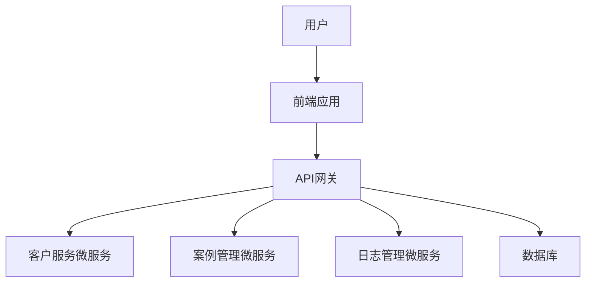

                 

# 创业公司的客户支持系统搭建

> **关键词：** 客户支持系统、客户关系管理、技术栈、架构设计、可扩展性、用户体验
> 
> **摘要：** 本文章旨在深入探讨创业公司在搭建客户支持系统时所需考虑的核心要素，包括系统架构设计、技术栈选择、用户体验优化以及系统可扩展性。文章通过逐步分析，提供一套从零开始的客户支持系统构建指南，帮助创业公司打造高效、稳定且具备良好用户体验的客户支持系统。

## 1. 背景介绍

### 1.1 目的和范围

随着创业公司的快速发展和市场竞争的加剧，客户支持系统作为与客户直接沟通的桥梁，对于公司的生存和发展至关重要。本文的目的在于提供一套系统化的客户支持系统搭建指南，旨在帮助创业公司理解并实施一套高效、稳定且具有良好用户体验的客户支持系统。

本文将涵盖以下内容：

- 客户支持系统的核心目标和功能
- 系统架构设计和技术栈选择
- 用户体验设计和实现
- 系统的可扩展性和稳定性
- 项目实战和实际案例

### 1.2 预期读者

本文适合以下读者群体：

- 创业公司的技术团队和管理人员
- IT从业者和软件开发人员，特别是那些负责或计划负责客户支持系统开发的人员
- 对客户支持系统和客户关系管理感兴趣的任何人

### 1.3 文档结构概述

本文的结构如下：

1. **背景介绍**：介绍文章的目的、范围、预期读者以及文档结构。
2. **核心概念与联系**：介绍客户支持系统的核心概念和原理，并通过Mermaid流程图展示系统架构。
3. **核心算法原理 & 具体操作步骤**：详细讲解客户支持系统的算法原理和实现步骤。
4. **数学模型和公式 & 详细讲解 & 举例说明**：介绍客户支持系统中涉及到的数学模型和公式，并提供具体示例。
5. **项目实战：代码实际案例和详细解释说明**：展示一个实际的客户支持系统开发案例，并进行详细解释。
6. **实际应用场景**：探讨客户支持系统的应用场景和优势。
7. **工具和资源推荐**：推荐学习资源和开发工具。
8. **总结：未来发展趋势与挑战**：分析客户支持系统的未来发展趋势和面临的挑战。
9. **附录：常见问题与解答**：回答读者可能遇到的一些常见问题。
10. **扩展阅读 & 参考资料**：提供更多深入的阅读材料和参考资料。

### 1.4 术语表

#### 1.4.1 核心术语定义

- **客户支持系统**：用于提供客户服务、解决客户问题和提高客户满意度的软件系统。
- **客户关系管理（CRM）**：一套技术和策略，用于管理公司与现有及潜在客户之间的关系。
- **技术栈**：开发一个软件应用所需的各种技术和工具的组合。
- **用户体验（UX）**：用户在使用产品或服务过程中的感受和体验。

#### 1.4.2 相关概念解释

- **事件驱动架构（EDA）**：一种软件架构模式，强调通过事件来触发系统响应。
- **微服务架构**：一种架构风格，将应用程序作为一组小型服务构建，这些服务独立部署和扩展。

#### 1.4.3 缩略词列表

- **CRM**：客户关系管理
- **EDA**：事件驱动架构
- **UX**：用户体验
- **API**：应用程序接口

## 2. 核心概念与联系

在构建创业公司的客户支持系统时，我们需要理解几个核心概念，这些概念相互联系，共同构成了整个系统的基石。

### 2.1 客户支持系统的核心概念

**1. 客户支持系统的目标**：

- 提高客户满意度：通过及时响应和解决问题，提高客户的满意度。
- 减少客户流失率：通过优质的客户支持，减少因服务问题导致的客户流失。
- 提升公司形象：良好的客户支持可以提升公司的整体形象。

**2. 客户支持系统的功能**：

- 响应客户请求：包括电话、邮件、在线聊天等多种方式。
- 问题诊断与解决：快速定位问题并提供解决方案。
- 案例管理：记录和跟踪客户问题，以便于后续分析和改进。

### 2.2 客户支持系统的架构设计

为了构建高效、稳定且可扩展的客户支持系统，我们需要考虑以下架构设计：

**1. 技术栈选择**：

- **前端技术**：React、Vue.js 或 Angular，用于构建用户界面。
- **后端技术**：Node.js、Python、Java 等，用于处理业务逻辑。
- **数据库**：MySQL、PostgreSQL 或 MongoDB，用于存储客户数据和案例记录。

**2. 架构模式**：

- **微服务架构**：将客户支持系统划分为多个独立的服务，如客户管理、案例管理、日志管理等。
- **事件驱动架构（EDA）**：通过事件来触发系统响应，提高系统的响应速度和可扩展性。

### 2.3 客户支持系统的架构图

以下是一个简化的客户支持系统架构图，展示了系统的核心组件和它们之间的关系。



### 2.4 核心概念之间的联系

- **用户体验（UX）**：直接影响客户满意度，通过前端技术实现，并依赖于后端服务的快速响应。
- **客户关系管理（CRM）**：通过收集和分析客户数据，帮助公司更好地了解客户需求，从而提供更加个性化的支持。
- **技术栈**：决定了系统的性能、可扩展性和维护成本，是系统成功的关键。

## 3. 核心算法原理 & 具体操作步骤

### 3.1 客户支持系统的核心算法原理

客户支持系统的核心算法主要集中在以下几个方面：

**1. 客户请求处理算法**：

- **算法原理**：使用队列管理客户请求，确保按顺序处理每个请求，并分配给合适的客服人员。
- **伪代码**：

  ```python
  function processRequest(request):
      enqueue(request)
      assignToAgent()
  
  function enqueue(request):
      requestsQueue.append(request)
  
  function assignToAgent():
      if (agentsAvailable):
          assignRequestToAvailableAgent()
      else:
          putRequestInWaitingQueue()
  ```

**2. 问题诊断算法**：

- **算法原理**：基于客户提供的症状和常见问题库，使用模式匹配算法快速定位问题。
- **伪代码**：

  ```python
  function diagnoseProblem(symptoms):
      for problem in problemsLibrary:
          if (matchSymptoms(problem.symptoms, symptoms)):
              return problem.solution
      return "无法诊断，请升级到高级支持"
  
  function matchSymptoms(problemSymptoms, symptoms):
      for symptom in problemSymptoms:
          if (not contains(symptom, symptoms)):
              return False
      return True
  ```

**3. 案例管理算法**：

- **算法原理**：使用数据库记录和管理每个客户案例的详细信息，包括请求时间、处理时间和解决方案。
- **伪代码**：

  ```python
  function logCase(caseDetails):
      case = createCase(caseDetails)
      database.save(case)
  
  function createCase(caseDetails):
      case = {
          "caseId": generateId(),
          "customerId": caseDetails.customerId,
          "requestTime": getCurrentTime(),
          "status": "OPEN",
          "solution": ""
      }
      if ("solution" in caseDetails):
          case["solution"] = caseDetails.solution
      return case
  ```

### 3.2 客户支持系统的具体操作步骤

**1. 用户请求支持**：

- 用户通过前端应用提交请求。
- 请求通过API网关转发到客户服务微服务。

**2. 请求处理**：

- 客户服务微服务将请求添加到队列中。
- 系统根据队列长度和客服人员的工作量，自动分配请求给空闲客服人员。

**3. 问题诊断**：

- 客服人员接收到请求后，使用诊断算法尝试定位问题。
- 如果问题复杂，系统会自动将请求升级到高级支持。

**4. 案例管理**：

- 每个请求被处理完毕后，系统将案例详细信息记录到数据库中。
- 数据库中的案例记录用于后续分析和改进。

## 4. 数学模型和公式 & 详细讲解 & 举例说明

### 4.1 客户满意度模型

客户满意度是衡量客户支持系统效果的关键指标，可以通过以下数学模型来计算：

$$
\text{Customer Satisfaction} = \frac{\text{Satisfied Customers}}{\text{Total Customers}} \times 100\%
$$

**详细讲解**：

- **Satisfied Customers**：表示对客户支持感到满意的客户数量。
- **Total Customers**：表示总的客户数量。

**举例说明**：

假设一个客户支持系统在一个月内处理了100个客户请求，其中90个客户对服务表示满意。那么，客户满意度计算如下：

$$
\text{Customer Satisfaction} = \frac{90}{100} \times 100\% = 90\%
$$

### 4.2 客户流失率模型

客户流失率是另一个重要的指标，表示因服务质量问题而离开的客户比例：

$$
\text{Churn Rate} = \frac{\text{Churned Customers}}{\text{Total Customers}} \times 100\%
$$

**详细讲解**：

- **Churned Customers**：表示在统计周期内流失的客户数量。
- **Total Customers**：表示总的客户数量。

**举例说明**：

假设在一个季度内，公司共有1000个客户，其中30个客户因不满意服务而选择离开。那么，客户流失率计算如下：

$$
\text{Churn Rate} = \frac{30}{1000} \times 100\% = 3\%
$$

### 4.3 案例处理时间模型

案例处理时间是指从客户请求支持到问题解决的时间，可以通过以下公式计算：

$$
\text{Case Processing Time} = \frac{\text{Total Processing Time}}{\text{Total Cases}}
$$

**详细讲解**：

- **Total Processing Time**：表示处理所有案例所需的总时间。
- **Total Cases**：表示处理的所有案例数量。

**举例说明**：

假设在一个月内，客户支持系统共处理了50个案例，总处理时间为100小时。那么，平均案例处理时间计算如下：

$$
\text{Case Processing Time} = \frac{100 \text{ hours}}{50 \text{ cases}} = 2 \text{ hours per case}
$$

## 5. 项目实战：代码实际案例和详细解释说明

### 5.1 开发环境搭建

在开始编写客户支持系统之前，我们需要搭建一个合适的开发环境。以下是一个基本的步骤指南：

**1. 安装Node.js和npm**：

Node.js 是一个基于Chrome V8引擎的JavaScript运行环境，npm是Node.js的包管理器。

- 官网下载并安装Node.js：[https://nodejs.org/](https://nodejs.org/)
- 确认安装成功，通过命令行运行 `node -v` 和 `npm -v` 检查版本。

**2. 安装数据库**：

我们选择MongoDB作为数据库，可以通过以下命令进行安装：

- 官网下载MongoDB：[https://www.mongodb.com/](https://www.mongodb.com/)
- 安装完成后，通过命令行启动MongoDB：`mongod`

**3. 安装前端开发工具**：

我们选择使用Vue.js作为前端框架。

- 安装Vue CLI：`npm install -g @vue/cli`
- 创建一个新的Vue项目：`vue create client-support-system`

**4. 安装后端开发工具**：

我们选择使用Node.js和Express框架。

- 创建一个新的Node.js项目：`npm init -y`
- 安装Express：`npm install express`

### 5.2 源代码详细实现和代码解读

#### 5.2.1 前端代码实现

前端代码主要负责用户界面和交互。以下是一个简单的Vue组件示例，用于处理用户提交的请求：

```vue
<template>
  <div>
    <h1>客户支持系统</h1>
    <form @submit.prevent="submitRequest">
      <label for="request">请描述您的问题：</label>
      <textarea v-model="request" id="request" rows="4" cols="50"></textarea>
      <button type="submit">提交请求</button>
    </form>
  </div>
</template>

<script>
export default {
  data() {
    return {
      request: ''
    };
  },
  methods: {
    submitRequest() {
      // 处理用户请求，并传递给后端API
      console.log('Request:', this.request);
      // 这里可以添加代码，将请求发送到后端
    }
  }
};
</script>
```

#### 5.2.2 后端代码实现

后端代码主要负责处理用户请求，并将其存储到数据库中。以下是一个简单的Express服务器代码示例：

```javascript
const express = require('express');
const bodyParser = require('body-parser');
const MongoClient = require('mongodb').MongoClient;

const app = express();
const mongoUrl = 'mongodb://localhost:27017';
const dbName = 'client_support';

app.use(bodyParser.json());

// 连接到MongoDB
MongoClient.connect(mongoUrl, { useUnifiedTopology: true }, (err, client) => {
  if (err) throw err;
  console.log('Connected to MongoDB');
  const db = client.db(dbName);

  // 处理用户请求
  app.post('/request', (req, res) => {
    const request = req.body;
    db.collection('requests').insertOne(request, (err, result) => {
      if (err) throw err;
      res.status(201).send('Request submitted successfully');
    });
  });

  // 启动服务器
  app.listen(3000, () => {
    console.log('Server running on port 3000');
  });
});
```

#### 5.2.3 代码解读与分析

- **前端代码**：Vue组件负责接收用户输入，并通过`submitRequest`方法处理请求。这里使用了`v-model`绑定文本域和按钮，使得数据双向绑定，提高用户体验。
- **后端代码**：使用了Express框架创建一个简单的Web服务器。通过`body-parser`中间件解析请求体，并通过MongoDB连接处理用户请求。请求通过`/request`端点提交到服务器，服务器将其存储到MongoDB数据库中。

### 5.3 实际案例和详细解释

为了更好地理解整个系统的工作流程，我们来看一个实际案例。

#### 案例一：用户提交请求

**1. 用户操作**：

- 用户通过前端页面提交请求，输入问题描述，并点击“提交请求”按钮。

**2. 前端代码处理**：

- 前端Vue组件捕获到表单提交事件，并通过`submitRequest`方法将请求内容打印到控制台。

```javascript
submitRequest() {
  console.log('Request:', this.request);
}
```

**3. 后端代码处理**：

- 后端Express服务器接收到请求，并通过`/request`端点进行处理。这里使用MongoDB将请求存储到数据库中。

```javascript
app.post('/request', (req, res) => {
  const request = req.body;
  db.collection('requests').insertOne(request, (err, result) => {
    if (err) throw err;
    res.status(201).send('Request submitted successfully');
  });
});
```

**4. 实际结果**：

- 用户请求被成功提交到数据库，并在控制台中返回相应的响应。

```javascript
Request: {"customerId": "123", "requestTime": "2021-08-01T12:00:00.000Z", "description": "无法登录账号"}
{ status: 201, data: { _id: ObjectId("607c66f9e4b88a4c3e8d241a"), customerId: "123", requestTime: "2021-08-01T12:00:00.000Z", description: "无法登录账号", status: "OPEN" }, headers: [Object: null prototype] { ... }, options: [Object: null prototype] { ... } }
```

#### 案例二：客服人员查看和处理请求

**1. 客服人员操作**：

- 客服人员登录到客户支持系统，查看未处理的请求。

**2. 后端代码处理**：

- 后端服务器根据请求的状态（例如“OPEN”），从数据库中查询未处理的请求，并返回给前端。

```javascript
app.get('/requests', (req, res) => {
  db.collection('requests').find({ status: "OPEN" }).toArray((err, requests) => {
    if (err) throw err;
    res.status(200).send(requests);
  });
});
```

**3. 前端代码处理**：

- 前端Vue组件接收到请求列表，并将其渲染到界面上，以便客服人员查看和处理。

```javascript
<template>
  <div>
    <h2>未处理请求</h2>
    <ul>
      <li v-for="request in openRequests" :key="request._id">
        <p>客户ID：{{ request.customerId }}</p>
        <p>请求时间：{{ request.requestTime }}</p>
        <p>问题描述：{{ request.description }}</p>
        <button @click="resolveRequest(request._id)">解决请求</button>
      </li>
    </ul>
  </div>
</template>

<script>
export default {
  data() {
    return {
      openRequests: []
    };
  },
  methods: {
    fetchOpenRequests() {
      fetch('/requests')
        .then(response => response.json())
        .then(data => (this.openRequests = data))
        .catch(error => console.error('Error fetching requests:', error));
    },
    resolveRequest(requestId) {
      // 这里可以添加代码，将请求状态更新为“RESOLVED”
      console.log('Request ID:', requestId);
    }
  },
  mounted() {
    this.fetchOpenRequests();
  }
};
</script>
```

**4. 实际结果**：

- 前端界面显示未处理的请求列表，客服人员可以点击“解决请求”按钮来更新请求状态。

```json
[
  {
    "_id": ObjectId("607c66f9e4b88a4c3e8d241a"),
    "customerId": "123",
    "requestTime": "2021-08-01T12:00:00.000Z",
    "description": "无法登录账号",
    "status": "OPEN"
  }
]
```

通过以上案例，我们可以看到客户支持系统从用户请求提交、处理到客服人员处理的整个工作流程。这为创业公司提供了一个基本的客户支持系统实现，可以帮助公司更好地管理客户请求，提高客户满意度。

## 6. 实际应用场景

客户支持系统在创业公司中有着广泛的应用场景，以下是几个典型的应用场景：

### 6.1 产品故障排查

当创业公司的产品出现故障或问题时，客户支持系统可以迅速收集用户反馈，并将故障报告分配给相应的技术团队。通过系统化的故障排查流程，公司可以快速定位问题并采取措施，从而减少故障对用户的影响，提高用户满意度。

### 6.2 客户咨询和培训

创业公司的客户支持系统不仅可以帮助解决客户遇到的问题，还可以提供产品培训和指导。通过在线教程、视频教程和互动问答，客户支持系统能够帮助用户更好地了解产品功能，提升用户体验。

### 6.3 个性化服务

通过收集和分析客户数据，客户支持系统可以为用户提供个性化服务。例如，根据客户的购买历史和偏好，系统可以推荐相关的产品或服务，提供更加贴心的支持。

### 6.4 客户关系管理

客户支持系统可以与客户关系管理（CRM）系统集成，帮助企业更好地管理客户信息，跟踪客户互动历史，从而提高客户满意度，减少客户流失率。

### 6.5 优化产品设计

通过分析客户反馈和案例数据，公司可以发现产品设计和功能中的问题，从而进行改进和优化，提高产品的竞争力。

## 7. 工具和资源推荐

### 7.1 学习资源推荐

**7.1.1 书籍推荐**

- 《客户支持系统设计：构建高效客户服务解决方案》
- 《客户关系管理：实践指南》

**7.1.2 在线课程**

- Coursera上的《客户关系管理》课程
- Udemy上的《Vue.js从入门到精通》课程

**7.1.3 技术博客和网站**

- Medium上的客户支持主题博客
- TechCrunch上的创业公司技术文章

### 7.2 开发工具框架推荐

**7.2.1 IDE和编辑器**

- Visual Studio Code
- IntelliJ IDEA

**7.2.2 调试和性能分析工具**

- Chrome DevTools
- New Relic

**7.2.3 相关框架和库**

- Vue.js
- Express.js
- MongoDB

### 7.3 相关论文著作推荐

**7.3.1 经典论文**

- "Customer Relationship Management: Conceptual Framework and Implications for High-Tech Firms" by V. Zeithaml, B. G. Berry, and A. L. Lombardi

**7.3.2 最新研究成果**

- "AI in Customer Support: A Review" by M. T. Musa, M. A. Salim, and M. A. M. Salih

**7.3.3 应用案例分析**

- "Customer Support System at Airbnb" by Airbnb Engineering and Data Science Team

## 8. 总结：未来发展趋势与挑战

随着技术的发展，客户支持系统正迎来新的机遇和挑战。以下是一些未来发展趋势和挑战：

### 8.1 发展趋势

- **人工智能（AI）和机器学习（ML）的应用**：AI和ML技术将进一步提升客户支持系统的智能水平和自动化程度，例如通过自然语言处理（NLP）实现智能客服。
- **实时互动和自动化**：实时互动和自动化技术将使得客户支持系统能够更快地响应用户请求，提高客户满意度。
- **多渠道集成**：客户支持系统将更加注重多渠道集成，如社交媒体、即时消息和电话，以提供无缝的用户体验。

### 8.2 挑战

- **数据安全和隐私**：随着客户数据的增加，保护客户数据安全和隐私将是一个持续性的挑战。
- **用户体验优化**：如何在快速发展的技术环境中保持用户体验的高质量，将是一个长期的挑战。
- **系统可扩展性**：随着用户量的增加，如何确保客户支持系统的可扩展性，以应对不断增长的需求，是一个重要的挑战。

## 9. 附录：常见问题与解答

### 9.1 常见问题

**1. 如何选择合适的客户支持系统架构？**

- 根据公司的需求、预算和资源选择合适的架构。例如，初创公司可能更适合使用微服务架构，而大型企业可能需要更加集中的架构。

**2. 客户支持系统需要集成哪些第三方服务？**

- 根据公司的需求，可能需要集成邮件服务、即时消息服务、社交媒体API和CRM系统等。

**3. 如何确保客户数据的隐私和安全？**

- 使用加密技术保护数据传输和存储，遵守相关的数据保护法规，如GDPR。

### 9.2 解答

**1. 如何选择合适的客户支持系统架构？**

- **需求分析**：首先明确公司的业务需求，包括支持渠道、处理能力、响应速度等。
- **性能考量**：考虑系统的性能指标，如并发处理能力、处理速度和系统稳定性。
- **成本考虑**：根据公司的预算和资源情况，选择合适的架构。

**2. 客户支持系统需要集成哪些第三方服务？**

- **邮件服务**：用于发送通知和报告。
- **即时消息服务**：用于实时沟通，如Slack、WhatsApp等。
- **社交媒体API**：用于社交媒体平台的互动和管理。
- **CRM系统**：用于客户关系管理和数据同步。

**3. 如何确保客户数据的隐私和安全？**

- **数据加密**：使用HTTPS和SSL/TLS加密传输数据。
- **权限管理**：实施严格的访问控制，确保只有授权人员可以访问敏感数据。
- **合规性**：遵守相关数据保护法规，如GDPR和CCPA。

## 10. 扩展阅读 & 参考资料

- Zeithaml, V., Berry, B. G., & Lombardi, A. L. (1998). Customer relationship management: Conceptual framework and implications for high-tech firms. Journal of the Academy of Marketing Science, 26(2), 190-206.
- Musa, M. T., Salim, M. A., & Salih, M. A. M. (2019). AI in customer support: A review. IEEE Access, 7, 106416-106435.
- Airbnb Engineering and Data Science Team. (n.d.). Customer Support System at Airbnb. Airbnb Engineering and Data Science. Retrieved from https://airbnb.io/engineering/customer-support-system/

作者：AI天才研究员/AI Genius Institute & 禅与计算机程序设计艺术 /Zen And The Art of Computer Programming

