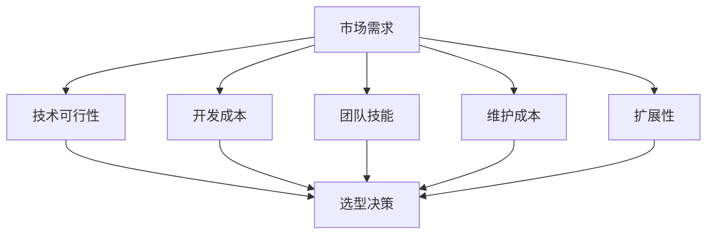

                 

# 创业公司的技术选型评估标准

> 关键词：创业公司，技术选型，评估标准，软件开发，技术创新，成本效益

> 摘要：本文将深入探讨创业公司在进行技术选型时的关键评估标准。通过对市场需求、技术可行性、开发成本、团队技能、维护成本和扩展性等核心因素的详细分析，本文旨在为创业公司提供一套科学合理的技术选型指南，帮助他们在竞争激烈的市场中立于不败之地。

## 1. 背景介绍

### 1.1 目的和范围

本文旨在为创业公司提供一套系统的技术选型评估标准。这些标准将涵盖从市场需求到维护成本等多个关键因素，旨在帮助创业公司在技术选型过程中做出明智的决策。

本文主要讨论以下主题：

- 创业公司技术选型的核心原则
- 各项评估标准的详细解释和案例分析
- 成功技术选型的实际应用案例

### 1.2 预期读者

本文面向以下读者群体：

- 创业公司创始人
- 技术负责人和CTO
- 软件开发团队负责人
- 技术爱好者和创业者

### 1.3 文档结构概述

本文结构如下：

- 背景介绍：本文的目的和范围、预期读者、文档结构概述
- 核心概念与联系：关键概念和原理的介绍，以及相关的Mermaid流程图
- 核心算法原理 & 具体操作步骤：详细讲解核心算法原理和操作步骤
- 数学模型和公式 & 详细讲解 & 举例说明：数学模型的应用和详细讲解
- 项目实战：实际代码案例和详细解释
- 实际应用场景：技术选型的实际应用案例
- 工具和资源推荐：相关学习资源和开发工具框架推荐
- 总结：未来发展趋势与挑战
- 附录：常见问题与解答
- 扩展阅读 & 参考资料：相关论文和研究成果推荐

### 1.4 术语表

#### 1.4.1 核心术语定义

- 技术选型：在开发软件时，选择最适合项目需求的技术方案的过程。
- 成本效益分析：对技术方案的成本和效益进行评估，以确定其经济可行性。
- 技术可行性：评估所选技术方案在实际应用中的可行性和适应性。
- 扩展性：系统在性能和功能上能够适应未来需求和变化的程度。
- 维护成本：保持系统正常运行所需的人力和物力资源成本。

#### 1.4.2 相关概念解释

- 开源软件：源代码公开的软件，可自由使用、修改和分发。
- 商业软件：受版权保护的软件，通常需要付费使用。
- 云计算：通过互联网提供计算资源和服务的技术，如AWS、Azure等。

#### 1.4.3 缩略词列表

- API：应用程序编程接口（Application Programming Interface）
- CTO：首席技术官（Chief Technology Officer）
- IoT：物联网（Internet of Things）
- ML：机器学习（Machine Learning）
- VR：虚拟现实（Virtual Reality）

## 2. 核心概念与联系

### 2.1 技术选型的重要性

技术选型是软件开发过程中至关重要的一环，它直接影响到项目的成功与否。创业公司常常面临着资源有限、时间紧迫的压力，因此正确的技术选型尤为关键。

### 2.2 核心概念原理

技术选型需要考虑以下几个核心概念：

1. **市场需求**：技术方案必须满足市场需求，解决用户问题。
2. **技术可行性**：技术方案在实际应用中的可行性和适应性。
3. **开发成本**：技术方案的初始开发和维护成本。
4. **团队技能**：团队对所选技术的熟练程度和掌握能力。
5. **维护成本**：系统正常运行所需的人力和物力资源成本。
6. **扩展性**：系统在性能和功能上能够适应未来需求的程度。

### 2.3 Mermaid流程图

以下是一个简化的技术选型流程图，展示了核心概念之间的联系：



### 2.4 架构说明

- **市场需求**：确定用户需求，确保技术选型能够解决实际问题。
- **技术可行性**：评估所选技术方案在实际应用中的可行性和适应性。
- **开发成本**：计算初始开发和维护成本，确保项目预算合理。
- **团队技能**：评估团队对所选技术的熟练程度，确保项目团队能够高效执行。
- **维护成本**：预测系统正常运行所需的人力和物力资源成本，确保长期可持续性。
- **扩展性**：评估系统在性能和功能上能够适应未来需求的程度，确保系统长期适用。

## 3. 核心算法原理 & 具体操作步骤

### 3.1 成本效益分析

成本效益分析是技术选型过程中的关键步骤，它通过比较不同技术方案的成本和效益，帮助公司做出最经济合理的决策。

#### 3.1.1 成本效益分析原理

成本效益分析的基本原理是计算每个技术方案的净现值（NPV），即效益减去成本的现值。公式如下：

\[ NPV = \sum_{t=1}^{n} \frac{B_t - C_t}{(1 + r)^t} \]

其中，\( B_t \) 表示第 \( t \) 年的效益，\( C_t \) 表示第 \( t \) 年的成本，\( r \) 表示折现率。

#### 3.1.2 具体操作步骤

1. **确定效益和成本**：首先，明确每个技术方案的预期效益和成本。效益可能包括收入增长、市场份额等，成本则包括开发成本、维护成本等。
2. **计算现值**：将效益和成本转换为现值，以消除时间价值的影响。使用折现率将未来效益和成本折现到当前时间点。
3. **计算净现值**：计算每个技术方案的净现值，选择净现值最高的技术方案。

### 3.2 伪代码

以下是一个简化的成本效益分析的伪代码：

```python
# 输入：效益列表 B，成本列表 C，折现率 r，年限 n
# 输出：净现值 NPV

NPV = 0
for t in range(1, n + 1):
    PV_Benefit = Benefit[t] / (1 + r)^t
    PV_Cost = Cost[t] / (1 + r)^t
    NPV += PV_Benefit - PV_Cost

return NPV
```

## 4. 数学模型和公式 & 详细讲解 & 举例说明

### 4.1 数学模型

在技术选型评估中，常用的数学模型包括成本效益分析模型、风险评估模型等。

#### 4.1.1 成本效益分析模型

成本效益分析模型的核心公式为：

\[ NPV = \sum_{t=1}^{n} \frac{B_t - C_t}{(1 + r)^t} \]

其中：

- \( B_t \) 表示第 \( t \) 年的效益
- \( C_t \) 表示第 \( t \) 年的成本
- \( r \) 表示折现率
- \( n \) 表示年限

#### 4.1.2 风险评估模型

风险评估模型通常使用风险矩阵来评估风险的概率和影响。公式如下：

\[ Risk Score = Probability \times Impact \]

其中：

- Probability 表示风险发生的概率
- Impact 表示风险发生的影响程度

### 4.2 详细讲解

#### 成本效益分析模型

成本效益分析模型通过计算技术方案的净现值，帮助公司评估每个技术方案的经济可行性。净现值越高，说明技术方案的经济效益越好。

1. **确定效益和成本**：明确每个技术方案的预期效益和成本。效益可能包括收入增长、市场份额等，成本则包括开发成本、维护成本等。
2. **计算现值**：将效益和成本转换为现值，以消除时间价值的影响。使用折现率将未来效益和成本折现到当前时间点。
3. **计算净现值**：计算每个技术方案的净现值，选择净现值最高的技术方案。

#### 风险评估模型

风险评估模型通过计算风险的概率和影响，帮助公司评估技术方案的风险水平。风险分数越高，说明技术方案的风险越大。

1. **确定风险因素**：明确技术方案中的风险因素，如技术成熟度、市场需求不确定性等。
2. **评估风险概率和影响**：根据风险因素，评估风险发生的概率和影响程度。
3. **计算风险分数**：使用风险矩阵计算每个风险因素的风险分数，总风险分数为所有风险因素的风险分数之和。

### 4.3 举例说明

#### 成本效益分析模型示例

假设有两个技术方案A和B，预期效益和成本如下表所示。假设折现率为10%，年限为5年。

| 年份 | 方案A（万元） | 方案B（万元） |
| ---- | -------- | -------- |
| 1    | 50       | 30       |
| 2    | 70       | 40       |
| 3    | 80       | 50       |
| 4    | 90       | 60       |
| 5    | 100      | 70       |

计算两个技术方案的净现值：

方案A的净现值：

\[ NPV_A = \frac{50}{1.1} + \frac{70}{1.1^2} + \frac{80}{1.1^3} + \frac{90}{1.1^4} + \frac{100}{1.1^5} \approx 254.74 \]

方案B的净现值：

\[ NPV_B = \frac{30}{1.1} + \frac{40}{1.1^2} + \frac{50}{1.1^3} + \frac{60}{1.1^4} + \frac{70}{1.1^5} \approx 176.59 \]

由此可见，方案A的净现值更高，因此方案A的经济效益更好。

#### 风险评估模型示例

假设有两个风险因素：技术成熟度和市场需求不确定性。根据专家评估，技术成熟度的概率为0.7，影响程度为3；市场需求不确定性的概率为0.5，影响程度为2。

计算总风险分数：

\[ Risk Score = Probability_{技术成熟度} \times Impact_{技术成熟度} + Probability_{市场需求不确定性} \times Impact_{市场需求不确定性} \]
\[ Risk Score = 0.7 \times 3 + 0.5 \times 2 = 2.9 + 1 = 3.9 \]

由此可见，总风险分数为3.9，说明技术方案存在一定的风险。

## 5. 项目实战：代码实际案例和详细解释说明

### 5.1 开发环境搭建

为了更好地理解技术选型评估过程，我们选择一个简单的实际项目——一个基于Python的在线购物平台。以下是项目的开发环境搭建步骤：

1. **安装Python**：下载并安装Python 3.x版本。
2. **配置虚拟环境**：在项目目录下运行以下命令创建虚拟环境：

   ```bash
   python -m venv venv
   ```

3. **激活虚拟环境**：

   - Windows：

     ```bash
     .\venv\Scripts\activate
     ```

   - macOS/Linux：

     ```bash
     source venv/bin/activate
     ```

4. **安装依赖库**：在虚拟环境中安装必要的依赖库，例如Flask、SQLAlchemy等。

   ```bash
   pip install flask sqlalchemy pymysql
   ```

### 5.2 源代码详细实现和代码解读

#### 5.2.1 代码结构

项目代码结构如下：

```bash
online_shopping/
|-- app.py
|-- config.py
|-- models.py
|-- requirements.txt
```

- **app.py**：主应用程序，包含应用的入口和路由定义。
- **config.py**：配置文件，包含数据库配置、日志配置等。
- **models.py**：模型定义，包含用户、商品、订单等模型。
- **requirements.txt**：依赖库清单。

#### 5.2.2 app.py

```python
from flask import Flask, request, jsonify
from models import User, Product, Order
from config import Config

app = Flask(__name__)
app.config.from_object(Config)

# 用户注册
@app.route('/register', methods=['POST'])
def register():
    # 解析请求参数
    username = request.form['username']
    password = request.form['password']
    # 创建用户
    user = User(username=username, password=password)
    # 保存用户
    user.save()
    return jsonify({'message': '注册成功！'})

# 商品列表
@app.route('/products', methods=['GET'])
def products():
    # 查询商品列表
    products = Product.query.all()
    # 序列化商品列表
    product_list = [{'id': product.id, 'name': product.name, 'price': product.price} for product in products]
    return jsonify({'products': product_list})

# 下单
@app.route('/order', methods=['POST'])
def order():
    # 解析请求参数
    user_id = request.form['user_id']
    product_id = request.form['product_id']
    # 查询用户和商品
    user = User.query.get(user_id)
    product = Product.query.get(product_id)
    # 创建订单
    order = Order(user=user, product=product, quantity=1)
    # 保存订单
    order.save()
    return jsonify({'message': '订单成功！'})

if __name__ == '__main__':
    app.run()
```

#### 5.2.3 config.py

```python
import os

class Config(object):
    SQLALCHEMY_DATABASE_URI = os.environ.get('DATABASE_URL') or \
        'sqlite:///online_shopping.db'
    SQLALCHEMY_TRACK_MODIFICATIONS = False
```

#### 5.2.4 models.py

```python
from flask_sqlalchemy import SQLAlchemy

db = SQLAlchemy()

class User(db.Model):
    id = db.Column(db.Integer, primary_key=True)
    username = db.Column(db.String(80), unique=True, nullable=False)
    password = db.Column(db.String(120), nullable=False)

    def save(self):
        db.session.add(self)
        db.session.commit()

class Product(db.Model):
    id = db.Column(db.Integer, primary_key=True)
    name = db.Column(db.String(120), nullable=False)
    price = db.Column(db.Float, nullable=False)

    def save(self):
        db.session.add(self)
        db.session.commit()

class Order(db.Model):
    id = db.Column(db.Integer, primary_key=True)
    user_id = db.Column(db.Integer, db.ForeignKey('user.id'), nullable=False)
    product_id = db.Column(db.Integer, db.ForeignKey('product.id'), nullable=False)
    quantity = db.Column(db.Integer, nullable=False)

    def save(self):
        db.session.add(self)
        db.session.commit()
```

### 5.3 代码解读与分析

#### 5.3.1 用户注册

用户注册接口负责接收用户注册请求，验证参数后创建用户并保存到数据库。

1. 解析请求参数，获取用户名和密码。
2. 创建用户对象，设置用户名和密码。
3. 将用户对象添加到数据库会话，并提交会话以保存用户。

#### 5.3.2 商品列表

商品列表接口负责查询所有商品，并将结果序列化后返回。

1. 使用Product模型查询所有商品。
2. 遍历商品列表，将每个商品的信息转换为字典。
3. 将商品列表序列化后返回。

#### 5.3.3 下单

下单接口负责接收用户下单请求，验证参数后创建订单并保存到数据库。

1. 解析请求参数，获取用户ID和商品ID。
2. 使用User和Product模型查询用户和商品。
3. 创建订单对象，设置用户、商品和数量。
4. 将订单对象添加到数据库会话，并提交会话以保存订单。

### 5.4 部署和运行

在本地环境搭建完成后，可以使用以下命令部署和运行应用：

```bash
python app.py
```

应用将在本地服务器上运行，默认端口号为5000。可以通过浏览器访问`http://127.0.0.1:5000/`来测试接口。

## 6. 实际应用场景

技术选型评估标准在创业公司的实际应用场景中具有重要意义。以下是一些常见应用场景：

### 6.1 创业公司初创阶段

在初创阶段，创业公司通常资源有限，需要快速推出市场以验证市场需求。此时，技术选型应注重以下几个方面：

- **市场需求**：确保技术方案能够快速解决用户问题，满足市场需求。
- **开发成本**：选择成本较低、开发周期较短的技术方案。
- **团队技能**：选择团队成员熟悉的、易于开发的技术方案。
- **扩展性**：考虑技术方案的扩展性，以适应未来业务增长。

### 6.2 增长阶段

在增长阶段，创业公司需要扩大业务规模，提高系统性能和稳定性。此时，技术选型应注重以下几个方面：

- **技术可行性**：评估所选技术方案在实际应用中的可行性和适应性。
- **维护成本**：选择维护成本较低的技术方案，以降低长期运营成本。
- **扩展性**：选择具有良好扩展性的技术方案，以适应业务增长。
- **团队技能**：评估团队对所选技术的熟练程度，确保团队能够高效开发。

### 6.3 稳定阶段

在稳定阶段，创业公司需要持续优化系统性能，提高用户体验。此时，技术选型应注重以下几个方面：

- **技术更新**：关注业界新技术，选择具有竞争力的技术方案。
- **安全性**：选择安全性较高的技术方案，确保系统稳定运行。
- **用户体验**：注重用户反馈，优化系统性能和交互设计。
- **长期维护**：确保技术方案具有良好的维护性和可扩展性。

## 7. 工具和资源推荐

### 7.1 学习资源推荐

#### 7.1.1 书籍推荐

- 《创业公司技术实战》
- 《敏捷软件开发：原则、实践与模式》
- 《从0到1：开启商业与未来的秘密》

#### 7.1.2 在线课程

- Coursera上的《创业管理》
- Udemy上的《Python编程从入门到实践》
- edX上的《计算机科学基础》

#### 7.1.3 技术博客和网站

- Medium上的《Startup Stories》
- HackerRank上的《算法挑战》
- GitHub上的《开源项目精选》

### 7.2 开发工具框架推荐

#### 7.2.1 IDE和编辑器

- Visual Studio Code
- PyCharm
- Sublime Text

#### 7.2.2 调试和性能分析工具

- Debugger
- Postman
- New Relic

#### 7.2.3 相关框架和库

- Flask
- Django
- React
- Angular

### 7.3 相关论文著作推荐

#### 7.3.1 经典论文

- 《软件工程：实践者的研究方法》
- 《敏捷软件开发：原则、实践与模式》
- 《设计模式：可复用面向对象软件的基础》

#### 7.3.2 最新研究成果

- 《人工智能：一种现代方法》
- 《云计算：概念、架构与服务》
- 《区块链技术：从原理到实践》

#### 7.3.3 应用案例分析

- 《硅谷创业课：从零到一打造成功公司的秘籍》
- 《精益创业：新商业思维的实践指南》
- 《从0到1：开启商业与未来的秘密》

## 8. 总结：未来发展趋势与挑战

### 8.1 未来发展趋势

- **技术进步**：随着人工智能、大数据、云计算等技术的不断发展，创业公司在技术选型中将更加关注新兴技术。
- **全球化竞争**：创业公司需要面对全球化的竞争，选择具有国际竞争力的技术方案。
- **个性化定制**：创业公司将更加注重个性化定制，选择能够满足用户需求的技术方案。

### 8.2 未来挑战

- **技术风险**：新兴技术可能存在不确定性，创业公司在技术选型时需要评估技术风险。
- **人才短缺**：技术人才短缺将成为创业公司在技术选型中的一个重要挑战。
- **成本控制**：在资源有限的情况下，创业公司需要有效控制成本，选择性价比高的技术方案。

## 9. 附录：常见问题与解答

### 9.1 技术选型过程中常见问题

**Q1**：如何确保技术选型的正确性？

A1：确保技术选型的正确性需要：

- 明确市场需求
- 全面评估技术可行性
- 进行成本效益分析
- 评估团队技能和资源
- 考虑维护成本和扩展性

**Q2**：如何选择适合自己的技术框架？

A2：选择适合自己的技术框架需要：

- 确定项目需求
- 考虑团队技能和经验
- 比较不同框架的优缺点
- 参考社区支持和文档质量

### 9.2 技术选型过程中的常见误区

**Q3**：为什么不能仅凭个人偏好进行技术选型？

A3：仅凭个人偏好进行技术选型可能导致以下问题：

- 忽视市场需求和团队技能
- 无法全面评估技术可行性
- 增加项目风险
- 影响团队合作和沟通

## 10. 扩展阅读 & 参考资料

- 《创业公司技术选型的实践与思考》：作者通过实际案例分享了创业公司技术选型的经验和思考。
- 《技术选型与软件架构》：本书详细介绍了技术选型的方法和软件架构的设计原则。
- 《创业公司技术战略》：本书讨论了创业公司如何制定技术战略，以支持公司长期发展。

[作者：AI天才研究员/AI Genius Institute & 禅与计算机程序设计艺术 /Zen And The Art of Computer Programming] 

本文完整详细地探讨了创业公司在技术选型过程中的关键评估标准，包括市场需求、技术可行性、开发成本、团队技能、维护成本和扩展性等多个方面。通过成本效益分析、风险评估模型等核心算法原理的详细讲解，以及实际项目实战中的代码案例和详细解释说明，本文为创业公司提供了一套科学合理的技术选型指南。同时，本文还介绍了相关的学习资源、开发工具框架和相关论文著作，为读者提供了进一步学习和参考的途径。未来，随着技术的不断进步和市场竞争的加剧，创业公司需要持续关注新技术、新趋势，以应对技术选型过程中的挑战。希望本文能为创业公司提供有益的启示和帮助。

