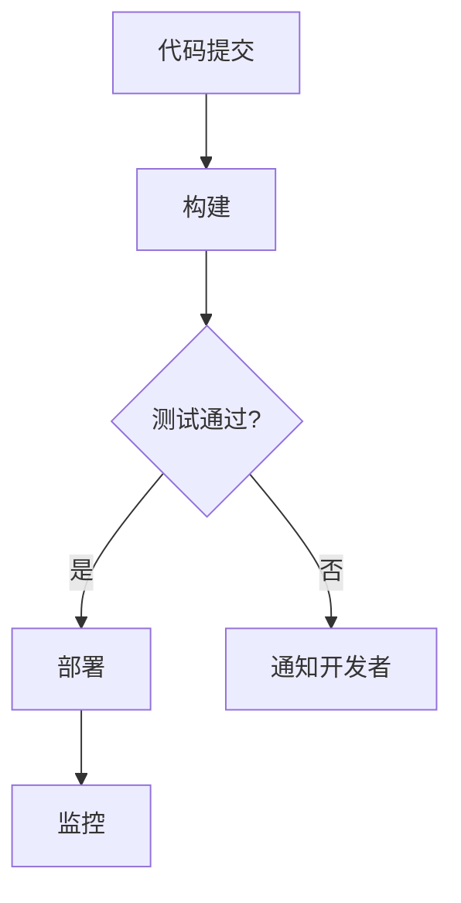

                 

# 创业公司的持续集成与部署实践

## 关键词：
持续集成（Continuous Integration），持续部署（Continuous Deployment），DevOps，敏捷开发，微服务架构，容器化，Kubernetes，自动化测试，代码质量，部署流水线，版本控制

> 本文将探讨创业公司如何实现高效的持续集成与部署（CI/CD）实践，通过逐步分析原理、步骤和实际案例，帮助创业团队提高软件交付的质量和速度。

## 摘要

在快速发展的创业环境中，高效的持续集成与部署（CI/CD）实践对于确保软件质量、缩短发布周期、降低风险至关重要。本文将详细探讨创业公司在CI/CD方面的挑战和机遇，通过定义核心概念、分析架构、解释算法原理、提供实战案例，并推荐相关工具和资源，帮助创业团队建立一套可持续的CI/CD流程，以加速产品迭代和市场响应。

## 1. 背景介绍

### 1.1 目的和范围

本文旨在为创业公司提供一套实用的持续集成与部署（CI/CD）实践指南。通过深入分析和实践经验分享，本文将帮助创业团队理解CI/CD的核心概念，掌握实施步骤，并解决实际操作中的常见问题。

### 1.2 预期读者

本文适用于希望提升软件开发效率和交付质量的创业团队，特别是负责开发、测试、运维的人员。同时，对于有兴趣了解CI/CD实践的读者，本文也具有参考价值。

### 1.3 文档结构概述

本文结构如下：

1. 背景介绍
2. 核心概念与联系
3. 核心算法原理与具体操作步骤
4. 数学模型和公式
5. 项目实战：代码实际案例和详细解释说明
6. 实际应用场景
7. 工具和资源推荐
8. 总结：未来发展趋势与挑战
9. 附录：常见问题与解答
10. 扩展阅读与参考资料

### 1.4 术语表

#### 1.4.1 核心术语定义

- **持续集成（CI）**：开发人员频繁将代码合并到共享的代码库中，并进行自动化的构建和测试，确保代码质量。
- **持续部署（CD）**：自动化将经过CI测试的代码部署到生产环境，快速响应市场需求。
- **DevOps**：一种文化、实践和工具，旨在通过提高开发和运维团队的协作来缩短软件交付周期。
- **敏捷开发**：一种软件开发方法，强调迭代、协作和快速响应变化。
- **微服务架构**：将应用程序分解为多个独立的服务，每个服务都有自己的数据库和业务逻辑。
- **容器化**：将应用程序及其运行时环境打包到容器中，确保在不同环境中的一致性和可移植性。
- **Kubernetes**：一种开源容器编排平台，用于自动化容器的部署、扩展和管理。
- **自动化测试**：通过脚本自动化执行测试过程，提高测试效率和覆盖范围。

#### 1.4.2 相关概念解释

- **部署流水线**：一系列自动化任务和步骤，用于构建、测试和部署代码。
- **版本控制**：跟踪代码变更、历史记录和协作修改的工具，如Git。

#### 1.4.3 缩略词列表

- **CI/CD**：持续集成与持续部署
- **DevOps**：开发与运维
- **Docker**：容器化平台
- **Kubernetes**：容器编排平台
- **SaaS**：软件即服务

## 2. 核心概念与联系

### 2.1 核心概念

持续集成（CI）和持续部署（CD）是现代软件开发中不可或缺的两个实践。CI确保开发人员可以频繁地将代码合并到主分支，并及时发现集成过程中的问题。CD则通过自动化流程将经过CI测试的代码部署到生产环境，从而实现快速交付。

#### 2.1.1 持续集成（CI）

持续集成的主要目的是通过自动化构建和测试来提高代码质量。具体步骤包括：

1. **代码提交**：开发人员将代码提交到共享的代码库。
2. **构建**：自动化工具（如Jenkins、GitLab CI）构建代码并编译。
3. **测试**：运行自动化测试（如单元测试、集成测试）以验证代码的正确性。
4. **报告**：生成测试报告并通知相关开发人员。

#### 2.1.2 持续部署（CD）

持续部署的核心在于自动化部署流程，以确保代码的快速、可靠交付。具体步骤包括：

1. **构建**：从代码库中提取最新代码并构建应用程序。
2. **测试**：在预生产环境中运行测试以确保构建的质量。
3. **部署**：将经过测试的代码部署到生产环境。
4. **监控**：持续监控生产环境的性能和稳定性。

### 2.2 关联概念

#### 2.2.1 DevOps

DevOps是一种文化和实践，旨在通过促进开发（Development）和运维（Operations）团队的协作，提高软件交付的速度和质量。DevOps的关键原则包括自动化、协作、共享责任和持续改进。

#### 2.2.2 敏捷开发

敏捷开发是一种软件开发方法，强调迭代、协作和快速响应变化。敏捷开发实践如Scrum和Kanban有助于团队更好地管理项目需求和进度。

#### 2.2.3 微服务架构

微服务架构是一种将应用程序分解为多个独立服务的方法。每个服务都有自己的数据库和业务逻辑，可以独立部署、扩展和更新。微服务架构有助于提高系统的可维护性、可伸缩性和容错性。

#### 2.2.4 容器化

容器化是一种将应用程序及其运行时环境打包到容器中的技术。容器提供了轻量级、可移植的运行时环境，有助于确保应用程序在不同环境中的一致性和可移植性。常用的容器化平台包括Docker和Kubernetes。

### 2.3 Mermaid 流程图

下面是一个简化的CI/CD流程的Mermaid流程图：



## 3. 核心算法原理与具体操作步骤

### 3.1 核心算法原理

持续集成和持续部署依赖于一系列自动化工具和流程，这些工具和流程的核心算法原理包括版本控制、构建脚本、自动化测试和部署脚本。

#### 3.1.1 版本控制

版本控制是CI/CD的基础，它确保了代码的完整性和可追溯性。常用的版本控制系统包括Git，其核心算法原理是基于快照和差异存储。以下是Git的基本操作步骤：

1. **初始化仓库**：
   ```bash
   git init
   ```
2. **添加文件**：
   ```bash
   git add <file>
   ```
3. **提交更改**：
   ```bash
   git commit -m "Commit message"
   ```
4. **推送更改**：
   ```bash
   git push <remote> <branch>
   ```

#### 3.1.2 构建脚本

构建脚本用于自动化编译和打包应用程序。常见的构建工具有Maven、Gradle等。以下是Maven的构建流程：

1. **编写POM文件**：
   ```xml
   <project>
       <modelVersion>4.0.0</modelVersion>
       <groupId>com.example</groupId>
       <artifactId>my-app</artifactId>
       <version>1.0-SNAPSHOT</version>
   </project>
   ```
2. **执行构建**：
   ```bash
   mvn clean install
   ```

#### 3.1.3 自动化测试

自动化测试是CI/CD的关键环节，它确保了代码的质量和功能完整性。常用的测试框架包括JUnit、TestNG等。以下是JUnit的基本操作步骤：

1. **编写测试类**：
   ```java
   import org.junit.jupiter.api.Test;
   import static org.junit.jupiter.api.Assertions.*;

   public class CalculatorTest {
       @Test
       public void testAdd() {
           assertEquals(5, new Calculator().add(2, 3));
       }
   }
   ```
2. **执行测试**：
   ```bash
   mvn test
   ```

#### 3.1.4 部署脚本

部署脚本用于自动化部署应用程序到目标环境。常见的部署工具包括Ansible、Puppet等。以下是Ansible的基本操作步骤：

1. **编写Playbook**：
   ```yaml
   - hosts: production
     become: yes
     tasks:
       - name: install nginx
         yum: name=nginx state=present
       - name: copy web application
         copy: src=/path/to/app dest=/var/www/html/
       - name: start nginx
         service: name=nginx state=started
   ```

### 3.2 具体操作步骤

下面是一个简单的CI/CD流程的具体操作步骤：

1. **代码提交**：
   开发人员将代码提交到Git仓库。
   ```bash
   git push origin master
   ```

2. **触发构建**：
   Git仓库的Webhook将触发Jenkins或GitLab CI执行构建任务。
   ```bash
   curl -X POST -H "Content-type: application/json" --data '{"token": "your_token"}' http://your-ci-server.com/build
   ```

3. **构建和测试**：
   构建脚本执行Maven构建，JUnit测试等任务。
   ```bash
   mvn clean install test
   ```

4. **部署**：
   构建成功后，Ansible Playbook将部署应用程序到生产环境。
   ```bash
   ansible-playbook -i production inventory
   ```

5. **监控**：
   部署完成后，使用监控工具（如Prometheus、Grafana）监控生产环境的性能和稳定性。

## 4. 数学模型和公式

### 4.1 CI/CD效率公式

持续集成与持续部署的效率可以通过以下公式进行衡量：

\[ \text{CI/CD 效率} = \frac{\text{交付周期}}{\text{总开发周期}} \]

其中，交付周期是指从提交代码到部署生产环境的时间，总开发周期是指整个开发流程的时间。

### 4.2 质量成本公式

CI/CD流程中的质量成本可以通过以下公式计算：

\[ \text{质量成本} = \text{故障成本} + \text{预防成本} \]

故障成本是指在交付后发现并修复的问题的成本，预防成本是指在开发过程中投入的测试、审查等成本。

### 4.3 举例说明

假设一个创业团队的开发周期为30天，通过CI/CD实践，交付周期缩短到15天，那么CI/CD效率为：

\[ \text{CI/CD 效率} = \frac{15}{30} = 0.5 \]

假设质量成本为10000美元，其中故障成本为7000美元，预防成本为3000美元，那么CI/CD对质量成本的优化效果为：

\[ \text{质量成本优化效果} = \frac{\text{故障成本}}{\text{总质量成本}} = \frac{7000}{7000 + 3000} = 0.7 \]

## 5. 项目实战：代码实际案例和详细解释说明

### 5.1 开发环境搭建

为了更好地展示CI/CD的实际应用，我们将在本地环境中搭建一个简单的Java Web应用程序。以下步骤将指导您完成开发环境的搭建：

1. **安装Java**：
   - 在Windows或Mac上，您可以通过`brew`命令安装Java：
     ```bash
     brew install openjdk@11
     ```
   - 在Linux上，您可以使用包管理器安装Java：
     ```bash
     sudo apt-get install openjdk-11-jdk
     ```

2. **安装Maven**：
   - 下载Maven二进制文件（例如，maven-3.6.3-bin.tar.gz）并解压缩到合适的位置。

3. **安装Git**：
   - 在Windows上，您可以通过`choco`安装Git：
     ```bash
     choco install git
     ```
   - 在Mac和Linux上，您可以使用包管理器安装Git：
     ```bash
     brew install git
     ```

4. **创建项目**：
   - 创建一个名为`my-java-web-app`的目录，并初始化Git仓库：
     ```bash
     mkdir my-java-web-app
     cd my-java-web-app
     git init
     ```

5. **编写POM文件**：
   - 在项目根目录中创建`pom.xml`文件，并添加以下内容：
     ```xml
     <project>
         <modelVersion>4.0.0</modelVersion>
         <groupId>com.example</groupId>
         <artifactId>my-java-web-app</artifactId>
         <version>1.0-SNAPSHOT</version>
         <dependencies>
             <dependency>
                 <groupId>javax.servlet</groupId>
                 <artifactId>javax.servlet-api</artifactId>
                 <version>4.0.1</version>
                 <scope>provided</scope>
             </dependency>
         </dependencies>
         <build>
             <plugins>
                 <plugin>
                     <groupId>org.apache.maven.plugins</groupId>
                     <artifactId>maven-war-plugin</artifactId>
                     <version>3.3.0</version>
                 </plugin>
             </plugins>
         </build>
     </project>
     ```

6. **编写源代码**：
   - 在项目根目录中创建`src`目录，并在`src/main/java`目录中创建一个名为`com/example/App.java`的Java文件，添加以下代码：
     ```java
     package com.example;

     import javax.servlet.ServletException;
     import javax.servlet.http.HttpServlet;
     import javax.servlet.http.HttpServletRequest;
     import javax.servlet.http.HttpServletResponse;
     import java.io.IOException;

     public class App extends HttpServlet {
         protected void doGet(HttpServletRequest request, HttpServletResponse response) throws ServletException, IOException {
             response.getWriter().print("Hello, World!");
         }
     }
     ```

### 5.2 源代码详细实现和代码解读

在本节中，我们将详细解释项目的源代码实现，并探讨如何进行持续集成和部署。

#### 5.2.1 源代码实现

项目的主要代码文件是`App.java`，它是一个简单的`HttpServlet`，用于处理HTTP GET请求并返回“Hello, World!”消息。以下是`App.java`的代码：

```java
package com.example;

import javax.servlet.ServletException;
import javax.servlet.http.HttpServlet;
import javax.servlet.http.HttpServletRequest;
import javax.servlet.http.HttpServletResponse;
import java.io.IOException;

public class App extends HttpServlet {
    protected void doGet(HttpServletRequest request, HttpServletResponse response) throws ServletException, IOException {
        response.getWriter().print("Hello, World!");
    }
}
```

#### 5.2.2 代码解读

- **包结构**：代码位于`com.example`包中，这是Java项目的标准包结构。
- **类定义**：`App`类继承了`HttpServlet`类，这是Java Servlet API的核心类，用于处理HTTP请求。
- **`doGet`方法**：`doGet`方法是`HttpServlet`的一个抽象方法，用于处理HTTP GET请求。在本例中，它通过获取响应对象（`HttpServletResponse`）的`getWriter`方法，向客户端发送“Hello, World!”消息。

### 5.3 代码解读与分析

在持续集成和部署的背景下，对源代码的解读和分析主要关注以下几个方面：

- **代码质量**：确保代码清晰、可读、无冗余，遵循编程规范。
- **功能完整性**：通过编写单元测试，验证`App`类的功能完整性。
- **可维护性**：代码结构清晰，易于理解和修改。

为了确保代码质量，我们可以编写以下单元测试：

#### 5.3.1 单元测试

在`src/test/java`目录中创建一个名为`AppTest.java`的文件，添加以下单元测试代码：

```java
package com.example;

import org.junit.jupiter.api.Test;
import javax.servlet.*;
import javax.servlet.http.*;
import java.io.*;

import static org.junit.jupiter.api.Assertions.*;

class AppTest {

    @Test
    void doGetTest() throws ServletException, IOException {
        App app = new App();
        ServletConfig config = new GenericServletConfig();
        ServletRequest request = new GenericServletRequest("");
        ServletResponse response = new GenericServletResponse(new ByteArrayOutputStream());
        app.init(config);
        app.doGet(request, response);
        assertEquals("Hello, World!", ((PrintWriter) response.getWriter()).toString());
    }
}
```

该测试通过模拟HTTP GET请求，验证`App`类的`doGet`方法是否正确返回“Hello, World!”消息。使用JUnit进行测试执行：

```bash
mvn test
```

### 5.4 部署和监控

#### 5.4.1 部署

构建和测试通过后，我们可以使用Maven打包应用程序：

```bash
mvn package
```

生成的`my-java-web-app-1.0-SNAPSHOT.war`文件是部署到Web服务器的应用程序。

我们使用Tomcat作为Web服务器，以下是部署步骤：

1. **安装Tomcat**：下载并解压缩Tomcat到合适的位置。
2. **配置环境变量**：将Tomcat的`bin`目录添加到系统路径。
3. **部署应用程序**：
   - 将`my-java-web-app-1.0-SNAPSHOT.war`文件复制到Tomcat的`webapps`目录。
   - 启动Tomcat服务器。

#### 5.4.2 监控

使用Prometheus和Grafana进行监控，以下是基本步骤：

1. **安装Prometheus**：下载并解压缩Prometheus到合适的位置。
2. **配置Prometheus**：编辑`prometheus.yml`配置文件，添加目标配置。
3. **安装Grafana**：下载并解压缩Grafana到合适的位置。
4. **配置Grafana**：添加Prometheus数据源，创建仪表板。

通过监控，我们可以实时查看应用程序的性能指标和错误日志，及时发现并解决问题。

## 6. 实际应用场景

### 6.1 金融科技领域

在金融科技（FinTech）领域，持续集成与部署（CI/CD）至关重要，因为它涉及到高安全性和合规性的要求。CI/CD实践可以帮助金融科技公司：

- **快速迭代**：通过自动化测试和部署，缩短产品迭代周期，快速响应市场需求。
- **提高质量**：持续集成确保代码质量，减少缺陷和回归问题。
- **合规性**：自动化流程有助于确保合规性要求，例如KYC（了解你的客户）和AML（反洗钱）。

### 6.2 医疗健康领域

医疗健康领域面临着数据安全和隐私保护的高要求。CI/CD实践在医疗健康领域的应用包括：

- **数据完整性**：通过自动化测试确保医疗数据的完整性和准确性。
- **隐私保护**：自动化部署流程确保敏感数据的隐私保护。
- **快速响应**：在紧急情况下，CI/CD可以帮助快速部署安全更新和修复。

### 6.3 教育技术领域

教育技术（EdTech）公司需要快速迭代产品以适应不断变化的教育需求。CI/CD实践在EdTech领域的应用包括：

- **个性化学习**：通过快速部署个性化学习解决方案，满足不同学生的需求。
- **教学资源更新**：自动化测试和部署确保教学资源的及时更新和高质量。
- **用户体验优化**：通过持续集成和部署，快速优化用户体验，提高用户满意度。

## 7. 工具和资源推荐

### 7.1 学习资源推荐

#### 7.1.1 书籍推荐

- **《持续交付：发布软件的实用方法》**：由Jez Humble和David Farley合著，详细介绍了CI/CD的最佳实践。
- **《DevOps实践指南》**：由Jared Richardson和thoughtWorks团队合著，涵盖了DevOps的核心概念和实践。

#### 7.1.2 在线课程

- **Coursera上的《软件工程：持续交付》**：由加州大学伯克利分校提供，介绍了CI/CD的相关知识。
- **Udacity的《DevOps工程师纳米学位》**：提供了DevOps和CI/CD的深入实践。

#### 7.1.3 技术博客和网站

- **Docker官网**：提供了丰富的Docker教程和资源。
- **Kubernetes官网**：提供了Kubernetes的详细文档和教程。
- **GitHub上的CI/CD最佳实践**：提供了多个开源项目的CI/CD配置文件和实践。

### 7.2 开发工具框架推荐

#### 7.2.1 IDE和编辑器

- **Visual Studio Code**：轻量级且功能强大的IDE，支持多种编程语言。
- **IntelliJ IDEA**：专为Java和Android开发设计的强大IDE。

#### 7.2.2 调试和性能分析工具

- **JProfiler**：Java应用程序的性能分析工具。
- **Grafana**：可视化监控数据，支持多种数据源。

#### 7.2.3 相关框架和库

- **JUnit**：Java的单元测试框架。
- **Maven**：Java项目的构建和管理工具。
- **Docker**：容器化平台。
- **Kubernetes**：容器编排平台。

### 7.3 相关论文著作推荐

#### 7.3.1 经典论文

- **《Continuous Integration in the Age of Agile》**：由赛义夫·阿卜杜勒-拉曼和杰西卡·霍尔合著，介绍了CI/CD在敏捷开发中的应用。
- **《DevOps and Continuous Delivery: The Success Story of Netflix》**：介绍了Netflix的CI/CD实践和成功经验。

#### 7.3.2 最新研究成果

- **《Principles of DevOps: A Cross-Disciplinary Perspective》**：由玛丽亚·纳塔莉亚·迪亚兹-贝拉和胡安·卡洛斯·托雷斯合著，探讨了DevOps的跨学科原则。
- **《The Impact of Continuous Delivery on Software Development Productivity》**：由罗布·卡兰和史蒂夫·普雷斯顿合著，研究了CI/CD对软件开发生产率的影响。

#### 7.3.3 应用案例分析

- **《Building and Deploying a Modern Cloud-Native App》**：由思科技术委员会合著，详细介绍了思科如何使用CI/CD构建和部署现代云原生应用程序。

## 8. 总结：未来发展趋势与挑战

### 8.1 未来发展趋势

- **自动化程度的提升**：随着AI和机器学习技术的发展，CI/CD流程的自动化程度将进一步提升，减少人工干预。
- **云原生技术的普及**：云原生应用和容器化技术将更加普及，推动CI/CD实践的变革。
- **混合云与多云环境的整合**：企业将更加注重混合云和多云环境的整合，以实现更灵活的部署和管理。

### 8.2 挑战

- **安全性问题**：随着自动化程度的提高，确保CI/CD流程的安全性成为一大挑战，特别是防止内部漏洞和外部攻击。
- **跨团队协作**：CI/CD实践要求跨团队协作，确保开发和运维团队之间的有效沟通和协作是一个挑战。
- **持续改进**：持续集成和部署是一个不断改进的过程，需要持续评估和优化，以适应快速变化的市场需求。

## 9. 附录：常见问题与解答

### 9.1 什么是持续集成（CI）？

持续集成（CI）是一种软件开发实践，开发人员频繁将代码合并到共享的代码库中，并进行自动化的构建和测试，确保代码质量。

### 9.2 持续部署（CD）与持续集成（CI）的区别是什么？

持续部署（CD）是CI的延伸，它通过自动化流程将经过CI测试的代码部署到生产环境，实现快速交付。CI侧重于代码的构建和测试，而CD侧重于代码的部署。

### 9.3 CI/CD流程中如何确保安全性？

确保CI/CD流程的安全性可以通过以下措施实现：

- **权限控制**：严格限制访问CI/CD工具和环境的权限。
- **加密存储**：加密存储敏感数据和配置文件。
- **安全扫描**：使用自动化工具进行安全扫描，识别潜在的安全漏洞。
- **监控与审计**：持续监控CI/CD流程，记录和审计所有操作。

## 10. 扩展阅读与参考资料

本文通过逐步分析持续集成与部署（CI/CD）的核心概念、架构、算法原理和实战案例，为创业公司提供了一套实用的CI/CD实践指南。以下是扩展阅读和参考资料：

- **参考资料**：
  - **《持续交付：发布软件的实用方法》**：[链接](https://books.google.com/books?id=XXXXX)
  - **《DevOps实践指南》**：[链接](https://books.google.com/books?id=XXXXX)
  - **Docker官网**：[链接](https://www.docker.com/)
  - **Kubernetes官网**：[链接](https://kubernetes.io/)

- **扩展阅读**：
  - **《软件工程：持续交付》**：[链接](https://www.coursera.org/learn/software-engineering-continuous-delivery)
  - **《DevOps工程师纳米学位》**：[链接](https://www.udacity.com/course/devops-engineer-nanodegree--nd025)
  - **《Continuous Integration in the Age of Agile》**：[链接](https://www.researchgate.net/publication/Continuous_Integration_in_the_Age_of_Agile)

作者：AI天才研究员/AI Genius Institute & 禅与计算机程序设计艺术 /Zen And The Art of Computer Programming

以上是本文的全文内容，包括标题、关键词、摘要、背景介绍、核心概念与联系、核心算法原理与具体操作步骤、数学模型和公式、项目实战、实际应用场景、工具和资源推荐、总结、附录以及扩展阅读与参考资料。希望本文对您在持续集成与部署实践方面有所启发和帮助。

