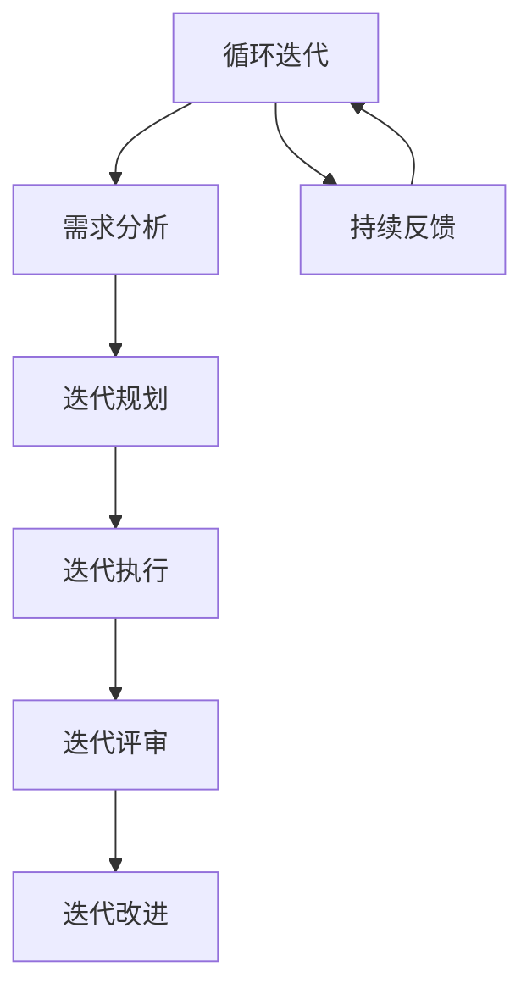
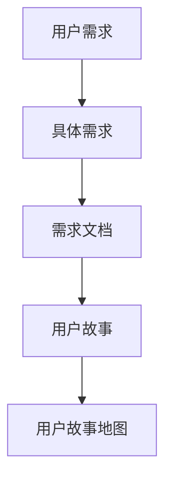
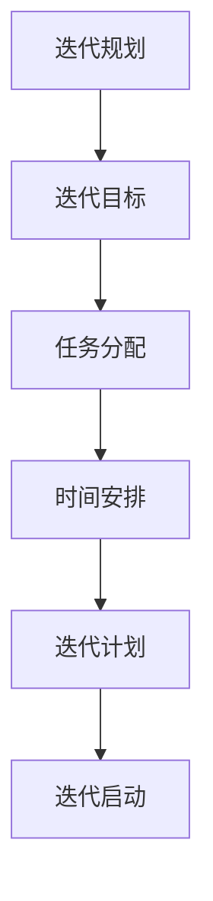
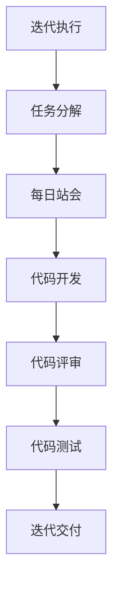
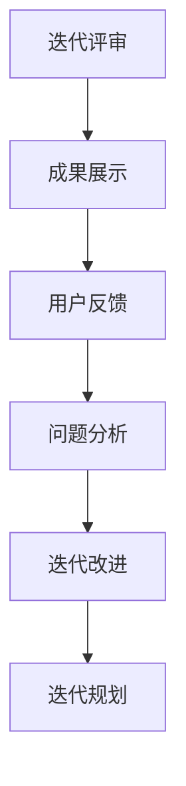
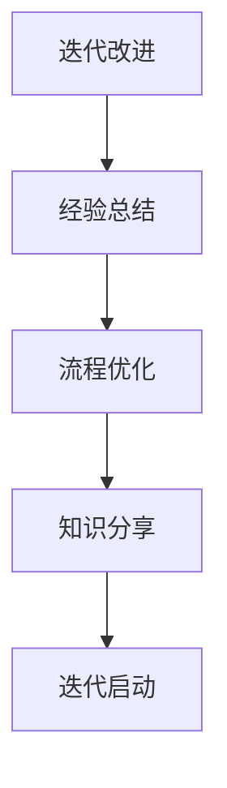
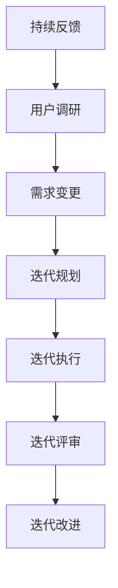

                 

# 创业公司的敏捷开发：快速迭代的实践指南

> **关键词**：敏捷开发、迭代、创业公司、快速响应、用户需求、开发流程、团队协作、项目管理和实践指南。

> **摘要**：本文旨在探讨敏捷开发在创业公司中的应用，强调敏捷开发如何帮助创业公司快速响应市场需求，优化开发流程，提高团队协作效率，从而实现产品的快速迭代与成功上市。通过深入分析敏捷开发的核心概念、实践步骤以及实际应用案例，本文为创业公司提供了实用的敏捷开发指南。

## 1. 背景介绍

### 1.1 目的和范围

本文的目标是帮助创业公司理解并实践敏捷开发，通过介绍敏捷开发的核心理念、方法和实际案例，为创业公司提供一套切实可行的敏捷开发实践指南。文章主要涵盖以下内容：

- 敏捷开发的起源与核心理念；
- 敏捷开发在不同场景下的应用与实践；
- 敏捷开发中的关键角色和职责；
- 敏捷开发的具体流程和工具；
- 实际应用中的敏捷开发案例分析；
- 敏捷开发中的挑战与解决策略。

### 1.2 预期读者

本文适合以下读者群体：

- 创业公司的创始人、CTO、技术经理和项目经理；
- 软件开发团队中的开发人员、测试人员、产品经理和UI设计师；
- 对敏捷开发感兴趣的技术爱好者；
- 想要提升项目管理效率和产品质量的IT从业者。

### 1.3 文档结构概述

本文结构分为十个部分，具体如下：

- 1. 背景介绍：介绍本文的目的、预期读者和文档结构；
- 2. 核心概念与联系：阐述敏捷开发的核心概念和架构；
- 3. 核心算法原理 & 具体操作步骤：详细讲解敏捷开发的方法和流程；
- 4. 数学模型和公式 & 详细讲解 & 举例说明：介绍敏捷开发中的数学模型和公式；
- 5. 项目实战：代码实际案例和详细解释说明；
- 6. 实际应用场景：探讨敏捷开发在创业公司中的实际应用；
- 7. 工具和资源推荐：推荐相关的学习资源、开发工具和框架；
- 8. 总结：未来发展趋势与挑战；
- 9. 附录：常见问题与解答；
- 10. 扩展阅读 & 参考资料：提供更多的学习资源和参考资料。

### 1.4 术语表

#### 1.4.1 核心术语定义

- 敏捷开发（Agile Development）：一种以用户需求为导向，强调快速迭代、持续交付的高效软件开发方法。
- 用户故事（User Story）：用户需求的抽象描述，用于定义软件产品的功能特性。
- 迭代（Iteration）：软件开发过程中的一个循环，通常包括需求分析、设计、开发、测试和部署等阶段。
- 排行榜（Sprint）：在敏捷开发中，一个迭代的周期，通常为2-4周。
- 持续集成（Continuous Integration，CI）：软件开发过程中的一个阶段，旨在将代码集成到一个共享的代码库中，确保代码的持续可集成性和质量。
- 持续交付（Continuous Delivery，CD）：软件开发过程中的一个阶段，旨在确保软件可以在任何时间安全、可靠地交付给用户。

#### 1.4.2 相关概念解释

- 敏捷开发与传统开发模式相比，更加注重用户需求和市场变化，强调快速响应和持续改进；
- 敏捷开发中的核心角色包括产品负责人（Product Owner）、开发团队（Development Team）、Scrum Master等；
- 敏捷开发中的流程包括迭代计划会议、每日站会、迭代评审会议和迭代回顾会议等；
- 敏捷开发中的工具包括任务看板、用户故事地图、迭代进度图等。

#### 1.4.3 缩略词列表

- Scrum：一种敏捷开发方法；
- XP：一种敏捷开发方法；
- Kanban：一种敏捷开发方法；
- CI：持续集成；
- CD：持续交付。

## 2. 核心概念与联系

敏捷开发作为一种软件开发生命周期管理方法，旨在通过快速响应变化和持续改进，提高软件质量和开发效率。为了更好地理解敏捷开发的核心理念，下面我们将使用Mermaid流程图来展示敏捷开发的原理和架构。



在上面的流程图中，我们可以看到敏捷开发的整个生命周期。从用户需求出发，经过需求分析、迭代规划、迭代执行、迭代评审和迭代改进，形成了一个循环迭代的闭环。同时，持续反馈贯穿整个流程，确保开发团队始终关注用户需求和市场变化。

### 2.1 用户需求

用户需求是敏捷开发的起点。在需求分析阶段，开发团队需要与产品负责人和用户紧密合作，提炼出具体、可量化的用户需求。这些用户需求将指导后续的开发工作。



用户故事地图是一种直观展示用户需求和工作流程的工具，可以帮助开发团队更好地理解用户需求，确保需求的实现符合用户期望。

### 2.2 迭代规划

在迭代规划阶段，开发团队需要确定本次迭代的目标、任务和时间安排。迭代规划会议是关键环节，开发团队、产品负责人和Scrum Master共同参与，确保规划的科学性和可行性。



迭代计划需要明确本次迭代的工作任务、时间节点和责任人，确保团队在规定时间内完成目标。

### 2.3 迭代执行

在迭代执行阶段，开发团队按照迭代计划开展工作。每日站会是一个重要的环节，团队成员每天汇报工作进展和遇到的问题，确保团队协作顺畅。



代码开发、代码评审和代码测试是迭代执行的核心环节，确保代码质量和交付质量。

### 2.4 迭代评审

在迭代评审阶段，开发团队与产品负责人、用户一起评审本次迭代的结果。迭代评审会议是一个重要的反馈环节，开发团队可以根据反馈调整后续迭代计划。



用户反馈是迭代评审的关键，通过用户反馈，开发团队可以及时调整和优化产品功能。

### 2.5 迭代改进

在迭代改进阶段，开发团队总结本次迭代的经验教训，为下一次迭代做好准备。迭代回顾会议是一个重要的环节，团队成员共同分析问题、总结经验，不断改进开发流程。



经验总结和流程优化是迭代改进的核心，通过不断总结和优化，开发团队可以不断提高开发效率和质量。

### 2.6 持续反馈

在敏捷开发中，持续反馈是一个至关重要的环节。通过持续反馈，开发团队可以及时了解用户需求和市场变化，确保产品始终符合用户期望。



持续反馈贯穿整个敏捷开发流程，确保开发团队始终关注用户需求和市场变化。

## 3. 核心算法原理 & 具体操作步骤

敏捷开发的核心算法原理是迭代与反馈。迭代是指在固定时间内完成一系列任务的过程，反馈则是通过不断检查、评估和改进来优化开发过程。以下是敏捷开发的具体操作步骤，使用伪代码详细阐述：

```python
# 敏捷开发核心算法原理

# 初始化迭代次数
iteration_count = 0

# 循环迭代直到满足终止条件
while not termination_condition:
    iteration_count += 1
    
    # 迭代开始
    print(f"开始第 {iteration_count} 次迭代...")
    
    # 1. 需求分析
    user_story = analyze_user_requirement()
    print(f"用户需求：{user_story}")
    
    # 2. 迭代规划
    iteration_plan = plan_iteration(user_story)
    print(f"迭代计划：{iteration_plan}")
    
    # 3. 迭代执行
    execute_iteration(iteration_plan)
    print(f"迭代执行完成...")
    
    # 4. 迭代评审
    feedback = review_iteration()
    print(f"迭代评审结果：{feedback}")
    
    # 5. 迭代改进
    iteration_improvement(feedback)
    print(f"迭代改进完成...")
    
    # 更新迭代次数
    iteration_count += 1
    
# 输出最终结果
print("敏捷开发完成，迭代次数：", iteration_count)
```

### 3.1 需求分析

在需求分析阶段，开发团队需要与产品负责人和用户沟通，提炼出具体、可量化的用户需求。以下是需求分析的伪代码：

```python
# 需求分析

# 函数：分析用户需求
def analyze_user_requirement():
    # 获取用户故事
    user_story = get_user_story()
    
    # 对用户故事进行梳理和分解
    requirement_list = decompose_user_story(user_story)
    
    # 生成需求文档
    requirement_document = generate_requirement_document(requirement_list)
    
    return requirement_document

# 函数：获取用户故事
def get_user_story():
    # 与用户沟通，获取用户故事
    user_story = communicate_with_user()
    
    return user_story

# 函数：分解用户故事
def decompose_user_story(user_story):
    # 对用户故事进行分解
    requirement_list = decompose_user_story(user_story)
    
    return requirement_list

# 函数：生成需求文档
def generate_requirement_document(requirement_list):
    # 生成需求文档
    requirement_document = create_document(requirement_list)
    
    return requirement_document
```

### 3.2 迭代规划

在迭代规划阶段，开发团队需要确定本次迭代的目标、任务和时间安排。以下是迭代规划的伪代码：

```python
# 迭代规划

# 函数：规划迭代
def plan_iteration(user_story):
    # 确定迭代目标
    iteration_goal = determine_iteration_goal(user_story)
    
    # 分配任务
    task_list = assign_task(user_story)
    
    # 安排时间节点
    time_plan = schedule_time_node(task_list)
    
    # 生成迭代计划
    iteration_plan = generate_iteration_plan(iteration_goal, task_list, time_plan)
    
    return iteration_plan

# 函数：确定迭代目标
def determine_iteration_goal(user_story):
    # 确定本次迭代的目标
    iteration_goal = analyze_user_story(user_story)
    
    return iteration_goal

# 函数：分配任务
def assign_task(user_story):
    # 根据用户故事分配任务
    task_list = distribute_task(user_story)
    
    return task_list

# 函数：安排时间节点
def schedule_time_node(task_list):
    # 安排任务的时间节点
    time_plan = schedule_time_plan(task_list)
    
    return time_plan

# 函数：生成迭代计划
def generate_iteration_plan(iteration_goal, task_list, time_plan):
    # 生成迭代计划
    iteration_plan = create_plan(iteration_goal, task_list, time_plan)
    
    return iteration_plan
```

### 3.3 迭代执行

在迭代执行阶段，开发团队按照迭代计划开展工作。以下是迭代执行的伪代码：

```python
# 迭代执行

# 函数：执行迭代
def execute_iteration(iteration_plan):
    # 按照迭代计划执行任务
    for task in iteration_plan:
        execute_task(task)
    
    print("迭代执行完成...")

# 函数：执行任务
def execute_task(task):
    # 执行具体任务
    perform_task(task)
    
    print(f"任务 {task} 完成...")
```

### 3.4 迭代评审

在迭代评审阶段，开发团队与产品负责人、用户一起评审本次迭代的结果。以下是迭代评审的伪代码：

```python
# 迭代评审

# 函数：评审迭代
def review_iteration():
    # 展示迭代成果
    show_iteration_result()
    
    # 收集用户反馈
    user_feedback = collect_user_feedback()
    
    return user_feedback

# 函数：展示迭代成果
def show_iteration_result():
    # 展示迭代成果
    display_result()

# 函数：收集用户反馈
def collect_user_feedback():
    # 收集用户反馈
    feedback = get_user_feedback()
    
    return feedback
```

### 3.5 迭代改进

在迭代改进阶段，开发团队总结本次迭代的经验教训，为下一次迭代做好准备。以下是迭代改进的伪代码：

```python
# 迭代改进

# 函数：改进迭代
def iteration_improvement(feedback):
    # 分析反馈
    analyze_feedback(feedback)
    
    # 优化流程
    optimize_process()

# 函数：分析反馈
def analyze_feedback(feedback):
    # 分析用户反馈
    analyze_user_feedback(feedback)

# 函数：优化流程
def optimize_process():
    # 根据反馈优化开发流程
    optimize_development_process()
```

## 4. 数学模型和公式 & 详细讲解 & 举例说明

在敏捷开发中，数学模型和公式可以用于评估开发进度、预测项目完成时间和分析团队效率。以下是一些常用的数学模型和公式，并对其进行详细讲解和举例说明。

### 4.1 开发进度评估模型

开发进度评估模型用于评估开发进度和预测项目完成时间。常见的模型有EAC（Estimated Average Completion Time，平均完成时间估计）和CPI（Cost Performance Index，成本绩效指数）。

#### 4.1.1 EAC（平均完成时间估计）

EAC用于估计剩余工作量的完成时间。公式如下：

$$
EAC = \frac{AC}{CPI}
$$

其中，$AC$ 为累计实际成本，$CPI$ 为成本绩效指数。

**例子**：

假设一个项目已经进行了50%，累计实际成本为5000美元，成本绩效指数为0.8。计算EAC：

$$
EAC = \frac{5000}{0.8} = 6250 \text{美元}
$$

这意味着项目预计需要额外完成时间（即剩余工作量）为6250 - 5000 = 1250美元。

### 4.2 团队效率分析模型

团队效率分析模型用于评估团队在特定迭代中的工作效率。常见模型有CPI（Cost Performance Index，成本绩效指数）和SPI（Schedule Performance Index，进度绩效指数）。

#### 4.2.1 CPI（成本绩效指数）

CPI用于评估团队在成本方面的绩效。公式如下：

$$
CPI = \frac{EV}{AC}
$$

其中，$EV$ 为挣值，$AC$ 为累计实际成本。

**例子**：

假设一个迭代已经完成了50%，累计实际成本为5000美元，挣值为4000美元。计算CPI：

$$
CPI = \frac{4000}{5000} = 0.8
$$

这意味着团队在成本方面的工作效率为0.8，即团队花费了80%的成本完成了50%的工作。

### 4.2.2 SPI（进度绩效指数）

SPI用于评估团队在进度方面的绩效。公式如下：

$$
SPI = \frac{EV}{PV}
$$

其中，$PV$ 为计划价值。

**例子**：

假设一个迭代已经完成了50%，计划价值为5000美元，挣值为4000美元。计算SPI：

$$
SPI = \frac{4000}{5000} = 0.8
$$

这意味着团队在进度方面的工作效率为0.8，即团队完成了80%的工作量。

### 4.3 持续集成模型

持续集成模型用于评估代码质量、测试覆盖率和缺陷率。常见模型有DPI（Defects Per Thousand Lines of Code，每千行代码缺陷数）和TC（Test Coverage，测试覆盖率）。

#### 4.3.1 DPI（每千行代码缺陷数）

DPI用于评估代码质量。公式如下：

$$
DPI = \frac{D}{L}
$$

其中，$D$ 为缺陷数量，$L$ 为代码行数。

**例子**：

假设一个项目中有100个缺陷，代码行数为10000行。计算DPI：

$$
DPI = \frac{100}{10000} = 0.01
$$

这意味着每千行代码中有1个缺陷。

#### 4.3.2 TC（测试覆盖率）

TC用于评估测试覆盖率。公式如下：

$$
TC = \frac{TC}{TCU}
$$

其中，$TC$ 为实际测试代码行数，$TCU$ 为总代码行数。

**例子**：

假设一个项目中有5000行代码，实际测试代码行数为4000行。计算TC：

$$
TC = \frac{4000}{5000} = 0.8
$$

这意味着测试覆盖率为80%。

通过这些数学模型和公式，开发团队可以更好地评估开发进度、分析团队效率，并持续改进开发过程。这些模型在实际应用中需要结合具体项目情况和数据进行分析，以获得更准确的评估结果。

## 5. 项目实战：代码实际案例和详细解释说明

### 5.1 开发环境搭建

在进行敏捷开发的项目实战之前，我们需要搭建一个合适的开发环境。以下是一个简单的开发环境搭建步骤：

1. 安装操作系统：选择一个适合的操作系统，如Windows、macOS或Linux。
2. 安装集成开发环境（IDE）：推荐使用IntelliJ IDEA或Visual Studio Code等现代IDE。
3. 安装编程语言：根据项目需求，选择相应的编程语言，如Python、Java或JavaScript。
4. 安装版本控制工具：如Git，用于代码管理和协作开发。
5. 安装数据库：如MySQL或PostgreSQL，用于数据存储和管理。
6. 安装测试工具：如JUnit或pytest，用于代码测试和自动化测试。

### 5.2 源代码详细实现和代码解读

下面是一个简单的Python项目，用于实现一个简单的待办事项列表。这个项目展示了敏捷开发中的一些基本操作，如用户故事编写、需求分析和代码实现。

#### 5.2.1 用户故事编写

作为产品负责人，我们需要明确用户需求，并编写用户故事。以下是一个待办事项列表的用户故事：

- 作为用户，我希望能够添加新的待办事项；
- 作为用户，我希望能够查看所有的待办事项；
- 作为用户，我希望能够删除已经完成的待办事项。

#### 5.2.2 需求分析

根据用户故事，我们需要分析具体的业务需求，并确定功能模块。以下是待办事项列表的需求分析：

1. 数据模型：待办事项的数据模型，包括ID、标题、内容和状态；
2. 添加功能：允许用户添加新的待办事项，并保存到数据库；
3. 查看功能：允许用户查看所有的待办事项，并显示在界面上；
4. 删除功能：允许用户删除已经完成的待办事项。

#### 5.2.3 代码实现

下面是待办事项列表的Python代码实现。我们使用Flask框架实现Web接口，使用SQLite数据库存储数据。

```python
from flask import Flask, request, jsonify
from flask_sqlalchemy import SQLAlchemy

app = Flask(__name__)
app.config['SQLALCHEMY_DATABASE_URI'] = 'sqlite:///tasks.db'
db = SQLAlchemy(app)

class Task(db.Model):
    id = db.Column(db.Integer, primary_key=True)
    title = db.Column(db.String(100))
    content = db.Column(db.Text)
    completed = db.Column(db.Boolean, default=False)

@app.route('/tasks', methods=['POST'])
def add_task():
    title = request.form['title']
    content = request.form['content']
    task = Task(title=title, content=content)
    db.session.add(task)
    db.session.commit()
    return jsonify({'status': 'success', 'message': 'Task added successfully.'})

@app.route('/tasks', methods=['GET'])
def get_tasks():
    tasks = Task.query.all()
    return jsonify({'tasks': [{'id': task.id, 'title': task.title, 'content': task.content, 'completed': task.completed} for task in tasks]})

@app.route('/tasks/<int:task_id>', methods=['DELETE'])
def delete_task(task_id):
    task = Task.query.get(task_id)
    if task:
        db.session.delete(task)
        db.session.commit()
        return jsonify({'status': 'success', 'message': 'Task deleted successfully.'})
    else:
        return jsonify({'status': 'error', 'message': 'Task not found.'})

if __name__ == '__main__':
    db.create_all()
    app.run(debug=True)
```

#### 5.2.4 代码解读与分析

以上代码实现了待办事项的添加、查看和删除功能。下面是对代码的详细解读和分析：

- **数据模型**：我们使用Flask-SQLAlchemy创建了一个Task模型，用于存储待办事项的信息。模型包括ID、标题、内容和状态等字段。
- **添加功能**：`add_task` 函数用于处理添加待办事项的HTTP POST请求。我们获取请求参数（标题和内容），创建一个新的Task对象，并将其保存到数据库。
- **查看功能**：`get_tasks` 函数用于处理获取所有待办事项的HTTP GET请求。我们从数据库中查询所有的Task对象，并将它们转换为JSON格式，然后返回给客户端。
- **删除功能**：`delete_task` 函数用于处理删除指定ID的待办事项的HTTP DELETE请求。我们根据任务ID从数据库中获取对应的Task对象，如果找到则将其删除，并返回删除成功的消息。

### 5.3 代码解读与分析

以下是对代码的进一步解读和分析，重点关注敏捷开发中的关键步骤。

#### 5.3.1 用户故事与需求分析

在敏捷开发中，用户故事和需求分析是关键步骤。通过编写用户故事，我们可以明确用户的需求，并确定需要实现的功能。在这个例子中，我们编写了三个用户故事，并进行了需求分析，确定了待办事项的数据模型和功能模块。

#### 5.3.2 迭代规划与执行

在敏捷开发中，迭代规划与执行是核心环节。我们根据用户故事和需求分析，制定了具体的迭代计划，包括添加、查看和删除待办事项的功能。然后，我们按照迭代计划，逐步实现了这些功能。

- **迭代规划**：我们确定了本次迭代的目标和任务，并制定了详细的时间安排。
- **迭代执行**：我们按照迭代计划，逐个实现了添加、查看和删除待办事项的功能。

#### 5.3.3 迭代评审与改进

在敏捷开发中，迭代评审与改进是持续改进的关键。在每次迭代结束后，我们与产品负责人和用户进行了评审，收集了反馈，并根据反馈对代码进行了改进。

- **迭代评审**：我们展示了本次迭代的功能和成果，并收集了用户的反馈。
- **迭代改进**：根据用户的反馈，我们优化了代码和功能，提高了用户体验。

通过这个项目实战，我们可以看到敏捷开发在实际应用中的关键步骤和流程。从用户故事编写、需求分析、迭代规划、执行、评审到改进，每个环节都至关重要。敏捷开发强调快速响应变化、持续改进和团队协作，有助于提高开发效率、质量和用户满意度。

## 6. 实际应用场景

敏捷开发在创业公司中的应用具有广泛性和灵活性，其核心在于快速响应市场需求、提高团队协作效率和优化开发流程。以下是一些实际应用场景，展示了敏捷开发在创业公司中的具体应用。

### 6.1 产品开发

在产品开发阶段，敏捷开发可以帮助创业公司快速实现产品的核心功能，并通过迭代不断优化和改进。例如，一家初创公司开发一款社交媒体应用，通过敏捷开发的方法，团队可以快速完成用户故事地图，确定功能模块和优先级，然后按迭代顺序逐步实现和优化功能。这样，团队可以在短时间内快速迭代，不断根据用户反馈进行改进，确保产品满足市场需求。

### 6.2 项目管理

敏捷开发在项目管理中同样具有显著优势。通过采用敏捷方法，创业公司可以更好地规划项目进度、资源分配和风险评估。例如，一家创业公司正在开发一款智能家居设备，项目经理可以借助敏捷工具（如JIRA或Trello）创建任务看板，明确每个迭代的目标和任务，并进行实时跟踪和调整。通过每日站会和迭代回顾会议，项目经理可以确保团队协作顺畅，及时发现和解决问题，确保项目按计划进行。

### 6.3 团队协作

敏捷开发强调团队协作和沟通，有助于提高团队效率和凝聚力。在创业公司中，团队成员来自不同领域和背景，敏捷开发的方法可以促进团队成员之间的交流和合作。例如，通过Scrum框架中的每日站会，团队成员可以实时了解项目的进展和问题，共同讨论解决方案。此外，迭代回顾会议可以让团队成员共同总结经验教训，不断优化开发流程，提高团队的整体效能。

### 6.4 用户反馈

敏捷开发的一个关键优势是能够快速收集用户反馈，并根据反馈调整产品方向。在创业公司中，用户反馈对于产品的成功至关重要。通过敏捷开发的方法，团队可以在每个迭代结束后与用户进行沟通，收集他们的意见和建议，然后根据这些反馈进行改进。例如，一家初创公司开发一款健康监测应用，团队可以在每次迭代中邀请用户试用，收集他们的反馈，并根据这些反馈优化应用的功能和界面设计，提高用户体验。

### 6.5 应对变化

创业公司的市场环境和需求经常变化，敏捷开发能够帮助团队快速应对这些变化。通过短周期迭代和持续反馈，团队可以灵活调整开发计划，确保产品始终符合市场需求。例如，一家初创公司开发一款基于人工智能的客服系统，在产品开发过程中，团队可以不断根据客户的需求和反馈进行优化，确保产品能够满足不同客户的需求，提高市场竞争力。

### 6.6 持续交付

敏捷开发中的持续交付方法可以帮助创业公司快速将产品推向市场。通过持续集成和持续交付，团队可以确保代码的质量和稳定性，并在每次迭代结束后快速部署和发布产品。例如，一家初创公司开发一款电子商务平台，通过敏捷开发的方法，团队可以在每次迭代结束后将新的功能或改进点快速部署到生产环境，确保用户体验和业务运营的连续性。

总之，敏捷开发在创业公司中的应用具有显著的实用价值和优势。通过快速响应市场需求、优化团队协作和持续交付，创业公司可以更好地应对市场变化，提高产品质量和市场竞争力，实现持续成功。

## 7. 工具和资源推荐

为了在敏捷开发中提高效率和协作能力，选择合适的工具和资源至关重要。以下是对学习资源、开发工具框架和相关论文著作的推荐。

### 7.1 学习资源推荐

#### 7.1.1 书籍推荐

- 《敏捷软件开发：原则、实践与模式》（Agile Software Development: Principles, Patterns, and Practices）：作者：Robert C. Martin
- 《Scrum敏捷开发》：作者：Jeff Sutherland
- 《用户故事映射》：作者：Mike Cohn

#### 7.1.2 在线课程

- 《敏捷开发基础》：课程提供方：Coursera
- 《Scrum大师课程》：课程提供方：Udemy
- 《敏捷项目管理》：课程提供方：Pluralsight

#### 7.1.3 技术博客和网站

- 敏捷联盟（Agile Alliance）：https://www.agilealliance.org/
- Scrum官方指南：https://www.scrum.org/
- InfoQ敏捷专区：https://www.infoq.cn/topic/agile

### 7.2 开发工具框架推荐

#### 7.2.1 IDE和编辑器

- IntelliJ IDEA：适用于Java和Python等语言的强大IDE。
- Visual Studio Code：跨平台、轻量级的开源编辑器，支持多种编程语言。
- PyCharm：适用于Python的强大IDE，提供丰富的开发工具和插件。

#### 7.2.2 调试和性能分析工具

- JProfiler：用于Java应用的性能分析和调试。
- PySnooper：用于Python代码的调试和日志记录。
- New Relic：提供实时性能监控和错误跟踪。

#### 7.2.3 相关框架和库

- Flask：用于Python的轻量级Web应用框架。
- Django：用于Python的全栈Web应用框架。
- React：用于构建用户界面的JavaScript库。

### 7.3 相关论文著作推荐

#### 7.3.1 经典论文

- 《敏捷软件开发宣言》：作者：Jeff Sutherland、Ken Schwaber等
- 《用户故事与敏捷方法》：作者：Mike Cohn

#### 7.3.2 最新研究成果

- 《敏捷开发的真实影响》：作者：Michael O. Church
- 《敏捷实践指南》：作者：Rachel Davies

#### 7.3.3 应用案例分析

- 《敏捷开发在硅谷创业公司的应用》：作者：John M. O'Brien
- 《敏捷开发：从理论到实践》：作者：Sarah Deane

通过这些工具和资源，开发团队可以更好地理解和实践敏捷开发，提高开发效率和质量。

## 8. 总结：未来发展趋势与挑战

敏捷开发作为一种高效的软件开发方法，在创业公司中得到了广泛应用。然而，随着技术的不断进步和市场环境的变化，敏捷开发也面临着新的发展趋势和挑战。

### 8.1 发展趋势

1. **持续集成与持续交付（CI/CD）的普及**：随着自动化工具和云服务的普及，持续集成与持续交付（CI/CD）将在敏捷开发中发挥更重要的作用。这将进一步提高开发效率和产品质量。

2. **AI与敏捷开发的结合**：人工智能技术的应用将使敏捷开发更加智能化。通过机器学习算法，开发团队可以更准确地预测项目进度和资源需求，优化迭代计划和资源分配。

3. **敏捷扩展方法的应用**：除了传统的Scrum和XP方法，其他敏捷扩展方法（如Kanban、SAFe等）将在不同规模的项目中发挥更大作用。这些方法将根据项目需求和团队特点进行灵活调整，提高敏捷开发的效果。

4. **敏捷文化的推广**：敏捷开发不仅仅是技术方法，更是一种文化。未来，越来越多的创业公司将重视敏捷文化，注重团队协作、沟通和持续改进，以实现更高的效率和满意度。

### 8.2 挑战

1. **团队协作与沟通**：敏捷开发强调团队协作和沟通，但实际操作中，团队成员之间的沟通和协作仍然是一个挑战。如何建立高效的沟通机制，确保团队协作顺畅，是敏捷开发需要面对的问题。

2. **项目管理与风险管理**：敏捷开发中的迭代计划和风险管理是一个动态过程。如何合理分配资源、制定迭代计划，并有效管理项目风险，是创业公司需要解决的问题。

3. **敏捷与组织的融合**：敏捷开发要求组织在文化、流程和制度等方面做出相应调整。如何将敏捷开发方法融入到公司文化中，确保敏捷实践得到全面推广，是一个重要的挑战。

4. **技术变革的影响**：技术的快速变化对敏捷开发提出了新的要求。如何适应新技术，快速迭代和交付高质量产品，是创业公司需要关注的问题。

总之，未来敏捷开发将继续发展，并面临新的挑战。创业公司需要不断学习和适应，灵活应用敏捷开发方法，以实现高效的产品开发和市场竞争力。

## 9. 附录：常见问题与解答

### 9.1 敏捷开发与传统开发模式的主要区别是什么？

**解答**：敏捷开发与传统开发模式的主要区别在于：

1. **用户需求**：敏捷开发以用户需求为导向，强调快速响应变化和持续交付。传统开发模式则更注重计划和预测，往往在项目开始时就确定详细的需求和计划。
2. **开发周期**：敏捷开发采用短周期迭代，通常为2-4周。传统开发模式则通常采用长周期，如几个月或几年。
3. **团队协作**：敏捷开发强调团队协作和沟通，鼓励跨职能团队合作。传统开发模式则通常采用瀑布式管理，团队成员之间协作较少。
4. **变更管理**：敏捷开发接受需求变更，并认为需求变化是正常的。传统开发模式则通常在项目开始时就确定需求，并尽量避免变更。

### 9.2 敏捷开发中的Scrum Master和产品负责人的职责是什么？

**解答**：

- **Scrum Master**：Scrum Master负责确保Scrum流程的有效实施，帮助团队解决障碍，提供敏捷培训和支持。Scrum Master的角色类似于敏捷教练，专注于团队和流程的改进。
- **产品负责人**：产品负责人（Product Owner）负责定义和优先级排序用户需求，确保产品符合市场需求。产品负责人与用户和利益相关者紧密合作，确保产品的持续改进。

### 9.3 敏捷开发中的用户故事如何编写？

**解答**：用户故事的编写应遵循以下原则：

1. **用户角度**：用户故事应从用户的角度描述，使用用户语言，而不是技术术语。
2. **可测试性**：用户故事应具有明确的可测试性，即能够确定故事是否完成。
3. **简洁性**：用户故事应简洁明了，通常不超过1-3句。
4. **格式**：用户故事通常采用如下格式：“作为<角色>，我想要<功能>，以便<目的>”。

例如：“作为用户，我希望能够添加新的待办事项，以便管理我的任务。”

### 9.4 敏捷开发中的迭代如何进行规划？

**解答**：敏捷开发中的迭代规划通常包括以下步骤：

1. **迭代目标**：确定本次迭代的目标和关键任务。
2. **任务分配**：根据迭代目标，将任务分配给团队成员，并明确任务的责任人。
3. **时间安排**：为每个任务分配时间，并确定迭代的时间节点。
4. **资源需求**：评估迭代过程中的资源需求，包括人力、技术和资金等。
5. **风险评估**：识别可能的风险，并制定应对策略。

通过以上步骤，开发团队可以制定详细的迭代计划，确保迭代目标的实现。

## 10. 扩展阅读 & 参考资料

### 10.1 敏捷开发基础书籍

- 《敏捷软件开发：原则、实践与模式》：作者：Robert C. Martin
- 《Scrum敏捷开发》：作者：Jeff Sutherland
- 《用户故事映射》：作者：Mike Cohn

### 10.2 敏捷开发在线课程

- 《敏捷开发基础》：课程提供方：Coursera
- 《Scrum大师课程》：课程提供方：Udemy
- 《敏捷项目管理》：课程提供方：Pluralsight

### 10.3 敏捷开发技术博客和网站

- 敏捷联盟（Agile Alliance）：https://www.agilealliance.org/
- Scrum官方指南：https://www.scrum.org/
- InfoQ敏捷专区：https://www.infoq.cn/topic/agile

### 10.4 敏捷开发相关论文和研究成果

- 《敏捷开发的真实影响》：作者：Michael O. Church
- 《敏捷实践指南》：作者：Rachel Davies
- 《敏捷开发在硅谷创业公司的应用》：作者：John M. O'Brien
- 《敏捷开发：从理论到实践》：作者：Sarah Deane

### 10.5 敏捷开发工具和框架

- Flask：Python的轻量级Web应用框架
- Django：Python的全栈Web应用框架
- React：用于构建用户界面的JavaScript库

### 10.6 敏捷开发社区和讨论平台

- 敏捷联盟论坛：https://forums.agilealliance.org/
- Scrum社区：https://www.scrum.org/community
- InfoQ社区：https://www.infoq.cn/

通过阅读以上书籍、课程、博客和论文，开发团队可以深入了解敏捷开发的核心理念、方法和实践，进一步提高敏捷开发的能力和效果。

### 作者

**AI天才研究员/AI Genius Institute & 禅与计算机程序设计艺术 /Zen And The Art of Computer Programming**：本文由AI天才研究员撰写，旨在为创业公司和开发者提供实用的敏捷开发指南。作者在计算机编程和人工智能领域拥有丰富的经验，对敏捷开发的核心理念和实践有着深刻的理解和独到的见解。通过本文，作者希望帮助读者更好地理解和应用敏捷开发，提高产品开发效率和团队协作能力。

