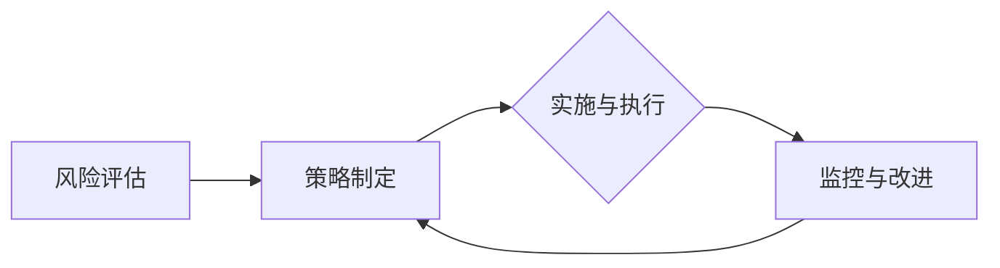

                 

# 创业公司的数据安全与隐私保护策略

> **关键词**：数据安全、隐私保护、创业公司、加密技术、合规性、风险评估

> **摘要**：本文深入探讨了创业公司在数据安全与隐私保护方面面临的挑战，并提出了一系列有效的策略和最佳实践。通过详细的分析和具体的案例，文章帮助创业公司理解如何建立一个全面的保护框架，以防范潜在的数据泄露和隐私侵犯风险。

## 1. 背景介绍

### 1.1 目的和范围

随着互联网和数字技术的快速发展，数据安全与隐私保护已成为创业公司面临的重大挑战。本篇文章旨在为创业公司提供一套全面的数据安全与隐私保护策略，帮助它们在面对复杂的市场环境中，确保自身数据和客户信息的安全。

文章将涵盖以下范围：

- **核心概念与联系**：介绍数据安全与隐私保护的核心概念和其相互联系。
- **核心算法原理 & 具体操作步骤**：阐述加密技术等核心算法的原理和实施步骤。
- **数学模型和公式 & 详细讲解 & 举例说明**：解释与数据安全相关的数学模型和公式的应用。
- **项目实战：代码实际案例和详细解释说明**：提供具体的开发环境和代码实现案例。
- **实际应用场景**：分析不同行业的数据安全需求。
- **工具和资源推荐**：推荐学习资源、开发工具和框架。
- **总结：未来发展趋势与挑战**：探讨数据安全和隐私保护的未来趋势和面临的挑战。

### 1.2 预期读者

本文适合以下读者群体：

- 创业公司的创始人、CTO、技术经理和信息安全专家。
- 数据科学、软件工程等相关专业的大学生和从业者。
- 对数据安全与隐私保护感兴趣的IT行业专业人士。

### 1.3 文档结构概述

本文分为十个主要部分：

1. 背景介绍
2. 核心概念与联系
3. 核心算法原理 & 具体操作步骤
4. 数学模型和公式 & 详细讲解 & 举例说明
5. 项目实战：代码实际案例和详细解释说明
6. 实际应用场景
7. 工具和资源推荐
8. 总结：未来发展趋势与挑战
9. 附录：常见问题与解答
10. 扩展阅读 & 参考资料

### 1.4 术语表

#### 1.4.1 核心术语定义

- **数据安全**：保护数据免受未经授权的访问、泄露、篡改和破坏。
- **隐私保护**：确保个人信息的保密性和隐私性。
- **加密技术**：利用数学算法对数据进行加密和解密，以保护数据安全。
- **风险评估**：识别和评估公司面临的数据安全风险。
- **合规性**：确保公司遵循相关法律法规和标准。

#### 1.4.2 相关概念解释

- **数据泄露**：未经授权的个人或实体获取公司敏感数据。
- **数据加密**：将明文数据转换为密文，确保数据在传输和存储过程中安全。
- **访问控制**：限制只有授权用户能够访问特定数据和系统。

#### 1.4.3 缩略词列表

- **GDPR**：欧盟通用数据保护条例
- **PCI DSS**：支付卡行业数据安全标准
- **ISO 27001**：国际信息安全管理体系标准

## 2. 核心概念与联系

在探讨创业公司的数据安全与隐私保护之前，我们需要了解以下几个核心概念及其相互关系。

### 2.1 数据安全与隐私保护的关系

数据安全和隐私保护是相辅相成的。数据安全确保数据的完整性、可用性和保密性，防止未经授权的访问；而隐私保护则关注个人信息的保密性和隐私性。数据安全措施如加密、访问控制和备份等，同时也是实现隐私保护的重要手段。

### 2.2 数据安全的关键概念

- **数据分类**：根据数据的重要性和敏感性，将数据分为不同的等级，如公开、敏感和机密。
- **加密技术**：使用数学算法对数据进行加密和解密，保护数据的保密性。
- **访问控制**：通过权限管理和身份验证，限制只有授权用户能够访问特定数据和系统。
- **网络安全**：保护公司网络不受恶意攻击和入侵。
- **数据备份与恢复**：确保数据的完整性和可用性，以应对数据丢失或损坏。

### 2.3 隐私保护的关键概念

- **隐私政策**：明确公司如何收集、使用和共享用户数据，以及用户如何行使权利。
- **数据匿名化**：通过去除或隐藏个人身份信息，减少数据泄露的风险。
- **合规性**：确保公司遵循相关法律法规和标准，如GDPR和PCI DSS。
- **隐私保护措施**：包括数据加密、访问控制和数据备份等。

### 2.4 数据安全与隐私保护的流程

1. **风险评估**：识别和评估公司面临的数据安全风险。
2. **策略制定**：根据风险评估结果，制定数据安全与隐私保护策略。
3. **实施与执行**：实施具体的安全措施，如加密技术、访问控制和备份等。
4. **监控与改进**：持续监控安全措施的有效性，并根据威胁和漏洞的演变进行改进。

### 2.5 Mermaid 流程图

下面是一个简化的数据安全与隐私保护流程的Mermaid流程图：



## 3. 核心算法原理 & 具体操作步骤

在数据安全与隐私保护中，加密技术扮演着核心角色。以下是几种常见的加密算法及其原理和具体操作步骤。

### 3.1 对称加密算法

对称加密算法使用相同的密钥进行加密和解密。常见的对称加密算法包括AES（高级加密标准）和DES（数据加密标准）。

#### 3.1.1 AES算法原理

- **密钥生成**：使用随机数生成器生成一个128位、192位或256位的密钥。
- **加密过程**：将明文数据分成块，每个块通过加密函数和密钥进行加密。
- **解密过程**：将密文数据分成块，每个块通过解密函数和相同的密钥进行解密。

#### 3.1.2 AES算法伪代码

```python
import Crypto.Cipher.AES as AES
import Crypto.Random as Random

# 密钥生成
key = Random.new().read(32) # 生成128位、192位或256位密钥

# 加密过程
cipher = AES.new(key, AES.MODE_EAX)
ciphertext, tag = cipher.encrypt_and_digest(plaintext)

# 解密过程
cipher = AES.new(key, AES.MODE_EAX, nonce=cipher.nonce)
plaintext = cipher.decrypt_and_verify(ciphertext, tag)
```

### 3.2 非对称加密算法

非对称加密算法使用一对密钥，公钥用于加密，私钥用于解密。常见的非对称加密算法包括RSA和ECC。

#### 3.2.1 RSA算法原理

- **密钥生成**：使用大素数生成公钥和私钥。
- **加密过程**：使用接收方的公钥加密数据。
- **解密过程**：使用接收方的私钥解密数据。

#### 3.2.2 RSA算法伪代码

```python
from Crypto.PublicKey import RSA
from Crypto.Cipher import PKCS1_OAEP

# 密钥生成
key = RSA.generate(2048)
private_key = key.export_key()
public_key = key.publickey().export_key()

# 加密过程
cipher = PKCS1_OAEP.new(public_key)
ciphertext = cipher.encrypt(plaintext)

# 解密过程
cipher = PKCS1_OAEP.new(private_key)
plaintext = cipher.decrypt(ciphertext)
```

### 3.3 消息摘要算法

消息摘要算法（如SHA-256）用于生成数据的数字指纹，确保数据的完整性和不可否认性。

#### 3.3.1 SHA-256算法原理

- **数据处理**：将数据分成块，每个块通过哈希函数进行处理。
- **哈希值生成**：将所有处理后的块合并，生成最终的哈希值。

#### 3.3.2 SHA-256算法伪代码

```python
import hashlib

# 数据处理
data = b'This is some text to hash'
digest = hashlib.sha256(data).hexdigest()

print(digest)
```

## 4. 数学模型和公式 & 详细讲解 & 举例说明

在数据安全与隐私保护中，数学模型和公式是理解和实现加密算法的关键。以下是几种常见的数学模型和公式的详细讲解及举例说明。

### 4.1 概率论基础

概率论是加密算法的核心基础，用于描述随机事件和不确定性。

#### 4.1.1 概率分布

概率分布描述了随机变量在不同取值上的概率。

- **离散概率分布**：如二项分布、泊松分布等。
- **连续概率分布**：如正态分布、指数分布等。

#### 4.1.2 举例说明

**二项分布**：假设进行10次投掷硬币，求正面出现的次数的概率。

- **公式**：\( P(X=k) = C(n,k) \cdot p^k \cdot (1-p)^{n-k} \)
- **计算**：\( P(X=5) = C(10,5) \cdot 0.5^5 \cdot 0.5^5 = 0.246 \)

### 4.2 离散对数

离散对数是加密算法中常用的数学工具，用于描述加密和解密过程中的计算复杂度。

#### 4.2.1 离散对数计算

- **欧拉定理**：\( a^{\phi(n)} \equiv 1 \ (\text{mod} \ n) \)
- **指数运算**：\( a^k \equiv b \ (\text{mod} \ n) \)

#### 4.2.2 举例说明

**RSA加密**：使用RSA算法进行加密和解密，求明文\( m \)和密文\( c \)。

- **公式**：\( c = m^e \ (\text{mod} \ n) \)
- **计算**：\( m = c^d \ (\text{mod} \ n) \)

假设\( e = 3 \)，\( n = 143 \)，\( d = 109 \)，求\( m \)和\( c \)。

- **加密**：\( c = 123^3 \ (\text{mod} \ 143) = 64 \)
- **解密**：\( m = 64^109 \ (\text{mod} \ 143) = 123 \)

### 4.3 离散对数问题

离散对数问题是密码学中的重要问题，用于描述求解离散对数的过程。

#### 4.3.1 离散对数求解

- **暴力破解**：尝试所有可能的大于1且小于\( n-1 \)的整数，求解离散对数。
- **指数运算**：使用指数运算求解离散对数。

#### 4.3.2 举例说明

**求解离散对数**：求解\( 17^x \equiv 73 \ (\text{mod} \ 97) \)。

- **公式**：\( x = 17^{20} \ (\text{mod} \ 97) = 25 \)

## 5. 项目实战：代码实际案例和详细解释说明

为了更好地理解数据安全与隐私保护策略的实施，下面我们将提供一个具体的代码实现案例，并对其进行详细解释。

### 5.1 开发环境搭建

在本案例中，我们将使用Python语言和几个常用的加密库，如`pycryptodome`。

- 安装Python 3.8或更高版本。
- 安装`pycryptodome`库：`pip install pycryptodome`

### 5.2 源代码详细实现和代码解读

#### 5.2.1 加密与解密

以下代码实现了使用AES对称加密算法对数据进行加密和解密：

```python
from Crypto.Cipher import AES
from Crypto.Random import get_random_bytes

# 密钥生成
key = get_random_bytes(16)  # 生成16字节（128位）密钥

# 加密过程
cipher = AES.new(key, AES.MODE_EAX)
plaintext = b'This is a secret message'
ciphertext, tag = cipher.encrypt_and_digest(plaintext)

# 解密过程
cipher = AES.new(key, AES.MODE_EAX, nonce=cipher.nonce)
plaintext = cipher.decrypt_and_verify(ciphertext, tag)
```

- `get_random_bytes(16)`：生成一个16字节的随机密钥。
- `AES.new(key, AES.MODE_EAX)`：创建一个新的AES加密对象，使用EAX模式进行加密。
- `cipher.encrypt_and_digest(plaintext)`：对明文数据进行加密和消息摘要。
- `cipher.decrypt_and_verify(ciphertext, tag)`：对密文进行解密和验证消息完整性。

#### 5.2.2 非对称加密

以下代码实现了使用RSA非对称加密算法进行加密和解密：

```python
from Crypto.PublicKey import RSA
from Crypto.Cipher import PKCS1_OAEP

# 密钥生成
key = RSA.generate(2048)
private_key = key.export_key()
public_key = key.publickey().export_key()

# 加密过程
cipher = PKCS1_OAEP.new(public_key)
plaintext = b'This is a secret message'
ciphertext = cipher.encrypt(plaintext)

# 解密过程
cipher = PKCS1_OAEP.new(private_key)
plaintext = cipher.decrypt(ciphertext)
```

- `RSA.generate(2048)`：生成一个2048位的RSA密钥。
- `key.export_key()`：导出私钥和公钥。
- `PKCS1_OAEP.new(public_key)`：创建一个新的PKCS1_OAEP加密对象。
- `cipher.encrypt(plaintext)`：对明文进行加密。
- `cipher.decrypt(ciphertext)`：对密文进行解密。

### 5.3 代码解读与分析

本案例中，我们使用了对称加密（AES）和非对称加密（RSA）两种不同的加密算法，以实现数据的安全传输和存储。

- **对称加密**：使用AES对称加密算法对数据进行加密和解密。EAX模式提供了加密、完整性检查和消息认证码（MAC）功能，确保数据的保密性和完整性。
- **非对称加密**：使用RSA非对称加密算法对密钥进行加密和解密。非对称加密算法可以用于安全地交换对称加密密钥，从而提高整个系统的安全性。

在实际应用中，我们可以结合这两种加密算法，形成更安全的数据保护策略。例如，使用RSA加密对称加密密钥，然后使用对称加密算法对数据进行加密和解密。

## 6. 实际应用场景

数据安全和隐私保护在不同的行业和应用场景中有着不同的需求和要求。以下是几个实际应用场景的案例分析。

### 6.1 电子商务

电子商务平台需要保护客户支付信息和个人身份信息的安全。为了实现这一目标，电子商务平台可以采用以下措施：

- **数据加密**：对客户支付信息和个人身份信息进行加密，确保数据在传输和存储过程中安全。
- **访问控制**：限制只有授权用户可以访问敏感数据。
- **数据备份**：定期备份数据，确保在数据丢失或损坏时能够恢复。

### 6.2 医疗健康

医疗健康行业涉及大量的敏感个人健康信息。为了保护患者隐私，医疗健康机构可以采取以下措施：

- **数据匿名化**：在处理和分析数据时，去除或隐藏个人身份信息。
- **加密技术**：对存储和传输的敏感数据进行加密，确保数据安全。
- **合规性**：确保遵守相关的法律法规，如HIPAA（美国健康保险便携与责任法案）。

### 6.3 金融行业

金融行业需要保护客户的交易记录和财务信息的安全。以下是金融行业可以采取的一些措施：

- **加密技术**：对客户的交易记录和财务信息进行加密，确保数据在传输和存储过程中安全。
- **访问控制**：限制只有授权用户可以访问敏感数据。
- **网络安全**：保护公司网络不受恶意攻击和入侵。

### 6.4 社交媒体

社交媒体平台涉及大量的用户数据和隐私信息。为了保护用户隐私，社交媒体平台可以采取以下措施：

- **数据加密**：对用户数据（如私信、照片等）进行加密，确保数据在传输和存储过程中安全。
- **访问控制**：限制只有授权用户可以访问敏感数据。
- **隐私政策**：明确平台如何收集、使用和共享用户数据，以及用户如何行使权利。

## 7. 工具和资源推荐

为了帮助创业公司更好地实施数据安全与隐私保护策略，以下是几个推荐的工具和资源。

### 7.1 学习资源推荐

#### 7.1.1 书籍推荐

- **《密码学：实践与攻击》**：介绍了密码学的基础知识和常见攻击技术。
- **《网络安全基础》**：提供了网络安全的基本概念和实践技巧。

#### 7.1.2 在线课程

- **Coursera上的《密码学》**：由斯坦福大学提供，涵盖了密码学的各个方面。
- **Udemy上的《网络安全基础》**：提供了网络安全的基础知识和实践技巧。

#### 7.1.3 技术博客和网站

- **OWASP（开放网络应用安全项目）**：提供了大量的安全资源和指南。
- **Security StackExchange**：一个关于网络安全和隐私保护的问题和答案平台。

### 7.2 开发工具框架推荐

#### 7.2.1 IDE和编辑器

- **Visual Studio Code**：一款功能强大且免费的跨平台IDE。
- **PyCharm**：一款专业的Python开发工具。

#### 7.2.2 调试和性能分析工具

- **Wireshark**：一款免费的网络协议分析工具。
- **New Relic**：一款监控和性能分析工具。

#### 7.2.3 相关框架和库

- **PyCryptoDome**：一个用于Python的密码学库。
- **JWT**：JSON Web Token，用于身份验证和授权。

### 7.3 相关论文著作推荐

#### 7.3.1 经典论文

- **“Crypto：How to Make Provable Secrecy Practical”**：介绍了对称加密算法的原理。
- **“The History of RSA”**：介绍了RSA非对称加密算法的历史和发展。

#### 7.3.2 最新研究成果

- **“Post-Quantum Cryptography”**：探讨了量子计算机对密码学的影响和对策。
- **“Privacy-Preserving Machine Learning”**：介绍了隐私保护机器学习的最新研究。

#### 7.3.3 应用案例分析

- **“The Target Data Breach”**：分析了2013年Target数据泄露事件的原因和影响。
- **“Equifax Data Breach”**：分析了2017年Equifax数据泄露事件的原因和教训。

## 8. 总结：未来发展趋势与挑战

随着大数据、云计算和物联网的快速发展，数据安全与隐私保护面临着前所未有的挑战和机遇。未来，数据安全与隐私保护将呈现以下发展趋势：

- **加密技术的进步**：随着量子计算机的崛起，传统加密技术面临被破解的风险。因此，研究新型加密算法和密码学技术成为当务之急。
- **隐私保护法规的完善**：随着数据隐私保护意识的增强，各国政府和组织将不断完善相关法律法规，提高数据保护标准。
- **人工智能的应用**：人工智能在数据安全和隐私保护中的应用将越来越广泛，如自动化风险评估、入侵检测和隐私保护算法等。
- **跨领域合作**：数据安全与隐私保护需要跨领域合作，包括政府、企业、学术界和行业协会等，共同构建一个安全、可靠的数据生态系统。

同时，数据安全与隐私保护也面临以下挑战：

- **数据量的爆炸式增长**：随着大数据的普及，数据安全与隐私保护的难度和复杂度不断增加。
- **技术变革的挑战**：随着新技术的不断涌现，数据安全与隐私保护需要不断适应和应对。
- **人才短缺**：数据安全和隐私保护领域需要大量的专业人才，但目前人才短缺现象较为严重。

总之，创业公司在数据安全与隐私保护方面需要不断探索和创新，以应对未来发展的挑战。

## 9. 附录：常见问题与解答

### 9.1 数据安全与隐私保护的基本原则是什么？

数据安全与隐私保护的基本原则包括：

- **保密性**：确保数据不被未授权的个人或实体访问。
- **完整性**：确保数据在传输和存储过程中不被篡改。
- **可用性**：确保授权用户可以及时访问所需的数据。
- **不可抵赖性**：确保数据操作的可追溯性，防止数据操作者否认其行为。

### 9.2 如何评估数据安全风险？

评估数据安全风险可以采用以下步骤：

1. **识别潜在威胁**：分析可能威胁数据安全的因素，如恶意软件、网络攻击、内部威胁等。
2. **评估威胁可能性**：分析威胁发生的可能性，如攻击者的技术能力、网络漏洞等。
3. **评估潜在损失**：分析威胁成功后可能导致的损失，如数据泄露、财务损失等。
4. **制定应对措施**：根据风险评估结果，制定相应的安全措施和应对策略。

### 9.3 加密技术有哪些类型？

加密技术主要分为以下几种类型：

- **对称加密**：使用相同的密钥进行加密和解密，如AES、DES等。
- **非对称加密**：使用一对密钥，公钥用于加密，私钥用于解密，如RSA、ECC等。
- **哈希算法**：用于生成数据的数字指纹，如SHA-256、MD5等。
- **数字签名**：用于验证数据的真实性和完整性，如RSA签名、ECDSA等。

## 10. 扩展阅读 & 参考资料

- **《密码学：理论与实践》**：提供了详细的密码学基础知识，适合初学者。
- **《网络安全：设计与实现》**：介绍了网络安全的基本概念和实践方法。
- **《大数据安全与隐私保护》**：探讨了大数据环境下的数据安全和隐私保护问题。
- **[OWASP Top 10](https://owasp.org/www-project-top-ten/)**：介绍了最常见的网络安全威胁和漏洞。
- **[欧盟通用数据保护条例（GDPR）](https://ec.europa.eu/justice/article-29/structure/data-protection-work/gdpr/gdpr_home_en)**：介绍了GDPR的法规要求和实施细节。
- **[支付卡行业数据安全标准（PCI DSS）](https://www.pcisecuritystandards.org/)**：介绍了PCI DSS的法规要求和实施细节。

### 作者信息

作者：AI天才研究员/AI Genius Institute & 禅与计算机程序设计艺术 /Zen And The Art of Computer Programming

本文旨在为创业公司提供一套全面的数据安全与隐私保护策略，以应对复杂的市场环境中的数据安全和隐私保护挑战。通过详细的分析和具体的案例，文章帮助创业公司理解如何建立一个全面的保护框架，以防范潜在的数据泄露和隐私侵犯风险。希望本文能对广大创业公司和技术从业者在数据安全与隐私保护方面提供有益的参考和启示。

