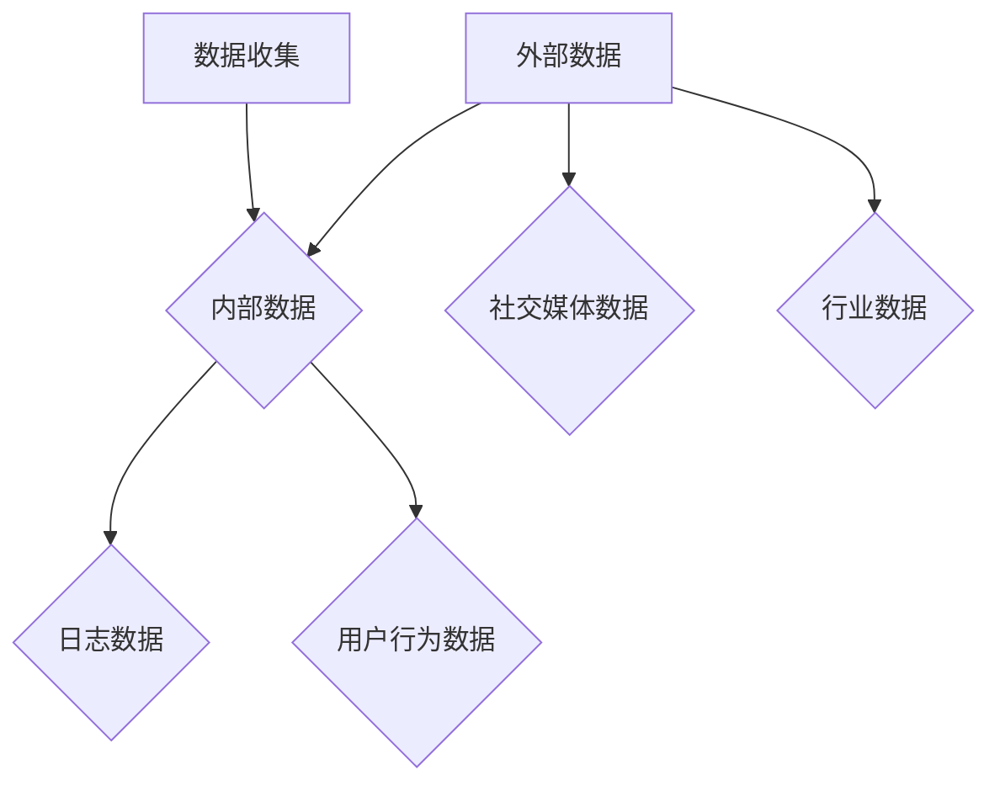
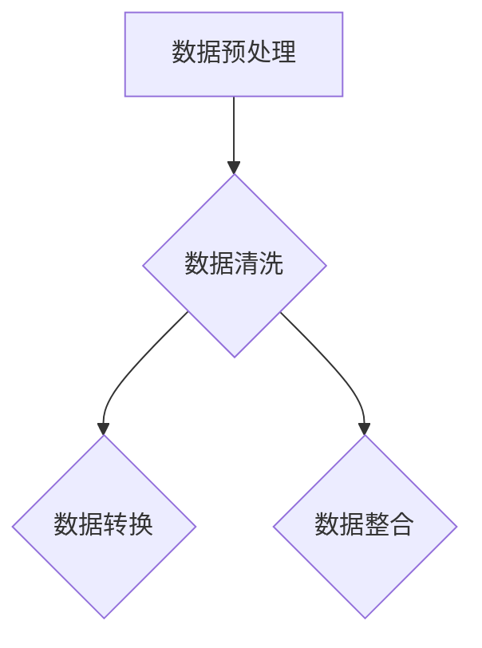
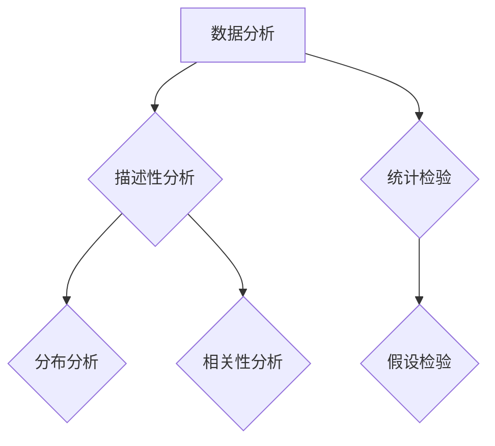
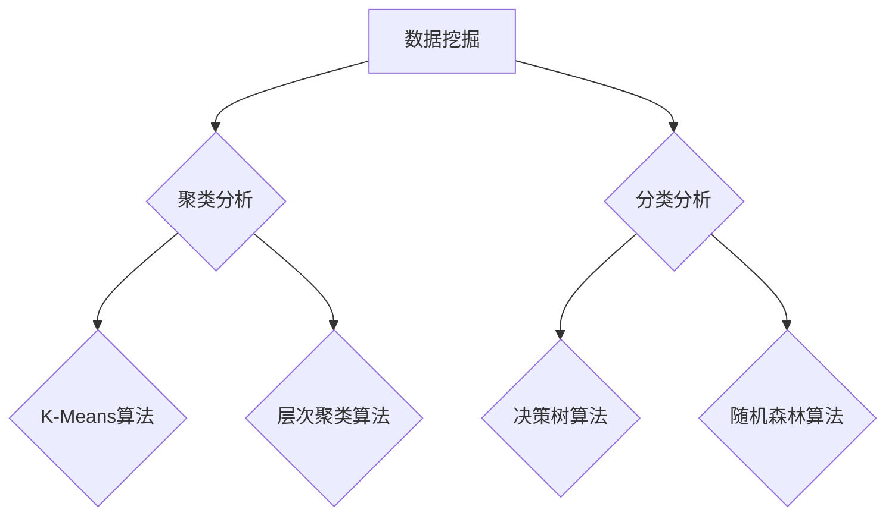
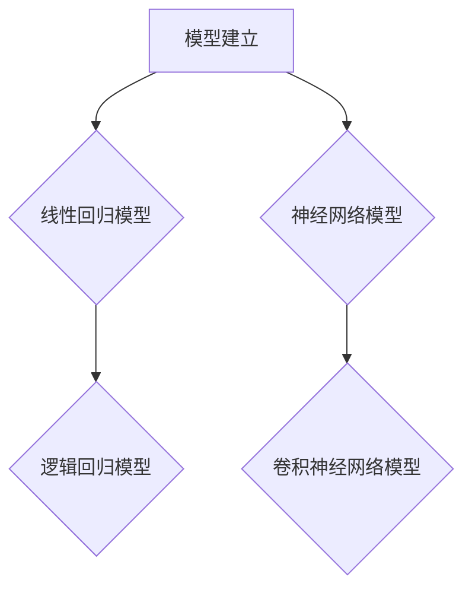
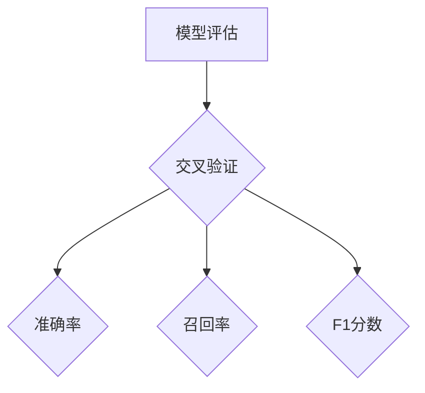
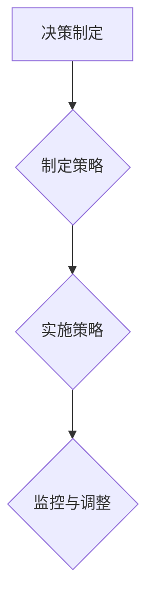

                 

# 创业公司的数据驱动决策：用数据指导业务增长

> 关键词：数据驱动决策、业务增长、数据挖掘、分析工具、机器学习
>
> 摘要：本文将深入探讨创业公司在业务发展过程中如何运用数据驱动决策。通过核心概念、算法原理、数学模型以及实际案例的详细讲解，我们希望帮助创业者理解数据的价值，掌握数据分析的方法和工具，从而实现业务的快速增长。

## 1. 背景介绍

### 1.1 目的和范围

本文旨在为创业公司提供一份关于数据驱动决策的指南，帮助创业者在激烈的市场竞争中找到业务增长的突破口。我们将从以下几个方面展开讨论：

- 核心概念与联系
- 核心算法原理与具体操作步骤
- 数学模型与公式
- 项目实战：代码实际案例
- 实际应用场景
- 工具和资源推荐
- 未来发展趋势与挑战

### 1.2 预期读者

本文适合以下读者群体：

- 创业公司创始人及高管
- 数据分析师和数据科学家
- 对业务增长有浓厚兴趣的技术人员
- 希望提升数据分析能力的专业人士

### 1.3 文档结构概述

本文结构如下：

1. 背景介绍：阐述本文的目的、范围、预期读者及文档结构。
2. 核心概念与联系：介绍数据驱动决策的相关概念及其相互关系。
3. 核心算法原理与具体操作步骤：讲解数据驱动决策的算法原理和操作步骤。
4. 数学模型与公式：阐述数据驱动决策涉及的数学模型和公式。
5. 项目实战：代码实际案例：提供实际案例，展示数据驱动决策的应用。
6. 实际应用场景：分析数据驱动决策在创业公司的实际应用。
7. 工具和资源推荐：推荐学习资源、开发工具和框架。
8. 未来发展趋势与挑战：探讨数据驱动决策的未来趋势和挑战。
9. 附录：常见问题与解答。
10. 扩展阅读 & 参考资料：提供更多深入学习的资源。

### 1.4 术语表

#### 1.4.1 核心术语定义

- **数据驱动决策**：基于数据分析和挖掘，通过数据来指导业务决策。
- **业务增长**：企业通过持续优化和调整，实现收入和市场份额的增加。
- **数据挖掘**：从大量数据中提取出有价值的信息和模式。
- **分析工具**：用于数据收集、处理、分析和可视化的软件工具。
- **机器学习**：利用数据建立模型，进行自动学习和预测。

#### 1.4.2 相关概念解释

- **数据分析**：对数据进行清洗、转换、建模和解释，以便提取有用信息。
- **数据可视化**：通过图形化手段展示数据分析结果，帮助用户直观理解数据。
- **预测分析**：利用历史数据和模型，对未来趋势进行预测。

#### 1.4.3 缩略词列表

- **BI**：商业智能（Business Intelligence）
- **CRM**：客户关系管理（Customer Relationship Management）
- **SQL**：结构化查询语言（Structured Query Language）
- **Python**：一种通用编程语言，广泛应用于数据分析和机器学习

## 2. 核心概念与联系

为了更好地理解数据驱动决策，我们需要了解以下几个核心概念及其相互关系。

### 2.1 数据分析、数据挖掘与机器学习


#### 数据分析

数据分析是数据驱动决策的基础。它包括数据的收集、清洗、转换、建模和解释等步骤。通过数据分析，我们可以从大量数据中提取出有价值的信息，为决策提供依据。

#### 数据挖掘

数据挖掘是数据分析的延伸，它侧重于从大量数据中提取出隐藏的模式和关联。数据挖掘方法包括聚类、分类、关联规则挖掘等，可以帮助企业发现新的商机和优化业务流程。

#### 机器学习

机器学习是数据挖掘的高级形式，它通过建立数学模型，从数据中自动学习和预测。机器学习模型可以用于分类、回归、聚类等多种任务，帮助企业实现自动化决策。

### 2.2 数据驱动决策的流程

数据驱动决策的流程包括以下几个步骤：

1. **问题定义**：明确业务需求，确定需要解决的问题。
2. **数据收集**：收集与问题相关的数据，包括内部数据和外部数据。
3. **数据预处理**：对数据进行清洗、转换和整合，确保数据质量。
4. **数据分析**：运用数据分析方法和工具，提取有价值的信息。
5. **数据挖掘**：利用数据挖掘方法，发现数据中的模式和关联。
6. **模型建立**：基于数据挖掘结果，建立预测模型。
7. **模型评估**：评估模型性能，确保模型的准确性和可靠性。
8. **决策制定**：根据模型预测结果，制定业务决策。

### 2.3 数据驱动决策的优势

- **客观性**：基于数据的事实和模式，减少主观判断的影响。
- **准确性**：利用机器学习模型进行预测，提高决策的准确性。
- **效率**：自动化决策过程，节省人力和时间成本。
- **适应性**：根据数据变化，实时调整决策策略，适应市场变化。

## 3. 核心算法原理与具体操作步骤

在数据驱动决策中，核心算法原理和具体操作步骤至关重要。以下是一个典型的数据驱动决策流程及其算法原理：

### 3.1 数据收集



### 3.2 数据预处理



### 3.3 数据分析



### 3.4 数据挖掘



### 3.5 模型建立



### 3.6 模型评估



### 3.7 决策制定



## 4. 数学模型和公式与详细讲解

在数据驱动决策过程中，数学模型和公式是关键组成部分。以下是一些常用的数学模型和公式：

### 4.1 线性回归模型

线性回归模型是一种预测连续值的简单模型。其公式如下：

$$ y = \beta_0 + \beta_1 \cdot x $$

其中，$y$ 是预测值，$x$ 是输入特征，$\beta_0$ 是截距，$\beta_1$ 是斜率。

### 4.2 逻辑回归模型

逻辑回归模型是一种预测分类结果的模型。其公式如下：

$$ P(y=1) = \frac{1}{1 + e^{-(\beta_0 + \beta_1 \cdot x)}} $$

其中，$P(y=1)$ 是预测概率，$e$ 是自然对数的底数，$\beta_0$ 是截距，$\beta_1$ 是斜率。

### 4.3 决策树模型

决策树模型是一种预测分类结果的模型。其公式如下：

$$ y = \sum_{i=1}^{n} \beta_i \cdot x_i $$

其中，$y$ 是预测值，$x_i$ 是输入特征，$\beta_i$ 是权重。

### 4.4 神经网络模型

神经网络模型是一种预测连续值或分类结果的复杂模型。其公式如下：

$$ y = \sigma(\beta_0 + \sum_{i=1}^{n} \beta_i \cdot x_i) $$

其中，$y$ 是预测值，$\sigma$ 是激活函数，$\beta_0$ 是截距，$\beta_i$ 是权重。

### 4.5 损失函数

损失函数用于评估模型预测的误差。以下是一些常用的损失函数：

- 均方误差（MSE）：$$ MSE = \frac{1}{n} \sum_{i=1}^{n} (y_i - \hat{y}_i)^2 $$
- 交叉熵损失（Cross-Entropy）：$$ Cross-Entropy = -\frac{1}{n} \sum_{i=1}^{n} y_i \cdot \log(\hat{y}_i) $$

## 5. 项目实战：代码实际案例和详细解释说明

为了更好地理解数据驱动决策的实际应用，我们将通过一个实际案例进行讲解。

### 5.1 开发环境搭建

在开始项目之前，我们需要搭建一个合适的开发环境。这里我们使用 Python 作为编程语言，相关工具和库如下：

- Python 3.8+
- Jupyter Notebook
- pandas
- numpy
- scikit-learn
- matplotlib

安装以上工具和库后，即可开始编写代码。

### 5.2 源代码详细实现和代码解读

以下是一个简单的数据驱动决策案例，通过分析用户行为数据预测用户是否购买产品。

```python
import pandas as pd
import numpy as np
from sklearn.model_selection import train_test_split
from sklearn.ensemble import RandomForestClassifier
from sklearn.metrics import accuracy_score, recall_score, f1_score

# 5.2.1 数据收集
data = pd.read_csv('user_behavior.csv')
data.head()

# 5.2.2 数据预处理
data = data.drop(['user_id'], axis=1)
data = data.dropna()

# 5.2.3 数据分析
data.describe()

# 5.2.4 数据挖掘
X = data.drop(['purchased'], axis=1)
y = data['purchased']
X_train, X_test, y_train, y_test = train_test_split(X, y, test_size=0.2, random_state=42)

# 5.2.5 模型建立
model = RandomForestClassifier(n_estimators=100, random_state=42)
model.fit(X_train, y_train)

# 5.2.6 模型评估
y_pred = model.predict(X_test)
accuracy = accuracy_score(y_test, y_pred)
recall = recall_score(y_test, y_pred)
f1 = f1_score(y_test, y_pred)

print(f'Accuracy: {accuracy:.2f}')
print(f'Recall: {recall:.2f}')
print(f'F1 Score: {f1:.2f}')

# 5.2.7 决策制定
# 根据模型预测结果，制定相应的营销策略，如向购买概率高的用户发送促销信息
```

### 5.3 代码解读与分析

- **数据收集**：从 CSV 文件中读取用户行为数据。
- **数据预处理**：删除无关特征（如用户 ID），处理缺失值。
- **数据分析**：对数据进行描述性统计，了解数据分布和特征关系。
- **数据挖掘**：将数据分为特征集 X 和标签集 y，进行训练集和测试集的划分。
- **模型建立**：使用随机森林分类器建立模型，并进行训练。
- **模型评估**：使用测试集对模型进行评估，计算准确率、召回率和 F1 分数。
- **决策制定**：根据模型预测结果，制定相应的营销策略。

通过这个案例，我们展示了如何运用数据驱动决策实现业务增长。在实际应用中，可以根据业务需求，选择合适的模型和算法，进行数据分析和预测，从而制定出更精准的决策。

## 6. 实际应用场景

数据驱动决策在创业公司的实际应用场景非常广泛。以下是一些典型的应用场景：

### 6.1 用户行为分析

通过对用户行为数据进行分析，创业公司可以了解用户的偏好和需求，从而优化产品功能和营销策略。例如，通过分析用户浏览、点击和购买行为，可以预测用户购买概率，为精准营销提供依据。

### 6.2 供应链优化

数据驱动决策可以帮助创业公司优化供应链，提高生产效率。例如，通过分析市场需求和库存数据，可以预测产品需求量，合理规划生产计划和库存管理，减少库存成本和缺货风险。

### 6.3 客户关系管理

通过数据挖掘和分析，创业公司可以更好地了解客户需求，提供个性化的产品和服务。例如，分析客户反馈和评价，识别客户满意度，为改进产品和服务提供参考。

### 6.4 市场营销

数据驱动决策可以帮助创业公司制定更有效的营销策略，提高广告投放效果。例如，通过分析用户行为和购买历史，可以确定目标用户群体，优化广告投放渠道和内容。

### 6.5 财务管理

数据驱动决策可以帮助创业公司优化财务管理，提高资金使用效率。例如，通过分析财务数据，预测收入和支出，制定预算规划和风险控制策略。

## 7. 工具和资源推荐

为了更好地实现数据驱动决策，创业公司需要掌握相关的工具和资源。以下是一些建议：

### 7.1 学习资源推荐

#### 7.1.1 书籍推荐

- 《Python数据分析基础教程：Numpy学习指南》
- 《机器学习实战》
- 《Python数据科学 Handbook》

#### 7.1.2 在线课程

- Coursera：数据科学专业课程
- edX：机器学习课程
- Udacity：数据工程师纳米学位

#### 7.1.3 技术博客和网站

- DataCamp
- Analytics Vidhya
- Medium 上的数据科学专栏

### 7.2 开发工具框架推荐

#### 7.2.1 IDE和编辑器

- Jupyter Notebook
- PyCharm
- VSCode

#### 7.2.2 调试和性能分析工具

- PyDebug
- Profiler
- Py-Spy

#### 7.2.3 相关框架和库

- pandas：数据处理
- numpy：数值计算
- scikit-learn：机器学习
- matplotlib：数据可视化

### 7.3 相关论文著作推荐

#### 7.3.1 经典论文

- "The Elements of Statistical Learning"（统计学习基础）
- "Machine Learning"（机器学习）

#### 7.3.2 最新研究成果

- "Deep Learning"（深度学习）
- "Reinforcement Learning: An Introduction"（强化学习）

#### 7.3.3 应用案例分析

- "Data Science at Microsoft"（微软的数据科学实践）
- "AI in Healthcare"（人工智能在医疗领域的应用）

## 8. 总结：未来发展趋势与挑战

数据驱动决策在创业公司中的应用前景广阔，未来发展趋势如下：

- **人工智能与大数据的深度融合**：随着人工智能技术的发展，数据驱动决策将更加智能化和自动化。
- **实时数据分析和预测**：实时数据分析和预测将为创业公司提供更及时的业务洞察，助力快速响应市场变化。
- **数据安全与隐私保护**：在数据驱动决策过程中，保护数据安全和隐私将成为重要议题。

然而，数据驱动决策也面临一系列挑战：

- **数据质量和可靠性**：数据质量和可靠性对决策结果至关重要，创业公司需要确保数据质量。
- **算法透明性和可解释性**：随着算法模型的复杂度增加，算法的透明性和可解释性成为关键挑战。
- **数据隐私和安全**：在数据收集和分析过程中，确保数据隐私和安全是创业公司必须面对的挑战。

## 9. 附录：常见问题与解答

### 9.1 什么是数据驱动决策？

数据驱动决策是指通过收集、分析和挖掘数据，为业务决策提供依据的方法。它强调以数据为核心，减少主观判断，提高决策的客观性和准确性。

### 9.2 数据驱动决策的优势是什么？

数据驱动决策的优势包括：

- 客观性：基于数据的事实和模式，减少主观判断的影响。
- 准确性：利用机器学习模型进行预测，提高决策的准确性。
- 效率：自动化决策过程，节省人力和时间成本。
- 适应性：根据数据变化，实时调整决策策略，适应市场变化。

### 9.3 数据驱动决策的流程包括哪些步骤？

数据驱动决策的流程包括以下几个步骤：

- 问题定义
- 数据收集
- 数据预处理
- 数据分析
- 数据挖掘
- 模型建立
- 模型评估
- 决策制定

## 10. 扩展阅读 & 参考资料

- 《Python数据分析基础教程：Numpy学习指南》
- 《机器学习实战》
- 《Python数据科学 Handbook》
- Coursera：数据科学专业课程
- edX：机器学习课程
- Udacity：数据工程师纳米学位
- DataCamp
- Analytics Vidhya
- Medium 上的数据科学专栏
- "The Elements of Statistical Learning"（统计学习基础）
- "Machine Learning"（机器学习）
- "Deep Learning"（深度学习）
- "Reinforcement Learning: An Introduction"（强化学习）
- "Data Science at Microsoft"（微软的数据科学实践）
- "AI in Healthcare"（人工智能在医疗领域的应用）作者：AI天才研究员/AI Genius Institute & 禅与计算机程序设计艺术 /Zen And The Art of Computer Programming

