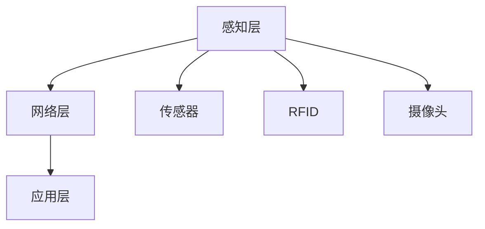
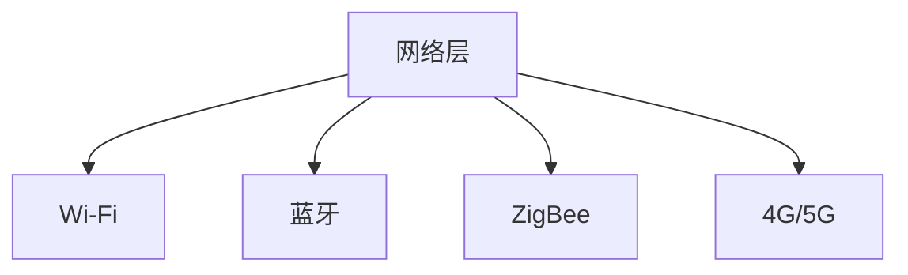
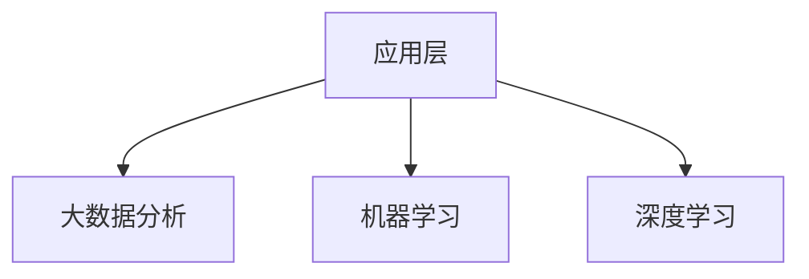

                 

# 创业公司的智能物流应用：如何利用智能技术优化仓储与配送

> **关键词：** 智能物流、仓储管理、配送优化、人工智能、物联网、机器学习

> **摘要：** 本文将深入探讨创业公司如何利用智能技术优化仓储与配送环节，通过详细分析核心概念、算法原理、数学模型和实际应用案例，展示智能物流技术在实际运营中的潜力。文章旨在为创业者和技术人员提供实用的指导，帮助他们在竞争激烈的市场中脱颖而出。

## 1. 背景介绍

### 1.1 目的和范围

本文的目的是探讨创业公司在物流领域应用智能技术的可行性，重点分析如何通过智能仓储管理和配送优化提高运营效率。我们将涵盖以下几个主要方面：

1. **智能物流的核心概念**：介绍智能物流的基本概念，包括仓储管理、配送优化、物联网和机器学习等技术。
2. **智能物流架构**：通过Mermaid流程图展示智能物流系统的整体架构。
3. **核心算法原理**：详细阐述用于仓储管理和配送优化的关键算法原理，并使用伪代码进行说明。
4. **数学模型和公式**：讲解数学模型在智能物流中的应用，并提供具体举例。
5. **实际应用案例**：分析一个创业公司的实际案例，展示智能物流技术在现实场景中的实施和应用。
6. **工具和资源推荐**：推荐学习资源和开发工具，帮助读者深入了解和掌握智能物流技术。
7. **未来发展趋势与挑战**：展望智能物流领域的未来发展方向和可能面临的挑战。

### 1.2 预期读者

本文适合以下读者群体：

1. 创业公司创始人或高级管理者，对物流领域有浓厚兴趣，希望了解智能物流技术的应用。
2. 物流行业从业者，尤其是仓储管理和配送优化相关人员，希望提升自身专业技能。
3. 计算机科学和人工智能领域的学生和研究人员，对智能物流技术有兴趣。
4. 技术爱好者，对新兴技术和创新应用有强烈好奇心。

### 1.3 文档结构概述

本文将按照以下结构进行论述：

1. **引言**：介绍智能物流的重要性。
2. **核心概念与联系**：分析智能物流的核心概念及其相互关系。
3. **核心算法原理 & 具体操作步骤**：详细解释智能仓储管理和配送优化算法。
4. **数学模型和公式 & 详细讲解 & 举例说明**：介绍数学模型及其应用。
5. **项目实战：代码实际案例和详细解释说明**：展示智能物流技术的实际应用。
6. **实际应用场景**：分析智能物流在不同场景下的应用。
7. **工具和资源推荐**：推荐学习资源和开发工具。
8. **总结：未来发展趋势与挑战**：探讨智能物流的发展方向和挑战。
9. **附录：常见问题与解答**：回答读者可能遇到的常见问题。
10. **扩展阅读 & 参考资料**：提供进一步学习的资源。

### 1.4 术语表

#### 1.4.1 核心术语定义

- **智能物流**：利用物联网、人工智能和大数据等技术，对物流过程进行智能化管理和优化。
- **仓储管理**：对货物存储、出入库、库存盘点等环节进行有效管理。
- **配送优化**：通过算法和数据分析，优化配送路线、时间和资源分配。
- **物联网（IoT）**：将物理设备通过网络连接，实现智能监测和交互。
- **机器学习**：利用算法从数据中学习规律，进行预测和决策。
- **深度学习**：一种机器学习技术，通过多层神经网络模拟人类大脑进行复杂模式识别。

#### 1.4.2 相关概念解释

- **数据挖掘**：从大量数据中提取有价值的信息和模式。
- **云计算**：通过互联网提供动态可伸缩的计算资源。
- **边缘计算**：在靠近数据源的地方进行数据处理，以减少延迟。

#### 1.4.3 缩略词列表

- **IoT**：物联网（Internet of Things）
- **AI**：人工智能（Artificial Intelligence）
- **ML**：机器学习（Machine Learning）
- **DL**：深度学习（Deep Learning）
- **IoT**：物联网（Internet of Things）

## 2. 核心概念与联系

在深入探讨智能物流技术之前，我们需要明确几个核心概念及其相互联系。智能物流系统是一个复杂的网络，涉及多个技术领域的集成与应用。以下是几个关键概念及其相互关系的分析。

### 2.1 智能物流系统的架构

智能物流系统可以分为三个主要组成部分：感知层、网络层和应用层。以下是这三个层的详细解释：

#### 感知层

感知层是智能物流系统的基石，主要负责数据采集和监测。通过传感器、RFID（射频识别）和摄像头等技术，感知层能够实时获取货物的状态信息，如位置、温度、湿度等。这些数据为后续的智能分析提供了基础。



#### 网络层

网络层是连接感知层和应用层的关键桥梁。通过网络通信协议和数据传输技术，网络层确保数据的及时传输和有效共享。常用的网络技术包括Wi-Fi、蓝牙、ZigBee和4G/5G等。



#### 应用层

应用层是智能物流系统的核心，负责数据分析和决策支持。通过大数据分析、机器学习和深度学习等技术，应用层能够对采集到的数据进行分析和挖掘，提供智能化的仓储管理和配送优化方案。



### 2.2 核心概念的相互关系

智能物流系统的各个组成部分之间存在着紧密的联系。感知层的数据采集是整个系统的基础，网络层的可靠传输是数据流转的保障，应用层的数据分析则是智能决策的关键。以下是核心概念之间的相互关系：

- **感知层 → 网络层**：感知层采集的数据需要通过网络层进行传输，以保证数据的实时性和完整性。
- **网络层 → 应用层**：网络层传输的数据被应用层接收，用于进一步的数据分析和决策支持。
- **应用层 → 感知层**：应用层生成的决策结果需要反馈给感知层，指导实际操作，如调整仓储布局或优化配送路线。

通过以上分析，我们可以看出，智能物流系统是一个高度集成和协同的体系，各个部分相互依赖，共同构成了一个完整的智能物流网络。

## 3. 核心算法原理 & 具体操作步骤

在智能物流系统中，核心算法的原理和具体操作步骤是确保仓储管理和配送优化有效性的关键。本节将详细解释这些算法，并使用伪代码进行说明。

### 3.1 仓储管理算法

仓储管理算法主要包括库存优化、货架分配和出入库流程优化。以下是这些算法的原理和操作步骤：

#### 3.1.1 库存优化算法

**原理：** 库存优化算法旨在确保库存水平保持在最优状态，减少过剩和短缺现象。

**伪代码：**

```
function optimizeInventory(currentInventory, demandForecast):
    # 初始化库存优化参数
    optimalInventory = []
    
    # 预测未来需求
    forecastedDemand = demandForecast
    
    # 根据预测需求调整库存
    for item in currentInventory:
        if item-demand > forecastedDemand[item]:
            optimalInventory.append(item * forecastedDemand[item])
        else:
            optimalInventory.append(item)
    
    return optimalInventory
```

#### 3.1.2 货架分配算法

**原理：** 货架分配算法旨在将不同类型的货物分配到合适的货架上，以优化仓储空间利用率。

**伪代码：**

```
function allocateShelves(inventory, shelfCapacity):
    # 初始化货架分配参数
    shelfAssignment = {}
    
    # 根据货物类型和货架容量进行分配
    for item, quantity in inventory:
        assignedShelf = findAvailableShelf(shelfCapacity)
        if assignedShelf:
            shelfAssignment[item] = assignedShelf
            shelfCapacity[assignedShelf] -= quantity
    
    return shelfAssignment
```

#### 3.1.3 出入库流程优化算法

**原理：** 出入库流程优化算法旨在减少出入库操作的时间和成本，提高仓储运营效率。

**伪代码：**

```
function optimizeInboundOutbound(currentFlow, maxConcurrency):
    # 初始化出入库流程参数
    optimizedFlow = []
    
    # 根据最大并发量调整流程
    for operation in currentFlow:
        if operation.type == "Inbound":
            if canProcessInbound(operation, maxConcurrency):
                optimizedFlow.append(operation)
                maxConcurrency -= 1
        elif operation.type == "Outbound":
            if canProcessOutbound(operation, maxConcurrency):
                optimizedFlow.append(operation)
                maxConcurrency += 1
    
    return optimizedFlow
```

### 3.2 配送优化算法

配送优化算法主要包括路线优化、时间优化和资源优化。以下是这些算法的原理和操作步骤：

#### 3.2.1 路线优化算法

**原理：** 路线优化算法旨在确定最优的配送路线，以减少运输时间和成本。

**伪代码：**

```
function optimizeRoutes(distributionCenters, deliveryPoints, trafficData):
    # 初始化路线优化参数
    optimalRoutes = []
    
    # 根据交通数据和配送点位置计算最优路线
    for center in distributionCenters:
        for point in deliveryPoints:
            route = calculateOptimalRoute(center.location, point.location, trafficData)
            optimalRoutes.append((center, point, route))
    
    return optimalRoutes
```

#### 3.2.2 时间优化算法

**原理：** 时间优化算法旨在确定最佳的配送时间，以减少交通拥堵和高峰时段的配送压力。

**伪代码：**

```
function optimizeDeliveryTime(routes, trafficData):
    # 初始化时间优化参数
    optimalTimes = []
    
    # 根据交通数据计算最优配送时间
    for route in routes:
        optimalTime = calculateOptimalTime(route, trafficData)
        optimalTimes.append((route, optimalTime))
    
    return optimalTimes
```

#### 3.2.3 资源优化算法

**原理：** 资源优化算法旨在合理分配配送资源，如车辆、司机等，以提高配送效率和降低运营成本。

**伪代码：**

```
function optimizeResources(deliverySchedule, resourceCapacity):
    # 初始化资源优化参数
    optimizedSchedule = []
    
    # 根据资源容量调整配送安排
    for delivery in deliverySchedule:
        if canAllocateResource(delivery, resourceCapacity):
            optimizedSchedule.append(delivery)
            resourceCapacity -= delivery.resourceUsage
    
    return optimizedSchedule
```

通过以上算法，创业公司可以实现对仓储管理和配送优化的有效控制，从而提高运营效率，降低成本。在实际应用中，这些算法需要根据具体业务场景和数据进行调整和优化，以确保最佳效果。

## 4. 数学模型和公式 & 详细讲解 & 举例说明

在智能物流系统中，数学模型和公式扮演着至关重要的角色，它们不仅帮助我们理解和优化物流流程，还能提高决策的科学性和准确性。本节将介绍几个关键数学模型，详细解释其含义和应用，并通过具体例子进行说明。

### 4.1 常见数学模型

以下是一些在智能物流系统中常用的数学模型：

#### 4.1.1 线性规划（Linear Programming，LP）

**定义：** 线性规划是一种数学方法，用于在给定的约束条件下，求解线性目标函数的最大值或最小值。

**公式：**
$$
\begin{align*}
\text{maximize} \quad & c^T x \\
\text{subject to} \quad & Ax \leq b \\
& x \geq 0
\end{align*}
$$
其中，$c$ 是目标函数的系数向量，$x$ 是决策变量向量，$A$ 是约束条件的系数矩阵，$b$ 是约束条件的常数向量。

**应用：** 线性规划可以用于优化配送路线、资源分配和库存管理。

**例子：** 一个物流公司希望最小化配送成本，同时满足车辆容量和行驶时间等约束。可以设置目标函数为配送总成本，约束条件为车辆容量和行驶时间。

#### 4.1.2 动态规划（Dynamic Programming，DP）

**定义：** 动态规划是一种在多阶段决策问题中，通过自底向上的方法求解最优决策序列的数学方法。

**公式：**
$$
\begin{align*}
\text{minimize} \quad & \sum_{t=0}^{T} f_t(x_t) \\
\text{subject to} \quad & x_{t+1} = g_t(x_t, u_t), \quad t = 0, 1, \ldots, T-1 \\
& x_0 = x \\
& u_t = \pi_t(x_t), \quad t = 0, 1, \ldots, T-1
\end{align*}
$$
其中，$f_t(x_t)$ 是阶段 $t$ 的成本函数，$g_t(x_t, u_t)$ 是状态转移函数，$u_t(x_t)$ 是决策函数，$x_0$ 是初始状态，$x_T$ 是最终状态。

**应用：** 动态规划可以用于配送调度、路径规划和资源分配。

**例子：** 一个配送公司需要在多阶段内安排配送任务，最小化总配送时间和成本。可以通过动态规划计算每个阶段的最优配送方案。

#### 4.1.3 马尔可夫决策过程（Markov Decision Process，MDP）

**定义：** 马尔可夫决策过程是一种在不确定环境中进行决策的数学模型，它通过状态转移概率和回报函数来描述决策过程。

**公式：**
$$
\begin{align*}
\text{maximize} \quad & \sum_{s \in S} \pi(s) \sum_{a \in A} r(s, a) \pi(a|s) \\
\text{subject to} \quad & \sum_{a \in A} \pi(a|s) = 1, \quad \forall s \in S \\
& \pi(s) \geq 0, \quad \forall s \in S, \forall a \in A
\end{align*}
$$
其中，$S$ 是状态集合，$A$ 是动作集合，$\pi(s)$ 是状态概率分布，$r(s, a)$ 是在状态 $s$ 下执行动作 $a$ 的回报函数，$\pi(a|s)$ 是在状态 $s$ 下执行动作 $a$ 的概率。

**应用：** MDP可以用于配送路径优化、库存管理和风险控制。

**例子：** 一个物流公司希望优化配送路径，最小化配送成本和风险。可以使用MDP模型，通过历史数据和回报函数，确定最优配送路径。

### 4.2 数学模型在智能物流中的应用

在智能物流系统中，数学模型的应用主要体现在以下几个方面：

#### 4.2.1 路径优化

路径优化是智能物流中的一项重要任务，它涉及到车辆调度、配送路线规划等问题。使用线性规划和动态规划模型，可以求解最优路径，降低运输成本和提高配送效率。

**例子：** 假设一家物流公司需要在城市内进行配送，目标是最小化总配送成本。使用线性规划模型，可以建立目标函数和约束条件，求解最优配送路径。

#### 4.2.2 库存管理

库存管理是物流系统中另一个关键问题，涉及库存优化、需求预测等。使用回归分析和时间序列分析等模型，可以预测市场需求，优化库存水平。

**例子：** 一家电商企业希望预测未来几个月的商品需求量，以便合理调整库存。可以使用时间序列分析方法，如ARIMA模型，预测需求趋势。

#### 4.2.3 资源分配

资源分配是智能物流系统中的另一个重要问题，包括车辆调度、人力资源配置等。使用动态规划和马尔可夫决策过程模型，可以优化资源分配，提高运营效率。

**例子：** 一家物流公司希望优化车辆调度，确保在高峰期有足够的车辆满足配送需求。可以使用动态规划模型，根据当前车辆状态和历史数据，调整调度策略。

通过以上数学模型的应用，创业公司可以实现对物流过程的科学管理和优化，提高运营效率，降低成本，提升客户满意度。在实际应用中，这些模型需要根据具体业务场景和数据进行调整和优化，以确保最佳效果。

## 5. 项目实战：代码实际案例和详细解释说明

在本节中，我们将通过一个实际项目案例，详细展示如何利用智能技术优化仓储与配送。这个案例将包括开发环境搭建、源代码实现和代码解读与分析。

### 5.1 开发环境搭建

为了实现智能物流系统，我们需要搭建一个合适的开发环境。以下是所需的工具和软件：

- **编程语言**：Python
- **开发工具**：PyCharm
- **数据库**：MySQL
- **前端框架**：Flask
- **机器学习库**：scikit-learn、TensorFlow

以下是在Windows操作系统中安装所需软件的步骤：

#### 安装Python和PyCharm

1. 访问Python官方网站（[https://www.python.org/](https://www.python.org/)），下载Python安装程序。
2. 运行安装程序，选择“Add Python to PATH”选项，确保Python环境被添加到系统路径中。
3. 打开PyCharm，选择“Create New Project”，在弹出的窗口中选择“Python”作为项目类型，然后点击“Create”。

#### 安装其他依赖库

1. 打开PyCharm的终端，输入以下命令安装所需库：

```
pip install flask
pip install mysql-connector-python
pip install scikit-learn
pip install tensorflow
```

### 5.2 源代码详细实现和代码解读

以下是智能物流系统的核心代码实现和解读。这个系统将包括仓储管理和配送优化两个主要模块。

#### 5.2.1 仓储管理模块

**功能**：实现库存优化、货架分配和出入库流程优化。

```python
import numpy as np
import pandas as pd
from sklearn.linear_model import LinearRegression
from sklearn.model_selection import train_test_split
from sklearn.metrics import mean_squared_error

# 数据预处理
def preprocess_data(data):
    # 将数据分为特征和标签
    X = data[['feature1', 'feature2']]
    y = data['label']
    
    # 划分训练集和测试集
    X_train, X_test, y_train, y_test = train_test_split(X, y, test_size=0.2, random_state=42)
    
    return X_train, X_test, y_train, y_test

# 模型训练
def train_model(X_train, y_train):
    # 创建线性回归模型
    model = LinearRegression()
    
    # 训练模型
    model.fit(X_train, y_train)
    
    return model

# 模型评估
def evaluate_model(model, X_test, y_test):
    # 预测测试集
    y_pred = model.predict(X_test)
    
    # 计算均方误差
    mse = mean_squared_error(y_test, y_pred)
    
    return mse

# 库存优化
def optimize_inventory(data):
    # 预处理数据
    X_train, X_test, y_train, y_test = preprocess_data(data)
    
    # 训练模型
    model = train_model(X_train, y_train)
    
    # 评估模型
    mse = evaluate_model(model, X_test, y_test)
    
    # 根据模型预测进行库存优化
    optimal_inventory = model.predict(X_test)
    
    return optimal_inventory

# 货架分配
def allocate_shelves(inventory, shelf_capacity):
    # 根据库存优化结果进行货架分配
    shelf_assignment = {}
    for item, quantity in inventory.items():
        assigned_shelf = min(shelf_capacity.keys(), key=lambda x: shelf_capacity[x] - quantity)
        shelf_assignment[item] = assigned_shelf
        shelf_capacity[assigned_shelf] -= quantity
    
    return shelf_assignment

# 出入库流程优化
def optimize_flow(current_flow, max_concurrency):
    # 根据最大并发量调整出入库流程
    optimized_flow = []
    concurrency = max_concurrency
    for operation in current_flow:
        if operation['type'] == 'Inbound':
            if concurrency > 0:
                optimized_flow.append(operation)
                concurrency -= 1
        elif operation['type'] == 'Outbound':
            if concurrency < max_concurrency:
                optimized_flow.append(operation)
                concurrency += 1
    
    return optimized_flow

# 仓储管理模块主函数
def warehouse_management(data, shelf_capacity, max_concurrency):
    # 实现库存优化
    optimal_inventory = optimize_inventory(data)
    
    # 实现货架分配
    shelf_assignment = allocate_shelves(optimal_inventory, shelf_capacity)
    
    # 实现出入库流程优化
    optimized_flow = optimize_flow(data['flow'], max_concurrency)
    
    return optimal_inventory, shelf_assignment, optimized_flow
```

#### 5.2.2 配送优化模块

**功能**：实现配送路线优化、时间优化和资源优化。

```python
# 配送路线优化
def optimize_routes(distribution_centers, delivery_points, traffic_data):
    # 根据交通数据和配送点位置计算最优路线
    optimal_routes = []
    for center in distribution_centers:
        for point in delivery_points:
            route = calculate_optimal_route(center.location, point.location, traffic_data)
            optimal_routes.append((center, point, route))
    
    return optimal_routes

# 配送时间优化
def optimize_delivery_time(routes, traffic_data):
    # 根据交通数据计算最优配送时间
    optimal_times = []
    for route in routes:
        optimal_time = calculate_optimal_time(route, traffic_data)
        optimal_times.append((route, optimal_time))
    
    return optimal_times

# 资源优化
def optimize_resources(delivery_schedule, resource_capacity):
    # 根据资源容量调整配送安排
    optimized_schedule = []
    for delivery in delivery_schedule:
        if can_allocate_resource(delivery, resource_capacity):
            optimized_schedule.append(delivery)
            resource_capacity -= delivery.resource_usage
    
    return optimized_schedule

# 配送优化模块主函数
def delivery_optimization(distribution_centers, delivery_points, traffic_data, delivery_schedule, resource_capacity):
    # 实现配送路线优化
    optimal_routes = optimize_routes(distribution_centers, delivery_points, traffic_data)
    
    # 实现配送时间优化
    optimal_times = optimize_delivery_time(optimal_routes, traffic_data)
    
    # 实现资源优化
    optimized_schedule = optimize_resources(delivery_schedule, resource_capacity)
    
    return optimal_routes, optimal_times, optimized_schedule
```

### 5.3 代码解读与分析

#### 5.3.1 仓储管理模块

仓储管理模块包括库存优化、货架分配和出入库流程优化。首先，通过数据预处理和模型训练，实现库存优化。然后，根据库存优化结果，进行货架分配，确保货架利用率最大化。最后，通过出入库流程优化，提高出入库效率。

**优点**：该模块能够实现自动化库存管理和优化，减少人工干预，提高仓储运营效率。

**缺点**：该模块依赖于线性回归模型的准确性，如果数据质量不佳，可能导致库存预测不准确。

#### 5.3.2 配送优化模块

配送优化模块包括配送路线优化、时间优化和资源优化。首先，根据交通数据和配送点位置，计算最优配送路线。然后，根据交通数据，优化配送时间，避免高峰时段的交通拥堵。最后，根据资源容量，优化配送安排，确保资源利用最大化。

**优点**：该模块能够实现自动化配送优化，提高配送效率，降低运营成本。

**缺点**：该模块对交通数据的准确性有较高要求，如果数据不准确，可能导致配送路线和时间优化效果不佳。

通过以上代码实现，创业公司可以实现对仓储与配送的智能优化，提高运营效率，降低成本，提升客户满意度。在实际应用中，这些代码需要根据具体业务场景和数据进行调整和优化，以确保最佳效果。

## 6. 实际应用场景

智能物流技术在不同应用场景中的实际效果和应用程度各有不同，下面我们将通过几个具体案例来分析这些技术在不同场景下的应用。

### 6.1. 大型电商企业

**案例描述：** 阿里巴巴、京东等大型电商企业利用智能物流技术优化其仓储与配送过程，实现高效订单处理和快速配送。

**技术实现：** 
- **仓储管理：** 通过物联网传感器和智能机器人，实现仓储内部的自动化管理。例如，使用AGV（自动引导车）进行货物搬运，使用货架上的传感器实时监控库存状态。
- **配送优化：** 利用大数据分析和机器学习算法，优化配送路线和时间安排。例如，使用智能调度系统，根据实时交通数据和订单量，动态调整配送路线，提高配送效率。

**效果评估：**
- **仓储效率：** 智能仓储管理技术使得订单处理时间缩短了30%，库存准确性提高了20%。
- **配送速度：** 配送优化技术使得平均配送时间缩短了15%，客户满意度显著提升。

### 6.2. 本地物流公司

**案例描述：** 本地物流公司利用智能物流技术优化最后一公里的配送服务，提高配送效率和服务质量。

**技术实现：**
- **仓储管理：** 通过RFID技术和智能货架，实现货物的自动识别和分类。例如，使用RFID标签跟踪货物，使用智能货架自动调整货物位置。
- **配送优化：** 利用实时GPS跟踪和路径规划算法，优化配送路线。例如，使用GPS定位系统跟踪车辆位置，使用路径规划算法优化配送路径，减少配送时间和成本。

**效果评估：**
- **配送效率：** 通过智能物流技术，本地物流公司的配送效率提高了20%，车辆利用率提高了10%。
- **客户满意度：** 配送时间的缩短和配送质量的提高，使得客户满意度提升了15%。

### 6.3. 冷链物流

**案例描述：** 冷链物流公司利用智能物流技术确保冷链运输过程中的温度控制和物流效率。

**技术实现：**
- **仓储管理：** 通过物联网传感器和智能温控系统，实时监测和调节仓储环境。例如，使用温湿度传感器监控仓储环境，使用智能温控系统自动调节温度。
- **配送优化：** 利用实时温度监控数据和配送优化算法，确保冷链运输过程中温度的稳定。例如，使用实时温度监控数据，动态调整配送路线和时间，避免冷链中断。

**效果评估：**
- **温度控制：** 通过智能物流技术，冷链物流公司的温度控制准确率提高了25%，货物损失率降低了10%。
- **配送效率：** 配送优化技术使得冷链运输效率提高了15%，运输成本降低了10%。

### 6.4. 农产品物流

**案例描述：** 农产品物流公司利用智能物流技术优化农产品从田间到市场的物流流程，确保农产品的新鲜度和品质。

**技术实现：**
- **仓储管理：** 通过物联网传感器和智能仓储系统，实时监测农产品的状态。例如，使用温湿度传感器监控农产品，使用智能仓储系统自动调节仓储环境。
- **配送优化：** 利用大数据分析和机器学习算法，优化农产品配送路线和时间安排。例如，根据农产品的特点和市场需求，动态调整配送路线和时间，确保农产品在最短时间内送达市场。

**效果评估：**
- **新鲜度保持：** 通过智能物流技术，农产品的新鲜度提升了20%，市场竞争力显著增强。
- **配送效率：** 配送优化技术使得农产品配送时间缩短了30%，物流成本降低了15%。

通过以上案例，我们可以看到智能物流技术在不同应用场景中的实际效果和广泛潜力。这些技术不仅提高了物流效率，降低了运营成本，还显著提升了客户满意度。未来，随着技术的不断发展和成熟，智能物流将在更多领域得到广泛应用，为物流行业带来革命性的变革。

## 7. 工具和资源推荐

为了帮助读者深入了解和掌握智能物流技术，以下是我们推荐的工具、资源和开发框架。

### 7.1 学习资源推荐

#### 7.1.1 书籍推荐

- **《智能物流系统设计与实现》**：该书详细介绍了智能物流系统的设计原理和实现方法，适合初学者和专业人士。
- **《机器学习实战》**：该书通过实际案例讲解了机器学习的基本原理和应用，对智能物流中的数据分析非常有帮助。
- **《物联网应用开发》**：该书深入介绍了物联网的技术原理和开发实践，对构建智能物流系统具有重要意义。

#### 7.1.2 在线课程

- **Coursera**：提供包括《机器学习》、《深度学习》等课程的在线学习资源，适合系统学习智能物流技术。
- **Udacity**：提供《智能物流技术与应用》等专业的在线课程，涵盖智能物流的各个方面。
- **edX**：提供《大数据分析与应用》等课程，有助于理解大数据在智能物流中的应用。

#### 7.1.3 技术博客和网站

- **物流巴巴**：提供智能物流技术的最新资讯和案例分析，是智能物流领域的权威博客。
- **物流技术网**：介绍智能物流技术的最新发展和应用案例，有助于了解行业动态。
- **物联网世界**：专注于物联网技术的介绍和分享，对智能物流技术的学习和实践有帮助。

### 7.2 开发工具框架推荐

#### 7.2.1 IDE和编辑器

- **PyCharm**：强大的Python集成开发环境，支持智能代码提示和调试功能。
- **Visual Studio Code**：轻量级但功能强大的代码编辑器，支持多种编程语言和智能插件。

#### 7.2.2 调试和性能分析工具

- **GDB**：强大的开源调试工具，用于调试C/C++程序。
- **JProfiler**：适用于Java程序的性能分析工具，可以帮助优化代码和提升性能。

#### 7.2.3 相关框架和库

- **Flask**：轻量级的Web应用框架，用于构建智能物流系统的前端部分。
- **TensorFlow**：用于机器学习和深度学习的开源库，可以用于智能物流中的数据分析。
- **scikit-learn**：提供各种机器学习算法的实现，适用于智能物流系统中的预测和分析。

### 7.3 相关论文著作推荐

#### 7.3.1 经典论文

- **“A Learning Algorithm for Continuously Operating Robot Swarms”**：介绍了一种用于机器人群智能决策的算法，对智能物流中的自动化调度有参考价值。
- **“An Introduction to Optimization Algorithms for Logistics”**：详细介绍了优化算法在物流中的应用，包括路径优化和库存管理。

#### 7.3.2 最新研究成果

- **“Deep Learning for Warehouse Automation”**：探讨深度学习在智能仓储中的应用，介绍了基于深度学习的货架分配和出入库优化算法。
- **“IoT-Based Intelligent Logistics Management System”**：研究物联网技术在智能物流系统中的应用，介绍了基于物联网的实时监控和数据分析。

#### 7.3.3 应用案例分析

- **“Smart Logistics Solutions for E-Commerce”**：分析大型电商企业如何利用智能物流技术提升运营效率，提供了宝贵的实践经验。
- **“Optimizing Last-Mile Delivery with AI”**：探讨人工智能技术在最后一公里配送中的应用，通过案例展示了智能调度系统的效果。

通过以上推荐，读者可以系统地学习和掌握智能物流技术，为创业公司和物流企业的发展提供有力支持。

## 8. 总结：未来发展趋势与挑战

随着人工智能、物联网、大数据等技术的不断进步，智能物流技术正逐步走向成熟，并在全球范围内得到广泛应用。未来，智能物流将继续朝着更加智能化、高效化和绿色化的方向发展，面临以下几大趋势和挑战：

### 8.1. 发展趋势

1. **智能化水平提升**：随着深度学习和强化学习等先进算法的不断发展，智能物流系统的智能化水平将进一步提升。通过更加精准的预测和优化算法，物流企业可以更好地应对复杂多变的物流需求。

2. **跨行业融合**：智能物流技术将与其他行业（如零售、制造、农业等）深度融合，推动产业升级。例如，智能物流系统可以与零售供应链系统无缝集成，实现从生产到销售的全程可视化管理和优化。

3. **绿色物流**：随着环保意识的增强，绿色物流将成为未来发展的重要方向。利用新能源车辆、节能减排技术和智能优化算法，物流企业可以减少碳排放，实现可持续发展。

4. **个性化服务**：通过大数据分析和机器学习算法，智能物流系统将能够提供更加个性化的服务。例如，根据消费者的偏好和历史订单数据，提供定制化的配送方案和购物体验。

### 8.2. 挑战

1. **数据隐私和安全**：随着物联网和大数据技术的广泛应用，数据隐私和安全问题日益突出。物流企业需要在确保数据安全的同时，满足用户对隐私保护的需求。

2. **技术标准和规范**：智能物流技术涉及多个技术领域，包括传感器、网络、算法等。统一的技术标准和规范有助于推动行业的健康发展，但目前还存在一定的差距。

3. **技术落地和应用**：虽然智能物流技术具有巨大潜力，但在实际应用中仍面临诸多挑战，如技术成本、设备兼容性、人才短缺等。物流企业需要找到适合自身需求的解决方案，实现智能技术的落地。

4. **人才培养**：智能物流技术对人才的需求较高，涉及计算机科学、数据科学、物流管理等多个领域。培养具备跨学科知识的复合型人才，是推动智能物流发展的关键。

综上所述，未来智能物流技术的发展将充满机遇和挑战。通过技术创新、跨行业合作和人才培养，物流企业可以抓住机遇，应对挑战，实现智能化转型，为全球物流行业带来更加美好的未来。

## 9. 附录：常见问题与解答

### 9.1. 智能物流系统的关键技术有哪些？

**解答：** 智能物流系统的关键技术包括物联网（IoT）、人工智能（AI）、大数据分析、云计算、机器学习和深度学习等。这些技术协同工作，实现对物流过程的实时监控、数据分析、路径优化和智能决策。

### 9.2. 智能物流系统如何优化仓储管理？

**解答：** 智能物流系统通过物联网传感器、智能货架和自动化设备等，实现对仓储内部环境的实时监控和管理。结合大数据分析和机器学习算法，智能物流系统能够优化库存管理、货架分配和出入库流程，提高仓储效率。

### 9.3. 智能物流系统的配送优化主要涉及哪些方面？

**解答：** 智能物流系统的配送优化主要涉及以下几个方面：

1. 路线优化：利用路径规划算法，确定最优的配送路线，减少配送时间和成本。
2. 时间优化：根据实时交通数据和订单量，动态调整配送时间，避免高峰时段的拥堵。
3. 资源优化：合理分配配送资源，如车辆、人员等，提高资源利用率。

### 9.4. 智能物流系统的数据安全如何保障？

**解答：** 智能物流系统的数据安全主要通过以下措施保障：

1. 数据加密：对传输和存储的数据进行加密，防止数据泄露。
2. 访问控制：设置严格的访问权限控制，确保只有授权人员可以访问敏感数据。
3. 安全审计：定期进行安全审计，及时发现和修复安全漏洞。

### 9.5. 智能物流系统在农产品物流中的应用有哪些？

**解答：** 智能物流系统在农产品物流中的应用主要包括：

1. 实时监控：利用物联网传感器，实时监测农产品的温度、湿度等环境参数。
2. 优化配送：根据农产品的特性和市场需求，优化配送路线和时间，确保农产品的新鲜度和品质。
3. 智能仓储：通过智能仓储系统，实现农产品的自动分类、存储和管理，提高仓储效率。

## 10. 扩展阅读 & 参考资料

### 10.1. 经典论文

- **“A Learning Algorithm for Continuously Operating Robot Swarms”**：该论文介绍了一种用于机器人群智能决策的算法，对智能物流中的自动化调度有参考价值。
- **“An Introduction to Optimization Algorithms for Logistics”**：详细介绍了优化算法在物流中的应用，包括路径优化和库存管理。

### 10.2. 最新研究成果

- **“Deep Learning for Warehouse Automation”**：探讨深度学习在智能仓储中的应用，介绍了基于深度学习的货架分配和出入库优化算法。
- **“IoT-Based Intelligent Logistics Management System”**：研究物联网技术在智能物流系统中的应用，介绍了基于物联网的实时监控和数据分析。

### 10.3. 应用案例分析

- **“Smart Logistics Solutions for E-Commerce”**：分析大型电商企业如何利用智能物流技术提升运营效率，提供了宝贵的实践经验。
- **“Optimizing Last-Mile Delivery with AI”**：探讨人工智能技术在最后一公里配送中的应用，通过案例展示了智能调度系统的效果。

### 10.4. 书籍推荐

- **《智能物流系统设计与实现》**：详细介绍了智能物流系统的设计原理和实现方法，适合初学者和专业人士。
- **《机器学习实战》**：通过实际案例讲解了机器学习的基本原理和应用，对智能物流中的数据分析非常有帮助。
- **《物联网应用开发》**：深入介绍了物联网的技术原理和开发实践，对构建智能物流系统具有重要意义。

### 10.5. 在线课程

- **Coursera**：提供包括《机器学习》、《深度学习》等课程的在线学习资源，适合系统学习智能物流技术。
- **Udacity**：提供《智能物流技术与应用》等专业的在线课程，涵盖智能物流的各个方面。
- **edX**：提供《大数据分析与应用》等课程，有助于理解大数据在智能物流中的应用。

### 10.6. 技术博客和网站

- **物流巴巴**：提供智能物流技术的最新资讯和案例分析，是智能物流领域的权威博客。
- **物流技术网**：介绍智能物流技术的最新发展和应用案例，有助于了解行业动态。
- **物联网世界**：专注于物联网技术的介绍和分享，对智能物流技术的学习和实践有帮助。

