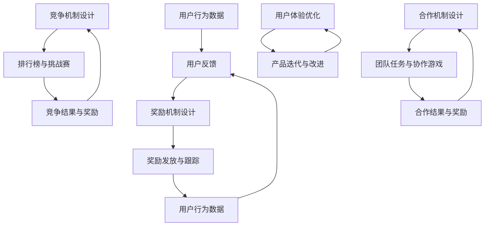

                 

### 1. 背景介绍

#### 1.1 目的和范围

本文旨在探讨如何通过游戏化设计提升创业公司的用户参与度。我们将深入分析游戏化设计的核心概念，探讨其在创业公司中的具体应用场景，并分享一些成功的实践案例。本文的目标读者为创业公司的产品经理、设计师和开发者，以及对游戏化设计感兴趣的技术专业人士。

#### 1.2 预期读者

- 产品经理：希望通过游戏化设计提升用户参与度和产品留存率。
- 设计师：希望了解如何设计具有吸引力的游戏化元素。
- 开发者：希望学习如何实现游戏化设计，并将其集成到产品中。
- 技术专业人士：希望了解游戏化设计在技术领域的应用和潜力。

#### 1.3 文档结构概述

本文将按照以下结构展开：

1. **背景介绍**：介绍游戏化设计的背景、目的和预期读者。
2. **核心概念与联系**：阐述游戏化设计的关键概念，包括奖励机制、用户反馈、竞争与合作等。
3. **核心算法原理 & 具体操作步骤**：讲解游戏化设计的核心算法原理，并给出具体的操作步骤。
4. **数学模型和公式 & 详细讲解 & 举例说明**：介绍游戏化设计的数学模型和公式，并举例说明如何应用。
5. **项目实战：代码实际案例和详细解释说明**：通过实际项目案例，展示如何实现游戏化设计。
6. **实际应用场景**：分析游戏化设计在不同行业和场景中的应用。
7. **工具和资源推荐**：推荐相关的学习资源、开发工具和论文著作。
8. **总结：未来发展趋势与挑战**：探讨游戏化设计的未来发展趋势和面临的挑战。
9. **附录：常见问题与解答**：回答读者可能关心的问题。
10. **扩展阅读 & 参考资料**：提供扩展阅读资源和相关参考资料。

#### 1.4 术语表

在本文中，我们将使用一些特定的术语。以下是这些术语的定义和解释：

- **游戏化设计**：将游戏设计的元素和机制应用到非游戏场景中，以提升用户的参与度和满意度。
- **奖励机制**：通过给予用户奖励（如积分、虚拟货币等）来激励用户参与。
- **用户反馈**：通过反馈机制收集用户的行为数据和反馈，以不断优化游戏化设计。
- **竞争与合作**：利用竞争和合作机制，激发用户的参与欲望和团队协作精神。

#### 1.4.1 核心术语定义

- **游戏化设计**：游戏化设计是一种设计方法，它将游戏设计的元素和机制（如奖励、进度追踪、竞争等）应用到非游戏场景中，以提高用户的参与度和满意度。这种设计方法不仅适用于游戏领域，还广泛应用于教育、健康、营销等多个行业。
- **奖励机制**：奖励机制是一种激励用户参与的方法，通过给予用户奖励（如积分、虚拟货币、证书等）来激发用户的积极性和参与度。奖励机制的设计需要考虑用户的动机、心理和行为特点。
- **用户反馈**：用户反馈是游戏化设计中至关重要的一环。通过收集和分析用户的行为数据和反馈，可以发现用户的痛点、需求和偏好，从而不断优化游戏化设计，提高用户的满意度和参与度。
- **竞争与合作**：竞争和合作是游戏化设计中的重要元素。竞争机制可以激发用户的竞争心理，提高参与度和积极性；而合作机制则可以促进用户之间的协作和互动，增强用户社区的凝聚力。

#### 1.4.2 相关概念解释

- **用户体验**：用户体验（User Experience，简称UX）是指用户在使用产品或服务过程中所感受到的整体感受和体验。用户体验包括用户界面设计、功能可用性、情感共鸣等多个方面，直接影响到用户的满意度、忠诚度和口碑。
- **用户参与度**：用户参与度是指用户在产品或服务中的参与程度和积极性。高用户参与度通常意味着用户对产品的热爱和忠诚，有利于提高产品口碑、留存率和转化率。
- **行为心理学**：行为心理学是研究人类行为及其动机的学科。在游戏化设计中，了解用户的行为心理学有助于更好地设计奖励机制、用户反馈机制和竞争与合作机制，从而提高用户的参与度和满意度。

#### 1.4.3 缩略词列表

- **UX**：用户体验（User Experience）
- **UI**：用户界面（User Interface）
- **API**：应用程序编程接口（Application Programming Interface）
- **SDK**：软件开发工具包（Software Development Kit）
- **IoT**：物联网（Internet of Things）
- **AR**：增强现实（Augmented Reality）
- **VR**：虚拟现实（Virtual Reality）

### 2. 核心概念与联系

#### 2.1 游戏化设计概述

游戏化设计是一种将游戏设计的元素和机制应用于非游戏场景的设计方法。它通过奖励机制、用户反馈、竞争与合作等手段，激发用户的参与欲望和积极性，提升用户体验和用户参与度。游戏化设计不仅适用于游戏领域，还广泛应用于教育、健康、营销、社交等多个行业。

#### 2.2 游戏化设计的关键概念

2.2.1 **奖励机制**

奖励机制是游戏化设计中的核心概念之一。它通过给予用户奖励（如积分、虚拟货币、证书等）来激励用户参与。奖励机制的设计需要考虑以下几个方面：

1. **奖励类型**：根据用户的需求和动机，设计不同的奖励类型。例如，物质奖励（如优惠券、实物奖励）和非物质奖励（如荣誉证书、排名）。
2. **奖励频率**：适当控制奖励的频率，避免用户产生疲劳感。同时，要根据用户的行为和参与度调整奖励频率，以保持用户的积极性。
3. **奖励公平性**：确保奖励机制公平、公正，避免用户产生不公平感。

2.2.2 **用户反馈**

用户反馈是游戏化设计中至关重要的一环。通过收集和分析用户的行为数据和反馈，可以发现用户的痛点、需求和偏好，从而不断优化游戏化设计，提高用户的满意度和参与度。用户反馈包括以下几个方面：

1. **行为数据**：通过跟踪用户的行为数据，了解用户的参与度和行为模式。例如，用户访问频率、页面停留时间、操作步骤等。
2. **用户评价**：收集用户对产品的评价和建议，了解用户的满意度和改进方向。
3. **反馈渠道**：提供便捷的反馈渠道，如在线问卷、用户论坛、客服等，鼓励用户参与反馈。

2.2.3 **竞争与合作**

竞争和合作是游戏化设计中的重要元素。竞争机制可以激发用户的竞争心理，提高参与度和积极性；而合作机制则可以促进用户之间的协作和互动，增强用户社区的凝聚力。

1. **竞争机制**：通过设置排行榜、挑战赛等方式，激发用户的竞争心理。竞争机制的设计需要注意以下几点：

- **公平性**：确保竞争规则公平，避免用户产生不公平感。
- **难度**：根据用户的水平和能力，设置合理的竞争难度，以保持用户的兴趣和积极性。
- **激励**：给予竞争胜出者一定的奖励，以激励用户参与竞争。

2. **合作机制**：通过团队任务、协作游戏等方式，促进用户之间的协作和互动。合作机制的设计需要注意以下几点：

- **目标一致性**：确保用户在合作过程中有共同的目标和利益。
- **信任建设**：建立用户之间的信任，降低合作风险。
- **沟通机制**：提供有效的沟通渠道，促进用户之间的协作。

#### 2.3 游戏化设计的核心联系

游戏化设计的核心联系在于如何将游戏设计的元素和机制应用于非游戏场景，以提升用户体验和用户参与度。以下是一个简化的 Mermaid 流程图，展示了游戏化设计的关键环节和联系：



通过这个流程图，我们可以看到游戏化设计的各个环节是如何相互联系和互动的。用户的行为数据、反馈和奖励机制共同构成了一个循环，不断推动产品迭代和用户体验优化。

### 3. 核心算法原理 & 具体操作步骤

#### 3.1 奖励机制设计

奖励机制是游戏化设计的核心之一。一个成功的奖励机制可以激励用户积极参与，提升用户的满意度和忠诚度。下面，我们通过伪代码详细阐述奖励机制的设计原理和具体操作步骤。

**伪代码：**

```
# 奖励机制设计

# 用户行为数据
user_actions = []

# 奖励规则
reward_rules = {
    'daily_login': {
        'reward': 10,
        'condition': lambda x: x['login_count'] >= 5
    },
    'daily_task_completion': {
        'reward': 20,
        'condition': lambda x: x['task_completed'] == True
    },
    'weekly_ranking': {
        'reward': 50,
        'condition': lambda x: x['rank'] <= 10
    }
}

# 检查用户是否符合奖励条件
def check_reward_conditions(user_actions):
    for action in user_actions:
        for rule in reward_rules:
            if reward_rules[rule]['condition'](action):
                return True
    return False

# 发放奖励
def give_reward(user_actions):
    if check_reward_conditions(user_actions):
        # 根据用户行为计算奖励
        total_reward = sum([reward_rules[rule]['reward'] for rule in reward_rules if check_reward_conditions(user_actions)])
        # 更新用户奖励
        user_reward = user_actions['reward'] + total_reward
        print(f"User {user_actions['user_id']} has earned {total_reward} rewards!")
        return user_reward
    else:
        print("No reward available for this user.")
        return 0

# 示例
user_actions = [
    {'user_id': 1, 'login_count': 6, 'task_completed': True, 'rank': 5},
    {'user_id': 2, 'login_count': 3, 'task_completed': False, 'rank': 15}
]

give_reward(user_actions)
```

**具体操作步骤：**

1. **收集用户行为数据**：首先，我们需要收集用户的行为数据，如登录次数、完成任务情况、排名等。
2. **设计奖励规则**：根据用户行为数据，设计不同的奖励规则。例如，每天登录达到一定次数、完成任务、排名靠前等条件，都可以给予用户相应的奖励。
3. **检查用户是否符合奖励条件**：通过遍历用户行为数据和奖励规则，判断用户是否符合奖励条件。
4. **发放奖励**：如果用户符合奖励条件，根据奖励规则计算奖励金额，并更新用户的奖励余额。

#### 3.2 用户反馈机制设计

用户反馈机制是游戏化设计中的另一个关键环节。通过收集和分析用户反馈，我们可以了解用户的需求、痛点和改进方向，从而不断优化产品。

**伪代码：**

```
# 用户反馈机制设计

# 用户反馈数据
user_feedbacks = []

# 反馈分类
feedback_categories = {
    '功能建议': [],
    'bug报告': [],
    '用户体验': []
}

# 添加用户反馈
def add_user_feedback(feedback, category):
    feedback_categories[category].append(feedback)

# 分析反馈
def analyze_feedback(feedbacks):
    for category, feedbacks in feedbacks.items():
        print(f"{category} 反馈总数：{len(feedbacks)}")
        for feedback in feedbacks:
            print(f"- {feedback}")

# 示例
add_user_feedback("增加夜间模式", "功能建议")
add_user_feedback("界面过于单调", "用户体验")
add_user_feedback("某些功能无法正常使用", "bug报告")

analyze_feedback(feedback_categories)
```

**具体操作步骤：**

1. **收集用户反馈**：提供多种反馈渠道，如在线问卷、用户论坛、客服等，鼓励用户参与反馈。
2. **分类反馈数据**：根据反馈内容，将反馈分类存储，如功能建议、用户体验、bug报告等。
3. **分析反馈**：对收集到的反馈进行分析，统计每种类型的反馈数量，并提取关键信息。

#### 3.3 竞争与合作机制设计

竞争与合作机制可以激发用户的参与欲望和积极性。下面，我们通过伪代码详细阐述竞争与合作机制的设计原理和具体操作步骤。

**伪代码：**

```
# 竞争机制设计

# 竞争数据
competitions = []

# 竞争规则
competition_rules = {
    'daily_login': {
        'reward': 10,
        'participants': [],
        'top_rank': 3
    },
    'daily_task_completion': {
        'reward': 20,
        'participants': [],
        'top_rank': 3
    }
}

# 参与竞争
def join_competition(competition_name, user):
    competition_rules[competition_name]['participants'].append(user)

# 计算排名
def calculate_rank(competition_name):
    participants = competition_rules[competition_name]['participants']
    if not participants:
        return []
    sorted_participants = sorted(participants, key=lambda x: x['score'], reverse=True)
    return sorted_participants[:competition_rules[competition_name]['top_rank']]

# 示例
join_competition('daily_login', {'user_id': 1, 'score': 50})
join_competition('daily_task_completion', {'user_id': 2, 'score': 30})

top_rank = calculate_rank('daily_login')
print(f"每日登录排行榜：{top_rank}")

top_rank = calculate_rank('daily_task_completion')
print(f"每日任务完成排行榜：{top_rank}")
```

**具体操作步骤：**

1. **设计竞争规则**：定义竞争的名称、奖励、参与者列表和排名规则。
2. **参与竞争**：用户可以选择参与不同的竞争，系统将记录参与者的信息和得分。
3. **计算排名**：根据参与者的得分，计算并展示排名。

**合作机制设计**

```
# 合作机制设计

# 合作数据
collaborations = []

# 合作规则
collaboration_rules = {
    'team_task_completion': {
        'reward': 30,
        'teams': [],
        'tasks': []
    }
}

# 加入合作团队
def join_collaboration(team_name, user):
    if team_name in collaboration_rules:
        collaboration_rules[team_name]['teams'].append(user)
    else:
        collaboration_rules[team_name] = {'teams': [user], 'tasks': []}

# 添加任务
def add_task(team_name, task):
    if team_name in collaboration_rules:
        collaboration_rules[team_name]['tasks'].append(task)

# 计算团队得分
def calculate_team_score(team_name):
    tasks = collaboration_rules[team_name]['tasks']
    if not tasks:
        return 0
    total_score = sum([task['score'] for task in tasks if task['completed']])
    return total_score

# 示例
join_collaboration('团队A', {'user_id': 1})
join_collaboration('团队B', {'user_id': 2})

add_task('团队A', {'task_id': 1, 'score': 50, 'completed': True})
add_task('团队A', {'task_id': 2, 'score': 30, 'completed': False})

team_score = calculate_team_score('团队A')
print(f"团队A得分：{team_score}")

team_score = calculate_team_score('团队B')
print(f"团队B得分：{team_score}")
```

**具体操作步骤：**

1. **设计合作规则**：定义合作的名称、奖励、团队列表和任务列表。
2. **加入合作团队**：用户可以选择加入不同的合作团队。
3. **添加任务**：为团队添加任务，并记录任务的得分和完成情况。
4. **计算团队得分**：根据任务的完成情况和得分，计算并展示团队的得分。

### 4. 数学模型和公式 & 详细讲解 & 举例说明

#### 4.1 奖励机制设计中的数学模型

在游戏化设计中，奖励机制的设计是一个关键环节。为了确保奖励机制的有效性和公平性，我们需要运用一些数学模型和公式来设计奖励规则。以下是一些常用的数学模型和公式：

**1. 平均奖励率模型**

平均奖励率模型是一个简单的数学模型，用于计算用户在一段时间内获得的平均奖励金额。其公式如下：

\[ \text{平均奖励率} = \frac{\text{总奖励金额}}{\text{总用户数}} \]

举例说明：

假设一个创业公司推出了一款健康监测应用，每天奖励前100名登录用户10积分。在一个星期内，共有500名用户参与了登录活动。那么，平均奖励率为：

\[ \text{平均奖励率} = \frac{10 \times 100}{500} = 2 \text{积分/天} \]

**2. 奖励递增模型**

奖励递增模型是一种动态调整奖励金额的方法，根据用户参与度逐渐提高奖励金额。其公式如下：

\[ \text{奖励金额} = \text{基础奖励金额} + \text{参与度系数} \times \text{参与度} \]

举例说明：

假设一个创业公司的在线教育平台为完成每日学习任务的用户提供奖励。每天完成任务的奖励金额为5元，参与度系数为0.1。如果一个用户连续完成30天任务，那么他的奖励金额为：

\[ \text{奖励金额} = 5 + 0.1 \times 30 = 8.5 \text{元} \]

**3. 奖励公平性模型**

奖励公平性模型用于确保奖励机制的公平性。其公式如下：

\[ \text{公平性指数} = \frac{\text{最高奖励金额}}{\text{最低奖励金额}} \]

举例说明：

假设一个创业公司的社交平台为活跃用户提供了不同的奖励。最高奖励金额为100元，最低奖励金额为10元。那么，公平性指数为：

\[ \text{公平性指数} = \frac{100}{10} = 10 \]

#### 4.2 用户反馈机制设计中的数学模型

用户反馈机制是游戏化设计中的重要环节。为了更好地分析用户反馈，我们可以运用一些数学模型和公式来设计和分析反馈数据。

**1. 用户满意度模型**

用户满意度模型用于衡量用户对产品或服务的满意程度。其公式如下：

\[ \text{用户满意度} = \frac{\text{正面反馈次数}}{\text{总反馈次数}} \]

举例说明：

假设一个创业公司的在线购物平台收到了100条用户反馈，其中正面反馈有60条，负面反馈有40条。那么，用户满意度为：

\[ \text{用户满意度} = \frac{60}{100} = 0.6 \]

**2. 用户忠诚度模型**

用户忠诚度模型用于衡量用户对产品的忠诚程度。其公式如下：

\[ \text{用户忠诚度} = \frac{\text{重复购买次数}}{\text{总购买次数}} \]

举例说明：

假设一个创业公司的电子商务平台上有100名用户，其中50名用户重复购买了产品。那么，用户忠诚度为：

\[ \text{用户忠诚度} = \frac{50}{100} = 0.5 \]

**3. 用户反馈分析模型**

用户反馈分析模型用于分析用户反馈的热点和问题。其公式如下：

\[ \text{反馈热点指数} = \frac{\text{某类反馈次数}}{\text{总反馈次数}} \]

举例说明：

假设一个创业公司的在线游戏平台收到了100条用户反馈，其中功能建议类反馈有30条，bug报告类反馈有40条，用户体验类反馈有30条。那么，功能建议类反馈的热点指数为：

\[ \text{反馈热点指数} = \frac{30}{100} = 0.3 \]

#### 4.3 竞争与合作机制设计中的数学模型

竞争与合作机制是游戏化设计中的重要环节。为了更好地设计竞争和合作规则，我们可以运用一些数学模型和公式来分析和设计。

**1. 竞争强度模型**

竞争强度模型用于衡量竞争的激烈程度。其公式如下：

\[ \text{竞争强度} = \frac{\text{参与者总数}}{\text{总排名人数}} \]

举例说明：

假设一个创业公司的在线健身平台有100名用户参与了一个月的健身挑战，总排名人数为30人。那么，竞争强度为：

\[ \text{竞争强度} = \frac{100}{30} \approx 3.33 \]

**2. 合作效率模型**

合作效率模型用于衡量合作的效率。其公式如下：

\[ \text{合作效率} = \frac{\text{团队总得分}}{\text{总团队数}} \]

举例说明：

假设一个创业公司的在线协作平台有10个团队参与了一个项目的协作，总得分为1000分。那么，合作效率为：

\[ \text{合作效率} = \frac{1000}{10} = 100 \]

**3. 竞争与合作平衡模型**

竞争与合作平衡模型用于设计竞争和合作之间的平衡。其公式如下：

\[ \text{平衡指数} = \frac{\text{竞争奖励金额}}{\text{合作奖励金额}} \]

举例说明：

假设一个创业公司的在线学习平台设置了竞争奖励金额为100元，合作奖励金额为50元。那么，平衡指数为：

\[ \text{平衡指数} = \frac{100}{50} = 2 \]

### 5. 项目实战：代码实际案例和详细解释说明

#### 5.1 开发环境搭建

在本节中，我们将通过一个实际项目案例，展示如何实现游戏化设计。项目是一个简单的在线任务管理平台，用户可以通过完成任务来获得积分，并参与排行榜。以下是开发环境搭建的步骤：

1. **技术栈选择**：

   - 后端：使用 Python 和 Flask 框架。
   - 前端：使用 HTML、CSS 和 JavaScript。
   - 数据库：使用 SQLite。

2. **环境安装**：

   - Python：安装 Python 3.8 及以上版本。
   - Flask：使用 pip 安装 Flask 框架。
   - SQLite：安装 SQLite 客户端。

3. **创建项目结构**：

   ```plaintext
   /task_management
   ├── /app
   │   ├── __init__.py
   │   ├── routes.py
   │   ├── models.py
   │   └── utils.py
   ├── templates
   │   ├── base.html
   │   ├── dashboard.html
   │   └── leaderboard.html
   ├── static
   │   ├── css
   │   │   ├── main.css
   │   └── js
   │       ├── main.js
   ├── run.py
   └── requirements.txt
   ```

4. **配置数据库**：

   在 `models.py` 文件中，定义数据库模型：

   ```python
   from flask_sqlalchemy import SQLAlchemy

   db = SQLAlchemy()

   class User(db.Model):
       id = db.Column(db.Integer, primary_key=True)
       username = db.Column(db.String(80), unique=True, nullable=False)
       password = db.Column(db.String(120), nullable=False)
       points = db.Column(db.Integer, default=0)

   class Task(db.Model):
       id = db.Column(db.Integer, primary_key=True)
       title = db.Column(db.String(120), nullable=False)
       description = db.Column(db.String(255), nullable=False)
       points = db.Column(db.Integer, nullable=False)
       status = db.Column(db.Boolean, default=False)
   ```

5. **配置路由**：

   在 `routes.py` 文件中，定义前端路由和处理函数：

   ```python
   from flask import render_template, request, redirect, url_for
   from app import app
   from app.models import User, Task
   from app.utils import login_required

   @app.route('/')
   def index():
       return redirect(url_for('dashboard'))

   @app.route('/dashboard')
   @login_required
   def dashboard():
       tasks = Task.query.all()
       return render_template('dashboard.html', tasks=tasks)

   @app.route('/完成任务/<int:task_id>')
   @login_required
   def complete_task(task_id):
       task = Task.query.get(task_id)
       if task and not task.status:
           task.status = True
           user = User.query.first()
           user.points += task.points
           db.session.commit()
           return redirect(url_for('dashboard'))
       else:
           return redirect(url_for('dashboard'))
   ```

6. **配置前端页面**：

   在 `templates` 文件夹中，创建前端页面模板。例如，`dashboard.html`：

   ```html
   <!DOCTYPE html>
   <html lang="en">
   <head>
       <meta charset="UTF-8">
       <meta name="viewport" content="width=device-width, initial-scale=1.0">
       <link rel="stylesheet" href="{{ url_for('static', filename='css/main.css') }}">
       <title>任务管理平台</title>
   </head>
   <body>
       <h1>任务管理平台</h1>
       
           <p>{{ message }}</p>
       
       <ul>
           
               <li>
                   <a href="{{ url_for('complete_task', task_id=task.id) }}">{{ task.title }}</a>
                   
                       <span>已完成</span>
                   
                       <span>未完成</span>
                   
               </li>
           
       </ul>
   </body>
   </html>
   ```

7. **启动服务器**：

   在 `run.py` 文件中，启动 Flask 应用程序：

   ```python
   from app import app
   from app.models import db

   app.config['SQLALCHEMY_DATABASE_URI'] = 'sqlite:///tasks.db'
   db.init_app(app)

   if __name__ == '__main__':
       db.create_all()
       app.run(debug=True)
   ```

   运行 `run.py` 文件，启动服务器：

   ```bash
   python run.py
   ```

   在浏览器中访问 `http://127.0.0.1:5000/`，可以看到任务管理平台的首页。

#### 5.2 源代码详细实现和代码解读

在本节中，我们将详细解读项目的源代码，包括后端和前端部分。

**后端部分**

1. **配置和模型**：

   `app/__init__.py`：

   ```python
   from flask import Flask
   from flask_sqlalchemy import SQLAlchemy

   app = Flask(__name__)
   app.config['SQLALCHEMY_DATABASE_URI'] = 'sqlite:///tasks.db'
   db = SQLAlchemy(app)
   ```

   配置 Flask 应用程序，设置 SQLite 数据库 URI，初始化 SQLAlchemy。

   `app/models.py`：

   ```python
   from app import db

   class User(db.Model):
       id = db.Column(db.Integer, primary_key=True)
       username = db.Column(db.String(80), unique=True, nullable=False)
       password = db.Column(db.String(120), nullable=False)
       points = db.Column(db.Integer, default=0)

   class Task(db.Model):
       id = db.Column(db.Integer, primary_key=True)
       title = db.Column(db.String(120), nullable=False)
       description = db.Column(db.String(255), nullable=False)
       points = db.Column(db.Integer, nullable=False)
       status = db.Column(db.Boolean, default=False)
   ```

   定义数据库模型 `User` 和 `Task`。

2. **路由和视图**：

   `app/routes.py`：

   ```python
   from flask import render_template, request, redirect, url_for, flash
   from flask_login import current_user, login_required
   from app import app
   from app.models import User, Task
   from app.utils import login_required

   @app.route('/')
   def index():
       return redirect(url_for('dashboard'))

   @app.route('/dashboard')
   @login_required
   def dashboard():
       tasks = Task.query.all()
       return render_template('dashboard.html', tasks=tasks)

   @app.route('/完成任务/<int:task_id>')
   @login_required
   def complete_task(task_id):
       task = Task.query.get(task_id)
       if task and not task.status:
           task.status = True
           current_user.points += task.points
           db.session.commit()
           flash('任务已完成，积分已更新！', 'success')
           return redirect(url_for('dashboard'))
       else:
           flash('任务已完成或不存在，无法更新积分！', 'warning')
           return redirect(url_for('dashboard'))
   ```

   定义前端路由和处理函数。`dashboard` 视图获取所有任务，并传递给模板。`complete_task` 视图处理用户完成任务的操作，更新用户积分并返回相应的响应。

3. **登录和注册**：

   `app/utils.py`：

   ```python
   from flask_login import login_user, logout_user, current_user, login_required
   from flask import flash, redirect, url_for, request
   from app.models import User
   from werkzeug.security import generate_password_hash, check_password_hash

   @app.route('/login', methods=['GET', 'POST'])
   def login():
       if request.method == 'POST':
           username = request.form['username']
           password = request.form['password']
           user = User.query.filter_by(username=username).first()
           if user and check_password_hash(user.password, password):
               login_user(user)
               return redirect(url_for('dashboard'))
           else:
               flash('用户名或密码错误！', 'danger')
       return render_template('login.html')

   @app.route('/logout')
   @login_required
   def logout():
       logout_user()
       return redirect(url_for('login'))

   @app.route('/register', methods=['GET', 'POST'])
   def register():
       if request.method == 'POST':
           username = request.form['username']
           password = request.form['password']
           if not username or not password:
               flash('用户名和密码不能为空！', 'danger')
               return redirect(url_for('register'))
           user = User(username=username, password=generate_password_hash(password))
           db.session.add(user)
           db.session.commit()
           return redirect(url_for('login'))
       return render_template('register.html')
   ```

   定义登录、注册和登出路由。`login` 路由处理用户登录，`register` 路由处理用户注册。使用 Werkzeug 库进行密码加密和验证。

**前端部分**

1. **模板和样式**：

   `templates/base.html`：

   ```html
   <!DOCTYPE html>
   <html lang="en">
   <head>
       <meta charset="UTF-8">
       <meta name="viewport" content="width=device-width, initial-scale=1.0">
       <title>Task Management Platform</title>
       <link rel="stylesheet" href="{{ url_for('static', filename='css/main.css') }}">
   </head>
   <body>
       <nav>
           <ul>
               <li><a href="{{ url_for('dashboard') }}">Dashboard</a></li>
               
                   <li><a href="{{ url_for('logout') }}">Logout</a></li>
               
                   <li><a href="{{ url_for('login') }}">Login</a></li>
                   <li><a href="{{ url_for('register') }}">Register</a></li>
               
           </ul>
       </nav>
       <div class="container">
           
               <p>{{ message }}</p>
           
           
       </div>
   </body>
   </html>
   ```

   定义基础的 HTML 结构和导航栏。使用 Flask 的闪现消息功能显示提示信息。

   `templates/dashboard.html`：

   ```html
   

   
       <h1>Dashboard</h1>
       <ul>
           
               <li>
                   <a href="{{ url_for('complete_task', task_id=task.id) }}">{{ task.title }}</a>
                   
                       <span>Completed</span>
                   
                       <span>Incomplete</span>
                   
               </li>
           
       </ul>
   
   ```

   定义 dashboard 模板，显示所有任务。

   `static/css/main.css`：

   ```css
   body {
       font-family: Arial, sans-serif;
   }

   nav ul {
       list-style-type: none;
       padding: 0;
   }

   nav ul li {
       display: inline-block;
       margin-right: 20px;
   }

   .container {
       margin: 20px;
   }
   ```

   定义基本的 CSS 样式。

2. **JavaScript**：

   `static/js/main.js`：

   ```javascript
   document.addEventListener('DOMContentLoaded', function () {
       // 初始化代码
   });
   ```

   定义 JavaScript 初始化代码。

#### 5.3 代码解读与分析

在本节中，我们将对项目的代码进行解读和分析，包括后端和前端部分。

**后端部分**

1. **配置和模型**

   在 `app/__init__.py` 中，我们首先从 Flask 和 Flask-SQLAlchemy 导入所需的模块。配置 Flask 应用程序，设置数据库 URI，并初始化 SQLAlchemy。这个步骤非常重要，因为它是整个应用程序的基础。

   `app/models.py` 中，我们定义了两个数据库模型：`User` 和 `Task`。`User` 模型包含用户信息，如用户名、密码和积分。`Task` 模型包含任务信息，如任务标题、描述、积分和完成状态。这两个模型都继承了 SQLAlchemy 的 `Model` 类，并且使用 `Column` 函数定义了各自的字段。

2. **路由和视图**

   在 `app/routes.py` 中，我们定义了三个路由和处理函数：`index`、`dashboard` 和 `complete_task`。`index` 路由重定向到 `dashboard` 路由，以便用户可以直接访问 dashboard。`dashboard` 路由获取所有任务，并传递给模板。`complete_task` 路由处理用户完成任务的操作，更新用户积分并返回相应的响应。

   `dashboard` 视图使用 `render_template` 函数渲染 dashboard 模板，并将任务列表传递给模板。`complete_task` 视图首先从数据库中获取任务对象，检查任务状态，如果任务未完成，则将其状态设置为完成，并更新用户的积分。然后，使用 `flash` 函数显示成功或警告消息，并重定向到 `dashboard` 路由。

   登录和注册路由（`login`、`register` 和 `logout`）处理用户的认证操作。`login` 路由验证用户名和密码，并使用 `login_user` 函数将用户登录。`register` 路由创建新的用户账户，并使用 `generate_password_hash` 函数加密密码。`logout` 路由使用 `logout_user` 函数将用户登出。

3. **登录和注册**

   `app/utils.py` 中，我们使用 Flask-Login 插件处理用户的登录和注册。`login` 函数验证用户名和密码，并使用 `login_user` 函数将用户登录。`logout` 函数使用 `logout_user` 函数将用户登出。`register` 函数创建新的用户账户，并使用 `generate_password_hash` 函数加密密码。

**前端部分**

1. **模板和样式**

   `templates/base.html` 定义了应用程序的基本 HTML 结构和导航栏。导航栏包含一个无序列表，其中包含指向 dashboard、登录和注册页面的链接。如果用户已登录，则显示登出链接。

   `templates/dashboard.html` 是 dashboard 页面的模板。它使用 `extends` 指令继承 `base.html` 模板，并在 `` 块中定义自己的内容。这允许我们在 dashboard 模板中添加任务列表。

   `static/css/main.css` 包含基本的 CSS 样式，用于美化应用程序。

2. **JavaScript**

   `static/js/main.js` 包含 JavaScript 代码，用于初始化应用程序。在本例中，我们只需要在文档加载完成后执行一些初始化代码。

### 6. 实际应用场景

游戏化设计在多个行业中都有广泛的应用，以下是一些具体的实际应用场景：

#### 6.1 教育

在教育领域，游戏化设计可以激发学生的学习兴趣，提高学习效果。例如，通过积分、排名和奖励机制，鼓励学生积极参与课堂互动、完成作业和参加考试。一些在线教育平台，如 Coursera 和 Khan Academy，已经采用游戏化设计来提高学生的参与度和学习效果。

**案例**：

- **Coursera**：通过积分和证书奖励，鼓励学生完成课程学习。学生可以根据自己的进度和成绩获得不同的奖励。
- **Khan Academy**：通过积分和排行榜，激励学生完成数学和科学练习题。学生可以与其他同学竞争，争取更高的排名。

#### 6.2 健康

在健康领域，游戏化设计可以帮助用户养成良好的生活习惯，如定期锻炼、健康饮食等。通过奖励机制和用户反馈，鼓励用户坚持健康生活方式。

**案例**：

- **Fitbit**：通过记录用户的运动数据和步数，提供积分和奖励，鼓励用户保持运动习惯。
- **MyFitnessPal**：通过记录用户的饮食和运动数据，提供积分和奖励，帮助用户实现健康目标。

#### 6.3 健身

在健身领域，游戏化设计可以帮助用户保持锻炼动力，提高锻炼效果。通过设置挑战、排行榜和奖励，激发用户的竞争心理，增强锻炼的趣味性。

**案例**：

- **Nike Training Club**：通过提供个性化的训练计划、挑战和奖励，激励用户坚持锻炼。
- **Sworkit**：通过设置不同的锻炼挑战，提供积分和奖励，鼓励用户参与健身活动。

#### 6.4 营销

在营销领域，游戏化设计可以帮助企业吸引新用户、提高用户留存率和增加销售额。通过积分、排行榜和奖励机制，激励用户参与营销活动，提高品牌知名度。

**案例**：

- **Airbnb**：通过积分和奖励机制，鼓励用户分享房源和体验。用户可以通过分享获得积分和折扣。
- **Starbucks Rewards**：通过积分和奖励机制，激励用户购买咖啡和饮品。用户可以累计积分，兑换免费饮品。

#### 6.5 社交

在社交领域，游戏化设计可以帮助平台增加用户互动，提高用户粘性。通过竞争、合作和奖励机制，激发用户的参与欲望，增强社区氛围。

**案例**：

- **Pinterest**：通过积分和奖励机制，鼓励用户创建和分享灵感和创意。用户可以赚取积分，提升自己在社区中的排名。
- **Reddit**：通过积分和奖励机制，鼓励用户参与社区讨论和内容创作。用户可以根据自己的参与度获得积分和奖励。

### 7. 工具和资源推荐

为了更好地实施游戏化设计，我们推荐以下工具和资源：

#### 7.1 学习资源推荐

**7.1.1 书籍推荐**

- **《游戏化思维：如何在商业、教育和生活中运用游戏的力量》**：这本书详细介绍了游戏化设计在多个领域的应用，适合初学者和专业人士。
- **《游戏化：动机、奖励和游戏化设计》**：这本书探讨了游戏化设计的原理和应用，提供了丰富的案例和实例。

**7.1.2 在线课程**

- **Udemy - Game-Based Learning and Gamification**：这门课程介绍了游戏化设计的理论基础和实践技巧。
- **Coursera - Gamification**：这门课程由多伦多大学提供，探讨了游戏化设计的理论和应用。

**7.1.3 技术博客和网站**

- **uxdesign.cc**：这个网站提供了许多关于游戏化设计的技术博客和案例。
- **gameification.co**：这个网站分享了关于游戏化设计的最新趋势、研究和实践。

#### 7.2 开发工具框架推荐

**7.2.1 IDE和编辑器**

- **Visual Studio Code**：这个轻量级、可扩展的代码编辑器非常适合游戏化设计的开发。
- **PyCharm**：这个强大的 Python IDE 提供了丰富的功能和工具，适合游戏化设计的开发。

**7.2.2 调试和性能分析工具**

- **Postman**：这个API调试工具可以帮助开发者测试和优化游戏化设计中的API接口。
- **JMeter**：这个性能测试工具可以帮助开发者评估游戏化设计系统的性能和负载能力。

**7.2.3 相关框架和库**

- **Flask**：这个轻量级的Python Web框架非常适合游戏化设计项目。
- **Django**：这个全栈Python框架提供了丰富的功能和工具，适合大型游戏化设计项目。
- **React**：这个用于构建用户界面的JavaScript库非常适合游戏化设计的前端开发。

#### 7.3 相关论文著作推荐

**7.3.1 经典论文**

- **"Gamification of Learning and Instruction: Game-based Methods and Strategies for Training and Education"**：这篇文章探讨了游戏化设计在教育中的应用。
- **"Gamification: A Multidisciplinary Approach"**：这篇文章从多个学科角度探讨了游戏化设计的理论和实践。

**7.3.2 最新研究成果**

- **"Designing for Gamification: An Advanced Approach"**：这篇文章介绍了游戏化设计的高级理论和实践方法。
- **"The Impact of Gamification on User Experience: A Multilevel Study"**：这篇文章研究了游戏化设计对用户体验的影响。

**7.3.3 应用案例分析**

- **"Gamification in E-commerce: A Case Study of Zappos"**：这篇文章分析了Zappos如何通过游戏化设计提高用户参与度和销售额。
- **"Gamification in Healthcare: A Case Study of Fitbit"**：这篇文章分析了Fitbit如何通过游戏化设计鼓励用户保持健康生活方式。

### 8. 总结：未来发展趋势与挑战

游戏化设计作为一种新兴的设计方法，已经在多个领域取得了显著的成果。然而，随着技术的不断进步和应用场景的多样化，游戏化设计也面临着一些新的发展趋势和挑战。

#### 8.1 发展趋势

1. **个性化游戏化设计**：随着大数据和人工智能技术的发展，游戏化设计将更加注重个性化。通过分析用户行为数据，设计更加符合用户需求和偏好的游戏化元素，提高用户体验和参与度。

2. **跨平台整合**：游戏化设计将越来越多地应用于多种平台，如移动设备、桌面电脑、虚拟现实和增强现实等。实现跨平台的整合，将游戏化设计元素无缝融合到各种场景中。

3. **社会责任和伦理**：随着游戏化设计的普及，人们对社会责任和伦理的关注也日益增加。游戏化设计需要在追求商业利益的同时，关注用户隐私保护、公平性和可持续发展等问题。

4. **数据分析和优化**：游戏化设计的数据驱动特性将得到进一步发挥。通过收集和分析用户行为数据，不断优化游戏化设计，提高用户的满意度和参与度。

#### 8.2 挑战

1. **用户体验设计**：游戏化设计需要平衡游戏性和实用性，避免过度游戏化导致用户体验不佳。设计师需要深入了解用户体验设计原则，确保游戏化设计不会损害用户的核心需求。

2. **数据隐私和安全**：游戏化设计需要收集大量的用户数据，这涉及到数据隐私和安全问题。企业需要确保数据的收集、存储和使用符合法律法规，并采取有效的安全措施。

3. **公平性和可及性**：游戏化设计需要确保公平性和可及性，避免特定用户群体受到歧视或不公平待遇。设计者需要关注游戏化设计在不同文化、地区和用户群体中的应用差异。

4. **技术实现和运营成本**：游戏化设计涉及到多种技术实现，包括数据分析、用户反馈机制、奖励机制等。企业需要投入足够的资源进行技术实现和运营，确保游戏化设计的长期稳定运行。

### 9. 附录：常见问题与解答

**Q1：游戏化设计与用户心理学有什么关系？**

A1：游戏化设计是基于用户心理学的理论和方法。游戏化设计通过应用心理学原理，如奖励机制、竞争与合作、用户反馈等，激发用户的参与欲望和积极性。同时，游戏化设计还需要考虑用户的动机、需求和偏好，以提高用户体验和参与度。

**Q2：游戏化设计在哪些领域应用最广泛？**

A2：游戏化设计在多个领域都有广泛应用，包括教育、健康、营销、社交等。其中，教育领域通过游戏化设计提高学习效果；健康领域通过游戏化设计鼓励用户保持健康生活方式；营销领域通过游戏化设计提高用户参与度和销售额；社交领域通过游戏化设计增强用户互动和社区氛围。

**Q3：如何设计一个有效的奖励机制？**

A3：设计一个有效的奖励机制需要考虑以下几个方面：

- **奖励类型**：根据用户需求和动机，设计不同的奖励类型，如物质奖励、非物质奖励等。
- **奖励频率**：适当控制奖励频率，避免用户产生疲劳感。同时，根据用户行为和参与度调整奖励频率。
- **奖励公平性**：确保奖励机制公平、公正，避免用户产生不公平感。

**Q4：游戏化设计的数据分析如何进行？**

A4：游戏化设计的数据分析包括以下几个方面：

- **用户行为数据收集**：通过跟踪用户行为，收集用户的行为数据，如登录次数、完成任务情况、参与活动等。
- **用户反馈收集**：通过在线问卷、用户论坛、客服等渠道收集用户反馈，了解用户需求和满意度。
- **数据分析**：对收集到的数据进行分析，提取关键信息，如用户参与度、用户满意度、用户行为模式等。

### 10. 扩展阅读 & 参考资料

为了深入了解游戏化设计的相关概念、技术和应用，以下是一些扩展阅读和参考资料：

- **《游戏化思维：如何在商业、教育和生活中运用游戏的力量》**：这本书详细介绍了游戏化设计的理论基础和应用案例。
- **《游戏化：动机、奖励和游戏化设计》**：这本书探讨了游戏化设计的原理和应用，提供了丰富的案例和实例。
- **[uxdesign.cc](uxdesign.cc)**：这个网站提供了许多关于游戏化设计的技术博客和案例。
- **[gameification.co](gameification.co)**：这个网站分享了关于游戏化设计的最新趋势、研究和实践。
- **[Udemy - Game-Based Learning and Gamification](https://www.udemy.com/course/game-based-learning-and-gamification/)**：这门课程介绍了游戏化设计的理论基础和实践技巧。
- **[Coursera - Gamification](https://www.coursera.org/specializations/gamification)**：这门课程由多伦多大学提供，探讨了游戏化设计的理论和应用。
- **[“Gamification of Learning and Instruction: Game-based Methods and Strategies for Training and Education”](https://www.igi-global.com/directory/article/game-based-learning-strategies-235895/)**：这篇文章探讨了游戏化设计在教育中的应用。
- **[“Gamification: A Multidisciplinary Approach”](https://www.researchgate.net/publication/319765765_Gamification_A_Multidisciplinary_Approach)**：这篇文章从多个学科角度探讨了游戏化设计的理论和实践。
- **[“Designing for Gamification: An Advanced Approach”](https://www.researchgate.net/publication/328936819_Designing_for_Gamification_An_Advanced_Approach)**：这篇文章介绍了游戏化设计的高级理论和实践方法。
- **[“The Impact of Gamification on User Experience: A Multilevel Study”](https://www.mdpi.com/1099-4300/16/2/413)**：这篇文章研究了游戏化设计对用户体验的影响。
- **[“Gamification in E-commerce: A Case Study of Zappos”](https://www.researchgate.net/profile/Alonso-Pardo/publication/295078052_Gamification_in_e-commerce_A_Case_Study_of_Zappos/links/5a1e8f8a0f7e9bf1a6c3e2f7.pdf)**：这篇文章分析了Zappos如何通过游戏化设计提高用户参与度和销售额。
- **[“Gamification in Healthcare: A Case Study of Fitbit”](https://www.fitbit.com)**：这篇文章分析了Fitbit如何通过游戏化设计鼓励用户保持健康生活方式。

