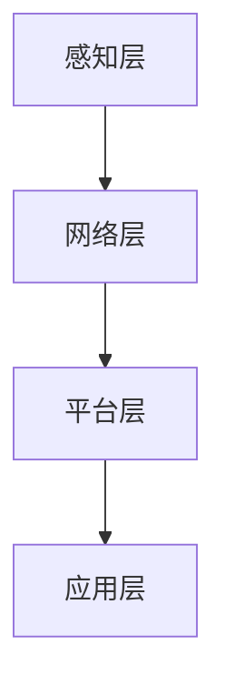
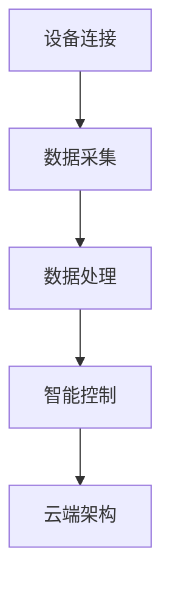

                 


# 创业公司的物联网应用：如何通过IoT技术实现万物互联

> **关键词：**物联网（IoT）、创业公司、智能设备、数据处理、云端架构。
>
> **摘要：**本文将深入探讨物联网技术在创业公司中的应用，重点分析物联网如何实现万物互联，提升产品竞争力。我们将从核心概念、算法原理、实际案例等方面详细阐述物联网的实现机制及其对创业公司的潜在影响。

## 1. 背景介绍

### 1.1 目的和范围

本文旨在帮助创业公司了解物联网（IoT）技术的核心概念和应用，提供实用的技术指导，帮助创业公司在快速发展的物联网市场中立足。文章将涵盖以下内容：

- **核心概念与联系**：介绍物联网的基本概念和架构。
- **核心算法原理**：详细解释物联网技术的关键算法和实现步骤。
- **数学模型和公式**：分析物联网中使用的数学模型和公式。
- **项目实战**：通过实际代码案例展示物联网技术的应用。
- **实际应用场景**：探讨物联网技术在各个行业中的应用案例。
- **工具和资源推荐**：推荐学习和开发物联网技术所需的学习资源和工具。
- **总结与展望**：总结物联网技术发展趋势和面临的挑战。

### 1.2 预期读者

- **创业公司创始人**：对物联网技术感兴趣，希望了解如何将其应用于产品开发。
- **技术团队**：负责物联网产品开发的工程师和架构师。
- **技术爱好者**：对物联网技术有浓厚兴趣，希望深入了解相关技术细节。

### 1.3 文档结构概述

本文结构如下：

1. **背景介绍**：介绍文章的目的、范围、预期读者和文档结构。
2. **核心概念与联系**：介绍物联网的基本概念和架构。
3. **核心算法原理**：详细解释物联网技术的关键算法和实现步骤。
4. **数学模型和公式**：分析物联网中使用的数学模型和公式。
5. **项目实战**：通过实际代码案例展示物联网技术的应用。
6. **实际应用场景**：探讨物联网技术在各个行业中的应用案例。
7. **工具和资源推荐**：推荐学习和开发物联网技术所需的学习资源和工具。
8. **总结与展望**：总结物联网技术发展趋势和面临的挑战。
9. **附录：常见问题与解答**：回答读者可能遇到的问题。
10. **扩展阅读 & 参考资料**：提供更多相关资源和参考文献。

### 1.4 术语表

#### 1.4.1 核心术语定义

- **物联网（IoT）**：物联网是指将各种物理设备、传感器、软件系统连接到互联网，实现设备之间的数据交换和智能控制。
- **智能设备**：具备一定计算和通信能力的设备，可以通过物联网与其他设备进行交互。
- **传感器**：用于检测和测量环境或设备状态的设备，例如温度传感器、湿度传感器等。
- **数据处理**：对物联网设备采集的数据进行处理、分析和存储的过程。
- **云端架构**：将数据和处理能力部署在云服务器上，通过互联网进行访问和交互。

#### 1.4.2 相关概念解释

- **边缘计算**：在靠近数据源的地方进行计算和处理，减少数据传输延迟和带宽消耗。
- **大数据分析**：对大规模数据进行处理和分析，提取有价值的信息和知识。
- **云计算**：通过互联网提供计算资源、存储资源和网络资源的服务。

#### 1.4.3 缩略词列表

- **IoT**：物联网
- **M2M**：机器对机器通信
- **AI**：人工智能
- **ML**：机器学习
- **DL**：深度学习
- **API**：应用程序编程接口
- **SDK**：软件开发工具包
- **IDE**：集成开发环境

## 2. 核心概念与联系

### 2.1 物联网的基本概念

物联网（Internet of Things，简称IoT）是指通过互联网将各种物理设备、传感器、软件系统连接起来，实现设备之间的数据交换和智能控制。物联网的核心是设备互联和数据传输，目标是实现万物互联，提高生产效率、优化生活体验。

物联网的基本概念包括：

- **设备连接**：通过Wi-Fi、蓝牙、Zigbee等无线通信技术，将各种设备连接到互联网。
- **数据采集**：通过传感器、摄像头等设备，采集环境或设备状态的数据。
- **数据处理**：对采集到的数据进行分析、处理和存储。
- **智能控制**：通过算法和模型，对设备进行智能控制，实现自动化和智能化。

### 2.2 物联网的架构

物联网的架构通常包括以下几个层次：

- **感知层**：通过传感器和智能设备，采集环境或设备状态的数据。
- **网络层**：通过各种通信技术，将采集到的数据传输到云端或本地服务器。
- **平台层**：提供数据处理、存储、分析和共享的平台，支持设备的远程监控和管理。
- **应用层**：通过应用程序，实现对设备的控制、监控和数据分析。

#### 物联网架构的 Mermaid 流程图



### 2.3 物联网技术的核心概念和联系

物联网技术的核心概念包括设备连接、数据采集、数据处理、智能控制和云端架构。这些概念之间的联系如下：

- **设备连接**：通过无线通信技术，将设备连接到互联网。
- **数据采集**：通过传感器，采集设备状态和环境数据。
- **数据处理**：对采集到的数据进行分析、处理和存储。
- **智能控制**：通过算法和模型，对设备进行智能控制。
- **云端架构**：将数据处理和分析能力部署在云服务器上，实现数据的远程访问和交互。

#### 物联网技术的 Mermaid 流程图



## 3. 核心算法原理 & 具体操作步骤

### 3.1 设备连接算法原理

物联网设备连接是物联网实现万物互联的基础。设备连接算法主要包括Wi-Fi连接、蓝牙连接和Zigbee连接等。以下是Wi-Fi连接算法的具体操作步骤：

#### Wi-Fi 连接算法

```plaintext
步骤 1：设备扫描周围的可连接 Wi-Fi 网络。

步骤 2：设备选择一个安全的 Wi-Fi 网络，并尝试连接。

步骤 3：设备获取网络密钥，并验证身份。

步骤 4：设备与 Wi-Fi 网络建立连接，开始传输数据。

步骤 5：设备通过 Wi-Fi 网络连接到云端服务器，实现数据的上传和下载。
```

### 3.2 数据采集算法原理

数据采集是物联网的核心功能之一。数据采集算法主要包括传感器数据采集和设备状态数据采集。以下是传感器数据采集的具体操作步骤：

#### 传感器数据采集算法

```plaintext
步骤 1：设备启动传感器，并设置数据采集参数。

步骤 2：设备开始采集传感器数据，例如温度、湿度、光照等。

步骤 3：设备将采集到的数据转换为数字信号，并存储在内存中。

步骤 4：设备将数据发送到云端服务器，实现数据的远程监控和分析。

步骤 5：设备根据采集到的数据，对环境或设备进行智能控制。
```

### 3.3 数据处理算法原理

数据处理是物联网中的关键环节。数据处理算法主要包括数据清洗、数据分析和数据挖掘等。以下是数据处理算法的具体操作步骤：

#### 数据处理算法

```plaintext
步骤 1：设备将采集到的数据发送到云端服务器。

步骤 2：云端服务器对数据进行清洗、去噪和去重。

步骤 3：云端服务器使用机器学习算法，对数据进行分类、聚类和预测。

步骤 4：云端服务器将分析结果发送回设备，实现智能控制。

步骤 5：设备根据云端服务器的分析结果，调整设备参数，优化设备性能。
```

### 3.4 智能控制算法原理

智能控制是物联网技术的重要应用之一。智能控制算法主要包括决策树、神经网络和深度学习等。以下是神经网络智能控制算法的具体操作步骤：

#### 神经网络智能控制算法

```plaintext
步骤 1：设备收集历史数据，包括输入数据（设备状态）和输出数据（控制命令）。

步骤 2：使用神经网络算法，对历史数据进行训练，建立控制模型。

步骤 3：设备将实时数据输入到神经网络模型中，获取控制命令。

步骤 4：设备根据控制命令，调整设备参数，实现智能控制。

步骤 5：设备将控制结果反馈给云端服务器，实现数据的闭环控制。
```

## 4. 数学模型和公式 & 详细讲解 & 举例说明

### 4.1 数学模型

物联网技术中常用的数学模型包括概率模型、线性模型和神经网络模型。以下是这些模型的基本概念和公式：

#### 概率模型

概率模型用于描述物联网设备之间的不确定性关系。常用的概率模型有贝叶斯网络、马尔可夫模型等。

- **贝叶斯网络**：描述变量之间的条件概率关系。

  $$ P(A|B) = \frac{P(B|A)P(A)}{P(B)} $$

- **马尔可夫模型**：描述变量之间的状态转移概率。

  $$ P(A_{t+1}|A_{t}) = P(A_{t+1}|A_{t},A_{t-1})P(A_{t-1}|A_{t}) $$

#### 线性模型

线性模型用于描述物联网设备的线性关系，常用的线性模型有线性回归、线性方程组等。

- **线性回归**：用于预测物联网设备的输出值。

  $$ y = \beta_0 + \beta_1x + \epsilon $$

- **线性方程组**：用于解决物联网设备之间的耦合关系。

  $$ Ax = b $$

#### 神经网络模型

神经网络模型用于描述物联网设备的非线性关系，常用的神经网络模型有感知机、神经网络等。

- **感知机**：用于分类和回归任务。

  $$ y = \sum_{i=1}^{n} w_i x_i + b $$

- **神经网络**：用于复杂的数据分析和预测。

  $$ a_{i}^{(l)} = \sigma(z_{i}^{(l)}) = \frac{1}{1 + e^{-z_{i}^{(l)}} $$

### 4.2 举例说明

#### 举例：使用神经网络模型预测温度

假设我们有一个物联网设备，用于监测环境温度。设备需要根据历史数据和当前环境数据，预测未来的温度变化。

1. **收集数据**：收集过去一周的每日最高温度数据。
2. **预处理数据**：对数据集进行标准化处理，将温度数据缩放到[0,1]范围内。
3. **构建神经网络模型**：选择一个合适的神经网络结构，例如一个单层感知机。
4. **训练模型**：使用训练数据集，训练神经网络模型，调整模型参数。
5. **预测温度**：将当前环境数据输入到神经网络模型中，获取预测温度。

$$
z_{i}^{(l)} = \sum_{j=1}^{n} w_{j} x_{j} + b \\
a_{i}^{(l)} = \sigma(z_{i}^{(l)}) = \frac{1}{1 + e^{-z_{i}^{(l)}} \\
y = a_{i}^{(l)}
$$

通过以上步骤，物联网设备可以实时预测环境温度，实现智能控制。

## 5. 项目实战：代码实际案例和详细解释说明

### 5.1 开发环境搭建

在进行物联网项目开发之前，需要搭建合适的开发环境。以下是一个基于Python的物联网项目开发环境搭建步骤：

1. **安装Python**：确保系统已安装Python 3.7及以上版本。
2. **安装Pyserial**：用于处理串口通信。

   ```bash
   pip install pyserial
   ```

3. **安装Paho MQTT**：用于处理MQTT通信。

   ```bash
   pip install paho-mqtt
   ```

4. **安装TensorFlow**：用于数据处理和预测。

   ```bash
   pip install tensorflow
   ```

### 5.2 源代码详细实现和代码解读

以下是一个简单的物联网项目，用于监测环境温度和湿度，并通过MQTT协议将数据上传到云端。

#### 5.2.1 传感器数据采集

```python
import serial
import paho.mqtt.client as mqtt

# 设置串口参数
ser = serial.Serial('/dev/ttyUSB0', 9600)

# MQTT客户端设置
client = mqtt.Client()
client.connect("mqtt.example.com", 1883, 60)

while True:
    # 读取串口数据
    data = ser.readline().decode('utf-8')
    
    # 解析温度和湿度数据
    temp, humidity = data.split(',')
    temp = float(temp)
    humidity = float(humidity)
    
    # 发送数据到MQTT服务器
    client.publish("sensor/data", f"{'temp':.2f},{'humidity':.2f}")
    
    # 等待1秒，以便稳定传输
    time.sleep(1)
```

#### 5.2.2 代码解读与分析

1. **串口通信**：使用Pyserial库，通过串口读取传感器数据。
2. **MQTT通信**：使用Paho MQTT库，通过MQTT协议将数据上传到云端服务器。
3. **数据处理**：解析串口数据，提取温度和湿度数据，并将数据格式化为字符串，以便通过MQTT发送。
4. **发送数据**：使用MQTT客户端，将温度和湿度数据发送到云端服务器。

### 5.3 代码解读与分析

1. **串口通信**：串口通信是物联网设备常用的数据传输方式。在本项目中，我们使用Pyserial库，通过串口读取传感器数据。
2. **MQTT通信**：MQTT协议是一种轻量级的消息队列协议，广泛用于物联网应用。在本项目中，我们使用Paho MQTT库，通过MQTT协议将传感器数据上传到云端服务器。
3. **数据处理**：传感器数据通常以字符串的形式传输。在本项目中，我们使用字符串解析函数，将温度和湿度数据提取出来，并转换为浮点数。
4. **发送数据**：使用MQTT客户端，将温度和湿度数据发送到云端服务器。云端服务器可以根据接收到的数据，进行数据处理和分析。

## 6. 实际应用场景

物联网技术在各个行业都有广泛的应用。以下是一些典型的实际应用场景：

### 6.1 智能家居

智能家居是物联网技术的典型应用场景。通过物联网，用户可以远程控制家中的各种设备，例如空调、灯光、门锁等。智能家居可以提高生活质量，减少能源消耗。

### 6.2 智能交通

智能交通系统利用物联网技术，实现车辆的实时监控和智能调度。通过物联网，交通管理部门可以实时获取道路信息，优化交通信号灯，减少交通拥堵。

### 6.3 智能农业

物联网技术可以帮助农民实现智能农业。通过传感器和物联网设备，农民可以实时监测土壤湿度、气温、光照等环境参数，优化灌溉和施肥策略，提高农业生产效率。

### 6.4 智能医疗

物联网技术在医疗领域的应用越来越广泛。通过物联网，医生可以远程监控患者的健康状况，提供个性化的治疗方案。同时，物联网技术还可以提高医疗设备的利用率和数据管理能力。

### 6.5 工业自动化

物联网技术可以提高工业自动化水平，实现设备的智能监控和维护。通过物联网，工厂可以实时监测生产设备的运行状态，提前发现故障，减少停机时间，提高生产效率。

## 7. 工具和资源推荐

### 7.1 学习资源推荐

#### 7.1.1 书籍推荐

- **《物联网技术导论》**：全面介绍物联网的基本概念、技术架构和应用场景。
- **《物联网设计与实现》**：详细讲解物联网系统的设计、实现和部署。

#### 7.1.2 在线课程

- **Coursera上的《物联网编程》**：由斯坦福大学提供，涵盖物联网编程的基础知识和实践技巧。
- **edX上的《物联网基础》**：由加州大学伯克利分校提供，介绍物联网的核心技术和应用场景。

#### 7.1.3 技术博客和网站

- **《物联网技术博客》**：提供物联网技术的最新动态和实用教程。
- **《物联网之家》**：分享物联网技术的实践经验和技术交流。

### 7.2 开发工具框架推荐

#### 7.2.1 IDE和编辑器

- **Visual Studio Code**：强大的跨平台IDE，支持多种编程语言。
- **PyCharm**：专门针对Python开发的IDE，提供丰富的调试和自动化工具。

#### 7.2.2 调试和性能分析工具

- **Wireshark**：网络协议分析工具，用于捕获和分析网络数据包。
- **Postman**：API测试工具，用于调试和测试HTTP API。

#### 7.2.3 相关框架和库

- **TensorFlow**：用于机器学习和深度学习的开源框架。
- **Node.js**：用于构建高性能网络应用程序的JavaScript运行时环境。

### 7.3 相关论文著作推荐

#### 7.3.1 经典论文

- **"Internet of Things: A Survey"**：全面介绍物联网的基本概念、技术和应用。
- **"A Secure and Scalable Protocol for Internet of Things"**：讨论物联网的安全问题和解决方案。

#### 7.3.2 最新研究成果

- **"Deep Learning for IoT Applications"**：介绍深度学习在物联网领域的应用和研究进展。
- **"IoT Data Analytics: A Survey"**：综述物联网数据分析和处理的技术和方法。

#### 7.3.3 应用案例分析

- **"Smart Home: IoT in Action"**：分析智能家居领域中的物联网技术应用。
- **"Industrial IoT: A Case Study"**：探讨工业自动化中的物联网技术应用。

## 8. 总结：未来发展趋势与挑战

### 8.1 发展趋势

物联网技术在未来将继续快速发展，主要趋势包括：

- **设备连接数量增加**：随着5G网络的普及，物联网设备的连接数量将大幅增加。
- **边缘计算应用扩展**：边缘计算将在物联网中发挥重要作用，提高数据处理速度和降低延迟。
- **人工智能融合**：物联网与人工智能技术的深度融合，将实现更智能的设备控制和决策。
- **隐私保护和安全性提升**：随着物联网规模的扩大，隐私保护和安全性问题将日益重要。

### 8.2 挑战

物联网技术在发展过程中也将面临一些挑战：

- **数据隐私和安全**：物联网设备可能成为网络攻击的目标，数据隐私和安全问题亟待解决。
- **数据处理和分析**：物联网设备产生的数据量巨大，如何高效地处理和分析这些数据是一个挑战。
- **标准化和互操作性**：缺乏统一的物联网标准和协议，可能导致设备之间的互操作性问题。
- **功耗和能效**：物联网设备通常需要长时间运行，如何降低功耗和提高能效是关键问题。

## 9. 附录：常见问题与解答

### 9.1 物联网设备连接问题

**Q：为什么我的物联网设备无法连接到互联网？**

A：可能原因包括：

- 网络设置不正确：检查设备的网络设置，确保已连接到正确的Wi-Fi网络，并输入正确的密码。
- 信号问题：设备距离路由器较远，信号弱，尝试将设备放置在距离路由器较近的位置。
- 端口问题：使用串口通信时，确保串口参数（如波特率、数据位、停止位等）与设备匹配。

### 9.2 数据处理问题

**Q：如何处理大量的物联网数据？**

A：处理大量物联网数据的方法包括：

- **数据预处理**：对数据进行清洗、去噪和去重，减少冗余数据。
- **分布式计算**：使用分布式计算框架，如Hadoop和Spark，处理大规模数据集。
- **实时处理**：使用流处理框架，如Apache Kafka和Apache Flink，实时处理和分析数据。

### 9.3 安全性问题

**Q：如何确保物联网设备的数据安全？**

A：确保物联网设备数据安全的方法包括：

- **数据加密**：对传输和存储的数据进行加密，防止数据泄露。
- **访问控制**：设置严格的访问控制策略，限制只有授权用户可以访问设备数据。
- **安全协议**：使用安全协议（如SSL/TLS）保护数据传输。
- **安全审计**：定期进行安全审计，及时发现和修复安全漏洞。

## 10. 扩展阅读 & 参考资料

### 10.1 学习资源

- **《物联网技术导论》**：张伟平，清华大学出版社，2018年。
- **《物联网设计与实现》**：李俊伟，人民邮电出版社，2019年。

### 10.2 技术博客和网站

- **物联网技术博客**：https://www.iotblog.com/
- **物联网之家**：https://www.iot-home.com/

### 10.3 相关论文和著作

- **"Internet of Things: A Survey"**：A. G. Agha, IEEE Communications Surveys & Tutorials, 2015。
- **"A Secure and Scalable Protocol for Internet of Things"**：S. Arslan, A. Yildiz, IEEE Communications Magazine, 2013。

### 10.4 在线课程

- **Coursera上的《物联网编程》**：https://www.coursera.org/learn/iot-programming
- **edX上的《物联网基础》**：https://www.edx.org/course/introduction-to-the-internet-of-things

## 作者信息

**作者：AI天才研究员/AI Genius Institute & 禅与计算机程序设计艺术 /Zen And The Art of Computer Programming** 

---

本文详细介绍了物联网（IoT）技术在创业公司中的应用，从核心概念、算法原理、实际案例等方面进行了深入分析。物联网技术具有巨大的潜力，可以帮助创业公司在竞争激烈的市场中脱颖而出。希望本文能为您提供有价值的参考和指导。

