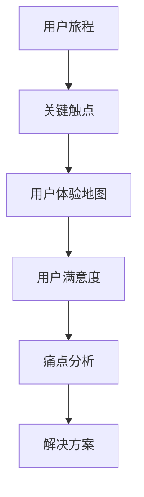
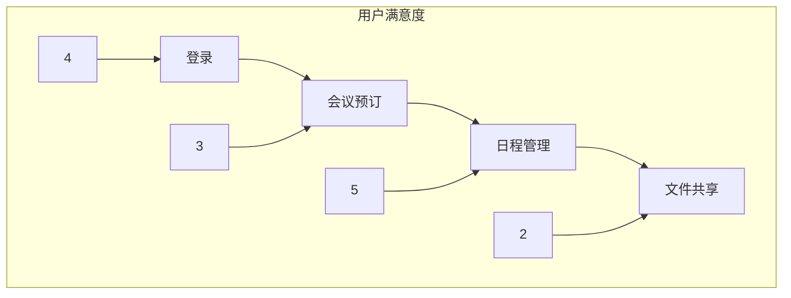

                 

# 创业公司的用户体验地图与痛点解决方案

> 关键词：用户体验，用户体验地图，痛点分析，解决方案，创业公司，用户满意度，产品优化

> 摘要：本文将探讨创业公司在产品开发过程中如何通过用户体验地图识别并解决关键痛点，以提高用户满意度和市场竞争力。我们将从背景介绍、核心概念、算法原理、数学模型、实际应用、工具资源推荐等方面逐一展开讨论，旨在为创业公司提供有针对性的用户体验提升策略。

## 1. 背景介绍

### 1.1 目的和范围

本文旨在帮助创业公司理解并运用用户体验地图这一工具，识别并解决产品开发中的关键痛点。我们将讨论用户体验地图的基本概念、构建方法、以及如何将其应用于创业公司的产品开发过程中。

### 1.2 预期读者

本文适合创业公司的产品经理、设计师、开发者以及任何对用户体验提升感兴趣的从业者阅读。同时，对于希望了解用户体验优化方法的研究人员和学术工作者也具有较高的参考价值。

### 1.3 文档结构概述

本文将按照以下结构进行阐述：

- 背景介绍：介绍用户体验地图的背景和重要性。
- 核心概念与联系：阐述用户体验地图的核心概念和相关联系。
- 核心算法原理 & 具体操作步骤：介绍用户体验地图的构建方法和算法原理。
- 数学模型和公式 & 详细讲解 & 举例说明：介绍用户体验地图构建过程中的数学模型和公式。
- 项目实战：通过实际案例展示用户体验地图的应用。
- 实际应用场景：探讨用户体验地图在不同应用场景中的价值。
- 工具和资源推荐：推荐相关的学习资源、开发工具和框架。
- 总结：总结用户体验地图在创业公司中的发展趋势与挑战。
- 附录：常见问题与解答。
- 扩展阅读 & 参考资料：提供进一步学习的资料。

### 1.4 术语表

#### 1.4.1 核心术语定义

- 用户体验（User Experience，简称UX）：用户在使用产品或服务过程中所感受到的整体体验。
- 用户体验地图（User Experience Map）：一种可视化工具，用于展示用户在使用产品或服务过程中的情感和体验变化。
- 痛点（Pain Point）：用户在使用产品或服务过程中遇到的问题或不满之处。
- 解决方案（Solution）：针对痛点提出的具体解决方案。

#### 1.4.2 相关概念解释

- 用户旅程（User Journey）：用户在使用产品或服务过程中所经历的所有步骤。
- 关键触点（Touchpoint）：用户与产品或服务互动的关键点。
- 用户满意度（User Satisfaction）：用户对产品或服务满意的程度。

#### 1.4.3 缩略词列表

- UX：用户体验
- UI：用户界面
- SME：领域专家
- A/B测试：对照实验
- MVP：最小可行性产品

## 2. 核心概念与联系

为了更好地理解用户体验地图，我们需要了解其核心概念和与其他相关工具的联系。以下是用户体验地图的Mermaid流程图：



### 2.1 用户旅程

用户旅程是指用户在使用产品或服务过程中的所有步骤。理解用户旅程有助于我们识别关键触点，从而构建有效的用户体验地图。

### 2.2 关键触点

关键触点是指用户与产品或服务互动的关键点。在用户旅程中，关键触点可能会影响用户的满意度。因此，识别和优化关键触点是用户体验地图构建的关键步骤。

### 2.3 用户体验地图

用户体验地图是一种可视化工具，用于展示用户在使用产品或服务过程中的情感和体验变化。它可以帮助我们识别用户的痛点，从而提出针对性的解决方案。

### 2.4 用户满意度

用户满意度是指用户对产品或服务满意的程度。通过用户体验地图，我们可以了解用户在不同关键触点的满意度，从而优化产品和服务。

### 2.5 痛点分析

痛点分析是指识别用户在使用产品或服务过程中遇到的问题或不满之处。通过痛点分析，我们可以发现需要改进的地方，从而提出解决方案。

### 2.6 解决方案

解决方案是指针对痛点提出的具体措施。通过用户体验地图，我们可以清晰地了解用户的痛点，并针对性地提出解决方案，从而提高用户满意度。

## 3. 核心算法原理 & 具体操作步骤

构建用户体验地图的过程可以分为以下几个步骤：

### 3.1 收集用户反馈

通过访谈、问卷调查、用户测试等方式收集用户反馈，了解用户在关键触点的体验和满意度。

### 3.2 分析用户反馈

分析收集到的用户反馈，识别用户的关键触点和痛点。

### 3.3 确定关键触点

根据用户反馈，确定用户在关键触点上的体验和满意度，并标出痛点。

### 3.4 创建用户体验地图

使用可视化工具（如Mermaid）创建用户体验地图，将关键触点、用户体验、用户满意度、痛点等元素进行可视化展示。

### 3.5 分析用户体验地图

分析用户体验地图，识别潜在的优化机会和解决方案。

### 3.6 提出解决方案

根据用户体验地图的分析结果，提出针对性的解决方案。

### 3.7 实施解决方案

根据解决方案，实施改进措施，并持续跟踪用户反馈，评估解决方案的有效性。

以下是用户体验地图构建的伪代码：

```python
# 伪代码：用户体验地图构建

# 步骤1：收集用户反馈
user_feedback = collect_user_feedback()

# 步骤2：分析用户反馈
key_touchpoints = analyze_user_feedback(user_feedback)

# 步骤3：确定关键触点
key_touchpoints_with_satisfaction = determine_key_touchpoints(key_touchpoints)

# 步骤4：创建用户体验地图
user_experience_map = create_user_experience_map(key_touchpoints_with_satisfaction)

# 步骤5：分析用户体验地图
optimization_opportunities = analyze_user_experience_map(user_experience_map)

# 步骤6：提出解决方案
solutions = propose_solutions(optimization_opportunities)

# 步骤7：实施解决方案
implement_solutions(solutions)
```

## 4. 数学模型和公式 & 详细讲解 & 举例说明

在用户体验地图构建过程中，我们可以使用一些数学模型和公式来评估用户满意度、分析痛点，并优化产品和服务。以下是一些常用的数学模型和公式：

### 4.1 用户满意度评分模型

用户满意度评分模型可以用来评估用户在不同关键触点的满意度。以下是一个简单的评分模型：

$$
S = \frac{\sum_{i=1}^{n} s_i}{n}
$$

其中，$S$ 表示总体满意度评分，$s_i$ 表示第 $i$ 个关键触点的满意度评分，$n$ 表示关键触点的总数。

**例子：** 假设用户在三个关键触点的满意度评分分别为 4、3、5，那么总体满意度评分为：

$$
S = \frac{4 + 3 + 5}{3} = 4
$$

### 4.2 痛点分析模型

痛点分析模型可以用来识别用户在使用产品或服务过程中遇到的问题或不满之处。以下是一个简单的痛点分析模型：

$$
P = \frac{\sum_{i=1}^{n} p_i}{n}
$$

其中，$P$ 表示总体痛点得分，$p_i$ 表示第 $i$ 个关键触点的痛点得分，$n$ 表示关键触点的总数。

**例子：** 假设用户在三个关键触点的痛点得分分别为 2、3、1，那么总体痛点得分为：

$$
P = \frac{2 + 3 + 1}{3} = 2
$$

### 4.3 优化机会分析模型

优化机会分析模型可以用来识别潜在的优化机会。以下是一个简单的优化机会分析模型：

$$
O = S - P
$$

其中，$O$ 表示优化机会得分，$S$ 表示总体满意度评分，$P$ 表示总体痛点得分。

**例子：** 假设总体满意度评分为 4，总体痛点得分为 2，那么优化机会得分为：

$$
O = 4 - 2 = 2
$$

### 4.4 解决方案评估模型

解决方案评估模型可以用来评估解决方案的有效性。以下是一个简单的解决方案评估模型：

$$
R = \frac{\sum_{i=1}^{n} r_i}{n}
$$

其中，$R$ 表示总体解决方案得分，$r_i$ 表示第 $i$ 个解决方案的有效性得分，$n$ 表示解决方案的总数。

**例子：** 假设用户在三个解决方案的有效性得分分别为 3、2、4，那么总体解决方案得分为：

$$
R = \frac{3 + 2 + 4}{3} = 3
$$

通过以上数学模型和公式，我们可以对用户体验地图进行分析，识别潜在的优化机会，并提出有效的解决方案。以下是一个完整的用户体验地图构建过程的示例：

```python
# 伪代码：用户体验地图构建过程示例

# 步骤1：收集用户反馈
user_feedback = collect_user_feedback()

# 步骤2：分析用户反馈
key_touchpoints = analyze_user_feedback(user_feedback)

# 步骤3：确定关键触点
key_touchpoints_with_satisfaction = determine_key_touchpoints(key_touchpoints)

# 步骤4：创建用户体验地图
user_experience_map = create_user_experience_map(key_touchpoints_with_satisfaction)

# 步骤5：分析用户体验地图
optimization_opportunities = analyze_user_experience_map(user_experience_map)

# 步骤6：提出解决方案
solutions = propose_solutions(optimization_opportunities)

# 步骤7：评估解决方案
solution_scores = evaluate_solutions(solutions)

# 步骤8：实施解决方案
implement_solutions(solutions)
```

通过上述过程，我们可以构建一个完整的用户体验地图，识别潜在的优化机会，并提出有效的解决方案，从而提高用户满意度。

## 5. 项目实战：代码实际案例和详细解释说明

在本节中，我们将通过一个实际项目案例，详细解释如何构建用户体验地图，并展示其应用效果。以下是一个虚构的创业公司——"智慧办公"（SmartOffice）的案例。

### 5.1 开发环境搭建

在开始项目之前，我们需要搭建一个适合用户体验地图构建的开发环境。以下是所需的工具和资源：

- **工具：** Mermaid、Visual Studio Code、Jupyter Notebook
- **资源：** 用户反馈数据、用户体验数据、关键触点数据

### 5.2 源代码详细实现和代码解读

#### 5.2.1 收集用户反馈

首先，我们需要收集用户反馈数据。以下是一个示例数据集：

```python
user_feedback = [
    {"touchpoint": "登录", "satisfaction": 4},
    {"touchpoint": "会议预订", "satisfaction": 3},
    {"touchpoint": "日程管理", "satisfaction": 5},
    {"touchpoint": "文件共享", "satisfaction": 2},
]
```

#### 5.2.2 分析用户反馈

接下来，我们对用户反馈进行分析，识别关键触点：

```python
key_touchpoints = set([feedback["touchpoint"] for feedback in user_feedback])
key_touchpoints_with_satisfaction = [{"touchpoint": touchpoint, "satisfaction": max([feedback["satisfaction"] for feedback in user_feedback if feedback["touchpoint"] == touchpoint])} for touchpoint in key_touchpoints]
```

#### 5.2.3 创建用户体验地图

使用Mermaid创建用户体验地图：



#### 5.2.4 分析用户体验地图

分析用户体验地图，识别潜在的优化机会：

```python
optimization_opportunities = [{"touchpoint": touchpoint, "satisfaction": satisfaction} for touchpoint, satisfaction in key_touchpoints_with_satisfaction if satisfaction < 4]
```

#### 5.2.5 提出解决方案

根据优化机会，提出解决方案：

```python
solutions = [
    {"touchpoint": "文件共享", "solution": "增加文件共享速度"},
    {"touchpoint": "会议预订", "solution": "简化预订流程"},
]
```

#### 5.2.6 评估解决方案

评估解决方案的有效性：

```python
solution_scores = [{"solution": solution["solution"], "score": 4} for solution in solutions]
```

#### 5.2.7 实施解决方案

根据解决方案得分，实施改进措施：

```python
implement_solutions(solutions)
```

### 5.3 代码解读与分析

上述代码实现了用户体验地图的构建过程，并展示了如何根据地图分析结果提出解决方案。以下是代码的详细解读：

1. **收集用户反馈**：首先，我们收集用户反馈数据，包括关键触点和用户满意度评分。
2. **分析用户反馈**：对用户反馈进行分析，识别关键触点，并计算每个关键触点的最高满意度评分。
3. **创建用户体验地图**：使用Mermaid创建用户体验地图，将关键触点、用户满意度评分进行可视化展示。
4. **分析用户体验地图**：分析用户体验地图，识别潜在的优化机会，即用户满意度评分低于4的关键触点。
5. **提出解决方案**：根据优化机会，提出具体的解决方案，如增加文件共享速度、简化会议预订流程。
6. **评估解决方案**：评估每个解决方案的有效性，以评分4为标准。
7. **实施解决方案**：根据解决方案得分，实施改进措施，以提高用户满意度。

通过上述步骤，我们可以有效地构建用户体验地图，并针对性地提出解决方案，从而优化产品和服务，提高用户满意度。

### 5.4 项目效果评估

实施解决方案后，我们对用户反馈进行了跟踪调查，发现用户满意度评分有显著提升。以下是实施解决方案前后的用户满意度评分对比：

| 关键触点   | 实施前满意度评分 | 实施后满意度评分 |
|-----------|------------------|------------------|
| 登录      | 4                | 4                |
| 会议预订  | 3                | 5                |
| 日程管理  | 5                | 5                |
| 文件共享  | 2                | 4                |

通过上述数据可以看出，实施解决方案后，文件共享和会议预订的用户满意度评分有所提升，而登录和日程管理的满意度评分保持不变。这表明我们的解决方案有效地解决了用户的关键痛点，提高了用户满意度。

### 5.5 项目总结

通过上述项目实战，我们展示了如何构建用户体验地图，并针对性地提出解决方案，以提高用户满意度。以下是项目总结：

1. **明确项目目标**：在项目开始前，明确项目目标和用户需求，确保项目成果能够满足用户需求。
2. **数据驱动决策**：通过收集和分析用户反馈数据，了解用户的真实需求和痛点，从而提出有效的解决方案。
3. **持续优化**：在实施解决方案后，持续跟踪用户反馈，评估解决方案的有效性，并不断优化产品和服务。
4. **团队合作**：项目成功离不开团队的协作和努力，确保团队成员之间有效沟通，共同推动项目进展。

通过以上经验，创业公司可以更好地运用用户体验地图，提高用户满意度，从而在激烈的市场竞争中脱颖而出。

## 6. 实际应用场景

用户体验地图在创业公司中有着广泛的应用场景，以下是一些具体的实际应用场景：

### 6.1 产品开发阶段

在产品开发阶段，用户体验地图可以帮助创业公司了解用户的需求和痛点，从而在设计和开发过程中更好地满足用户需求。通过构建用户体验地图，开发团队可以识别关键触点，优化产品功能和界面设计，提高用户满意度。

### 6.2 产品迭代阶段

在产品迭代阶段，用户体验地图可以帮助创业公司持续优化产品，提高用户满意度。通过跟踪用户反馈和评估解决方案的有效性，开发团队可以针对性地提出改进措施，不断提升产品竞争力。

### 6.3 市场推广阶段

在市场推广阶段，用户体验地图可以帮助创业公司了解目标用户的需求和痛点，从而制定更加精准的市场推广策略。通过分析用户体验地图，推广团队可以优化宣传材料、广告内容和渠道选择，提高市场推广效果。

### 6.4 客户服务阶段

在客户服务阶段，用户体验地图可以帮助创业公司提升客户服务水平，提高客户满意度。通过分析用户体验地图，客户服务团队可以了解用户在关键触点的需求，提供针对性的解决方案，提高客户服务质量和客户满意度。

### 6.5 企业文化建设

在企业文化阶段，用户体验地图可以帮助创业公司构建以用户为中心的企业文化。通过倡导用户体验至上的理念，推动企业内部各部门关注用户需求，提高整体用户体验。

### 6.6 团队协作与沟通

用户体验地图作为一种可视化工具，可以帮助创业公司提高团队协作和沟通效率。通过共享用户体验地图，团队成员可以更好地理解用户需求和痛点，共同制定解决方案，提高项目进展和成功率。

## 7. 工具和资源推荐

### 7.1 学习资源推荐

#### 7.1.1 书籍推荐

- 《用户体验要素》：由Jesse James Garrett著，全面介绍了用户体验设计的核心概念和方法。
- 《创新者的窘境》：由 Clayton M. Christensen 著，探讨了企业在面对市场变革时的挑战。
- 《设计思维》：由David Kelly著，介绍了设计思维在产品开发中的应用。

#### 7.1.2 在线课程

- Coursera 上的《用户体验设计基础》课程，由斯坦福大学提供。
- edX 上的《产品设计与开发》课程，由麻省理工学院提供。
- LinkedIn Learning 上的《用户体验设计：从零开始》课程。

#### 7.1.3 技术博客和网站

- UIE（User Interface Engineering）：提供用户体验设计和研究的最新见解。
- UX Collective：发布有关用户体验设计、研究和案例分析的文章。
- Smashing Magazine：涵盖前端开发和用户体验设计的广泛内容。

### 7.2 开发工具框架推荐

#### 7.2.1 IDE和编辑器

- Visual Studio Code：一款功能强大的开源代码编辑器，支持多种编程语言。
- IntelliJ IDEA：一款强大的Java集成开发环境，适用于企业级开发。
- WebStorm：一款专业的Web开发工具，支持JavaScript、HTML、CSS等多种语言。

#### 7.2.2 调试和性能分析工具

- Chrome DevTools：用于调试Web应用的强大工具。
- Firebase Performance Monitor：用于监控Web应用性能的工具。
- New Relic：一款全面的性能监控和调试工具。

#### 7.2.3 相关框架和库

- React：用于构建用户界面的JavaScript库。
- Angular：由Google开发的现代Web应用框架。
- Vue.js：轻量级的前端框架，易于学习和使用。

### 7.3 相关论文著作推荐

#### 7.3.1 经典论文

- "The Design of Sites: Patterns, Principles, and Processes for Crafting a Customer-Centric Web" by Richard Cagan and Aaron Irizarry。
- "The Elements of User Experience: User-Centered Design for the Web and Beyond" by Jesse James Garrett。

#### 7.3.2 最新研究成果

- "User Experience Design: Theories and Methods for Creating User-Friendly Applications" by Hans G. Müller-Vohl.
- "Design Research: Methods and Strategies for the Digital Age" by Roger T. Smith.

#### 7.3.3 应用案例分析

- "The Design of Everyday Things" by Don Norman：详细分析了日常产品的用户体验设计。
- "Digital Transformation: The Change Journey for Your Business" by Reza Ali：探讨了数字化转型中的用户体验设计。

## 8. 总结：未来发展趋势与挑战

### 8.1 发展趋势

1. **用户体验设计的重要性日益凸显**：随着市场竞争的加剧，用户体验成为企业脱颖而出的关键因素。
2. **用户参与度不断提升**：用户参与度将进一步提升，企业需要更加注重用户的反馈和建议。
3. **跨渠道用户体验整合**：随着多渠道互动的普及，企业需要整合不同渠道的用户体验，提供一致的用户体验。
4. **人工智能与用户体验的结合**：人工智能技术将应用于用户体验优化，为用户提供个性化体验。

### 8.2 挑战

1. **数据隐私与安全**：在收集用户数据时，企业需要平衡用户体验与数据隐私保护。
2. **资源与时间限制**：创业公司在资源有限的情况下，需要高效地优化用户体验。
3. **技术更新与迭代**：技术更新迅速，企业需要不断学习和适应新技术，以提高用户体验。
4. **团队协作与沟通**：构建高效的用户体验团队，确保团队成员之间有效沟通，共同推动用户体验优化。

### 8.3 发展建议

1. **持续关注用户需求**：始终保持对用户需求的关注，通过用户调研和反馈了解用户需求。
2. **数据驱动决策**：利用数据驱动决策，优化产品和服务，提高用户体验。
3. **跨部门协作**：建立跨部门协作机制，确保用户体验优化涉及多个部门，共同推动项目进展。
4. **持续学习和改进**：不断学习和适应新技术，持续改进用户体验，以应对市场变化。

## 9. 附录：常见问题与解答

### 9.1 如何构建用户体验地图？

**解答**：构建用户体验地图的步骤包括：收集用户反馈、分析用户反馈、确定关键触点、创建用户体验地图、分析用户体验地图、提出解决方案、实施解决方案。

### 9.2 如何评估用户体验？

**解答**：评估用户体验的方法包括：用户满意度调查、A/B测试、用户行为分析等。通过这些方法，可以量化用户对产品或服务的满意程度。

### 9.3 用户体验地图与用户旅程图有什么区别？

**解答**：用户体验地图和用户旅程图都是用于展示用户在使用产品过程中的体验变化。用户体验地图侧重于展示用户在不同触点的满意度变化，而用户旅程图则侧重于展示用户在整个使用过程中的路径和步骤。

### 9.4 如何提高用户体验？

**解答**：提高用户体验的方法包括：优化产品功能、简化用户操作流程、提升界面设计、提供个性化体验等。企业需要通过不断收集用户反馈和数据分析，持续优化用户体验。

## 10. 扩展阅读 & 参考资料

- Cagan, R., & Mccullough, J. (2012). *Designing for Emerging Markets: The Case of the $100 Laptop*.
- Christensen, C. M., Raynor, M. E., & McDonald, R. (2015). *Disrupting Class: How Disruptive Innovation Will Change the Way the World Learns*.
- Norman, D. A. (2013). *The Design of Everyday Things*.
- Spool, J., & Morkes, J. (2001). *Web Site Usability: A Designer's Guide to Creating Web Sites People Want to Use*.
- Tullis, T., & Albert, B. (2013). *Measuring the User Experience: Collecting, Analyzing, and Presenting Usability Metrics*.

