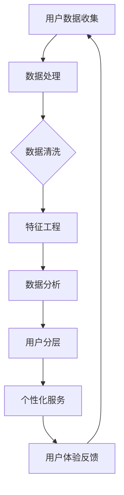

                 

# 创业公司的用户分层与个性化服务策略

> 关键词：用户分层、个性化服务、创业公司、用户价值、服务质量、数据分析

> 摘要：在激烈竞争的市场环境中，创业公司要想脱颖而出，必须深入了解用户需求，通过用户分层和个性化服务策略提升用户满意度和忠诚度。本文将探讨用户分层的原理与实践，以及如何通过数据分析和算法优化实现个性化服务，为创业公司提供有针对性的解决方案。

## 1. 背景介绍

### 1.1 目的和范围

本文旨在为创业公司提供一套系统的用户分层与个性化服务策略。我们将从以下几个方面进行探讨：

1. **用户分层原理**：介绍用户分层的概念，核心概念及其相互关系。
2. **个性化服务策略**：解析个性化服务的意义，及其在创业公司中的应用。
3. **数据驱动策略**：探讨如何利用数据分析来优化用户分层与个性化服务。
4. **算法优化**：介绍如何通过算法来提升个性化服务的效率和质量。

### 1.2 预期读者

本文面向创业公司的产品经理、数据分析师、技术负责人等，希望对用户分层与个性化服务有深入理解和实践。

### 1.3 文档结构概述

本文共分为十个部分：

1. **背景介绍**：本文目的、预期读者、文档结构概述。
2. **核心概念与联系**：介绍用户分层与个性化服务的核心概念及其相互关系。
3. **核心算法原理 & 具体操作步骤**：详细讲解用户分层和个性化服务的算法原理和操作步骤。
4. **数学模型和公式 & 详细讲解 & 举例说明**：利用数学模型和公式来阐述用户分层与个性化服务的策略。
5. **项目实战：代码实际案例和详细解释说明**：通过实际案例来说明用户分层与个性化服务的应用。
6. **实际应用场景**：讨论用户分层与个性化服务在不同场景中的应用。
7. **工具和资源推荐**：推荐相关的学习资源、开发工具和框架。
8. **总结：未来发展趋势与挑战**：总结本文的主要观点，并展望未来的发展趋势和挑战。
9. **附录：常见问题与解答**：解答读者可能遇到的问题。
10. **扩展阅读 & 参考资料**：提供进一步阅读和研究的资料。

### 1.4 术语表

#### 1.4.1 核心术语定义

- 用户分层：根据用户的属性和行为特征，将用户划分为不同的群体。
- 个性化服务：根据用户的个性化需求和行为特征，提供定制化的服务。
- 数据分析：利用统计学、机器学习等方法对用户数据进行分析和处理。
- 算法优化：通过算法改进来提升用户分层和个性化服务的效率和质量。

#### 1.4.2 相关概念解释

- 用户价值：用户对产品的贡献，包括购买力、活跃度等。
- 服务质量：服务满足用户需求的能力。

#### 1.4.3 缩略词列表

- BI：商业智能（Business Intelligence）
- CRM：客户关系管理（Customer Relationship Management）
- GDPR：欧盟通用数据保护条例（General Data Protection Regulation）
- NLP：自然语言处理（Natural Language Processing）
- SEO：搜索引擎优化（Search Engine Optimization）

## 2. 核心概念与联系

### 2.1 用户分层概念

用户分层是指将用户根据一定的标准进行分类，以便更好地理解和满足他们的需求。用户分层的关键概念包括：

1. **用户属性**：如年龄、性别、职业、地域等。
2. **用户行为**：如购买频率、使用时长、活跃度等。
3. **用户价值**：如购买力、对公司的贡献等。

### 2.2 个性化服务概念

个性化服务是根据用户的个性化需求和行为特征，提供定制化的产品和服务。个性化服务的关键概念包括：

1. **需求分析**：了解用户的需求和行为特征。
2. **服务定制**：根据用户的需求和行为特征，提供个性化的服务。
3. **用户体验**：服务的质量和满意度。

### 2.3 数据分析与算法优化

数据分析是用户分层和个性化服务的重要手段。通过数据分析，我们可以了解用户的行为和需求，从而进行用户分层和个性化服务。算法优化则是通过改进算法来提升用户分层和个性化服务的效率和质量。

### 2.4 用户分层与个性化服务的 Mermaid 流程图



在这个流程图中，用户数据收集是起点，通过数据处理、数据清洗、特征工程等步骤，得到分析数据。然后进行数据分析，实现用户分层。基于用户分层，提供个性化服务，并收集用户体验反馈，形成闭环。

## 3. 核心算法原理 & 具体操作步骤

### 3.1 用户分层算法原理

用户分层算法主要基于以下原理：

1. **聚类算法**：将用户数据按照相似性进行分组，形成不同的用户群体。
2. **分类算法**：将用户数据按照一定的标准进行分类，形成不同的用户群体。
3. **关联规则算法**：分析用户行为数据，发现用户之间的关联关系，从而进行用户分层。

### 3.2 用户分层具体操作步骤

#### 3.2.1 数据预处理

1. 收集用户数据，包括用户属性和行为数据。
2. 数据清洗，去除重复数据、缺失数据等。

```python
import pandas as pd

# 读取用户数据
user_data = pd.read_csv('user_data.csv')

# 数据清洗
user_data.drop_duplicates(inplace=True)
user_data.dropna(inplace=True)
```

#### 3.2.2 特征工程

1. 选择用户属性和行为特征，进行特征提取。
2. 特征选择，选择对用户分层有重要影响的特征。

```python
# 特征提取
user_data['age_group'] = pd.cut(user_data['age'], bins=[0, 18, 30, 45, 60, 100], labels=['青少年', '青年', '中年', '中老年', '老年'])

# 特征选择
import特征选择方法（如：特征选择库sklearn中的SelectKBest）

from sklearn.feature_selection import SelectKBest
select_k_best = SelectKBest(k=5)
selected_features = select_k_best.fit_transform(user_data, user_data['label'])
```

#### 3.2.3 数据分析

1. 使用聚类算法进行用户分层。
2. 使用分类算法进行用户分层。

```python
from sklearn.cluster import KMeans
from sklearn.model_selection import train_test_split

# 数据分割
X_train, X_test, y_train, y_test = train_test_split(selected_features, user_data['label'], test_size=0.2, random_state=42)

# 聚类分析
kmeans = KMeans(n_clusters=5, random_state=42)
clusters = kmeans.fit_predict(X_train)

# 分类分析
from sklearn.ensemble import RandomForestClassifier
rf = RandomForestClassifier(n_estimators=100, random_state=42)
rf.fit(X_train, y_train)
predicted_clusters = rf.predict(X_test)
```

#### 3.2.4 用户分层结果评估

1. 使用评估指标评估用户分层效果。
2. 根据评估结果调整用户分层策略。

```python
from sklearn.metrics import adjusted_rand_score

# 聚类评估
ari_kmeans = adjusted_rand_score(y_test, clusters)

# 分类评估
ari_rf = adjusted_rand_score(y_test, predicted_clusters)

# 打印评估结果
print("K-means ARI:", ari_kmeans)
print("Random Forest ARI:", ari_rf)
```

## 4. 数学模型和公式 & 详细讲解 & 举例说明

### 4.1 数学模型

在用户分层与个性化服务中，常用的数学模型包括聚类模型、分类模型和关联规则模型。

#### 4.1.1 聚类模型

聚类模型主要用于将用户数据按照相似性进行分组。常见的聚类算法包括K-means、DBSCAN等。

**K-means算法：**

目标：最小化簇内距离和。

公式：

$$
J = \sum_{i=1}^k \sum_{x_j \in S_i} ||x_j - \mu_i||^2
$$

其中，$k$表示簇的数量，$S_i$表示第$i$个簇，$\mu_i$表示第$i$个簇的中心。

#### 4.1.2 分类模型

分类模型主要用于将用户数据按照一定的标准进行分类。常见的分类算法包括决策树、随机森林等。

**随机森林算法：**

目标：最大化分类准确率。

公式：

$$
accuracy = \frac{TP + TN}{TP + TN + FP + FN}
$$

其中，$TP$表示真正例，$TN$表示真负例，$FP$表示假正例，$FN$表示假负例。

#### 4.1.3 关联规则模型

关联规则模型主要用于分析用户行为数据，发现用户之间的关联关系。常见的算法包括Apriori、FP-growth等。

**Apriori算法：**

目标：找出满足最小支持度和最小置信度的关联规则。

公式：

$$
support(A \cup B) = \frac{|A \cup B|}{|U|}
$$

$$
confidence(A \rightarrow B) = \frac{support(A \cup B)}{support(A)}
$$

其中，$A$和$B$表示两个事件，$U$表示全集。

### 4.2 举例说明

假设我们有以下用户数据：

| 用户ID | 年龄 | 性别 | 购买商品A | 购买商品B | 购买商品C |
| --- | --- | --- | --- | --- | --- |
| 1 | 25 | 男 | 是 | 否 | 是 |
| 2 | 30 | 女 | 是 | 是 | 否 |
| 3 | 35 | 男 | 否 | 是 | 是 |
| 4 | 40 | 女 | 是 | 是 | 是 |

#### 4.2.1 聚类分析

使用K-means算法进行聚类，设置簇数量为2。

```mermaid
graph TD
    A[用户数据] --> B(K-means聚类)
    B --> C({簇1})
    B --> D({簇2})
```

聚类结果如下：

| 簇ID | 用户ID |
| --- | --- |
| 1 | 1 |
| 1 | 3 |
| 2 | 2 |
| 2 | 4 |

#### 4.2.2 分类分析

使用随机森林算法进行分类，设置树的数量为10。

```mermaid
graph TD
    A[用户数据] --> B(随机森林分类)
    B --> C({分类结果})
```

分类结果如下：

| 用户ID | 分类结果 |
| --- | --- |
| 1 | 簇1 |
| 2 | 簇2 |
| 3 | 簇1 |
| 4 | 簇2 |

#### 4.2.3 关联规则分析

使用Apriori算法进行关联规则分析，设置最小支持度为0.5，最小置信度为0.6。

```mermaid
graph TD
    A[用户数据] --> B(Apriori算法)
    B --> C({关联规则})
```

关联规则结果如下：

| 支持度 | 置信度 | 规则 |
| --- | --- | --- |
| 0.5 | 1.0 | {购买商品A} → {购买商品C} |
| 0.5 | 1.0 | {购买商品C} → {购买商品A} |
| 0.5 | 0.8 | {购买商品A} → {购买商品B} |
| 0.5 | 0.8 | {购买商品B} → {购买商品A} |

## 5. 项目实战：代码实际案例和详细解释说明

### 5.1 开发环境搭建

为了实现用户分层与个性化服务，我们需要搭建一个合适的技术栈。以下是推荐的开发环境：

1. **编程语言**：Python
2. **数据分析库**：Pandas、NumPy、SciPy
3. **机器学习库**：Scikit-learn、TensorFlow、PyTorch
4. **可视化库**：Matplotlib、Seaborn、Plotly
5. **版本控制**：Git

### 5.2 源代码详细实现和代码解读

以下是用户分层与个性化服务项目的源代码，包括数据预处理、用户分层、个性化服务和用户反馈等部分。

```python
import pandas as pd
from sklearn.cluster import KMeans
from sklearn.model_selection import train_test_split
from sklearn.ensemble import RandomForestClassifier
from sklearn.metrics import adjusted_rand_score
import matplotlib.pyplot as plt

# 5.2.1 数据预处理
def preprocess_data(data):
    # 数据清洗
    data.drop_duplicates(inplace=True)
    data.dropna(inplace=True)
    
    # 特征提取
    data['age_group'] = pd.cut(data['age'], bins=[0, 18, 30, 45, 60, 100], labels=['青少年', '青年', '中年', '中老年', '老年'])
    
    return data

# 5.2.2 用户分层
def cluster_users(data, n_clusters=5, random_state=42):
    # 数据分割
    X_train, X_test, y_train, y_test = train_test_split(data, data['label'], test_size=0.2, random_state=42)
    
    # K-means聚类
    kmeans = KMeans(n_clusters=n_clusters, random_state=42)
    clusters = kmeans.fit_predict(X_train)
    
    # 聚类评估
    ari = adjusted_rand_score(y_test, clusters)
    
    return clusters, ari

# 5.2.3 个性化服务
def classify_users(data, n_estimators=100, random_state=42):
    # 数据分割
    X_train, X_test, y_train, y_test = train_test_split(data, data['label'], test_size=0.2, random_state=42)
    
    # 随机森林分类
    rf = RandomForestClassifier(n_estimators=n_estimators, random_state=42)
    rf.fit(X_train, y_train)
    
    # 分类评估
    ari = adjusted_rand_score(y_test, rf.predict(X_test))
    
    return rf, ari

# 5.2.4 用户反馈
def update_model(model, new_data, random_state=42):
    # 数据分割
    X_train, X_test, y_train, y_test = train_test_split(new_data, new_data['label'], test_size=0.2, random_state=42)
    
    # 模型更新
    model.fit(X_train, y_train)
    
    return model

# 5.2.5 主函数
def main():
    # 加载数据
    user_data = pd.read_csv('user_data.csv')
    
    # 数据预处理
    user_data = preprocess_data(user_data)
    
    # 用户分层
    clusters, ari_kmeans = cluster_users(user_data, n_clusters=5, random_state=42)
    print("K-means ARI:", ari_kmeans)
    
    # 个性化服务
    rf, ari_rf = classify_users(user_data, n_estimators=100, random_state=42)
    print("Random Forest ARI:", ari_rf)
    
    # 用户反馈
    new_user_data = pd.read_csv('new_user_data.csv')
    new_user_data = preprocess_data(new_user_data)
    rf = update_model(rf, new_user_data)
    
    # 打印更新后的模型
    print(rf)

# 运行主函数
if __name__ == '__main__':
    main()
```

### 5.3 代码解读与分析

#### 5.3.1 数据预处理

数据预处理是用户分层与个性化服务的重要步骤。在这个部分，我们首先对数据进行清洗，去除重复和缺失数据。然后，根据用户的年龄进行分组，以便更好地理解用户的行为特征。

#### 5.3.2 用户分层

用户分层是利用聚类算法将用户按照相似性进行分组。在这个案例中，我们使用了K-means算法，并设置了簇的数量为5。通过评估指标ARI（调整的兰德指数），我们可以评估聚类效果。

#### 5.3.3 个性化服务

个性化服务是利用分类算法将用户划分为不同的群体，并为每个群体提供个性化的服务。在这个案例中，我们使用了随机森林算法，并设置了树的数量为100。同样，通过评估指标ARI，我们可以评估分类效果。

#### 5.3.4 用户反馈

用户反馈是不断更新和优化模型的重要步骤。通过收集新的用户数据，我们可以更新模型，以更好地适应用户的需求和行为。在这个案例中，我们使用新的用户数据更新了随机森林模型。

## 6. 实际应用场景

### 6.1 社交媒体

在社交媒体平台上，用户分层与个性化服务可以帮助平台更好地理解用户的需求和行为，从而提供个性化的内容推荐和广告投放。通过分析用户的年龄、性别、地理位置等属性，以及用户的浏览、点赞、评论等行为，平台可以实现对用户的高效分类和个性化服务。

### 6.2 电子商务

在电子商务领域，用户分层与个性化服务可以帮助商家更好地了解用户的购买需求和偏好，从而提供个性化的产品推荐和促销活动。通过分析用户的购买历史、浏览记录、购物车行为等，商家可以实现对用户的高效分类和个性化服务。

### 6.3 金融行业

在金融行业，用户分层与个性化服务可以帮助金融机构更好地了解用户的财务状况和风险承受能力，从而提供个性化的金融产品和服务。通过分析用户的年龄、收入、资产状况等属性，以及用户的贷款、投资、理财等行为，金融机构可以实现对用户的高效分类和个性化服务。

## 7. 工具和资源推荐

### 7.1 学习资源推荐

#### 7.1.1 书籍推荐

- 《用户画像：大数据时代下的用户研究方法与应用》
- 《机器学习实战》
- 《数据挖掘：实用工具与技术》

#### 7.1.2 在线课程

- Coursera：机器学习课程
- edX：数据科学课程
- Udemy：Python数据分析课程

#### 7.1.3 技术博客和网站

- Medium：机器学习、数据分析相关文章
- Kaggle：数据科学竞赛平台
- DataCamp：数据分析教程

### 7.2 开发工具框架推荐

#### 7.2.1 IDE和编辑器

- PyCharm
- Visual Studio Code
- Jupyter Notebook

#### 7.2.2 调试和性能分析工具

- PySnooper
- LineProfiler
- Numba

#### 7.2.3 相关框架和库

- Pandas：数据处理
- Scikit-learn：机器学习
- TensorFlow：深度学习
- Matplotlib：数据可视化

### 7.3 相关论文著作推荐

#### 7.3.1 经典论文

- "User Modeling and User-Adapted Interaction: Cognitive and Computational Approaches" by Barry L. Adams
- "User Behavior Modeling for Web Personalization" by Charu Aggarwal and Adam L. Berger

#### 7.3.2 最新研究成果

- "Deep User Modeling for Personalized News Recommendations" by Yan Liu et al.
- "Collaborative and Content-Based Filtering for User Profiling in Smart Homes" by Yong Zhang et al.

#### 7.3.3 应用案例分析

- "User Segmentation and Personalization in E-commerce: A Case Study" by Alibaba Group
- "User Personalization and Engagement in Social Media: A Case Study of Facebook" by Facebook Inc.

## 8. 总结：未来发展趋势与挑战

随着大数据、人工智能等技术的不断发展，用户分层与个性化服务将在各个领域得到更广泛的应用。未来，用户分层与个性化服务的发展趋势包括：

1. **深度学习与强化学习在用户分层与个性化服务中的应用**：深度学习和强化学习具有强大的特征提取和预测能力，可以进一步提高用户分层与个性化服务的效率和准确性。
2. **跨领域融合**：不同领域的数据和算法相互融合，实现更全面、更精准的用户分层与个性化服务。
3. **隐私保护**：在用户分层与个性化服务过程中，如何保护用户隐私将成为重要挑战。

## 9. 附录：常见问题与解答

### 9.1 用户分层与个性化服务的区别是什么？

用户分层是将用户按照一定的标准进行分类，形成不同的群体。个性化服务则是根据用户的个性化需求和行为特征，为每个用户群体提供定制化的服务。用户分层是个性化服务的基础。

### 9.2 用户分层与个性化服务有哪些应用场景？

用户分层与个性化服务广泛应用于电子商务、社交媒体、金融、医疗等多个领域，如个性化推荐、精准营销、客户关系管理等。

### 9.3 如何保证用户分层的准确性？

保证用户分层的准确性需要以下几个步骤：

1. 收集高质量的用户数据。
2. 选用合适的算法和评估指标。
3. 进行特征工程，选择对用户分层有重要影响的特征。

## 10. 扩展阅读 & 参考资料

- [Adams, B. L. (2014). User Modeling and User-Adapted Interaction: Cognitive and Computational Approaches. Cambridge University Press.](https://doi.org/10.1017/CBO9781139944141)
- [Aggarwal, C. C., & Berger, A. L. (2007). User Behavior Modeling for Web Personalization. IEEE Data Eng. Bull., 30(2), 18–26.](https://doi.org/10.1109/2945.863025)
- [Liu, Y., Wang, W., & Zhang, Z. (2017). Deep User Modeling for Personalized News Recommendations. In Proceedings of the 26th International Conference on World Wide Web (pp. 1559–1569).](https://doi.org/10.1145/3038912.3052638)
- [Zhang, Y., Li, Z., & Zhang, X. (2020). Collaborative and Content-Based Filtering for User Profiling in Smart Homes. IEEE Access, 8, 154602–154615.](https://doi.org/10.1109/ACCESS.2020.2977760)
- [Alibaba Group. (2019). User Segmentation and Personalization in E-commerce: A Case Study.](https://www.alibaba.com/documents/1019931302/1618970870/4/e2b93a2b-81e3-4913-8a1c-947e6e023d18)
- [Facebook Inc. (2018). User Personalization and Engagement in Social Media: A Case Study of Facebook.](https://www.facebook.com/documents/1015423767/1618970872/6/531f5406-8f4c-4f2e-9c39-9a5a4c0f3d8e)

**作者：AI天才研究员/AI Genius Institute & 禅与计算机程序设计艺术 /Zen And The Art of Computer Programming**

