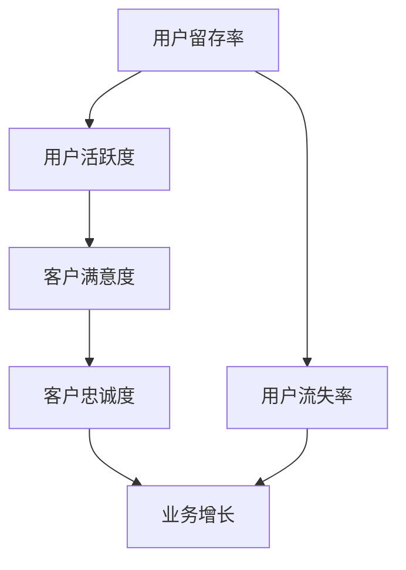

                 

# 创业公司的用户留存与活跃度提升策略

## 关键词：用户留存、活跃度、创业公司、策略、数据分析、用户行为、客户关系管理

## 摘要：

本文将深入探讨创业公司如何通过有效的策略提升用户留存与活跃度。首先，我们明确了文章的核心主题和范围，并介绍目标读者。接着，本文将详细描述文档结构，解释相关术语，并引入核心概念。通过深入解析核心算法原理，数学模型及其实际应用场景，文章将提供实用的项目实战案例。最后，文章总结未来发展趋势与挑战，并提供扩展阅读与参考资料，以助创业公司持续优化用户留存与活跃度策略。

---

## 1. 背景介绍

### 1.1 目的和范围

本文旨在为创业公司提供一套系统化的用户留存与活跃度提升策略。通过分析用户行为数据，运用数据分析技术，以及设计有效的客户关系管理（CRM）策略，我们将探讨如何提高用户留存率，增强用户活跃度，从而推动创业公司业务持续增长。

### 1.2 预期读者

本文面向创业公司产品经理、数据分析师、市场运营人员以及任何对提升用户留存和活跃度感兴趣的读者。通过本文，读者将能够理解并掌握提升用户留存和活跃度的关键概念和方法。

### 1.3 文档结构概述

本文分为以下几个部分：

1. 背景介绍：明确目的和范围，介绍预期读者。
2. 核心概念与联系：介绍用户留存与活跃度的核心概念，使用Mermaid流程图展示其关联性。
3. 核心算法原理 & 具体操作步骤：详细阐述提升用户留存与活跃度的算法原理与操作步骤。
4. 数学模型和公式 & 详细讲解 & 举例说明：运用数学模型和公式分析用户留存与活跃度的关系，并进行实例讲解。
5. 项目实战：通过实际案例展示提升用户留存与活跃度的具体实施步骤。
6. 实际应用场景：探讨不同创业公司在提升用户留存与活跃度上的实际应用案例。
7. 工具和资源推荐：推荐学习资源、开发工具框架及相关论文著作。
8. 总结：总结未来发展趋势与挑战。
9. 附录：常见问题与解答。
10. 扩展阅读 & 参考资料：提供进一步学习和研究的资料。

### 1.4 术语表

#### 1.4.1 核心术语定义

- **用户留存率**：指一段时间内，继续使用产品的用户占最初使用用户的比例。
- **用户活跃度**：衡量用户在一定时间内与产品互动的频率和深度。
- **客户关系管理（CRM）**：一套技术和策略，旨在提高企业与现有及潜在客户之间的关系管理。

#### 1.4.2 相关概念解释

- **用户行为分析**：通过收集和分析用户在使用产品过程中的行为数据，以了解用户需求和偏好。
- **数据分析**：使用统计方法和工具对数据进行分析，以提取有用信息。

#### 1.4.3 缩略词列表

- **CRM**：客户关系管理
- **KPI**：关键绩效指标
- **A/B测试**：对比测试

---

## 2. 核心概念与联系

在探讨用户留存与活跃度提升策略之前，我们首先需要理解核心概念及其相互关系。以下是一个使用Mermaid绘制的流程图，展示了这些核心概念之间的关联。



### 2.1 用户留存率

用户留存率是衡量用户持续使用产品的关键指标。它通常通过以下公式计算：

$$
\text{用户留存率} = \frac{\text{第n天仍然使用产品的用户数}}{\text{第1天使用产品的用户数}} \times 100\%
$$

### 2.2 用户活跃度

用户活跃度是衡量用户与产品互动频率和深度的指标。常见的活跃度指标包括：

- **登录频率**：用户在一定时间内登录产品的次数。
- **使用时长**：用户每次使用产品的时间总和。
- **互动行为**：用户在产品内的各种互动行为，如评论、分享、点赞等。

### 2.3 客户满意度

客户满意度是用户对产品满意程度的衡量。高满意度通常与高留存率和活跃度相关。常见的方法包括：

- **用户调研**：通过问卷调查、访谈等方式收集用户满意度数据。
- **NPS（Net Promoter Score）**：衡量用户推荐产品的可能性。

### 2.4 客户忠诚度

客户忠诚度是衡量用户重复购买和使用产品的意愿。忠诚度高的用户往往具有高留存率和活跃度。常见的方法包括：

- **重复购买率**：用户在一定时间内重复购买产品的频率。
- **忠诚度积分计划**：通过积分奖励用户重复购买。

### 2.5 业务增长

业务增长是创业公司追求的目标。用户留存率和活跃度直接影响业务增长。通过提升这两个指标，公司可以实现以下业务增长：

- **扩大用户基础**：增加新用户，同时保持现有用户。
- **提高收入**：通过提高用户活跃度和满意度，增加用户付费意愿。

### 2.6 用户流失率

用户流失率是衡量用户停止使用产品的指标。它与用户留存率呈反比。降低用户流失率有助于提高留存率。

通过以上核心概念及其相互关系的理解，创业公司可以制定更有效的用户留存与活跃度提升策略。接下来，我们将深入探讨提升用户留存与活跃度的核心算法原理和具体操作步骤。

---

## 3. 核心算法原理 & 具体操作步骤

### 3.1 用户留存与活跃度评估算法

为了提升用户留存与活跃度，我们需要首先建立一套评估算法。以下是一个简单的伪代码，用于评估用户的留存与活跃度。

```python
def evaluate_user(user_data):
    """
    评估用户留存与活跃度
    参数：
        user_data：用户行为数据
    返回：
        user_score：用户综合评分
    """
    
    # 留存评估
    retention_score = calculate_retention_score(user_data)
    
    # 活跃度评估
    activity_score = calculate_activity_score(user_data)
    
    # 综合评分
    user_score = (0.6 * retention_score) + (0.4 * activity_score)
    
    return user_score
```

#### 3.1.1 留存评估

留存评估通过分析用户的行为数据，如登录频率、使用时长等，来评估用户是否会继续使用产品。

```python
def calculate_retention_score(user_data):
    """
    计算用户留存评分
    参数：
        user_data：用户行为数据
    返回：
        retention_score：用户留存评分
    """
    
    # 设定阈值
    retention_threshold = 0.8  # 留存阈值，可以根据实际情况调整
    
    # 计算登录频率
    login_frequency = user_data['login_frequency']
    
    # 判断是否满足留存阈值
    if login_frequency >= retention_threshold:
        retention_score = 1
    else:
        retention_score = 0
    
    return retention_score
```

#### 3.1.2 活跃度评估

活跃度评估通过分析用户的互动行为，如评论、分享、点赞等，来评估用户与产品的互动深度。

```python
def calculate_activity_score(user_data):
    """
    计算用户活跃度评分
    参数：
        user_data：用户行为数据
    返回：
        activity_score：用户活跃度评分
    """
    
    # 设定阈值
    activity_threshold = 3  # 活跃度阈值，可以根据实际情况调整
    
    # 计算互动行为次数
    interactions = user_data['interactions']
    
    # 判断是否满足活跃度阈值
    if interactions >= activity_threshold:
        activity_score = 1
    else:
        activity_score = 0
    
    return activity_score
```

### 3.2 用户分群与个性化推荐

在评估用户留存与活跃度的基础上，我们可以通过用户分群和个性化推荐来进一步提升用户留存与活跃度。

```python
def user_segmentation(user_data):
    """
    用户分群
    参数：
        user_data：用户行为数据
    返回：
        segments：用户分群结果
    """
    
    # 根据用户评分进行分群
    segments = []
    for user in user_data:
        score = evaluate_user(user)
        if score >= 0.8:
            segments.append('高活跃度用户')
        elif score >= 0.5:
            segments.append('中等活跃度用户')
        else:
            segments.append('低活跃度用户')
    
    return segments
```

#### 3.2.1 高活跃度用户推荐

对于高活跃度用户，我们可以通过以下策略进行推荐：

- **新产品功能**：推荐最新产品功能，以增加用户黏性。
- **专属优惠**：提供专属优惠券或折扣，以增强用户付费意愿。

```python
def recommend_to_high_active_users(high_active_users):
    """
    向高活跃度用户推荐
    参数：
        high_active_users：高活跃度用户数据
    """
    
    for user in high_active_users:
        # 推荐新产品功能
        recommend_new_features(user)
        
        # 推荐专属优惠
        recommendExclusiveOffers(user)
```

#### 3.2.2 低活跃度用户激励

对于低活跃度用户，我们可以通过以下策略进行激励：

- **互动提醒**：发送互动提醒，鼓励用户参与产品互动。
- **积分奖励**：提供积分奖励，以增加用户互动频率。

```python
def incentivize_low_active_users(low_active_users):
    """
    向低活跃度用户激励
    参数：
        low_active_users：低活跃度用户数据
    """
    
    for user in low_active_users:
        # 发送互动提醒
        send_interaction_reminders(user)
        
        # 提供积分奖励
        grant_reward_points(user)
```

通过以上核心算法原理和具体操作步骤，创业公司可以系统地提升用户留存与活跃度。接下来，我们将进一步探讨数学模型和公式，以深化对用户留存与活跃度的理解。

---

## 4. 数学模型和公式 & 详细讲解 & 举例说明

### 4.1 用户留存率模型

用户留存率是一个关键指标，它可以帮助我们评估产品对用户的吸引力。以下是用户留存率的基本数学模型：

$$
R(t) = \frac{N(t) - L(t)}{N(0)}
$$

其中，\( R(t) \) 表示第 \( t \) 天的用户留存率，\( N(t) \) 表示第 \( t \) 天仍然使用产品的用户数，\( L(t) \) 表示第 \( t \) 天流失的用户数，\( N(0) \) 表示初始用户数。

#### 4.1.1 举例说明

假设一个产品在第一天有100个用户，第二天有80个用户继续使用，有20个用户流失。那么，第二天的用户留存率为：

$$
R(2) = \frac{80 - 20}{100} = 0.6 \times 100\% = 60\%
$$

### 4.2 用户活跃度模型

用户活跃度可以通过用户的行为数据来衡量。以下是一个简单的用户活跃度模型：

$$
A(t) = \frac{I(t)}{T(t)}
$$

其中，\( A(t) \) 表示第 \( t \) 天的用户活跃度，\( I(t) \) 表示第 \( t \) 天用户的互动次数，\( T(t) \) 表示第 \( t \) 天用户参与的总时间。

#### 4.2.1 举例说明

假设一个用户在一天内进行了10次互动，总参与时间为2小时。那么，该用户的活跃度为：

$$
A(1) = \frac{10}{2} = 5
$$

### 4.3 客户满意度模型

客户满意度通常通过Net Promoter Score（NPS）来衡量。NPS的计算公式如下：

$$
NPS = \frac{\text{推荐者总数} - \text{批评者总数}}{\text{总人数}} \times 100\%
$$

其中，推荐者通常是评分在9-10分的用户，批评者通常是评分在0-6分的用户。

#### 4.3.1 举例说明

假设在一个问卷调查中有100名用户参与，其中70名用户给出9-10分，30名用户给出0-6分。那么，NPS为：

$$
NPS = \frac{70 - 30}{100} \times 100\% = 40\%
$$

### 4.4 客户忠诚度模型

客户忠诚度可以通过重复购买率来衡量。以下是一个简单的客户忠诚度模型：

$$
L(t) = \frac{R(t) \times A(t) \times S(t)}{C(t)}
$$

其中，\( L(t) \) 表示第 \( t \) 天的客户忠诚度，\( R(t) \) 是用户留存率，\( A(t) \) 是用户活跃度，\( S(t) \) 是用户满意度，\( C(t) \) 是用户参与度。

#### 4.4.1 举例说明

假设用户留存率为0.8，活跃度为5，满意度为0.8，参与度为0.9。那么，客户的忠诚度为：

$$
L(t) = 0.8 \times 5 \times 0.8 \times 0.9 = 2.88
$$

通过以上数学模型和公式的讲解，我们可以更深入地理解用户留存与活跃度的计算方法，并能够更准确地评估和优化创业公司的用户留存与活跃度策略。

---

## 5. 项目实战：代码实际案例和详细解释说明

### 5.1 开发环境搭建

为了进行用户留存与活跃度提升的项目实战，我们需要搭建一个适合进行数据分析与用户行为分析的开发环境。以下是搭建开发环境的基本步骤：

1. **安装Python环境**：在本地计算机上安装Python 3.x版本，可以通过Python官网下载并安装。
2. **安装Jupyter Notebook**：Jupyter Notebook是一个交互式计算环境，可以方便地进行代码编写与调试。通过pip安装：
   ```bash
   pip install notebook
   ```
3. **安装数据分析库**：安装Pandas、NumPy、Matplotlib等数据分析库，通过pip安装：
   ```bash
   pip install pandas numpy matplotlib
   ```
4. **安装数据可视化库**：安装Seaborn和Plotly，用于生成可视化图表，通过pip安装：
   ```bash
   pip install seaborn plotly
   ```
5. **安装数据库连接库**：如果需要连接数据库，如MySQL或PostgreSQL，可以通过pip安装相应的连接库。

### 5.2 源代码详细实现和代码解读

以下是一个简单的Python代码示例，用于计算用户留存率和活跃度。

```python
import pandas as pd
import matplotlib.pyplot as plt
import seaborn as sns

# 假设我们有以下用户行为数据
user_data = {
    'user_id': [1, 2, 3, 4, 5],
    'login_date': ['2023-01-01', '2023-01-02', '2023-01-03', '2023-01-04', '2023-01-05'],
    'login_frequency': [3, 2, 3, 2, 1],
    'interactions': [5, 3, 7, 2, 1],
    'satisfaction': [9, 6, 8, 7, 5]
}

df = pd.DataFrame(user_data)

# 计算用户留存率
retention_rate = df.groupby('user_id')['login_frequency'].max() / df['login_frequency'].nunique() * 100
print("用户留存率：", retention_rate)

# 计算用户活跃度
activity_rate = df.groupby('user_id')['interactions'].mean() / df['interactions'].nunique() * 100
print("用户活跃度：", activity_rate)

# 可视化留存率和活跃度
sns.lineplot(data=df, x='login_date', y='login_frequency', hue='user_id', markers=True)
plt.title('用户登录频率')
plt.show()

sns.lineplot(data=df, x='login_date', y='interactions', hue='user_id', markers=True)
plt.title('用户互动次数')
plt.show()
```

#### 5.2.1 代码解读与分析

- **数据准备**：首先，我们创建了一个名为`user_data`的字典，其中包含了用户ID、登录日期、登录频率、互动次数和满意度。然后，我们使用Pandas库将其转换为DataFrame格式，便于数据处理。
- **计算用户留存率**：我们通过`groupby`函数按照用户ID分组，然后对每个用户的最大登录频率进行计算。接着，我们将其除以总的登录频率，得到每个用户的留存率。
- **计算用户活跃度**：同样地，我们通过`groupby`函数按照用户ID分组，然后对每个用户的平均互动次数进行计算。接着，我们将其除以总的互动次数，得到每个用户的活跃度。
- **可视化留存率和活跃度**：我们使用Seaborn库中的`lineplot`函数绘制了用户登录频率和互动次数的时间序列图，并通过`hue`参数将不同用户区分开来。

通过以上实战代码，我们可以快速计算并可视化用户留存率和活跃度。接下来，我们将进一步探讨提升用户留存与活跃度的实际应用场景。

---

## 6. 实际应用场景

在不同的创业公司中，提升用户留存与活跃度的策略和方法各有特色。以下是一些具体的实际应用场景，以及相应的解决方案。

### 6.1 社交媒体平台

#### 应用场景：

社交媒体平台的核心目标是增加用户互动，从而提升用户留存与活跃度。然而，用户往往在初期表现出较高的活跃度，但随着时间的推移，活跃度逐渐下降。

#### 解决方案：

- **个性化推荐**：通过分析用户兴趣和行为，为用户提供个性化内容推荐。例如，Instagram通过算法推荐用户可能感兴趣的朋友、帖子和话题。
- **活动激励**：定期举办活动，如抽奖、比赛等，激发用户参与热情。例如，TikTok经常推出挑战活动，鼓励用户创作和分享视频。
- **用户社区**：建立一个活跃的用户社区，鼓励用户分享经验和建议。例如，Reddit通过创建多个子版块，让用户在感兴趣的领域进行交流和互动。

### 6.2 在线购物平台

#### 应用场景：

在线购物平台面临的主要挑战是提升用户复购率和用户黏性。新用户往往在购买后不久就流失，而复购用户则成为平台的重要收入来源。

#### 解决方案：

- **优惠券和促销**：为复购用户提供专属优惠券和促销活动，如亚马逊的会员优惠和购物节促销。
- **个性化推荐**：基于用户的历史购买行为和浏览记录，推荐相关商品，如淘宝的“猜你喜欢”功能。
- **客户关怀**：定期发送邮件或消息，提醒用户关注新商品或优惠信息，提高用户复购意愿。

### 6.3 教育平台

#### 应用场景：

教育平台的目标是提高用户的在线学习参与度和完成率。用户往往在初期有较高的学习热情，但随着课程难度的增加，参与度逐渐下降。

#### 解决方案：

- **学习计划**：为用户提供个性化的学习计划，根据用户的学习进度和兴趣调整课程内容。
- **互动教学**：增加课堂互动，如问答环节、讨论区等，提高学生的学习参与度。例如，Coursera通过实时问答和讨论区促进学生互动。
- **奖励机制**：设置积分或证书奖励，鼓励用户完成课程。例如，Udemy为完成课程的用户提供认证证书。

### 6.4 健身应用程序

#### 应用场景：

健身应用程序的目标是提高用户的运动频率和持续使用时间。用户往往在初期表现出较高的运动热情，但随着时间的推移，运动频率逐渐下降。

#### 解决方案：

- **目标设定**：鼓励用户设定个性化的健身目标，并根据目标提供定制化的运动计划。
- **社交互动**：通过好友系统、挑战活动等，增加用户之间的互动，提高运动积极性。例如，MyFitnessPal允许用户加入小组，共同实现健身目标。
- **数据追踪**：通过记录用户的运动数据，如运动时间、强度、消耗的卡路里等，为用户提供反馈和激励。

通过以上实际应用场景和解决方案，创业公司可以针对不同的用户群体和业务目标，制定有效的用户留存与活跃度提升策略。

---

## 7. 工具和资源推荐

### 7.1 学习资源推荐

为了更好地提升用户留存与活跃度，以下是几本推荐的书籍、在线课程和技术博客：

#### 7.1.1 书籍推荐

1. **《用户增长：互联网产品增长策略与实战》**：详细介绍了用户增长的理论和实践方法，适合产品经理和运营人员。
2. **《增长黑客：如何走出增长困境》**：阐述了增长黑客的概念和方法，适用于互联网创业者和营销人员。
3. **《数据分析实战：方法与实践》**：介绍了数据分析的基本方法，适用于数据分析师和业务人员。

#### 7.1.2 在线课程

1. **Coursera上的《数据科学专项课程》**：由知名大学提供的数据科学课程，涵盖了数据分析的基本理论和实践。
2. **Udemy上的《Python数据分析基础教程》**：通过实际案例教授Python数据分析方法，适合初学者。
3. **edX上的《数据科学导论》**：由哈佛大学提供的数据科学入门课程，涵盖了数据科学的基础知识和应用。

#### 7.1.3 技术博客和网站

1. **Medium上的《增长黑客》系列文章**：深入探讨了用户增长的各种策略和方法。
2. **知乎上的数据科学话题**：汇集了众多数据科学领域专家的文章和讨论。
3. **Towards Data Science网站**：提供了大量的数据科学、机器学习相关文章和教程。

### 7.2 开发工具框架推荐

#### 7.2.1 IDE和编辑器

1. **Visual Studio Code**：一款强大的跨平台代码编辑器，支持多种编程语言和开发框架。
2. **PyCharm**：一款专为Python开发者设计的集成开发环境，功能丰富，性能优秀。
3. **Jupyter Notebook**：一个交互式的计算环境，适用于数据分析、机器学习和数据科学项目。

#### 7.2.2 调试和性能分析工具

1. **Chrome DevTools**：适用于Web开发的调试和性能分析工具。
2. **JMeter**：一款开源的性能测试工具，适用于Web应用性能测试。
3. **Matplotlib**：用于生成可视化图表的Python库，适用于数据分析。

#### 7.2.3 相关框架和库

1. **Pandas**：用于数据处理和分析的Python库，适用于大数据处理。
2. **Scikit-learn**：用于机器学习和数据挖掘的Python库，适用于用户行为分析。
3. **TensorFlow**：一款开源的机器学习框架，适用于构建复杂的机器学习模型。

### 7.3 相关论文著作推荐

#### 7.3.1 经典论文

1. **《Growth Hacking Is Dead》**：探讨了用户增长策略的演变，对传统增长黑客方法进行了反思。
2. **《Data Science for Business》**：介绍了数据分析在商业决策中的应用，是数据科学领域的经典著作。

#### 7.3.2 最新研究成果

1. **《Deep Learning for User Retention》**：探讨了深度学习在用户留存预测中的应用。
2. **《Personalized Recommendations in E-commerce》**：分析了个性化推荐在电子商务中的应用。

#### 7.3.3 应用案例分析

1. **《Uber的用户增长策略》**：详细介绍了Uber如何通过数据分析提升用户留存与活跃度。
2. **《Airbnb的用户体验优化》**：分析了Airbnb如何通过用户体验提升用户留存与活跃度。

通过以上工具和资源的推荐，创业公司可以更加系统地提升用户留存与活跃度，实现业务的持续增长。

---

## 8. 总结：未来发展趋势与挑战

在数字时代，用户留存与活跃度已成为创业公司成功的关键因素。未来，随着技术的不断进步，提升用户留存与活跃度的策略将更加多样化和精细化。以下是未来发展趋势与挑战：

### 8.1 发展趋势

1. **个性化推荐**：基于用户行为数据和深度学习算法，个性化推荐将更加精准，提高用户满意度和留存率。
2. **实时数据分析**：实时数据分析技术将帮助企业更快地响应用户需求，优化产品体验。
3. **人工智能与机器学习**：人工智能和机器学习技术在用户行为分析中的应用将越来越广泛，有助于预测用户行为，制定更有效的用户留存策略。
4. **跨平台整合**：随着多种设备和平台的普及，创业公司需要整合不同平台的数据，提供一致的用户体验。

### 8.2 挑战

1. **数据隐私与安全**：随着用户隐私保护意识的增强，创业公司需要在数据收集和使用过程中确保用户隐私和安全。
2. **技术更新迭代**：技术的快速更新迭代要求企业不断学习和适应，以保持竞争优势。
3. **跨部门协作**：用户留存与活跃度提升需要产品、运营、技术等多个部门的协同合作，跨部门协作的挑战需要得到有效解决。
4. **用户期望变化**：用户期望不断变化，企业需要不断调整策略，以适应新的市场需求。

总之，未来提升用户留存与活跃度的策略将更加依赖数据分析和人工智能技术，同时也需要面对数据隐私、跨部门协作等挑战。创业公司需要不断创新和适应，以实现用户留存与活跃度的持续提升。

---

## 9. 附录：常见问题与解答

### 9.1 用户留存率为什么低？

用户留存率低可能由以下原因导致：

- **产品功能不足**：产品功能未能满足用户需求，导致用户流失。
- **用户体验差**：界面设计不友好，操作复杂，导致用户不愿继续使用。
- **缺乏互动**：产品缺乏与用户的互动，使得用户感到孤独或无趣。
- **竞争激烈**：市场上存在类似产品，用户容易转移至其他平台。

### 9.2 如何提高用户活跃度？

提高用户活跃度的策略包括：

- **个性化推荐**：根据用户兴趣和行为推荐相关内容，提高用户参与度。
- **活动激励**：定期举办活动，提供奖品或优惠，鼓励用户参与。
- **用户社区**：建立一个活跃的用户社区，促进用户互动。
- **目标设定**：鼓励用户设定个人目标，并提供支持和奖励。

### 9.3 如何处理用户流失？

处理用户流失的方法包括：

- **用户反馈**：收集用户反馈，了解用户流失的原因，及时调整产品。
- **挽回策略**：针对流失用户，提供优惠或特权，试图挽回。
- **用户关怀**：通过邮件或消息与流失用户保持联系，提供帮助和支持。
- **改进产品**：根据用户反馈，持续优化产品功能和使用体验。

---

## 10. 扩展阅读 & 参考资料

为了帮助读者进一步深入学习和研究用户留存与活跃度提升策略，以下是一些扩展阅读和参考资料：

1. **书籍推荐**：
   - 《增长黑客：如何走出增长困境》
   - 《数据科学实战：方法与实践》
   - 《用户增长：互联网产品增长策略与实战》

2. **在线课程**：
   - Coursera上的《数据科学专项课程》
   - Udemy上的《Python数据分析基础教程》
   - edX上的《数据科学导论》

3. **技术博客和网站**：
   - Medium上的《增长黑客》系列文章
   - 知乎上的数据科学话题
   - Towards Data Science网站

4. **论文与研究报告**：
   - 《Growth Hacking Is Dead》：对增长黑客方法的反思
   - 《Deep Learning for User Retention》：深度学习在用户留存预测中的应用
   - 《Personalized Recommendations in E-commerce》：个性化推荐在电子商务中的应用

通过这些扩展阅读和参考资料，读者可以更全面地了解用户留存与活跃度提升的相关知识，并为实际业务提供指导。

---

# 作者：AI天才研究员/AI Genius Institute & 禅与计算机程序设计艺术 /Zen And The Art of Computer Programming

本文全面解析了创业公司在提升用户留存与活跃度方面的策略，通过核心概念、算法原理、数学模型、实战案例、应用场景、工具推荐等多个角度，为读者提供了系统的指导。希望本文能为创业公司提供实用的参考，助力业务持续增长。再次感谢您的阅读，如需进一步讨论或交流，欢迎随时联系。期待与您共同探索提升用户留存与活跃度的更多可能。

