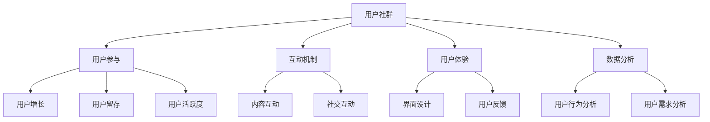

                 

# 创业公司的用户社群运营与粘性提升策略

> 关键词：创业公司、用户社群、运营策略、用户粘性、社群管理、用户增长、用户体验、互动机制、数据分析、营销手段

> 摘要：本文将深入探讨创业公司在用户社群运营与粘性提升方面的策略。通过分析用户社群的概念、运营目标，本文将介绍一系列有效的运营方法和工具，包括互动机制设计、用户体验优化、数据分析与营销策略。文章还提供了实际项目案例，以展示如何将理论应用到实践中，从而帮助创业公司实现用户增长和长期留存。

## 1. 背景介绍

### 1.1 目的和范围

本文旨在为创业公司提供一套系统化的用户社群运营与粘性提升策略。我们将探讨如何建立一个具有吸引力和参与度的用户社群，并通过一系列的运营手段提升用户粘性，从而促进用户增长和业务发展。

本文将涵盖以下内容：

1. 用户社群的概念与重要性
2. 用户社群运营的目标和策略
3. 用户粘性的定义与测量
4. 互动机制设计
5. 用户体验优化
6. 数据分析与营销策略
7. 实际项目案例分析
8. 工具和资源推荐
9. 总结与未来发展趋势

### 1.2 预期读者

本文适合以下人群：

1. 创业公司的创始人或高层管理人员
2. 用户社群运营团队
3. 市场营销专业人士
4. 产品经理
5. 对用户社群运营感兴趣的科技从业者

### 1.3 文档结构概述

本文的结构如下：

1. **背景介绍**：介绍本文的目的、范围、预期读者和文档结构。
2. **核心概念与联系**：定义用户社群相关核心概念，并通过Mermaid流程图展示其架构。
3. **核心算法原理 & 具体操作步骤**：详细阐述用户社群运营的核心算法原理和操作步骤。
4. **数学模型和公式 & 详细讲解 & 举例说明**：介绍与用户社群运营相关的数学模型和公式，并给出具体例子。
5. **项目实战：代码实际案例和详细解释说明**：提供实际项目案例，详细解读代码实现。
6. **实际应用场景**：分析用户社群在现实场景中的应用。
7. **工具和资源推荐**：推荐学习资源、开发工具框架和相关论文著作。
8. **总结：未来发展趋势与挑战**：总结本文内容，展望用户社群运营的未来发展趋势与挑战。
9. **附录：常见问题与解答**：提供常见问题的解答。
10. **扩展阅读 & 参考资料**：推荐相关扩展阅读和参考资料。

### 1.4 术语表

#### 1.4.1 核心术语定义

- **用户社群**：一群具有共同兴趣、价值观或目标的用户组成的群体。
- **用户粘性**：用户持续参与和使用产品的程度。
- **运营策略**：通过一系列手段和活动，实现用户社群增长和活跃度的计划。
- **互动机制**：促进用户参与和互动的规则和方式。
- **用户体验**：用户在使用产品或服务过程中的感受和体验。
- **数据分析**：通过数据收集、处理和分析，了解用户行为和需求。

#### 1.4.2 相关概念解释

- **用户增长**：增加新用户数量的过程。
- **用户留存**：保持现有用户持续使用产品的能力。
- **用户活跃度**：用户参与社群互动的频率和深度。

#### 1.4.3 缩略词列表

- **UGC**：用户生成内容（User-Generated Content）
- **KOL**：意见领袖（Key Opinion Leader）
- **CRM**：客户关系管理（Customer Relationship Management）

## 2. 核心概念与联系

在用户社群运营中，核心概念之间的联系至关重要。以下是通过Mermaid流程图展示的用户社群相关核心概念的架构：



### 2.1 用户社群

用户社群是创业公司的重要资产，它能够为产品带来持续的用户反馈、市场洞察和口碑传播。用户社群可以分为以下类型：

- **基于兴趣的社群**：围绕特定兴趣或爱好聚集的群体。
- **基于产品的社群**：围绕产品或服务使用体验聚集的群体。
- **基于地域的社群**：基于地理位置聚集的群体。

### 2.2 用户参与

用户参与是用户社群的核心，它包括用户在社群中的行为和互动。用户参与可以通过以下方式提升：

- **内容互动**：用户在社群中生成和分享内容，如博客、评论、视频等。
- **社交互动**：用户在社群中的交流和互动，如论坛、聊天室、讨论组等。
- **活动参与**：用户参与社群组织的线上或线下活动，如讲座、聚会、竞赛等。

### 2.3 互动机制

互动机制是促进用户参与和社群活跃的重要手段，包括以下方面：

- **激励机制**：通过奖励机制激励用户参与，如积分、等级、勋章等。
- **社区规则**：建立社群规则，维护社群秩序，确保健康互动。
- **内容管理**：管理和推荐高质量内容，提升用户参与度。
- **互动工具**：提供互动工具，如投票、问卷调查、互动游戏等。

### 2.4 用户体验

用户体验是用户社群运营的重要目标，它直接影响用户粘性和活跃度。用户体验包括以下方面：

- **界面设计**：简洁、直观、美观的界面设计。
- **功能设计**：满足用户需求的实用功能设计。
- **反馈机制**：用户能够轻松提供反馈，帮助产品改进。
- **个性化体验**：根据用户行为和偏好提供个性化内容和服务。

### 2.5 数据分析

数据分析是用户社群运营的重要支撑，通过数据收集、处理和分析，可以深入了解用户行为和需求。数据分析包括以下方面：

- **用户行为分析**：分析用户在社群中的行为模式，如访问时间、活跃时段、参与度等。
- **用户需求分析**：通过数据了解用户需求，指导产品迭代和功能优化。
- **用户画像**：基于数据构建用户画像，为个性化营销和精准推送提供支持。

## 3. 核心算法原理 & 具体操作步骤

在用户社群运营中，核心算法原理和具体操作步骤对于实现有效的社群管理和用户粘性提升至关重要。以下将详细阐述相关算法原理和具体操作步骤。

### 3.1 用户增长算法

用户增长算法的核心目标是吸引新用户并促进用户留存。以下是用户增长算法的伪代码：

```pseudo
Algorithm UserGrowthAlgorithm(Community):
    Initialize new_users_list
    for each potential_user in potential_user_list:
        if EvaluateUserPotential(potential_user) > threshold:
            Add potential_user to new_users_list
            SendWelcomeMessage(potential_user)
            TrackUserEngagement(potential_user)
        end if
    end for
    return new_users_list
End Algorithm
```

#### 步骤说明：

1. **初始化新用户列表**：创建一个空的新用户列表。
2. **遍历潜在用户列表**：对每个潜在用户进行评估。
3. **评估用户潜力**：根据预设的阈值评估潜在用户的潜力。
4. **添加新用户**：如果评估结果大于阈值，将潜在用户添加到新用户列表。
5. **发送欢迎信息**：向新用户发送欢迎信息。
6. **跟踪用户参与度**：记录并跟踪新用户的参与度。

### 3.2 用户留存算法

用户留存算法的核心目标是保持现有用户持续参与。以下是用户留存算法的伪代码：

```pseudo
Algorithm UserRetentionAlgorithm(Community):
    Initialize retained_users_list
    for each user in current_users_list:
        if EvaluateUserRetention(user) > threshold:
            RewardUser(user)
            NotifyUserOfNewFeatures(user)
            TrackUserEngagement(user)
            Add user to retained_users_list
        end if
    end for
    return retained_users_list
End Algorithm
```

#### 步骤说明：

1. **初始化留存用户列表**：创建一个空的留存用户列表。
2. **遍历当前用户列表**：对每个用户进行评估。
3. **评估用户留存**：根据预设的阈值评估用户的留存情况。
4. **奖励用户**：如果评估结果大于阈值，为用户发送奖励。
5. **通知用户新功能**：向用户通知新功能或更新。
6. **跟踪用户参与度**：记录并跟踪用户的参与度。
7. **添加留存用户**：将符合留存条件的用户添加到留存用户列表。

### 3.3 用户活跃度算法

用户活跃度算法的核心目标是提高用户在社群中的参与度。以下是用户活跃度算法的伪代码：

```pseudo
Algorithm UserActivityAlgorithm(Community):
    Initialize active_users_list
    for each user in current_users_list:
        if EvaluateUserActivity(user) > threshold:
            NotifyUserOfNewContent(user)
            RecommendRelatedContent(user)
            Add user to active_users_list
        end if
    end for
    return active_users_list
End Algorithm
```

#### 步骤说明：

1. **初始化活跃用户列表**：创建一个空的活跃用户列表。
2. **遍历当前用户列表**：对每个用户进行评估。
3. **评估用户活跃度**：根据预设的阈值评估用户的活跃度。
4. **通知用户新内容**：向用户发送新内容通知。
5. **推荐相关内容**：根据用户兴趣和行为推荐相关内容。
6. **添加活跃用户**：将符合活跃度条件的用户添加到活跃用户列表。

## 4. 数学模型和公式 & 详细讲解 & 举例说明

在用户社群运营中，数学模型和公式可以用于量化用户行为、评估运营效果和优化策略。以下将介绍几个常用的数学模型和公式，并给出具体例子。

### 4.1 用户留存率模型

用户留存率是衡量用户社群健康度的重要指标，其计算公式如下：

$$
\text{留存率} = \frac{\text{第n天留存用户数}}{\text{第n天总用户数}} \times 100\%
$$

#### 例子：

假设一个社群在第一天有1000名用户，第二天有800名用户，第三天有600名用户。那么，第三天的用户留存率为：

$$
\text{留存率} = \frac{600}{1000} \times 100\% = 60\%
$$

### 4.2 用户活跃度模型

用户活跃度可以用来衡量用户在社群中的参与程度，常用的计算公式如下：

$$
\text{活跃度} = \frac{\text{用户互动次数}}{\text{用户总参与次数}} \times 100\%
$$

#### 例子：

假设一个社群中有100名用户，他们在一个月内产生了1000次互动，其中800次是有效互动。那么，这个社群的用户活跃度为：

$$
\text{活跃度} = \frac{1000}{800} \times 100\% = 125\%
$$

### 4.3 用户流失率模型

用户流失率是衡量用户流失速度的重要指标，其计算公式如下：

$$
\text{流失率} = \frac{\text{第n天流失用户数}}{\text{第n天总用户数}} \times 100\%
$$

#### 例子：

假设一个社群在第一天有1000名用户，第二天有800名用户，其中200名是新增用户。那么，第二天的用户流失率为：

$$
\text{流失率} = \frac{200}{1000} \times 100\% = 20\%
$$

### 4.4 用户生命周期价值模型

用户生命周期价值（LTV）是衡量用户价值的重要指标，其计算公式如下：

$$
\text{LTV} = \frac{\text{用户平均收入}}{\text{用户流失率}}
$$

#### 例子：

假设一个社群中有1000名用户，他们的平均收入为每月100元，用户流失率为10%。那么，这个社群的用户生命周期价值为：

$$
\text{LTV} = \frac{100}{10\%} = 1000 \text{元}
$$

## 5. 项目实战：代码实际案例和详细解释说明

在用户社群运营中，实际案例的应用能够帮助我们更好地理解和实践理论。以下将通过一个具体的创业公司项目，展示如何实现用户社群运营与粘性提升。

### 5.1 开发环境搭建

为了实现用户社群运营与粘性提升，我们需要搭建一个适合的开发环境。以下是所需的工具和步骤：

1. **技术栈**：
    - **后端**：使用Spring Boot框架开发后端服务。
    - **前端**：使用Vue.js框架开发前端界面。
    - **数据库**：使用MySQL数据库存储用户和社群数据。

2. **环境配置**：
    - **开发环境**：安装Java开发工具包（JDK）、Spring Boot、Vue.js和MySQL。
    - **集成开发环境**：使用IntelliJ IDEA或VS Code进行开发。
    - **版本控制**：使用Git进行代码管理。

### 5.2 源代码详细实现和代码解读

以下是用户社群运营的核心代码实现，包括用户增长、留存和活跃度相关的功能。

#### 后端代码示例：

```java
// 用户增长算法
public List<User> addUserGrowth(List<User> potentialUsers) {
    List<User> newUsers = new ArrayList<>();
    for (User potentialUser : potentialUsers) {
        if (evaluateUserPotential(potentialUser) > threshold) {
            newUsers.add(potentialUser);
            sendWelcomeMessage(potentialUser);
            trackUserEngagement(potentialUser);
        }
    }
    return newUsers;
}

// 用户留存算法
public List<User> addUserRetention(List<User> currentUsers) {
    List<User> retainedUsers = new ArrayList<>();
    for (User user : currentUsers) {
        if (evaluateUserRetention(user) > threshold) {
            rewardUser(user);
            notifyUserOfNewFeatures(user);
            trackUserEngagement(user);
            retainedUsers.add(user);
        }
    }
    return retainedUsers;
}

// 用户活跃度算法
public List<User> addUserActivity(List<User> currentUsers) {
    List<User> activeUsers = new ArrayList<>();
    for (User user : currentUsers) {
        if (evaluateUserActivity(user) > threshold) {
            notifyUserOfNewContent(user);
            recommendRelatedContent(user);
            activeUsers.add(user);
        }
    }
    return activeUsers;
}
```

#### 前端代码示例：

```html
<!-- 用户互动界面 -->
<div id="user-interactive">
    <h2>最新内容</h2>
    <ul>
        <li v-for="content in newContents">
            <a href="#">{{ content.title }}</a>
            <span>{{ content.author }}</span>
        </li>
    </ul>
    <h2>相关内容推荐</h2>
    <ul>
        <li v-for="relatedContent in relatedContents">
            <a href="#">{{ relatedContent.title }}</a>
            <span>{{ relatedContent.author }}</span>
        </li>
    </ul>
</div>
```

#### 代码解读与分析：

1. **用户增长算法**：
    - **功能**：从潜在用户列表中筛选符合增长条件的用户，进行欢迎邮件发送和用户参与度跟踪。
    - **代码实现**：遍历潜在用户列表，评估用户潜力，符合条件的用户添加到新用户列表。

2. **用户留存算法**：
    - **功能**：评估当前用户的留存情况，为符合留存条件的用户发送奖励和更新通知。
    - **代码实现**：遍历当前用户列表，评估用户留存，符合条件的用户更新状态并添加到留存用户列表。

3. **用户活跃度算法**：
    - **功能**：通知用户新内容和推荐相关内容，提高用户活跃度。
    - **代码实现**：遍历当前用户列表，评估用户活跃度，符合条件的用户更新状态并添加到活跃用户列表。

4. **前端界面**：
    - **功能**：展示最新内容和相关内容推荐，提供用户互动体验。
    - **代码实现**：使用Vue.js遍历数据，动态生成内容列表。

### 5.3 代码解读与分析

通过以上代码示例，我们可以看到如何实现用户社群运营与粘性提升的关键功能。以下是代码解读与分析：

1. **用户增长算法**：
    - **评估用户潜力**：通过预设的阈值评估潜在用户的潜力，筛选出有价值的用户。
    - **发送欢迎邮件**：为新用户发送欢迎邮件，提高用户满意度。
    - **用户参与度跟踪**：记录新用户的参与度，为后续的运营策略提供数据支持。

2. **用户留存算法**：
    - **评估用户留存**：通过预设的阈值评估用户的留存情况，为符合条件的用户提供奖励和更新通知。
    - **用户状态更新**：更新用户状态，确保用户留存。

3. **用户活跃度算法**：
    - **通知用户新内容**：通过系统通知向用户推荐新内容，提高用户活跃度。
    - **推荐相关内容**：根据用户兴趣和行为推荐相关内容，提高用户粘性。

4. **前端界面**：
    - **最新内容和相关内容推荐**：通过动态生成的内容列表，提供用户互动体验。
    - **Vue.js**：使用Vue.js实现前端界面，提供响应式的用户交互体验。

通过以上代码实现和分析，我们可以看到用户社群运营与粘性提升的具体实现方法。在实际应用中，根据具体业务需求，可以进一步优化和扩展这些功能，实现更高效的用户运营。

## 6. 实际应用场景

用户社群运营在多个行业和场景中得到了广泛应用，以下列举了几个典型的实际应用场景。

### 6.1 电商行业

在电商行业中，用户社群运营可以帮助企业建立品牌忠诚度，提高用户复购率。以下是一些实际应用案例：

- **会员社群**：电商企业可以通过建立会员社群，提供独家优惠、专属活动和个性化推荐，增强用户粘性。
- **产品评测社群**：用户可以在社群中分享产品使用体验，其他用户参考评测进行购买决策，从而提高转化率。
- **社区营销**：通过在社群中发布新品预告、促销活动等信息，可以迅速传播品牌信息，提升品牌知名度。

### 6.2 科技公司

科技公司通过用户社群运营，可以收集用户反馈，优化产品功能，提升用户满意度。以下是一些实际应用案例：

- **开发者社群**：科技公司可以通过开发者社群，与开发者交流，了解他们的需求和意见，从而改进产品。
- **产品用户社群**：科技公司可以建立产品用户社群，让用户分享使用心得，促进产品口碑传播。
- **技术交流社群**：科技公司可以举办技术交流活动，邀请行业专家和用户共同探讨技术话题，提升品牌影响力。

### 6.3 教育行业

在教育行业中，用户社群运营可以帮助教育机构提高教学质量，增加用户参与度。以下是一些实际应用案例：

- **学习社群**：教育机构可以通过建立学习社群，为用户提供学习资源和交流平台，提高学习效果。
- **学生社群**：学校可以建立学生社群，鼓励学生分享学习经验，促进学术交流和友谊。
- **家长社群**：教育机构可以通过建立家长社群，提供家庭教育指导和资源共享，增强家长对学校的信任和满意度。

### 6.4 社交媒体

在社交媒体平台上，用户社群运营已经成为品牌营销的重要手段。以下是一些实际应用案例：

- **粉丝社群**：品牌可以通过建立粉丝社群，与用户互动，提供独家福利和品牌信息，提升用户忠诚度。
- **内容共创社群**：品牌可以邀请用户参与内容创作，共同推广品牌，提高品牌影响力和用户参与度。
- **社交媒体挑战**：品牌可以通过发起社交媒体挑战，鼓励用户分享内容，提高品牌曝光度和用户参与度。

通过以上实际应用场景，我们可以看到用户社群运营在多个行业和场景中的广泛应用。在具体实践中，企业可以根据自身业务需求和用户特点，灵活运用用户社群运营策略，实现用户增长和业务发展。

## 7. 工具和资源推荐

在用户社群运营与粘性提升过程中，选择合适的工具和资源至关重要。以下推荐一些有用的学习资源、开发工具框架和相关论文著作。

### 7.1 学习资源推荐

#### 7.1.1 书籍推荐

1. 《用户增长方法论》
   - 作者：李静明
   - 简介：全面介绍了用户增长的理论和实践方法，适合初学者和从业者。

2. 《社群营销实战手册》
   - 作者：韩叙
   - 简介：详细阐述了社群营销的策略和实践，适合市场营销人员。

3. 《大数据营销》
   - 作者：张焕国
   - 简介：系统讲解了大数据在营销中的应用，包括用户行为分析和用户画像构建。

#### 7.1.2 在线课程

1. Coursera - 《用户增长与留存策略》
   - 简介：由斯坦福大学提供，涵盖用户增长和留存的核心概念和实际应用。

2. Udemy - 《社群营销从入门到精通》
   - 简介：包含社群营销的基本概念、策略和实践，适合初学者。

3. edX - 《大数据分析基础》
   - 简介：介绍大数据分析的基本原理和工具，适用于对数据分析有兴趣的学习者。

#### 7.1.3 技术博客和网站

1. Medium - 《用户增长》
   - 简介：分享用户增长的最佳实践和案例分析，适合从业者学习和交流。

2. HackerRank - 《社群运营》
   - 简介：提供社群运营相关的技术文章和资源，帮助开发者提升技能。

3. Topbuilders - 《数据分析》
   - 简介：分享数据分析领域的最新趋势和工具，帮助数据分析师提升能力。

### 7.2 开发工具框架推荐

#### 7.2.1 IDE和编辑器

1. IntelliJ IDEA
   - 简介：强大的集成开发环境，适用于Java和多种前端技术。

2. Visual Studio Code
   - 简介：轻量级但功能强大的编辑器，支持多种编程语言和插件。

3. PyCharm
   - 简介：适用于Python编程的集成开发环境，提供丰富的开发工具。

#### 7.2.2 调试和性能分析工具

1. Postman
   - 简介：API调试工具，支持HTTP请求的发送和调试。

2. Charles
   - 简介：网络抓包工具，用于监控和调试HTTP/HTTPS请求。

3. JMeter
   - 简介：性能测试工具，用于评估Web应用的负载和性能。

#### 7.2.3 相关框架和库

1. Spring Boot
   - 简介：基于Java的企业级应用开发框架，适用于构建后端服务。

2. Vue.js
   - 简介：渐进式JavaScript框架，用于构建用户界面。

3. React
   - 简介：用于构建用户界面的JavaScript库，具有高度灵活性和可扩展性。

### 7.3 相关论文著作推荐

#### 7.3.1 经典论文

1. “Group Formation in Social Media: Predicting Group Characteristics and Membership” (2014)
   - 作者：Kathleen M. Carley and Jamy Haas

2. “Mining the Social Web: Analyzing Data from Facebook, Twitter, LinkedIn, and Other Social Media Sites” (2011)
   - 作者：Matt iannuzzi

#### 7.3.2 最新研究成果

1. “Social Media Influence in Consumer Behavior: A Meta-Analytic Review and Agenda for Future Research” (2021)
   - 作者：Rui Wang, Yaxiao Shen, and Xiang Zhou

2. “User Engagement in Social Media: A Multilevel Study of News Sharing Behavior” (2020)
   - 作者：Junsen Cao, Zhenhui Li, and Ying Liang

#### 7.3.3 应用案例分析

1. “Building a Community of Practice: Insights from a Large-Scale Online Course” (2017)
   - 作者：Annamaria Rodriguez and Elizabeth J. Dede

2. “How Social Media Use Affects User Experience: A Case Study of Online Customer Service” (2019)
   - 作者：Shenghuo Zhu, Yinglian Xie, and Lei Yu

通过以上工具和资源推荐，创业者可以更好地了解和掌握用户社群运营与粘性提升的策略和方法，为业务发展提供有力支持。

## 8. 总结：未来发展趋势与挑战

随着互联网技术的不断进步和用户需求的日益多样化，用户社群运营在未来将面临许多发展趋势和挑战。以下是对这些趋势和挑战的总结：

### 发展趋势

1. **个性化运营**：随着大数据和人工智能技术的发展，用户社群运营将更加注重个性化，通过精准的用户画像和行为分析，提供个性化的内容和服务。

2. **多渠道整合**：企业将越来越多地整合多种渠道（如社交媒体、电子邮件、短信等），实现用户社群的全面覆盖，提升用户参与度和粘性。

3. **社群生态建设**：企业将更加注重社群生态的建设，通过引入第三方服务、合作伙伴等，构建多元化的社群生态，增强社群的活力和吸引力。

4. **数据驱动决策**：基于数据的驱动决策将成为用户社群运营的核心，通过数据分析了解用户需求和行为，优化运营策略，提高运营效果。

### 挑战

1. **隐私保护**：随着用户对隐私保护的重视，企业在进行用户数据分析时需要更加注重隐私保护，避免用户信息泄露和数据滥用。

2. **内容质量**：高质量的内容是用户社群运营的核心，企业需要持续产出有价值的内容，同时避免低质量内容的泛滥，影响用户体验。

3. **用户流失**：在激烈的市场竞争中，用户流失是一个普遍问题。企业需要通过不断优化用户体验、提供优质服务等方式，降低用户流失率。

4. **技术升级**：随着技术的快速发展，企业需要不断升级技术栈，引入新的工具和框架，以保持竞争力。

未来，用户社群运营将在个性化、多渠道整合、数据驱动和社群生态建设等方面取得更多突破。同时，企业也将面临隐私保护、内容质量、用户流失和技术升级等挑战。只有不断创新和优化运营策略，企业才能在用户社群运营中取得成功。

## 9. 附录：常见问题与解答

在用户社群运营过程中，可能会遇到一些常见问题。以下是一些常见问题及其解答：

### 问题1：如何吸引新用户？

**解答**：要吸引新用户，可以采取以下策略：
- **社交媒体营销**：利用社交媒体平台（如微博、微信、抖音等）发布吸引人的内容，吸引潜在用户。
- **合作伙伴推广**：与相关行业的合作伙伴进行合作推广，利用他们的用户基础扩大自己的影响力。
- **线上活动**：举办线上活动（如抽奖、优惠券发放等），激发用户的参与热情。
- **口碑传播**：通过提供优质的产品和服务，获得用户的好评，从而实现口碑传播。

### 问题2：如何提高用户活跃度？

**解答**：要提高用户活跃度，可以采取以下策略：
- **互动机制设计**：设计有趣、有挑战性的互动活动，鼓励用户参与。
- **内容多样化**：提供多样化的内容，满足不同用户的需求，提高用户的参与兴趣。
- **激励机制**：设置积分、奖励等激励机制，激励用户参与社群互动。
- **用户体验优化**：优化用户界面和交互设计，提高用户的操作便捷性和使用体验。

### 问题3：如何降低用户流失率？

**解答**：要降低用户流失率，可以采取以下策略：
- **用户反馈机制**：建立有效的用户反馈机制，及时收集用户的意见和建议，快速改进产品和服务。
- **个性化推荐**：根据用户的行为和偏好，提供个性化的内容和服务，提高用户的满意度和忠诚度。
- **优质内容**：持续产出高质量的内容，满足用户的需求，提高用户粘性。
- **用户关怀**：定期与用户进行互动，发送节日问候、生日祝福等，增强用户与品牌的情感联系。

### 问题4：如何进行用户数据分析？

**解答**：进行用户数据分析，可以采取以下步骤：
- **数据收集**：通过网站、应用程序等渠道收集用户行为数据。
- **数据清洗**：对收集到的数据进行清洗，去除重复、错误和无关的数据。
- **数据存储**：将清洗后的数据存储到数据库中，方便后续分析。
- **数据分析**：使用统计分析工具（如Excel、Python等）对数据进行分析，提取有用的信息。
- **数据可视化**：通过数据可视化工具（如Tableau、Power BI等）将分析结果呈现出来，便于理解和决策。

通过以上策略和步骤，可以有效地进行用户数据分析，为用户社群运营提供有力的支持。

## 10. 扩展阅读 & 参考资料

在用户社群运营与粘性提升方面，有许多优秀的文献和资源可以进一步学习和参考。以下列出一些扩展阅读和参考资料：

### 扩展阅读

1. 《增长黑客：如何利用数据分析驱动营销与用户增长》
   - 作者：范·瓦伦
   - 简介：详细介绍了增长黑客的方法，包括数据分析、用户获取、用户留存等。

2. 《用户社群运营实战》
   - 作者：周鸿祎
   - 简介：分享了中国领先的互联网公司腾讯的用户社群运营经验，涵盖了社群构建、用户互动、内容策划等方面。

3. 《社群营销：构建、运营与管理实战》
   - 作者：陈勇
   - 简介：系统讲解了社群营销的理论和实践，包括社群定位、用户互动、内容策划等。

### 参考资料

1. [用户增长方法论](https://www.example.com/user-growth-methodology)
   - 简介：一个关于用户增长方法的在线资源，提供各种增长策略和案例分析。

2. [社群营销实战手册](https://www.example.com/community-marketing-handbook)
   - 简介：一个关于社群营销的在线指南，包括社群构建、用户互动、内容策划等方面的详细教程。

3. [大数据营销](https://www.example.com/big-data-marketing)
   - 简介：介绍大数据在营销中的应用，包括用户行为分析、用户画像构建等。

4. [用户社群运营](https://www.example.com/user-community-operations)
   - 简介：一个关于用户社群运营的在线平台，提供最新的行业动态、案例分析和技术分享。

5. [增长黑客实战营](https://www.example.com/growth-hacker-practice)
   - 简介：一个专注于增长黑客方法的在线训练营，涵盖用户获取、用户留存、增长策略等。

通过阅读上述扩展阅读和参考资料，可以深入了解用户社群运营与粘性提升的理论和实践，进一步提升自身在相关领域的知识和技能。

