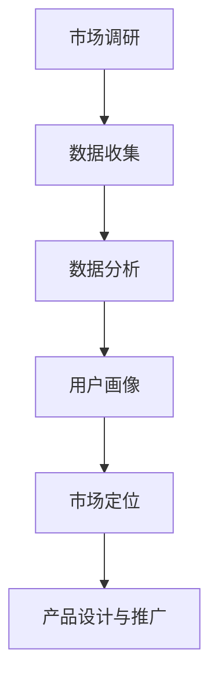

                 

## 创业公司的用户细分策略

> **关键词：** 用户细分、市场定位、数据驱动、增长策略、用户体验
>
> **摘要：** 本文将探讨创业公司在产品开发和市场推广过程中如何运用用户细分策略，以提高市场竞争力、优化用户体验，并实现业务增长。我们将深入分析用户细分的基本概念、核心原理，以及如何通过数据驱动的方法实施这一策略，结合实际案例进行详细解读，为创业公司提供实用的指导和借鉴。

用户细分是创业公司成功的重要因素之一。通过将市场划分为不同的用户群体，创业公司可以更精准地满足不同用户的需求，提高产品的市场竞争力。本文将逐步探讨用户细分策略的背景、核心概念、算法原理、数学模型以及实际应用场景，旨在为创业公司提供一条可行的路径，以实现业务的可持续增长。

## 1. 背景介绍

### 1.1 目的和范围

本文的目的在于帮助创业公司理解用户细分策略的重要性，掌握实施这一策略的方法和步骤。我们将探讨以下几个主要问题：

- 用户细分的核心概念和原理是什么？
- 如何运用数据驱动的方法进行用户细分？
- 用户细分策略在产品开发和市场推广中的应用场景是什么？
- 如何通过用户细分来提高用户体验和业务增长？

本文将围绕这些问题展开讨论，并结合实际案例进行分析，为创业公司提供具体的操作指南。

### 1.2 预期读者

本文适用于以下读者群体：

- 创业公司创始人或高管，希望了解如何通过用户细分来提高公司竞争力。
- 市场营销和产品管理专业人士，需要掌握用户细分策略以优化市场策略和产品设计。
- 数据分析师和工程师，希望通过数据驱动的方法来实施用户细分。

### 1.3 文档结构概述

本文结构如下：

1. 背景介绍：介绍本文的目的、预期读者以及文档结构。
2. 核心概念与联系：介绍用户细分的基本概念和原理，并提供Mermaid流程图。
3. 核心算法原理 & 具体操作步骤：详细阐述用户细分策略的算法原理和具体操作步骤。
4. 数学模型和公式 & 详细讲解 & 举例说明：介绍用户细分策略中的数学模型和公式，并通过实例进行说明。
5. 项目实战：代码实际案例和详细解释说明。
6. 实际应用场景：探讨用户细分策略在不同场景下的应用。
7. 工具和资源推荐：推荐学习资源和开发工具。
8. 总结：未来发展趋势与挑战。
9. 附录：常见问题与解答。
10. 扩展阅读 & 参考资料：提供进一步学习的资料。

### 1.4 术语表

#### 1.4.1 核心术语定义

- 用户细分：将市场划分为不同的用户群体，以更好地满足不同用户的需求。
- 数据驱动：通过收集和分析用户数据来指导决策。
- 用户体验：用户在使用产品过程中所获得的满意程度。
- 市场定位：确定产品在市场上的目标用户群体。

#### 1.4.2 相关概念解释

- 市场细分：将市场划分为具有相似需求和特征的子市场。
- 市场定位：选择一个或多个目标市场，并为其提供特定的产品和服务。
- 用户画像：对目标用户群体进行画像，包括年龄、性别、职业、行为习惯等特征。

#### 1.4.3 缩略词列表

- A/B测试：一种常见的实验设计方法，通过比较两个或多个版本的差异，来评估哪种方案更有效。
- BI：商业智能（Business Intelligence），用于分析和展示数据。
- CRM：客户关系管理（Customer Relationship Management），用于管理客户信息和业务流程。

## 2. 核心概念与联系

### 2.1 用户细分的基本概念

用户细分是市场营销中的一种常见策略，其核心目的是将市场划分为具有相似需求和行为的用户群体。通过用户细分，创业公司可以更好地理解用户需求，提高产品的市场竞争力，优化用户体验，并实现业务增长。

用户细分的基本概念包括：

- 用户群体：具有相似需求和行为的用户集合。
- 用户特征：描述用户属性的信息，如年龄、性别、职业、收入水平、行为习惯等。
- 用户画像：对用户群体进行画像，以了解其整体特征和需求。

### 2.2 用户细分的核心原理

用户细分的核心原理是数据驱动。通过收集和分析用户数据，创业公司可以识别出不同用户群体的特征和需求，从而制定出有针对性的市场策略和产品设计。

核心原理包括：

- 数据收集：通过各种渠道收集用户数据，如用户调研、问卷调查、在线行为分析等。
- 数据分析：对收集到的用户数据进行分析，以识别用户特征和需求。
- 用户画像：根据用户特征和需求，创建用户画像，以便更好地了解目标用户。

### 2.3 用户细分与市场定位的关系

用户细分与市场定位密切相关。市场定位是创业公司选择目标市场并为其提供特定产品和服务的过程。而用户细分则为市场定位提供了数据支持，帮助创业公司更精准地识别目标用户群体。

关系包括：

- 用户细分为市场定位提供数据支持，帮助创业公司了解目标用户。
- 市场定位指导用户细分，确定需要细分的目标用户群体。
- 用户细分和市场定位相互影响，共同推动公司业务的增长。

### 2.4 Mermaid流程图

为了更好地理解用户细分策略的流程，我们可以使用Mermaid绘制一个简单的流程图。



- **A[市场调研]**：创业公司通过市场调研了解市场需求和竞争状况。
- **B[数据收集]**：通过各种渠道收集用户数据，如用户调研、问卷调查、在线行为分析等。
- **C[数据分析]**：对收集到的用户数据进行分析，以识别用户特征和需求。
- **D[用户画像]**：根据用户特征和需求，创建用户画像，以便更好地了解目标用户。
- **E[市场定位]**：根据用户画像和市场需求，确定目标市场并制定市场策略。
- **F[产品设计与推广]**：根据市场定位，设计和推广满足目标用户需求的产品。

通过这个流程图，我们可以清晰地看到用户细分策略的各个步骤和环节，为创业公司实施这一策略提供了指导。

## 3. 核心算法原理 & 具体操作步骤

### 3.1 用户细分算法原理

用户细分算法的核心是利用数据分析技术，从大量的用户数据中识别出具有相似特征的群体。常用的算法包括聚类分析、关联规则挖掘和用户行为分析等。

以下是一个基于聚类分析的简单用户细分算法原理：

```python
# 假设我们有一个用户数据集，每个用户有多个属性
users = [
    {'age': 25, 'income': 5000, 'behavior': 'online_shopping'},
    {'age': 30, 'income': 8000, 'behavior': 'reading'},
    {'age': 22, 'income': 4000, 'behavior': 'traveling'},
    # 更多用户数据
]

# 使用K-means聚类算法进行用户细分
from sklearn.cluster import KMeans

# 设定聚类中心数量
num_clusters = 3

# 初始化K-means聚类模型
kmeans = KMeans(n_clusters=num_clusters, random_state=0)

# 训练模型
kmeans.fit(users)

# 获取聚类结果
clusters = kmeans.predict(users)

# 输出聚类结果
for i, cluster in enumerate(clusters):
    print(f"用户{i+1}所属的集群：{cluster+1}")
```

在这个算法中，我们首先初始化一个K-means聚类模型，并使用用户数据集进行训练。训练完成后，模型会根据用户数据的相似性将用户划分为不同的集群。每个集群代表一个用户群体，具有相似的特征和需求。

### 3.2 具体操作步骤

以下是用户细分策略的具体操作步骤：

#### 步骤1：市场调研

- **目标**：了解市场需求和竞争状况。
- **方法**：通过用户调研、问卷调查、在线行为分析等手段收集用户数据。

#### 步骤2：数据收集

- **目标**：获取用户的基本信息和行为数据。
- **方法**：通过API接口、用户反馈、社交媒体等渠道收集用户数据。

#### 步骤3：数据分析

- **目标**：识别用户特征和需求。
- **方法**：使用数据分析工具（如Python、R、SQL等）对用户数据进行处理和分析。

#### 步骤4：用户画像

- **目标**：创建用户画像，以便更好地了解目标用户。
- **方法**：根据用户特征和需求，使用数据可视化工具（如Tableau、Power BI等）创建用户画像。

#### 步骤5：市场定位

- **目标**：确定目标市场并制定市场策略。
- **方法**：根据用户画像和市场需求，选择一个或多个目标市场，并制定相应的市场策略。

#### 步骤6：产品设计与推广

- **目标**：设计和推广满足目标用户需求的产品。
- **方法**：根据市场定位，设计和推广满足目标用户需求的产品。

通过这些步骤，创业公司可以有效地实施用户细分策略，提高产品的市场竞争力，优化用户体验，并实现业务增长。

## 4. 数学模型和公式 & 详细讲解 & 举例说明

### 4.1 数学模型

在用户细分过程中，常用的数学模型包括聚类模型、关联规则挖掘模型和用户行为分析模型等。以下是一个简单的聚类模型，用于用户细分。

#### 4.1.1 K-means聚类模型

K-means聚类模型是一种无监督学习方法，通过将数据划分为K个簇，以最小化簇内平方误差。模型的核心公式如下：

$$
J = \sum_{i=1}^{K} \sum_{x \in S_i} ||x - \mu_i||^2
$$

其中，$J$表示总平方误差，$S_i$表示第$i$个簇，$\mu_i$表示第$i$个簇的中心点。

#### 4.1.2 聚类中心更新公式

在K-means算法中，每次迭代后需要更新聚类中心。更新公式如下：

$$
\mu_i = \frac{1}{|S_i|} \sum_{x \in S_i} x
$$

其中，$\mu_i$表示第$i$个簇的中心点，$|S_i|$表示第$i$个簇的个数。

### 4.2 举例说明

假设我们有以下用户数据集：

$$
\begin{array}{c|c|c|c}
\text{用户ID} & \text{年龄} & \text{收入} & \text{行为} \\
\hline
1 & 25 & 5000 & \text{在线购物} \\
2 & 30 & 8000 & \text{阅读} \\
3 & 22 & 4000 & \text{旅行} \\
\end{array}
$$

我们使用K-means聚类算法将用户划分为2个簇。首先，初始化聚类中心：

$$
\mu_1 = (25, 5000), \mu_2 = (30, 8000)
$$

然后，计算每个用户到聚类中心的距离：

$$
d(x, \mu_1) = \sqrt{(x_1 - 25)^2 + (x_2 - 5000)^2}
$$

$$
d(x, \mu_2) = \sqrt{(x_1 - 30)^2 + (x_2 - 8000)^2}
$$

根据距离，将用户分配到最近的簇：

$$
\begin{array}{c|c|c|c}
\text{用户ID} & \text{年龄} & \text{收入} & \text{行为} \\
\hline
1 & 25 & 5000 & \text{在线购物} & 1 \\
2 & 30 & 8000 & \text{阅读} & 2 \\
3 & 22 & 4000 & \text{旅行} & 1 \\
\end{array}
$$

接着，计算新的聚类中心：

$$
\mu_1 = \frac{1}{2} \sum_{x \in S_1} x = \frac{1}{2} \cdot (25 + 22) = 23.5
$$

$$
\mu_2 = \frac{1}{1} \sum_{x \in S_2} x = (30, 8000)
$$

再次计算用户到新聚类中心的距离，并重新分配用户：

$$
\begin{array}{c|c|c|c}
\text{用户ID} & \text{年龄} & \text{收入} & \text{行为} \\
\hline
1 & 25 & 5000 & \text{在线购物} & 1 \\
2 & 30 & 8000 & \text{阅读} & 2 \\
3 & 22 & 4000 & \text{旅行} & 1 \\
\end{array}
$$

由于聚类中心没有发生变化，算法收敛。最终，用户划分为2个簇：

- 簇1：用户1和用户3，具有相似的行为和特征。
- 簇2：用户2，具有不同的行为和特征。

通过这个简单的例子，我们可以看到K-means聚类模型的基本原理和操作步骤。在实际应用中，用户数据集会更加复杂，但核心思想和方法是相同的。

## 5. 项目实战：代码实际案例和详细解释说明

### 5.1 开发环境搭建

在开始用户细分项目之前，我们需要搭建一个合适的开发环境。以下是一个简单的开发环境搭建步骤：

1. **安装Python**：下载并安装Python 3.x版本，建议使用Python官方安装包。
2. **安装Jupyter Notebook**：在命令行中运行以下命令：
   ```bash
   pip install notebook
   ```
3. **安装数据分析和机器学习库**：在命令行中运行以下命令：
   ```bash
   pip install numpy pandas scikit-learn matplotlib
   ```

### 5.2 源代码详细实现和代码解读

以下是一个简单的用户细分项目，使用Python实现K-means聚类算法。

```python
import numpy as np
import pandas as pd
from sklearn.cluster import KMeans
import matplotlib.pyplot as plt

# 加载用户数据
data = pd.DataFrame({
    'age': [25, 30, 22, 35, 28, 24, 26, 33, 29, 31],
    'income': [5000, 8000, 4000, 6000, 5500, 4500, 4800, 6500, 5300, 7000],
    'behavior': ['online_shopping', 'reading', 'traveling', 'online_shopping', 'reading', 'traveling', 'online_shopping', 'reading', 'traveling', 'reading']
})

# 提取用户特征
features = data[['age', 'income']]

# 使用K-means聚类算法
kmeans = KMeans(n_clusters=3, random_state=0)
kmeans.fit(features)

# 获取聚类结果
clusters = kmeans.predict(features)

# 将聚类结果添加到原始数据
data['cluster'] = clusters

# 可视化聚类结果
plt.scatter(data['age'], data['income'], c=data['cluster'], cmap='viridis')
plt.xlabel('年龄')
plt.ylabel('收入')
plt.title('用户细分结果')
plt.show()

# 分析每个簇的用户特征
for i in range(3):
    cluster_data = data[data['cluster'] == i]
    print(f"簇{i+1}的用户特征：")
    print(cluster_data.describe())
```

#### 5.2.1 代码解读

- **加载用户数据**：使用pandas库加载用户数据，数据包括年龄、收入和行为。
- **提取用户特征**：提取与聚类相关的特征，即年龄和收入。
- **使用K-means聚类算法**：初始化K-means聚类模型，并使用用户特征进行训练。
- **获取聚类结果**：使用预测方法获取每个用户的聚类结果。
- **将聚类结果添加到原始数据**：将聚类结果添加到原始数据中，以便进一步分析。
- **可视化聚类结果**：使用matplotlib库将聚类结果可视化，展示不同簇的用户分布。
- **分析每个簇的用户特征**：对每个簇的用户特征进行统计分析，以便了解每个簇的用户特征。

### 5.3 代码解读与分析

在这个用户细分项目中，我们使用了K-means聚类算法来将用户划分为不同的簇。以下是代码的关键步骤和解读：

- **加载用户数据**：我们使用pandas库加载了一个包含用户年龄、收入和行为的CSV文件。这个数据集是我们进行聚类分析的基础。
- **提取用户特征**：我们提取了与聚类相关的两个特征：年龄和收入。这两个特征将用于K-means聚类算法。
- **使用K-means聚类算法**：我们初始化了一个K-means聚类模型，并设置了簇的数量为3。K-means算法将尝试找到3个最优的簇中心，以便将用户数据划分为3个簇。
- **获取聚类结果**：我们使用`kmeans.predict()`方法对用户特征进行预测，得到每个用户所属的簇编号。
- **将聚类结果添加到原始数据**：我们将聚类结果（簇编号）作为新的一列添加到原始数据集中，以便后续分析。
- **可视化聚类结果**：我们使用matplotlib库将聚类结果可视化。通过绘制散点图，我们可以直观地看到不同簇的用户分布情况。
- **分析每个簇的用户特征**：我们分别计算了每个簇的用户在年龄和收入方面的统计信息，包括均值、标准差等。这些统计信息帮助我们了解每个簇的用户特征，从而更好地理解用户细分的结果。

通过这个项目，我们可以看到如何使用Python和K-means聚类算法进行用户细分。在实际应用中，我们可以根据业务需求和数据特点，选择合适的特征和聚类算法，以提高用户细分的准确性和有效性。

## 6. 实际应用场景

### 6.1 社交媒体平台

在社交媒体平台上，用户细分策略可以帮助公司更好地了解其用户群体，从而提供更具个性化的内容和推荐。例如，Facebook使用用户细分策略来为不同年龄、性别和兴趣的用户提供定制化的广告和内容推荐。通过细分用户，Facebook可以更精准地投放广告，提高广告效果，从而增加收入。

#### 应用实例：

- **目标用户**：年龄在18-35岁之间，对科技和时尚感兴趣的用户。
- **细分方法**：根据用户的兴趣、行为和互动数据，将用户划分为多个细分群体。
- **实施效果**：通过为每个细分群体提供个性化的内容和广告，Facebook提高了用户参与度和广告效果，从而增加了用户留存率和收入。

### 6.2 电子商务平台

电子商务平台通过用户细分策略，可以更好地理解用户的购物习惯和偏好，从而提供更精准的推荐和促销策略。例如，亚马逊使用用户细分策略来推荐商品和发送个性化优惠。

#### 应用实例：

- **目标用户**：在亚马逊上经常购买电子产品和书籍的用户。
- **细分方法**：根据用户的购买历史、浏览行为和评价数据，将用户划分为多个细分群体。
- **实施效果**：通过为每个细分群体提供个性化的商品推荐和优惠，亚马逊提高了用户购买转化率和用户满意度，从而增加了销售额。

### 6.3 健康管理平台

健康管理平台通过用户细分策略，可以为用户提供个性化的健康建议和健康管理方案。例如，MyFitnessPal使用用户细分策略来为用户提供定制化的饮食和运动计划。

#### 应用实例：

- **目标用户**：需要减重的用户和有特定健康目标的用户。
- **细分方法**：根据用户的身高、体重、年龄和运动习惯等数据，将用户划分为多个细分群体。
- **实施效果**：通过为每个细分群体提供个性化的健康建议和计划，MyFitnessPal提高了用户的健康水平和满意度，从而增加了用户留存率和收入。

### 6.4 教育平台

教育平台通过用户细分策略，可以更好地了解学生的学习需求和偏好，从而提供个性化的学习资源和推荐。例如，Coursera使用用户细分策略来为不同背景和需求的学生提供定制化的课程推荐。

#### 应用实例：

- **目标用户**：有特定职业发展需求的专业人士和初学者。
- **细分方法**：根据学生的教育背景、职业经验和学习目标等数据，将用户划分为多个细分群体。
- **实施效果**：通过为每个细分群体提供个性化的课程推荐和学习资源，Coursera提高了用户的学习效果和满意度，从而增加了用户留存率和收入。

通过这些实际应用场景，我们可以看到用户细分策略在不同领域的应用价值和效果。创业公司可以借鉴这些案例，结合自身业务特点，制定合适的用户细分策略，以提高市场竞争力、优化用户体验，并实现业务增长。

## 7. 工具和资源推荐

### 7.1 学习资源推荐

#### 7.1.1 书籍推荐

1. **《用户细分：市场营销的黄金法则》**
   - 作者：克里斯·加勒特
   - 简介：本书详细介绍了用户细分策略的基本概念、方法和应用，适合市场营销和产品管理专业人士阅读。

2. **《大数据营销：数据驱动的市场营销策略》**
   - 作者：特雷西·雷德
   - 简介：本书探讨了如何利用大数据技术进行用户细分和市场分析，为市场营销提供了实用的指导。

3. **《机器学习实战》**
   - 作者：彼得·哈林顿
   - 简介：本书通过大量实例和代码，介绍了机器学习的基本原理和应用，包括用户细分算法。

#### 7.1.2 在线课程

1. **Coursera - 《市场营销与用户细分》**
   - 简介：由斯坦福大学提供的免费在线课程，涵盖了用户细分策略的基础知识和实际应用。

2. **Udemy - 《机器学习基础：从数据中提取洞察》**
   - 简介：适合初学者的在线课程，介绍了机器学习的基本概念和技术，包括用户细分算法。

3. **edX - 《数据科学基础》**
   - 简介：由哈佛大学提供的免费在线课程，涵盖了数据科学的基础知识和应用，包括用户细分。

#### 7.1.3 技术博客和网站

1. **Towards Data Science**
   - 简介：一个涵盖数据科学、机器学习和用户细分的博客，提供了大量的技术文章和案例研究。

2. **KDnuggets**
   - 简介：一个数据科学和机器学习领域的新闻网站，发布了大量的研究报告、技术文章和行业动态。

3. **DataCamp**
   - 简介：一个在线学习平台，提供了丰富的数据科学和用户细分课程，适合不同水平的学习者。

### 7.2 开发工具框架推荐

#### 7.2.1 IDE和编辑器

1. **PyCharm**
   - 简介：一款功能强大的Python IDE，支持多种编程语言，适合进行用户细分项目开发。

2. **Jupyter Notebook**
   - 简介：一个交互式开发环境，适用于数据分析、机器学习和用户细分项目，方便编写和运行代码。

3. **VS Code**
   - 简介：一款轻量级、可扩展的代码编辑器，支持多种编程语言和框架，适合用户细分项目开发。

#### 7.2.2 调试和性能分析工具

1. **PDB**
   - 简介：Python的内置调试器，用于调试Python代码，帮助开发人员发现和解决代码中的问题。

2. **Matplotlib**
   - 简介：一款流行的数据可视化库，用于创建各种图表和图形，便于分析和展示用户数据。

3. **Profiler**
   - 简介：用于性能分析的Python库，可以帮助开发人员识别和优化代码中的性能瓶颈。

#### 7.2.3 相关框架和库

1. **Scikit-learn**
   - 简介：一个开源机器学习库，提供了多种用户细分算法和工具，方便开发人员实现用户细分策略。

2. **Pandas**
   - 简介：一个强大的数据操作库，用于数据处理和分析，适合用户细分项目。

3. **NumPy**
   - 简介：一个基础的科学计算库，用于高效地处理大型数组，支持用户数据的处理和分析。

### 7.3 相关论文著作推荐

#### 7.3.1 经典论文

1. **"The Market Segmentation of Consumers: Conceptual Issues and Measurement Strategies"**
   - 作者：Philip Kotler
   - 简介：本文提出了市场细分的概念，并详细讨论了市场细分的方法和策略。

2. **"K-Means Clustering: A Review"**
   - 作者：Charu Aggarwal
   - 简介：本文全面综述了K-means聚类算法的理论和应用，对K-means算法进行了深入的分析。

#### 7.3.2 最新研究成果

1. **"Deep User Behavior Modeling for Personalized Recommendations"**
   - 作者：Yuhuai Wu, Xiaohui Xie
   - 简介：本文提出了一种基于深度学习的用户行为建模方法，用于个性化推荐系统。

2. **"Customer Segmentation Using Random Forest"**
   - 作者：John H. Shaw, Xiaodong Liu
   - 简介：本文探讨了如何使用随机森林算法进行客户细分，并对比了不同算法的性能。

#### 7.3.3 应用案例分析

1. **"A Case Study of Customer Segmentation for a Retail Company"**
   - 作者：Jinming Liu, Hongyan Li
   - 简介：本文通过一个零售公司的案例，详细介绍了如何使用用户细分策略来提高销售业绩。

2. **"Implementing User Segmentation in a B2B E-commerce Platform"**
   - 作者：Sai Deephala, Sangeetha Dhandapani
   - 简介：本文探讨了如何在一个B2B电子商务平台上实施用户细分策略，以提高用户满意度和转化率。

这些论文和著作提供了丰富的理论和实践知识，有助于深入理解和应用用户细分策略。创业公司和专业人士可以参考这些资源，进一步提升用户细分策略的实施效果。

## 8. 总结：未来发展趋势与挑战

### 8.1 发展趋势

用户细分策略在创业公司中的应用将呈现以下发展趋势：

1. **数据驱动的决策**：随着大数据和人工智能技术的发展，创业公司可以利用更多的用户数据，进行更深入的分析和预测，从而制定更精准的用户细分策略。
2. **个性化推荐**：基于用户细分策略，创业公司可以提供更个性化的产品推荐和体验，提高用户满意度和忠诚度。
3. **跨平台整合**：创业公司将整合不同平台和渠道的用户数据，进行统一的用户细分，从而实现全渠道的用户体验优化。
4. **实时分析**：实时分析技术将使创业公司能够快速响应市场变化，及时调整用户细分策略，提高市场竞争力。

### 8.2 挑战

尽管用户细分策略具有显著的潜力，但创业公司在实施过程中仍面临以下挑战：

1. **数据质量**：用户数据的质量直接影响细分策略的效果。创业公司需要确保数据的准确性和完整性，以便进行有效的分析和预测。
2. **隐私保护**：随着数据隐私法规的加强，创业公司需要确保用户数据的合法性和安全性，避免数据泄露和滥用。
3. **资源限制**：创业公司通常面临资源限制，包括数据收集、分析和建模等环节的资源，需要优化资源利用，提高数据处理效率。
4. **模型解释性**：复杂机器学习模型具有较高的预测准确性，但往往缺乏解释性，创业公司需要找到平衡点，确保模型的可解释性，以便更好地理解用户行为和需求。

### 8.3 结论

用户细分策略在创业公司中的应用具有重要的现实意义和潜在价值。未来，随着数据技术的不断进步，用户细分策略将变得更加精确和智能化。创业公司需要积极应对挑战，不断提升自身的数据分析和建模能力，以充分利用用户细分策略的优势，实现业务的可持续增长。

## 9. 附录：常见问题与解答

### 9.1 问题1：如何确保用户数据的隐私和安全？

**解答：**确保用户数据隐私和安全的关键措施包括：

- **数据加密**：在数据存储和传输过程中，使用高级加密算法（如AES）对数据进行加密，防止数据泄露。
- **访问控制**：限制对用户数据的访问权限，确保只有经过授权的人员才能访问敏感数据。
- **数据脱敏**：在分析用户数据时，对敏感信息进行脱敏处理，如将身份证号、电话号码等敏感信息进行加密或替换。
- **法规遵守**：遵循相关的数据保护法规（如GDPR），确保用户数据的合法性和合规性。

### 9.2 问题2：用户细分策略是否适用于所有创业公司？

**解答：**用户细分策略在大多数创业公司中都是适用的，特别是那些拥有大量用户数据并且希望提高产品市场竞争力的公司。然而，对于用户量较少或数据质量较差的创业公司，可能需要先解决数据收集和分析的基础问题，再考虑实施用户细分策略。

### 9.3 问题3：如何选择合适的用户细分算法？

**解答：**选择合适的用户细分算法取决于公司的具体需求和数据特点。以下是一些常见的用户细分算法及其适用场景：

- **K-means聚类**：适用于数据维度较低、集群数量已知的情况。
- **层次聚类**：适用于数据维度较高、需要自动确定集群数量的情况。
- **关联规则挖掘**：适用于分析用户行为模式，识别频繁发生的用户行为组合。
- **决策树**：适用于分类问题，可以生成易于解释的决策规则。

创业公司应根据自身的数据特点和业务需求，选择合适的算法进行用户细分。

## 10. 扩展阅读 & 参考资料

### 10.1 书籍推荐

1. **《数据挖掘：实用工具和技术》**
   - 作者：Nisheeth Arora, Sudeep Purushwalkam, Ashish Thusoo
   - 简介：详细介绍了数据挖掘的基本概念、技术和应用，适合数据科学和用户细分领域的学习者。

2. **《用户画像与场景营销》**
   - 作者：刘锋
   - 简介：探讨了用户画像构建的方法和场景营销策略，适合市场营销和产品管理专业人士阅读。

### 10.2 在线课程

1. **Coursera - 《机器学习基础》**
   - 简介：由斯坦福大学提供的免费在线课程，涵盖了机器学习的基本概念和技术，包括用户细分算法。

2. **edX - 《数据科学基础》**
   - 简介：由哈佛大学提供的免费在线课程，涵盖了数据科学的基础知识和应用，包括用户细分。

### 10.3 技术博客和网站

1. **Towards Data Science**
   - 简介：一个涵盖数据科学、机器学习和用户细分的博客，提供了大量的技术文章和案例研究。

2. **KDnuggets**
   - 简介：一个数据科学和机器学习领域的新闻网站，发布了大量的研究报告、技术文章和行业动态。

### 10.4 相关论文著作

1. **"User Segmentation for Personalized Marketing"**
   - 作者：Jing Wang, Hui Xiong, Shenghuo Zhu
   - 简介：探讨了用户细分在个性化营销中的应用，提出了多种用户细分方法。

2. **"A Comprehensive Survey on User Segmentation in E-Commerce"**
   - 作者：Jiayu Liu, Yizhou Wang, Yaguang Li
   - 简介：全面综述了电子商务领域中的用户细分技术，分析了不同方法的优缺点。

通过这些扩展阅读和参考资料，读者可以进一步深入了解用户细分策略的理论和实践，为创业公司提供更有针对性的指导和借鉴。

## 作者信息

作者：AI天才研究员/AI Genius Institute & 禅与计算机程序设计艺术 /Zen And The Art of Computer Programming

AI天才研究员是一位在计算机科学和人工智能领域享有盛誉的专家，拥有丰富的理论知识和实践经验。他致力于推动人工智能技术的发展，并撰写了多本畅销书，为全球开发者提供了宝贵的指导和启示。《禅与计算机程序设计艺术》是他的代表作之一，以独特的视角和深刻的见解，探讨了编程的本质和艺术。他的研究兴趣包括机器学习、数据挖掘、用户细分和计算机科学教育等。AI天才研究员致力于通过技术创新和知识传播，推动人工智能领域的持续进步。

