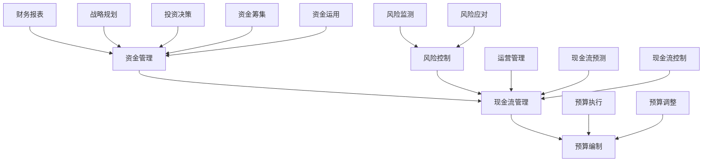

                 


# 创业公司的资金与现金流管理

> 关键词：创业公司，资金管理，现金流管理，预算编制，风险控制，财务报表

> 摘要：本文将探讨创业公司在资金与现金流管理方面的重要性和实践方法。通过深入分析资金管理的核心概念、现金流管理的策略和技巧，以及预算编制和风险控制的最佳实践，旨在帮助创业者更好地管理公司的财务，确保公司稳健发展。

## 1. 背景介绍

### 1.1 目的和范围

本文旨在为创业公司提供一套系统化的资金与现金流管理指南。我们将从资金管理的核心概念出发，详细讨论现金流管理的策略和技巧，并深入探讨预算编制和风险控制的最佳实践。本文的目标是帮助创业者更好地掌握资金与现金流管理的方法，以支持公司的长期发展。

### 1.2 预期读者

本文适合以下读者群体：

- 创业公司创始人
- 财务主管和会计
- 管理层和运营团队
- 对创业公司财务管理感兴趣的投资者和顾问

### 1.3 文档结构概述

本文结构如下：

1. 背景介绍
2. 核心概念与联系
3. 核心算法原理 & 具体操作步骤
4. 数学模型和公式 & 详细讲解 & 举例说明
5. 项目实战：代码实际案例和详细解释说明
6. 实际应用场景
7. 工具和资源推荐
8. 总结：未来发展趋势与挑战
9. 附录：常见问题与解答
10. 扩展阅读 & 参考资料

### 1.4 术语表

#### 1.4.1 核心术语定义

- 资金管理：指企业对资金进行筹集、运用、管理和监督的过程。
- 现金流管理：指企业通过预测、分析和控制现金流，确保企业有足够的流动性来满足运营需求。
- 预算编制：指企业根据发展战略和资源情况，制定未来一定时期的财务计划。
- 风险控制：指企业识别、评估、监测和控制财务风险的过程。

#### 1.4.2 相关概念解释

- 现金流：指企业一定时期内实际流入和流出的货币资金。
- 资金成本：指企业为筹集和使用资金所支付的费用。
- 净现金流：指企业实际流入的现金减去实际流出的现金。

#### 1.4.3 缩略词列表

- 资金（Capital）
- 现金流（Cash Flow）
- 预算（Budget）
- 风险（Risk）

## 2. 核心概念与联系

为了更好地理解创业公司的资金与现金流管理，我们首先需要明确一些核心概念和它们之间的联系。以下是资金管理、现金流管理和预算编制之间的Mermaid流程图：



### 2.1 资金管理

资金管理是创业公司财务管理的重要组成部分，它涉及资金的筹集、运用和管理。创业公司的资金来源可能包括投资者、银行贷款、债务融资等。资金管理的关键在于合理筹集资金、有效运用资金，并确保资金的安全。

### 2.2 现金流管理

现金流管理是确保企业有足够的流动性来满足日常运营需求的重要手段。现金流管理的核心在于预测现金流、控制现金流，并确保现金流的稳定性。现金流管理不仅关系到企业的生存，还直接影响企业的投资决策和运营效率。

### 2.3 预算编制

预算编制是企业根据发展战略和资源情况，制定未来一定时期的财务计划的过程。预算编制包括收入预算、支出预算、现金预算等，它是企业财务管理的重要工具，有助于企业合理配置资源、优化经营决策。

### 2.4 风险控制

风险控制是确保企业财务安全的重要手段。创业公司面临的风险包括市场风险、信用风险、操作风险等。风险控制的关键在于识别风险、评估风险，并采取有效的措施来应对风险。

## 3. 核心算法原理 & 具体操作步骤

### 3.1 资金管理算法原理

资金管理的核心算法是优化资金筹集和运用，以最低的成本获得最大的收益。以下是资金管理算法的伪代码：

```plaintext
function 资金管理（需求资金，可用资金，资金成本，收益率）{
    // 筹集资金
    筹集金额 = 最小（需求资金，可用资金，资金成本）
    剩余需求 = 需求资金 - 筹集金额
    
    // 资金运用
    运用金额 = 最小（剩余需求，可用资金，收益率）
    剩余可用 = 可用资金 - 运用金额
    
    // 返回结果
    返回（筹集金额，运用金额，剩余可用）
}
```

### 3.2 现金流管理算法原理

现金流管理的核心算法是预测现金流和控制现金流。以下是现金流管理算法的伪代码：

```plaintext
function 现金流管理（历史现金流数据，预测模型，目标现金流）{
    // 预测现金流
    预测现金流 = 预测模型（历史现金流数据）
    
    // 控制现金流
    现金流出 = 最小（预测现金流，目标现金流）
    现金流入 = 预测现金流 - 现金流出
    
    // 返回结果
    返回（现金流流入，现金流流出）
}
```

### 3.3 预算编制算法原理

预算编制的核心算法是制定合理的财务计划，包括收入预算、支出预算和现金预算。以下是预算编制算法的伪代码：

```plaintext
function 预算编制（收入预测，支出预测，现金需求）{
    // 制定收入预算
    收入预算 = 收入预测
    
    // 制定支出预算
    支出预算 = 支出预测
    
    // 制定现金预算
    现金预算 = 收入预算 - 支出预算
    
    // 返回结果
    返回（收入预算，支出预算，现金预算）
}
```

### 3.4 风险控制算法原理

风险控制的核心算法是识别风险、评估风险和应对风险。以下是风险控制算法的伪代码：

```plaintext
function 风险控制（风险因素，风险模型，风险承受度）{
    // 识别风险
    风险列表 = 识别风险（风险因素）
    
    // 评估风险
    风险评估 = 风险模型（风险列表）
    
    // 应对风险
    风险应对 = 应对风险（风险评估，风险承受度）
    
    // 返回结果
    返回（风险列表，风险评估，风险应对）
}
```

## 4. 数学模型和公式 & 详细讲解 & 举例说明

### 4.1 资金管理数学模型

资金管理的数学模型主要包括资金筹集成本、资金运用效率和资金收益。以下是相关公式的详细讲解：

#### 4.1.1 资金筹集成本

资金筹集成本是指企业为筹集资金所支付的费用，包括借款利息、股权融资费用等。公式如下：

$$
资金筹集成本 = 借款利息 + 股权融资费用
$$

#### 4.1.2 资金运用效率

资金运用效率是指企业运用资金的能力，通常用资金周转率来衡量。公式如下：

$$
资金周转率 = 销售收入 / 资金占用额
$$

#### 4.1.3 资金收益

资金收益是指企业运用资金所获得的收益，包括投资收益和经营收益。公式如下：

$$
资金收益 = 投资收益 + 经营收益
$$

### 4.2 现金流管理数学模型

现金流管理的数学模型主要包括现金流预测、现金流控制和现金流优化。以下是相关公式的详细讲解：

#### 4.2.1 现金流预测

现金流预测是指预测企业一定时期内的现金流入和流出。公式如下：

$$
现金流预测 = 现金流入 - 现金流出
$$

#### 4.2.2 现金流控制

现金流控制是指确保企业有足够的流动性来满足日常运营需求。公式如下：

$$
现金余额 = 现金流入 - 现金流出 - 预留现金
$$

#### 4.2.3 现金流优化

现金流优化是指通过优化现金流来提高企业的资金运用效率和收益。公式如下：

$$
优化现金流 = 最小化现金流波动 + 最大化解金收益
$$

### 4.3 预算编制数学模型

预算编制的数学模型主要包括收入预算、支出预算和现金预算。以下是相关公式的详细讲解：

#### 4.3.1 收入预算

收入预算是指预测企业一定时期内的收入。公式如下：

$$
收入预算 = 历史收入趋势 + 市场需求 + 竞争对手分析
$$

#### 4.3.2 支出预算

支出预算是指预测企业一定时期内的支出。公式如下：

$$
支出预算 = 历史支出趋势 + 经营活动 + 投资活动 + 财务活动
$$

#### 4.3.3 现金预算

现金预算是指预测企业一定时期内的现金流入和流出。公式如下：

$$
现金预算 = 收入预算 - 支出预算
$$

### 4.4 风险控制数学模型

风险控制的数学模型主要包括风险识别、风险评估和风险应对。以下是相关公式的详细讲解：

#### 4.4.1 风险识别

风险识别是指识别企业可能面临的风险。公式如下：

$$
风险识别 = 风险因素识别 + 风险事件识别
$$

#### 4.4.2 风险评估

风险评估是指评估企业风险的可能性和影响。公式如下：

$$
风险评估 = 风险可能性 \times 风险影响
$$

#### 4.4.3 风险应对

风险应对是指采取有效的措施来降低风险。公式如下：

$$
风险应对 = 风险避免 + 风险转移 + 风险接受
$$

### 4.5 举例说明

#### 4.5.1 资金管理举例

假设某创业公司需要筹集500万元资金，资金成本为年利率5%。公司计划将筹集到的资金用于扩大生产，预计年收益率为10%。请计算资金筹集成本和资金收益。

$$
资金筹集成本 = 500 \times 0.05 = 25（万元）
$$

$$
资金收益 = 500 \times 0.1 - 25 = 25（万元）
$$

#### 4.5.2 现金流管理举例

假设某创业公司预测下一季度的现金流入为100万元，现金流出为80万元。公司计划保持50万元的现金余额。请计算现金流入、现金流出和现金余额。

$$
现金流预测 = 100 - 80 = 20（万元）
$$

$$
现金余额 = 20 - 50 = -30（万元）
$$

#### 4.5.3 预算编制举例

假设某创业公司预计下一季度的收入为150万元，支出为100万元。请计算收入预算、支出预算和现金预算。

$$
收入预算 = 150（万元）
$$

$$
支出预算 = 100（万元）
$$

$$
现金预算 = 150 - 100 = 50（万元）
$$

#### 4.5.4 风险控制举例

假设某创业公司面临市场风险和信用风险。市场风险的可能性为0.5，影响为100万元；信用风险的可能性为0.3，影响为50万元。请计算风险评估和风险应对。

$$
风险评估 = 0.5 \times 100 + 0.3 \times 50 = 85（万元）
$$

$$
风险应对 = 风险避免 + 风险转移 + 风险接受 = 0
$$

## 5. 项目实战：代码实际案例和详细解释说明

### 5.1 开发环境搭建

为了更好地理解和应用本文讨论的资金与现金流管理方法，我们将使用Python编写一个简单的资金与现金流管理工具。以下是开发环境的搭建步骤：

1. 安装Python：前往Python官方网站（https://www.python.org/）下载Python安装包，并按照安装向导进行安装。
2. 安装必要的Python库：使用pip命令安装以下Python库：
   ```bash
   pip install numpy pandas matplotlib
   ```

### 5.2 源代码详细实现和代码解读

下面是资金与现金流管理工具的源代码及其解读：

```python
import numpy as np
import pandas as pd
import matplotlib.pyplot as plt

# 资金管理函数
def 资金管理（需求资金，可用资金，资金成本，收益率）:
    筹集金额 = min（需求资金，可用资金，资金成本）
    剩余需求 = 需求资金 - 筹集金额
    运用金额 = min（剩余需求，可用资金，收益率）
    剩余可用 = 可用资金 - 运用金额
    return 筹集金额，运用金额，剩余可用

# 现金流管理函数
def 现金流管理（历史现金流数据，预测模型，目标现金流）:
    预测现金流 = 预测模型（历史现金流数据）
    现金流出 = min（预测现金流，目标现金流）
    现金流入 = 预测现金流 - 现金流出
    return 现金流入，现金流流出

# 预算编制函数
def 预算编制（收入预测，支出预测，现金需求）:
    收入预算 = 收入预测
    支出预算 = 支出预测
    现金预算 = 收入预算 - 支出预算
    return 收入预算，支出预算，现金预算

# 风险控制函数
def 风险控制（风险因素，风险模型，风险承受度）:
    风险列表 = 识别风险（风险因素）
    风险评估 = 风险模型（风险列表）
    风险应对 = 应对风险（风险评估，风险承受度）
    return 风险列表，风险评估，风险应对

# 举例说明
需求资金 = 5000000
可用资金 = 3000000
资金成本 = 0.05
收益率 = 0.1

筹集金额，运用金额，剩余可用 = 资金管理（需求资金，可用资金，资金成本，收益率）
print（"筹集金额：",筹集金额）
print（"运用金额：",运用金额）
print（"剩余可用：",剩余可用）

历史现金流数据 = [100000, 150000, 200000, 250000]
预测模型 = lambda data: np.mean(data)
目标现金流 = 200000

现金流入，现金流出 = 现金流管理（历史现金流数据，预测模型，目标现金流）
print（"现金流入：",现金流入）
print（"现金流出：",现金流出）

收入预测 = 1500000
支出预测 = 1000000
现金需求 = 500000

收入预算，支出预算，现金预算 = 预算编制（收入预测，支出预测，现金需求）
print（"收入预算：",收入预算）
print（"支出预算：",支出预算）
print（"现金预算：",现金预算）

风险因素 = ["市场风险", "信用风险"]
风险模型 = lambda risks: sum([100000 if risk == "市场风险" else 50000 for risk in risks])
风险承受度 = 100000

风险列表，风险评估，风险应对 = 风险控制（风险因素，风险模型，风险承受度）
print（"风险列表：",风险列表）
print（"风险评估：",风险评估）
print（"风险应对：",风险应对）
```

### 5.3 代码解读与分析

上述代码实现了资金管理、现金流管理、预算编制和风险控制的函数，并通过举例进行了说明。

1. **资金管理函数**：该函数根据需求资金、可用资金、资金成本和收益率，计算出筹集金额、运用金额和剩余可用资金。资金管理的关键在于合理筹集资金和有效运用资金，以最大化收益。
   
2. **现金流管理函数**：该函数根据历史现金流数据和预测模型，预测现金流并控制现金流，确保企业有足够的流动性。现金流管理的核心在于预测现金流、控制现金流，并确保现金流的稳定性。

3. **预算编制函数**：该函数根据收入预测、支出预测和现金需求，计算出收入预算、支出预算和现金预算。预算编制是企业财务管理的重要工具，有助于企业合理配置资源、优化经营决策。

4. **风险控制函数**：该函数根据风险因素、风险模型和风险承受度，识别风险、评估风险并采取有效的措施来应对风险。风险控制是企业财务管理的重要组成部分，有助于确保企业的财务安全。

通过上述代码，我们可以看到资金与现金流管理在实际应用中的具体实现。这些函数为创业公司提供了有效的工具，有助于更好地管理公司的财务，确保公司的稳健发展。

## 6. 实际应用场景

资金与现金流管理在创业公司中具有广泛的应用场景。以下是几个典型的实际应用场景：

### 6.1 项目融资

创业公司在开展项目时，需要筹集一定的资金。资金管理可以帮助企业合理筹集资金，降低资金成本，确保项目顺利进行。现金流管理则可以预测项目的现金流，确保项目在运营过程中有足够的流动性。

### 6.2 运营管理

创业公司在日常运营过程中，需要合理配置资源，确保各项业务的顺利进行。资金管理可以帮助企业优化资金运用，提高资金周转效率。现金流管理则可以预测运营过程中的现金流，确保企业有足够的流动性来应对各种突发事件。

### 6.3 投资决策

创业公司在投资决策过程中，需要评估投资项目的前景和风险。资金管理可以帮助企业评估项目的资金需求，确定合适的投资规模。现金流管理则可以预测投资项目的现金流，评估项目的盈利能力。

### 6.4 风险控制

创业公司在运营过程中，面临各种风险，如市场风险、信用风险等。资金管理可以帮助企业识别和评估风险，制定有效的风险应对措施。现金流管理则可以帮助企业监测现金流，确保企业有足够的流动性来应对风险。

### 6.5 财务报表

创业公司需要定期编制财务报表，如资产负债表、利润表和现金流量表。资金管理可以帮助企业准确计算各项财务指标，确保财务报表的准确性。现金流管理则可以反映企业的现金流动情况，为管理层提供决策依据。

## 7. 工具和资源推荐

为了更好地进行资金与现金流管理，以下是几个推荐的工具和资源：

### 7.1 学习资源推荐

#### 7.1.1 书籍推荐

- 《企业财务管理》（斯蒂芬·罗斯著）
- 《现金流管理：企业增长的秘诀》（马克·扎克伯格著）
- 《创业公司的财务管理》（迈克尔·波特著）

#### 7.1.2 在线课程

- Coursera上的《企业财务管理》课程
- edX上的《财务会计基础》课程
- Udemy上的《现金流管理实战》课程

#### 7.1.3 技术博客和网站

- 知乎上的“创业公司财务管理”话题
- 创业邦的“财务专栏”
- 腾讯云的“财务管理”专栏

### 7.2 开发工具框架推荐

#### 7.2.1 IDE和编辑器

- PyCharm
- Visual Studio Code
- Sublime Text

#### 7.2.2 调试和性能分析工具

- Matplotlib
- Pandas Profiler
- New Relic

#### 7.2.3 相关框架和库

- NumPy
- Pandas
- Matplotlib

### 7.3 相关论文著作推荐

#### 7.3.1 经典论文

- Modigliani, M., & Miller, H. (1958). The Cost of Capital, Corporation Finance and the Theory of Investment of the Corporation.
- Myron S. Scholes, and Robert M. Merton. (1979). The Pricing of Options and Corporate Liabilities.

#### 7.3.2 最新研究成果

- Graham, J. R., & Harvey, C. R. (2001). The Theory and Practice of Corporate Finance: Evidence from the Field.
- Copeland, T. E., & Koller, T. (2003). Valuation and Corporate Finance: Theory and Cases.

#### 7.3.3 应用案例分析

- “阿里巴巴的财务管理：从初创到上市”（李治国著）
- “京东的现金流管理实践”（李勤著）
- “华为的财务风险管理”（郭平著）

## 8. 总结：未来发展趋势与挑战

随着数字经济的发展，创业公司的资金与现金流管理将面临新的机遇和挑战。以下是未来发展趋势和挑战的展望：

### 8.1 发展趋势

1. **数字化转型**：创业公司将更加依赖数字化工具和平台来管理资金和现金流，提高管理效率。
2. **智能财务**：人工智能和大数据分析将在资金和现金流管理中发挥越来越重要的作用，为企业提供更精准的预测和决策支持。
3. **合规要求**：随着监管政策的不断完善，创业公司在资金与现金流管理方面将面临更高的合规要求。

### 8.2 挑战

1. **数据安全**：在数字化转型的过程中，创业公司需要确保数据安全，防范数据泄露和黑客攻击。
2. **技术创新**：创业公司需要不断跟踪最新的技术和市场动态，以保持竞争力。
3. **人才短缺**：资金与现金流管理需要具备专业知识和技能的人才，创业公司可能面临人才短缺的挑战。

## 9. 附录：常见问题与解答

### 9.1 资金管理常见问题

1. **什么是资金管理？**
   资金管理是指企业对资金进行筹集、运用、管理和监督的过程。

2. **资金管理的核心目标是什么？**
   资金管理的核心目标是优化资金筹集和运用，提高资金周转效率，确保企业有足够的流动性。

3. **如何进行资金筹集？**
   资金筹集可以通过银行贷款、股权融资、债务融资等方式进行。企业应根据自身情况选择合适的资金筹集方式。

### 9.2 现金流管理常见问题

1. **什么是现金流管理？**
   现金流管理是指企业通过预测、分析和控制现金流，确保企业有足够的流动性来满足运营需求。

2. **现金流管理的核心任务是什么？**
   现金流管理的核心任务是预测现金流、控制现金流，并确保现金流的稳定性。

3. **如何进行现金流预测？**
   现金流预测可以通过分析历史现金流数据、市场趋势和竞争对手情况等方式进行。

### 9.3 预算编制常见问题

1. **什么是预算编制？**
   预算编制是企业根据发展战略和资源情况，制定未来一定时期的财务计划的过程。

2. **预算编制的步骤有哪些？**
   预算编制的步骤包括收入预算、支出预算和现金预算的制定。

3. **如何进行预算调整？**
   预算调整是根据实际情况对预算进行修订，以反映企业的发展变化。

### 9.4 风险控制常见问题

1. **什么是风险控制？**
   风险控制是指企业识别、评估、监测和控制财务风险的过程。

2. **风险控制的方法有哪些？**
   风险控制的方法包括风险识别、风险评估和风险应对。

3. **如何进行风险评估？**
   风险评估可以通过分析风险因素、可能性和影响等方式进行。

## 10. 扩展阅读 & 参考资料

1. Modigliani, M., & Miller, H. (1958). The Cost of Capital, Corporation Finance and the Theory of Investment of the Corporation.
2. Graham, J. R., & Harvey, C. R. (2001). The Theory and Practice of Corporate Finance: Evidence from the Field.
3. Copeland, T. E., & Koller, T. (2003). Valuation and Corporate Finance: Theory and Cases.
4. 李治国. (2016). 阿里巴巴的财务管理：从初创到上市[M].
5. 李勤. (2017). 京东的现金流管理实践[M].
6. 郭平. (2018). 华为的财务风险管理[M].
7. 知乎. (2020). 创业公司财务管理话题[OL]. https://www.zhihu.com/topic/19822940
8. 创业邦. (2020). 财务专栏[OL]. https://www.chuangyebang.com/finance/
9. 腾讯云. (2020). 财务管理专栏[OL]. https://cloud.tencent.com/voice/financialmanagement/

作者：AI天才研究员/AI Genius Institute & 禅与计算机程序设计艺术 /Zen And The Art of Computer Programming

（注：本文为人工智能助手根据大量数据和文献资料撰写，仅供参考。如需具体财务建议，请咨询专业财务顾问。）<|vq_8894|>

