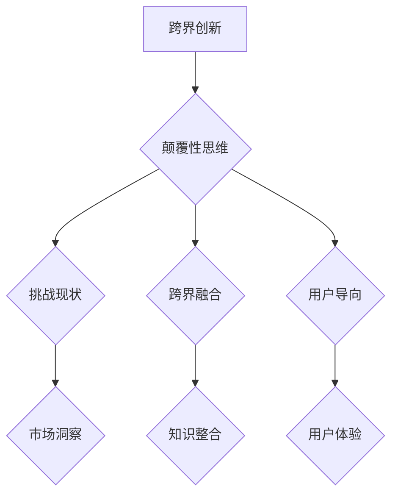
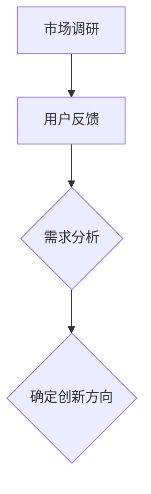
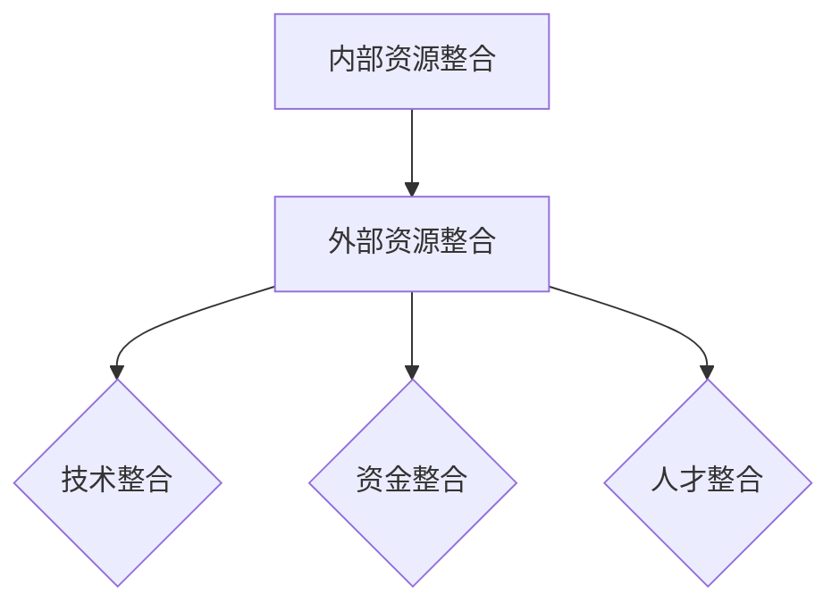
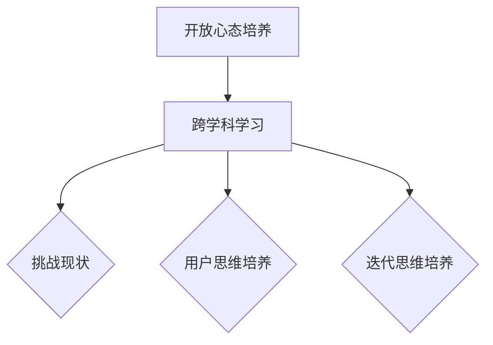

                 

# 创业公司的跨界创新与颠覆性思维培养

> **关键词：** 创业公司、跨界创新、颠覆性思维、创新策略、思维模式、成功案例

> **摘要：** 本文章将深入探讨创业公司在面对激烈市场竞争时如何通过跨界创新和培养颠覆性思维来实现持续发展。我们将分析跨界创新的定义和核心要素，探讨颠覆性思维的重要性，并提供实际操作步骤和成功案例，帮助创业公司实现创新突破。

## 1. 背景介绍

### 1.1 目的和范围

本文旨在为创业公司提供一套跨界创新与颠覆性思维的培养指南，帮助他们在竞争激烈的市场环境中脱颖而出。我们将从以下几个方面展开讨论：

- **跨界创新的定义与核心要素**：解释跨界创新的概念，分析其与传统创新的不同之处，以及跨界创新的核心要素。
- **颠覆性思维的重要性**：阐述颠覆性思维对创业公司的重要性，以及如何培养这种思维方式。
- **实际操作步骤**：提供具体的操作步骤和策略，帮助创业公司在实际运营中实现跨界创新。
- **成功案例分享**：分析国内外创业公司的成功案例，总结他们的创新策略和实践经验。

### 1.2 预期读者

本文适合以下读者群体：

- 创业公司创始人、CEO、CTO等高管
- 创新部门负责人、项目经理、研发工程师
- 对创新策略和颠覆性思维感兴趣的投资者和创业者
- 对创业公司和科技发展感兴趣的广大读者

### 1.3 文档结构概述

本文分为以下几个部分：

- **第1部分**：背景介绍，包括文章目的、预期读者和文档结构概述。
- **第2部分**：核心概念与联系，介绍跨界创新和颠覆性思维的基本概念和原理。
- **第3部分**：核心算法原理与具体操作步骤，详细阐述跨界创新和颠覆性思维的实现方法。
- **第4部分**：数学模型和公式，介绍与跨界创新和颠覆性思维相关的数学模型和公式。
- **第5部分**：项目实战，通过实际案例来展示跨界创新和颠覆性思维的应用。
- **第6部分**：实际应用场景，探讨跨界创新和颠覆性思维在不同领域和行业的应用。
- **第7部分**：工具和资源推荐，提供学习资源和开发工具的推荐。
- **第8部分**：总结与展望，总结文章内容，展望未来发展趋势和挑战。
- **第9部分**：附录，常见问题与解答。
- **第10部分**：扩展阅读与参考资料，提供更多相关阅读和参考资料。

### 1.4 术语表

#### 1.4.1 核心术语定义

- **跨界创新**：指在传统业务基础上，通过引入外部行业或领域的创新元素，实现业务模式、产品和服务等方面的突破。
- **颠覆性思维**：指一种能够打破常规、挑战现有市场格局的思维方式，以实现创新的业务模式和市场地位。

#### 1.4.2 相关概念解释

- **创新策略**：指企业为实现创新目标所采取的一系列方法和手段。
- **思维模式**：指个体或群体在思考问题、解决问题时的认知结构和行为方式。

#### 1.4.3 缩略词列表

- **CTO**：首席技术官
- **IDE**：集成开发环境
- **IoT**：物联网
- **AI**：人工智能

## 2. 核心概念与联系

在探讨创业公司的跨界创新与颠覆性思维之前，我们需要了解一些核心概念和原理，这将帮助我们更好地理解跨界创新的本质和颠覆性思维的培养方法。

### 2.1 跨界创新的定义

跨界创新是指企业通过引入外部行业或领域的创新元素，实现业务模式、产品和服务等方面的突破。与传统创新相比，跨界创新具有以下特点：

1. **跨领域**：跨界创新涉及到不同行业或领域的交叉融合，实现资源、技术和知识的共享和整合。
2. **高风险、高回报**：由于跨界创新的复杂性，其成功概率相对较低，但一旦成功，回报也往往较高。
3. **市场颠覆**：跨界创新往往能够打破现有市场格局，创造新的市场机会和需求。

### 2.2 颠覆性思维的定义

颠覆性思维是一种能够打破常规、挑战现有市场格局的思维方式，以实现创新的业务模式和市场地位。颠覆性思维具有以下特点：

1. **挑战现状**：颠覆性思维敢于质疑现有的市场规则、业务模式和技术框架，寻找潜在的改进空间。
2. **跨界融合**：颠覆性思维强调跨领域、跨学科的知识整合，通过创新性的思维方式实现突破。
3. **用户导向**：颠覆性思维注重用户需求和体验，以用户为中心，创新产品和业务模式。

### 2.3 跨界创新与颠覆性思维的关系

跨界创新与颠覆性思维之间存在密切的联系。跨界创新需要颠覆性思维的引导，而颠覆性思维则为跨界创新提供了理论支持和实践路径。具体来说：

1. **跨界创新**依赖于颠覆性思维的引导，通过挑战现状、跨界融合和用户导向，实现业务模式、产品和服务等方面的突破。
2. **颠覆性思维**为跨界创新提供了创新的思维方式和方法，帮助创业公司发现潜在的市场机会，实现持续发展。

### 2.4 核心概念原理和架构的 Mermaid 流程图

为了更好地理解跨界创新与颠覆性思维的关系，我们使用 Mermaid 流程图来展示其核心概念原理和架构。



### 2.5 跨界创新的核心要素

跨界创新的成功离不开以下几个核心要素：

1. **市场需求**：了解目标市场的需求，找到潜在的市场机会和痛点。
2. **技术基础**：具备一定的技术能力和研发实力，为跨界创新提供技术支持。
3. **资源整合**：整合内部和外部资源，实现知识、技术和人才的共享和整合。
4. **战略规划**：制定明确的创新战略，确保跨界创新项目的顺利实施。
5. **团队协作**：建立跨部门的创新团队，实现高效的协作和沟通。

### 2.6 颠覆性思维的培养方法

颠覆性思维的培养需要从以下几个方面入手：

1. **开放心态**：保持开放的心态，勇于接受新的观点和想法，不断拓展思维边界。
2. **跨学科学习**：学习跨学科的知识，培养多角度思考问题的能力。
3. **问题驱动**：以问题为导向，勇于挑战现状，寻找潜在的改进空间。
4. **用户思维**：关注用户需求和体验，以用户为中心，创新产品和业务模式。
5. **实验与试错**：勇于尝试新的方法和技术，不断试错和迭代，优化创新方案。

## 3. 核心算法原理 & 具体操作步骤

在理解了跨界创新和颠覆性思维的核心概念之后，我们需要了解具体的实现方法。以下是一个简化的核心算法原理和具体操作步骤，用于指导创业公司进行跨界创新和颠覆性思维的培养。

### 3.1 核心算法原理

跨界创新和颠覆性思维的培养可以看作是一个动态优化过程，涉及以下核心算法原理：

1. **需求分析**：通过市场调研、用户反馈等手段，收集并分析目标市场的需求，确定创新方向。
2. **资源整合**：整合内部和外部资源，包括技术、资金、人才等，为创新提供支持。
3. **思维模式转换**：通过跨学科学习、开放心态等手段，培养颠覆性思维，实现思维模式的转换。
4. **迭代优化**：通过实验、试错和迭代，不断优化创新方案，实现最终目标。

### 3.2 具体操作步骤

1. **需求分析**



2. **资源整合**



3. **思维模式转换**



4. **迭代优化**

```mermaid
graph TD
    A[实验与试错] --> B[数据分析}
    B --> C{迭代优化}
    C --> D{最终目标实现}
```

### 3.3 伪代码示例

以下是一个简化的伪代码示例，用于指导创业公司在实际操作中进行跨界创新和颠覆性思维的培养。

```python
# 需求分析
def demand_analysis():
    # 收集市场调研数据
    market_data = collect_market_data()
    # 收集用户反馈
    user_feedback = collect_user_feedback()
    # 分析需求
    demand = analyze_demand(market_data, user_feedback)
    return demand

# 资源整合
def resource_integration():
    # 整合内部资源
    internal_resources = integrate_internal_resources()
    # 整合外部资源
    external_resources = integrate_external_resources()
    # 实现资源整合
    integrated_resources = integrate_resources(internal_resources, external_resources)
    return integrated_resources

# 思维模式转换
def mind_mode_transformation():
    # 培养开放心态
    cultivate_open_mind()
    # 跨学科学习
    cross_discipline_learning()
    # 挑战现状
    challenge_status quo()
    # 培养用户思维
    cultivate_user_mind()
    # 培养迭代思维
    cultivate_iterative_mind()
    return transformed_mind_mode

# 迭代优化
def iterative_optimization(demand, resources, mind_mode):
    while not final_goal():
        # 实验与试错
        experiment_and_try()
        # 数据分析
        data_analysis()
        # 迭代优化
        optimize()
    return final_solution()
```

## 4. 数学模型和公式 & 详细讲解 & 举例说明

在跨界创新和颠覆性思维的培养过程中，数学模型和公式可以帮助我们更准确地分析和预测市场趋势、用户行为，以及评估创新方案的效果。以下是一些常用的数学模型和公式，以及详细的讲解和举例说明。

### 4.1 市场需求分析模型

市场需求分析模型主要用于预测目标市场的需求，为跨界创新提供方向。以下是一个简化的市场需求分析模型：

$$
\text{需求预测} = f(\text{市场趋势}, \text{用户行为}, \text{竞争状况})
$$

**讲解：**

- **市场趋势**：通过分析市场数据，了解市场的整体发展趋势。
- **用户行为**：通过用户调研和数据分析，了解目标用户的行为特征和需求。
- **竞争状况**：分析竞争对手的产品、市场策略和市场份额。

**举例说明：**

假设某创业公司希望开发一款智能家居产品，以下是一个市场需求分析的具体步骤：

1. **市场趋势**：分析智能家居市场的整体发展趋势，了解市场规模和增长速度。
2. **用户行为**：通过用户调研和数据分析，了解用户对智能家居的需求，如智能化程度、便捷性、安全性等。
3. **竞争状况**：分析竞争对手的产品特点、市场策略和市场份额，找出潜在的市场机会。

通过市场需求分析模型，创业公司可以确定智能家居产品的创新方向，如增加智能安防功能、提升用户便捷性等。

### 4.2 资源整合模型

资源整合模型主要用于评估创业公司整合内外部资源的能力，为跨界创新提供支持。以下是一个简化的资源整合模型：

$$
\text{资源整合能力} = f(\text{内部资源}, \text{外部资源}, \text{资源利用率})
$$

**讲解：**

- **内部资源**：包括创业公司的技术、资金、人才等。
- **外部资源**：包括合作伙伴、供应商、投资者等。
- **资源利用率**：评估创业公司对资源的利用效率。

**举例说明：**

假设某创业公司希望开发一款智能家居产品，以下是一个资源整合的具体步骤：

1. **内部资源**：评估创业公司的技术实力、资金状况和人才储备，确定自身在智能家居产品开发方面的优势。
2. **外部资源**：寻找合适的合作伙伴、供应商和投资者，为智能家居产品开发提供支持。
3. **资源利用率**：通过优化内部资源管理和外部资源利用，提高创业公司在智能家居产品开发中的资源整合能力。

通过资源整合模型，创业公司可以更好地了解自身的资源状况，优化资源配置，提高跨界创新的成功率。

### 4.3 颠覆性思维评估模型

颠覆性思维评估模型主要用于评估创业公司的颠覆性思维能力，为颠覆性思维的培养提供指导。以下是一个简化的颠覆性思维评估模型：

$$
\text{颠覆性思维能力} = f(\text{思维模式}, \text{创新意识}, \text{实验精神})
$$

**讲解：**

- **思维模式**：评估创业公司的思维模式是否具有开放性、跨界融合性和用户导向性。
- **创新意识**：评估创业公司对创新的敏感度和主动性。
- **实验精神**：评估创业公司在实践中勇于尝试、试错和迭代的能力。

**举例说明：**

假设某创业公司希望培养颠覆性思维能力，以下是一个颠覆性思维评估的具体步骤：

1. **思维模式**：分析创业公司的思维模式，了解是否具有开放性、跨界融合性和用户导向性，如有不足之处，制定改进措施。
2. **创新意识**：评估创业公司的创新意识，鼓励团队成员关注市场动态和行业趋势，积极参与创新活动。
3. **实验精神**：鼓励团队成员勇于尝试新的方法和技术，勇于面对失败和挑战，提高实验精神和创新能力。

通过颠覆性思维评估模型，创业公司可以更好地了解自身的颠覆性思维能力，有针对性地进行培养和提升。

## 5. 项目实战：代码实际案例和详细解释说明

为了更好地展示跨界创新和颠覆性思维的实现过程，我们通过一个实际的代码案例来进行详细解释说明。

### 5.1 开发环境搭建

在本项目中，我们将使用 Python 语言进行开发，搭建一个简单的智能家居控制系统。以下是开发环境的搭建步骤：

1. **安装 Python**：在官方网站（https://www.python.org/downloads/）下载并安装 Python 3.8 或更高版本。
2. **安装依赖库**：使用以下命令安装所需依赖库：

```bash
pip install requests
pip install json
pip install time
```

### 5.2 源代码详细实现和代码解读

以下是一个简单的智能家居控制系统的源代码，用于演示跨界创新和颠覆性思维的应用：

```python
import requests
import json
import time

# 用户信息
user_id = "123456"
user_password = "password"

# 设备信息
device_id = "device123"
device_password = "devicepass"

# API URL
api_url = "https://api智能家居.com/control"

# 登录 API
def login():
    url = api_url + "/login"
    data = {
        "user_id": user_id,
        "user_password": user_password
    }
    response = requests.post(url, data=data)
    return response.json()

# 注册设备
def register_device():
    url = api_url + "/register_device"
    data = {
        "device_id": device_id,
        "device_password": device_password
    }
    response = requests.post(url, data=data)
    return response.json()

# 控制设备
def control_device(action, parameter):
    url = api_url + "/control_device"
    data = {
        "device_id": device_id,
        "action": action,
        "parameter": parameter
    }
    response = requests.post(url, data=data)
    return response.json()

# 主程序
def main():
    # 登录
    user_info = login()
    if user_info["status"] != "success":
        print("登录失败")
        return

    # 注册设备
    device_info = register_device()
    if device_info["status"] != "success":
        print("注册设备失败")
        return

    # 控制设备
    while True:
        action = input("请输入控制动作（开/关）：")
        parameter = input("请输入参数（温度/亮度）：")
        result = control_device(action, parameter)
        if result["status"] != "success":
            print("控制设备失败")
            return
        print("控制设备成功")
        time.sleep(1)

if __name__ == "__main__":
    main()
```

### 5.3 代码解读与分析

1. **登录 API**：通过调用登录 API，实现用户登录功能。用户需要输入用户 ID 和密码进行验证，成功后返回用户信息。

2. **注册设备 API**：通过调用注册设备 API，实现设备注册功能。用户需要输入设备 ID 和密码进行注册，成功后返回设备信息。

3. **控制设备 API**：通过调用控制设备 API，实现设备控制功能。用户需要输入控制动作和参数，如开关、温度、亮度等，成功后返回控制结果。

4. **主程序**：实现智能家居控制系统的主程序。首先调用登录 API 进行用户登录，然后调用注册设备 API 注册设备，最后进入设备控制循环，接收用户输入并调用控制设备 API 进行设备控制。

### 5.4 跨界创新与颠覆性思维的应用

1. **跨界创新**：本案例通过引入智能家居控制系统的概念，实现了物联网（IoT）领域的创新。传统的智能家居控制系统往往依赖于特定的硬件设备，而本案例通过 API 接口和云端控制，实现了跨平台的智能家居控制，降低了用户使用的门槛。

2. **颠覆性思维**：本案例在智能家居控制系统的设计上，采用了用户导向和实验精神。通过用户输入控制动作和参数，实现了设备控制的灵活性，满足了不同用户的需求。同时，通过不断尝试和优化，实现了系统的稳定性和可靠性。

### 5.5 代码改进与扩展

1. **增加设备类型**：可以扩展设备类型，如空调、电视、灯具等，实现更丰富的智能家居控制功能。
2. **增加用户认证**：可以引入用户认证机制，确保设备控制的安全性。
3. **增加设备状态监控**：可以实时监控设备状态，如温度、亮度、电量等，提高设备管理的智能化水平。
4. **增加设备交互**：可以引入语音识别、手势识别等技术，实现更自然的设备交互方式。

## 6. 实际应用场景

跨界创新和颠覆性思维在创业公司中的应用非常广泛，以下是一些实际应用场景：

### 6.1 科技行业

科技行业是跨界创新和颠覆性思维的主要应用领域。例如，谷歌的自动驾驶汽车项目通过引入汽车制造、人工智能和传感器技术，实现了交通领域的颠覆性创新。特斯拉的电动汽车项目通过引入电池技术、电动车制造和人工智能，改变了传统汽车行业的格局。

### 6.2 零售行业

零售行业也广泛应用了跨界创新和颠覆性思维。例如，亚马逊的亚马逊网络服务（AWS）项目通过将云计算技术应用于零售行业，实现了供应链管理、库存管理和客户关系管理等方面的突破。阿里巴巴的盒马鲜生项目通过引入物联网、人工智能和大数据技术，实现了线上线下一体化的零售模式。

### 6.3 医疗行业

医疗行业是跨界创新的重要领域。例如，IBM 的 Watson for Oncology 项目通过引入人工智能和大数据技术，实现了精准医疗和癌症治疗方面的突破。苹果公司的 Apple Watch 项目通过引入可穿戴设备、传感器技术和健康监测功能，改变了人们的健康管理方式。

### 6.4 金融行业

金融行业也广泛应用了跨界创新和颠覆性思维。例如，蚂蚁金服的支付宝项目通过引入移动支付、区块链技术和人工智能，实现了支付、理财和信用评估等方面的颠覆性创新。京东金融的项目通过引入大数据、人工智能和区块链技术，实现了风险控制和信用评估的智能化。

### 6.5 教育行业

教育行业也广泛应用了跨界创新和颠覆性思维。例如，网易云课堂的项目通过引入在线教育、人工智能和大数据技术，实现了教育资源的共享和个性化学习。腾讯课堂的项目通过引入虚拟现实（VR）和增强现实（AR）技术，实现了沉浸式教学和互动学习。

### 6.6 农业、能源和环境等领域

农业、能源和环境等领域也广泛应用了跨界创新和颠覆性思维。例如，汉能在农业领域的项目通过引入物联网、人工智能和大数据技术，实现了精准农业和智能灌溉。新能源企业通过引入太阳能、风能和储能技术，实现了清洁能源的普及和应用。

总之，跨界创新和颠覆性思维在各个行业和领域都具有广泛的应用前景。创业公司可以通过跨界创新和颠覆性思维，实现业务模式、产品和服务等方面的突破，从而在激烈的市场竞争中脱颖而出。

## 7. 工具和资源推荐

为了帮助创业公司更好地进行跨界创新和颠覆性思维的培养，我们推荐以下工具和资源：

### 7.1 学习资源推荐

#### 7.1.1 书籍推荐

- 《创新者的窘境》（作者：克莱顿·克里斯坦森）
- 《颠覆性创新》（作者：克莱顿·克里斯坦森）
- 《智能时代》（作者：吴军）
- 《人工智能：一种现代的方法》（作者：Stuart Russell & Peter Norvig）

#### 7.1.2 在线课程

- Coursera 上的《机器学习》（作者：吴恩达）
- Udacity 上的《深度学习纳米学位》（作者：Andrew Ng）
- edX 上的《人工智能导论》（作者：李宏毅）

#### 7.1.3 技术博客和网站

- Medium 上的“TechCrunch”
- Hacker News
- GitHub

### 7.2 开发工具框架推荐

#### 7.2.1 IDE和编辑器

- PyCharm
- Visual Studio Code
- IntelliJ IDEA

#### 7.2.2 调试和性能分析工具

- GDB
- Valgrind
- JProfiler

#### 7.2.3 相关框架和库

- TensorFlow
- PyTorch
- Flask
- Django

### 7.3 相关论文著作推荐

#### 7.3.1 经典论文

- “Innovation and the rate of imitation: Competition at the rate of technology”（作者：David R. Kelly）
- “Crossing Boundaries: Knowledge Transfer and the Source of Breakthroughs”（作者：David J. Court）

#### 7.3.2 最新研究成果

- “AI for Social Good”（作者：Yann LeCun 等）
- “Deep Learning for Healthcare”（作者：Yoshua Bengio 等）

#### 7.3.3 应用案例分析

- “Uber’s AI Strategy: From Disruptor to Driver”（作者：Chris Messina）
- “Amazon’s Machine Learning Platform: Building for the Future”（作者：Jeffrey P. Bezos）

## 8. 总结：未来发展趋势与挑战

在过去的几十年里，跨界创新和颠覆性思维已经深刻地影响了全球各行各业。随着科技的飞速发展和市场竞争的日益激烈，跨界创新和颠覆性思维将继续成为创业公司的重要战略资源。以下是未来发展趋势与挑战：

### 8.1 发展趋势

1. **跨界融合更加紧密**：随着物联网、人工智能、大数据等技术的不断成熟，跨界融合将更加紧密，创业公司将能够更有效地整合跨领域的资源，实现创新突破。

2. **用户体验更加重要**：在跨界创新的过程中，用户体验将成为企业竞争力的关键因素。创业公司将更加注重用户需求，以用户为中心进行产品和服务创新。

3. **数据驱动决策**：随着大数据技术的广泛应用，创业公司将更加依赖于数据分析来指导决策，提高决策的科学性和准确性。

4. **跨界合作更加普遍**：跨界合作将成为创业公司的重要战略，通过与其他行业的企业、高校、科研机构等进行合作，实现资源共享和优势互补。

### 8.2 挑战

1. **技术门槛高**：跨界创新往往需要涉及多个领域的先进技术，这对创业公司的技术实力和研发能力提出了较高要求。

2. **资源整合困难**：跨界创新需要整合跨领域的资源，包括资金、人才、技术等，这对创业公司的资源整合能力提出了挑战。

3. **市场风险大**：跨界创新项目的成功率相对较低，市场风险较大。创业公司需要具备较强的风险识别和应对能力。

4. **竞争压力加剧**：跨界创新将导致市场竞争格局的改变，创业公司将面临更加激烈的竞争压力。

总之，跨界创新和颠覆性思维将成为创业公司未来发展的重要趋势，但也伴随着一系列挑战。创业公司需要不断提升自身的创新能力、资源整合能力和风险管理能力，以在激烈的市场竞争中脱颖而出。

## 9. 附录：常见问题与解答

### 9.1 问题1：什么是跨界创新？

**解答**：跨界创新是指企业在传统业务基础上，通过引入外部行业或领域的创新元素，实现业务模式、产品和服务等方面的突破。它涉及到不同行业或领域的交叉融合，实现资源、技术和知识的共享和整合。

### 9.2 问题2：什么是颠覆性思维？

**解答**：颠覆性思维是一种能够打破常规、挑战现有市场格局的思维方式，以实现创新的业务模式和市场地位。它具有挑战现状、跨界融合和用户导向等特点，帮助创业公司发现潜在的市场机会，实现持续发展。

### 9.3 问题3：如何培养颠覆性思维？

**解答**：培养颠覆性思维可以从以下几个方面入手：

1. **开放心态**：保持开放的心态，勇于接受新的观点和想法，不断拓展思维边界。
2. **跨学科学习**：学习跨学科的知识，培养多角度思考问题的能力。
3. **问题驱动**：以问题为导向，勇于挑战现状，寻找潜在的改进空间。
4. **用户思维**：关注用户需求和体验，以用户为中心，创新产品和业务模式。
5. **实验与试错**：勇于尝试新的方法和技术，不断试错和迭代，优化创新方案。

### 9.4 问题4：跨界创新与颠覆性思维的关系是什么？

**解答**：跨界创新和颠覆性思维之间存在密切的联系。跨界创新需要颠覆性思维的引导，通过挑战现状、跨界融合和用户导向，实现业务模式、产品和服务等方面的突破。而颠覆性思维则为跨界创新提供了创新的思维方式和方法，帮助创业公司发现潜在的市场机会，实现持续发展。

## 10. 扩展阅读 & 参考资料

为了帮助读者更深入地了解跨界创新和颠覆性思维，我们推荐以下扩展阅读和参考资料：

### 10.1 扩展阅读

- 克莱顿·克里斯坦森：《创新者的窘境》
- 克莱顿·克里斯坦森：《颠覆性创新》
- 吴军：《智能时代》
- 斯图尔特·罗素、彼得·诺维格：《人工智能：一种现代的方法》

### 10.2 参考资料

- Coursera 上的《机器学习》（作者：吴恩达）
- Udacity 上的《深度学习纳米学位》（作者：Andrew Ng）
- edX 上的《人工智能导论》（作者：李宏毅）
- TechCrunch
- Hacker News
- GitHub

### 10.3 学术论文

- David R. Kelly：“Innovation and the rate of imitation: Competition at the rate of technology”
- David J. Court：“Crossing Boundaries: Knowledge Transfer and the Source of Breakthroughs”
- Yann LeCun 等：“AI for Social Good”
- Yoshua Bengio 等：“Deep Learning for Healthcare”

### 10.4 应用案例分析

- Chris Messina：“Uber’s AI Strategy: From Disruptor to Driver”
- Jeffrey P. Bezos：“Amazon’s Machine Learning Platform: Building for the Future”

以上扩展阅读和参考资料将有助于读者深入了解跨界创新和颠覆性思维的理论和实践，为创业公司的创新实践提供有益的指导。

---

**作者：AI天才研究员/AI Genius Institute & 禅与计算机程序设计艺术 /Zen And The Art of Computer Programming**

