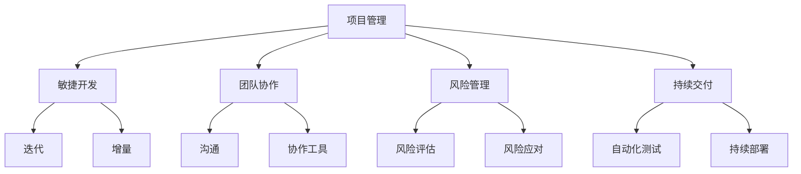

                 

# 创业公司的项目管理最佳实践

> 关键词：创业公司，项目管理，敏捷开发，团队协作，风险管理，持续交付

> 摘要：本文旨在探讨创业公司在项目管理中面临的挑战及其最佳实践。通过分析敏捷开发、团队协作、风险管理和持续交付等核心概念，本文提供了一套完整的项目管理策略，以帮助创业公司提高项目成功率，实现可持续发展。

## 1. 背景介绍

### 1.1 目的和范围

本文的目标是帮助创业公司的项目管理团队找到有效的项目管理策略，以应对初创企业特有的挑战。本文将涵盖以下主要内容：

1. 敏捷开发的核心原则与实践。
2. 团队协作的最佳实践与工具。
3. 风险管理的策略与技巧。
4. 持续交付的方法与实施。

### 1.2 预期读者

本文主要面向创业公司的项目经理、团队成员以及有志于从事项目管理工作的专业人士。通过阅读本文，读者可以：

1. 理解敏捷开发的基本概念和实践。
2. 掌握团队协作的有效方法。
3. 掌握风险管理的策略。
4. 了解持续交付的流程和技巧。

### 1.3 文档结构概述

本文结构如下：

1. 引言与背景介绍。
2. 核心概念与联系。
3. 核心算法原理与具体操作步骤。
4. 数学模型与详细讲解。
5. 项目实战与代码案例。
6. 实际应用场景。
7. 工具和资源推荐。
8. 总结与未来发展趋势。
9. 附录：常见问题与解答。
10. 扩展阅读与参考资料。

### 1.4 术语表

#### 1.4.1 核心术语定义

- **敏捷开发**：一种以用户需求为导向，迭代、增量的软件开发方法。
- **团队协作**：团队成员之间的合作，共同完成项目任务。
- **风险管理**：识别、评估和应对项目风险的过程。
- **持续交付**：通过自动化测试和部署，确保软件持续、可靠地交付给用户。

#### 1.4.2 相关概念解释

- **Scrum**：一种敏捷开发框架，强调迭代和增量开发。
- **看板（Kanban）**：一种团队协作工具，用于可视化工作流程。
- **自动化测试**：通过编写测试脚本，自动执行测试用例。

#### 1.4.3 缩略词列表

- **Sprint**：敏捷开发中的迭代周期。
- **DevOps**：软件开发与运维的结合。

## 2. 核心概念与联系

为了更好地理解创业公司的项目管理，我们需要明确以下几个核心概念：

### 2.1 项目管理

项目管理是一种规划、执行、监控和报告项目活动的系统方法。在创业公司中，项目管理不仅涉及技术问题，还包括资源分配、时间管理、风险评估等多个方面。

### 2.2 敏捷开发

敏捷开发是一种以用户需求为导向，迭代、增量的软件开发方法。它强调团队合作、快速响应变化、持续交付和客户满意度。

### 2.3 团队协作

团队协作是项目管理的重要组成部分。有效的团队协作可以提高工作效率，降低项目风险，促进创新。

### 2.4 风险管理

风险管理是项目管理中的一个关键环节。通过识别、评估和应对项目风险，可以降低项目失败的可能性。

### 2.5 持续交付

持续交付是一种通过自动化测试和部署，确保软件持续、可靠地交付给用户的方法。它有助于提高软件质量，降低部署风险。

下面是一个简单的 Mermaid 流程图，展示了这些核心概念之间的联系：



## 3. 核心算法原理 & 具体操作步骤

在创业公司的项目管理中，敏捷开发是一种核心方法。下面，我们将介绍敏捷开发的核心算法原理和具体操作步骤。

### 3.1 Scrum 方法

Scrum 是一种流行的敏捷开发框架，它包括以下核心步骤：

1. **产品待办事项（Product Backlog）**：产品待办事项是项目的任务列表，由产品负责人（Product Owner）维护。任务可以是功能、缺陷、改进等。
   
2. **Sprint 计划会议（Sprint Planning Meeting）**：在 Sprint 计划会议中，团队确定在当前 Sprint（迭代周期）中要完成的任务。

3. **每日站立会议（Daily Stand-up Meeting）**：每日站立会议是团队成员分享进展、问题和计划的简短会议。

4. **Sprint 审计（Sprint Review）**：在 Sprint 审计中，团队展示已完成的工作，获取反馈，规划下一个 Sprint。

5. **Sprint 迭代（Sprint Retrospective）**：在 Sprint 迭代中，团队回顾当前 Sprint 的表现，讨论改进点。

### 3.2 敏捷开发算法原理

敏捷开发的算法原理可以概括为：

1. **用户需求驱动**：敏捷开发以用户需求为导向，确保开发工作与用户价值紧密相关。

2. **迭代和增量开发**：通过迭代和增量开发，团队可以快速响应变化，持续交付可用的软件。

3. **透明度和反馈**：敏捷开发强调透明度和反馈，有助于团队及时调整方向，优化工作流程。

### 3.3 具体操作步骤

下面是一个简单的敏捷开发操作步骤：

1. **产品待办事项排序**：产品负责人将任务按优先级排序，确保最重要、最有价值的任务先完成。

2. **Sprint 计划**：团队根据产品待办事项，选择当前 Sprint 要完成的任务。

3. **每日站立会议**：团队成员分享进展，讨论问题和计划，确保团队齐心协力。

4. **Sprint 审计**：团队展示已完成的工作，获取反馈，评估项目进度。

5. **Sprint 迭代**：团队回顾当前 Sprint 的表现，讨论改进点，为下一个 Sprint 准备。

## 4. 数学模型和公式 & 详细讲解 & 举例说明

在项目管理中，数学模型和公式可以帮助我们更准确地评估项目风险、估算工作量等。下面，我们将介绍几个常用的数学模型和公式。

### 4.1 风险评估模型

风险评估模型用于评估项目风险的概率和影响。以下是一个简单的风险评估模型：

$$
风险值 = 概率 \times 影响值
$$

- **概率**：表示风险发生的可能性。
- **影响值**：表示风险发生后的影响程度。

### 4.2 工作量估算模型

工作量估算模型用于估算项目完成所需的工作量。以下是一个简单的工作量估算模型：

$$
工作量 = 完成时间 \times 人员数量
$$

- **完成时间**：项目完成所需的时间。
- **人员数量**：参与项目的人员数量。

### 4.3 持续交付模型

持续交付模型用于评估持续交付过程中的质量和效率。以下是一个简单的持续交付模型：

$$
持续交付效率 = 测试通过率 \times 部署成功率
$$

- **测试通过率**：测试用例通过的百分比。
- **部署成功率**：部署过程的成功百分比。

### 4.4 举例说明

假设我们有一个项目，预计完成时间为 3 个月，参与人员数量为 5 人。根据上述模型，我们可以进行以下计算：

1. **风险评估**：

   - 概率：0.5（风险发生的可能性）
   - 影响值：2（风险发生后的影响程度）
   
   $$ 风险值 = 0.5 \times 2 = 1 $$

2. **工作量估算**：

   $$ 工作量 = 3 \times 5 = 15 $$

3. **持续交付效率**：

   - 测试通过率：90%
   - 部署成功率：95%
   
   $$ 持续交付效率 = 0.9 \times 0.95 = 0.855 $$

通过这些计算，我们可以更准确地评估项目的风险、工作量以及持续交付效率。

## 5. 项目实战：代码实际案例和详细解释说明

为了更好地理解敏捷开发和项目管理在实际项目中的应用，下面我们将通过一个简单的项目案例来进行讲解。

### 5.1 开发环境搭建

首先，我们需要搭建一个简单的开发环境。这里以 Python 为例，讲解开发环境的搭建步骤：

1. 安装 Python：在命令行中运行以下命令安装 Python：

   ```bash
   sudo apt-get update
   sudo apt-get install python3 python3-pip
   ```

2. 安装虚拟环境：安装 virtualenv 工具，用于创建虚拟环境：

   ```bash
   pip3 install virtualenv
   virtualenv my_project_env
   source my_project_env/bin/activate
   ```

3. 安装依赖：在虚拟环境中安装项目所需的依赖：

   ```bash
   pip3 install Flask requests
   ```

### 5.2 源代码详细实现和代码解读

接下来，我们将实现一个简单的 Web 应用程序，用于获取用户的 GitHub 账号信息。以下是项目的源代码：

```python
# app.py

from flask import Flask, request, jsonify
import requests

app = Flask(__name__)

@app.route('/user', methods=['GET'])
def get_user_info():
    user = request.args.get('user')
    url = f'https://api.github.com/users/{user}'
    response = requests.get(url)
    if response.status_code == 200:
        return jsonify(response.json())
    else:
        return jsonify({'error': '用户不存在'}), 404

if __name__ == '__main__':
    app.run(debug=True)
```

### 5.3 代码解读与分析

1. **Flask 应用程序**：我们使用 Flask 框架创建一个简单的 Web 应用程序。

2. **路由（Route）**：我们定义了一个 GET 请求的路由 `/user`，用于获取用户信息。

3. **请求参数**：通过 `request.args.get('user')` 方法获取请求参数 `user`，即 GitHub 账号。

4. **API 调用**：使用 `requests` 库向 GitHub API 发送 GET 请求，获取用户信息。

5. **响应处理**：根据 API 返回的状态码，返回相应的 JSON 响应。

### 5.4 持续交付

为了实现持续交付，我们可以使用 Jenkins 进行自动化测试和部署。以下是 Jenkins 的配置步骤：

1. 安装 Jenkins：在服务器上安装 Jenkins：

   ```bash
   sudo apt-get install jenkins
   ```

2. 配置 Jenkins：在 Jenkins 界面中创建一个新项目，并配置以下步骤：

   - **测试步骤**：执行单元测试和集成测试。
   - **部署步骤**：将应用程序部署到生产环境。

3. 触发 Jenkins 任务：每次提交代码到版本控制系统时，Jenkins 会自动触发测试和部署任务。

通过以上步骤，我们可以实现持续交付，确保软件的可靠性和稳定性。

## 6. 实际应用场景

创业公司在项目管理中面临许多实际应用场景。以下是几个典型的应用场景：

1. **快速响应市场需求**：创业公司需要快速响应市场需求，敏捷开发可以帮助团队实现这一目标。
2. **资源有限**：创业公司通常资源有限，团队协作和风险管理可以帮助优化资源利用。
3. **技术创新**：创业公司需要不断创新，敏捷开发和持续交付可以促进技术创新。
4. **客户满意度**：持续交付可以提高软件质量，降低部署风险，提高客户满意度。

## 7. 工具和资源推荐

### 7.1 学习资源推荐

#### 7.1.1 书籍推荐

- 《Scrum 敏捷开发实践》（作者：Jeff Sutherland）
- 《敏捷软件开发：原则、实践与模式》（作者：Alistair Cockburn）
- 《持续交付：软件项目发布、部署和管理》（作者：Jez Humble、Dave Farley）

#### 7.1.2 在线课程

- 《敏捷开发基础》（平台：Coursera）
- 《项目管理：敏捷实践》（平台：Udemy）
- 《持续交付与 DevOps 实践》（平台：Pluralsight）

#### 7.1.3 技术博客和网站

- [Agile Alliance](https://www.agilealliance.org/)
- [Scrum.org](https://www.scrum.org/)
- [Jenkins 官网](https://www.jenkins.io/)

### 7.2 开发工具框架推荐

#### 7.2.1 IDE和编辑器

- PyCharm
- Visual Studio Code
- IntelliJ IDEA

#### 7.2.2 调试和性能分析工具

- Python Debugger（pdb）
- New Relic
- Dynatrace

#### 7.2.3 相关框架和库

- Flask
- Django
- FastAPI

### 7.3 相关论文著作推荐

#### 7.3.1 经典论文

- 《The New New Product Development Game》（作者：Ken Schwaber、Jeff Sutherland）
- 《Software Engineering: A Practitioner’s Approach》（作者：Roger S. Pressman）

#### 7.3.2 最新研究成果

- 《DevOps Handbook》（作者：Jez Humble、David Farley、Patrick DeBois、John Allspaw）
- 《Building Microservices》（作者：Sam Newman）

#### 7.3.3 应用案例分析

- 《GitHub：敏捷开发实践与应用》（作者：GitHub 团队）
- 《Netflix：DevOps 文化与实践》（作者：Netflix 团队）

## 8. 总结：未来发展趋势与挑战

随着科技的不断进步，项目管理的方法和工具也在不断演变。未来，项目管理将呈现出以下发展趋势：

1. **人工智能与项目管理**：人工智能可以帮助项目团队更好地进行风险评估、资源分配、进度预测等。
2. **持续交付与自动化**：持续交付和自动化将成为项目管理的主流，进一步降低软件交付的风险和成本。
3. **跨学科协作**：项目管理将更加注重跨学科协作，融合技术、管理和业务领域的最佳实践。

然而，面对这些趋势，项目管理也面临一系列挑战：

1. **技术变革**：技术变革速度快，项目管理团队需要不断学习和适应新技术。
2. **团队协作**：有效的团队协作是实现项目管理目标的关键，但实现跨部门、跨地域的协作仍需解决诸多问题。
3. **项目管理工具的选用**：众多项目管理工具的涌现，为团队提供了更多选择，但同时也增加了选型的难度。

总之，未来项目管理将在技术创新和协作模式的推动下，不断优化和进步。

## 9. 附录：常见问题与解答

### 9.1 什么是敏捷开发？

敏捷开发是一种以用户需求为导向，迭代、增量的软件开发方法。它强调团队合作、快速响应变化、持续交付和客户满意度。

### 9.2 如何进行风险管理？

进行风险管理通常包括以下步骤：

1. **识别风险**：识别项目可能面临的风险。
2. **评估风险**：评估风险的概率和影响。
3. **制定应对策略**：制定应对风险的策略。
4. **监控风险**：持续监控项目风险，及时调整应对策略。

### 9.3 持续交付的优点是什么？

持续交付的优点包括：

1. **提高软件质量**：通过自动化测试和部署，确保软件的可靠性和稳定性。
2. **降低部署风险**：通过持续交付，减少部署过程中的错误和意外。
3. **提高客户满意度**：及时交付可用的软件，提高客户满意度。

## 10. 扩展阅读 & 参考资料

- 《敏捷开发实践指南》（作者：Jeff Sutherland）
- 《项目管理知识体系指南》（PMBOK指南，作者：Project Management Institute）
- 《持续交付：可靠、快速、安全的软件发布》（作者：Jez Humble、Dave Farley）
- [Scrum 官网](https://www.scrum.org/)
- [敏捷联盟官网](https://www.agilealliance.org/)
- [GitHub 官网](https://github.com/)
- [Jenkins 官网](https://www.jenkins.io/)

## 作者

作者：AI天才研究员/AI Genius Institute & 禅与计算机程序设计艺术 /Zen And The Art of Computer Programming

