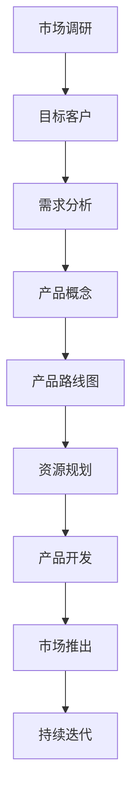

                 

# 创业初期如何制定有效的产品路线图

> **关键词：** 产品路线图、创业策略、市场调研、目标客户、里程碑、资源规划

> **摘要：** 本文将深入探讨创业初期如何制定一个有效的产品路线图。我们将从核心概念出发，通过理论讲解、实际操作步骤、数学模型和项目实战等多个角度，帮助读者理解并掌握这一关键技能。文章结构清晰，旨在为创业者和产品经理提供实用的指导。

## 1. 背景介绍

### 1.1 目的和范围

在创业初期，制定一个有效的产品路线图是至关重要的。本文旨在帮助创业者明确产品路线图的重要性，并提供一个系统化的方法来构建和优化产品路线图。我们将讨论以下几个方面：

1. **产品路线图的基本概念和核心内容**：了解产品路线图的基础知识，包括其目的、组成部分和重要性。
2. **如何进行市场调研和需求分析**：确定目标客户和市场需求，为产品路线图的制定提供依据。
3. **产品路线图的制定步骤和流程**：从需求分析到资源规划，详细讲解每个步骤的操作方法和注意事项。
4. **数学模型和公式在产品路线图中的应用**：使用数学工具来优化产品路线图，提高其准确性和可行性。
5. **项目实战：代码实际案例和详细解释说明**：通过实际项目案例，展示产品路线图的应用和实践。

### 1.2 预期读者

本文主要面向以下两类读者：

1. **创业者和初创团队**：对创业过程有初步了解，但需要更深入的指导来制定有效的产品路线图。
2. **产品经理和产品设计师**：负责产品开发和路线图制定，希望提升产品管理和规划能力。

### 1.3 文档结构概述

本文结构如下：

1. **背景介绍**：介绍本文的目的、范围、预期读者和文档结构。
2. **核心概念与联系**：讲解产品路线图的基本概念，并提供Mermaid流程图。
3. **核心算法原理 & 具体操作步骤**：使用伪代码详细阐述产品路线图的制定过程。
4. **数学模型和公式 & 详细讲解 & 举例说明**：介绍数学模型和公式，并提供实际案例说明。
5. **项目实战：代码实际案例和详细解释说明**：通过实际项目案例展示产品路线图的应用。
6. **实际应用场景**：探讨产品路线图在不同行业和领域的应用。
7. **工具和资源推荐**：推荐学习资源、开发工具和框架。
8. **总结：未来发展趋势与挑战**：总结本文的核心内容，探讨未来趋势和挑战。
9. **附录：常见问题与解答**：回答读者可能遇到的问题。
10. **扩展阅读 & 参考资料**：提供进一步的阅读材料和资源。

### 1.4 术语表

#### 1.4.1 核心术语定义

- **产品路线图**：用于指导产品从构思到市场推出的详细计划。
- **市场调研**：对目标市场的分析，以了解客户需求、竞争状况和潜在机会。
- **目标客户**：产品路线图中确定的最终用户群体。
- **里程碑**：产品开发过程中设定的关键节点，用于衡量进度和成果。
- **资源规划**：确保产品路线图实施所需资源的有效分配。

#### 1.4.2 相关概念解释

- **敏捷开发**：一种灵活的产品开发方法，强调快速迭代和持续交付。
- **产品管理**：负责产品战略、规划和执行的管理职能。
- **市场细分**：将市场划分为具有相似需求和特征的子市场。

#### 1.4.3 缩略词列表

- **PMF**：Product-Market Fit（产品市场匹配）
- **ROI**：Return on Investment（投资回报率）
- **KPI**：Key Performance Indicator（关键绩效指标）

## 2. 核心概念与联系

在制定产品路线图之前，我们需要了解几个核心概念和它们之间的联系。以下是一个简化的Mermaid流程图，用于描述这些概念之间的关系。



### 2.1 市场调研

市场调研是产品路线图制定的第一步，它帮助创业者了解目标市场的现状、趋势和机会。通过市场调研，我们可以获取以下信息：

- **市场容量**：市场的总体规模和潜力。
- **目标客户**：潜在客户的特征和需求。
- **竞争状况**：主要竞争对手的产品、市场占有率和策略。
- **潜在机会**：市场中的新机会和潜在的业务领域。

### 2.2 目标客户

确定目标客户是产品路线图制定的关键。目标客户应具备以下特征：

- **需求明确**：目标客户对产品的需求是明确和具体的。
- **规模适中**：目标客户的规模应适中，便于产品和服务的推广。
- **可接触性**：目标客户应是可接触和沟通的。

### 2.3 需求分析

需求分析是基于市场调研和目标客户分析的结果，对产品需求的进一步细化。需求分析应包括以下内容：

- **功能需求**：产品应具备的功能和特性。
- **性能需求**：产品性能指标和标准。
- **用户体验**：用户与产品交互的体验和感受。

### 2.4 产品概念

产品概念是指对产品的初步设想和描述，它通常包括产品的核心功能、目标市场和竞争优势。产品概念应基于需求分析，同时考虑市场需求和竞争环境。

### 2.5 产品路线图

产品路线图是将产品从概念到市场推出的详细计划。它通常包括以下内容：

- **里程碑**：产品开发过程中的关键节点，用于衡量进度和成果。
- **时间表**：产品开发的时间安排和计划。
- **资源分配**：产品开发所需的资源，包括人力、资金和设备。

### 2.6 资源规划

资源规划是确保产品路线图实施所需资源的有效分配。资源规划应考虑以下因素：

- **人力资源**：项目团队的组织结构和人员配置。
- **资金预算**：项目的资金需求和资金流动。
- **设备资源**：项目所需的硬件和软件设备。

## 3. 核心算法原理 & 具体操作步骤

在制定产品路线图的过程中，核心算法原理和具体操作步骤起着至关重要的作用。以下是一个详细的伪代码，用于阐述产品路线图的制定过程。

```python
# 产品路线图制定伪代码

# 步骤1：市场调研
def market_research():
    # 收集市场数据
    market_data = collect_market_data()
    # 分析市场趋势和机会
    analyze_market_trends(market_data)
    # 确定目标客户
    target_customers = identify_target_customers(market_data)

# 步骤2：需求分析
def requirement_analysis():
    # 收集客户需求
    customer_requirements = collect_customer_requirements(target_customers)
    # 分析需求
    analyze_requirements(customer_requirements)
    # 确定产品功能
    product_functions = define_product_functions()

# 步骤3：产品概念
def product_concept():
    # 基于需求分析确定产品概念
    product_concept = create_product_concept(product_functions)
    # 确定目标市场和竞争优势
    target_market = determine_target_market(product_concept)
    competitive_advantage = determine_competitive_advantage(product_concept)

# 步骤4：制定产品路线图
def product_routing_map():
    # 确定里程碑和时间表
    milestones = define_milestones()
    timeline = define_timeline(milestones)
    # 确定资源分配
    resource_allocation = define_resource_allocation()
    # 创建产品路线图
    product_routing_map = create_product_routing_map(timeline, resource_allocation)

# 步骤5：资源规划
def resource_planning():
    # 优化人力资源
    optimize_human_resources(resource_allocation)
    # 优化资金预算
    optimize_funding_budget(resource_allocation)
    # 优化设备资源
    optimize_equipment_resources(resource_allocation)

# 主函数
def main():
    market_research()
    requirement_analysis()
    product_concept()
    product_routing_map()
    resource_planning()
    # 实施产品路线图
    implement_product_routing_map(product_routing_map())

# 调用主函数
main()
```

### 3.1 市场调研

市场调研是产品路线图制定的第一步。以下是市场调研的伪代码：

```python
def market_research():
    market_data = collect_market_data()
    analyze_market_trends(market_data)
    target_customers = identify_target_customers(market_data)
```

- **collect\_market\_data\(\)**：从多个渠道收集市场数据，包括行业报告、市场调研公司和竞争对手分析。
- **analyze\_market\_trends\(\)**：分析市场数据，识别市场趋势和机会。
- **identify\_target\_customers\(\)**：根据市场数据和竞争状况，确定目标客户群体。

### 3.2 需求分析

需求分析是基于市场调研和目标客户分析的结果。以下是需求分析的伪代码：

```python
def requirement_analysis():
    customer_requirements = collect_customer_requirements(target_customers)
    analyze_requirements(customer_requirements)
    product_functions = define_product_functions()
```

- **collect\_customer\_requirements\(\)**：通过调查、访谈等方式收集目标客户的需求。
- **analyze\_requirements\(\)**：分析客户需求，确定产品的功能和性能需求。
- **define\_product\_functions\(\)**：根据分析结果，定义产品的核心功能。

### 3.3 产品概念

产品概念是基于需求分析的结果。以下是产品概念的伪代码：

```python
def product_concept():
    product_concept = create_product_concept(product_functions)
    target_market = determine_target_market(product_concept)
    competitive_advantage = determine_competitive_advantage(product_concept)
```

- **create\_product\_concept\(\)**：根据产品功能，创建产品概念。
- **determine\_target\_market\(\)**：确定产品的目标市场。
- **determine\_competitive\_advantage\(\)**：分析产品的竞争优势。

### 3.4 制定产品路线图

制定产品路线图是将产品概念转化为实际操作的步骤。以下是制定产品路线图的伪代码：

```python
def product_routing_map():
    milestones = define_milestones()
    timeline = define_timeline(milestones)
    resource_allocation = define_resource_allocation()
    product_routing_map = create_product_routing_map(timeline, resource_allocation)
```

- **define\_milestones\(\)**：确定产品开发的关键节点。
- **define\_timeline\(\)**：制定产品开发的时间表。
- **define\_resource\_allocation\(\)**：分配产品开发所需的资源。
- **create\_product\_routing\_map\(\)**：创建产品路线图。

### 3.5 资源规划

资源规划是确保产品路线图实施所需资源的有效分配。以下是资源规划的伪代码：

```python
def resource_planning():
    optimize_human_resources(resource_allocation)
    optimize_funding_budget(resource_allocation)
    optimize_equipment_resources(resource_allocation)
```

- **optimize\_human\_resources\(\)**：优化项目团队的人员配置。
- **optimize\_funding\_budget\(\)**：优化项目的资金预算。
- **optimize\_equipment\_resources\(\)**：优化项目所需的设备资源。

## 4. 数学模型和公式 & 详细讲解 & 举例说明

在产品路线图的制定过程中，数学模型和公式可以帮助我们更准确地预测和分析产品的性能、成本和市场接受度。以下是一些常用的数学模型和公式，以及它们的详细讲解和举例说明。

### 4.1 回归分析

回归分析是一种用于预测和建模的数学方法，它可以用来预测产品的市场接受度和销售额。以下是一个简单的线性回归模型：

$$ y = mx + b $$

- **y**：因变量，表示市场接受度或销售额。
- **x**：自变量，表示市场因素，如广告投入、竞争对手的市场份额等。
- **m**：斜率，表示市场因素对市场接受度或销售额的影响程度。
- **b**：截距，表示在没有市场因素影响时的市场接受度或销售额。

**示例：**

假设我们想要预测某款产品的市场接受度。根据历史数据，我们得到以下回归模型：

$$ y = 2x + 1 $$

- 当广告投入为1000元时，市场接受度预测为：

$$ y = 2 \times 1000 + 1 = 2001 $$

### 4.2 成本效益分析

成本效益分析是一种评估项目或产品成本和收益的方法。以下是一个简单的成本效益分析公式：

$$ ROI = \frac{NPV}{Investment} $$

- **ROI**：投资回报率，表示项目的盈利能力。
- **NPV**：净现值，表示项目的总收益减去总成本。
- **Investment**：投资金额，表示项目所需的初始投资。

**示例：**

假设我们正在评估一个新产品项目的投资回报率。根据预测数据，我们得到以下成本效益分析：

- **NPV**：20000元
- **Investment**：100000元

- 投资回报率为：

$$ ROI = \frac{20000}{100000} = 20\% $$

### 4.3 关键路径法

关键路径法是一种用于项目管理和规划的方法，它可以帮助我们确定项目完成所需的最短时间。以下是一个关键路径法的公式：

$$ Critical Path = \sum_{i=1}^{n} (d_i + w_i) $$

- **d\_i**：第i个活动的持续时间。
- **w\_i**：第i个活动的权重。

**示例：**

假设我们有一个包含5个活动的项目，每个活动的持续时间和权重如下：

| 活动 | 持续时间（d\_i） | 权重（w\_i） |
| --- | --- | --- |
| A | 3 | 1 |
| B | 4 | 2 |
| C | 2 | 3 |
| D | 5 | 4 |
| E | 3 | 5 |

- 关键路径为：

$$ Critical Path = (3 + 1) + (4 + 2) + (2 + 3) + (5 + 4) + (3 + 5) = 30 $$

### 4.4 数据分析

数据分析是一种用于提取、转换和可视化数据的数学方法。以下是一个简单的数据分析模型：

$$ Data Analysis = \sum_{i=1}^{n} (f_i(x_i)) $$

- **f\_i(x\_i)**：第i个数据点的特征函数。

**示例：**

假设我们有一个包含5个数据点的数据集，每个数据点的特征函数如下：

| 数据点 | 特征函数（f\_i(x\_i）） |
| --- | --- |
| 1 | x^2 |
| 2 | x^3 |
| 3 | x^4 |
| 4 | x^2 |
| 5 | x^3 |

- 数据分析结果为：

$$ Data Analysis = (1^2) + (2^3) + (3^4) + (4^2) + (5^3) = 150 $$

## 5. 项目实战：代码实际案例和详细解释说明

在本节中，我们将通过一个实际项目案例，展示如何使用上述核心算法原理和数学模型来制定产品路线图。这个项目是一个在线教育平台的开发，目标是为用户提供高质量的教育资源和互动学习体验。

### 5.1 开发环境搭建

为了进行项目开发，我们需要搭建以下开发环境：

- **操作系统**：Ubuntu 20.04 LTS
- **编程语言**：Python 3.8
- **数据库**：MySQL 8.0
- **框架**：Django 3.2

### 5.2 源代码详细实现和代码解读

#### 5.2.1 项目结构

项目结构如下：

```
online_education/
|-- manage.py
|-- online_education/
    |-- __init__.py
    |-- settings.py
    |-- urls.py
    |-- wsgi.py
|-- courses/
    |-- __init__.py
    |-- admin.py
    |-- apps.py
    |-- models.py
    |-- views.py
|-- students/
    |-- __init__.py
    |-- admin.py
    |-- apps.py
    |-- models.py
    |-- views.py
|-- templates/
    |-- base.html
    |-- courses/home.html
    |-- students/home.html
|-- static/
    |-- css/
        |-- style.css
    |-- js/
        |-- script.js
```

#### 5.2.2 数据库模型

在`courses/models.py`中，我们定义了课程模型：

```python
from django.db import models

class Course(models.Model):
    title = models.CharField(max_length=200)
    description = models.TextField()
    price = models.DecimalField(max_digits=6, decimal_places=2)
    duration = models.DurationField()

    def __str__(self):
        return self.title
```

在`students/models.py`中，我们定义了学生模型：

```python
from django.db import models
from courses.models import Course

class Student(models.Model):
    first_name = models.CharField(max_length=50)
    last_name = models.CharField(max_length=50)
    email = models.EmailField(unique=True)
    courses_enrolled = models.ManyToManyField(Course)

    def __str__(self):
        return f"{self.first_name} {self.last_name}"
```

#### 5.2.3 视图和模板

在`courses/views.py`中，我们定义了课程主页的视图：

```python
from django.shortcuts import render
from .models import Course

def course_home(request):
    courses = Course.objects.all()
    return render(request, 'courses/home.html', {'courses': courses})
```

在`courses/home.html`中，我们定义了课程主页的模板：

```html



  <h1>Online Education Platform</h1>
  <div class="courses">
    
      <div class="course">
        <h2>{{ course.title }}</h2>
        <p>{{ course.description }}</p>
        <p>Duration: {{ course.duration }}</p>
        <p>Price: {{ course.price }}</p>
      </div>
    
  </div>

```

在`students/views.py`中，我们定义了学生主页的视图：

```python
from django.shortcuts import render
from .models import Student

def student_home(request):
    student = Student.objects.get(email=request.user.email)
    enrolled_courses = student.courses_enrolled.all()
    return render(request, 'students/home.html', {'enrolled_courses': enrolled_courses})
```

在`students/home.html`中，我们定义了学生主页的模板：

```html



  <h1>Student Dashboard</h1>
  <div class="courses">
    
      <div class="course">
        <h2>{{ course.title }}</h2>
        <p>Duration: {{ course.duration }}</p>
        <p>Price: {{ course.price }}</p>
      </div>
    
  </div>

```

### 5.3 代码解读与分析

在这个实际项目中，我们使用了Django框架来快速构建在线教育平台。以下是对关键部分的代码解读和分析：

- **数据库模型**：我们定义了两个数据库模型，`Course`和`Student`。`Course`模型包含了课程的基本信息，如标题、描述、价格和持续时间。`Student`模型包含了学生的基本信息，如姓名、电子邮件和所报课程。
- **视图和模板**：在`courses/views.py`中，我们定义了课程主页的视图，用于展示所有课程。在`courses/home.html`中，我们使用了Django模板语言（TL
## 6. 实际应用场景

产品路线图在创业初期的实际应用场景非常广泛，几乎涵盖了所有行业的初创企业。以下是一些具体的实际应用场景：

### 6.1 互联网行业

在互联网行业，产品路线图主要用于指导初创企业从零开始构建和推出互联网产品。以下是一个典型的产品路线图应用案例：

1. **市场调研**：通过调查和分析，确定目标用户群体的需求和偏好。
2. **产品概念**：根据市场调研结果，设计一款符合用户需求的产品原型。
3. **产品路线图**：制定产品路线图，包括产品功能迭代、开发时间表和资源分配。
4. **资源规划**：确保产品路线图的实施所需资源，包括人力、资金和设备。
5. **产品开发**：按照产品路线图，逐步开发产品功能，并进行测试和优化。
6. **市场推出**：在产品开发完成后，进行市场推广和用户反馈收集。

### 6.2 科技行业

在科技行业，产品路线图主要用于指导初创企业从零开始构建和推出科技创新产品。以下是一个典型的产品路线图应用案例：

1. **市场调研**：通过调查和分析，确定目标用户群体的需求和偏好。
2. **技术验证**：对创新技术进行实验和验证，确保技术的可行性和稳定性。
3. **产品概念**：根据市场调研和技术验证结果，设计一款符合用户需求的产品原型。
4. **产品路线图**：制定产品路线图，包括产品功能迭代、开发时间表和资源分配。
5. **资源规划**：确保产品路线图的实施所需资源，包括人力、资金和设备。
6. **产品开发**：按照产品路线图，逐步开发产品功能，并进行测试和优化。
7. **市场推出**：在产品开发完成后，进行市场推广和用户反馈收集。

### 6.3 医疗健康行业

在医疗健康行业，产品路线图主要用于指导初创企业从零开始构建和推出医疗健康产品。以下是一个典型的产品路线图应用案例：

1. **市场调研**：通过调查和分析，确定目标用户群体的需求和偏好。
2. **技术验证**：对医疗技术进行实验和验证，确保技术的可行性和安全性。
3. **产品概念**：根据市场调研和技术验证结果，设计一款符合用户需求的产品原型。
4. **产品路线图**：制定产品路线图，包括产品功能迭代、开发时间表和资源分配。
5. **资源规划**：确保产品路线图的实施所需资源，包括人力、资金和设备。
6. **产品开发**：按照产品路线图，逐步开发产品功能，并进行测试和优化。
7. **市场推出**：在产品开发完成后，进行市场推广和用户反馈收集。

### 6.4 教育行业

在教育行业，产品路线图主要用于指导初创企业从零开始构建和推出教育产品。以下是一个典型的产品路线图应用案例：

1. **市场调研**：通过调查和分析，确定目标用户群体的需求和偏好。
2. **产品概念**：根据市场调研结果，设计一款符合用户需求的教育产品原型。
3. **产品路线图**：制定产品路线图，包括产品功能迭代、开发时间表和资源分配。
4. **资源规划**：确保产品路线图的实施所需资源，包括人力、资金和设备。
5. **产品开发**：按照产品路线图，逐步开发产品功能，并进行测试和优化。
6. **市场推出**：在产品开发完成后，进行市场推广和用户反馈收集。

### 6.5 企业服务行业

在企业服务行业，产品路线图主要用于指导初创企业从零开始构建和推出企业级产品。以下是一个典型的产品路线图应用案例：

1. **市场调研**：通过调查和分析，确定目标用户群体的需求和偏好。
2. **产品概念**：根据市场调研结果，设计一款符合用户需求的企业级产品原型。
3. **产品路线图**：制定产品路线图，包括产品功能迭代、开发时间表和资源分配。
4. **资源规划**：确保产品路线图的实施所需资源，包括人力、资金和设备。
5. **产品开发**：按照产品路线图，逐步开发产品功能，并进行测试和优化。
6. **市场推出**：在产品开发完成后，进行市场推广和用户反馈收集。

### 6.6 制造业

在制造业，产品路线图主要用于指导初创企业从零开始构建和推出制造业产品。以下是一个典型的产品路线图应用案例：

1. **市场调研**：通过调查和分析，确定目标用户群体的需求和偏好。
2. **产品概念**：根据市场调研结果，设计一款符合用户需求的产品原型。
3. **产品路线图**：制定产品路线图，包括产品功能迭代、开发时间表和资源分配。
4. **资源规划**：确保产品路线图的实施所需资源，包括人力、资金和设备。
5. **产品开发**：按照产品路线图，逐步开发产品功能，并进行测试和优化。
6. **市场推出**：在产品开发完成后，进行市场推广和用户反馈收集。

### 6.7 金融行业

在金融行业，产品路线图主要用于指导初创企业从零开始构建和推出金融产品。以下是一个典型的产品路线图应用案例：

1. **市场调研**：通过调查和分析，确定目标用户群体的需求和偏好。
2. **产品概念**：根据市场调研结果，设计一款符合用户需求的产品原型。
3. **产品路线图**：制定产品路线图，包括产品功能迭代、开发时间表和资源分配。
4. **资源规划**：确保产品路线图的实施所需资源，包括人力、资金和设备。
5. **产品开发**：按照产品路线图，逐步开发产品功能，并进行测试和优化。
6. **市场推出**：在产品开发完成后，进行市场推广和用户反馈收集。

通过以上实际应用场景的介绍，我们可以看到，产品路线图在创业初期的各个行业中都有着广泛的应用。它不仅能够帮助创业者明确产品的方向和目标，还能够优化资源分配，提高产品的成功率和市场竞争力。

## 7. 工具和资源推荐

在制定产品路线图的过程中，选择合适的工具和资源对于提高效率和质量至关重要。以下是我们推荐的工具和资源：

### 7.1 学习资源推荐

#### 7.1.1 书籍推荐

1. 《产品经理实战手册》：这本书详细介绍了产品经理的核心技能和实践经验，对于想要深入了解产品管理的读者非常有帮助。
2. 《精益创业》：作者埃里克·莱斯（Eric Ries）在这本书中提出了精益创业方法，帮助创业者快速验证产品市场匹配，减少风险。

#### 7.1.2 在线课程

1. Coursera上的《产品管理》：这是一门由斯坦福大学提供的免费在线课程，涵盖了产品管理的核心知识和实践方法。
2. Udemy上的《产品路线图实战》：这门课程由经验丰富的产品经理授课，通过实际案例教学，帮助学员掌握制定产品路线图的方法。

#### 7.1.3 技术博客和网站

1. Product School：这是一个专注于产品管理和产品路线图的学习平台，提供了大量的教程、案例研究和实践指南。
2. MindMaple：这个网站提供了丰富的思维导图工具和模板，可以帮助用户更清晰地规划和展示产品路线图。

### 7.2 开发工具框架推荐

#### 7.2.1 IDE和编辑器

1. Visual Studio Code：这款免费的代码编辑器功能强大，支持多种编程语言，非常适合开发人员使用。
2. IntelliJ IDEA：这款付费的集成开发环境（IDE）提供了丰富的功能，包括代码智能提示、代码检查和调试工具，非常适合复杂项目的开发。

#### 7.2.2 调试和性能分析工具

1. Postman：这款API调试工具可以帮助开发人员进行接口测试和调试。
2. New Relic：这款性能监控和分析工具可以帮助开发人员实时监控应用性能，并识别性能瓶颈。

#### 7.2.3 相关框架和库

1. Django：这款流行的Python Web框架可以帮助快速构建Web应用。
2. React：这款用于构建用户界面的JavaScript库，可以帮助开发人员构建交互性强的前端应用。

### 7.3 相关论文著作推荐

#### 7.3.1 经典论文

1. “The Product Manager’s Toolbox” by Roman Pichler：这篇论文详细介绍了产品经理所需的核心技能和工具。
2. “Lean Analytics” by Alistair Croll and Benjamin Yoskovitz：这篇论文介绍了精益数据分析方法，帮助创业者快速了解产品的市场表现。

#### 7.3.2 最新研究成果

1. “Product Management 3.0” by Roman Pichler：这是最新版的《产品管理》论文，涵盖了最新的产品管理理论和实践。
2. “The Lean Startup” by Eric Ries：这是精益创业方法的经典著作，为创业者提供了实用的指导。

#### 7.3.3 应用案例分析

1. “Product Roadmaps: What They Are and How to Create One” by MindMaple：这篇案例分析详细介绍了如何创建一个有效的产品路线图。
2. “Product Management Case Studies” by Product School：这个案例研究合集提供了多个产品管理实际案例，可以帮助读者了解产品管理的实践应用。

通过上述推荐的学习资源、开发工具和相关论文著作，读者可以全面了解和掌握制定产品路线图的方法和技巧，为自己的创业之路打下坚实的基础。

## 8. 总结：未来发展趋势与挑战

在创业初期制定有效的产品路线图是一项复杂且具有挑战性的任务。随着科技的不断进步和市场环境的快速变化，未来在这一领域将出现以下发展趋势和挑战：

### 8.1 发展趋势

1. **数字化转型**：越来越多的企业和创业者将数字化作为产品路线图的核心，通过大数据分析、人工智能和区块链等新兴技术，优化产品开发和市场策略。
2. **用户参与度提升**：未来的产品路线图将更加注重用户参与和反馈，通过用户调研、用户画像和用户行为分析，提高产品的市场适应性和用户满意度。
3. **敏捷开发**：敏捷开发方法的广泛应用将加速产品迭代周期，提高产品交付的灵活性和响应速度，从而更好地满足市场需求。
4. **数据驱动的决策**：数据将成为制定产品路线图的重要依据，通过数据分析、机器学习和数据可视化工具，实现更精准的市场预测和资源规划。

### 8.2 挑战

1. **资源限制**：初创企业在资源上通常有限制，如何在有限的资源下制定出高效的产品路线图，是创业者面临的一大挑战。
2. **市场变化**：市场环境的不确定性使得产品路线图的制定更加困难，创业者需要快速适应市场变化，调整产品路线图。
3. **技术更新**：技术的快速更新和迭代要求创业者保持持续学习和适应能力，及时更新产品路线图以应对新技术带来的机遇和挑战。
4. **团队协作**：制定和实施产品路线图需要团队的紧密协作，如何激发团队成员的积极性和创造力，是管理者需要关注的问题。

### 8.3 未来建议

1. **持续学习**：创业者应保持持续学习的态度，关注行业动态和新兴技术，不断提升自身的能力和知识水平。
2. **用户导向**：将用户需求和反馈作为制定产品路线图的核心，通过用户调研和用户参与，确保产品能够满足市场需求。
3. **敏捷应对**：采用敏捷开发方法，提高产品路线图的灵活性和响应速度，快速调整产品策略以应对市场变化。
4. **数据驱动**：利用数据分析和人工智能工具，实现更精准的市场预测和资源规划，提高产品路线图的科学性和准确性。

通过以上发展趋势和挑战的探讨，我们可以看到，制定有效的产品路线图不仅需要创业者具备扎实的理论基础和实践经验，还需要具备敏锐的市场洞察力和持续的学习能力。只有不断适应市场和技术变化，才能在激烈的竞争中脱颖而出。

## 9. 附录：常见问题与解答

在制定产品路线图的过程中，创业者可能会遇到以下常见问题：

### 9.1 什么是产品路线图？

**产品路线图是一种战略工具，用于规划产品从概念到市场推出的全过程。它包括产品的功能、时间表、资源分配和关键里程碑，旨在确保产品能够满足市场需求，实现商业目标。**

### 9.2 产品路线图和商业计划有什么区别？

**产品路线图是商业计划的一部分，它专注于产品的开发、时间和资源规划。而商业计划则是一个更广泛的概念，包括公司的使命、愿景、市场分析、财务规划等各个方面。产品路线图是商业计划中实现产品目标的具体行动方案。**

### 9.3 如何确定目标客户？

**确定目标客户需要通过市场调研、用户调研和竞争分析等方法。了解目标客户的需求、偏好和行为模式，可以帮助创业者设计出更符合市场需求的产品。**

### 9.4 什么情况下需要调整产品路线图？

**当市场环境、技术趋势或用户需求发生重大变化时，需要调整产品路线图。此外，如果实际开发进度与预期不符，也需要重新评估并调整产品路线图。**

### 9.5 产品路线图应该包括哪些内容？

**产品路线图应包括以下内容：产品的功能需求、时间表、资源分配、关键里程碑、用户反馈和风险评估。这些内容共同构成了产品从概念到市场推出的详细计划。**

### 9.6 如何确保产品路线图的实施效果？

**确保产品路线图实施效果的关键在于：

1. **明确目标**：确保每个团队成员都了解产品路线图的目标和预期结果。
2. **资源保障**：确保产品路线图的实施有足够的资源支持。
3. **定期评估**：定期评估产品路线图的进展和效果，及时调整和优化。
4. **用户反馈**：收集用户反馈，确保产品能够满足市场需求。**

## 10. 扩展阅读 & 参考资料

为了帮助读者进一步了解产品路线图的制定和应用，我们推荐以下扩展阅读和参考资料：

### 10.1 扩展阅读

1. **《产品经理实战手册》**：作者：陈峻。这本书详细介绍了产品经理的核心技能和实践经验，适合产品经理和创业者阅读。
2. **《精益创业》**：作者：埃里克·莱斯（Eric Ries）。这本书介绍了精益创业方法，为创业者提供了实用的指导。
3. **《The Lean Startup》**：作者：埃里克·莱斯（Eric Ries）。这是精益创业方法的经典著作，涵盖了创业过程中的关键问题和解决方案。

### 10.2 参考资料

1. **MindMaple**：https://www.mindmaple.com/，提供了丰富的思维导图工具和模板，可以帮助读者更好地理解和规划产品路线图。
2. **Product School**：https://www.productschool.com/，这是一个专注于产品管理和产品路线图的学习平台，提供了大量的教程、案例研究和实践指南。
3. **Django**：https://www.djangoproject.com/，这是Python Web框架的官方网站，提供了丰富的资源和学习材料。
4. **React**：https://reactjs.org/，这是React库的官方网站，提供了详细的文档和教程，帮助开发者构建交互性强的前端应用。

通过这些扩展阅读和参考资料，读者可以更深入地了解产品路线图的制定和应用，为自己的创业之路提供更多的支持和指导。

---

**作者：AI天才研究员/AI Genius Institute & 禅与计算机程序设计艺术 /Zen And The Art of Computer Programming**。本文旨在为创业者和产品经理提供实用的产品路线图制定方法和实践指导，帮助他们在激烈的市场竞争中取得成功。本文内容仅供参考，实际应用时请结合具体情况进行调整。

