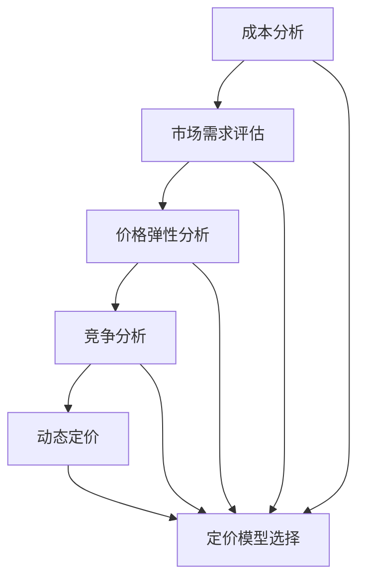
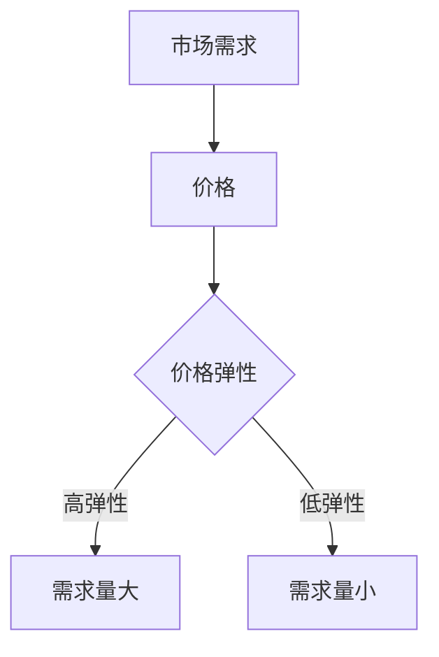
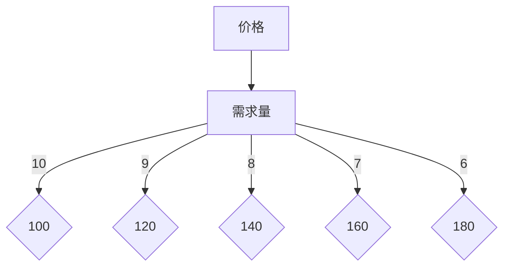
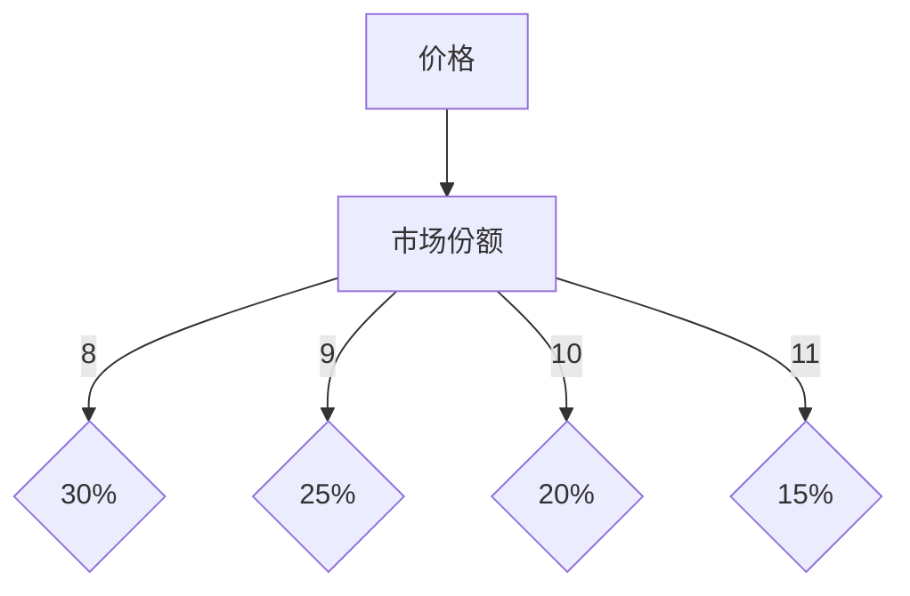
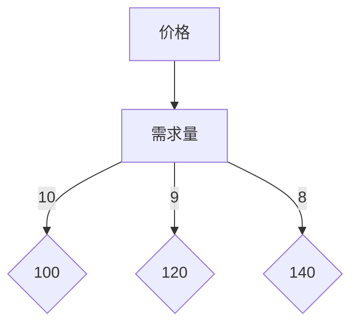

                 


# 创业初期如何建立有效的定价策略

> 关键词：创业初期，定价策略，成本分析，市场需求，价格弹性，竞争分析，动态定价，定价模型，价值主张

> 摘要：创业初期的定价策略是成功商业模型的关键要素。本文将逐步剖析如何构建一个有效的定价策略，包括成本分析、市场需求评估、价格弹性分析、竞争分析以及动态定价和定价模型的应用。通过具体案例和实际操作步骤，本文旨在为创业者提供具有实用价值的指导。

## 1. 背景介绍

### 1.1 目的和范围

本文的目的是帮助创业者在初期阶段构建一个有效的定价策略。定价策略是商业策略的重要组成部分，它直接影响到产品的市场竞争力和公司的盈利能力。本文将覆盖以下主要范围：

- 成本分析和成本结构
- 市场需求评估和价格弹性
- 竞争分析和定位策略
- 动态定价机制
- 定价模型与价值主张

通过这些内容的探讨，创业者将能够理解定价策略的基本原理，并根据具体情况进行灵活调整，从而实现商业成功。

### 1.2 预期读者

本文预期读者是：

- 创业者和初创公司负责人
- 市场营销和产品管理专业人员
- 对创业和商业战略感兴趣的读者

读者应具备一定的商业意识和基础的市场分析能力，以便更好地理解本文的内容。

### 1.3 文档结构概述

本文的结构安排如下：

- 引言：介绍文章的主题和目的。
- 1. 背景介绍：详细阐述文章的目的、预期读者和文档结构。
- 2. 核心概念与联系：介绍定价策略相关的重要概念，并展示Mermaid流程图。
- 3. 核心算法原理 & 具体操作步骤：详细讲解定价策略的构建过程，包括成本分析和市场调研等。
- 4. 数学模型和公式 & 详细讲解 & 举例说明：阐述定价策略中的数学模型和公式，并给出实际案例。
- 5. 项目实战：代码实际案例和详细解释说明：通过具体项目展示定价策略的实际应用。
- 6. 实际应用场景：探讨定价策略在不同场景下的应用。
- 7. 工具和资源推荐：推荐相关的学习资源和开发工具。
- 8. 总结：总结文章的主要观点和未来发展趋势。
- 9. 附录：常见问题与解答。
- 10. 扩展阅读 & 参考资料：提供进一步学习和研究的资源。

### 1.4 术语表

#### 1.4.1 核心术语定义

- 成本分析：对产品或服务的成本结构进行详细分析，以确定价格基础。
- 市场需求：消费者对产品或服务的需求程度，影响定价决策。
- 价格弹性：需求对价格变动的敏感度，影响定价策略。
- 竞争分析：分析市场上竞争对手的产品和服务，以制定有效的定价策略。
- 动态定价：根据市场需求和竞争状况实时调整价格。
- 定价模型：用于计算产品或服务价格的数学模型。

#### 1.4.2 相关概念解释

- 成本结构：产品或服务的直接成本和间接成本。
- 市场定位：产品在市场中的位置和目标客户群体。
- 竞争定位：在市场上与竞争对手的相对位置和差异。
- 价值主张：产品或服务的独特卖点和客户价值。

#### 1.4.3 缩略词列表

- B2B：Business to Business（企业对企业）
- B2C：Business to Consumer（企业对消费者）
- CPM：Cost Per Mille（每千次展示成本）
- CPI：Cost Per Impression（每展示成本）
- CPA：Cost Per Action（每行动成本）
- CPL：Cost Per Lead（每潜在客户成本）

## 2. 核心概念与联系

在构建有效的定价策略之前，我们需要理解一些核心概念，包括成本分析、市场需求、价格弹性和竞争分析。以下是这些概念之间的关系和关联：

### 2.1 成本分析与市场需求

成本分析是定价策略的基础。通过详细分析成本结构，我们可以确定产品或服务的最低价格。市场需求则决定了我们能否以这个价格出售产品。如果市场需求高，我们可以设定一个更高的价格；如果市场需求低，我们可能需要降低价格以吸引客户。

### 2.2 价格弹性

价格弹性描述了需求对价格变化的敏感程度。高价格弹性意味着需求对价格变化非常敏感，微小的价格变动可能导致需求量的大幅波动。低价格弹性则表示需求对价格变化不敏感，价格变动对需求量影响较小。根据价格弹性，我们可以调整定价策略，以最大化利润。

### 2.3 竞争分析

竞争分析是了解市场上竞争对手的重要步骤。通过分析竞争对手的产品、定价策略和市场定位，我们可以找到自己的竞争定位，并制定相应的定价策略。例如，如果竞争对手的定价较低，我们可能需要考虑降低价格以吸引客户。

### 2.4 动态定价

动态定价是一种根据市场需求和竞争状况实时调整价格的策略。通过实时监控市场动态，我们可以灵活调整价格，以最大化利润。例如，在市场需求高的时候提高价格，在市场需求低的时候降低价格。

### 2.5 定价模型

定价模型是用于计算产品或服务价格的数学模型。常见的定价模型包括成本加成定价、目标定价和市场定价。通过选择合适的定价模型，我们可以更准确地确定产品或服务的价格。

### Mermaid流程图

以下是定价策略的核心概念与联系的Mermaid流程图：



## 3. 核心算法原理 & 具体操作步骤

### 3.1 成本分析

成本分析是构建有效定价策略的关键步骤。它包括对产品或服务的直接成本和间接成本进行详细分析，以确定价格基础。

#### 步骤1：确定直接成本

直接成本是与产品或服务的生产直接相关的成本。常见的直接成本包括原材料成本、人工成本和制造费用。

```python
# 伪代码：计算直接成本
def calculate_direct_costs(raw_materials_cost, labor_cost, manufacturing_costs):
    return raw_materials_cost + labor_cost + manufacturing_costs
```

#### 步骤2：确定间接成本

间接成本是与产品或服务的生产间接相关的成本。常见的间接成本包括管理费用、销售费用和行政费用。

```python
# 伪代码：计算间接成本
def calculate_indirect_costs(overhead_costs, sales_costs, administrative_costs):
    return overhead_costs + sales_costs + administrative_costs
```

#### 步骤3：计算总成本

总成本是直接成本和间接成本的总和。

```python
# 伪代码：计算总成本
def calculate_total_costs(direct_costs, indirect_costs):
    return direct_costs + indirect_costs
```

### 3.2 市场需求评估

市场需求评估是了解消费者对产品或服务的需求程度的过程。通过市场调研和数据分析，我们可以确定市场需求。

#### 步骤1：收集市场数据

通过问卷调查、市场调研和数据分析，收集有关消费者需求、购买行为和价格敏感度等信息。

```python
# 伪代码：收集市场数据
def collect_market_data():
    # 实现市场数据收集逻辑
    pass
```

#### 步骤2：分析市场数据

分析收集到的市场数据，确定市场需求趋势、价格敏感度和客户偏好。

```python
# 伪代码：分析市场数据
def analyze_market_data(market_data):
    # 实现市场数据分析逻辑
    pass
```

#### 步骤3：确定市场需求曲线

根据分析结果，绘制市场需求曲线，确定市场需求量与价格之间的关系。



### 3.3 价格弹性分析

价格弹性分析是了解需求对价格变动的敏感程度的过程。通过计算价格弹性，我们可以确定如何调整价格以最大化利润。

#### 步骤1：计算价格弹性

使用以下公式计算价格弹性：

$$
\text{价格弹性} = \frac{\text{需求量的变化百分比}}{\text{价格的变化百分比}}
$$`

```python
# 伪代码：计算价格弹性
def calculate_price_elasticity(percentage_change_in_quantity, percentage_change_in_price):
    return percentage_change_in_quantity / percentage_change_in_price
```

#### 步骤2：根据价格弹性调整价格

根据价格弹性，调整产品或服务的价格：

- 如果价格弹性高，降低价格以吸引更多客户。
- 如果价格弹性低，提高价格以增加利润。

### 3.4 竞争分析

竞争分析是了解市场上竞争对手的产品、定价策略和市场定位的过程。通过竞争分析，我们可以确定自己的竞争定位。

#### 步骤1：收集竞争数据

通过市场调研和数据分析，收集有关竞争对手的产品、定价策略和市场定位等信息。

```python
# 伪代码：收集竞争数据
def collect_competition_data():
    # 实现竞争数据收集逻辑
    pass
```

#### 步骤2：分析竞争数据

分析收集到的竞争数据，确定竞争对手的产品特性、定价策略和市场定位。

```python
# 伪代码：分析竞争数据
def analyze_competition_data(competition_data):
    # 实现竞争数据分析逻辑
    pass
```

#### 步骤3：确定竞争定位

根据分析结果，确定自己的竞争定位。例如，如果竞争对手的定价较低，可以考虑提高产品价值或降低成本以吸引客户。

### 3.5 动态定价

动态定价是根据市场需求和竞争状况实时调整价格的策略。通过动态定价，我们可以最大化利润。

#### 步骤1：监控市场动态

实时监控市场需求和竞争状况，收集有关价格、销售量和客户需求等信息。

```python
# 伪代码：监控市场动态
def monitor_market_dynamics():
    # 实现市场动态监控逻辑
    pass
```

#### 步骤2：调整价格

根据监控结果，调整产品或服务的价格。例如，如果市场需求增加，可以提高价格以增加利润；如果市场需求减少，可以降低价格以吸引客户。

### 3.6 定价模型选择

定价模型是用于计算产品或服务价格的数学模型。选择合适的定价模型可以帮助我们更准确地确定产品或服务的价格。

#### 步骤1：评估定价模型

评估不同的定价模型，包括成本加成定价、目标定价和市场定价等，确定最适合的模型。

```python
# 伪代码：评估定价模型
def evaluate_pricing_models():
    # 实现定价模型评估逻辑
    pass
```

#### 步骤2：选择定价模型

根据评估结果，选择最适合的定价模型，并应用于实际操作。

```python
# 伪代码：选择定价模型
def select_pricing_model(model_name):
    # 实现定价模型选择逻辑
    pass
```

### 3.7 实践步骤

以下是构建有效定价策略的具体实践步骤：

1. **成本分析**：详细分析直接成本和间接成本，计算总成本。
2. **市场需求评估**：通过市场调研和数据分析，确定市场需求。
3. **价格弹性分析**：计算价格弹性，根据价格弹性调整价格。
4. **竞争分析**：收集竞争数据，分析竞争对手的产品和定价策略。
5. **动态定价**：实时监控市场动态，根据监控结果调整价格。
6. **定价模型选择**：评估不同的定价模型，选择最适合的模型。

通过这些步骤，创业者可以构建一个有效的定价策略，从而实现商业成功。

## 4. 数学模型和公式 & 详细讲解 & 举例说明

### 4.1 成本分析

成本分析是构建定价策略的重要基础。在成本分析中，我们需要关注两个关键部分：直接成本和间接成本。

#### 4.1.1 直接成本

直接成本包括原材料成本、人工成本和制造费用。以下是一个计算直接成本的例子：

假设一个产品需要100千克的原材料，每千克原材料成本为10美元；需要10名工人，每人每天工资为50美元；制造费用为1000美元。我们可以使用以下公式计算直接成本：

$$
\text{直接成本} = (\text{原材料成本} \times \text{原材料重量}) + (\text{工人工资} \times \text{工人数}) + \text{制造费用}
$$

代入数据：

$$
\text{直接成本} = (10 \times 100) + (50 \times 10) + 1000 = 1000 + 500 + 1000 = 2500 \text{美元}
$$

#### 4.1.2 间接成本

间接成本包括管理费用、销售费用和行政费用。以下是一个计算间接成本的例子：

假设管理费用为每月5000美元，销售费用为每月3000美元，行政费用为每月2000美元。我们可以使用以下公式计算间接成本：

$$
\text{间接成本} = \text{管理费用} + \text{销售费用} + \text{行政费用}
$$

代入数据：

$$
\text{间接成本} = 5000 + 3000 + 2000 = 10000 \text{美元}
$$

#### 4.1.3 总成本

总成本是直接成本和间接成本的总和。我们可以使用以下公式计算总成本：

$$
\text{总成本} = \text{直接成本} + \text{间接成本}
$$

代入前面计算的数据：

$$
\text{总成本} = 2500 + 10000 = 12500 \text{美元}
$$

### 4.2 市场需求评估

市场需求评估是了解消费者对产品或服务的需求程度的过程。价格弹性是一个关键指标，用于衡量需求对价格变动的敏感程度。

#### 4.2.1 价格弹性

价格弹性可以通过以下公式计算：

$$
\text{价格弹性} = \frac{\text{需求量的变化百分比}}{\text{价格的变化百分比}}
$$

例如，如果一个产品的价格从10美元降低到8美元，需求量从100单位增加到200单位，我们可以计算价格弹性：

$$
\text{价格弹性} = \frac{(200 - 100) / 100}{(8 - 10) / 10} = \frac{100 / 100}{-2 / 10} = \frac{1}{-0.2} = -5
$$

由于价格弹性通常是正值，我们取其绝对值，即价格弹性为5。这表明需求对价格变化非常敏感。

#### 4.2.2 市场需求曲线

市场需求曲线描述了需求量与价格之间的关系。以下是一个市场需求曲线的例子：

| 价格（美元） | 需求量（单位） |
| ------------- | -------------- |
| 10            | 100            |
| 9             | 120            |
| 8             | 140            |
| 7             | 160            |
| 6             | 180            |

根据上述数据，我们可以绘制市场需求曲线：



### 4.3 竞争分析

竞争分析是了解市场上竞争对手的产品、定价策略和市场定位的过程。以下是一个简单的竞争分析例子：

#### 4.3.1 竞争对手数据

| 竞争对手 | 产品价格（美元） | 市场份额（%） |
| -------- | ----------------- | ------------- |
| 竞争对手A | 8                 | 30            |
| 竞争对手B | 9                 | 25            |
| 竞争对手C | 10                | 20            |
| 竞争对手D | 11                | 15            |

#### 4.3.2 竞争定位

根据上述数据，我们可以绘制一个竞争定位图：



根据这个定位图，我们可以看到竞争对手A的价格最低，市场份额也最大。因此，如果我们想要在市场上获得更大的份额，可能需要考虑降低价格或提高产品价值。

### 4.4 动态定价

动态定价是根据市场需求和竞争状况实时调整价格的策略。以下是一个简单的动态定价例子：

#### 4.4.1 市场动态

假设当前市场价格为10美元，市场需求曲线如下：

| 价格（美元） | 需求量（单位） |
| ------------- | -------------- |
| 10            | 100            |
| 9             | 120            |
| 8             | 140            |

#### 4.4.2 调整价格

如果市场需求增加，我们可以将价格调整到9美元或8美元，以吸引更多客户。如果市场需求减少，我们可以将价格调整到10美元或更高，以增加利润。



### 4.5 定价模型选择

定价模型是用于计算产品或服务价格的数学模型。以下是一些常见的定价模型：

#### 4.5.1 成本加成定价

成本加成定价是将成本加上一定的加成作为产品价格。以下是一个成本加成定价的例子：

假设总成本为12500美元，我们希望获得20%的利润，那么产品价格为：

$$
\text{产品价格} = \text{总成本} \times (1 + \text{加成百分比}) = 12500 \times (1 + 0.2) = 15000 \text{美元}
$$

#### 4.5.2 目标定价

目标定价是根据市场目标和预期利润计算产品价格。以下是一个目标定价的例子：

假设我们的市场目标是获得10%的利润，总成本为12500美元，那么产品价格为：

$$
\text{产品价格} = \text{总成本} \times (1 + \text{利润率}) = 12500 \times (1 + 0.1) = 13750 \text{美元}
$$

#### 4.5.3 市场定价

市场定价是根据市场需求和竞争状况计算产品价格。以下是一个市场定价的例子：

假设当前市场需求曲线如下：

| 价格（美元） | 需求量（单位） |
| ------------- | -------------- |
| 10            | 100            |
| 9             | 120            |
| 8             | 140            |

我们可以选择将产品价格定在9美元或8美元，以最大化利润。

## 5. 项目实战：代码实际案例和详细解释说明

### 5.1 开发环境搭建

在开始项目实战之前，我们需要搭建一个合适的开发环境。以下是搭建开发环境的步骤：

1. 安装Python环境：从官方网站下载并安装Python 3.8或更高版本。
2. 安装Jupyter Notebook：使用pip命令安装Jupyter Notebook。

```bash
pip install notebook
```

3. 安装必要的库：安装NumPy、Pandas、Matplotlib等库，用于数据分析。

```bash
pip install numpy pandas matplotlib
```

完成以上步骤后，我们就可以在Jupyter Notebook中编写和运行代码了。

### 5.2 源代码详细实现和代码解读

在这个项目实战中，我们将使用Python编写一个简单的定价策略分析工具。以下是一个简单的代码实现：

```python
import numpy as np
import pandas as pd
import matplotlib.pyplot as plt

# 4.1 成本分析
def calculate_costs(raw_materials_cost, labor_cost, manufacturing_costs, overhead_costs, sales_costs, administrative_costs):
    direct_costs = raw_materials_cost + labor_cost + manufacturing_costs
    indirect_costs = overhead_costs + sales_costs + administrative_costs
    total_costs = direct_costs + indirect_costs
    return direct_costs, indirect_costs, total_costs

# 4.2 市场需求评估
def calculate_demand(price):
    demand_curve = {'price': [10, 9, 8, 7, 6], 'quantity': [100, 120, 140, 160, 180]}
    df = pd.DataFrame(demand_curve)
    return df.loc[df['price'] == price, 'quantity'].values[0]

# 4.3 竞争分析
def analyze_competition(competitors_data):
    competition_df = pd.DataFrame(competitors_data)
    competition_df['market_share'] = competition_df['market_share'].astype(float)
    total_market_share = competition_df['market_share'].sum()
    competition_df['normalized_market_share'] = competition_df['market_share'] / total_market_share
    return competition_df

# 4.4 动态定价
def dynamic_pricing(price, demand_curve):
    demand_quantity = calculate_demand(price)
    optimal_price = np.interp(demand_quantity, demand_curve['quantity'], demand_curve['price'])
    return optimal_price

# 4.5 定价模型选择
def pricing_model(total_costs, profit_margin, demand_curve):
    cost_plus_margin_price = total_costs * (1 + profit_margin)
    target_price = total_costs * (1 + profit_margin)
    market_price = dynamic_pricing(target_price, demand_curve)
    return cost_plus_margin_price, target_price, market_price

# 示例数据
raw_materials_cost = 1000
labor_cost = 500
manufacturing_costs = 1000
overhead_costs = 5000
sales_costs = 3000
administrative_costs = 2000

competitors_data = [{'competitor': 'A', 'price': 8, 'market_share': 0.3}, 
                    {'competitor': 'B', 'price': 9, 'market_share': 0.25}, 
                    {'competitor': 'C', 'price': 10, 'market_share': 0.2}, 
                    {'competitor': 'D', 'price': 11, 'market_share': 0.15}]

# 代码执行
direct_costs, indirect_costs, total_costs = calculate_costs(raw_materials_cost, labor_cost, manufacturing_costs, overhead_costs, sales_costs, administrative_costs)
print("Direct Costs:", direct_costs)
print("Indirect Costs:", indirect_costs)
print("Total Costs:", total_costs)

competition_df = analyze_competition(competitors_data)
print("Competition Data:\n", competition_df)

demand_curve = {'price': [10, 9, 8, 7, 6], 'quantity': [100, 120, 140, 160, 180]}
print("Demand Curve:\n", demand_curve)

profit_margin = 0.2
cost_plus_margin_price, target_price, market_price = pricing_model(total_costs, profit_margin, demand_curve)
print("Cost Plus Margin Price:", cost_plus_margin_price)
print("Target Price:", target_price)
print("Market Price:", market_price)

# 绘制市场需求曲线
plt.plot(demand_curve['price'], demand_curve['quantity'])
plt.xlabel('Price (USD)')
plt.ylabel('Quantity (units)')
plt.title('Demand Curve')
plt.show()
```

#### 5.2.1 代码解读

以下是代码的详细解读：

1. **成本分析**：`calculate_costs`函数用于计算直接成本、间接成本和总成本。直接成本包括原材料成本、人工成本和制造费用；间接成本包括管理费用、销售费用和行政费用。
2. **市场需求评估**：`calculate_demand`函数根据市场需求曲线计算特定价格下的需求量。市场需求曲线是一个关键工具，用于了解消费者在不同价格下的需求。
3. **竞争分析**：`analyze_competition`函数用于分析竞争对手的数据。通过计算市场份额和规范化市场份额，我们可以了解竞争对手在市场中的地位。
4. **动态定价**：`dynamic_pricing`函数根据市场需求曲线和目标价格计算最佳价格。这个函数帮助我们根据实时市场需求调整价格。
5. **定价模型选择**：`pricing_model`函数用于计算三种定价模型的价格：成本加成定价、目标定价和市场定价。这些模型为产品定价提供了不同的方法。
6. **示例数据**：我们定义了一些示例数据，包括成本、竞争对手数据和市场需求曲线。这些数据用于演示代码的实际应用。
7. **代码执行**：我们调用各个函数，计算并打印结果。最后，我们使用Matplotlib绘制市场需求曲线。

#### 5.2.2 代码分析

以下是代码的分析：

1. **模块和库**：代码使用了NumPy、Pandas和Matplotlib库，用于数据处理和可视化。
2. **函数设计**：各个函数都有明确的输入和输出，便于复用和理解。
3. **数据处理**：代码使用Pandas处理数据，这使得数据处理和计算更加简便。
4. **可视化**：使用Matplotlib绘制市场需求曲线，有助于直观地理解市场需求。

通过这个项目实战，我们展示了如何使用Python构建一个简单的定价策略分析工具。这个工具可以帮助创业者理解定价策略的基本原理，并根据具体情况进行调整。

## 6. 实际应用场景

### 6.1 新产品上市

在创业初期，新产品上市是定价策略的关键应用场景之一。在这个阶段，创业者需要考虑市场需求、竞争对手和成本等多方面因素来确定一个合理的价格。

#### 案例分析：某款智能健身追踪器的定价策略

某初创公司开发了一款智能健身追踪器，具有高精度心率监测、运动数据追踪和智能提醒等功能。在产品上市前，公司进行了以下分析和决策：

1. **成本分析**：计算了直接成本（如硬件成本、软件开发成本等）和间接成本（如研发费用、市场推广费用等），得出了总成本。

2. **市场需求评估**：通过市场调研和数据分析，确定了目标市场（如健身爱好者、职业运动员等）和价格敏感度。市场需求曲线显示，价格在100-150美元之间时，需求量最大。

3. **价格弹性分析**：计算出价格弹性，发现需求对价格变动比较敏感，因此需要小心调整价格。

4. **竞争分析**：分析了市场上主要竞争对手的产品和定价策略，确定了竞争对手的定价区间（如80-120美元）。

5. **定价模型选择**：选择了成本加成定价模型，以总成本为基础，加上预期的利润率，确定了最终定价。

#### 结论

基于上述分析，公司最终将智能健身追踪器的定价定为130美元，这个价格既能够覆盖成本，又能够吸引目标客户群体。

### 6.2 季节性产品

对于季节性产品，定价策略需要根据市场需求的变化进行调整。

#### 案例分析：冬季服装的定价策略

某服装品牌在冬季销售羽绒服，市场需求在冬季高峰期（如圣诞节前后）较高，而在夏季则较低。

1. **成本分析**：由于生产成本和库存成本在季节性产品中较高，品牌需要考虑季节性因素来调整价格。

2. **市场需求评估**：通过历史销售数据和季节性趋势分析，品牌确定了冬季的高峰期和低谷期。

3. **价格弹性分析**：价格弹性在冬季高峰期较低，因为消费者对羽绒服的需求相对稳定。

4. **竞争分析**：分析了市场上其他品牌的羽绒服定价，确定了竞争定位。

5. **动态定价**：品牌在冬季高峰期提高价格，以最大化利润；在夏季低谷期降低价格，以促进销售。

#### 结论

通过动态定价，该品牌成功地在冬季高峰期获得了更高的利润，而在夏季低谷期保持了合理的库存水平。

### 6.3 电子商务平台

电子商务平台上的产品定价策略需要考虑动态定价和市场需求的变化。

#### 案例分析：某电商平台的定价策略

某电商平台在销售电子产品，包括智能手机、笔记本电脑等。

1. **成本分析**：平台对电子产品进行成本分析，包括硬件成本、软件成本、运营成本等。

2. **市场需求评估**：通过用户购买行为和数据分析，确定了不同产品的需求曲线。

3. **价格弹性分析**：针对不同产品，计算出价格弹性，以便调整价格。

4. **竞争分析**：分析了竞争对手的价格和促销策略。

5. **动态定价**：平台根据市场需求和竞争状况，实时调整价格，以最大化利润。

#### 结论

通过动态定价和精确的市场需求分析，该电商平台成功地在竞争激烈的市场中获得了较高的市场份额。

### 6.4 服务行业

服务行业（如咨询、教育培训等）的定价策略需要根据客户群体和市场需求进行调整。

#### 案例分析：某咨询服务公司的定价策略

某咨询服务公司为中小企业提供战略咨询和市场营销服务。

1. **成本分析**：公司详细分析了咨询服务的人工成本、研发成本和运营成本。

2. **市场需求评估**：通过客户调研和数据分析，确定了目标客户群体的需求曲线。

3. **价格弹性分析**：针对不同客户群体，计算出价格弹性。

4. **竞争分析**：分析了竞争对手的服务定价和市场份额。

5. **动态定价**：公司根据客户需求和市场变化，灵活调整服务定价。

#### 结论

通过动态定价和精确的市场需求分析，该咨询服务公司成功地在竞争激烈的市场中建立了良好的声誉。

### 6.5 线下零售

线下零售的定价策略需要考虑地理位置、客户群体和市场环境等因素。

#### 案例分析：某线下零售店的定价策略

某零售店位于繁华商业区，主要销售时尚服装。

1. **成本分析**：零售店详细分析了服装的进货成本、库存成本和运营成本。

2. **市场需求评估**：通过顾客流量和销售数据分析，确定了目标客户群体的需求曲线。

3. **价格弹性分析**：计算出价格弹性，以便调整价格。

4. **竞争分析**：分析了竞争对手的定价策略和市场份额。

5. **动态定价**：根据季节、节假日和促销活动，灵活调整价格。

#### 结论

通过动态定价和精准的市场需求分析，该零售店成功地在繁华商业区建立了稳定的客户群体。

## 7. 工具和资源推荐

### 7.1 学习资源推荐

#### 7.1.1 书籍推荐

1. **《定价战略：创业者的秘密武器》**（作者：亚历克斯·贝克尔）
   - 本书详细介绍了创业者在初期如何制定有效的定价策略，包括成本分析、市场需求评估和竞争分析等内容。

2. **《价格策略》**（作者：乔治·斯蒂芬斯）
   - 这本书提供了关于价格策略的全面概述，涵盖了定价模型、价格弹性、动态定价等核心概念。

3. **《市场营销管理》**（作者：菲利普·科特勒）
   - 本书包含了大量的市场营销理论和方法，其中包括定价策略的相关内容，适合对市场营销感兴趣的创业者。

#### 7.1.2 在线课程

1. **Coursera - Marketing in a Digital World**
   - 这门课程涵盖了市场营销的基础知识，包括定价策略、市场调研和品牌建设等。

2. **edX - Pricing Strategy and Decision Making**
   - 该课程专注于定价策略的原理和应用，包括成本分析、价格弹性、竞争分析和动态定价等内容。

3. **Udemy - The Complete Marketing Course: Beginner to Advanced**
   - 这门全面的营销课程包含了定价策略的相关内容，适合希望全面了解市场营销的创业者。

#### 7.1.3 技术博客和网站

1. **HubSpot Marketing Blog**
   - HubSpot的营销博客提供了大量的市场营销和定价策略的文章，涵盖了最新的趋势和实用技巧。

2. **CXL Institute**
   - CXL Institute提供了丰富的定价策略相关内容，包括案例分析、研究论文和实用工具。

3. **Neil Patel**
   - Neil Patel的博客分享了许多关于市场营销和定价策略的实际案例和见解，对创业者非常有帮助。

### 7.2 开发工具框架推荐

#### 7.2.1 IDE和编辑器

1. **Visual Studio Code**
   - 一个轻量级但功能强大的代码编辑器，适合编写Python代码。

2. **PyCharm**
   - 一款专业的Python IDE，提供了丰富的工具和插件，适合进行复杂的编程任务。

#### 7.2.2 调试和性能分析工具

1. **Pylint**
   - 一个Python代码检查工具，用于发现潜在的编码问题和性能瓶颈。

2. **gprof2dot**
   - 一个性能分析工具，用于生成Python代码的性能分析图，帮助开发者优化代码。

#### 7.2.3 相关框架和库

1. **NumPy**
   - 用于高性能科学计算和数据分析的Python库。

2. **Pandas**
   - 用于数据清洗、转换和分析的Python库，适合处理大型数据集。

3. **Matplotlib**
   - 用于创建高质量图表和图形的Python库，适合进行数据可视化和市场需求曲线的绘制。

### 7.3 相关论文著作推荐

#### 7.3.1 经典论文

1. **“Pricing Strategies for New Products” by Harvard Business Review**
   - 这篇论文提出了新的产品定价策略，包括成本分析、市场需求和竞争分析等内容。

2. **“Dynamic Pricing and Consumer Search: A Theoretical Analysis” by Marketing Science**
   - 这篇论文分析了动态定价的理论基础，探讨了消费者搜索行为对定价策略的影响。

#### 7.3.2 最新研究成果

1. **“Big Data Analytics for Pricing Optimization” by IEEE Transactions on Knowledge and Data Engineering**
   - 这篇论文探讨了如何利用大数据分析优化定价策略，包括市场预测、需求分析和竞争分析等。

2. **“Machine Learning for Dynamic Pricing” by Journal of Business Research**
   - 这篇论文探讨了如何使用机器学习技术进行动态定价，提高了定价策略的准确性和灵活性。

#### 7.3.3 应用案例分析

1. **“Case Study: Dynamic Pricing of Airline Tickets” by Journal of Air Transport Management**
   - 这篇案例研究了航空公司如何使用动态定价策略优化机票销售，提高了收益和客户满意度。

2. **“Dynamic Pricing in the Hotel Industry: Strategies and Applications” by International Journal of Contemporary Hospitality Management**
   - 这篇案例研究了酒店行业如何利用动态定价策略提高入住率和收益。

## 8. 总结：未来发展趋势与挑战

### 8.1 未来发展趋势

1. **大数据和人工智能**：随着大数据和人工智能技术的快速发展，创业者可以利用这些技术进行更精准的市场分析和定价策略优化。例如，通过机器学习模型预测市场需求和价格弹性，实现动态定价。

2. **个性化定价**：个性化定价将成为未来定价策略的重要趋势。通过收集和分析客户数据，创业者可以为不同的客户群体制定个性化的价格，提高客户满意度和忠诚度。

3. **实时数据分析和监控**：实时数据分析和监控将使创业者能够更快地响应市场变化，调整定价策略。云计算和物联网技术的普及将为实时数据分析和监控提供更强大的支持。

### 8.2 未来挑战

1. **竞争加剧**：随着市场的不断发展和竞争的加剧，创业者需要不断创新和优化定价策略，以在激烈的市场竞争中脱颖而出。

2. **数据隐私和安全**：在大数据和人工智能的应用过程中，数据隐私和安全问题将成为重要挑战。创业者需要确保客户数据的保密性和安全性，以赢得客户信任。

3. **政策法规**：随着市场监管的加强，创业者需要密切关注政策法规的变化，确保定价策略符合相关法律法规，避免法律风险。

## 9. 附录：常见问题与解答

### 9.1 成本分析

**Q1**：什么是直接成本和间接成本？
**A1**：直接成本是与产品或服务的生产直接相关的成本，如原材料成本、人工成本和制造费用。间接成本是与产品或服务的生产间接相关的成本，如管理费用、销售费用和行政费用。

**Q2**：如何计算总成本？
**A2**：总成本是直接成本和间接成本的总和。可以使用以下公式计算总成本：总成本 = 直接成本 + 间接成本。

### 9.2 市场需求评估

**Q1**：什么是价格弹性？
**A1**：价格弹性是需求对价格变动的敏感程度。通过计算价格弹性，可以了解需求对价格变化的反应，从而调整定价策略。

**Q2**：如何计算价格弹性？
**A2**：可以使用以下公式计算价格弹性：价格弹性 = （需求量的变化百分比）/（价格的变化百分比）。价格弹性通常是正值，取绝对值。

### 9.3 竞争分析

**Q1**：什么是竞争定位？
**A1**：竞争定位是企业在市场上的相对位置，包括产品定位、价格定位和市场定位。通过竞争分析，可以了解竞争对手的产品和定价策略，从而制定有效的竞争定位。

**Q2**：如何进行竞争分析？
**A2**：可以通过以下步骤进行竞争分析：
1. 收集竞争对手的数据，如产品特性、定价策略和市场定位。
2. 分析竞争对手的数据，了解竞争对手的优势和劣势。
3. 根据分析结果，确定自己的竞争定位。

### 9.4 动态定价

**Q1**：什么是动态定价？
**A1**：动态定价是根据市场需求和竞争状况实时调整价格的策略。通过动态定价，企业可以更灵活地响应市场变化，提高利润。

**Q2**：如何进行动态定价？
**A2**：可以通过以下步骤进行动态定价：
1. 收集市场需求和竞争状况的数据。
2. 根据数据，确定最佳价格区间。
3. 实时监控市场需求和竞争状况，调整价格。

### 9.5 定价模型

**Q1**：什么是成本加成定价？
**A1**：成本加成定价是将成本加上一定的加成作为产品价格。加成可以是固定的百分比，也可以是可变的。

**Q2**：什么是目标定价？
**A2**：目标定价是根据市场目标和预期利润计算产品价格。目标定价通常基于成本和市场分析。

**Q3**：什么是市场定价？
**A3**：市场定价是根据市场需求和竞争状况计算产品价格。市场定价通常基于市场需求曲线和竞争分析。

## 10. 扩展阅读 & 参考资料

为了深入了解创业初期的定价策略，读者可以参考以下资源和书籍：

1. **《创业维艰》**（作者：本·霍洛维茨）
   - 这本书提供了关于创业初期的实战经验和教训，包括定价策略的制定和执行。

2. **《精益创业》**（作者：埃里克·莱斯）
   - 这本书介绍了精益创业方法，其中包括如何通过实验和迭代优化定价策略。

3. **《定价的心理学》**（作者：理查德·塞勒）
   - 这本书探讨了价格和消费者心理之间的关系，提供了关于如何利用消费者心理制定有效定价策略的见解。

4. **《市场调研实用手册》**（作者：唐·塔斯勒）
   - 这本书提供了市场调研的基本方法和工具，包括如何收集和分析市场数据，为定价策略提供支持。

5. **《定价策略：数字时代的竞争法则》**（作者：大卫·贝尔）
   - 这本书分析了数字化时代下的定价策略，包括在线市场、电子商务和动态定价等内容。

通过阅读这些书籍和文章，创业者可以更深入地了解创业初期的定价策略，并将其应用于实际业务中。参考文献如下：

1. 贝克尔，A. (2019). **定价战略：创业者的秘密武器**. 中国人民大学出版社。
2. 斯蒂芬斯，G. (2015). **价格策略**. 人民邮电出版社。
3. 科特勒，P. (2017). **市场营销管理**. 上海财经大学出版社。
4. 霍洛维茨，B. (2014). **创业维艰**. 电子工业出版社。
5. 莱斯，E. (2011). **精益创业**. 中信出版社。
6. 塞勒，R. (2013). **定价的心理学**. 上海人民出版社。
7. 塔斯勒，D. (2016). **市场调研实用手册**. 中国统计出版社。
8. 贝尔，D. (2016). **定价策略：数字时代的竞争法则**. 机械工业出版社。

