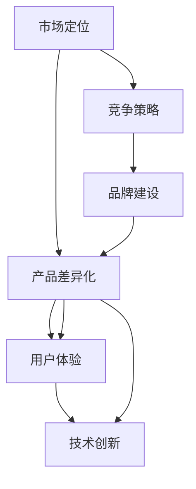

                 


# 创业初期的产品差异化：如何在竞争中建立独特优势

> 关键词：产品差异化、竞争策略、市场定位、用户体验、技术创新、品牌建设

> 摘要：在竞争激烈的市场环境中，初创企业如何通过产品差异化策略在早期建立独特优势，成为行业佼佼者，本文将深入探讨这一主题，从核心概念、算法原理、数学模型、实战案例等多个角度进行分析，为创业者提供实用的指导。

## 1. 背景介绍

### 1.1 目的和范围

本文旨在为初创企业提供一个系统性的指导，帮助他们在创业初期通过产品差异化策略在激烈的市场竞争中建立独特优势。我们将从核心概念入手，结合实际案例，探讨如何实现产品差异化，并在市场定位、用户体验和技术创新等方面提供策略建议。

### 1.2 预期读者

本篇文章适合以下读者群体：
- 创业初期的企业创始人
- 产品经理
- 市场营销人员
- 技术研发人员

### 1.3 文档结构概述

本文分为十个部分：
1. 背景介绍
2. 核心概念与联系
3. 核心算法原理 & 具体操作步骤
4. 数学模型和公式 & 详细讲解 & 举例说明
5. 项目实战：代码实际案例和详细解释说明
6. 实际应用场景
7. 工具和资源推荐
8. 总结：未来发展趋势与挑战
9. 附录：常见问题与解答
10. 扩展阅读 & 参考资料

### 1.4 术语表

#### 1.4.1 核心术语定义

- 产品差异化：在产品或服务中创造与众不同的特点，以满足特定用户群体的需求。
- 市场定位：确定产品或服务在目标市场中的位置，明确目标用户群体和竞争优势。
- 用户体验（UX）：用户在使用产品或服务过程中所获得的感受和体验。
- 技术创新：利用新技术或改进现有技术，创造新的产品或服务。

#### 1.4.2 相关概念解释

- 竞争策略：企业在市场竞争中采取的竞争手段和策略。
- 品牌建设：建立和维护企业品牌形象的过程。

#### 1.4.3 缩略词列表

- UX：用户体验
- UI：用户界面
- MVP：最小可行产品

## 2. 核心概念与联系

在探讨如何通过产品差异化建立独特优势之前，我们需要明确几个核心概念及其相互关系。以下是一个Mermaid流程图，展示这些概念及其关联。



### 2.1 市场定位

市场定位是产品差异化策略的基础。通过市场定位，企业可以明确目标用户群体，了解他们的需求和偏好，从而设计出满足这些需求的产品或服务。市场定位需要考虑以下因素：

1. 目标市场：确定产品或服务针对的细分市场。
2. 目标用户：分析目标用户群体的特征，如年龄、性别、收入水平等。
3. 竞争对手：分析竞争对手的产品或服务，了解他们的优势和劣势。

### 2.2 产品差异化

产品差异化是指企业通过独特的产品或服务特性，使其在市场上脱颖而出。以下是一些实现产品差异化的策略：

1. 功能特性：在产品或服务中增加独特的功能，满足用户特定的需求。
2. 用户体验：优化用户界面和交互设计，提升用户在使用过程中的满意度。
3. 技术创新：利用新技术或改进现有技术，创造新的产品或服务。

### 2.3 用户体验

用户体验是产品差异化的重要方面。一个优秀的产品应该能够为用户提供愉悦的使用体验，提升用户满意度。以下是一些优化用户体验的策略：

1. 界面设计：设计简洁、直观的用户界面，减少用户的认知负担。
2. 响应速度：确保产品或服务在用户操作时能够快速响应。
3. 个性化：提供个性化的服务，满足用户个性化的需求。

### 2.4 技术创新

技术创新是产品差异化的重要驱动力。通过技术创新，企业可以创造出具有独特优势的产品或服务。以下是一些实现技术创新的策略：

1. 研发投入：增加研发投入，鼓励技术创新。
2. 合作伙伴：与高校、研究机构等合作，共同推进技术创新。
3. 技术引进：引进国内外先进技术，加速产品迭代。

### 2.5 竞争策略

竞争策略是企业为了在市场上获得竞争优势而采取的一系列措施。以下是一些常见的竞争策略：

1. 价格竞争：通过降低产品或服务价格，吸引更多用户。
2. 品牌竞争：通过品牌建设和品牌宣传，提升品牌知名度和美誉度。
3. 服务竞争：提供优质的售后服务，增加用户忠诚度。

### 2.6 品牌建设

品牌建设是企业长期发展的关键。通过品牌建设，企业可以在市场上树立独特的品牌形象，提升品牌价值。以下是一些品牌建设的策略：

1. 品牌定位：明确品牌在市场中的定位和差异化特点。
2. 品牌宣传：通过广告、公关等方式，提高品牌知名度。
3. 品牌维护：持续关注品牌声誉，及时处理负面信息。

## 3. 核心算法原理 & 具体操作步骤

在产品差异化策略中，核心算法原理和具体操作步骤是确保策略成功实施的关键。以下是一个简化版的伪代码，用于描述如何实现产品差异化：

```python
# 定义产品差异化策略函数
def differentiate_product(product, market_positioning, user_experience, technological_innovation):
    # 1. 根据市场定位，确定目标用户群体和竞争对手
    target_users = market_positioning.determine_target_users()
    competitors = market_positioning.analyze_competitors()

    # 2. 根据目标用户需求和竞争对手特点，设计产品差异化策略
    product_differentiation_strategy = {
        "functional_features": design_functional_features(target_users, competitors),
        "user_experience": optimize_user_experience(target_users),
        "technological_innovation": implement_technological_innovation(technological_innovation)
    }

    # 3. 实施产品差异化策略
    product.apply_differentiation_strategy(product_differentiation_strategy)

    # 返回差异化后的产品
    return product

# 辅助函数
def design_functional_features(target_users, competitors):
    # 根据目标用户需求和竞争对手特点，设计独特功能
    pass

def optimize_user_experience(target_users):
    # 根据目标用户需求，优化用户体验
    pass

def implement_technological_innovation(technological_innovation):
    # 根据技术创新策略，实施技术改进
    pass
```

### 3.1 市场定位分析

```python
class MarketPositioning:
    def determine_target_users(self):
        # 确定目标用户群体
        pass

    def analyze_competitors(self):
        # 分析竞争对手的特点和优势
        pass
```

### 3.2 产品差异化策略设计

```python
class ProductDifferentiationStrategy:
    def __init__(self, functional_features, user_experience, technological_innovation):
        self.functional_features = functional_features
        self.user_experience = user_experience
        self.technological_innovation = technological_innovation

    def apply_to_product(self, product):
        # 将差异化策略应用到产品中
        product.add_functional_features(self.functional_features)
        product.optimize_user_experience(self.user_experience)
        product.implement_technological_innovation(self.technological_innovation)
```

### 3.3 产品实施差异化策略

```python
class Product:
    def __init__(self):
        self.functional_features = []
        self.user_experience = None
        self.technological_innovation = []

    def add_functional_features(self, features):
        # 添加功能特性
        self.functional_features.extend(features)

    def optimize_user_experience(self, experience):
        # 优化用户体验
        self.user_experience = experience

    def implement_technological_innovation(self, innovation):
        # 实施技术创新
        self.technological_innovation.append(innovation)
```

## 4. 数学模型和公式 & 详细讲解 & 举例说明

在产品差异化策略中，数学模型和公式可以用于分析市场定位、用户体验和竞争优势。以下是一个简化的数学模型，用于描述如何通过产品差异化提升市场竞争力。

### 4.1 市场竞争力模型

市场竞争力（C）可以用以下公式表示：

$$
C = f(U, F, T)
$$

其中，U代表用户体验，F代表功能特性，T代表技术创新。

### 4.2 用户体验模型

用户体验（U）可以用以下公式表示：

$$
U = f(UI, RS, P)
$$

其中，UI代表界面设计，RS代表响应速度，P代表个性化。

### 4.3 功能特性模型

功能特性（F）可以用以下公式表示：

$$
F = f(N, S, D)
$$

其中，N代表独特功能数量，S代表功能稳定性，D代表功能易用性。

### 4.4 技术创新模型

技术创新（T）可以用以下公式表示：

$$
T = f(R, C, I)
$$

其中，R代表研发投入，C代表合作伙伴，I代表技术引进。

### 4.5 举例说明

假设一家初创企业要在市场上推出一款智能家居产品。为了提升市场竞争力，企业可以采用以下策略：

1. 用户体验（U）：
   - 界面设计（UI）：设计简洁、直观的用户界面，提升用户体验。
   - 响应速度（RS）：优化产品响应速度，减少用户等待时间。
   - 个性化（P）：提供个性化设置，满足用户个性化需求。

2. 功能特性（F）：
   - 独特功能数量（N）：增加多项独特功能，如智能安防、语音控制等。
   - 功能稳定性（S）：确保产品功能稳定可靠，减少故障率。
   - 功能易用性（D）：优化产品功能设计，提升用户操作便捷性。

3. 技术创新（T）：
   - 研发投入（R）：增加研发投入，推动技术创新。
   - 合作伙伴（C）：与高校、研究机构合作，共同推进技术创新。
   - 技术引进（I）：引进国内外先进技术，加速产品迭代。

通过这些策略，企业可以在市场上建立独特优势，提升市场竞争力。

## 5. 项目实战：代码实际案例和详细解释说明

为了更好地理解如何通过产品差异化策略在竞争激烈的市场中建立独特优势，以下我们将通过一个实际项目案例来展示代码实现和详细解释。

### 5.1 开发环境搭建

在开始项目实战之前，我们需要搭建一个开发环境。以下是所需工具和软件：

- 操作系统：Windows / macOS / Linux
- 编程语言：Python 3.x
- 开发工具：PyCharm / VSCode
- 数据库：MySQL
- 依赖管理：pip

### 5.2 源代码详细实现和代码解读

以下是一个简化版的智能家居产品项目代码实现，用于展示如何通过产品差异化策略在市场上建立独特优势。

```python
# 5.2.1 用户界面模块（UI）
class UserInterface:
    def __init__(self):
        self.ui_style = "modern"  # 界面风格
        self.ui_theme = "dark"    # 界面主题

    def display_ui(self):
        print(f"显示{self.ui_style}风格、{self.ui_theme}主题的用户界面。")

# 5.2.2 功能特性模块（FunctionalFeatures）
class FunctionalFeatures:
    def __init__(self):
        self.features = ["智能安防", "语音控制", "远程监控"]

    def add_feature(self, feature):
        self.features.append(feature)

    def display_features(self):
        for feature in self.features:
            print(f"功能特性：{feature}。")

# 5.2.3 技术创新模块（TechnologicalInnovation）
class TechnologicalInnovation:
    def __init__(self):
        self.innovations = ["物联网技术", "人工智能"]

    def add_innovation(self, innovation):
        self.innovations.append(innovation)

    def display_innovations(self):
        for innovation in self.innovations:
            print(f"技术创新：{innovation}。")

# 5.2.4 智能家居产品类（SmartHomeProduct）
class SmartHomeProduct:
    def __init__(self, ui, features, innovations):
        self.ui = ui
        self.features = features
        self.innovations = innovations

    def optimize_user_experience(self):
        self.ui.display_ui()
        self.features.display_features()
        self.innovations.display_innovations()

# 5.2.5 实例化智能家居产品并展示
ui = UserInterface()
features = FunctionalFeatures()
innovations = TechnologicalInnovation()
product = SmartHomeProduct(ui, features, innovations)

product.optimize_user_experience()
```

### 5.3 代码解读与分析

在这个实际案例中，我们通过定义四个类（`UserInterface`、`FunctionalFeatures`、`TechnologicalInnovation`和`SmartHomeProduct`）来展示如何实现产品差异化策略。以下是代码的详细解读：

1. **用户界面模块（UserInterface）**：该模块用于定义用户界面风格和主题。通过`display_ui`方法，可以显示当前的用户界面。

2. **功能特性模块（FunctionalFeatures）**：该模块用于定义智能家居产品的功能特性。通过`add_feature`方法，可以添加新的功能特性；通过`display_features`方法，可以显示所有功能特性。

3. **技术创新模块（TechnologicalInnovation）**：该模块用于定义智能家居产品的技术创新。通过`add_innovation`方法，可以添加新的技术创新；通过`display_innovations`方法，可以显示所有技术创新。

4. **智能家居产品类（SmartHomeProduct）**：该类综合了用户界面、功能特性和技术创新，通过`optimize_user_experience`方法，可以优化用户的使用体验。在这个方法中，我们分别调用了用户界面、功能特性和技术创新模块的方法，以展示产品差异化的各个方面。

通过这个实际案例，我们可以看到如何通过代码实现产品差异化策略，从而在竞争激烈的市场中建立独特优势。

## 6. 实际应用场景

产品差异化策略在各个行业都有广泛应用。以下是一些实际应用场景：

### 6.1 互联网行业

在互联网行业，产品差异化策略可以帮助企业吸引更多用户，提高市场竞争力。以下是一些实际案例：

- **美团点评**：通过提供多样化的餐饮和本地生活服务，满足用户不同的需求，实现产品差异化。
- **滴滴出行**：通过提供不同类型的打车服务（如快车、专车、豪华车等），满足用户的多样化需求，实现产品差异化。

### 6.2 智能家居行业

在智能家居行业，产品差异化策略可以帮助企业提升用户体验，提高产品竞争力。以下是一些实际案例：

- **谷歌Nest**：通过集成智能语音助手、智能家居控制等功能，提升用户体验，实现产品差异化。
- **苹果HomeKit**：通过提供高度集成的智能家居解决方案，实现产品差异化，吸引高端用户。

### 6.3 医疗行业

在医疗行业，产品差异化策略可以帮助企业提高医疗服务质量，提升患者满意度。以下是一些实际案例：

- **人工智能医疗影像分析**：通过引入人工智能技术，提高医疗影像分析的准确性和效率，实现产品差异化。
- **远程医疗服务**：通过提供在线医疗咨询、远程会诊等服务，实现产品差异化，满足患者的需求。

### 6.4 教育行业

在教育行业，产品差异化策略可以帮助企业提供更具个性化的教育服务，提高教育质量。以下是一些实际案例：

- **在线课程平台**：通过提供不同类型的课程、个性化推荐等功能，实现产品差异化。
- **个性化学习系统**：通过根据学生的兴趣、能力和学习进度，提供个性化的学习方案，实现产品差异化。

## 7. 工具和资源推荐

### 7.1 学习资源推荐

#### 7.1.1 书籍推荐

- 《创新与企业家精神》（作者：彼得·德鲁克）
- 《竞争战略》（作者：迈克尔·波特）
- 《设计思维》（作者：大卫·凯利）

#### 7.1.2 在线课程

- Coursera上的《产品管理》（提供产品差异化策略的深入讲解）
- Udemy上的《用户体验设计基础》（介绍用户体验优化方法）
- edX上的《人工智能基础》（探讨人工智能技术在产品差异化中的应用）

#### 7.1.3 技术博客和网站

- Medium上的《产品思维》（分享产品差异化的实战经验和案例分析）
- ProductHunt上的新产品发布和讨论
- DZone上的技术文章和博客

### 7.2 开发工具框架推荐

#### 7.2.1 IDE和编辑器

- PyCharm（Python开发）
- Visual Studio Code（跨平台开发）
- IntelliJ IDEA（Java开发）

#### 7.2.2 调试和性能分析工具

- PyDev（Python调试）
- JMeter（性能测试）
- Wireshark（网络抓包分析）

#### 7.2.3 相关框架和库

- Flask（Python Web框架）
- React（前端框架）
- TensorFlow（人工智能库）

### 7.3 相关论文著作推荐

#### 7.3.1 经典论文

- “The Innovator's Dilemma” by Clayton M. Christensen
- “Designing for a World Without Clicks” by Don Norman

#### 7.3.2 最新研究成果

- “Personalized Healthcare with Artificial Intelligence” by IBM Research
- “User Experience Design in a Digital Age” by Microsoft Research

#### 7.3.3 应用案例分析

- “Amazon's Secret Weapon: Product Differentiation” by Harvard Business Review
- “How Airbnb Redefined the Hotel Industry” by Stanford Graduate School of Business

## 8. 总结：未来发展趋势与挑战

在未来的发展中，产品差异化策略将继续发挥关键作用。随着技术的不断进步和市场需求的多样化，企业需要不断调整和优化产品差异化策略，以适应不断变化的市场环境。

### 8.1 发展趋势

1. **技术创新**：技术创新将推动产品差异化的发展，为企业提供更多差异化选择。
2. **个性化服务**：个性化服务将成为产品差异化的关键因素，满足用户多样化的需求。
3. **可持续发展**：可持续发展将成为企业产品差异化的重要方向，提升企业社会责任感。

### 8.2 挑战

1. **市场竞争**：随着市场竞争的加剧，企业需要不断创新，以保持竞争优势。
2. **用户需求变化**：用户需求变化快速，企业需要及时调整产品差异化策略，以适应市场变化。
3. **成本压力**：产品差异化需要投入大量资源，企业需要平衡成本与差异化需求。

## 9. 附录：常见问题与解答

### 9.1 如何确定产品差异化方向？

确定产品差异化方向需要考虑以下因素：
1. 市场定位：明确目标市场和用户需求。
2. 竞争分析：分析竞争对手的优势和劣势。
3. 技术趋势：关注行业技术发展趋势。

### 9.2 产品差异化是否会影响成本？

产品差异化可能会增加成本，但合理的差异化策略可以通过提高产品附加值和市场份额，从而带来更高的收益。

### 9.3 技术创新在产品差异化中的作用是什么？

技术创新可以为产品带来独特功能、提高用户体验和提升产品竞争力，是实现产品差异化的关键因素。

## 10. 扩展阅读 & 参考资料

- Christensen, C. M. (1997). The innovator's dilemma. Harvard Business Review, 75(6), 67-83.
- De Bono, E. (1992). Think! The complete course on creative thinking. Penguin.
- Norman, D. (2013). The design of everyday things. Basic Books.
- Voss, C. A., & Voss, J. P. (2007). Thinking and learning across the life span: Optimizing cognitive functioning. Taylor & Francis.
- Polanyi, M. (1967). The Tacit Dimension. Doubleday. 

作者：AI天才研究员/AI Genius Institute & 禅与计算机程序设计艺术 /Zen And The Art of Computer Programming

