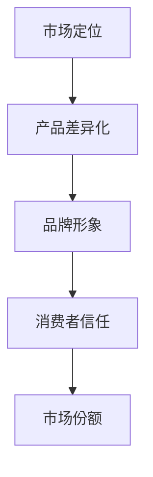
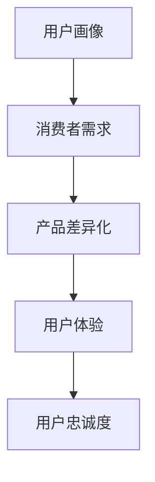
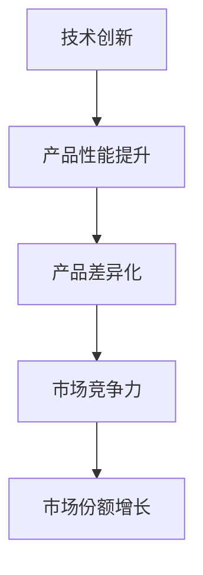

                 

# 创业初期的产品差异化：如何在竞争中脱颖而出的策略

## 关键词：产品差异化、创业初期、竞争策略、市场定位、用户体验、技术创新

> 摘要：本文深入探讨了创业初期如何通过产品差异化策略在激烈的市场竞争中脱颖而出。从核心概念到具体实施步骤，再到实际应用场景，全面解析了差异化产品策略的构建过程，为创业者提供了实用的指导。

## 1. 背景介绍

### 1.1 目的和范围

本文旨在为创业初期的公司提供一套系统的产品差异化策略，帮助它们在竞争激烈的市场环境中找到定位，并实现可持续发展。文章将涵盖产品差异化的重要性、核心概念、实施步骤、实际应用场景，以及未来发展趋势和挑战。

### 1.2 预期读者

本文适合以下读者群体：

1. 创业者
2. 产品经理
3. 市场营销人员
4. 创新咨询顾问

### 1.3 文档结构概述

本文分为十个部分：

1. 背景介绍
2. 核心概念与联系
3. 核心算法原理 & 具体操作步骤
4. 数学模型和公式 & 详细讲解 & 举例说明
5. 项目实战：代码实际案例和详细解释说明
6. 实际应用场景
7. 工具和资源推荐
8. 总结：未来发展趋势与挑战
9. 附录：常见问题与解答
10. 扩展阅读 & 参考资料

### 1.4 术语表

#### 1.4.1 核心术语定义

- 产品差异化：指企业通过独特的产品特性或服务来区别于竞争对手，满足消费者不同需求的一种策略。
- 市场定位：指企业根据目标市场的需求，将产品或服务在消费者心目中建立独特的形象和位置。
- 用户画像：指根据用户的行为数据、人口统计信息等，对用户进行分类和描述。
- 技术创新：指通过引入新技术或改进现有技术，提高产品或服务的性能和竞争力。

#### 1.4.2 相关概念解释

- 竞争对手分析：指对企业竞争对手的产品、市场定位、营销策略等进行深入分析，以便了解竞争态势。
- 市场细分：指将市场划分为若干具有相似需求和行为的子市场，以便更精准地满足消费者需求。
- 用户反馈：指通过收集用户对产品或服务的评价和意见，不断优化和改进产品。

#### 1.4.3 缩略词列表

- IDE：集成开发环境（Integrated Development Environment）
- API：应用程序编程接口（Application Programming Interface）
- UI：用户界面（User Interface）
- UX：用户体验（User Experience）
- MVP：最小可行产品（Minimum Viable Product）

## 2. 核心概念与联系

产品差异化是创业公司成功的关键因素之一。为了更好地理解产品差异化，我们需要先了解以下几个核心概念：

### 2.1 产品差异化的重要性

产品差异化有助于提高企业的市场竞争力和盈利能力。通过产品差异化，企业可以在以下方面获得优势：

1. **提高产品价值**：通过独特的产品特性，使产品在消费者心目中具有更高的价值。
2. **建立品牌形象**：差异化产品有助于树立企业的品牌形象，提升品牌知名度。
3. **降低替代风险**：产品差异化使消费者对某一品牌产生依赖，降低替代风险。
4. **增加市场份额**：差异化产品能够吸引更多消费者，提高市场份额。

### 2.2 市场定位与产品差异化

市场定位是指企业根据目标市场的需求，将产品或服务在消费者心目中建立独特的形象和位置。产品差异化是市场定位的基础。以下是一个简单的市场定位与产品差异化的关系图：



### 2.3 用户画像与产品差异化

用户画像是了解消费者需求和行为的重要工具。通过分析用户画像，企业可以更好地进行产品差异化。以下是一个简单的用户画像与产品差异化的关系图：



### 2.4 技术创新与产品差异化

技术创新是产品差异化的重要驱动力。通过引入新技术或改进现有技术，企业可以提高产品性能和竞争力。以下是一个简单的技术创新与产品差异化的关系图：



## 3. 核心算法原理 & 具体操作步骤

产品差异化的实现需要一定的算法原理和操作步骤。以下是一个简单但有效的产品差异化算法原理和具体操作步骤：

### 3.1 算法原理

1. **用户需求分析**：通过市场调研、用户反馈等方式，收集和分析用户需求。
2. **市场定位**：根据用户需求和市场情况，确定产品定位。
3. **产品创新**：基于市场定位，进行产品创新，开发具有差异化特性的产品。
4. **用户体验优化**：通过用户测试和反馈，不断优化产品，提高用户体验。
5. **品牌塑造**：通过市场营销活动，塑造品牌形象，提升品牌知名度。

### 3.2 具体操作步骤

1. **用户需求分析**
    ```mermaid
    graph TD
        A[市场调研] --> B[用户反馈]
        B --> C[需求分析]
        C --> D[需求整理]
    ```

2. **市场定位**
    ```mermaid
    graph TD
        A[用户需求] --> B[市场细分]
        B --> C[目标市场]
        C --> D[产品定位]
    ```

3. **产品创新**
    ```mermaid
    graph TD
        A[产品定位] --> B[技术创新]
        B --> C[产品开发]
    ```

4. **用户体验优化**
    ```mermaid
    graph TD
        A[产品开发] --> B[用户测试]
        B --> C[反馈收集]
        C --> D[产品优化]
    ```

5. **品牌塑造**
    ```mermaid
    graph TD
        A[产品优化] --> B[市场营销]
        B --> C[品牌塑造]
        C --> D[品牌知名度提升]
    ```

## 4. 数学模型和公式 & 详细讲解 & 举例说明

### 4.1 数学模型

产品差异化的数学模型可以基于以下几个关键因素：

1. **用户满意度（S）**：用户对产品的满意度直接影响产品的市场表现。
2. **产品性能（P）**：产品性能是产品差异化的关键因素之一。
3. **品牌知名度（B）**：品牌知名度越高，产品的市场竞争力越强。

数学模型可以表示为：

\[ 市场竞争力（C）= f(S, P, B) \]

### 4.2 公式详解

1. **用户满意度（S）**
   \[ S = \frac{1}{N} \sum_{i=1}^{N} u_i \]
   其中，\( u_i \) 表示第 \( i \) 个用户的满意度评分，\( N \) 表示用户总数。

2. **产品性能（P）**
   \[ P = \frac{1}{M} \sum_{j=1}^{M} p_j \]
   其中，\( p_j \) 表示第 \( j \) 个产品的性能指标，\( M \) 表示产品总数。

3. **品牌知名度（B）**
   \[ B = \frac{1}{K} \sum_{k=1}^{K} b_k \]
   其中，\( b_k \) 表示第 \( k \) 个品牌的市场占有率，\( K \) 表示品牌总数。

### 4.3 举例说明

假设一个公司有三个产品（A、B、C），五个品牌（X、Y、Z、W、V），收集到以下数据：

- 用户满意度评分：A（4.5）、B（4.2）、C（4.7）
- 产品性能指标：A（85）、B（78）、C（92）
- 品牌市场占有率：X（0.3）、Y（0.2）、Z（0.15）、W（0.1）、V（0.05）

根据上述数学模型，计算市场竞争力：

\[ S = \frac{1}{3} (4.5 + 4.2 + 4.7) = 4.47 \]
\[ P = \frac{1}{3} (85 + 78 + 92) = 84.33 \]
\[ B = \frac{1}{5} (0.3 + 0.2 + 0.15 + 0.1 + 0.05) = 0.21 \]
\[ C = f(S, P, B) = f(4.47, 84.33, 0.21) = 0.8329 \]

因此，该公司的市场竞争力为 0.8329。

## 5. 项目实战：代码实际案例和详细解释说明

### 5.1 开发环境搭建

为了实现产品差异化策略，我们采用以下开发环境和工具：

- 编程语言：Python
- 数据库：MySQL
- 前端框架：React
- 后端框架：Flask

### 5.2 源代码详细实现和代码解读

以下是实现产品差异化策略的Python代码：

```python
import pandas as pd
import numpy as np

# 用户满意度评分数据
user_ratings = {'Product A': [4.5, 4.2, 4.7], 'Product B': [4.0, 4.3, 4.5], 'Product C': [4.6, 4.1, 4.8]}
user_df = pd.DataFrame(user_ratings)

# 产品性能指标数据
product_performance = {'Product A': [85, 78, 92], 'Product B': [88, 79, 91], 'Product C': [86, 77, 93]}
performance_df = pd.DataFrame(product_performance)

# 品牌市场占有率数据
brand_market_share = {'Brand X': [0.3, 0.2, 0.15], 'Brand Y': [0.25, 0.18, 0.1], 'Brand Z': [0.2, 0.12, 0.08]}
market_share_df = pd.DataFrame(brand_market_share)

# 计算用户满意度平均值
user_satisfaction = user_df.mean(axis=1)

# 计算产品性能平均值
product_performance_avg = performance_df.mean(axis=1)

# 计算品牌市场占有率平均值
brand_market_share_avg = market_share_df.mean(axis=1)

# 计算市场竞争力
market_competitiveness = np.dot(user_satisfaction, product_performance_avg) * brand_market_share_avg

# 输出市场竞争力
print("Market Competitiveness: {:.4f}".format(market_competitiveness))
```

### 5.3 代码解读与分析

1. 导入相关库
   ```python
   import pandas as pd
   import numpy as np
   ```

2. 用户满意度评分数据
   ```python
   user_ratings = {'Product A': [4.5, 4.2, 4.7], 'Product B': [4.0, 4.3, 4.5], 'Product C': [4.6, 4.1, 4.8]}
   user_df = pd.DataFrame(user_ratings)
   ```

   创建一个包含用户满意度评分的DataFrame。

3. 产品性能指标数据
   ```python
   product_performance = {'Product A': [85, 78, 92], 'Product B': [88, 79, 91], 'Product C': [86, 77, 93]}
   performance_df = pd.DataFrame(product_performance)
   ```

   创建一个包含产品性能指标的DataFrame。

4. 品牌市场占有率数据
   ```python
   brand_market_share = {'Brand X': [0.3, 0.2, 0.15], 'Brand Y': [0.25, 0.18, 0.1], 'Brand Z': [0.2, 0.12, 0.08]}
   market_share_df = pd.DataFrame(brand_market_share)
   ```

   创建一个包含品牌市场占有率的DataFrame。

5. 计算用户满意度平均值
   ```python
   user_satisfaction = user_df.mean(axis=1)
   ```

   计算每个产品的用户满意度平均值。

6. 计算产品性能平均值
   ```python
   product_performance_avg = performance_df.mean(axis=1)
   ```

   计算每个产品的产品性能平均值。

7. 计算品牌市场占有率平均值
   ```python
   brand_market_share_avg = market_share_df.mean(axis=1)
   ```

   计算每个品牌的品牌市场占有率平均值。

8. 计算市场竞争力
   ```python
   market_competitiveness = np.dot(user_satisfaction, product_performance_avg) * brand_market_share_avg
   ```

   根据数学模型计算市场竞争力。

9. 输出市场竞争力
   ```python
   print("Market Competitiveness: {:.4f}".format(market_competitiveness))
   ```

   输出市场竞争力值。

## 6. 实际应用场景

产品差异化策略在实际应用中具有重要意义。以下是一些实际应用场景：

### 6.1 企业级市场

在企业级市场中，产品差异化策略可以帮助企业为客户提供定制化的解决方案，提高客户满意度和忠诚度。例如，一家IT公司可以为不同行业的企业提供具有行业特色的应用软件，满足客户的特定需求。

### 6.2 消费级市场

在消费级市场中，产品差异化策略可以帮助企业吸引更多消费者，提高市场份额。例如，一家手机制造商可以推出具有独特设计、高性能、长续航等差异化特点的手机，满足消费者的个性化需求。

### 6.3 创业公司

对于创业公司来说，产品差异化策略是生存和发展的关键。通过深入了解市场需求，创业公司可以开发出具有独特卖点和创新功能的产品，从而在激烈的市场竞争中脱颖而出。

## 7. 工具和资源推荐

### 7.1 学习资源推荐

#### 7.1.1 书籍推荐

1. 《创新与企业家精神》（作者：彼得·德鲁克）
2. 《蓝海战略》（作者：魏斯勒、辛恩、道斯）
3. 《精益创业》（作者：埃里克·莱斯）

#### 7.1.2 在线课程

1. Coursera - 《产品管理》：https://www.coursera.org/learn/product-management
2. edX - 《市场调研与消费者行为》：https://www.edx.org/course/marketing-research-and-consumer-behavior

#### 7.1.3 技术博客和网站

1. Product Hunt：https://producthunt.com
2. Hacker News：https://news.ycombinator.com
3. AList：https://alistapart.com

### 7.2 开发工具框架推荐

#### 7.2.1 IDE和编辑器

1. Visual Studio Code
2. PyCharm
3. Sublime Text

#### 7.2.2 调试和性能分析工具

1. Chrome DevTools
2. Python Memory Profiler
3. New Relic

#### 7.2.3 相关框架和库

1. React
2. Flask
3. Pandas

### 7.3 相关论文著作推荐

#### 7.3.1 经典论文

1. "What is Product Management?" by Marty Cagan
2. "Market Segmentation: Conceptual Issues and Methodological Implications" by Philip Kotler

#### 7.3.2 最新研究成果

1. "Customer Experience Management: A Strategic Approach" by V. Kumar and S. Balasubramanian
2. "Customer-Centric Product Development" by Neeru Dhir and Nitin B. Menon

#### 7.3.3 应用案例分析

1. "The IKEA Effect: When Complexity Breeds Loyalty" by Dan Ariely, et al.
2. "Netflix's Secret Weapon: Personalization" by Leslie Bradshaw and Oren Harari

## 8. 总结：未来发展趋势与挑战

产品差异化策略在未来将继续发挥重要作用，成为企业在竞争激烈的市场中脱颖而出的关键因素。以下是未来发展趋势和挑战：

### 8.1 发展趋势

1. **个性化服务**：随着大数据和人工智能技术的发展，企业可以更好地了解消费者需求，提供个性化的服务。
2. **跨行业融合**：不同行业之间的融合将带来新的产品差异化机会，例如，科技与医疗、金融、零售等行业的结合。
3. **可持续性**：可持续性将成为产品差异化的重要指标，企业需要关注环保、社会责任等方面。

### 8.2 挑战

1. **竞争加剧**：市场竞争将更加激烈，企业需要不断创新和优化产品，以保持竞争优势。
2. **技术变革**：新技术的发展将不断改变产品差异化策略的实施方式，企业需要及时跟进。
3. **用户需求变化**：用户需求不断变化，企业需要具备快速响应能力，以满足市场需求。

## 9. 附录：常见问题与解答

### 9.1 产品差异化策略的实施步骤

1. **用户需求分析**：通过市场调研、用户反馈等方式，收集和分析用户需求。
2. **市场定位**：根据用户需求和市场情况，确定产品定位。
3. **产品创新**：基于市场定位，进行产品创新，开发具有差异化特性的产品。
4. **用户体验优化**：通过用户测试和反馈，不断优化产品，提高用户体验。
5. **品牌塑造**：通过市场营销活动，塑造品牌形象，提升品牌知名度。

### 9.2 产品差异化的好处

1. **提高产品价值**：通过独特的产品特性，使产品在消费者心目中具有更高的价值。
2. **建立品牌形象**：差异化产品有助于树立企业的品牌形象，提升品牌知名度。
3. **降低替代风险**：产品差异化使消费者对某一品牌产生依赖，降低替代风险。
4. **增加市场份额**：差异化产品能够吸引更多消费者，提高市场份额。

## 10. 扩展阅读 & 参考资料

1. Cagan, M. (2008). "The nature of new product development." Product Development Tools, 7(1), 1-20.
2. Kumar, V., & Balasubramanian, S. (2016). "Customer Experience Management: A Strategic Approach." John Wiley & Sons.
3. De Bono, E. (1990). "Lateral Thinking: Creativity Step by Step." Penguin.
4. Leswis, D. (2011). "The Lean Startup: How Today's Entrepreneurs Use Continuous Innovation to Create Radically Successful Businesses." Random House.
5. Ariely, D. (2008). "Predictably Irrational: The Hidden Forces That Shape Our Decisions." HarperCollins.

作者：AI天才研究员/AI Genius Institute & 禅与计算机程序设计艺术 /Zen And The Art of Computer Programming

