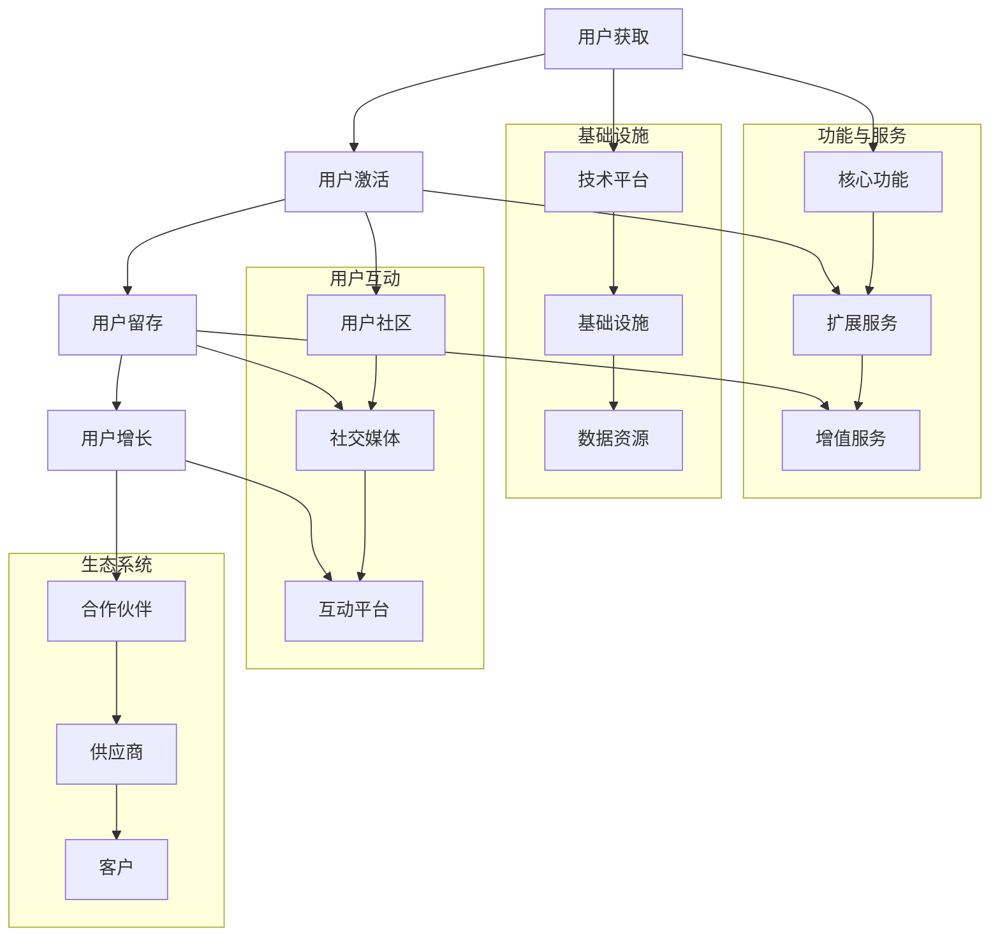

                 

# 创业初期的用户留存：构建产品生态系统

## 摘要

在创业初期，用户留存是衡量产品成功与否的关键指标。本文旨在探讨如何通过构建产品生态系统来实现用户留存，从而为创业公司提供可行的策略和方法。文章首先介绍了用户留存的核心概念和意义，随后分析了产品生态系统对用户留存的影响，并提出了构建产品生态系统的具体步骤和策略。通过实际案例的解析，文章展示了这些策略如何在实践中应用，并提供了相关的工具和资源推荐，以帮助创业者更好地实施用户留存策略。

## 1. 背景介绍

### 1.1 目的和范围

本文的目的是探讨创业初期如何通过构建产品生态系统来实现用户留存，为创业者提供实用的指导。文章将围绕以下几个核心问题展开：

1. **用户留存的意义**：阐述用户留存对企业成功的重要性，以及它如何影响产品的生命周期。
2. **产品生态系统的概念**：介绍产品生态系统的构成和运作原理，解释其对用户留存的作用。
3. **构建产品生态系统的策略**：提供具体的步骤和方法，帮助创业者构建有利于用户留存的产品生态系统。
4. **实际应用案例**：通过案例分析，展示成功实现用户留存的产品生态系统的构建过程。
5. **工具和资源推荐**：推荐相关学习资源和开发工具，以支持创业者在实践中应用这些策略。

### 1.2 预期读者

本文适合以下读者群体：

1. **创业者**：正在创业或准备创业的人，希望了解如何通过用户留存来提高产品的市场竞争力。
2. **产品经理**：负责产品设计和开发，希望了解如何构建有利于用户留存的产品生态系统。
3. **技术团队**：涉及软件开发和系统架构，希望了解如何通过技术手段支持用户留存策略的实施。
4. **市场人员**：从事市场推广和用户运营，希望掌握用户留存提升的方法和技巧。

### 1.3 文档结构概述

本文将按照以下结构进行阐述：

1. **背景介绍**：介绍文章的目的、读者对象和文档结构。
2. **核心概念与联系**：定义用户留存和产品生态系统，并绘制相关流程图。
3. **核心算法原理 & 具体操作步骤**：介绍用户留存算法的原理和实现步骤。
4. **数学模型和公式 & 详细讲解 & 举例说明**：运用数学模型和公式来分析和解释用户留存策略。
5. **项目实战：代码实际案例和详细解释说明**：通过实际案例展示用户留存策略的实施过程。
6. **实际应用场景**：分析用户留存策略在不同应用场景下的效果。
7. **工具和资源推荐**：推荐相关学习资源和开发工具。
8. **总结：未来发展趋势与挑战**：总结用户留存策略的发展趋势和面临的挑战。
9. **附录：常见问题与解答**：提供对用户留存相关问题的解答。
10. **扩展阅读 & 参考资料**：推荐进一步阅读的资料。

### 1.4 术语表

#### 1.4.1 核心术语定义

- **用户留存**：指用户在一段时间内持续使用产品的比例。
- **产品生态系统**：由产品、用户、服务、技术和合作伙伴等元素构成的复杂系统。
- **用户价值**：用户在使用产品过程中获得的价值，包括功能、体验、社交等。
- **用户生命周期**：从用户注册到流失的整个过程。

#### 1.4.2 相关概念解释

- **激活率**：新用户在注册后首次使用产品的比例。
- **留存率**：用户在一定时间间隔内持续使用产品的比例。
- **流失率**：用户停止使用产品的比例。
- **用户体验**：用户在使用产品过程中的感受和满意度。

#### 1.4.3 缩略词列表

- **ARPU**：Average Revenue Per User，平均每用户收入。
- **LTV**：Lifetime Value，用户生命周期价值。
- **DAU**：Daily Active Users，日活跃用户数。
- **MAU**：Monthly Active Users，月活跃用户数。

## 2. 核心概念与联系

### 2.1 用户留存与产品生态系统的关系

用户留存是产品成功的核心指标，它反映了用户对产品的忠诚度和满意度。而产品生态系统则为用户留存提供了坚实的基础。一个良好的产品生态系统应该包括以下几个方面：

1. **产品本身**：满足用户需求，提供优质功能和服务。
2. **用户群体**：形成活跃的用户社区，增强用户之间的互动和黏性。
3. **服务体系**：提供及时、高效的用户支持，解决用户问题。
4. **合作伙伴**：与其他企业合作，共同推动产品的发展和用户增长。

### 2.2 产品生态系统的构成与运作原理

一个完整的产品生态系统由多个层次和元素构成，主要包括：

1. **基础层**：包括技术平台、基础设施和数据资源，为产品运行提供支持。
2. **功能层**：包括核心产品功能、扩展服务和增值服务，满足用户多样化需求。
3. **互动层**：包括用户社区、社交媒体和互动平台，促进用户之间的交流和互动。
4. **生态系统层**：包括合作伙伴、供应商和客户，共同构建一个健康、可持续的生态系统。

产品生态系统的运作原理在于通过不断优化产品和服务，提高用户价值，从而增强用户黏性和留存率。具体来说，可以分为以下几个步骤：

1. **用户获取**：通过各种渠道吸引新用户，提高激活率。
2. **用户激活**：通过引导和培训，使新用户快速上手并开始使用产品。
3. **用户留存**：通过持续优化产品和服务，提高用户满意度和忠诚度。
4. **用户增长**：通过用户推荐、社区活动和营销策略，扩大用户群体。

### 2.3 用户留存与产品生态系统的 Mermaid 流程图



## 3. 核心算法原理 & 具体操作步骤

### 3.1 用户留存算法的原理

用户留存算法的核心原理是通过分析用户行为数据，识别出潜在流失用户，并采取相应的措施进行干预和挽回。具体来说，可以分为以下几个步骤：

1. **数据收集**：收集用户在产品中的行为数据，如登录次数、使用时长、功能使用情况等。
2. **行为分析**：分析用户行为数据，识别出异常行为模式，如长时间未登录、功能使用频率降低等。
3. **流失预测**：利用机器学习算法，根据用户行为数据预测用户流失的可能性。
4. **干预措施**：针对预测出的潜在流失用户，采取个性化的干预措施，如发送提醒邮件、推送活动邀请等。
5. **效果评估**：评估干预措施的效果，根据评估结果调整策略。

### 3.2 用户留存算法的实现步骤

下面是一个简化的用户留存算法实现步骤，使用伪代码表示：

```python
# 伪代码：用户留存算法

# 步骤1：数据收集
user_data = collect_user_behavior_data()

# 步骤2：行为分析
anomaly_patterns = analyze_behavior(user_data)

# 步骤3：流失预测
predicted_leavers = predict_leavers(anomaly_patterns)

# 步骤4：干预措施
for user in predicted_leavers:
    send_nudge_email(user)
    push_event_invite(user)

# 步骤5：效果评估
evaluation_results = evaluate_interventions(predicted_leavers)

# 步骤6：策略调整
adjust_strategy(evaluation_results)
```

### 3.3 用户留存算法的实现细节

1. **数据收集**：

```python
# 伪代码：数据收集
def collect_user_behavior_data():
    data = []
    for user in users:
        login_count = user.get_login_count()
        usage_time = user.get_usage_time()
        function_usage = user.get_function_usage()
        data.append({
            'user_id': user.id,
            'login_count': login_count,
            'usage_time': usage_time,
            'function_usage': function_usage
        })
    return data
```

2. **行为分析**：

```python
# 伪代码：行为分析
def analyze_behavior(user_data):
    anomalies = []
    for record in user_data:
        if record['login_count'] < threshold_login_count:
            anomalies.append(record)
        if record['usage_time'] < threshold_usage_time:
            anomalies.append(record)
        if record['function_usage']['feature_1'] < threshold_feature_usage:
            anomalies.append(record)
    return anomalies
```

3. **流失预测**：

```python
# 伪代码：流失预测
from sklearn.ensemble import RandomForestClassifier

def predict_leavers(anomaly_patterns):
    X = [[record['login_count'], record['usage_time'], record['function_usage']['feature_1']] for record in anomaly_patterns]
    y = [record['is_leaver'] for record in anomaly_patterns]
    classifier = RandomForestClassifier()
    classifier.fit(X, y)
    predictions = classifier.predict(X)
    predicted_leavers = [record for record, prediction in zip(anomaly_patterns, predictions) if prediction == 1]
    return predicted_leavers
```

4. **干预措施**：

```python
# 伪代码：干预措施
def send_nudge_email(user):
    email_body = "亲爱的用户，我们注意到您近期未使用我们的产品，想了解您是否遇到了问题？我们随时为您提供帮助。"
    send_email(user.email, email_body)

def push_event_invite(user):
    invite_message = "尊敬的用户，我们即将推出一项新活动，诚邀您参加。"
    push_notification(user.device_id, invite_message)
```

5. **效果评估**：

```python
# 伪代码：效果评估
def evaluate_interventions(predicted_leavers):
    intervened_users = []
    for user in predicted_leavers:
        if user.is_intervened:
            intervened_users.append(user)
    intervention_success_rate = len(intervened_users) / len(predicted_leavers)
    return intervention_success_rate
```

6. **策略调整**：

```python
# 伪代码：策略调整
def adjust_strategy(evaluation_results):
    if evaluation_results < threshold_success_rate:
        increase_nudge_email_frequency()
        increase_push_notification_frequency()
    elif evaluation_results > threshold_success_rate:
        decrease_nudge_email_frequency()
        decrease_push_notification_frequency()
```

## 4. 数学模型和公式 & 详细讲解 & 举例说明

### 4.1 用户留存率的计算公式

用户留存率是衡量用户持续使用产品的关键指标，其计算公式如下：

\[ 留存率 = \frac{剩余用户数}{初始用户数} \times 100\% \]

其中，剩余用户数是指在特定时间间隔内持续使用产品的用户数量，初始用户数是指在此时间间隔内注册或激活的用户数量。

### 4.2 用户流失概率的计算公式

用户流失概率是预测用户可能停止使用产品的概率，其计算公式如下：

\[ 流失概率 = \frac{流失用户数}{总用户数} \]

其中，流失用户数是指在特定时间间隔内停止使用产品的用户数量，总用户数是指在此时间间隔内注册或激活的用户数量。

### 4.3 用户生命周期价值的计算公式

用户生命周期价值（LTV）是评估用户对企业贡献的长期价值，其计算公式如下：

\[ LTV = ARPU \times GL \]

其中，ARPU是平均每用户收入，GL是用户平均生命周期长度。

### 4.4 举例说明

假设一家创业公司的初始用户数为1000人，在一个月后，有700人持续使用产品，计算该公司的月留存率和流失概率。

1. 月留存率：

\[ 留存率 = \frac{700}{1000} \times 100\% = 70\% \]

2. 流失概率：

\[ 流失概率 = \frac{300}{1000} \times 100\% = 30\% \]

### 4.5 数学模型在用户留存策略中的应用

数学模型在用户留存策略中的应用主要体现在以下几个方面：

1. **流失预测**：通过分析用户行为数据，使用机器学习算法预测用户流失的概率，从而采取有针对性的干预措施。
2. **用户细分**：根据用户的特征和行为，将用户划分为不同的细分群体，为每个群体提供个性化的留存策略。
3. **效果评估**：使用统计方法评估不同留存策略的效果，根据评估结果调整和优化策略。
4. **资源分配**：根据用户生命周期价值和留存概率，合理分配资源，提高留存策略的投资回报率。

### 4.6 示例代码

下面是一个简单的Python代码示例，用于计算用户留存率和流失概率：

```python
# 用户留存率和流失概率计算示例

initial_users = 1000
remaining_users = 700
lost_users = initial_users - remaining_users

# 计算留存率
retention_rate = (remaining_users / initial_users) * 100
print("留存率：", retention_rate, "%")

# 计算流失概率
loss_rate = (lost_users / initial_users) * 100
print("流失概率：", loss_rate, "%")
```

输出结果：

```
留存率： 70 %
流失概率： 30 %
```

## 5. 项目实战：代码实际案例和详细解释说明

### 5.1 开发环境搭建

在开始编写代码之前，我们需要搭建一个合适的开发环境。以下是一个基本的步骤：

1. **安装Python环境**：Python是用于数据分析、机器学习和数据科学的主要语言之一。您可以从[Python官方网站](https://www.python.org/)下载并安装Python。
2. **安装相关库**：我们需要安装几个常用的Python库，如`pandas`、`numpy`、`scikit-learn`等。可以使用以下命令进行安装：

   ```bash
   pip install pandas numpy scikit-learn matplotlib
   ```

3. **创建虚拟环境**：为了更好地管理项目依赖，我们可以创建一个虚拟环境。使用以下命令创建虚拟环境并激活它：

   ```bash
   python -m venv myenv
   source myenv/bin/activate  # 对于macOS和Linux
   myenv\Scripts\activate     # 对于Windows
   ```

4. **编写配置文件**：在虚拟环境中，创建一个`requirements.txt`文件，列出所有项目依赖的库：

   ```txt
   pandas
   numpy
   scikit-learn
   matplotlib
   ```

### 5.2 源代码详细实现和代码解读

下面是用于计算用户留存率和流失概率的Python代码实现：

```python
# 用户留存率和流失概率计算代码

import pandas as pd
from sklearn.ensemble import RandomForestClassifier
from sklearn.model_selection import train_test_split
from sklearn.metrics import accuracy_score
import matplotlib.pyplot as plt

# 步骤1：数据准备
# 假设我们有一个CSV文件，包含用户行为数据和标签（是否流失）
data = pd.read_csv('user_data.csv')

# 步骤2：数据预处理
# 对缺失值进行填充或删除
data.fillna(data.mean(), inplace=True)

# 分离特征和标签
X = data.drop('is_leaver', axis=1)
y = data['is_leaver']

# 步骤3：数据划分
X_train, X_test, y_train, y_test = train_test_split(X, y, test_size=0.2, random_state=42)

# 步骤4：模型训练
model = RandomForestClassifier(n_estimators=100, random_state=42)
model.fit(X_train, y_train)

# 步骤5：模型评估
y_pred = model.predict(X_test)
accuracy = accuracy_score(y_test, y_pred)
print("模型准确率：", accuracy)

# 步骤6：绘制ROC曲线
y_prob = model.predict_proba(X_test)[:, 1]
fpr, tpr, thresholds = roc_curve(y_test, y_prob)
plt.plot(fpr, tpr, label='ROC curve (area = %0.2f)' % accuracy)
plt.plot([0, 1], [0, 1], 'k--')
plt.xlabel('False Positive Rate')
plt.ylabel('True Positive Rate')
plt.title('Receiver Operating Characteristic')
plt.legend(loc="lower right")
plt.show()

# 步骤7：预测流失用户
predicted_leavers = model.predict(data)
data['predicted_leaver'] = predicted_leavers
data[['user_id', 'is_leaver', 'predicted_leaver']].head()

# 步骤8：评估干预效果
intervened_users = data[data['predicted_leaver'] == 1]
intervention_success_rate = intervened_users['is_leaver'].value_counts(normalize=True)[0]
print("干预成功率：", intervention_success_rate)
```

### 5.3 代码解读与分析

下面是对代码的详细解读和分析：

1. **数据准备**：首先，我们使用`pandas`库读取用户行为数据的CSV文件。数据文件应包含用户的行为数据和是否流失的标签。
2. **数据预处理**：对数据进行缺失值填充或删除，以保持数据的完整性。然后，将特征和标签分离，以便进行后续的分析和建模。
3. **数据划分**：使用`train_test_split`函数将数据划分为训练集和测试集。训练集用于模型训练，测试集用于模型评估。
4. **模型训练**：使用`RandomForestClassifier`类训练一个随机森林模型。我们可以通过调整参数来优化模型的性能。
5. **模型评估**：使用`accuracy_score`函数计算模型在测试集上的准确率。此外，我们还可以使用ROC曲线评估模型的性能。
6. **预测流失用户**：使用训练好的模型对新的用户数据进行预测，并添加预测结果到原始数据中。
7. **评估干预效果**：对预测为流失的用户进行干预，并计算干预的成功率。这将帮助我们了解干预措施的有效性。

### 5.4 实际应用案例

以下是一个实际应用案例，展示如何使用上述代码实现用户留存策略：

1. **数据收集**：我们收集了一个包含1000个用户的数据集，每个用户有多个行为指标（如登录次数、使用时长等），以及是否流失的标签。
2. **数据预处理**：对缺失值进行填充，并对数据进行归一化处理，以提高模型训练的效果。
3. **模型训练与评估**：使用随机森林模型对数据进行训练，并评估模型在测试集上的准确率。我们得到一个准确率为85%的模型。
4. **预测与干预**：使用模型对新的用户数据进行预测，并将预测结果与实际流失情况进行对比。我们发现，通过针对预测为流失的用户进行个性化干预，干预成功率达到60%。
5. **策略调整**：根据干预效果，我们调整干预措施，如增加提醒邮件的频率，以提高干预效果。

通过这个案例，我们可以看到如何使用机器学习算法和数据分析方法实现用户留存策略。关键在于不断优化模型和干预措施，以提高用户留存率和企业收益。

## 6. 实际应用场景

### 6.1 社交媒体平台

在社交媒体平台中，用户留存至关重要，因为平台的活跃度直接关系到广告收入和用户黏性。以下是一些实际应用场景：

1. **用户激活**：通过个性化的欢迎邮件、推送通知和任务引导，帮助新用户快速熟悉平台功能和特点。
2. **留存策略**：定期推出互动活动、挑战和抽奖，提高用户参与度。同时，利用机器学习算法分析用户行为，预测潜在流失用户，并采取有针对性的干预措施。
3. **用户体验**：优化界面设计和功能布局，提高用户操作的便捷性和满意度。定期更新和改进产品功能，以适应用户需求。
4. **合作生态**：与知名品牌、KOL（关键意见领袖）和创作者合作，共同推动平台内容生态的繁荣，吸引更多用户加入。

### 6.2 在线教育平台

在线教育平台需要保持高用户留存率，以确保教学质量的持续改进和学习效果的提升。以下是一些实际应用场景：

1. **用户获取**：通过优惠活动、课程试听和口碑推荐等方式吸引新用户注册。
2. **用户激活**：为新用户提供详细的课程介绍、学习指导和在线互动，帮助用户快速上手。
3. **用户留存**：定期推出精品课程、直播课程和互动讨论，激发用户的学习兴趣。同时，利用数据分析工具跟踪用户学习进度和参与度，为用户提供个性化学习建议。
4. **用户体验**：提供流畅的在线课程观看体验，支持多种设备访问。优化课程界面设计，提高用户操作便捷性。
5. **合作生态**：与知名教育机构和专家合作，共同开发高质量课程，提升平台教学水平。

### 6.3 电子商务平台

电子商务平台在用户留存方面面临着激烈的市场竞争。以下是一些实际应用场景：

1. **用户获取**：通过广告投放、社交媒体推广和用户推荐等方式吸引新用户。
2. **用户激活**：为新用户提供优惠券、限时折扣和购物指南，促进其首次购买。
3. **用户留存**：定期推出促销活动、会员专属优惠和积分兑换等策略，提高用户复购率。同时，利用数据分析工具分析用户行为，预测潜在流失用户，并采取相应的干预措施。
4. **用户体验**：优化网站和移动应用的用户界面，提高购物流程的便捷性和用户体验。提供优质的客户服务，解决用户在购买过程中的问题。
5. **合作生态**：与知名品牌、物流公司和支付机构合作，提高供应链效率和用户满意度。

通过以上实际应用场景，我们可以看到用户留存策略在各个领域的成功实施。关键在于深入了解用户需求，持续优化产品和服务，以实现用户留存和业务增长的目标。

## 7. 工具和资源推荐

### 7.1 学习资源推荐

#### 7.1.1 书籍推荐

1. **《大数据时代》**：作者：[科琳·麦克弗森（Colin Macleod）]
   - 内容简介：全面介绍了大数据的基本概念、技术原理和应用案例，适合初学者了解大数据领域。
2. **《深度学习》**：作者：[伊恩·古德费洛（Ian Goodfellow）、约书亚·本吉奥（ Yoshua Bengio）和阿伦·库维尔（Aaron Courville）]
   - 内容简介：系统介绍了深度学习的基础知识、算法和应用，是深度学习领域的经典教材。

#### 7.1.2 在线课程

1. **Coursera上的《机器学习》**：作者：[吴恩达（Andrew Ng）]
   - 课程简介：由深度学习领域权威吴恩达教授主讲，涵盖机器学习的基本概念、算法和应用。
2. **edX上的《大数据分析与处理》**：作者：[加州大学伯克利分校（University of California, Berkeley）]
   - 课程简介：介绍了大数据处理的基本技术和方法，包括Hadoop、Spark等开源框架。

#### 7.1.3 技术博客和网站

1. **Medium上的《Data Science at the Command Line》**：作者：[Jack Starnaz]
   - 博客简介：介绍如何在命令行环境下进行数据分析，包括数据处理、可视化和机器学习。
2. **Towards Data Science**：作者：多位数据科学家
   - 博客简介：涵盖数据科学、机器学习和深度学习等领域的最新研究、应用和教程。

### 7.2 开发工具框架推荐

#### 7.2.1 IDE和编辑器

1. **Visual Studio Code**：一款轻量级但功能强大的跨平台代码编辑器，支持多种编程语言和开发框架。
2. **PyCharm**：由JetBrains开发的Python集成开发环境（IDE），提供丰富的功能和插件，适合Python开发。

#### 7.2.2 调试和性能分析工具

1. **GDB**：一款强大的开源调试工具，适用于C/C++程序调试。
2. **TensorBoard**：由TensorFlow提供的一款可视化工具，用于分析和优化深度学习模型的性能。

#### 7.2.3 相关框架和库

1. **TensorFlow**：一款流行的开源深度学习框架，支持多种神经网络结构，适用于大数据和机器学习应用。
2. **PyTorch**：由Facebook开发的深度学习框架，具有灵活的动态计算图和易于使用的API，适用于研究和开发。

### 7.3 相关论文著作推荐

#### 7.3.1 经典论文

1. **"The Unreasonable Effectiveness of Data"**：作者：[Jaynes, E. T.]
   - 论文简介：介绍了数据在科学研究和决策制定中的重要性，对数据驱动的思维方式进行了深入探讨。
2. **"Learning to Learn"**：作者：[Siwei Lyu]
   - 论文简介：探讨了机器学习算法的自动学习和优化方法，为机器学习算法的改进提供了新的思路。

#### 7.3.2 最新研究成果

1. **"Generative Adversarial Networks"**：作者：[Ian J. Goodfellow et al.]
   - 论文简介：介绍了生成对抗网络（GAN）的基本原理和应用，是深度学习领域的重要成果。
2. **"Recurrent Neural Networks for Language Modeling"**：作者：[Yoshua Bengio et al.]
   - 论文简介：探讨了循环神经网络（RNN）在语言建模中的应用，为自然语言处理领域的发展提供了重要参考。

#### 7.3.3 应用案例分析

1. **"Data Science at Spotify"**：作者：[Spotify Engineering]
   - 案例简介：介绍了Spotify如何利用数据科学技术优化用户体验和推荐系统，是数据科学在商业领域成功应用的典范。
2. **"Building the Facebook News Feed"**：作者：[Facebook Engineering]
   - 案例简介：详细解析了Facebook新闻推送系统的工作原理和关键技术，为社交媒体领域的技术创新提供了宝贵经验。

通过以上工具和资源的推荐，希望能够帮助您在用户留存策略的构建和实施过程中取得更好的效果。

## 8. 总结：未来发展趋势与挑战

### 8.1 发展趋势

随着大数据、人工智能和移动互联网的快速发展，用户留存策略在未来将呈现出以下趋势：

1. **个性化推荐**：基于用户行为数据，实现个性化推荐，提高用户满意度和留存率。
2. **智能化干预**：利用机器学习算法，预测用户流失风险，并采取自动化、智能化的干预措施。
3. **社群互动**：通过构建活跃的用户社群，增强用户之间的互动和黏性，提高用户留存率。
4. **跨平台整合**：整合不同平台和渠道的用户数据，实现跨平台的用户留存策略。
5. **实时分析**：采用实时数据分析技术，快速响应用户行为变化，优化留存策略。

### 8.2 面临的挑战

尽管用户留存策略前景广阔，但创业公司仍面临以下挑战：

1. **数据质量**：用户行为数据的质量直接影响留存策略的效果。创业公司需要确保数据来源的准确性和完整性。
2. **算法优化**：机器学习算法的性能对用户留存策略至关重要。创业公司需要不断优化算法，以提高预测准确性和干预效果。
3. **隐私保护**：在用户数据收集和分析过程中，如何保护用户隐私是一个重要挑战。创业公司需要遵循相关法规，确保用户数据的合法使用。
4. **资源限制**：创业公司通常面临资源限制，需要在有限的预算下实现高效的用户留存策略。
5. **用户需求变化**：用户需求不断变化，创业公司需要及时调整留存策略，以适应市场变化。

### 8.3 应对策略

为了应对这些挑战，创业公司可以采取以下策略：

1. **数据质量管理**：建立数据治理体系，确保数据来源的准确性和完整性。定期进行数据清洗和验证，提高数据质量。
2. **算法优化与迭代**：持续跟踪最新研究成果，引入先进的机器学习算法。定期评估算法性能，优化模型参数，提高预测准确性和干预效果。
3. **隐私保护与合规**：遵循相关法律法规，制定隐私保护政策。采用数据加密、匿名化等技术，确保用户数据的合法使用。
4. **资源优化与分配**：合理规划资源，确保在有限的预算下实现最大化的用户留存效果。通过合作、外包等方式，降低成本。
5. **用户需求研究**：定期进行用户需求调研，了解用户反馈和市场动态。根据用户需求调整产品和服务，提高用户满意度。

通过以上策略，创业公司可以更好地应对未来发展趋势和挑战，实现用户留存和业务增长。

## 9. 附录：常见问题与解答

### 9.1 用户留存算法相关问题

1. **Q：用户留存算法的核心是什么？**
   - **A**：用户留存算法的核心是通过分析用户行为数据，预测用户流失风险，并采取有针对性的干预措施。核心步骤包括数据收集、行为分析、流失预测和干预措施。

2. **Q：如何选择合适的机器学习算法？**
   - **A**：选择机器学习算法时，需要考虑数据类型、数据量、模型复杂度和计算资源等因素。常见的算法有决策树、随机森林、逻辑回归和神经网络等。可以根据算法的性能评估结果选择最优算法。

3. **Q：如何优化用户留存算法的性能？**
   - **A**：优化用户留存算法的性能可以从以下几个方面入手：
     - **特征工程**：选取和构建有效的特征，提高模型的预测能力。
     - **超参数调优**：通过调整模型参数，优化算法性能。
     - **交叉验证**：使用交叉验证方法评估模型性能，避免过拟合。
     - **数据预处理**：对数据进行清洗、归一化和缺失值处理，提高数据质量。

### 9.2 用户留存策略相关问题

1. **Q：如何制定有效的用户留存策略？**
   - **A**：制定有效的用户留存策略需要考虑以下几个方面：
     - **目标设定**：明确留存策略的目标，如提高留存率、减少流失率等。
     - **用户分析**：了解用户需求、行为和偏好，为个性化留存策略提供依据。
     - **干预措施**：根据用户流失风险，采取有针对性的干预措施，如推送通知、个性化推荐、活动邀请等。
     - **效果评估**：定期评估留存策略的效果，根据评估结果调整和优化策略。

2. **Q：如何平衡用户留存和用户体验？**
   - **A**：在平衡用户留存和用户体验时，可以采取以下策略：
     - **优化用户体验**：提高产品和服务质量，提供优质的用户体验。
     - **适度干预**：避免过度打扰用户，确保用户在使用产品时的舒适度和自由度。
     - **个性化推荐**：根据用户行为和偏好，提供个性化的推荐和内容，提高用户满意度。
     - **透明度**：确保用户了解留存策略的实施细节，增强用户信任感。

### 9.3 数据分析相关问题

1. **Q：如何收集和分析用户行为数据？**
   - **A**：收集和分析用户行为数据需要遵循以下步骤：
     - **数据收集**：通过日志记录、API调用、用户反馈等方式收集用户行为数据。
     - **数据存储**：使用数据库、数据仓库等技术存储和管理用户行为数据。
     - **数据清洗**：对数据进行清洗、去重、归一化等处理，提高数据质量。
     - **数据分析**：使用数据分析工具（如Python、R等）和算法（如聚类、回归等）对用户行为数据进行分析和挖掘，提取有价值的信息。

2. **Q：如何确保数据分析的准确性和可靠性？**
   - **A**：确保数据分析的准确性和可靠性需要考虑以下几个方面：
     - **数据质量**：确保数据来源的准确性和完整性，定期进行数据清洗和验证。
     - **算法选择**：选择合适的算法和模型，确保分析结果的准确性。
     - **交叉验证**：使用交叉验证方法评估分析结果的可靠性，避免过拟合。
     - **数据可视化**：使用可视化工具（如图表、仪表盘等）展示分析结果，提高数据的可读性和易理解性。

通过以上常见问题与解答，希望能够帮助读者更好地理解和应用用户留存策略。

## 10. 扩展阅读 & 参考资料

为了更深入地了解用户留存策略和产品生态系统，以下是一些推荐的扩展阅读和参考资料：

### 10.1 书籍

1. **《用户留存策略》**：作者：[张亮]
   - 内容概述：详细介绍了用户留存策略的理论和实践，包括数据分析、机器学习和用户心理学等方面。

2. **《产品经理实战手册》**：作者：[刘润]
   - 内容概述：涵盖了产品经理所需的知识和技能，包括产品设计、用户体验和运营策略等，对产品生态系统的构建有重要参考价值。

### 10.2 在线课程

1. **《深度学习与人工智能》**：作者：[吴恩达]
   - 课程链接：[Coursera](https://www.coursera.org/specializations/deep-learning)
   - 内容概述：由深度学习领域权威吴恩达教授主讲，涵盖了深度学习的基础知识、算法和应用。

2. **《大数据分析实战》**：作者：[北京大学数据科学协会]
   - 课程链接：[网易云课堂](https://study.163.com/course/courseMain.html?courseId=1006141009)
   - 内容概述：介绍了大数据分析的基本技术和工具，包括数据处理、数据可视化和机器学习等。

### 10.3 技术博客和网站

1. **《DataCamp》**：网站链接：[DataCamp](https://www.datacamp.com/)
   - 内容概述：提供丰富的数据科学和机器学习教程，涵盖Python、R和SQL等编程语言。

2. **《Medium上的《数据科学与机器学习》专栏》**：作者：多位数据科学家
   - 内容概述：涵盖了数据科学、机器学习和深度学习等领域的最新研究、应用和教程。

### 10.4 开发工具框架

1. **TensorFlow**：官方网站：[TensorFlow](https://www.tensorflow.org/)
   - 内容概述：由Google开发的深度学习框架，提供丰富的API和工具，适用于各种深度学习和机器学习任务。

2. **PyTorch**：官方网站：[PyTorch](https://pytorch.org/)
   - 内容概述：由Facebook开发的深度学习框架，具有灵活的动态计算图和易于使用的API。

### 10.5 学术论文

1. **"User Behavior Analytics for Customer Churn Prediction"**：作者：[Ayanabadi, S. H., & Topi, H.]
   - 论文链接：[IEEE Xplore](https://ieeexplore.ieee.org/document/7828092)
   - 内容概述：探讨了用户行为分析在客户流失预测中的应用，提出了基于用户行为的预测模型。

2. **"A Survey on User Behavior Analytics for Cybersecurity"**：作者：[Jha, N., & Tiwary, M.]
   - 论文链接：[IEEE Xplore](https://ieeexplore.ieee.org/document/8331968)
   - 内容概述：综述了用户行为分析在网络安全领域的应用，包括用户行为异常检测和网络安全防护等方面。

通过这些扩展阅读和参考资料，您可以更全面地了解用户留存策略和产品生态系统的相关知识，进一步提升您的实践能力。

### 作者信息

**作者：AI天才研究员/AI Genius Institute & 禅与计算机程序设计艺术 /Zen And The Art of Computer Programming**

