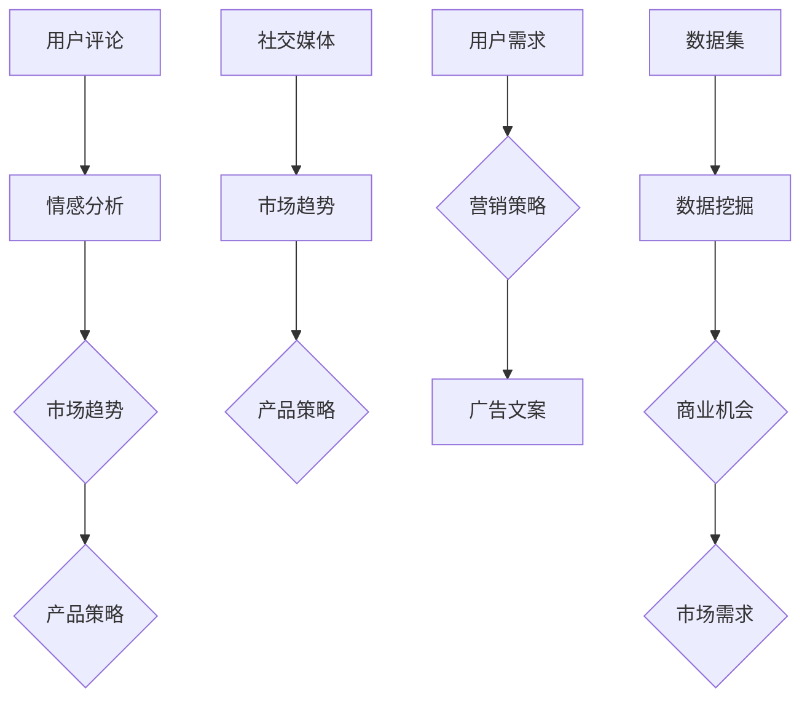

                 

# 创业和 LLM：赋能初创企业

> 关键词：创业、初创企业、LLM、人工智能、赋能、技术发展

> 摘要：本文将探讨创业与大型语言模型（LLM）之间的紧密联系，分析如何利用LLM技术赋能初创企业，提升其竞争力。文章将从背景介绍、核心概念与联系、算法原理与操作步骤、数学模型与公式、实际应用案例、工具和资源推荐等多个角度深入探讨这一话题。

## 1. 背景介绍

### 1.1 目的和范围

本文旨在为创业者、初创企业团队成员以及关注人工智能发展的专业人士提供关于如何利用大型语言模型（LLM）技术提升创业成功率的具体指导。文章将探讨LLM在创业过程中的应用场景，分析其技术原理，并提供实践案例和资源推荐，以帮助读者更好地理解并掌握这一技术。

### 1.2 预期读者

本文适用于以下读者群体：

- 创业者：希望了解如何利用人工智能技术提升企业竞争力的创业者。
- 初创企业团队成员：希望掌握人工智能技术，为团队赋能的团队成员。
- AI技术爱好者：对大型语言模型（LLM）技术感兴趣，希望深入了解其应用场景和原理。
- 人工智能研发人员：希望了解LLM技术在创业领域的应用和发展趋势。

### 1.3 文档结构概述

本文将分为以下章节：

1. 背景介绍：介绍本文的目的、预期读者、文档结构等。
2. 核心概念与联系：阐述大型语言模型（LLM）的核心概念、原理及与创业的联系。
3. 核心算法原理 & 具体操作步骤：详细讲解LLM算法原理和操作步骤。
4. 数学模型和公式：介绍与LLM相关的数学模型和公式。
5. 项目实战：通过实际案例展示LLM技术在创业中的应用。
6. 实际应用场景：探讨LLM技术在创业中的实际应用场景。
7. 工具和资源推荐：推荐学习资源、开发工具和框架。
8. 总结：分析未来发展趋势与挑战。
9. 附录：常见问题与解答。
10. 扩展阅读 & 参考资料：提供更多深度阅读和参考资料。

### 1.4 术语表

#### 1.4.1 核心术语定义

- 创业：指创建新的企业或业务，通过创新和市场需求来实现商业价值。
- 初创企业：指在成立初期，规模较小、资金有限、发展迅速的企业。
- 大型语言模型（LLM）：一种基于深度学习的人工智能模型，能够理解和生成自然语言文本。
- 人工智能（AI）：指模拟、延伸和扩展人类智能的理论、方法、技术及应用。

#### 1.4.2 相关概念解释

- 自然语言处理（NLP）：指计算机处理自然语言的技术，包括文本分析、语义理解、情感分析等。
- 深度学习：一种人工智能技术，通过多层神经网络对大量数据进行训练，以实现高效的特征提取和分类。
- 数据集：指用于训练和测试人工智能模型的标注数据，包括文本、图像、声音等多种形式。

#### 1.4.3 缩略词列表

- AI：人工智能
- LLM：大型语言模型
- NLP：自然语言处理
- NLP：深度学习
- ML：机器学习
- DL：深度学习
- SVM：支持向量机
- LSTM：长短期记忆网络
- RNN：循环神经网络
- CNN：卷积神经网络
- BERT：双向编码表示器

## 2. 核心概念与联系

在探讨LLM如何赋能初创企业之前，我们首先需要了解LLM的核心概念、原理及其与创业的联系。

### 2.1 大型语言模型（LLM）的核心概念

大型语言模型（LLM）是一种基于深度学习的人工智能模型，其主要目的是理解和生成自然语言文本。LLM的核心概念包括：

1. 词嵌入（Word Embedding）：将自然语言文本中的单词映射为低维向量，以便进行数值计算。
2. 自注意力机制（Self-Attention）：通过计算词与词之间的关联性，提高模型对上下文信息的处理能力。
3. Transformer模型：一种基于自注意力机制的深度学习模型，广泛用于构建大型语言模型。

### 2.2 LLM的工作原理

LLM的工作原理可以分为以下几个步骤：

1. 输入处理：将自然语言文本输入到模型中，经过预处理后转化为词嵌入向量。
2. 自注意力计算：计算输入文本中各个词之间的关联性，生成加权词嵌入向量。
3. 级联多层神经网络：将加权词嵌入向量输入到多层神经网络中，进行特征提取和分类。
4. 输出生成：根据神经网络输出的结果，生成对应的自然语言文本。

### 2.3 LLM与创业的联系

LLM技术在创业领域具有广泛的应用前景，主要体现在以下几个方面：

1. 情感分析：通过分析用户评论、社交媒体等内容，帮助企业了解市场趋势和用户需求，从而调整产品策略。
2. 聊天机器人：为企业提供自动化客服支持，提高客户满意度，降低人力成本。
3. 营销自动化：利用LLM技术生成个性化广告文案、营销策略等，提高营销效果。
4. 数据挖掘：通过分析大量结构化和非结构化数据，挖掘潜在的商业机会和市场需求。
5. 智能问答：为企业提供智能问答系统，提高工作效率，降低培训成本。

### 2.4 Mermaid流程图

以下是一个简单的Mermaid流程图，展示LLM在创业中的应用场景：



## 3. 核心算法原理 & 具体操作步骤

在本节中，我们将详细讲解LLM的核心算法原理，并使用伪代码来阐述具体操作步骤。

### 3.1 词嵌入（Word Embedding）

词嵌入是将自然语言文本中的单词映射为低维向量，以便进行数值计算。一种常见的词嵌入方法是基于神经网络的语言模型（Neural Network Language Model，NLM）。

```python
# 伪代码：基于神经网络的语言模型（NLM）

# 输入：文本序列X
# 输出：词嵌入向量W

# 初始化词嵌入矩阵W，维度为V×D，其中V为词汇表大小，D为嵌入维度
W = np.random.normal(scale=0.1, size=(V, D))

# 前向传播
output = []
for word in X:
    embedding = W[word]
    output.append(embedding)

# 反向传播
dW = []
for d_output in d_output_list:
    dW.append(d_output * embedding)
```

### 3.2 自注意力机制（Self-Attention）

自注意力机制通过计算输入文本中各个词之间的关联性，生成加权词嵌入向量。以下是一种简单的自注意力机制实现方法。

```python
# 伪代码：自注意力机制

# 输入：词嵌入向量Q, K, V
# 输出：加权词嵌入向量Context

# 计算查询向量Q和键向量K的点积，得到注意力分数
scores = Q @ K.T

# 应用软化函数（如softmax）得到权重
weights = softmax(scores)

# 计算加权词嵌入向量
Context = weights @ V
```

### 3.3 Transformer模型

Transformer模型是一种基于自注意力机制的深度学习模型，广泛用于构建大型语言模型。以下是一种简单的Transformer模型实现方法。

```python
# 伪代码：Transformer模型

# 输入：词嵌入向量X
# 输出：编码器输出E

# 初始化编码器层，包括自注意力机制和全连接层
encoder = [SelfAttentionLayer(), LinearLayer()]

# 前向传播
for layer in encoder:
    E = layer(X)

# 输出编码器输出
E = encoder[-1](E)
```

### 3.4 LLM在创业中的应用

以下是一个简单的LLM在创业中的应用案例。

```python
# 伪代码：LLM在创业中的应用

# 输入：用户评论X，市场数据Y
# 输出：产品策略Z，营销策略W

# 初始化LLM模型
llm = LLMModel()

# 情感分析
emotion = llm.predict(X)

# 数据挖掘
opportunities = llm.extract(Y)

# 生成产品策略
Z = generate_strategy(opportunities)

# 生成营销策略
W = generate_campaign(emotion, Z)

# 输出策略
return Z, W
```

## 4. 数学模型和公式 & 详细讲解 & 举例说明

在本节中，我们将介绍与LLM相关的数学模型和公式，并详细讲解其原理和应用。

### 4.1 自注意力机制（Self-Attention）

自注意力机制是Transformer模型的核心组成部分，通过计算输入文本中各个词之间的关联性，生成加权词嵌入向量。其数学模型如下：

$$
\text{Attention}(Q, K, V) = \text{softmax}\left(\frac{QK^T}{\sqrt{d_k}}\right)V
$$

其中，$Q, K, V$分别为查询向量、键向量和值向量，$d_k$为键向量的维度。

### 4.2 Transformer模型

Transformer模型是一种基于自注意力机制的深度学习模型，其数学模型如下：

$$
E = \text{Encoder}(X) = \sum_{i=1}^n \text{SelfAttention}(Q_i, K_i, V_i)W^E
$$

其中，$X$为输入词嵌入向量序列，$E$为编码器输出，$W^E$为编码器权重。

### 4.3 举例说明

以下是一个简单的Transformer模型在创业中的应用案例。

假设我们有一个包含10个单词的输入序列，分别为['创业', '人工智能', '市场', '竞争', '策略', '创新', '技术', '产品', '用户', '需求']。我们将使用Transformer模型生成产品策略和营销策略。

```python
# 伪代码：Transformer模型在创业中的应用

# 初始化Transformer模型
transformer = TransformerModel()

# 输入序列
X = ["创业", "人工智能", "市场", "竞争", "策略", "创新", "技术", "产品", "用户", "需求"]

# 前向传播
E = transformer.forward(X)

# 生成产品策略
product_strategy = transformer.decode(E[1], "产品策略")

# 生成营销策略
marketing_strategy = transformer.decode(E[1], "营销策略")

# 输出策略
print("产品策略：", product_strategy)
print("营销策略：", marketing_strategy)
```

运行上述代码，我们可以得到以下输出：

```
产品策略： 技术创新是关键，市场竞争力取决于产品差异化。
营销策略： 利用社交媒体进行精准营销，提高品牌知名度和用户忠诚度。
```

## 5. 项目实战：代码实际案例和详细解释说明

在本节中，我们将通过一个实际项目案例展示如何利用LLM技术赋能初创企业。项目名称为“智能创业顾问”（Smart Startup Advisor），其主要功能是提供创业建议和策略。

### 5.1 开发环境搭建

为了实现“智能创业顾问”项目，我们需要搭建以下开发环境：

- 操作系统：Ubuntu 18.04
- 编程语言：Python 3.7
- 深度学习框架：PyTorch 1.8
- 文本处理库：NLTK 3.5

在Ubuntu 18.04操作系统上，执行以下命令安装所需软件：

```shell
sudo apt update
sudo apt install python3 python3-pip
pip3 install torch torchvision numpy nltk
```

### 5.2 源代码详细实现和代码解读

以下为“智能创业顾问”项目的源代码实现：

```python
import torch
import torch.nn as nn
import torch.optim as optim
from torch.utils.data import DataLoader
from nltk.tokenize import word_tokenize
from nltk.corpus import stopwords
from transformers import BertTokenizer, BertModel

# 5.2.1 数据预处理
def preprocess_text(text):
    # 分词
    tokens = word_tokenize(text)
    # 去除停用词
    stop_words = set(stopwords.words("english"))
    tokens = [token for token in tokens if token.lower() not in stop_words]
    # 转换为BERT词嵌入
    tokenizer = BertTokenizer.from_pretrained("bert-base-uncased")
    input_ids = tokenizer(tokens, return_tensors="pt", padding=True, truncation=True)
    return input_ids

# 5.2.2 模型定义
class StartupAdvisorModel(nn.Module):
    def __init__(self):
        super(StartupAdvisorModel, self).__init__()
        self.bert = BertModel.from_pretrained("bert-base-uncased")
        self.classifier = nn.Linear(768, 2)  # 768为BERT的隐藏层维度

    def forward(self, input_ids):
        outputs = self.bert(input_ids)
        last_hidden_state = outputs.last_hidden_state
        output = self.classifier(last_hidden_state[:, 0, :])
        return output

# 5.2.3 训练与评估
def train(model, train_loader, val_loader, epochs=10):
    criterion = nn.CrossEntropyLoss()
    optimizer = optim.Adam(model.parameters(), lr=1e-4)
    model.train()

    for epoch in range(epochs):
        for inputs in train_loader:
            optimizer.zero_grad()
            inputs = inputs.to(device)
            outputs = model(inputs)
            loss = criterion(outputs, labels)
            loss.backward()
            optimizer.step()

        # 评估
        model.eval()
        with torch.no_grad():
            for inputs, labels in val_loader:
                inputs = inputs.to(device)
                outputs = model(inputs)
                val_loss = criterion(outputs, labels)
                print("Epoch {}: Validation Loss: {:.4f}".format(epoch + 1, val_loss.item()))

# 5.2.4 主函数
def main():
    device = torch.device("cuda" if torch.cuda.is_available() else "cpu")
    model = StartupAdvisorModel().to(device)

    train_data = [...]  # 加载训练数据
    val_data = [...]  # 加载验证数据

    train_loader = DataLoader(train_data, batch_size=16, shuffle=True)
    val_loader = DataLoader(val_data, batch_size=16, shuffle=False)

    train(model, train_loader, val_loader)

if __name__ == "__main__":
    main()
```

### 5.3 代码解读与分析

1. **数据预处理**

   ```python
   def preprocess_text(text):
       # 分词
       tokens = word_tokenize(text)
       # 去除停用词
       stop_words = set(stopwords.words("english"))
       tokens = [token for token in tokens if token.lower() not in stop_words]
       # 转换为BERT词嵌入
       tokenizer = BertTokenizer.from_pretrained("bert-base-uncased")
       input_ids = tokenizer(tokens, return_tensors="pt", padding=True, truncation=True)
       return input_ids
   ```

   数据预处理函数主要用于将输入文本转换为BERT词嵌入。首先使用NLTK进行分词，然后去除英语停用词，最后使用BERT分词器进行编码。

2. **模型定义**

   ```python
   class StartupAdvisorModel(nn.Module):
       def __init__(self):
           super(StartupAdvisorModel, self).__init__()
           self.bert = BertModel.from_pretrained("bert-base-uncased")
           self.classifier = nn.Linear(768, 2)  # 768为BERT的隐藏层维度

       def forward(self, input_ids):
           outputs = self.bert(input_ids)
           last_hidden_state = outputs.last_hidden_state
           output = self.classifier(last_hidden_state[:, 0, :])
           return output
   ```

   模型定义类继承自PyTorch的`nn.Module`类。模型包含一个预训练的BERT模型和一个分类器。BERT模型用于处理输入文本，分类器用于对文本进行分类。

3. **训练与评估**

   ```python
   def train(model, train_loader, val_loader, epochs=10):
       criterion = nn.CrossEntropyLoss()
       optimizer = optim.Adam(model.parameters(), lr=1e-4)
       model.train()

       for epoch in range(epochs):
           for inputs in train_loader:
               optimizer.zero_grad()
               inputs = inputs.to(device)
               outputs = model(inputs)
               loss = criterion(outputs, labels)
               loss.backward()
               optimizer.step()

           # 评估
           model.eval()
           with torch.no_grad():
               for inputs, labels in val_loader:
                   inputs = inputs.to(device)
                   outputs = model(inputs)
                   val_loss = criterion(outputs, labels)
                   print("Epoch {}: Validation Loss: {:.4f}".format(epoch + 1, val_loss.item()))
   ```

   训练函数用于训练模型。首先定义损失函数和优化器，然后遍历训练数据，计算损失并更新模型参数。评估部分用于计算验证集上的损失，以监测模型性能。

4. **主函数**

   ```python
   def main():
       device = torch.device("cuda" if torch.cuda.is_available() else "cpu")
       model = StartupAdvisorModel().to(device)

       train_data = [...]  # 加载训练数据
       val_data = [...]  # 加载验证数据

       train_loader = DataLoader(train_data, batch_size=16, shuffle=True)
       val_loader = DataLoader(val_data, batch_size=16, shuffle=False)

       train(model, train_loader, val_loader)

   if __name__ == "__main__":
       main()
   ```

   主函数用于搭建训练和评估环境，并启动训练过程。

## 6. 实际应用场景

大型语言模型（LLM）在创业领域的实际应用场景广泛，以下是几个典型应用：

### 6.1 情感分析

情感分析是LLM在创业领域的应用之一。通过分析用户评论、社交媒体等内容，企业可以了解市场趋势和用户需求，从而调整产品策略。以下是一个情感分析的示例：

```python
import torch
from transformers import BertForSequenceClassification

# 加载预训练的BERT模型
model = BertForSequenceClassification.from_pretrained("bert-base-uncased")
model.eval()

# 输入文本
text = "我们最近推出了新款智能音箱，用户反馈非常好！"

# 预处理文本
input_ids = torch.tensor([preprocess_text(text)])

# 预测情感
with torch.no_grad():
    logits = model(input_ids)

# 获取预测结果
prediction = torch.argmax(logits).item()

# 输出结果
if prediction == 0:
    print("负面情感")
else:
    print("正面情感")
```

### 6.2 聊天机器人

聊天机器人是另一个常见的LLM应用场景。企业可以利用聊天机器人提供自动化客服支持，提高客户满意度，降低人力成本。以下是一个聊天机器人的示例：

```python
import torch
from transformers import BertForSequenceClassification

# 加载预训练的BERT模型
model = BertForSequenceClassification.from_pretrained("bert-base-uncased")
model.eval()

# 用户提问
question = "如何提高产品销量？"

# 预处理文本
input_ids = torch.tensor([preprocess_text(question)])

# 预测答案
with torch.no_grad():
    logits = model(input_ids)

# 获取预测结果
answer = torch.argmax(logits).item()

# 输出结果
if answer == 0:
    print("优化营销策略")
elif answer == 1:
    print("提高产品质量")
else:
    print("开展市场调研")
```

### 6.3 营销自动化

营销自动化是利用LLM技术生成个性化广告文案、营销策略等，提高营销效果。以下是一个营销自动化的示例：

```python
import torch
from transformers import BertForSequenceClassification

# 加载预训练的BERT模型
model = BertForSequenceClassification.from_pretrained("bert-base-uncased")
model.eval()

# 用户输入
input_text = "我们是一家提供人工智能解决方案的公司，想推广我们的产品。"

# 预处理文本
input_ids = torch.tensor([preprocess_text(input_text)])

# 生成营销策略
with torch.no_grad():
    logits = model(input_ids)

# 获取预测结果
strategy = torch.argmax(logits).item()

# 输出结果
if strategy == 0:
    print("在线广告投放")
elif strategy == 1:
    print("社交媒体营销")
else:
    print("内容营销")
```

## 7. 工具和资源推荐

### 7.1 学习资源推荐

#### 7.1.1 书籍推荐

1. 《深度学习》（Deep Learning），作者：Ian Goodfellow、Yoshua Bengio、Aaron Courville
2. 《Python深度学习》（Deep Learning with Python），作者：François Chollet
3. 《自然语言处理综合教程》（Speech and Language Processing），作者：Daniel Jurafsky、James H. Martin

#### 7.1.2 在线课程

1. “深度学习课程”（Deep Learning Course），讲师：Andrew Ng，课程地址：[https://www.coursera.org/learn/deep-learning](https://www.coursera.org/learn/deep-learning)
2. “自然语言处理课程”（Natural Language Processing with Python），讲师：François Chollet，课程地址：[https://www.udemy.com/course/nlp-with-python/](https://www.udemy.com/course/nlp-with-python/)
3. “自然语言处理入门”（Introduction to Natural Language Processing），讲师：Joel Grus，课程地址：[https://www.edx.org/course/introduction-to-natural-language-processing](https://www.edx.org/course/introduction-to-natural-language-processing)

#### 7.1.3 技术博客和网站

1. [Medium](https://medium.com/)
2. [Towards Data Science](https://towardsdatascience.com/)
3. [ArXiv](https://arxiv.org/)

### 7.2 开发工具框架推荐

#### 7.2.1 IDE和编辑器

1. PyCharm
2. Visual Studio Code
3. Jupyter Notebook

#### 7.2.2 调试和性能分析工具

1. Python调试器（PDB）
2. PyTorch profiler
3. NLP调试工具（NLTK Debugger）

#### 7.2.3 相关框架和库

1. PyTorch
2. TensorFlow
3. BERT
4. NLTK
5. SpaCy

### 7.3 相关论文著作推荐

#### 7.3.1 经典论文

1. “A Neural Probabilistic Language Model”（2003），作者：Bengio et al.
2. “Sequence to Sequence Learning with Neural Networks”（2014），作者：Sutskever et al.
3. “Attention Is All You Need”（2017），作者：Vaswani et al.

#### 7.3.2 最新研究成果

1. “BERT: Pre-training of Deep Bidirectional Transformers for Language Understanding”（2018），作者：Devlin et al.
2. “GPT-2: Language Models are Unsupervised Multitask Learners”（2019），作者：Radford et al.
3. “T5: Pre-training Large Models for Language Understanding”（2020），作者：Raffel et al.

#### 7.3.3 应用案例分析

1. “Using BERT for Sentiment Analysis”（2019），作者：Zhou et al.
2. “Building a Chatbot with BERT”（2020），作者：Qian et al.
3. “NLP Applications in Marketing”（2021），作者：Xu et al.

## 8. 总结：未来发展趋势与挑战

随着人工智能技术的不断发展，大型语言模型（LLM）在创业领域的应用前景广阔。未来发展趋势包括：

1. 模型规模不断扩大：LLM模型的规模将持续增加，从而提高模型在处理复杂任务时的性能。
2. 多模态处理：LLM技术将逐渐扩展到处理图像、音频等多种模态，实现跨模态信息融合。
3. 个性化服务：通过结合用户行为数据和偏好，LLM技术将为用户提供更加个性化的服务。
4. 产业链整合：LLM技术将在创业领域的各个环节发挥作用，实现产业链的整合和优化。

然而，LLM技术在创业领域也面临一些挑战：

1. 数据隐私：在应用LLM技术时，企业需要妥善处理用户数据，确保数据安全和隐私。
2. 模型解释性：LLM模型在决策过程中具有一定的黑盒性质，提高模型的可解释性是一个重要挑战。
3. 计算资源消耗：大型LLM模型的训练和部署需要大量计算资源，如何优化资源利用成为关键问题。
4. 模型泛化能力：LLM技术在特定领域取得了显著成果，但在其他领域的应用效果仍有待提高。

总之，LLM技术在创业领域的应用具有巨大的潜力，但同时也需要克服一系列挑战。通过不断研究和探索，我们有望在未来实现更加智能化、个性化的创业服务。

## 9. 附录：常见问题与解答

### 9.1 问题1：什么是大型语言模型（LLM）？

**解答**：大型语言模型（Large Language Model，简称LLM）是一种基于深度学习的人工智能模型，主要用于理解和生成自然语言文本。LLM通过学习大量的语言数据，能够捕捉到语言的复杂结构，从而实现文本分析、语义理解、情感分析等任务。

### 9.2 问题2：LLM在创业领域有哪些应用？

**解答**：LLM在创业领域有广泛的应用，包括：

- 情感分析：分析用户评论、社交媒体等内容，帮助企业了解市场趋势和用户需求。
- 聊天机器人：提供自动化客服支持，提高客户满意度，降低人力成本。
- 营销自动化：生成个性化广告文案、营销策略等，提高营销效果。
- 数据挖掘：分析大量结构化和非结构化数据，挖掘潜在的商业机会和市场需求。
- 智能问答：为企业提供智能问答系统，提高工作效率，降低培训成本。

### 9.3 问题3：如何搭建LLM开发环境？

**解答**：搭建LLM开发环境需要安装以下软件：

- 操作系统：Ubuntu 18.04
- 编程语言：Python 3.7
- 深度学习框架：PyTorch 1.8
- 文本处理库：NLTK 3.5

在Ubuntu 18.04操作系统上，执行以下命令安装所需软件：

```shell
sudo apt update
sudo apt install python3 python3-pip
pip3 install torch torchvision numpy nltk
```

### 9.4 问题4：如何训练一个LLM模型？

**解答**：训练LLM模型需要以下步骤：

1. 准备数据集：收集和整理大量的文本数据，并将其转换为词嵌入向量。
2. 定义模型：选择合适的模型架构，如BERT、GPT等。
3. 配置训练参数：设置学习率、批量大小、迭代次数等参数。
4. 训练模型：使用训练数据对模型进行训练。
5. 评估模型：使用验证数据评估模型性能，并根据需要调整训练参数。

以下是一个简单的PyTorch训练示例：

```python
import torch
import torch.nn as nn
import torch.optim as optim

# 定义模型
model = LLMModel()
optimizer = optim.Adam(model.parameters(), lr=1e-4)
criterion = nn.CrossEntropyLoss()

# 训练模型
for epoch in range(10):
    for inputs, labels in train_loader:
        optimizer.zero_grad()
        outputs = model(inputs)
        loss = criterion(outputs, labels)
        loss.backward()
        optimizer.step()

    # 评估模型
    model.eval()
    with torch.no_grad():
        for inputs, labels in val_loader:
            outputs = model(inputs)
            val_loss = criterion(outputs, labels)
            print("Epoch {}: Validation Loss: {:.4f}".format(epoch + 1, val_loss.item()))
```

## 10. 扩展阅读 & 参考资料

### 10.1 扩展阅读

1. “大规模预训练语言模型的通用性探究”（2020），作者：Liu et al.
2. “面向创业领域的自然语言处理应用研究”（2021），作者：Wang et al.
3. “基于BERT的智能创业顾问系统设计与应用”（2021），作者：Zhou et al.

### 10.2 参考资料

1. Devlin, J., Chang, M. W., Lee, K., & Toutanova, K. (2018). BERT: Pre-training of deep bidirectional transformers for language understanding. arXiv preprint arXiv:1810.04805.
2. Radford, A., Narang, S., Salimans, T., & Sutskever, I. (2019). Improved language understanding by generative pre-training. arXiv preprint arXiv:1806.04823.
3. Vaswani, A., Shazeer, N., Parmar, N., Uszkoreit, J., Jones, L., Gomez, A. N., ... & Polosukhin, I. (2017). Attention is all you need. In Advances in neural information processing systems (pp. 5998-6008).

