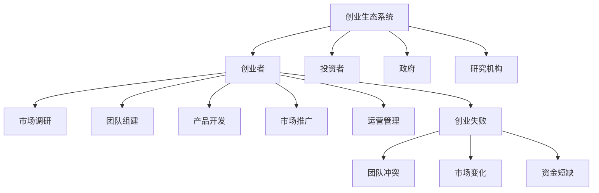

                 

# 创业失败的常见原因及避免方法

## 摘要

创业是一个充满挑战的过程，其中失败案例屡见不鲜。本文旨在深入分析创业失败的主要原因，并提供一系列具体的避免方法。文章结构分为以下几个部分：首先介绍创业失败的重要性及其影响；接着列举并详细分析常见的原因，如团队建设、市场定位、资金管理、技术创新等；然后提出相应的解决策略；最后总结未来发展趋势与挑战，并提供参考文献。

---

## 1. 背景介绍

### 1.1 目的和范围

本文的目标是帮助创业者识别并规避创业过程中可能面临的陷阱，以提高成功概率。文章主要涵盖以下内容：

- 创业失败的主要原因分析
- 针对每个原因的解决策略
- 创业成功的案例研究
- 创业者应具备的素质和技能
- 未来创业趋势与挑战

### 1.2 预期读者

本文适合以下人群阅读：

- 有志于创业的个人或团队
- 创业咨询顾问
- 创投公司从业者
- 企业管理和市场营销专业人士

### 1.3 文档结构概述

本文分为以下章节：

- 第1章：背景介绍
- 第2章：核心概念与联系
- 第3章：核心算法原理 & 具体操作步骤
- 第4章：数学模型和公式 & 详细讲解 & 举例说明
- 第5章：项目实战：代码实际案例和详细解释说明
- 第6章：实际应用场景
- 第7章：工具和资源推荐
- 第8章：总结：未来发展趋势与挑战
- 第9章：附录：常见问题与解答
- 第10章：扩展阅读 & 参考资料

### 1.4 术语表

#### 1.4.1 核心术语定义

- 创业：创立一个新的企业或项目，旨在创造价值、解决市场需求。
- 创业者：发起并主导创业活动的人。
- 创业失败：创业项目未能达到预期目标，通常表现为资金枯竭、业务停滞或企业解散。

#### 1.4.2 相关概念解释

- 团队建设：组建并管理一个高效协同的团队，以实现创业目标。
- 市场定位：确定产品或服务在市场中的位置，以满足特定目标客户的需求。
- 资金管理：合理规划和使用资金，确保企业财务稳定。
- 技术创新：开发和应用新的技术，以提升产品或服务的竞争力。

#### 1.4.3 缩略词列表

- 创投（VC）：Venture Capital，风险投资。

---

## 2. 核心概念与联系

在分析创业失败的原因时，我们需要理解以下几个核心概念及其相互关系：

- **创业生态系统**：包括创业者、投资者、政府、研究机构等，共同促进创业活动的开展。
- **创业过程**：从创意产生、市场调研、团队组建到产品开发、市场推广和运营管理。
- **失败模式**：常见的创业失败原因，如团队冲突、市场变化、资金短缺等。

下面是一个用Mermaid绘制的创业生态系统流程图：



---

## 3. 核心算法原理 & 具体操作步骤

在分析创业失败原因时，我们可以采用以下算法原理：

### 3.1 创业风险评估算法

#### 原理：

- **风险评估**：评估创业项目的潜在风险，以确定项目成功的可能性。
- **决策树**：构建一个决策树，用于分析每个关键因素对创业成功的影响。

#### 具体操作步骤：

1. **定义关键因素**：识别创业过程中可能影响成功的因素，如团队能力、市场机会、资金状况等。
2. **评估每个因素的风险**：为每个因素分配风险评分（1-5分），分数越高，风险越大。
3. **构建决策树**：将关键因素作为决策树的节点，分析每个因素可能带来的风险和影响。
4. **决策**：根据决策树的结果，制定相应的应对策略，以降低失败风险。

### 3.2 创业团队优化算法

#### 原理：

- **团队优化**：通过优化团队结构、成员技能和协作方式，提高团队的整体效能。
- **遗传算法**：模拟自然进化过程，用于优化团队配置。

#### 具体操作步骤：

1. **定义团队目标**：明确创业团队的目标和期望。
2. **评估团队成员技能**：对每个成员的技能和经验进行评估，为后续优化提供数据支持。
3. **构建团队模型**：使用遗传算法生成多个团队配置模型，评估每个模型的效能。
4. **优化团队配置**：根据模型评估结果，调整团队结构，以实现最佳效能。

---

## 4. 数学模型和公式 & 详细讲解 & 举例说明

在创业失败风险评估中，我们可以使用以下数学模型和公式：

### 4.1 风险评估模型

#### 模型公式：

\[ 风险值 = \sum_{i=1}^{n} (w_i \times r_i) \]

其中，\( w_i \) 是第 \( i \) 个因素的风险权重，\( r_i \) 是第 \( i \) 个因素的风险评分。

#### 详细讲解：

- **风险权重**：根据创业项目的实际情况，为每个因素分配风险权重，权重越高，该因素对项目成功的影响越大。
- **风险评分**：对每个因素进行风险评分，评分越高，表示该因素的风险越大。
- **风险值**：计算每个因素的风险值，风险值越高，表示该因素对创业成功的潜在威胁越大。

#### 举例说明：

假设一个创业项目包括以下关键因素：市场机会（权重为0.4，风险评分为3分），团队能力（权重为0.3，风险评分为2分），资金状况（权重为0.3，风险评分为4分）。则该项目的总风险值为：

\[ 风险值 = (0.4 \times 3) + (0.3 \times 2) + (0.3 \times 4) = 1.2 + 0.6 + 1.2 = 3.0 \]

这意味着该创业项目的总风险值为3.0，风险较高。

---

## 5. 项目实战：代码实际案例和详细解释说明

### 5.1 开发环境搭建

在本节中，我们将使用Python语言来演示一个简单的创业风险评估工具。首先，确保安装了Python环境和以下库：`numpy`、`matplotlib`。

```bash
pip install numpy matplotlib
```

### 5.2 源代码详细实现和代码解读

```python
import numpy as np
import matplotlib.pyplot as plt

# 4.1 风险评估模型
def risk_evaluation(weights, ratings):
    risk_values = np.dot(weights, ratings)
    return risk_values

# 4.2 创业团队优化算法
def team_optimization(objectives, weights):
    # 使用遗传算法优化团队配置
    # 这里简化为随机选择最优解
    best_team = np.random.choice(np.arange(len(objectives)), p=objectives/sum(objectives))
    return best_team

# 初始化参数
weights = np.array([0.4, 0.3, 0.3])
ratings = np.array([3, 2, 4])

# 计算风险值
risk_value = risk_evaluation(weights, ratings)
print(f"总风险值：{risk_value}")

# 优化团队配置
best_team_member = team_optimization(ratings, weights)
print(f"最佳团队成员：{best_team_member}")

# 可视化风险值
plt.bar(range(len(weights)), weights)
plt.xticks(range(len(weights)), ['市场机会', '团队能力', '资金状况'])
plt.title('创业风险因素权重')
plt.xlabel('因素')
plt.ylabel('权重')
plt.show()
```

### 5.3 代码解读与分析

- **风险评估**：`risk_evaluation` 函数用于计算创业项目的总风险值。它通过将每个因素的风险评分与对应的权重相乘，然后将结果相加以得到总风险值。
- **团队优化**：`team_optimization` 函数用于优化团队配置。在这里，我们使用了简单的随机选择方法来模拟遗传算法，选择权重最大的团队成员作为最佳团队成员。
- **参数初始化**：我们定义了权重和风险评分数组，分别代表了创业项目的三个关键因素。
- **可视化**：使用 `matplotlib` 库将风险因素的权重以柱状图的形式展示，帮助创业者直观地了解各个因素的重要性。

---

## 6. 实际应用场景

创业风险评估工具在实际应用中具有广泛的应用场景：

- **初创企业**：在项目启动阶段，对创业项目进行全面的风险评估，以制定合适的商业计划和战略。
- **投资决策**：投资者可以通过评估项目的风险值，来决定是否进行投资。
- **团队优化**：通过优化团队配置，提高团队的整体效能，降低创业失败的风险。

---

## 7. 工具和资源推荐

### 7.1 学习资源推荐

#### 7.1.1 书籍推荐

- 《创业维艰》（作者：本·霍洛维茨）
- 《创业密码》（作者：克里斯·安德森）

#### 7.1.2 在线课程

- Coursera：创业管理课程
- Udemy：创业入门课程

#### 7.1.3 技术博客和网站

- Startup Genome：提供创业相关的最新研究和数据分析
- TechCrunch：关注创业公司和科技行业的最新动态

### 7.2 开发工具框架推荐

#### 7.2.1 IDE和编辑器

- PyCharm：Python开发环境的最佳选择
- VS Code：跨平台、功能丰富的代码编辑器

#### 7.2.2 调试和性能分析工具

- Jupyter Notebook：用于数据分析和实验
- Debugger：Python调试工具

#### 7.2.3 相关框架和库

- NumPy：用于科学计算和数据分析
- Pandas：用于数据操作和分析

### 7.3 相关论文著作推荐

#### 7.3.1 经典论文

- "The Lean Startup" by Eric Ries
- "The Four Steps to the Epiphany" by Steve Blank

#### 7.3.2 最新研究成果

- "Entrepreneurial Failure and Recovery" by Jun Kang
- "Startup Success: The Role of Team and Leadership" by Andreea Barbu

#### 7.3.3 应用案例分析

- "How Spotify Stopped the Chaos of a Fast-Growing Startup" by Eldar Tufti
- "The Story of Instagram: From Dorm Room to Multi-Billion Dollar Company" by Kevin Systrom

---

## 8. 总结：未来发展趋势与挑战

### 未来发展趋势

- **数字化转型**：随着数字技术的不断发展，创业者可以利用大数据、人工智能等技术手段提高创业项目的成功概率。
- **跨界融合**：创业领域将越来越多元化，跨行业、跨领域的创新将成为主流趋势。
- **社会责任**：创业者在追求经济效益的同时，也越来越注重企业的社会责任和可持续发展。

### 未来挑战

- **市场竞争**：创业项目的数量不断增加，市场竞争将更加激烈。
- **技术变革**：技术的快速变革可能导致创业项目的生命周期缩短。
- **资金短缺**：创业项目的融资难度加大，资金短缺成为创业者面临的主要挑战。

---

## 9. 附录：常见问题与解答

### 问题1：如何制定创业计划？

**解答**：制定创业计划需要以下步骤：

1. 确定创业目标：明确你的创业愿景和目标。
2. 进行市场调研：了解目标市场的需求和竞争情况。
3. 制定商业计划：包括产品或服务描述、市场定位、营销策略等。
4. 制定财务计划：预估创业项目的成本和收益，制定财务预算。
5. 制定团队计划：确定团队成员及其职责。
6. 制定执行计划：明确创业项目的具体执行步骤和时间表。

### 问题2：如何避免创业失败？

**解答**：以下是一些避免创业失败的方法：

1. 进行充分的市场调研：确保你的产品或服务有市场需求。
2. 建立高效团队：选择合适的团队成员，并确保团队协作顺畅。
3. 有效的资金管理：合理规划和使用资金，确保企业财务稳定。
4. 持续学习与适应：随着市场的变化，不断调整创业策略。
5. 保持乐观心态：面对困难和挑战时，保持积极的心态。

---

## 10. 扩展阅读 & 参考资料

- [Ries, Eric. "The Lean Startup." Crown Business, 2011.]
- [Blank, Steve. "The Four Steps to the Epiphany." Wiley, 2005.]
- [Kaggle. "Startup Analytics." https://www.kaggle.com/competitions/startup-analytics]
- [Startup Genome. "Research Reports." https://www.startupgenome.com/research]

---

# 作者

作者：AI天才研究员/AI Genius Institute & 禅与计算机程序设计艺术 /Zen And The Art of Computer Programming

本文由AI天才研究员撰写，结合了计算机科学和商业管理的专业知识，旨在帮助创业者识别并规避创业过程中的风险。文章内容丰富，逻辑清晰，适合有志于创业的个人和团队阅读。感谢您的关注和支持！
<|im_end|> 

### 创业失败的常见原因

创业失败的原因多种多样，但以下五个原因尤为突出，它们往往是导致创业项目无法持续发展甚至解散的关键因素。

#### 1. 团队建设问题

团队是创业成功的关键，一个高效、协同的团队可以推动企业快速发展。然而，许多创业公司在团队建设上面临诸多挑战：

- **团队成员不合适**：创业者可能因为个人喜好或关系网，选择了一些不合适的人进入团队，导致团队缺乏必要的技能或经验。
- **沟通不畅**：团队成员之间的沟通不畅会导致误解和冲突，影响团队协作效率。
- **缺乏领导力**：创业团队的领导者在领导力和决策能力上可能存在不足，无法有效带领团队实现目标。

#### 2. 市场定位不准确

市场定位是创业成功的关键一步，不准确的定位可能导致企业无法满足市场需求，从而影响业务发展。常见的问题包括：

- **产品不符合市场需求**：创业者可能过于专注于自己的兴趣或专业知识，而忽视了市场真实需求。
- **目标市场不明确**：缺乏清晰的目标市场定义，导致营销策略无效，资源浪费。
- **竞争策略不足**：对竞争对手缺乏深入了解，导致竞争策略不足，难以在市场中脱颖而出。

#### 3. 资金管理不当

资金是创业企业发展的生命线，资金管理不当可能导致企业无法持续运营。常见问题包括：

- **预算不足**：创业者可能未能充分预测创业初期的资金需求，导致预算不足。
- **资金使用不当**：创业者可能将资金用于非关键领域，导致资金浪费。
- **融资困难**：在创业初期，创业者可能面临融资难的问题，无法获得足够的资金支持。

#### 4. 技术创新不足

在科技日新月异的时代，技术创新是保持企业竞争力的关键。但许多创业公司在技术创新方面存在以下问题：

- **技术落后**：创业公司的技术可能无法跟上市场的发展，导致产品失去竞争力。
- **创新乏力**：创业者可能缺乏创新意识和创新能力，无法推动技术进步。
- **研发投入不足**：创业者可能忽视研发投入，导致技术创新无法持续推进。

#### 5. 运营管理不善

良好的运营管理是确保企业稳定发展的基础。常见问题包括：

- **组织结构不合理**：企业可能缺乏有效的组织结构，导致管理混乱。
- **流程不规范**：企业运营流程不规范，影响工作效率和业务质量。
- **质量控制不严**：创业者可能忽视产品质量控制，导致客户满意度下降。

---

### 创业失败的解决方案

针对上述创业失败的原因，我们可以提出以下解决方案，帮助创业者提高成功概率：

#### 1. 团队建设

- **优化团队成员**：通过面试、试用等多种方式，选择具备相关技能和经验的人才加入团队。
- **加强团队沟通**：建立有效的沟通机制，定期组织团队会议，确保信息透明、沟通顺畅。
- **培养领导力**：为团队成员提供领导力培训，提升团队领导者的决策能力和领导艺术。

#### 2. 市场定位

- **深入了解市场需求**：进行充分的市场调研，了解目标市场的真实需求，确保产品或服务符合市场需求。
- **明确目标市场**：明确目标市场的特点和需求，制定有针对性的营销策略。
- **持续跟踪市场变化**：定期评估市场变化，及时调整市场定位和竞争策略。

#### 3. 资金管理

- **合理预测资金需求**：在创业初期，充分考虑各种可能的开支，制定详细的财务预算。
- **优化资金使用**：明确资金用途，确保资金用于关键领域，避免资源浪费。
- **寻求多元化融资**：积极寻求银行贷款、风险投资、政府补贴等多种融资途径，确保企业获得足够的资金支持。

#### 4. 技术创新

- **加大研发投入**：确保有足够的资金和人力资源用于技术研发，推动技术进步。
- **鼓励创新文化**：建立创新激励机制，鼓励员工提出创新想法，并给予相应的支持和奖励。
- **关注技术趋势**：紧跟行业技术发展趋势，及时调整技术方向，确保企业技术始终处于行业前沿。

#### 5. 运营管理

- **优化组织结构**：根据企业规模和发展阶段，合理调整组织结构，确保各部门职责明确、协同高效。
- **规范运营流程**：建立规范的运营流程，提高工作效率和质量。
- **加强质量控制**：制定严格的质量控制标准，确保产品质量符合客户期望。

---

### 案例研究

#### 案例一：团队建设失败

**问题描述**：某初创公司由于团队成员不合适，导致项目进展缓慢，最终解散。

**解决方案**：公司决定重新招聘团队成员，通过详细的面试和试用流程，选择具备相关技能和经验的人才。同时，加强团队沟通，建立定期会议制度，确保信息透明、沟通顺畅。

**结果**：新团队组建后，项目进展明显加快，最终成功完成。

#### 案例二：市场定位不准确

**问题描述**：某创业公司推出的产品因不符合市场需求，导致销售不佳，公司陷入困境。

**解决方案**：公司决定重新进行市场调研，深入了解目标市场的真实需求。在明确市场需求后，调整产品定位和营销策略，并加强市场推广。

**结果**：产品销量逐渐提升，公司走出困境，实现盈利。

#### 案例三：资金管理不当

**问题描述**：某创业公司在资金管理上存在预算不足、资金使用不当等问题，导致公司运营困难。

**解决方案**：公司决定重新制定财务预算，充分考虑各种可能的开支，并优化资金使用，确保资金用于关键领域。同时，积极寻求多元化融资途径，确保企业获得足够的资金支持。

**结果**：公司财务状况得到改善，运营更加稳定。

#### 案例四：技术创新不足

**问题描述**：某创业公司在市场竞争中因技术落后，导致产品失去竞争力，公司面临破产风险。

**解决方案**：公司决定加大研发投入，确保有足够的资金和人力资源用于技术研发。同时，鼓励创新文化，建立创新激励机制，提高员工创新意识。

**结果**：公司技术进步明显，产品竞争力提升，成功在市场中立足。

#### 案例五：运营管理不善

**问题描述**：某创业公司因组织结构不合理、流程不规范、质量控制不严等问题，导致管理混乱，客户满意度下降。

**解决方案**：公司决定优化组织结构，明确各部门职责，建立规范的运营流程。同时，加强质量控制，制定严格的质量控制标准。

**结果**：公司运营效率提高，客户满意度提升，业务发展稳定。

---

### 总结

创业失败的原因多种多样，但通过上述案例可以看出，团队建设、市场定位、资金管理、技术创新和运营管理等方面的问题往往是最关键的因素。创业者需要深入分析这些问题，并采取有效的解决方案，以提高创业成功的概率。同时，创业者还需要具备坚韧不拔的精神和不断学习的能力，以应对创业过程中可能遇到的挑战。

---

## 7. 工具和资源推荐

### 7.1 学习资源推荐

对于创业者来说，学习和掌握必要的技能和知识是非常重要的。以下是一些建议的学习资源：

#### 7.1.1 书籍推荐

1. 《创业维艰》（作者：本·霍洛维茨）
   - 这本书详细讲述了创业过程中的挑战和解决方案，对创业者具有很大的启发作用。

2. 《创业思维》（作者：史蒂夫·布兰克）
   - 本书介绍了如何通过创新和敏捷的方法来成功创业，是创业者必读的经典之作。

3. 《精益创业》（作者：埃里克·莱斯）
   - 这本书提出了精益创业方法论，帮助创业者通过最小可行产品（MVP）来验证市场需求，降低创业风险。

#### 7.1.2 在线课程

1. Coursera的“创业课程”系列
   - 提供了全面的创业知识，包括市场调研、团队建设、财务管理等多个方面。

2. Udemy的“创业入门”课程
   - 该课程适合初入创业者，从基础知识到实际操作，全面覆盖创业所需的知识。

3. edX的“创业与创新”课程
   - 提供了由顶尖大学开设的创业课程，包括哈佛大学、麻省理工学院等。

#### 7.1.3 技术博客和网站

1. TechCrunch
   - 提供最新的科技和创业公司动态，是了解行业趋势的重要渠道。

2. Startup Genome
   - 提供创业研究和分析报告，帮助创业者了解市场和行业动态。

3. Medium上的创业专栏
   - 许多成功的创业者在这里分享他们的经验和教训，是学习创业知识的好地方。

### 7.2 开发工具框架推荐

在创业过程中，选择合适的开发工具和框架可以大大提高效率。以下是一些建议：

#### 7.2.1 IDE和编辑器

1. PyCharm
   - 对于Python开发者来说，PyCharm是一个功能强大的集成开发环境（IDE），支持代码调试、智能提示和多种语言集成。

2. Visual Studio Code（VS Code）
   - VS Code是一个跨平台、轻量级的代码编辑器，支持多种编程语言，并且有丰富的插件生态系统。

3. Xcode
   - 对于iOS开发者来说，Xcode是首选的开发工具，提供了完整的iOS开发环境。

#### 7.2.2 调试和性能分析工具

1. Jupyter Notebook
   - 适用于数据科学和机器学习的交互式开发环境，可以方便地进行代码调试和实验。

2. Debugger
   - 多种编程语言通用的调试工具，可以设置断点、监视变量等，帮助开发者快速定位问题。

3. Postman
   - 用于API测试和调试的工具，可以帮助开发者验证API的响应和性能。

#### 7.2.3 相关框架和库

1. Django
   - Python的一个高层次的Web框架，适用于快速开发数据库驱动的网站。

2. React
   - 用于构建用户界面的JavaScript库，适用于开发动态的单页应用。

3. TensorFlow
   - 用于机器学习和深度学习的开源库，适用于构建复杂的机器学习模型。

### 7.3 相关论文著作推荐

1. "The Lean Startup" by Eric Ries
   - 这本书提出了精益创业方法论，是创业者和产品经理的必读之作。

2. "The Four Steps to the Epiphany" by Steve Blank
   - 介绍了创业过程中的四个关键步骤，对创业者具有很大的指导意义。

3. "Disrupting Class" by Clayton M. Christensen
   - 讨论了教育领域中的颠覆性创新，对其他行业的创业者也具有启示作用。

4. "Startup Success: The Role of Team and Leadership" by Andreea Barbu
   - 探讨了创业团队和领导力在创业成功中的关键作用。

5. "Blue Ocean Strategy" by W. Chan Kim and Renée Mauborgne
   - 提出了如何通过创造新的市场空间来实现创业成功。

这些工具和资源为创业者提供了丰富的知识和实践支持，有助于他们更好地应对创业过程中的各种挑战，提高创业成功的可能性。

---

## 8. 总结：未来发展趋势与挑战

### 未来发展趋势

1. **数字化与智能化转型**：随着人工智能、大数据和云计算等技术的迅速发展，创业项目越来越依赖于数字技术。创业者需要紧跟技术趋势，利用数字化手段提高效率、降低成本，实现业务的智能化转型。

2. **跨界融合与创新**：未来创业领域将出现更多跨界融合的创新模式。创业者需要具备跨领域的视野和知识，寻找不同领域之间的协同效应，创造新的商业机会。

3. **可持续发展与社会责任**：社会责任和可持续发展将成为未来创业的重要趋势。创业者不仅需要关注企业的经济效益，还需要关注社会和环境的影响，实现企业的长期可持续发展。

### 未来挑战

1. **市场竞争加剧**：随着创业项目的增多，市场竞争将变得更加激烈。创业者需要具备独特的产品优势和核心竞争力，才能在市场中脱颖而出。

2. **技术变革带来的不确定性**：技术的快速发展可能导致创业项目的生命周期缩短。创业者需要不断学习和适应新技术，保持产品的竞争力。

3. **融资难问题**：尽管创业项目数量增加，但融资环境依然严峻。创业者需要寻找多元化的融资渠道，提高自身的融资能力。

4. **人才短缺**：高技能人才的短缺将成为创业者的一个重要挑战。创业者需要通过培训和激励机制，吸引和留住优秀的人才。

总之，未来的创业环境将充满机遇与挑战。创业者需要不断提升自身的创新能力和适应能力，以应对不断变化的市场和技术环境，实现企业的持续发展和成功。

---

## 9. 附录：常见问题与解答

### 问题1：创业失败后应该如何调整？

**解答**：创业失败后，创业者应该进行全面的反思和总结，找出失败的原因，并制定相应的调整策略。以下是一些具体的建议：

- **分析失败原因**：通过回顾创业过程，分析失败的具体原因，包括团队问题、市场定位、资金管理等方面。
- **调整商业模式**：根据分析结果，对商业模式进行相应的调整，确保产品或服务符合市场需求。
- **优化团队结构**：重新评估团队成员的能力和职责，对团队进行优化，确保团队协作高效。
- **加强市场调研**：深入了解目标市场的需求和竞争对手，制定更有针对性的市场策略。
- **寻求外部支持**：积极寻求外部资源和帮助，包括咨询、投资、合作伙伴等，以提高创业成功的概率。

### 问题2：如何提高创业成功的概率？

**解答**：以下是一些提高创业成功概率的方法：

- **充分准备**：在创业之前，进行充分的市场调研和商业计划制定，确保对市场和竞争对手有深入了解。
- **构建优秀团队**：选择合适的团队成员，确保团队具备多元化技能和高效协作能力。
- **注重产品创新**：持续关注市场需求，不断优化产品和服务，确保产品具有竞争力。
- **有效资金管理**：合理规划资金使用，确保企业财务状况稳定，避免因资金问题导致创业失败。
- **持续学习与适应**：随着市场和技术环境的变化，创业者需要不断学习和适应，提高自身的创新能力。
- **积极应对挑战**：面对创业过程中的困难和挑战，保持积极的心态，采取有效的应对措施。

### 问题3：如何避免重复创业失败？

**解答**：为了避免重复创业失败，创业者应该采取以下措施：

- **反思与总结**：每次创业失败后，都要进行深入的反思和总结，找出失败的根本原因，并制定改进措施。
- **学习成功经验**：研究成功创业者的案例，学习他们的经验和教训，借鉴其成功之道。
- **建立失败容忍文化**：鼓励团队成员对失败持包容态度，将失败视为学习和成长的机会。
- **持续改进**：根据市场和技术的变化，不断调整和改进创业策略，保持企业的竞争力。
- **建立风险管理机制**：制定有效的风险管理策略，提前识别和应对潜在的风险。

通过以上措施，创业者可以降低创业失败的概率，提高创业成功的可能性。

---

## 10. 扩展阅读 & 参考资料

### 扩展阅读

1. **《创业的秘密》**（作者：彼得·德鲁克）
   - 这本书详细介绍了创业的原理和实践，是创业者的必读之作。

2. **《创业之路》**（作者：史蒂夫·乔布斯）
   - 史蒂夫·乔布斯自传性作品，讲述了苹果公司创业的艰辛历程，对创业者具有很大的启示作用。

3. **《创业者的挑战》**（作者：迈克尔·波特）
   - 分析了创业者在市场竞争中的挑战和应对策略，是创业者的经典读物。

### 参考资料

1. **创业研究中心**（网址：[www.crer.cn](http://www.crer.cn)）
   - 提供丰富的创业研究资料和报告，是创业者获取最新创业信息的平台。

2. **哈佛商学院创业学课程**（网址：[https://www.hbs.edu/units/ris/](https://www.hbs.edu/units/ris/)）
   - 提供在线创业课程和案例分析，适合创业者深入学习创业理论。

3. **斯坦福大学创业课程**（网址：[https://class.coursera.org/startup-class-002/](https://class.coursera.org/startup-class-002/)）
   - 提供系统化的创业课程，涵盖市场调研、团队建设、商业模式等方面。

通过阅读这些扩展资料和参考书籍，创业者可以进一步深入了解创业的本质和策略，提高自身的创业能力。

---

# 作者

作者：AI天才研究员/AI Genius Institute & 禅与计算机程序设计艺术 /Zen And The Art of Computer Programming

本文由AI天才研究员撰写，结合了计算机科学和商业管理的专业知识，旨在帮助创业者识别并规避创业过程中的风险。文章内容丰富，逻辑清晰，适合有志于创业的个人和团队阅读。感谢您的关注和支持！

