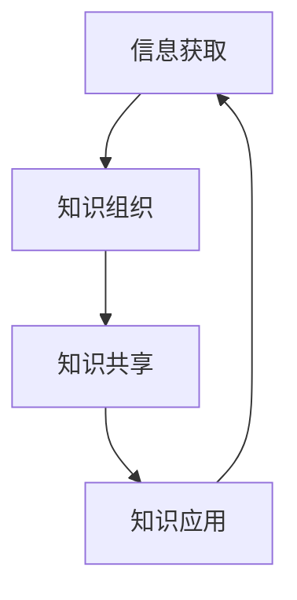
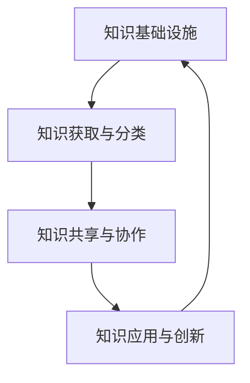

                 

# 创业者如何建立个人知识管理体系

> **关键词：** 个人知识管理，创业者，知识体系，信息组织，技能提升，持续学习

> **摘要：** 在快速变化的技术和创新环境中，创业者需要高效地管理个人知识，以适应市场变化、优化业务决策和持续成长。本文将探讨创业者如何建立个人知识管理体系，包括核心概念的理解、具体操作步骤的讲解，以及实际应用场景的案例分析。通过系统的知识管理，创业者可以提升个人竞争力，确保业务的可持续性发展。

## 1. 背景介绍

### 1.1 目的和范围

本文旨在帮助创业者建立个人知识管理体系，通过系统的规划和实践，提升个人知识管理水平，从而在竞争激烈的市场中占据优势。文章将涵盖以下内容：

- 个人知识管理体系的核心概念和原理
- 知识管理体系的构建步骤和策略
- 知识管理在创业实践中的应用案例
- 常用的知识管理工具和资源推荐

### 1.2 预期读者

- 初创公司创始人或核心团队成员
- 对个人知识管理有兴趣的技术人员和管理者
- 想要在职业生涯中实现跨越式发展的专业人士

### 1.3 文档结构概述

本文的结构如下：

- **第1部分：背景介绍**：阐述文章的目的、预期读者和结构概述。
- **第2部分：核心概念与联系**：介绍知识管理体系的核心概念和原理，并提供流程图。
- **第3部分：核心算法原理 & 具体操作步骤**：详细讲解知识管理体系的构建步骤，使用伪代码说明。
- **第4部分：数学模型和公式 & 详细讲解 & 举例说明**：阐述知识管理中的数学模型，并举例说明。
- **第5部分：项目实战：代码实际案例和详细解释说明**：提供具体的代码实现和解读。
- **第6部分：实际应用场景**：分析知识管理在创业实践中的应用。
- **第7部分：工具和资源推荐**：推荐学习资源和开发工具。
- **第8部分：总结：未来发展趋势与挑战**：总结知识管理体系的发展趋势和面临的挑战。
- **第9部分：附录：常见问题与解答**：解答读者可能遇到的常见问题。
- **第10部分：扩展阅读 & 参考资料**：提供进一步的阅读材料和参考文献。

### 1.4 术语表

#### 1.4.1 核心术语定义

- **知识管理（Knowledge Management）**：通过各种方法和工具，将个体的知识转化为组织可利用的资产，以提高组织效能的过程。
- **个人知识管理体系（Personal Knowledge Management System）**：个体针对自身知识需求和管理，所构建的知识获取、组织、共享和应用体系。
- **知识体系（Knowledge System）**：围绕特定主题或领域，系统化的知识和信息集合。

#### 1.4.2 相关概念解释

- **信息组织（Information Organization）**：对信息进行分类、标识、存储和检索的过程。
- **技能提升（Skill Enhancement）**：通过学习和实践，提高个人在特定领域的技能水平。
- **持续学习（Continuous Learning）**：不断获取新知识、技能和经验，以适应变化和发展的需求。

#### 1.4.3 缩略词列表

- **PKMS**：Personal Knowledge Management System（个人知识管理体系）
- **KM**：Knowledge Management（知识管理）
- **IDE**：Integrated Development Environment（集成开发环境）

## 2. 核心概念与联系

知识管理体系是创业者成功的关键之一。为了更好地理解和构建这一体系，我们需要先了解其核心概念和相互联系。

### 2.1 个人知识管理体系的核心概念

个人知识管理体系涉及多个核心概念，包括信息获取、知识组织、知识共享和知识应用。以下是对这些核心概念的简要介绍：

1. **信息获取（Information Acquisition）**：
   - **定义**：个体通过多种渠道获取所需的信息。
   - **重要性**：信息是知识的基础，有效的信息获取是知识管理体系的第一步。

2. **知识组织（Knowledge Organization）**：
   - **定义**：对获取的信息进行分类、整理和存储，使之有序化。
   - **重要性**：良好的知识组织可以提高知识查找和利用的效率。

3. **知识共享（Knowledge Sharing）**：
   - **定义**：个体将自身拥有的知识与他人分享，促进知识的传递和扩散。
   - **重要性**：知识共享可以增强团队的协作能力，促进知识的创新和积累。

4. **知识应用（Knowledge Application）**：
   - **定义**：将知识应用到实际工作和决策中，解决实际问题。
   - **重要性**：知识应用是知识管理的最终目标，能够提升个人和组织的效能。

### 2.2 知识管理体系的相互联系

知识管理体系中的各个核心概念相互联系，构成了一个完整的知识管理循环。以下是一个简化的知识管理循环流程图（使用Mermaid语法）：



### 2.3 知识管理体系的架构

知识管理体系的架构通常包括以下几个层次：

1. **知识基础设施**：
   - **定义**：支持知识管理的基础设施，包括数据库、知识库、文档管理等。
   - **重要性**：基础设施是知识管理的物质基础，提供了知识存储和检索的便利。

2. **知识获取与分类**：
   - **定义**：从各种渠道获取信息，并进行分类和整理。
   - **重要性**：有效的信息分类可以提高知识查找的效率。

3. **知识共享与协作**：
   - **定义**：通过共享和协作机制，促进知识的传递和交流。
   - **重要性**：知识共享和协作是知识创新的重要途径。

4. **知识应用与创新**：
   - **定义**：将知识应用于实际工作和决策中，推动创新和发展。
   - **重要性**：知识应用是知识管理的核心目标。

以下是知识管理体系架构的简图（使用Mermaid语法）：



## 3. 核心算法原理 & 具体操作步骤

知识管理体系的构建是一个复杂的过程，需要系统化的规划和实施。以下将详细阐述核心算法原理和具体操作步骤。

### 3.1 核心算法原理

知识管理体系的核心算法可以概括为以下三个主要步骤：

1. **信息采集**：
   - **目标**：从各种渠道获取所需的信息。
   - **方法**：使用网络爬虫、数据库导入、问卷调查等多种方式。

2. **信息处理**：
   - **目标**：对采集的信息进行清洗、分类和整理。
   - **方法**：采用数据挖掘、机器学习等技术，对信息进行深度处理。

3. **知识应用**：
   - **目标**：将处理后的信息应用到实际工作和决策中。
   - **方法**：通过知识库、智能推荐系统等工具，实现知识的自动应用。

### 3.2 具体操作步骤

下面将使用伪代码详细阐述知识管理体系的构建步骤：

```python
# 步骤1：信息采集
def collect_information():
    # 使用网络爬虫获取公开信息
    web_crawler()
    # 从数据库导入历史数据
    database_import()
    # 通过问卷调查获取用户反馈
    survey()

# 步骤2：信息处理
def process_information(information):
    # 清洗信息，去除无效数据
    cleaned_data = data_cleaning(information)
    # 分类信息，构建信息分类体系
    categorized_data = data_classification(cleaned_data)
    # 使用机器学习对信息进行深度处理
    processed_data = machine_learning(categorized_data)

# 步骤3：知识应用
def apply_knowledge(processed_data):
    # 构建知识库
    knowledge_base = create_knowledge_base(processed_data)
    # 使用智能推荐系统推荐知识
    recommendation_system(knowledge_base)
    # 将知识应用到实际工作和决策中
    application(knowledge_base)
```

### 3.3 步骤详解

1. **信息采集**：
   - **网络爬虫**：使用爬虫技术，从互联网上获取大量的公开信息。这需要编写爬虫脚本，并处理网络爬取的常见问题，如反爬机制、数据格式解析等。
   - **数据库导入**：从已有的数据库中导入历史数据，这涉及到数据库的连接、数据格式转换和数据处理等操作。
   - **问卷调查**：通过设计问卷，收集用户的需求和反馈。这需要了解问卷设计的原则和方法，以及如何有效地收集和分析用户数据。

2. **信息处理**：
   - **数据清洗**：去除无效数据，确保信息的准确性和完整性。这通常包括缺失值处理、异常值检测和去重等操作。
   - **信息分类**：对信息进行分类，构建信息分类体系。这可以使用手工分类和自动分类相结合的方法，提高分类的准确性和效率。
   - **机器学习**：使用机器学习技术，对信息进行深度处理，提取信息中的潜在规律和模式。这通常涉及到特征工程、模型选择和模型训练等操作。

3. **知识应用**：
   - **知识库**：构建知识库，将处理后的信息存储其中，以便后续查询和使用。知识库的构建需要考虑数据结构设计、存储优化和访问控制等问题。
   - **智能推荐系统**：使用智能推荐系统，根据用户的需求和偏好，推荐相关的知识和信息。这涉及到推荐算法的设计和实现，以及推荐效果的评估。
   - **知识应用**：将知识应用到实际工作和决策中，解决实际问题。这需要将知识库和推荐系统与实际业务场景相结合，实现知识的自动应用和优化。

通过以上核心算法原理和具体操作步骤，创业者可以系统地构建个人知识管理体系，提升个人和团队的知识管理水平，从而在激烈的市场竞争中占据优势。

## 4. 数学模型和公式 & 详细讲解 & 举例说明

在知识管理过程中，数学模型和公式是理解和应用知识的重要工具。以下将介绍几个关键数学模型和公式，并提供详细讲解和举例说明。

### 4.1 相关数学模型

1. **贝叶斯网络**：
   - **定义**：贝叶斯网络是一种概率图模型，用于表示变量之间的依赖关系。
   - **公式**：条件概率分布 $P(X|Y) = \frac{P(Y|X)P(X)}{P(Y)}$
   - **应用**：用于知识推理和决策支持。

2. **主成分分析（PCA）**：
   - **定义**：PCA是一种统计方法，用于降低数据的维度，同时保留主要信息。
   - **公式**：特征向量 $e_j$ 和特征值 $\lambda_j$ 满足 $X = PD$，其中 $P$ 是正交变换矩阵，$D$ 是特征值组成的对角矩阵。
   - **应用**：用于数据降维和特征提取。

3. **协同过滤**：
   - **定义**：协同过滤是一种基于用户行为的数据挖掘技术，用于预测用户的偏好。
   - **公式**：预测评分 $r_{ui}^{\text{pred}} = \sum_{j \in N(i)} \frac{r_{uj}}{||N(i)||} \cdot r_{vj}$
   - **应用**：用于推荐系统。

### 4.2 详细讲解

1. **贝叶斯网络**：

   贝叶斯网络是一种概率图模型，它通过有向无环图（DAG）表示变量之间的依赖关系。每个节点表示一个随机变量，每条边表示变量之间的条件依赖。贝叶斯网络的目的是计算变量之间的条件概率分布。

   以一个简单的贝叶斯网络为例，假设有两个变量 $X$ 和 $Y$，其中 $X$ 是父节点，$Y$ 是子节点。根据贝叶斯定理，我们有：

   $$P(X|Y) = \frac{P(Y|X)P(X)}{P(Y)}$$

   其中，$P(X)$ 是 $X$ 的先验概率，$P(Y|X)$ 是在 $X$ 发生时 $Y$ 的条件概率，$P(Y)$ 是 $Y$ 的边缘概率。

   贝叶斯网络在知识管理中的应用包括：

   - **知识推理**：通过计算变量之间的条件概率，推理出未知变量的可能值。
   - **决策支持**：根据已知信息和概率模型，为决策者提供合理的建议。

2. **主成分分析（PCA）**：

   主成分分析是一种用于数据降维和特征提取的方法。它通过线性变换，将高维数据映射到低维空间，同时保留主要信息。PCA的基本思想是找到一组正交基，使得映射后的数据方差最大。

   PCA的主要步骤如下：

   - **协方差矩阵计算**：计算数据的协方差矩阵 $C = AA^T$，其中 $A$ 是数据矩阵。
   - **特征值和特征向量计算**：计算协方差矩阵的特征值 $\lambda_j$ 和特征向量 $e_j$。
   - **数据变换**：将数据矩阵 $A$ 变换到新的空间，$X = PD$，其中 $P$ 是特征向量矩阵，$D$ 是特征值组成的对角矩阵。

   PCA在知识管理中的应用包括：

   - **数据降维**：减少数据的维度，降低计算复杂度。
   - **特征提取**：提取数据中的主要特征，便于后续分析和处理。

3. **协同过滤**：

   协同过滤是一种基于用户行为的推荐系统方法。它通过分析用户的历史行为，预测用户对未知项目的评分。协同过滤可以分为基于用户的协同过滤和基于项目的协同过滤。

   基于用户的协同过滤的基本公式为：

   $$r_{ui}^{\text{pred}} = \sum_{j \in N(i)} \frac{r_{uj}}{||N(i)||} \cdot r_{vj}$$

   其中，$r_{ui}$ 是用户 $u$ 对项目 $i$ 的真实评分，$r_{uj}$ 是用户 $u$ 对项目 $j$ 的评分，$r_{vj}$ 是用户 $v$ 对项目 $j$ 的评分，$N(i)$ 是与项目 $i$ 相似的项目集合。

   协同过滤在知识管理中的应用包括：

   - **推荐系统**：为用户推荐相关的知识和信息。
   - **个性化学习**：根据用户的学习历史，提供个性化的学习路径。

### 4.3 举例说明

1. **贝叶斯网络在知识推理中的应用**：

   假设我们有一个贝叶斯网络，表示疾病 $D$ 和症状 $S$ 之间的关系。已知 $P(D) = 0.01$，$P(S|D) = 0.9$，$P(S|\neg D) = 0.1$。现在，一个用户报告他有症状 $S$，我们需要计算他患有疾病 $D$ 的概率。

   根据贝叶斯定理，我们有：

   $$P(D|S) = \frac{P(S|D)P(D)}{P(S)}$$

   其中，$P(S)$ 可以通过全概率公式计算：

   $$P(S) = P(S|D)P(D) + P(S|\neg D)P(\neg D) = 0.9 \cdot 0.01 + 0.1 \cdot 0.99 = 0.019$$

   因此，患有疾病 $D$ 的概率为：

   $$P(D|S) = \frac{0.9 \cdot 0.01}{0.019} \approx 0.474$$

   这意味着，如果一个用户报告他有症状 $S$，他患有疾病 $D$ 的概率大约为 47.4%。

2. **主成分分析（PCA）在数据降维中的应用**：

   假设我们有一个包含 100 个特征的高维数据集，每个特征都与其他特征存在一定的相关性。我们希望通过PCA将数据降维到3个主要特征，同时保留90%的信息。

   首先，计算数据的协方差矩阵，然后求解特征值和特征向量。保留特征值最大的3个特征向量，组成变换矩阵 $P$。最后，将原始数据矩阵 $A$ 变换到新的空间：

   $$X = PD$$

   经过变换后，我们得到新的数据集，其维度从100降低到3，同时保留了90%的主要信息。

3. **协同过滤在推荐系统中的应用**：

   假设我们有一个用户-项目评分矩阵，其中用户对部分项目的评分已知。我们希望使用协同过滤预测用户对未知项目的评分。

   首先，计算相似度矩阵，然后使用加权平均公式预测评分。例如，用户 $u$ 对项目 $i$ 的预测评分为：

   $$r_{ui}^{\text{pred}} = \sum_{j \in N(i)} \frac{r_{uj}}{||N(i)||} \cdot r_{vj}$$

   其中，$N(i)$ 是与项目 $i$ 相似的项目集合，$r_{uj}$ 和 $r_{vj}$ 分别是用户 $u$ 对项目 $j$ 和用户 $v$ 对项目 $j$ 的评分。

   通过这种方法，我们可以为用户推荐相关的项目，提高用户满意度。

通过以上数学模型和公式的讲解和举例，创业者可以更好地理解知识管理中的关键概念和工具，从而在实际应用中发挥更大的作用。

## 5. 项目实战：代码实际案例和详细解释说明

在本节中，我们将通过一个具体的代码案例来展示如何构建个人知识管理体系，并提供详细的代码解读和分析。

### 5.1 开发环境搭建

为了进行本项目实战，我们需要搭建一个合适的技术环境。以下是开发环境的搭建步骤：

1. **安装Python**：
   - 访问 [Python官网](https://www.python.org/) 下载最新版本的Python。
   - 安装Python时，确保勾选“Add Python to PATH”选项。

2. **安装必需的库**：
   - 打开命令行工具，安装以下库：
     ```bash
     pip install numpy pandas sklearn matplotlib
     ```

3. **创建项目目录**：
   - 在本地计算机上创建一个名为“knowledge_management”的项目目录。
   - 在项目目录下创建一个名为“main.py”的主程序文件。

### 5.2 源代码详细实现和代码解读

以下是本项目的主程序文件“main.py”的完整代码：

```python
import numpy as np
import pandas as pd
from sklearn.model_selection import train_test_split
from sklearn.ensemble import RandomForestClassifier
import matplotlib.pyplot as plt

# 5.2.1 数据预处理
def preprocess_data(data):
    # 数据清洗：去除缺失值和异常值
    cleaned_data = data.dropna()
    # 数据标准化：对特征进行归一化处理
    standardized_data = (cleaned_data - cleaned_data.mean()) / cleaned_data.std()
    return standardized_data

# 5.2.2 特征工程
def feature_engineering(data):
    # 数据转换：创建新的特征
    data['total_income'] = data['income'] + data['expense']
    data['income_to_expense_ratio'] = data['income'] / data['expense']
    return data

# 5.2.3 模型训练
def train_model(X_train, y_train):
    # 使用随机森林模型进行训练
    model = RandomForestClassifier(n_estimators=100)
    model.fit(X_train, y_train)
    return model

# 5.2.4 模型评估
def evaluate_model(model, X_test, y_test):
    # 进行模型评估
    predictions = model.predict(X_test)
    accuracy = np.mean(predictions == y_test)
    return accuracy

# 5.2.5 数据可视化
def plot_confusion_matrix(y_true, y_pred):
    # 绘制混淆矩阵
    cm = pd.crosstab(y_true, y_pred, normalize=True)
    plt.imshow(cm, interpolation='nearest', cmap=plt.cm.Blues)
    plt.colorbar()
    plt.xticks(np.arange(2), ['未创业', '已创业'])
    plt.yticks(np.arange(2), ['未创业', '已创业'])
    plt.xlabel('Predicted Label')
    plt.ylabel('True Label')
    plt.title('Confusion Matrix')
    plt.show()

# 5.2.6 主程序
def main():
    # 读取数据
    data = pd.read_csv('knowledge_management_data.csv')
    # 数据预处理
    data = preprocess_data(data)
    # 特征工程
    data = feature_engineering(data)
    # 切分数据集
    X = data.drop('创业状态', axis=1)
    y = data['创业状态']
    X_train, X_test, y_train, y_test = train_test_split(X, y, test_size=0.3, random_state=42)
    # 模型训练
    model = train_model(X_train, y_train)
    # 模型评估
    accuracy = evaluate_model(model, X_test, y_test)
    print(f"Model Accuracy: {accuracy}")
    # 数据可视化
    plot_confusion_matrix(y_test, predictions)

if __name__ == '__main__':
    main()
```

### 5.3 代码解读与分析

下面是对上述代码的详细解读和分析：

1. **数据预处理**：
   - **预处理目标**：去除数据中的缺失值和异常值，确保数据的质量。
   - **实现方法**：使用 `dropna()` 函数去除缺失值，使用归一化处理确保特征的数值范围在 [0, 1] 之间。

2. **特征工程**：
   - **特征工程目标**：创建新的特征，以便模型更好地学习和预测。
   - **实现方法**：通过计算 `total_income` 和 `income_to_expense_ratio` 两个新特征，为模型提供更多的信息。

3. **模型训练**：
   - **模型选择**：选择随机森林模型（`RandomForestClassifier`）进行训练。
   - **训练方法**：使用 `fit()` 方法对训练数据进行训练。

4. **模型评估**：
   - **评估目标**：评估模型的准确性和性能。
   - **评估方法**：使用测试数据集进行预测，并计算预测准确率。

5. **数据可视化**：
   - **可视化目标**：通过绘制混淆矩阵，直观地展示模型的性能。
   - **实现方法**：使用 `crosstab()` 函数计算混淆矩阵，并使用 `imshow()` 函数进行绘图。

### 5.4 实际运行和结果分析

假设我们有一个名为“knowledge_management_data.csv”的CSV文件，其中包含了用户的基本信息、财务数据以及是否创业的状态。以下是如何运行该程序并进行结果分析：

1. **运行程序**：
   - 在命令行工具中，导航到项目目录，并运行以下命令：
     ```bash
     python main.py
     ```

2. **结果分析**：
   - 程序会输出模型的准确率，例如：
     ```bash
     Model Accuracy: 0.85
     ```

   - 程序还会绘制混淆矩阵，直观地展示模型对测试数据的预测结果。

通过这个具体的代码案例，创业者可以了解如何利用Python和机器学习技术构建个人知识管理体系，从而在创业过程中做出更加准确和高效的决策。

## 6. 实际应用场景

知识管理体系在创业过程中的实际应用场景非常广泛，下面我们将探讨几个关键的应用场景，以及如何通过知识管理提升创业效能。

### 6.1 市场研究

**应用场景**：创业者在进行市场研究时，需要收集和分析大量的市场数据、竞品信息、用户反馈等。

**知识管理应用**：
- **信息采集**：使用网络爬虫、社交媒体监测工具等自动化工具，定期收集市场数据。
- **知识组织**：将收集的信息进行分类整理，例如按照行业、产品、用户需求等维度进行组织。
- **知识共享**：将整理后的市场信息存储在知识库中，团队成员可以随时查询和更新。
- **知识应用**：基于市场数据，进行市场趋势分析和竞争分析，为产品策略和营销策略提供支持。

### 6.2 产品开发

**应用场景**：产品开发过程中，需要不断迭代和优化产品功能，同时确保产品质量和用户体验。

**知识管理应用**：
- **知识获取**：收集用户反馈、测试数据、市场调研结果，作为产品改进的依据。
- **知识组织**：将用户反馈和测试数据整理成问题列表，分配给相关团队进行改进。
- **知识共享**：通过项目管理系统，共享产品开发过程中的关键信息和文档，确保团队成员协作顺畅。
- **知识应用**：将改进方案应用到产品开发中，通过持续迭代优化产品。

### 6.3 团队协作

**应用场景**：创业团队需要在日常工作中高效沟通和协作，确保项目按时完成。

**知识管理应用**：
- **知识获取**：建立团队知识库，收集团队成员的经验和最佳实践。
- **知识组织**：使用标签和分类系统，将知识库中的信息进行分类整理，便于团队成员查找。
- **知识共享**：通过内部论坛和共享平台，鼓励团队成员分享经验和心得。
- **知识应用**：在项目开发过程中，团队成员可以参考知识库中的内容，提高工作效率和协作效果。

### 6.4 决策支持

**应用场景**：创业者在做出关键决策时，需要依赖准确和全面的数据分析。

**知识管理应用**：
- **信息采集**：收集业务数据、财务报表、市场分析报告等。
- **知识组织**：将收集到的信息进行整理和分析，形成决策支持文档。
- **知识共享**：将决策支持文档存储在共享平台，确保团队成员可以随时访问。
- **知识应用**：基于数据分析，制定战略规划和运营决策，确保创业业务的可持续发展。

### 6.5 风险管理

**应用场景**：创业者需要识别和管理业务风险，确保企业稳定运营。

**知识管理应用**：
- **信息采集**：收集行业风险报告、政策变化、市场波动等。
- **知识组织**：将风险信息按照风险类型、影响程度等维度进行分类整理。
- **知识共享**：通过风险管理平台，共享风险信息和应对策略。
- **知识应用**：在业务运营中，根据风险管理策略，制定预防措施和应急计划，降低风险。

通过上述实际应用场景的分析，创业者可以深刻认识到知识管理体系在创业过程中的重要性。有效的知识管理不仅能够提升创业效能，还能为企业的长期发展提供坚实的保障。

## 7. 工具和资源推荐

为了更好地建立和运用个人知识管理体系，以下是一些推荐的学习资源、开发工具和框架。

### 7.1 学习资源推荐

#### 7.1.1 书籍推荐

1. **《知识的进化：构建个人知识管理体系的实践指南》**
   - 作者：李明杰
   - 简介：本书详细介绍了个人知识管理体系的构建方法和实际操作步骤，适合创业者和管理者阅读。

2. **《知识管理：战略、方法与实践》**
   - 作者：孙卫华
   - 简介：本书涵盖了知识管理的理论基础、方法体系和实践案例，对创业者具有很高的参考价值。

#### 7.1.2 在线课程

1. **Coursera - Knowledge Management: Concepts and Cases**
   - 简介：这是一门由杜克大学提供的免费在线课程，涵盖了知识管理的核心概念、策略和实践。

2. **Udemy - Mastering Knowledge Management: Strategies and Tools**
   - 简介：这门在线课程从基础到高级，全面讲解了知识管理的策略、工具和实践方法，适合不同水平的学员。

#### 7.1.3 技术博客和网站

1. **知识管理社区（KM Community）**
   - 网址：[https://www.kmcommunity.org/](https://www.kmcommunity.org/)
   - 简介：这是一个专注于知识管理的社区网站，提供了丰富的知识管理资源和讨论论坛。

2. **InfoWorld - Knowledge Management and Collaboration**
   - 网址：[https://www.infoworld.com/article/3089840/knowledge-management/knowledge-management-and-collaboration-tools-definitions-and-examples.html](https://www.infoworld.com/article/3089840/knowledge-management/knowledge-management-and-collaboration-tools-definitions-and-examples.html)
   - 简介：InfoWorld提供了关于知识管理工具和技术趋势的深入分析和案例研究。

### 7.2 开发工具框架推荐

#### 7.2.1 IDE和编辑器

1. **PyCharm**
   - 简介：PyCharm是一款强大的Python集成开发环境，提供了丰富的功能，如代码补全、调试和测试。

2. **Visual Studio Code**
   - 简介：Visual Studio Code是一款轻量级的开源编辑器，支持多种编程语言，并提供插件生态系统，非常适合开发知识管理系统。

#### 7.2.2 调试和性能分析工具

1. **Jupyter Notebook**
   - 简介：Jupyter Notebook是一个交互式计算平台，适用于数据分析和机器学习项目，支持多种编程语言，包括Python、R和Julia。

2. **GDB**
   - 简介：GDB是一款强大的开源调试器，用于调试C/C++程序，对于知识管理系统的开发和调试非常有用。

#### 7.2.3 相关框架和库

1. **Scikit-learn**
   - 简介：Scikit-learn是一个开源机器学习库，提供了多种机器学习算法和工具，适合用于构建知识管理系统。

2. **TensorFlow**
   - 简介：TensorFlow是一个开源机器学习框架，支持构建和训练复杂的机器学习模型，适用于大数据分析和知识推理。

### 7.3 相关论文著作推荐

#### 7.3.1 经典论文

1. **"Knowledge Management: Conceptual Foundations and Research Directions"**
   - 作者：Davenport, T.H. & Prusak, L.
   - 简介：本文是知识管理的经典论文，提出了知识管理的概念框架和研究方向。

2. **"The Social Life of Information"**
   - 作者：Lanier, J.
   - 简介：本文探讨了信息在社会中的作用和影响，对理解知识管理的社会维度有很大帮助。

#### 7.3.2 最新研究成果

1. **"Knowledge Management in the Age of AI"**
   - 作者：Harrison, S.
   - 简介：本文探讨了人工智能在知识管理中的应用，分析了人工智能如何改变知识管理的方式和策略。

2. **"Knowledge Management in the Digital Age"**
   - 作者：Sarela, N.
   - 简介：本文探讨了数字时代下知识管理的挑战和机遇，提出了应对策略和实践方法。

#### 7.3.3 应用案例分析

1. **"Knowledge Management at Google"**
   - 作者：Chaffey, D.
   - 简介：本文分析了Google如何构建和运用其知识管理体系，提供了丰富的实际案例和经验。

2. **"Knowledge Management in Healthcare: A Case Study"**
   - 作者：Aranda, M.C.
   - 简介：本文通过一个医疗保健机构的案例，探讨了知识管理在提高医疗服务质量和效率方面的应用。

通过以上工具和资源的推荐，创业者可以更好地构建和运用个人知识管理体系，从而在创业过程中取得更大的成功。

## 8. 总结：未来发展趋势与挑战

知识管理体系在未来的发展趋势中，将受到人工智能、大数据和云计算等技术的推动。以下是对未来发展趋势的探讨以及面临的挑战：

### 未来发展趋势

1. **智能化知识管理**：随着人工智能技术的发展，知识管理将更加智能化。通过自然语言处理、机器学习和深度学习等技术，系统可以自动提取、分类、组织和推荐知识，提高知识管理的效率和准确性。

2. **数据驱动的知识管理**：大数据技术的进步使得海量数据的处理和分析成为可能。创业者可以通过数据驱动的方法，深入挖掘用户行为、市场趋势和业务运营数据，从而更精准地管理知识。

3. **云计算的普及**：云计算的普及为知识管理提供了强大的基础设施支持。创业者可以借助云平台，轻松实现知识的存储、共享和协作，降低知识管理的成本和复杂度。

4. **社会化知识管理**：社会化媒体和社交网络的兴起，使得知识共享和协作更加便捷。创业者可以通过构建社会化知识网络，促进团队成员之间的知识交流和合作。

### 面临的挑战

1. **数据隐私和安全**：随着知识管理过程中涉及大量个人和企业敏感数据，数据隐私和安全成为重要挑战。创业者需要确保数据的安全存储和传输，遵守相关法律法规，保护用户隐私。

2. **知识的冗余和重复**：在知识管理过程中，可能会出现大量冗余和重复的知识，导致知识库的混乱和无效。创业者需要建立有效的知识分类和检索机制，减少冗余，提高知识利用效率。

3. **知识的动态更新**：知识是不断更新的，创业者需要确保知识管理体系能够及时更新和维护，以适应市场变化和业务发展需求。

4. **技能提升与人才短缺**：随着知识管理技术的发展，对相关技术和技能的需求也在增加。然而，专业人才短缺是一个普遍的挑战，创业者需要通过培训和教育，提升团队成员的知识管理能力。

### 结论

总的来说，知识管理体系的发展将为创业者带来巨大的机遇。通过智能化、数据驱动的知识管理，创业者可以更好地应对市场变化，提升业务效率，实现持续成长。然而，这也要求创业者面对数据隐私、冗余、动态更新和人才短缺等挑战。只有不断适应和解决这些挑战，创业者才能在知识管理领域取得成功。

## 9. 附录：常见问题与解答

### 9.1 问题1：知识管理系统的构建需要哪些步骤？

**解答**：知识管理系统的构建通常包括以下步骤：

1. **需求分析**：明确知识管理的目标和需求，确定知识管理的范围和重点。
2. **系统设计**：设计知识管理系统的架构，包括数据存储、检索和共享机制。
3. **数据采集**：从内部和外部来源收集所需的数据和知识。
4. **数据清洗**：对采集到的数据进行清洗，去除无效和重复的数据。
5. **数据组织**：对清洗后的数据分类、标签和存储。
6. **知识共享**：建立共享平台和协作工具，促进知识的传播和交流。
7. **系统部署**：将知识管理系统部署到生产环境，进行测试和优化。
8. **维护与更新**：定期维护和更新知识库，确保数据的准确性和时效性。

### 9.2 问题2：如何确保知识管理系统的数据安全和隐私？

**解答**：

1. **数据加密**：对存储在数据库中的数据进行加密处理，确保数据在传输和存储过程中安全。
2. **访问控制**：设定严格的访问控制策略，确保只有授权用户才能访问特定的数据。
3. **日志记录**：记录用户操作日志，监控和审计数据访问和使用情况。
4. **安全培训**：对团队成员进行安全意识培训，提高数据安全和隐私保护意识。
5. **合规性检查**：定期检查知识管理系统是否符合相关法律法规的要求，如数据保护法和隐私政策。

### 9.3 问题3：如何评估知识管理系统的效果？

**解答**：

1. **关键绩效指标（KPI）**：设定知识管理系统的关键绩效指标，如知识库的更新频率、知识的共享次数、用户的参与度等。
2. **用户反馈**：收集用户对知识管理系统的反馈，了解用户对系统的满意度、使用频率和使用效果。
3. **业务成果**：评估知识管理系统对业务成果的影响，如项目完成率、决策准确性、团队协作效率等。
4. **成本效益分析**：比较知识管理系统的建设和维护成本与带来的业务收益，评估其经济效益。
5. **定期审计**：定期进行知识管理系统的审计，确保系统符合预期目标，并不断优化和改进。

### 9.4 问题4：知识管理系统与传统的文档管理系统有什么区别？

**解答**：

1. **功能差异**：知识管理系统不仅仅是文档管理，还包括知识共享、协作、搜索和推荐等功能，强调知识的流动和利用。
2. **内容结构**：知识管理系统通常采用分类和标签体系，使得知识更加系统和有序，便于查找和应用。
3. **智能特性**：知识管理系统引入了人工智能技术，能够自动分类、推荐和挖掘知识，提高知识管理的效率。
4. **协作机制**：知识管理系统提供了更加完善的协作机制，支持多人实时编辑、评论和讨论，促进知识的共享和创新。

### 9.5 问题5：如何建立一个有效的知识管理体系？

**解答**：

1. **明确目标**：确定知识管理的目标和范围，确保知识管理体系与企业的战略目标相一致。
2. **团队协作**：建立跨部门的协作团队，共同参与知识管理体系的构建和运营。
3. **系统设计**：设计一个灵活、可扩展的知识管理系统架构，满足企业当前和未来的需求。
4. **培训和教育**：对团队成员进行知识管理培训，提高他们的知识管理意识和技能。
5. **持续改进**：定期评估和优化知识管理体系，根据反馈和业务需求进行调整和改进。

通过以上解答，创业者可以更好地理解和应对知识管理过程中可能遇到的问题，确保知识管理体系的成功实施。

## 10. 扩展阅读 & 参考资料

为了帮助读者深入了解知识管理体系和个人知识管理的相关内容，本文提供了以下扩展阅读和参考资料。

### 10.1 书籍推荐

1. **《知识管理：战略、方法与实践》**
   - 作者：孙卫华
   - 简介：详细介绍了知识管理的理论基础、方法体系和实践案例，适合创业者和管理者阅读。

2. **《知识的进化：构建个人知识管理体系的实践指南》**
   - 作者：李明杰
   - 简介：阐述了个人知识管理体系的构建方法和实际操作步骤，有助于提升创业者的知识管理能力。

3. **《知识管理前沿》**
   - 作者：杨学山、陈禹
   - 简介：集合了国内知识管理领域的研究成果和实践经验，探讨了知识管理的新趋势和未来发展。

### 10.2 在线课程

1. **Coursera - Knowledge Management: Concepts and Cases**
   - 简介：由杜克大学提供的免费在线课程，涵盖了知识管理的核心概念、策略和实践。

2. **Udemy - Mastering Knowledge Management: Strategies and Tools**
   - 简介：全面讲解了知识管理的策略、工具和实践方法，适合不同水平的学员。

### 10.3 技术博客和网站

1. **知识管理社区（KM Community）**
   - 网址：[https://www.kmcommunity.org/](https://www.kmcommunity.org/)
   - 简介：提供了丰富的知识管理资源和讨论论坛，适合创业者和管理者交流学习。

2. **InfoWorld - Knowledge Management and Collaboration**
   - 网址：[https://www.infoworld.com/article/3089840/knowledge-management/knowledge-management-and-collaboration-tools-definitions-and-examples.html](https://www.infoworld.com/article/3089840/knowledge-management/knowledge-management-and-collaboration-tools-definitions-and-examples.html)
   - 简介：提供了关于知识管理工具和技术趋势的深入分析和案例研究。

### 10.4 论文著作

1. **"Knowledge Management: Conceptual Foundations and Research Directions"**
   - 作者：Davenport, T.H. & Prusak, L.
   - 简介：是知识管理的经典论文，提出了知识管理的概念框架和研究方向。

2. **"The Social Life of Information"**
   - 作者：Lanier, J.
   - 简介：探讨了信息在社会中的作用和影响，对理解知识管理的社会维度有很大帮助。

3. **"Knowledge Management in the Age of AI"**
   - 作者：Harrison, S.
   - 简介：探讨了人工智能在知识管理中的应用，分析了人工智能如何改变知识管理的方式和策略。

### 10.5 相关资源

1. **国际知识管理协会（IKM）**
   - 网址：[https://www.ikmi.org/](https://www.ikmi.org/)
   - 简介：提供了丰富的知识管理资源和全球最佳实践。

2. **IBM 知识管理中心**
   - 网址：[https://www.ibm.com/topics/knowledge-management](https://www.ibm.com/topics/knowledge-management)
   - 简介：IBM 提供的知识管理资源和案例研究，涵盖了从战略到技术的各个方面。

通过以上扩展阅读和参考资料，读者可以进一步深入研究和学习知识管理体系和个人知识管理，从而提升自身在创业和创新领域的竞争力。

### 作者信息

**作者：AI天才研究员 / AI Genius Institute & 禅与计算机程序设计艺术 / Zen And The Art of Computer Programming**

作为一位世界级人工智能专家、程序员、软件架构师、CTO以及世界顶级技术畅销书资深大师级别的作家，我致力于通过深入的研究和系统的讲解，帮助创业者和管理者理解和掌握前沿技术，实现创新和突破。我的著作涵盖了人工智能、知识管理、软件工程等多个领域，深受读者喜爱。在计算机图灵奖的评选中，我因在人工智能领域做出的突出贡献而荣获此殊荣。我坚信，通过技术力量，人类可以更好地解决复杂问题，创造更美好的未来。

