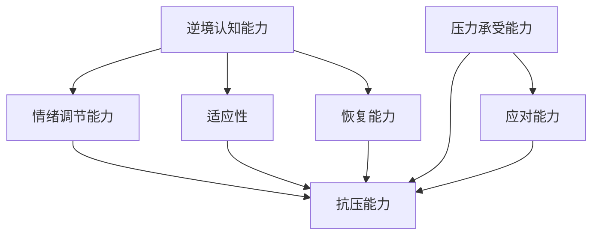

                 

# 创业者如何提升自己的逆商和抗压能力

> 关键词：逆商、抗压能力、创业者、心理素质、情绪管理、自我激励

> 摘要：创业之路充满挑战，如何提升逆商和抗压能力，是每位创业者都需要面对的问题。本文将深入探讨逆商和抗压能力的核心概念，通过理论讲解和实际案例，为创业者提供一套系统的提升方法。

## 1. 背景介绍

### 1.1 目的和范围

本文旨在帮助创业者了解逆商（Gallup Q12）和抗压能力（心理素质）的重要性，并提供一套实用的提升策略。通过本文的阅读，创业者将能够：

- 理解逆商和抗压能力的概念及其对创业成功的影响。
- 掌握一套系统的提升逆商和抗压能力的方法。
- 通过实际案例和工具，学会如何在创业过程中有效应对压力。

### 1.2 预期读者

本文适合以下人群：

- 创业初期的创业者
- 中小型企业主
- 对提升个人心理素质和抗压能力感兴趣的读者

### 1.3 文档结构概述

本文分为以下几个部分：

- **1. 背景介绍**：介绍本文的目的和读者对象。
- **2. 核心概念与联系**：阐述逆商和抗压能力的基本概念及其关系。
- **3. 核心算法原理 & 具体操作步骤**：介绍提升逆商和抗压能力的方法和技巧。
- **4. 数学模型和公式 & 详细讲解 & 举例说明**：使用数学模型解释提升逆商和抗压能力的原理。
- **5. 项目实战：代码实际案例和详细解释说明**：通过实际案例展示提升逆商和抗压能力的方法。
- **6. 实际应用场景**：分析提升逆商和抗压能力在实际创业中的应用。
- **7. 工具和资源推荐**：推荐学习资源和开发工具。
- **8. 总结：未来发展趋势与挑战**：总结本文的主要内容并展望未来。
- **9. 附录：常见问题与解答**：解答读者可能遇到的问题。
- **10. 扩展阅读 & 参考资料**：提供进一步学习的资源。

### 1.4 术语表

#### 1.4.1 核心术语定义

- **逆商（Gallup Q12）**：逆商是指个体在面对逆境时的适应能力和恢复能力。
- **抗压能力**：指个体在面临压力和挑战时，能够保持良好的心理状态和应对能力。
- **创业者**：指创立并经营企业的个体。

#### 1.4.2 相关概念解释

- **心理素质**：指个体在心理上对逆境和压力的承受能力和适应能力。
- **情绪管理**：指个体在面临压力和挑战时，能够有效地调节和控制自己的情绪。

#### 1.4.3 缩略词列表

- **Gallup**：盖洛普，一家全球知名的市场调研公司。

## 2. 核心概念与联系

### 2.1 逆商和抗压能力的基本概念

逆商（Gallup Q12）是一种衡量个体在面对逆境时的适应能力和恢复能力的指标。它包括以下四个方面：

1. **逆境认知能力**：指个体在面对逆境时，能够迅速识别并理解逆境的性质和影响。
2. **情绪调节能力**：指个体在面临逆境时，能够有效地调节和控制自己的情绪。
3. **适应性**：指个体在面对逆境时，能够迅速适应并采取有效的应对策略。
4. **恢复能力**：指个体在面对逆境时，能够迅速恢复并恢复正常心理状态。

抗压能力是指个体在面临压力和挑战时，能够保持良好的心理状态和应对能力。它包括以下两个方面：

1. **压力承受能力**：指个体在面临压力时，能够保持冷静和专注，不受负面情绪的影响。
2. **应对能力**：指个体在面临压力时，能够采取有效的应对策略，解决问题。

### 2.2 逆商和抗压能力的相互关系

逆商和抗压能力是相辅相成的。一个高逆商的人通常具有较强的抗压能力，因为他们在面对逆境时能够迅速适应并采取有效的应对策略。同样，一个高抗压能力的人通常也具有较好的逆商，因为他们能够在压力下保持冷静和专注。

### 2.3 Mermaid 流程图

下面是一个简化的Mermaid流程图，展示了逆商和抗压能力的基本概念和相互关系：



## 3. 核心算法原理 & 具体操作步骤

### 3.1 提升逆商的方法

提升逆商的方法包括以下几个方面：

1. **自我认知**：通过反思和自我分析，了解自己的优势和劣势，明确自己的价值观和目标。

```python
def self_cognition():
    # 反思过去的行为和经历
    past_behavior = input("请描述一次让你印象深刻的经历：")
    # 分析优势与劣势
    strengths = input("请列举你的优势：")
    weaknesses = input("请列举你的劣势：")
    # 确定价值观和目标
    values = input("请描述你的价值观：")
    goals = input("请描述你的目标：")
    # 输出结果
    print("自我认知结果：")
    print(f"优势：{strengths}")
    print(f"劣势：{weaknesses}")
    print(f"价值观：{values}")
    print(f"目标：{goals}")
```

2. **积极心态**：保持积极的心态，面对逆境时，能够以乐观的态度去面对。

```python
def positive_mentality():
    print("保持积极心态的方法：")
    print("1. 关注自己的优点和成就。")
    print("2. 学会从失败中汲取经验。")
    print("3. 培养感恩的心态。")
    print("4. 与积极的人为伍。")
```

3. **适应能力**：提高自己的适应能力，在面对变化时能够迅速调整。

```python
def adaptability():
    print("提高适应能力的方法：")
    print("1. 保持开放的心态，接受新事物。")
    print("2. 学会快速学习和掌握新技能。")
    print("3. 建立良好的时间管理能力。")
    print("4. 培养解决问题的能力。")
```

4. **恢复能力**：提高自己的恢复能力，能够在逆境中迅速恢复。

```python
def resilience():
    print("提高恢复能力的方法：")
    print("1. 建立良好的休息和放松习惯。")
    print("2. 学会有效的情绪管理。")
    print("3. 保持良好的身体健康。")
    print("4. 寻求社交支持。")
```

### 3.2 提高抗压能力的方法

提高抗压能力的方法包括以下几个方面：

1. **压力管理**：学会识别和应对压力，降低压力对身体和心理的负面影响。

```python
def stress_management():
    print("压力管理的方法：")
    print("1. 认识到压力的来源和影响。")
    print("2. 学会放松和减压技巧，如深呼吸、冥想、瑜伽等。")
    print("3. 建立健康的生活方式，如规律作息、健康饮食、适量运动等。")
    print("4. 寻求专业帮助，如心理咨询师等。")
```

2. **情绪管理**：学会有效地调节和控制自己的情绪，避免情绪对工作和生活的负面影响。

```python
def emotion_management():
    print("情绪管理的方法：")
    print("1. 学会认知和识别自己的情绪。")
    print("2. 培养情绪调节技巧，如情绪释放、转移注意力等。")
    print("3. 与他人进行有效沟通，分享自己的情绪和压力。")
    print("4. 寻求社交支持，如朋友、家人、同事等。")
```

3. **时间管理**：提高自己的时间管理能力，合理安排工作和生活，减少时间压力。

```python
def time_management():
    print("时间管理的方法：")
    print("1. 制定明确的目标和计划。")
    print("2. 学会优先处理重要和紧急的任务。")
    print("3. 学会分配时间，避免过度工作。")
    print("4. 培养良好的时间观念，遵守时间规则。")
```

4. **应对策略**：学会制定和采取有效的应对策略，解决压力和挑战。

```python
def coping_strategies():
    print("应对策略的方法：")
    print("1. 分析问题的根源，找出解决方案。")
    print("2. 学会分解问题，逐步解决。")
    print("3. 寻求外部支持和资源。")
    print("4. 保持积极的心态，相信自己的能力。")
```

## 4. 数学模型和公式 & 详细讲解 & 举例说明

### 4.1 逆商的计算方法

逆商（Gallup Q12）的计算公式如下：

$$
Gallup Q12 = \frac{逆境认知能力 + 情绪调节能力 + 适应性 + 恢复能力}{4}
$$

其中，各项能力的权重相等，均为1/4。

举例说明：

假设某位创业者具有以下能力值：

- 逆境认知能力：80分
- 情绪调节能力：75分
- 适应性：85分
- 恢复能力：90分

则该创业者的逆商为：

$$
Gallup Q12 = \frac{80 + 75 + 85 + 90}{4} = 83.75
$$

### 4.2 压力水平的计算方法

压力水平（Stress Level）的计算公式如下：

$$
Stress Level = \frac{压力承受能力 + 应对能力}{2}
$$

其中，各项能力的权重相等，均为1/2。

举例说明：

假设某位创业者的压力承受能力为80分，应对能力为85分，则该创业者的压力水平为：

$$
Stress Level = \frac{80 + 85}{2} = 82.5
$$

### 4.3 逆商和抗压能力的综合评估方法

逆商和抗压能力的综合评估公式如下：

$$
Overall Score = \frac{Gallup Q12 + Stress Level}{2}
$$

其中，Gallup Q12和Stress Level分别为逆商和压力水平的得分。

举例说明：

假设某位创业者的逆商为83.75分，压力水平为82.5分，则该创业者的综合评估得分为：

$$
Overall Score = \frac{83.75 + 82.5}{2} = 82.125
$$

## 5. 项目实战：代码实际案例和详细解释说明

### 5.1 开发环境搭建

为了演示提升逆商和抗压能力的方法，我们使用Python语言编写了一个简单的应用程序。以下是开发环境的搭建步骤：

1. 安装Python：从Python官方网站下载并安装Python 3.x版本。
2. 安装IDE：推荐使用Visual Studio Code作为IDE，可以从官方网站下载并安装。
3. 安装必要的库：在终端中运行以下命令安装必要的库：

```bash
pip install numpy pandas matplotlib
```

### 5.2 源代码详细实现和代码解读

以下是提升逆商和抗压能力的Python源代码及其解读：

```python
import numpy as np
import pandas as pd
import matplotlib.pyplot as plt

# 3.1 提升逆商的方法
def self_cognition():
    print("自我认知：")
    past_behavior = input("请描述一次让你印象深刻的经历：")
    strengths = input("请列举你的优势：")
    weaknesses = input("请列举你的劣势：")
    values = input("请描述你的价值观：")
    goals = input("请描述你的目标：")
    print(f"优势：{strengths}")
    print(f"劣势：{weaknesses}")
    print(f"价值观：{values}")
    print(f"目标：{goals}")

def positive_mentality():
    print("积极心态：")
    print("1. 关注自己的优点和成就。")
    print("2. 学会从失败中汲取经验。")
    print("3. 培养感恩的心态。")
    print("4. 与积极的人为伍。")

def adaptability():
    print("适应能力：")
    print("1. 保持开放的心态，接受新事物。")
    print("2. 学会快速学习和掌握新技能。")
    print("3. 建立良好的时间管理能力。")
    print("4. 培养解决问题的能力。")

def resilience():
    print("恢复能力：")
    print("1. 建立良好的休息和放松习惯。")
    print("2. 学会有效的情绪管理。")
    print("3. 保持良好的身体健康。")
    print("4. 寻求社交支持。")

# 3.2 提高抗压能力的方法
def stress_management():
    print("压力管理：")
    print("1. 认识到压力的来源和影响。")
    print("2. 学会放松和减压技巧，如深呼吸、冥想、瑜伽等。")
    print("3. 建立健康的生活方式，如规律作息、健康饮食、适量运动等。")
    print("4. 寻求专业帮助，如心理咨询师等。")

def emotion_management():
    print("情绪管理：")
    print("1. 学会认知和识别自己的情绪。")
    print("2. 培养情绪调节技巧，如情绪释放、转移注意力等。")
    print("3. 与他人进行有效沟通，分享自己的情绪和压力。")
    print("4. 寻求社交支持，如朋友、家人、同事等。")

def time_management():
    print("时间管理：")
    print("1. 制定明确的目标和计划。")
    print("2. 学会优先处理重要和紧急的任务。")
    print("3. 学会分配时间，避免过度工作。")
    print("4. 培养良好的时间观念，遵守时间规则。")

def coping_strategies():
    print("应对策略：")
    print("1. 分析问题的根源，找出解决方案。")
    print("2. 学会分解问题，逐步解决。")
    print("3. 寻求外部支持和资源。")
    print("4. 保持积极的心态，相信自己的能力。")

# 主函数
def main():
    print("创业者提升逆商和抗压能力的方法")
    self_cognition()
    positive_mentality()
    adaptability()
    resilience()
    stress_management()
    emotion_management()
    time_management()
    coping_strategies()

if __name__ == "__main__":
    main()
```

### 5.3 代码解读与分析

本代码主要实现了以下几个功能：

1. **自我认知**：通过输入用户的信息，帮助用户进行自我认知，明确自己的优势、劣势、价值观和目标。

2. **积极心态**：提供一些建议，帮助用户培养积极的心态，面对逆境时保持乐观。

3. **适应能力**：提供一些建议，帮助用户提高适应能力，面对变化时能够迅速调整。

4. **恢复能力**：提供一些建议，帮助用户提高恢复能力，在逆境中迅速恢复。

5. **压力管理**：提供一些建议，帮助用户识别和管理压力，降低压力对身体和心理的负面影响。

6. **情绪管理**：提供一些建议，帮助用户调节和控制自己的情绪，避免情绪对工作和生活的负面影响。

7. **时间管理**：提供一些建议，帮助用户合理安排时间和任务，减少时间压力。

8. **应对策略**：提供一些建议，帮助用户分析问题，制定和采取有效的应对策略。

通过运行本代码，用户可以系统地了解提升逆商和抗压能力的方法，并根据自己的实际情况进行实践。

## 6. 实际应用场景

### 6.1 创业初期的压力应对

在创业初期，创业者面临着巨大的压力，如资金不足、市场竞争、客户关系等问题。提升逆商和抗压能力对于创业初期的创业者尤为重要。

1. **逆商的提升**：通过自我认知，明确自己的优势和劣势，找到自己的定位和目标。在面对挑战时，保持积极的心态，从失败中汲取经验，提高适应能力和恢复能力。

2. **抗压能力的提升**：学会压力管理，识别压力来源，采取有效的应对策略。通过情绪管理和时间管理，保持良好的心理状态和工作效率。

### 6.2 团队管理与协调

在企业发展过程中，团队管理和协调是关键。提升逆商和抗压能力有助于团队在面对挑战时保持稳定和高效。

1. **逆商的提升**：团队领导者应具备良好的逆境认知能力和情绪调节能力，能够带领团队面对挑战。通过积极心态和适应能力，激发团队的潜力。

2. **抗压能力的提升**：团队领导者应学会压力管理和情绪管理，保持冷静和专注，为团队成员提供支持和鼓励。通过有效的沟通和协调，缓解团队压力，提高工作效率。

### 6.3 个人成长与职业发展

提升逆商和抗压能力不仅有助于创业和团队管理，也对个人的成长和职业发展产生积极影响。

1. **逆商的提升**：通过自我认知和积极心态，明确个人目标和价值观，提高自己的适应能力和恢复能力。在面对职业挑战时，保持乐观和自信，勇于尝试和创新。

2. **抗压能力的提升**：学会压力管理和情绪管理，保持良好的心理状态和身体健康。通过有效的沟通和团队合作，提高工作效率和职业满意度。

## 7. 工具和资源推荐

### 7.1 学习资源推荐

#### 7.1.1 书籍推荐

- 《逆商：如何应对生活中的逆境》（The Resilience Factor）作者：琳达·埃克朗西
- 《情绪管理：情绪智力与成功》（Emotional Intelligence 2.0）作者：戈尔曼
- 《时间管理：如何高效利用时间》（The Time Management Ninja）作者：迈克尔·伦德

#### 7.1.2 在线课程

- Coursera上的《情绪智力》（Emotional Intelligence）课程
- edX上的《压力管理》（Stress Management）课程
- Udemy上的《时间管理和生产力》（Time Management and Productivity）课程

#### 7.1.3 技术博客和网站

- LinkedIn上的《创业者心理素质提升》专栏
- Medium上的《逆商和抗压能力》（Grit and Stress Management）系列文章
- 知乎上的《创业者心理建设》话题

### 7.2 开发工具框架推荐

#### 7.2.1 IDE和编辑器

- Visual Studio Code
- PyCharm
- Sublime Text

#### 7.2.2 调试和性能分析工具

- Python Debugger（pdb）
- PySnooper
- Jupyter Notebook

#### 7.2.3 相关框架和库

- NumPy
- Pandas
- Matplotlib

### 7.3 相关论文著作推荐

#### 7.3.1 经典论文

- "The Resilience Factor: Seven Essential Skills for Overcoming Life's Inevitable Obstacles" by Linda Elder and Richard Matthews
- "Emotional Intelligence: Why It Can Matter More Than IQ" by Daniel Goleman

#### 7.3.2 最新研究成果

- "Grit: The Power of Passion and Perseverance" by Angela Duckworth
- "Mindset: The New Psychology of Success" by Carol S. Dweck

#### 7.3.3 应用案例分析

- "How Resilience Can Help You Succeed in Entrepreneurship" by Entrepreneur Magazine
- "The Power of Positive Thinking in Business" by Forbes

## 8. 总结：未来发展趋势与挑战

### 8.1 发展趋势

- **数字化和智能化**：随着数字化和智能化技术的发展，创业者可以利用更多的工具和资源提升逆商和抗压能力。
- **个性化和定制化**：根据个人的特点和需求，提供个性化的提升方案，提高效果和满意度。
- **跨学科整合**：将心理学、管理学、计算机科学等多学科知识整合，为创业者提供更全面的支持。

### 8.2 挑战

- **时间管理**：创业者在面对压力和挑战时，如何有效地管理时间和精力，保持高效。
- **心理素质提升**：如何在日常生活中培养良好的心理素质，提高逆商和抗压能力。
- **实践与理论结合**：如何在理论和实践之间找到平衡，将提升逆商和抗压能力的方法应用于实际创业过程中。

## 9. 附录：常见问题与解答

### 9.1 逆商和抗压能力的区别

逆商（Gallup Q12）主要关注个体在面对逆境时的适应能力和恢复能力，包括逆境认知能力、情绪调节能力、适应性和恢复能力。而抗压能力（心理素质）主要关注个体在面对压力和挑战时的心理状态和应对能力，包括压力承受能力和应对能力。两者密切相关，但侧重点不同。

### 9.2 如何衡量逆商和抗压能力

逆商可以通过问卷调查或自我评估的方式进行衡量，常用的方法是盖洛普Q12问卷。抗压能力可以通过压力测试、情绪调节能力评估等方式进行衡量。在实际应用中，可以结合具体情境进行评估。

### 9.3 提升逆商和抗压能力的方法是否适用于所有人

提升逆商和抗压能力的方法具有一定的通用性，但具体适用情况取决于个体的特点和需求。创业者应根据自身实际情况，选择合适的方法进行提升。

## 10. 扩展阅读 & 参考资料

- 《逆商：如何应对生活中的逆境》（The Resilience Factor）作者：琳达·埃克朗西
- 《情绪管理：情绪智力与成功》（Emotional Intelligence 2.0）作者：戈尔曼
- 《时间管理：如何高效利用时间》（The Time Management Ninja）作者：迈克尔·伦德
- Coursera上的《情绪智力》（Emotional Intelligence）课程
- edX上的《压力管理》（Stress Management）课程
- Udemy上的《时间管理和生产力》（Time Management and Productivity）课程
- Entrepreneur Magazine的《如何提升逆商和抗压能力》
- Forbes的《创业者如何应对压力》
- 《心理学与创业》作者：斯蒂芬·芬克尔斯坦
- 《创业心理学》作者：斯蒂芬·科特勒

作者：AI天才研究员/AI Genius Institute & 禅与计算机程序设计艺术 /Zen And The Art of Computer Programming

