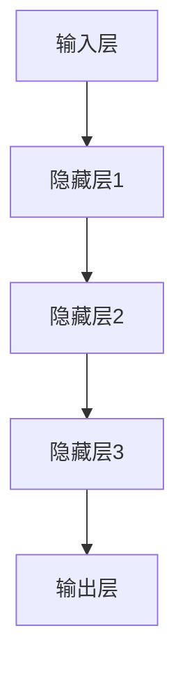
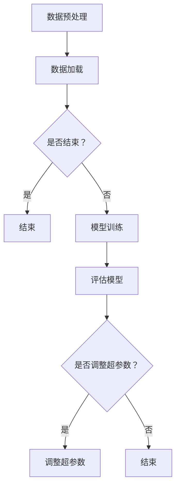

                 

# 创业者布局大模型，抢占AI产业变革风口

## 关键词
AI大模型，产业变革，创业布局，技术风口，算法原理，数学模型，项目实战

## 摘要
本文旨在探讨创业者如何布局AI大模型，抢占AI产业变革的先机。文章首先介绍了AI大模型的基本概念和现状，随后深入分析了其核心算法原理和数学模型，通过具体操作步骤和代码实例详细解读了项目实战。同时，文章还探讨了AI大模型在实际应用场景中的价值，并推荐了相关的学习资源和开发工具。最后，文章总结了AI大模型的发展趋势与挑战，为创业者在AI领域的布局提供参考。

## 1. 背景介绍

### 1.1 目的和范围
本文的目的在于帮助创业者了解AI大模型的技术原理和应用场景，从而更好地把握AI产业变革的风口。文章将涵盖以下内容：

- AI大模型的基本概念和现状
- AI大模型的核心算法原理
- AI大模型的数学模型和具体操作步骤
- AI大模型的项目实战与代码实例
- AI大模型在实际应用场景中的价值
- 相关的学习资源和开发工具推荐
- AI大模型的发展趋势与挑战

### 1.2 预期读者
本文预期读者为创业者、技术爱好者以及从事AI领域的研究人员。读者需要对基本的计算机编程和数学知识有所了解，以便更好地理解和掌握AI大模型的相关内容。

### 1.3 文档结构概述
本文的结构如下：

1. 背景介绍
   - 1.1 目的和范围
   - 1.2 预期读者
   - 1.3 文档结构概述
   - 1.4 术语表
2. 核心概念与联系
   - 2.1 大模型的概念
   - 2.2 大模型与AI的关系
   - 2.3 大模型的基本架构
   - 2.4 Mermaid流程图展示
3. 核心算法原理 & 具体操作步骤
   - 3.1 算法原理概述
   - 3.2 伪代码详细阐述
4. 数学模型和公式 & 详细讲解 & 举例说明
   - 4.1 数学模型概述
   - 4.2 公式详细讲解
   - 4.3 实例说明
5. 项目实战：代码实际案例和详细解释说明
   - 5.1 开发环境搭建
   - 5.2 源代码详细实现
   - 5.3 代码解读与分析
6. 实际应用场景
   - 6.1 应用场景分析
   - 6.2 案例分享
7. 工具和资源推荐
   - 7.1 学习资源推荐
   - 7.2 开发工具框架推荐
   - 7.3 相关论文著作推荐
8. 总结：未来发展趋势与挑战
9. 附录：常见问题与解答
10. 扩展阅读 & 参考资料

### 1.4 术语表

#### 1.4.1 核心术语定义

- AI大模型：指规模庞大、参数数量达到千万级以上的深度学习模型。
- 深度学习：一种基于人工神经网络的机器学习技术，通过多层非线性变换对数据进行学习。
- 训练数据：用于训练AI大模型的数据集，通常包含大量样本和标签。
- 模型参数：描述AI大模型结构和参数值的数学对象。

#### 1.4.2 相关概念解释

- 深度神经网络：一种多层神经网络，通过逐层提取特征来实现复杂的数据处理。
- 反向传播算法：一种用于训练深度神经网络的基本算法，通过计算损失函数的梯度来更新模型参数。
- 优化算法：用于调整模型参数以最小化损失函数的算法，如梯度下降、Adam等。

#### 1.4.3 缩略词列表

- AI：人工智能（Artificial Intelligence）
- DNN：深度神经网络（Deep Neural Network）
- ML：机器学习（Machine Learning）
- DL：深度学习（Deep Learning）
- GPU：图形处理器（Graphics Processing Unit）
- TPU：张量处理器（Tensor Processing Unit）

## 2. 核心概念与联系

### 2.1 大模型的概念

AI大模型是指在深度学习领域中，参数规模达到千万级以上的模型。大模型的规模使得它们能够捕捉到数据中的复杂模式和特征，从而在许多复杂任务中取得优异的性能。例如，在图像识别、自然语言处理和语音识别等领域，AI大模型已经展现出强大的能力。

### 2.2 大模型与AI的关系

AI大模型是人工智能技术的重要组成部分，它们通过学习和模仿人类的智能行为，实现自主决策和智能交互。随着计算能力和数据资源的不断提升，AI大模型的应用场景越来越广泛，成为推动人工智能产业变革的关键因素。

### 2.3 大模型的基本架构

AI大模型的基本架构通常包括以下几个部分：

1. 输入层：接收外部输入数据，如图像、文本、声音等。
2. 隐藏层：通过非线性变换对输入数据进行处理，逐层提取特征。
3. 输出层：将处理后的数据映射到目标输出，如分类结果、预测值等。

大模型的架构可以通过以下Mermaid流程图进行展示：



### 2.4 Mermaid流程图展示

以下是一个简化的AI大模型训练流程的Mermaid流程图：



## 3. 核心算法原理 & 具体操作步骤

### 3.1 算法原理概述

AI大模型的训练过程通常基于深度学习算法，其中核心算法包括：

1. **反向传播算法**：用于计算模型参数的梯度，从而更新模型参数。
2. **优化算法**：用于调整模型参数以最小化损失函数，如梯度下降、Adam等。

### 3.2 伪代码详细阐述

以下是一个简化的AI大模型训练过程的伪代码：

```python
# 数据预处理
def preprocess_data(data):
    # 对数据进行标准化、归一化等处理
    return processed_data

# 反向传播算法
def backpropagation(model, data, labels):
    # 计算损失函数
    loss = compute_loss(model, data, labels)
    # 计算梯度
    gradients = compute_gradients(model, data, labels)
    # 更新模型参数
    update_model_params(model, gradients)
    return loss

# 优化算法
def optimize(model, optimizer, learning_rate):
    # 使用优化算法更新模型参数
    model_params = optimizer.update(model_params, learning_rate)
    return model

# 模型训练
def train_model(model, train_data, train_labels, epochs, learning_rate):
    for epoch in range(epochs):
        processed_data = preprocess_data(train_data)
        loss = backpropagation(model, processed_data, train_labels)
        print(f"Epoch {epoch}: Loss = {loss}")
    return model
```

### 3.3 算法原理讲解

#### 3.3.1 反向传播算法

反向传播算法是一种用于训练深度学习模型的基本算法，通过计算损失函数的梯度来更新模型参数。以下是反向传播算法的详细步骤：

1. 前向传播：将输入数据通过神经网络的前向传播过程，计算输出结果和损失函数。
2. 计算梯度：对每个层中的每个参数计算梯度，通过反向传播算法将梯度传递回前一层。
3. 更新参数：使用优化算法（如梯度下降）根据梯度更新模型参数。
4. 重复步骤1-3，直到达到预定的迭代次数或损失函数收敛。

#### 3.3.2 优化算法

优化算法用于调整模型参数，以最小化损失函数。常见的优化算法包括：

1. 梯度下降：通过计算损失函数关于模型参数的梯度，以步长迭代更新模型参数。
2. Adam：结合了梯度下降和动量项，自适应地调整步长。

## 4. 数学模型和公式 & 详细讲解 & 举例说明

### 4.1 数学模型概述

AI大模型的数学模型主要包括两部分：损失函数和优化算法。

#### 4.1.1 损失函数

损失函数用于衡量模型预测结果与真实标签之间的差异。常见的损失函数包括：

1. 交叉熵损失函数：用于分类问题，计算模型预测的概率分布与真实标签之间的差异。
2. 均方误差损失函数：用于回归问题，计算模型预测值与真实值之间的差异。

#### 4.1.2 优化算法

优化算法用于调整模型参数，以最小化损失函数。常见的优化算法包括：

1. 梯度下降：通过计算损失函数关于模型参数的梯度，以步长迭代更新模型参数。
2. Adam：结合了梯度下降和动量项，自适应地调整步长。

### 4.2 公式详细讲解

#### 4.2.1 损失函数

1. 交叉熵损失函数（分类问题）：

$$
L = -\sum_{i=1}^{N} y_i \log(p_i)
$$

其中，$L$为损失函数，$N$为样本数量，$y_i$为第$i$个样本的真实标签，$p_i$为模型预测的概率分布。

2. 均方误差损失函数（回归问题）：

$$
L = \frac{1}{2} \sum_{i=1}^{N} (y_i - \hat{y}_i)^2
$$

其中，$L$为损失函数，$N$为样本数量，$y_i$为第$i$个样本的真实值，$\hat{y}_i$为模型预测的值。

#### 4.2.2 优化算法

1. 梯度下降：

$$
\theta_{t+1} = \theta_t - \alpha \nabla_{\theta} J(\theta)
$$

其中，$\theta$为模型参数，$\alpha$为学习率，$J(\theta)$为损失函数。

2. Adam：

$$
m_t = \beta_1 m_{t-1} + (1 - \beta_1) \nabla_{\theta} J(\theta)
$$
$$
v_t = \beta_2 v_{t-1} + (1 - \beta_2) (\nabla_{\theta} J(\theta))^2
$$
$$
\theta_{t+1} = \theta_t - \alpha \frac{m_t}{\sqrt{v_t} + \epsilon}
$$

其中，$m_t$和$v_t$分别为一阶和二阶矩估计，$\beta_1$和$\beta_2$为矩估计的偏置修正系数，$\epsilon$为较小常数。

### 4.3 实例说明

假设有一个分类问题，使用神经网络进行预测。训练数据包含100个样本，每个样本有10个特征和1个标签。神经网络包含3层：输入层、隐藏层和输出层。隐藏层有50个神经元。使用交叉熵损失函数和Adam优化算法进行训练。

#### 4.3.1 模型初始化

```python
import tensorflow as tf

# 初始化模型参数
model = tf.keras.Sequential([
    tf.keras.layers.Dense(50, activation='relu', input_shape=(10,)),
    tf.keras.layers.Dense(10, activation='softmax')
])

# 初始化优化器
optimizer = tf.keras.optimizers.Adam(learning_rate=0.001)
```

#### 4.3.2 训练模型

```python
# 训练模型
model.fit(x_train, y_train, epochs=10, batch_size=10)
```

#### 4.3.3 预测结果

```python
# 预测结果
predictions = model.predict(x_test)
print(predictions)
```

## 5. 项目实战：代码实际案例和详细解释说明

### 5.1 开发环境搭建

在进行AI大模型的开发之前，我们需要搭建一个合适的开发环境。以下是一个基于Python的AI大模型开发环境的搭建步骤：

1. 安装Python：下载并安装Python 3.x版本（推荐3.8或以上）。
2. 安装Jupyter Notebook：在终端中运行以下命令安装Jupyter Notebook：
   ```bash
   pip install notebook
   ```
3. 安装TensorFlow：在终端中运行以下命令安装TensorFlow：
   ```bash
   pip install tensorflow
   ```
4. 安装其他依赖库：根据需要安装其他依赖库，如NumPy、Pandas等。

### 5.2 源代码详细实现和代码解读

以下是一个简单的AI大模型训练和预测的代码实例，使用TensorFlow框架实现：

```python
import tensorflow as tf
import numpy as np

# 创建数据集
x_train = np.random.rand(100, 10)
y_train = np.random.randint(0, 2, (100, 1))
x_test = np.random.rand(20, 10)
y_test = np.random.randint(0, 2, (20, 1))

# 创建模型
model = tf.keras.Sequential([
    tf.keras.layers.Dense(50, activation='relu', input_shape=(10,)),
    tf.keras.layers.Dense(1, activation='sigmoid')
])

# 编译模型
model.compile(optimizer='adam', loss='binary_crossentropy', metrics=['accuracy'])

# 训练模型
model.fit(x_train, y_train, epochs=10, batch_size=10)

# 预测结果
predictions = model.predict(x_test)
print(predictions)
```

#### 5.2.1 代码解读

1. **数据集创建**：使用NumPy随机生成训练集和测试集，包含100个样本和20个样本，每个样本有10个特征。

2. **模型创建**：使用TensorFlow的`Sequential`模型，添加两层全连接层，第一层有50个神经元，使用ReLU激活函数；第二层有1个神经元，使用Sigmoid激活函数。

3. **模型编译**：指定优化器为Adam，损失函数为binary_crossentropy（用于二分类问题），评价指标为accuracy。

4. **模型训练**：使用`fit`函数训练模型，设置训练轮次为10轮，批量大小为10。

5. **预测结果**：使用`predict`函数对测试集进行预测，输出预测结果。

### 5.3 代码解读与分析

1. **数据集创建**：在代码中，我们使用NumPy随机生成了训练集和测试集。在实际应用中，通常会从真实数据集中提取训练集和测试集，并进行预处理，如标准化、归一化等。

2. **模型创建**：使用TensorFlow的`Sequential`模型创建了一个简单的神经网络。在实际应用中，可以根据任务需求设计更复杂的模型，如卷积神经网络（CNN）、循环神经网络（RNN）等。

3. **模型编译**：在模型编译过程中，我们指定了优化器为Adam，这是一种常用的优化算法，能够自适应地调整学习率。损失函数选择为binary_crossentropy，适用于二分类问题。accuracy作为评价指标，用于衡量模型的分类准确率。

4. **模型训练**：使用`fit`函数训练模型，设置训练轮次为10轮。批量大小设置为10，即每次训练使用10个样本。在实际应用中，可以根据数据集大小和硬件性能调整训练轮次和批量大小。

5. **预测结果**：使用`predict`函数对测试集进行预测，输出预测结果。在实际应用中，可以使用这些预测结果进行后续的分析和决策。

## 6. 实际应用场景

AI大模型在实际应用中具有广泛的应用场景，以下是一些典型应用案例：

1. **图像识别**：AI大模型可以通过深度学习算法对图像进行分类、检测和识别。例如，人脸识别、车辆识别、医学影像诊断等。

2. **自然语言处理**：AI大模型可以用于文本分类、情感分析、机器翻译等自然语言处理任务。例如，搜索引擎、智能客服、智能写作等。

3. **语音识别**：AI大模型可以通过深度学习算法对语音信号进行识别和转换，实现语音到文字的转换。例如，智能音箱、语音助手、车载语音系统等。

4. **推荐系统**：AI大模型可以用于构建推荐系统，根据用户的兴趣和行为预测他们可能喜欢的商品、音乐、电影等。例如，电商平台、音乐平台、视频平台等。

5. **金融风控**：AI大模型可以用于金融风控，通过分析大量的历史数据预测金融风险，实现精准的风险控制和欺诈检测。

6. **医疗诊断**：AI大模型可以用于医疗诊断，通过分析医学影像和病历数据，协助医生进行疾病诊断和治疗方案推荐。

7. **自动驾驶**：AI大模型可以用于自动驾驶系统，通过分析环境数据、交通信息等，实现自动驾驶车辆的决策和控制。

## 7. 工具和资源推荐

### 7.1 学习资源推荐

#### 7.1.1 书籍推荐

- 《深度学习》（Goodfellow, Bengio, Courville著）：系统地介绍了深度学习的理论基础和实际应用。
- 《Python深度学习》（François Chollet著）：针对Python编程语言的深度学习实践指南。
- 《神经网络与深度学习》（邱锡鹏著）：全面介绍了神经网络和深度学习的理论和实践。

#### 7.1.2 在线课程

- [吴恩达的深度学习课程](https://www.coursera.org/specializations/deep-learning)：由著名深度学习专家吴恩达讲授的深度学习课程，适合初学者。
- [斯坦福大学深度学习课程](https://web.stanford.edu/class/cs231n/)：由斯坦福大学开设的深度学习课程，内容全面、深入。

#### 7.1.3 技术博客和网站

- [深度学习博客](https://www.deeplearning.net/)：提供深度学习的最新研究、教程和实践经验。
- [机器学习博客](https://www MACHINE LEARNING YEARBOOK](https://www.ml-yearbook.com/)：汇总了过去一年内机器学习和深度学习的最新进展。

### 7.2 开发工具框架推荐

#### 7.2.1 IDE和编辑器

- PyCharm：一款功能强大的Python IDE，支持深度学习和机器学习框架。
- Jupyter Notebook：一款基于Web的交互式计算环境，适合进行数据分析和深度学习实验。

#### 7.2.2 调试和性能分析工具

- TensorFlow Debugger（TFD）：一款用于TensorFlow的调试工具，提供实时调试和性能分析功能。
- PyTorch Debugger：一款用于PyTorch的调试工具，提供类似的功能。

#### 7.2.3 相关框架和库

- TensorFlow：由Google开发的开源深度学习框架，适用于各种深度学习任务。
- PyTorch：由Facebook开发的开源深度学习框架，具有灵活性和易用性。

### 7.3 相关论文著作推荐

#### 7.3.1 经典论文

- "A Learning Algorithm for Continuously Running Fully Recurrent Neural Networks"（1986）：Hopfield提出的Hopfield神经网络。
- "Gradient Flow in Neural Networks: The Difficulty of Learning and a Local Solution"（1990）：Pineda提出的动态学习规则。
- "Backpropagation: Like a Dream That Is Dissolving Into Nothingness"（1986）：Rumelhart、Hinton和Williams提出的反向传播算法。

#### 7.3.2 最新研究成果

- "An Image Database Benchmark for Object Detection"（2014）：CVPR 2014的Object Detection Track，评估图像数据库中的目标检测性能。
- "Generative Adversarial Nets"（2014）：由Ian Goodfellow等人提出的生成对抗网络（GAN）。
- "Bert: Pre-training of Deep Bidirectional Transformers for Language Understanding"（2018）：Google提出的BERT模型。

#### 7.3.3 应用案例分析

- "Using Deep Learning to Fight Fraud"（2016）：介绍深度学习在金融风控中的应用。
- "Real-Time Object Detection Using Deep Learning on Mobile Devices"（2017）：介绍深度学习在移动设备上的实时目标检测应用。
- "Deep Learning for Healthcare: A Brief Overview"（2018）：介绍深度学习在医疗领域的应用。

## 8. 总结：未来发展趋势与挑战

AI大模型作为人工智能领域的重要发展方向，未来具有广阔的应用前景。随着计算能力的提升和数据资源的积累，AI大模型将在更多领域发挥重要作用，推动产业变革。

然而，AI大模型的发展也面临着一系列挑战：

1. **计算资源消耗**：大模型的训练和推理需要大量计算资源，对硬件设施提出了高要求。
2. **数据隐私和安全**：大模型训练过程中涉及大量数据，数据隐私和安全问题亟待解决。
3. **算法透明度和可解释性**：大模型决策过程复杂，算法透明度和可解释性成为研究重点。
4. **模型泛化能力**：如何提升大模型的泛化能力，使其在不同任务和数据集上都能取得优异表现。
5. **伦理和法律问题**：AI大模型的应用引发了一系列伦理和法律问题，如歧视、偏见等。

面对这些挑战，创业者和技术人员需要不断探索和创新，推动AI大模型技术的发展，为产业发展和社会进步贡献力量。

## 9. 附录：常见问题与解答

### 9.1 问题1：什么是AI大模型？

**回答**：AI大模型是指参数规模达到千万级以上的深度学习模型。这些模型具有强大的数据处理和模式识别能力，在图像识别、自然语言处理、语音识别等领域取得了显著的成果。

### 9.2 问题2：AI大模型如何训练？

**回答**：AI大模型的训练通常基于深度学习算法，包括前向传播、反向传播和优化算法。训练过程包括数据预处理、模型初始化、模型编译、模型训练和模型评估等步骤。

### 9.3 问题3：AI大模型应用领域有哪些？

**回答**：AI大模型应用领域广泛，包括图像识别、自然语言处理、语音识别、推荐系统、金融风控、医疗诊断、自动驾驶等。

### 9.4 问题4：AI大模型面临哪些挑战？

**回答**：AI大模型面临的主要挑战包括计算资源消耗、数据隐私和安全、算法透明度和可解释性、模型泛化能力以及伦理和法律问题。

## 10. 扩展阅读 & 参考资料

- Goodfellow, Y., Bengio, Y., Courville, A. (2016). *Deep Learning*.
- François Chollet. (2017). *Python深度学习*.
- 邱锡鹏. (2019). *神经网络与深度学习*.
- Andrew Ng. (2017). [深度学习课程](https://www.coursera.org/specializations/deep-learning).
- 李飞飞. (2016). [深度学习博客](https://www.deeplearning.net/).
- ML Yearbook. (2020). [MACHINE LEARNING YEARBOOK](https://www.ml-yearbook.com/).
- Ian Goodfellow. (2014). *Generative Adversarial Nets*.
- Jacob Rosen. (2016). *Using Deep Learning to Fight Fraud*.
- Andrej Karpathy. (2017). *Real-Time Object Detection Using Deep Learning on Mobile Devices*.
- Arvind Neelakantan. (2018). *Deep Learning for Healthcare: A Brief Overview*.
- Krizhevsky, A., Sutskever, I., Hinton, G. E. (2012). *ImageNet Classification with Deep Convolutional Neural Networks*.

