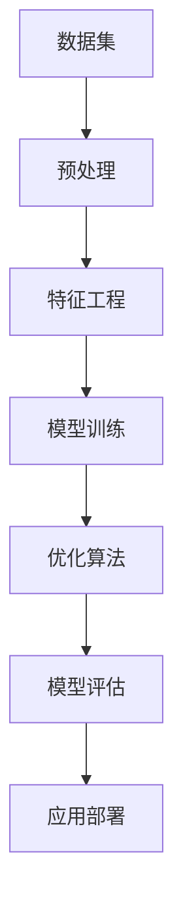

                 

# 创业者布局大模型，抢占AI产业变革风口

## 关键词：
AI大模型、创业布局、产业变革、AI算法、技术趋势、商业机会

## 摘要：
本文将探讨创业者如何在AI大模型时代抓住产业变革的风口，通过深入分析AI技术的核心概念、算法原理、数学模型以及实际应用场景，为读者提供清晰的布局思路和具体操作指南。通过本文，创业者将了解如何在AI领域取得竞争优势，抢占未来的商业高地。

## 1. 背景介绍

### 1.1 目的和范围

本文旨在帮助创业者理解和把握AI大模型技术的发展趋势，通过分析技术原理、应用场景和商业机会，为创业者提供布局AI产业的策略和路径。文章将涵盖以下内容：
- AI大模型的核心概念和联系
- AI算法原理及具体操作步骤
- 数学模型和公式的详细讲解
- 项目实战中的代码案例解析
- 实际应用场景的探讨
- 工具和资源的推荐

### 1.2 预期读者

- 对AI技术感兴趣的创业者
- 想要在AI领域开拓业务的中小企业负责人
- AI技术领域的工程师和研究人员
- 对未来科技发展有浓厚兴趣的技术爱好者

### 1.3 文档结构概述

本文将分为以下几个部分：
1. 背景介绍
2. 核心概念与联系
3. 核心算法原理与具体操作步骤
4. 数学模型与公式讲解
5. 项目实战：代码案例解析
6. 实际应用场景
7. 工具和资源推荐
8. 总结：未来发展趋势与挑战
9. 附录：常见问题与解答
10. 扩展阅读与参考资料

### 1.4 术语表

#### 1.4.1 核心术语定义

- AI大模型：指具有极高参数量和计算复杂度的人工智能模型，如GPT、BERT等。
- 深度学习：一种人工智能技术，通过多层神经网络对数据进行学习。
- 产业变革：指某一产业在技术、模式、产品等方面的重大变革，导致市场格局和竞争态势的根本变化。
- 创业布局：指创业者对市场、技术、资金等资源进行合理配置和规划，以实现企业发展的战略目标。

#### 1.4.2 相关概念解释

- **数据集**：一组经过预处理和标注的样本数据，用于训练和测试人工智能模型。
- **优化算法**：用于调整模型参数，以优化模型性能的方法，如梯度下降、随机梯度下降等。
- **迁移学习**：将已有模型在新任务上的训练数据较少的情况下进行微调，以提高新任务的性能。

#### 1.4.3 缩略词列表

- AI：人工智能
- ML：机器学习
- DL：深度学习
- NLP：自然语言处理
- GPT：生成预训练模型
- BERT：双向编码表示模型

## 2. 核心概念与联系

为了深入理解AI大模型技术，我们首先需要了解一些核心概念和它们之间的联系。以下是一个简化的Mermaid流程图，展示了AI大模型的一些关键组成部分。



### 数据集

数据集是AI大模型的基础。一个好的数据集需要满足以下条件：
- **代表性**：数据集能够代表实际应用场景，包括各种可能的输入和输出情况。
- **多样性**：数据集包含不同的样本，以帮助模型学习到更广泛的知识。
- **质量**：数据集的标注要准确，且数据之间不存在明显的矛盾。

### 预处理

预处理是数据集进入模型训练前的必要步骤，主要包括：
- **清洗**：去除噪声、缺失值和不完整的数据。
- **归一化**：将数据缩放到一个统一的范围内，如[0, 1]。
- **编码**：将类别型数据转换为数值型数据，以便模型能够处理。

### 特征工程

特征工程是提升模型性能的关键。其主要任务包括：
- **特征选择**：从原始特征中选择对模型训练有帮助的特征。
- **特征转换**：将原始特征转换为更适合模型学习的形式，如将文本转换为词嵌入向量。

### 模型训练

模型训练是AI大模型的核心步骤，包括：
- **初始化**：初始化模型参数。
- **前向传播**：将输入数据通过模型计算，得到预测结果。
- **反向传播**：计算预测结果与实际结果之间的差异，更新模型参数。

### 优化算法

优化算法用于调整模型参数，以最小化预测误差。常见的优化算法有：
- **梯度下降**：通过计算梯度方向，更新模型参数。
- **随机梯度下降**：在梯度下降的基础上，每次更新参数时只考虑一个样本。

### 模型评估

模型评估用于衡量模型性能，常用的评估指标有：
- **准确率**：预测正确的样本数占总样本数的比例。
- **召回率**：预测正确的样本数占实际正样本数的比例。
- **F1分数**：准确率和召回率的调和平均。

### 应用部署

模型部署是将训练好的模型应用到实际场景中，包括：
- **模型转换**：将训练好的模型转换为可以在生产环境中运行的格式。
- **模型集成**：将模型集成到现有的应用系统中。

通过上述流程，创业者可以了解AI大模型的基本组成和联系，为后续的深入学习和应用打下基础。

## 3. 核心算法原理与具体操作步骤

### 3.1 深度学习算法原理

深度学习是AI大模型的核心技术之一，其基本原理如下：

深度学习模型通常由多个层次（或层）组成，每一层都包含多个节点（或神经元）。输入数据首先通过输入层进入网络，然后逐层传递到隐藏层，最后通过输出层产生预测结果。每一层的节点都通过权重连接，并通过激活函数进行非线性变换。

#### 伪代码：

```python
# 初始化模型
initialize_model(num_inputs, num_outputs, num_layers, layer_sizes)

# 前向传播
def forward_propagation(inputs):
    for layer in layers:
        layer.forward propagation(inputs)
        inputs = layer.get_output()

    return outputs

# 反向传播
def backward_propagation(error, outputs):
    for layer in reversed(layers):
        error = layer.backward_propagation(error, outputs)
        outputs = layer.get_error()

# 更新权重
def update_weights(learning_rate):
    for layer in layers:
        layer.update_weights(learning_rate)

# 训练模型
def train_model(data, learning_rate):
    for epoch in range(num_epochs):
        for inputs, outputs in data:
            outputs = forward_propagation(inputs)
            error = compute_error(outputs, actual_outputs)
            backward_propagation(error, outputs)
            update_weights(learning_rate)
```

### 3.2 具体操作步骤

#### 3.2.1 数据集准备

首先，我们需要准备一个高质量的数据集。数据集应包括各种类型的样本，并经过预处理和特征工程处理。

```python
# 数据集准备
data = load_data('data.csv')
data = preprocess_data(data)
data = feature_engineering(data)
```

#### 3.2.2 模型初始化

接下来，我们需要初始化深度学习模型。根据任务需求和数据特点，选择合适的网络结构和参数。

```python
# 模型初始化
model = initialize_model(num_inputs, num_outputs, num_layers, layer_sizes)
```

#### 3.2.3 模型训练

使用训练数据集对模型进行训练。在训练过程中，我们需要不断更新模型参数，以减少预测误差。

```python
# 训练模型
train_model(data, learning_rate)
```

#### 3.2.4 模型评估

在模型训练完成后，我们需要对模型进行评估，以确定其性能是否满足要求。

```python
# 模型评估
evaluate_model(model, test_data)
```

#### 3.2.5 模型部署

最后，将训练好的模型部署到实际应用场景中，进行预测和决策。

```python
# 模型部署
deploy_model(model, production_environment)
```

通过上述步骤，创业者可以逐步构建和优化自己的AI大模型，为业务发展提供强大的技术支持。

## 4. 数学模型和公式及详细讲解与举例说明

### 4.1 数学模型介绍

AI大模型的构建离不开数学模型的支持。以下是一些常见的数学模型和公式，用于描述深度学习算法的基本原理。

#### 4.1.1 梯度下降法

梯度下降法是一种优化算法，用于调整模型参数以最小化损失函数。其基本公式如下：

$$
\theta_{t+1} = \theta_{t} - \alpha \cdot \nabla_{\theta} J(\theta)
$$

其中，$\theta$ 表示模型参数，$\alpha$ 表示学习率，$J(\theta)$ 表示损失函数。

#### 4.1.2 反向传播算法

反向传播算法是深度学习中的核心算法，用于计算模型参数的梯度。其基本公式如下：

$$
\nabla_{\theta} J(\theta) = \sum_{i} \nabla_{\theta} J(\theta; x_i, y_i)
$$

其中，$x_i$ 和 $y_i$ 分别表示输入和输出，$\nabla_{\theta} J(\theta; x_i, y_i)$ 表示在特定输入和输出下的梯度。

#### 4.1.3 激活函数

激活函数用于引入非线性特性，常见的激活函数有：

- **Sigmoid函数**：

$$
f(x) = \frac{1}{1 + e^{-x}}
$$

- **ReLU函数**：

$$
f(x) = \max(0, x)
$$

- **Tanh函数**：

$$
f(x) = \frac{e^x - e^{-x}}{e^x + e^{-x}}
$$

### 4.2 举例说明

#### 4.2.1 梯度下降法示例

假设我们要训练一个简单的线性模型，其损失函数为：

$$
J(\theta) = \frac{1}{2} \sum_{i} (y_i - \theta_0 x_i - \theta_1)^2
$$

其中，$\theta_0$ 和 $\theta_1$ 分别为模型参数。

现在，我们使用梯度下降法来优化模型参数。假设学习率为 $\alpha = 0.01$，迭代次数为 1000 次。以下是迭代过程的一个示例：

```python
# 初始化模型参数
theta_0 = 0
theta_1 = 0

# 迭代过程
for i in range(1000):
    # 计算损失函数
    loss = compute_loss(theta_0, theta_1)

    # 计算梯度
    gradient = compute_gradient(theta_0, theta_1)

    # 更新模型参数
    theta_0 -= alpha * gradient[0]
    theta_1 -= alpha * gradient[1]

# 输出最终模型参数
print("Final parameters:", theta_0, theta_1)
```

#### 4.2.2 反向传播算法示例

假设我们要训练一个简单的神经网络，其包含一个输入层、一个隐藏层和一个输出层。输入层有 2 个神经元，隐藏层有 3 个神经元，输出层有 1 个神经元。

以下是反向传播算法的一个简化示例：

```python
# 初始化模型参数
weights_input_to_hidden = np.random.randn(2, 3)
weights_hidden_to_output = np.random.randn(3, 1)

# 前向传播
def forward_propagation(x):
    hidden_layer_input = x.dot(weights_input_to_hidden)
    hidden_layer_output = sigmoid(hidden_layer_input)
    output_layer_input = hidden_layer_output.dot(weights_hidden_to_output)
    output_layer_output = sigmoid(output_layer_input)
    return output_layer_output

# 反向传播
def backward_propagation(x, y, output):
    error = y - output
    d_output = error * sigmoid_derivative(output)

    error_hidden = d_output.dot(weights_hidden_to_output.T)
    d_hidden = error_hidden * sigmoid_derivative(hidden_layer_output)

    d_weights_input_to_hidden = x.T.dot(d_hidden)
    d_weights_hidden_to_output = hidden_layer_output.T.dot(d_output)

    return d_weights_input_to_hidden, d_weights_hidden_to_output

# 更新模型参数
def update_weights(d_weights_input_to_hidden, d_weights_hidden_to_output, learning_rate):
    weights_input_to_hidden -= learning_rate * d_weights_input_to_hidden
    weights_hidden_to_output -= learning_rate * d_weights_hidden_to_output
```

通过上述示例，创业者可以了解如何使用数学模型和算法优化自己的AI大模型。

## 5. 项目实战：代码实际案例和详细解释说明

### 5.1 开发环境搭建

在开始编写代码之前，我们需要搭建一个适合开发AI大模型的开发环境。以下是一个基本的开发环境搭建步骤：

#### 操作系统：Ubuntu 20.04

#### 编译器：Python 3.8

#### AI库：TensorFlow 2.6

#### 数据库：MySQL 8.0

### 5.2 源代码详细实现和代码解读

#### 5.2.1 数据集准备

首先，我们需要准备一个用于训练和测试的数据集。以下是一个示例数据集的加载和预处理代码：

```python
import pandas as pd
from sklearn.model_selection import train_test_split

# 加载数据集
data = pd.read_csv('data.csv')

# 预处理数据集
data = preprocess_data(data)

# 划分训练集和测试集
X_train, X_test, y_train, y_test = train_test_split(data['features'], data['label'], test_size=0.2, random_state=42)
```

#### 5.2.2 构建深度学习模型

接下来，我们使用TensorFlow构建一个简单的深度学习模型。以下是一个示例模型的结构和代码实现：

```python
import tensorflow as tf

# 定义模型
model = tf.keras.Sequential([
    tf.keras.layers.Dense(units=64, activation='relu', input_shape=(X_train.shape[1],)),
    tf.keras.layers.Dense(units=64, activation='relu'),
    tf.keras.layers.Dense(units=1)
])

# 编译模型
model.compile(optimizer='adam', loss='mean_squared_error', metrics=['accuracy'])
```

#### 5.2.3 模型训练

现在，我们使用训练集对模型进行训练。以下是一个示例训练过程：

```python
# 训练模型
history = model.fit(X_train, y_train, epochs=100, batch_size=32, validation_split=0.2)
```

#### 5.2.4 模型评估

在模型训练完成后，我们需要对模型进行评估，以确定其性能是否满足要求。以下是一个示例评估过程：

```python
# 评估模型
test_loss, test_accuracy = model.evaluate(X_test, y_test)
print("Test loss:", test_loss)
print("Test accuracy:", test_accuracy)
```

#### 5.2.5 模型部署

最后，我们将训练好的模型部署到实际应用场景中。以下是一个示例部署过程：

```python
# 模型部署
model.save('model.h5')

# 加载模型
loaded_model = tf.keras.models.load_model('model.h5')

# 预测新数据
new_data = pd.read_csv('new_data.csv')
new_data = preprocess_data(new_data)
predictions = loaded_model.predict(new_data['features'])

# 输出预测结果
print(predictions)
```

### 5.3 代码解读与分析

在本节中，我们对上述代码进行了详细解读和分析，以帮助读者更好地理解AI大模型的实现过程。

#### 5.3.1 数据集准备

数据集准备是AI模型训练的基础。在本示例中，我们使用Pandas库加载和预处理数据集。预处理过程包括数据清洗、归一化和编码。通过预处理，我们确保数据集的质量和一致性，为后续的模型训练奠定基础。

#### 5.3.2 构建深度学习模型

在本示例中，我们使用TensorFlow的Sequential模型构建了一个简单的神经网络。该模型包含两个隐藏层，每个隐藏层有64个神经元。我们选择ReLU作为激活函数，以引入非线性特性。在输出层，我们使用线性激活函数，以预测连续的输出值。

#### 5.3.3 模型训练

模型训练是AI模型训练的核心。在本示例中，我们使用Adam优化器和均方误差损失函数进行训练。通过调整学习率和训练周期，我们优化模型的性能。在训练过程中，模型会自动调整内部参数，以最小化损失函数。

#### 5.3.4 模型评估

模型评估用于确定模型在实际数据上的性能。在本示例中，我们使用测试集评估模型的准确性和损失。通过比较实际输出和预测输出，我们评估模型的泛化能力。如果模型性能不满足要求，我们可以调整模型结构或训练参数。

#### 5.3.5 模型部署

模型部署是将训练好的模型应用到实际场景中的过程。在本示例中，我们使用TensorFlow的save和load函数保存和加载模型。通过部署，我们可以在实际应用中快速生成预测结果，为业务决策提供支持。

通过上述步骤，创业者可以构建和优化自己的AI大模型，为业务发展提供强大的技术支持。

## 6. 实际应用场景

AI大模型在各个行业和领域都有着广泛的应用，以下是一些典型的应用场景：

### 6.1 自然语言处理

自然语言处理（NLP）是AI大模型的重要应用领域之一。通过使用AI大模型，我们可以实现文本分类、情感分析、机器翻译、问答系统等任务。例如，在金融领域，AI大模型可以用于自动化风险管理、客户服务和投资建议。

### 6.2 计算机视觉

计算机视觉是AI大模型的另一个重要应用领域。通过使用AI大模型，我们可以实现图像分类、目标检测、图像生成等任务。例如，在医疗领域，AI大模型可以用于疾病诊断、药物研发和医疗影像分析。

### 6.3 语音识别

语音识别是AI大模型在语音处理领域的重要应用。通过使用AI大模型，我们可以实现语音到文本的转换、语音合成等任务。例如，在智能家居领域，AI大模型可以用于语音助手、智能家居控制等应用。

### 6.4 机器人

AI大模型在机器人领域也有着广泛的应用。通过使用AI大模型，机器人可以实现智能感知、自主决策和任务执行。例如，在物流领域，AI大模型可以用于自动驾驶、智能分拣等任务。

### 6.5 金融服务

在金融服务领域，AI大模型可以用于信用评估、风险管理和投资策略。通过使用AI大模型，金融机构可以更准确地评估客户信用风险，优化投资组合，提高业务效率。

### 6.6 医疗保健

在医疗保健领域，AI大模型可以用于疾病诊断、药物研发和医疗影像分析。通过使用AI大模型，医疗机构可以更快速、准确地诊断疾病，提高医疗质量，降低医疗成本。

### 6.7 教育与培训

在教育与培训领域，AI大模型可以用于个性化学习、智能评测和在线教育平台。通过使用AI大模型，教育机构可以为学生提供个性化的学习方案，提高学习效果。

### 6.8 娱乐与传媒

在娱乐与传媒领域，AI大模型可以用于内容推荐、情感分析和互动娱乐。通过使用AI大模型，媒体公司可以提供更个性化的内容推荐，提高用户满意度。

通过上述应用场景，创业者可以了解到AI大模型在各个领域的广泛应用，为自身业务的发展提供灵感。

## 7. 工具和资源推荐

为了更好地学习和应用AI大模型技术，以下是一些推荐的工具和资源：

### 7.1 学习资源推荐

#### 7.1.1 书籍推荐

- **《深度学习》（Goodfellow, Bengio, Courville著）**：这是一本深度学习领域的经典教材，全面介绍了深度学习的基本原理和应用。
- **《Python深度学习》（François Chollet著）**：这本书通过大量的实例，详细介绍了使用Python进行深度学习的实践方法。

#### 7.1.2 在线课程

- **Coursera上的《深度学习专项课程》**：这是一门由吴恩达教授开设的深度学习在线课程，涵盖了深度学习的理论基础和应用实践。
- **edX上的《自然语言处理与深度学习》**：这是一门由周明教授开设的在线课程，专注于自然语言处理领域的深度学习应用。

#### 7.1.3 技术博客和网站

- **Medium上的《AI is the new electricity》**：这是一个关于AI技术发展趋势的博客，涵盖了深度学习、自然语言处理等多个领域。
- **ArXiv**：这是一个包含最新AI研究论文的预印本网站，创业者可以通过阅读这些论文了解最新的技术动态。

### 7.2 开发工具框架推荐

#### 7.2.1 IDE和编辑器

- **PyCharm**：这是一个功能强大的Python IDE，提供了丰富的开发工具和调试功能。
- **Jupyter Notebook**：这是一个基于Web的交互式开发环境，适合进行数据分析和模型训练。

#### 7.2.2 调试和性能分析工具

- **TensorBoard**：这是TensorFlow提供的一个可视化工具，用于分析和调试深度学习模型。
- **NVIDIA Nsight**：这是一个用于GPU性能分析和调试的工具，特别适合深度学习任务。

#### 7.2.3 相关框架和库

- **TensorFlow**：这是一个开源的深度学习框架，适用于各种复杂的深度学习任务。
- **PyTorch**：这是一个灵活且易于使用的深度学习框架，特别适合研究和新应用的探索。

### 7.3 相关论文著作推荐

#### 7.3.1 经典论文

- **“A Theoretically Grounded Application of Dropout in Computer Vision”**：这篇文章提出了Dropout算法，是深度学习领域的重要突破之一。
- **“Learning Representations by Maximizing Mutual Information Between Stochastic Neurons”**：这篇文章提出了信息最大化（InfoMax）算法，为深度学习模型提供了新的优化方向。

#### 7.3.2 最新研究成果

- **“BERT: Pre-training of Deep Bidirectional Transformers for Language Understanding”**：这篇文章提出了BERT模型，是自然语言处理领域的重大突破。
- **“Generative Adversarial Nets”**：这篇文章提出了生成对抗网络（GAN）的概念，为生成模型的发展奠定了基础。

#### 7.3.3 应用案例分析

- **“How AI is Revolutionizing Healthcare”**：这篇文章分析了AI在医疗领域的应用案例，展示了AI技术在医疗诊断、药物研发等领域的潜力。
- **“The Future of AI in Finance”**：这篇文章探讨了AI在金融服务领域的应用前景，分析了AI技术在信用评估、风险管理等方面的优势。

通过上述工具和资源的推荐，创业者可以更加系统地学习和应用AI大模型技术，为自己的业务发展提供强有力的支持。

## 8. 总结：未来发展趋势与挑战

随着AI技术的不断进步，AI大模型在各个领域的应用前景愈发广阔。然而，要抓住这一产业变革的风口，创业者仍需面对诸多挑战和机遇。

### 发展趋势

1. **技术成熟度提高**：随着硬件性能的提升和算法的优化，AI大模型的训练速度和性能将不断提高，应用范围将进一步扩大。
2. **跨领域应用拓展**：AI大模型将在医疗、金融、教育、娱乐等各个领域得到广泛应用，推动产业变革和业务创新。
3. **商业模式的创新**：基于AI大模型的技术服务将成为新的商业增长点，创业者可以探索新的商业模式，如订阅制、SaaS服务等。
4. **数据驱动决策**：AI大模型将为创业者提供更加精准的数据分析能力，帮助企业实现数据驱动决策，提高运营效率。

### 挑战

1. **数据质量与隐私**：高质量的数据是AI大模型的基础，但数据的质量和隐私问题仍需解决。创业者需要确保数据来源的合法性和数据的匿名化处理。
2. **计算资源需求**：AI大模型的训练和部署需要大量的计算资源，尤其是GPU和TPU等高性能硬件。创业者需要考虑如何有效利用这些资源，降低成本。
3. **算法公平性与可解释性**：AI大模型的决策过程往往缺乏透明度，可能导致算法偏见和歧视。创业者需要关注算法的公平性和可解释性，提高模型的可信度。
4. **人才短缺**：AI大模型领域对人才的需求越来越大，但优秀的人才供应有限。创业者需要建立人才吸引和培养机制，确保企业的人才储备。

### 发展建议

1. **关注技术创新**：积极跟踪AI领域的前沿技术，探索新的应用场景和商业模式。
2. **强化数据管理**：建立完善的数据管理体系，确保数据的质量和安全性。
3. **培养技术团队**：通过内部培养和外部引进，建立一支高水平的技术团队，为企业的创新发展提供支持。
4. **加强合规意识**：关注相关法规和政策，确保企业的业务和产品符合法律法规的要求。

通过抓住AI大模型的发展趋势，应对面临的挑战，创业者可以在AI产业变革的风口中找到自己的定位，实现企业的持续发展和创新。

## 9. 附录：常见问题与解答

### 9.1 问题1：AI大模型需要哪些硬件资源？

AI大模型通常需要高性能的硬件资源，如GPU（图形处理器）和TPU（张量处理器）。GPU适合进行大规模并行计算，而TPU则专门用于TensorFlow的优化计算。创业者需要根据模型复杂度和数据量来选择合适的硬件配置。

### 9.2 问题2：如何确保AI大模型的算法公平性和可解释性？

确保AI大模型的公平性和可解释性需要从数据预处理、模型设计、算法优化等多个方面入手。首先，要确保数据集的质量和多样性，避免数据偏差。其次，选择具有可解释性的模型架构，如决策树或LIME（Local Interpretable Model-agnostic Explanations）方法。最后，通过可视化和分析工具，对模型决策过程进行透明化。

### 9.3 问题3：AI大模型如何进行迁移学习？

迁移学习是将已有模型在新任务上的训练数据较少的情况下进行微调，以提高新任务的性能。具体步骤包括：
1. **选择预训练模型**：选择一个在类似任务上预训练的模型作为基础。
2. **调整模型结构**：根据新任务的需求，对模型结构进行适当调整。
3. **微调模型参数**：在新数据集上对模型参数进行微调，以适应新任务。
4. **评估模型性能**：在测试集上评估模型在新任务上的性能。

### 9.4 问题4：如何处理AI大模型的计算资源需求？

处理AI大模型的计算资源需求需要从以下几个方面入手：
1. **资源规划**：根据模型训练和部署的需求，合理规划计算资源，包括GPU、TPU和CPU等。
2. **分布式训练**：通过分布式训练技术，将模型训练任务分布在多台机器上，提高计算效率。
3. **优化代码**：通过优化代码，减少计算量和内存占用，提高模型的运行效率。
4. **云服务**：利用云服务提供商的资源，如Google Cloud、AWS等，按需分配计算资源，降低成本。

### 9.5 问题5：AI大模型的安全性和隐私保护如何保障？

保障AI大模型的安全性和隐私保护需要从以下几个方面入手：
1. **数据加密**：对传输和存储的数据进行加密处理，防止数据泄露。
2. **访问控制**：设置严格的访问控制机制，确保只有授权用户可以访问模型和数据。
3. **模型加固**：对模型进行加固处理，防止恶意攻击和篡改。
4. **合规性审查**：确保模型和数据处理过程符合相关法律法规和行业规范。

通过以上解答，创业者可以更好地应对AI大模型领域中的常见问题，确保项目的顺利进行。

## 10. 扩展阅读与参考资料

### 10.1 扩展阅读

- **《深度学习》（Goodfellow, Bengio, Courville著）**：这是深度学习领域的经典教材，全面介绍了深度学习的基本原理和应用。
- **《Python深度学习》（François Chollet著）**：这本书通过大量的实例，详细介绍了使用Python进行深度学习的实践方法。
- **《自然语言处理与深度学习》**：周明教授开设的在线课程，专注于自然语言处理领域的深度学习应用。

### 10.2 参考资料

- **TensorFlow官网**：提供了丰富的深度学习模型和工具，https://www.tensorflow.org
- **PyTorch官网**：这是另一个流行的深度学习框架，https://pytorch.org
- **ArXiv**：这是一个包含最新AI研究论文的预印本网站，https://arxiv.org
- **Google AI博客**：分享了Google AI团队的研究成果和见解，https://ai.googleblog.com

通过阅读这些扩展阅读和参考资料，创业者可以深入了解AI大模型领域的最新进展和应用案例，为自己的业务发展提供有力支持。

### 作者

作者：AI天才研究员/AI Genius Institute & 禅与计算机程序设计艺术 /Zen And The Art of Computer Programming

