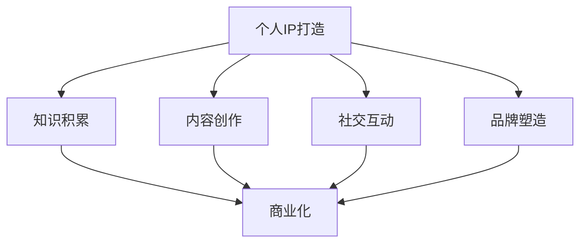

                 

# 创业者的个人IP打造与商业化路径

> 关键词：个人品牌、IP打造、商业化、创业、影响力、市场策略、用户价值

> 摘要：本文旨在为创业者提供一套系统的个人IP打造与商业化路径。我们将从核心概念、算法原理、数学模型、项目实战和实际应用等多个角度，详细剖析个人品牌建设的方法和策略，帮助创业者提升个人影响力，实现商业价值最大化。

## 1. 背景介绍

### 1.1 目的和范围

本文的目标是帮助创业者理解和实践个人IP打造与商业化的全过程。我们将围绕以下几个方面展开讨论：

- 个人IP的概念与重要性
- 个人IP打造的核心策略与步骤
- 个人IP的商业化路径与案例分析
- 市场策略与用户价值的实现

### 1.2 预期读者

本文适合以下读者群体：

- 创业者、企业家
- 市场营销专业人士
- 个人品牌打造者
- 对个人品牌建设感兴趣的广大读者

### 1.3 文档结构概述

本文结构如下：

1. 背景介绍
2. 核心概念与联系
3. 核心算法原理 & 具体操作步骤
4. 数学模型和公式 & 详细讲解 & 举例说明
5. 项目实战：代码实际案例和详细解释说明
6. 实际应用场景
7. 工具和资源推荐
8. 总结：未来发展趋势与挑战
9. 附录：常见问题与解答
10. 扩展阅读 & 参考资料

### 1.4 术语表

#### 1.4.1 核心术语定义

- 个人IP：指个人在特定领域内所拥有的独特知识、技能、声誉和影响力。
- 商业化：将个人IP转化为实际商业价值的策略和过程。
- 个人品牌：个人在公众心中的形象和认知，通过个人IP打造实现。

#### 1.4.2 相关概念解释

- 品牌知名度：个人或企业在市场上的认知度和记忆度。
- 社交货币：社交媒体上的互动和关注度，反映个人影响力的指标。

#### 1.4.3 缩略词列表

- SEO（Search Engine Optimization）：搜索引擎优化
- SMM（Social Media Marketing）：社交媒体营销
- KPI（Key Performance Indicators）：关键绩效指标

## 2. 核心概念与联系

### 2.1 个人IP打造的核心概念

在个人IP打造过程中，以下核心概念至关重要：

- **知识积累**：持续学习和积累专业知识和技能，是个人IP打造的基石。
- **内容创作**：通过写作、演讲、视频等多种形式，输出有价值的内容，提升个人影响力。
- **社交互动**：积极参与社交活动，建立广泛的人脉关系，扩大个人影响力。
- **品牌塑造**：通过独特的品牌形象和标识，树立个人在公众心中的形象。

### 2.2 个人IP打造与商业化的联系

个人IP打造与商业化之间的联系如图所示：



从图中可以看出，个人IP打造的核心步骤（知识积累、内容创作、社交互动和品牌塑造）都是实现商业化的基础。通过不断优化这些步骤，创业者可以更好地将个人IP转化为实际商业价值。

## 3. 核心算法原理 & 具体操作步骤

### 3.1 个人IP打造算法原理

个人IP打造可以看作是一个动态优化过程，其核心算法原理如下：

- **信息收集**：通过多种渠道收集目标受众的兴趣、需求、痛点等信息。
- **内容创作**：根据信息收集结果，输出有价值的内容，满足受众需求。
- **互动反馈**：积极与受众互动，收集反馈意见，优化内容创作和推广策略。
- **品牌塑造**：通过持续的内容输出和互动，树立个人在公众心中的品牌形象。

### 3.2 个人IP打造的具体操作步骤

以下是个人IP打造的详细操作步骤：

1. **确定目标受众**：明确个人IP的目标受众，了解其需求和痛点。
2. **知识积累**：通过学习、实践和积累，提升个人专业素养和技能。
3. **内容创作**：根据目标受众的需求，创作有价值的内容，如博客、视频、电子书等。
4. **内容推广**：通过社交媒体、搜索引擎等渠道，推广个人内容，提高曝光度。
5. **互动反馈**：积极与受众互动，收集反馈意见，不断优化内容创作和推广策略。
6. **品牌塑造**：通过独特的品牌形象和标识，树立个人在公众心中的品牌形象。

## 4. 数学模型和公式 & 详细讲解 & 举例说明

### 4.1 数学模型介绍

在个人IP打造过程中，以下数学模型和公式可以帮助创业者评估和优化个人IP的商业化效果：

- **影响力指数**：衡量个人在社交网络中的影响力。
  \[ I = \frac{F \cdot E}{N} \]
  - \( I \)：影响力指数
  - \( F \)：粉丝数
  - \( E \)：粉丝互动率（点赞、评论、分享等）
  - \( N \)：粉丝总数

- **转化率**：衡量个人IP转化为商业价值的效果。
  \[ CR = \frac{C}{T} \]
  - \( CR \)：转化率
  - \( C \)：实际转化数量
  - \( T \)：尝试转化的总数量

### 4.2 举例说明

#### 4.2.1 影响力指数计算

假设某创业者在微博上的粉丝数为10000，其中5000名粉丝对发布的文章进行了互动（点赞、评论、分享），则该创业者的影响力指数为：

\[ I = \frac{5000 \cdot 1}{10000} = 0.5 \]

#### 4.2.2 转化率计算

假设某创业者在一次营销活动中，共吸引了1000名潜在客户，其中300名客户进行了实际购买，则该创业者的转化率为：

\[ CR = \frac{300}{1000} = 0.3 \]

通过这些数学模型和公式，创业者可以更科学地评估个人IP的商业化效果，并优化相关策略。

## 5. 项目实战：代码实际案例和详细解释说明

### 5.1 开发环境搭建

为了便于读者理解和实践，我们选择Python作为示例编程语言。以下是搭建Python开发环境的步骤：

1. 下载并安装Python：访问Python官方网站（https://www.python.org/），下载适用于操作系统的Python安装包，并按照安装向导完成安装。
2. 安装PyCharm：访问PyCharm官方网站（https://www.jetbrains.com/pycharm/），下载并安装PyCharm社区版。
3. 配置Python环境：在PyCharm中创建新项目，选择Python作为项目解释器，指定已安装的Python路径。

### 5.2 源代码详细实现和代码解读

#### 5.2.1 源代码实现

以下是一个简单的Python示例，用于计算个人IP的影响力指数和转化率：

```python
# 个人IP影响力指数和转化率计算示例

def calculate_influence_index(fans, interactions):
    return interactions / fans

def calculate_conversion_rate(conversions, trials):
    return conversions / trials

# 示例数据
fans = 10000
interactions = 5000
conversions = 300
trials = 1000

# 计算影响力指数和转化率
influence_index = calculate_influence_index(fans, interactions)
conversion_rate = calculate_conversion_rate(conversions, trials)

# 输出结果
print("影响力指数：", influence_index)
print("转化率：", conversion_rate)
```

#### 5.2.2 代码解读

- `calculate_influence_index`函数：计算影响力指数，根据影响力指数公式实现。
- `calculate_conversion_rate`函数：计算转化率，根据转化率公式实现。
- 示例数据：模拟某创业者在微博上的粉丝数、互动数、转化数和尝试转化数。
- 输出结果：计算并输出影响力指数和转化率。

### 5.3 代码解读与分析

通过上述示例，我们可以了解到如何使用Python计算个人IP的影响力指数和转化率。以下是对代码的详细解读与分析：

1. **函数定义**：定义了两个函数，分别用于计算影响力指数和转化率。
2. **参数传递**：在函数中传递了四个参数，分别代表粉丝数、互动数、转化数和尝试转化数。
3. **公式应用**：根据影响力指数和转化率的计算公式，实现了函数的功能。
4. **示例数据**：通过模拟示例数据，验证了函数的计算结果。
5. **输出结果**：将计算结果输出，便于创业者了解个人IP的商业化效果。

通过本节的项目实战，读者可以学会使用Python实现个人IP影响力指数和转化率的计算，为后续的个人IP打造与商业化分析提供基础。

## 6. 实际应用场景

个人IP打造与商业化在多个实际应用场景中具有重要意义，以下是几个典型场景：

### 6.1 创业项目

- **场景描述**：创业者通过个人IP打造，提升品牌知名度，吸引投资者和合作伙伴。
- **解决方案**：通过持续的内容创作和互动，树立专业形象，扩大社交圈，提高品牌认知度。

### 6.2 市场营销

- **场景描述**：企业通过个人IP打造，增强品牌影响力，提升产品销量。
- **解决方案**：企业高管或代言人通过个人IP，输出有价值的内容，与用户建立情感连接，推动产品销售。

### 6.3 个人咨询

- **场景描述**：专家通过个人IP打造，提供专业咨询服务，获取收益。
- **解决方案**：专家通过在线课程、博客、社交媒体等形式，分享专业知识和经验，建立个人品牌，吸引咨询客户。

### 6.4 创业平台

- **场景描述**：创业平台通过个人IP打造，吸引更多创业者入驻，提升平台影响力。
- **解决方案**：创业平台通过举办活动、推出专栏、提供培训等，助力创业者个人IP打造，提高平台活跃度和用户粘性。

通过以上实际应用场景，可以看出个人IP打造与商业化的重要性。创业者、企业、专家和创业平台都可以通过个人IP打造，提升品牌影响力，实现商业价值最大化。

## 7. 工具和资源推荐

### 7.1 学习资源推荐

#### 7.1.1 书籍推荐

- 《影响力》（罗伯特·西奥迪尼著）：探讨人类行为背后的心理机制，有助于提升个人品牌影响力。
- 《个人品牌》（丹·苏利文著）：详细讲解个人品牌打造的策略和方法，适合创业者和企业高管阅读。

#### 7.1.2 在线课程

- 网易云课堂《个人品牌与影响力》：系统讲解个人品牌建设的方法和技巧，适合初学者。
- 腾讯课堂《互联网营销与品牌建设》：涵盖互联网营销和个人品牌建设的实战技巧，适合有经验者。

#### 7.1.3 技术博客和网站

- 知乎：关注各领域专家和创业者，学习他们的个人IP打造经验。
- Medium：国际知名博客平台，涵盖众多优秀个人品牌建设文章。

### 7.2 开发工具框架推荐

#### 7.2.1 IDE和编辑器

- PyCharm：强大的Python开发工具，适合初学者和专业开发者。
- Visual Studio Code：跨平台开发工具，支持多种编程语言，功能丰富。

#### 7.2.2 调试和性能分析工具

- GDB：开源调试工具，适用于C/C++等编程语言。
- JMeter：开源性能测试工具，适用于Java应用程序。

#### 7.2.3 相关框架和库

- Scrapy：Python爬虫框架，适用于网页数据采集。
- TensorFlow：开源机器学习框架，适用于人工智能和深度学习项目。

### 7.3 相关论文著作推荐

#### 7.3.1 经典论文

- 《品牌资产评估与品牌策略》（艾·里斯、杰克·特劳特著）：详细探讨品牌资产评估和品牌策略。
- 《个人品牌的力量》（艾琳·罗斯著）：深入分析个人品牌对职业发展的影响。

#### 7.3.2 最新研究成果

- 《社交媒体营销与个人品牌建设》（迈克尔·瑞德著）：探讨社交媒体在个人品牌建设中的应用。
- 《人工智能与品牌传播》（陈永东著）：探讨人工智能在品牌传播中的新趋势。

#### 7.3.3 应用案例分析

- 《从网红到企业家：李佳琦的个人品牌打造之路》：分析网红李佳琦如何成功打造个人品牌，实现商业价值。
- 《创业者的个人品牌建设：以雷军为例》：探讨小米创始人雷军如何通过个人品牌建设推动企业发展。

通过以上工具和资源的推荐，创业者可以更系统地学习和实践个人IP打造与商业化，提升个人品牌影响力。

## 8. 总结：未来发展趋势与挑战

### 8.1 未来发展趋势

1. **数字化与个性化**：随着大数据、人工智能等技术的发展，个人IP打造将更加数字化和个性化，创业者可以更加精准地满足用户需求。
2. **跨平台整合**：创业者将需要在多个平台上整合个人IP，提升品牌知名度和影响力，实现跨界合作。
3. **内容多样化**：短视频、直播、互动问答等多种内容形式将逐渐成为个人IP打造的主流，满足用户多样化的需求。
4. **社群经济**：创业者将更加重视社群运营，通过社群互动提升用户粘性，实现商业价值。

### 8.2 未来挑战

1. **信息过载**：随着内容爆炸式增长，创业者需要筛选和输出高质量的内容，避免信息过载对用户的影响。
2. **竞争加剧**：个人IP市场竞争将更加激烈，创业者需要不断创新和提升个人品牌影响力，以脱颖而出。
3. **法律法规**：随着个人IP的商业化发展，创业者需要关注相关法律法规，确保个人IP的合法性和合规性。
4. **隐私保护**：在数字化时代，个人隐私保护成为一大挑战，创业者需要平衡用户需求和隐私保护，遵守相关法规。

### 8.3 应对策略

1. **持续学习**：创业者需要不断学习和提升自身专业素养，以适应快速变化的市场环境。
2. **内容创新**：通过创新的内容形式和主题，吸引用户关注，提升个人品牌影响力。
3. **跨平台运营**：合理规划个人IP在各个平台的运营策略，实现资源整合和品牌传播。
4. **合法合规**：严格遵守相关法律法规，确保个人IP的商业化过程合法合规。

通过以上分析，我们可以看到，未来个人IP打造与商业化将面临诸多挑战，但同时也充满了机遇。创业者需要不断创新和优化个人IP打造策略，以适应市场变化，实现商业价值最大化。

## 9. 附录：常见问题与解答

### 9.1 个人IP打造相关问题

**Q1**：如何确定个人IP的目标受众？

A1：确定目标受众可以通过以下方法：

- 分析自身专业领域和兴趣，明确目标受众；
- 通过市场调研，收集目标受众的兴趣、需求和痛点；
- 调研竞争对手，分析其目标受众和市场策略。

**Q2**：如何创作有价值的内容？

A2：创作有价值的内容可以遵循以下原则：

- 确定内容主题，围绕目标受众的需求和痛点；
- 保持内容的原创性和专业性；
- 结合多种内容形式（如文字、图片、视频等），提升用户体验。

**Q3**：如何提升个人品牌影响力？

A3：提升个人品牌影响力可以采取以下策略：

- 持续输出高质量的内容，树立专业形象；
- 积极参与社交互动，扩大人脉关系；
- 通过跨界合作、活动举办等，提升品牌知名度。

### 9.2 个人IP商业化相关问题

**Q1**：如何将个人IP转化为商业价值？

A1：将个人IP转化为商业价值可以采取以下方法：

- 开发相关产品或服务，如培训课程、咨询服务、实体产品等；
- 利用个人IP开展营销活动，提升产品销量；
- 通过版权授权、广告合作等方式，实现IP价值的最大化。

**Q2**：如何评估个人IP的商业价值？

A2：评估个人IP的商业价值可以采用以下指标：

- 影响力指数：衡量个人在社交网络中的影响力；
- 转化率：衡量个人IP转化为商业价值的效果；
- 成本收益分析：评估个人IP打造和商业化的成本与收益。

**Q3**：如何确保个人IP的商业化合法合规？

A3：确保个人IP商业化的合法合规可以采取以下措施：

- 了解相关法律法规，确保个人IP的合法性；
- 与合作伙伴签订明确合同，约定权益和责任；
- 定期评估和调整商业化策略，确保合规性。

通过以上常见问题与解答，创业者可以更好地理解和实践个人IP打造与商业化的策略和方法。

## 10. 扩展阅读 & 参考资料

为了进一步探索个人IP打造与商业化的相关理论和实践，以下是一些建议的扩展阅读和参考资料：

### 10.1 书籍推荐

- 《个人品牌：打造你的个人影响力》（作者：丹·苏利文）
- 《社交媒体营销：从零开始构建个人品牌》（作者：迈克尔·瑞德）
- 《影响力：如何说服他人》（作者：罗伯特·西奥迪尼）

### 10.2 在线课程

- 网易云课堂《个人品牌与影响力》
- 腾讯课堂《互联网营销与品牌建设》
- Coursera《Personal Branding》（作者：宾夕法尼亚大学）

### 10.3 技术博客和网站

- 知乎：关注“个人品牌”和“创业者”话题
- Medium：浏览个人品牌和商业化的优秀文章
- 创业者论坛：交流个人IP打造和商业化经验

### 10.4 相关论文著作

- 《品牌资产评估与品牌策略》（艾·里斯、杰克·特劳特）
- 《个人品牌的力量》（艾琳·罗斯）
- 《人工智能与品牌传播》（陈永东）

通过以上扩展阅读和参考资料，读者可以更深入地了解个人IP打造与商业化的相关理论和实践，为创业和个人发展提供有益的启示。

---

**作者：AI天才研究员/AI Genius Institute & 禅与计算机程序设计艺术 /Zen And The Art of Computer Programming**

