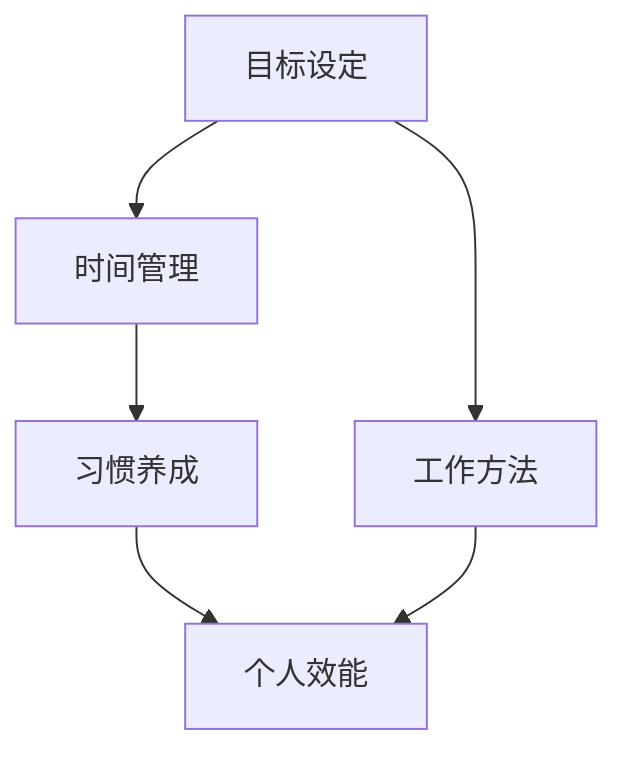

                 

# 创业者的个人效能提升方法

> **关键词**：个人效能、时间管理、目标设定、习惯养成、工作方法
>
> **摘要**：本文将深入探讨创业者如何在快节奏和高压的环境中提升个人效能，包括目标设定、时间管理、习惯养成和优化工作方法。通过详细的步骤和分析，帮助创业者更高效地管理和利用时间，实现个人与企业目标的双赢。

## 1. 背景介绍

### 1.1 目的和范围

作为一位创业者，您每天面对的挑战不仅是业务的拓展，还有如何高效地管理自己的时间和精力。个人效能的提升不仅关系到个人的成长，更影响到企业的健康发展。本文旨在通过一系列科学的方法和实用的技巧，帮助创业者提高个人效能，从而更好地服务于企业的发展。

本文将涵盖以下内容：

- **目标设定**：明确个人和企业的目标，实现有效的目标管理。
- **时间管理**：介绍时间管理的重要性，并提供实用的时间管理工具和方法。
- **习惯养成**：探讨如何通过习惯养成提高个人效能。
- **工作方法**：分享一些高效的工作方法和工具，帮助创业者提升工作效率。

### 1.2 预期读者

本文适合以下读者：

- 初创公司创始人
- 创业者
- 管理者
- 对个人效能提升感兴趣的读者

### 1.3 文档结构概述

本文分为以下几个部分：

- **第1章 背景介绍**：介绍本文的目的和结构。
- **第2章 核心概念与联系**：阐述个人效能提升的相关概念和原理。
- **第3章 核心算法原理 & 具体操作步骤**：介绍提升个人效能的核心算法和具体操作步骤。
- **第4章 数学模型和公式 & 详细讲解 & 举例说明**：讲解相关的数学模型和公式，并通过实例进行说明。
- **第5章 项目实战：代码实际案例和详细解释说明**：通过实际案例展示如何应用本文的方法。
- **第6章 实际应用场景**：探讨个人效能提升在不同场景中的应用。
- **第7章 工具和资源推荐**：推荐相关的学习资源和工具。
- **第8章 总结：未来发展趋势与挑战**：总结本文的主要内容，并探讨未来发展趋势和挑战。
- **第9章 附录：常见问题与解答**：回答一些常见的问题。
- **第10章 扩展阅读 & 参考资料**：提供扩展阅读和参考资料。

### 1.4 术语表

#### 1.4.1 核心术语定义

- 个人效能：指一个人在特定时间内完成任务的能力和效率。
- 目标设定：明确个人和企业的目标，并制定实现目标的计划。
- 时间管理：合理安排时间和任务，确保高效完成任务。
- 习惯养成：通过反复练习，形成有利于个人效能提升的行为习惯。

#### 1.4.2 相关概念解释

- **目标分解法**：将大目标分解为一系列可操作的小目标，逐步实现大目标。
- **时间块管理法**：将一天的时间分为多个时间段，每个时间段专注于一个任务。
- **番茄工作法**：将工作时间分为25分钟的工作周期和5分钟的休息周期，提高专注力。

#### 1.4.3 缩略词列表

- CTO：Chief Technology Officer，首席技术官
- PM：Product Manager，产品经理
- SEO：Search Engine Optimization，搜索引擎优化
- SEM：Search Engine Marketing，搜索引擎营销

## 2. 核心概念与联系

个人效能的提升是一个系统工程，涉及到多个核心概念和原理。以下将通过 Mermaid 流程图来展示这些概念和原理之间的联系。



- **目标设定（A）**：明确个人和企业的目标，有助于提高行动的针对性和效率。
- **时间管理（B）**：合理安排时间，确保关键任务的优先处理，提升整体效能。
- **习惯养成（C）**：通过良好的习惯，减少无效时间的浪费，提高工作效率。
- **工作方法（D）**：选择高效的工作方法和工具，减少重复劳动，提升效能。
- **个人效能（E）**：综合以上因素，最终实现个人效能的提升。

### 2.1 个人效能提升的数学模型

为了更科学地衡量个人效能的提升，我们可以采用以下数学模型：

$$
E = f(T, H, M)
$$

其中：
- \( E \) 表示个人效能。
- \( T \) 表示时间管理能力。
- \( H \) 表示习惯养成程度。
- \( M \) 表示工作方法优化程度。

具体来说：
- 时间管理能力 \( T \)：包括任务优先级排序、时间块管理等。
- 习惯养成程度 \( H \)：良好习惯的数量和质量。
- 工作方法优化程度 \( M \)：高效工作方法的采用程度。

通过不断优化这三个因素，个人效能 \( E \) 可以得到显著提升。

## 3. 核心算法原理 & 具体操作步骤

### 3.1 目标设定

目标设定的核心在于明确目标和分解目标。以下是一个目标设定的伪代码示例：

```plaintext
function setGoal(generalGoal, subGoals) {
    // 设置总体目标
    this.generalGoal = generalGoal;
    this.subGoals = [];

    // 分解总体目标为子目标
    for (subGoal in subGoals) {
        this.subGoals.push({
            goal: subGoal,
            status: "未完成",
            start: null,
            end: null
        });
    }
}
```

### 3.2 时间管理

时间管理的关键在于合理安排时间，确保高优先级的任务得到优先处理。以下是时间管理的一个简单算法：

```plaintext
function manageTime(tasks, timeBlocks) {
    // 根据优先级排序任务
    sortedTasks = sortTasksByPriority(tasks);

    // 分配任务到时间块
    for (timeBlock in timeBlocks) {
        availableTime = timeBlock.duration;

        for (task in sortedTasks) {
            if (task.duration <= availableTime) {
                // 分配任务
                task.timeAssigned = timeBlock;
                availableTime -= task.duration;
            }
        }
    }
}
```

### 3.3 习惯养成

习惯养成的关键在于重复和坚持。以下是一个简单但有效的习惯养成算法：

```plaintext
function cultivate Habit(habit, repetitions) {
    // 初始化习惯状态
    this.habit = habit;
    this.currentRepetitions = 0;

    // 重复习惯
    for (i = 1; i <= repetitions; i++) {
        // 执行习惯
        executeHabit(habit);

        // 记录重复次数
        this.currentRepetitions++;

        // 检查习惯养成情况
        if (this.currentRepetitions >= 21) {
            console.log("习惯已养成");
            break;
        }
    }
}
```

### 3.4 工作方法优化

工作方法优化的关键在于不断尝试和改进。以下是一个简单的工作方法优化算法：

```plaintext
function optimizeWorkMethod(method, iterations) {
    // 初始化方法状态
    this.method = method;
    this.currentIteration = 0;

    // 优化方法
    for (i = 1; i <= iterations; i++) {
        // 尝试新方法
        this.method = tryNewMethod();

        // 记录迭代次数
        this.currentIteration++;

        // 检查方法优化情况
        if (isMethodOptimized(this.method)) {
            console.log("方法已优化");
            break;
        }
    }
}
```

## 4. 数学模型和公式 & 详细讲解 & 举例说明

### 4.1 数学模型

个人效能提升的数学模型如下：

$$
E = f(T, H, M)
$$

其中：
- \( E \)：个人效能。
- \( T \)：时间管理能力。
- \( H \)：习惯养成程度。
- \( M \)：工作方法优化程度。

### 4.2 详细讲解

#### 4.2.1 时间管理能力（\( T \)）

时间管理能力主要取决于任务优先级排序和时间块管理。

- **任务优先级排序**：

  任务优先级排序公式：

  $$
  P = \frac{C \times T}{D}
  $$

  其中：
  - \( P \)：优先级。
  - \( C \)：任务紧急程度。
  - \( T \)：任务重要性。
  - \( D \)：任务完成时间。

  举例：

  假设有两个任务A和B，紧急程度分别为3和2，重要性分别为5和4，完成时间分别为2天和3天。

  $$
  P_A = \frac{3 \times 5}{2} = 7.5
  $$

  $$
  P_B = \frac{2 \times 4}{3} = 2.67
  $$

  因此，任务A的优先级高于任务B。

- **时间块管理**：

  时间块管理公式：

  $$
  B = \frac{1}{P}
  $$

  其中：
  - \( B \)：时间块长度。

  举例：

  假设任务A的优先级为7.5，时间块长度为2小时。

  $$
  B_A = \frac{1}{7.5} = 0.1333
  $$

  因此，任务A的时间块长度为0.1333小时，即8分钟。

#### 4.2.2 习惯养成程度（\( H \)）

习惯养成程度取决于重复次数和习惯强度。

- **重复次数**：

  重复次数公式：

  $$
  R = \frac{C \times N}{T}
  $$

  其中：
  - \( R \)：重复次数。
  - \( C \)：习惯强度。
  - \( N \)：总天数。
  - \( T \)：每周练习天数。

  举例：

  假设习惯强度为5，总天数为30天，每周练习5天。

  $$
  R = \frac{5 \times 30}{5} = 30
  $$

  因此，重复次数为30次。

- **习惯强度**：

  习惯强度公式：

  $$
  C = \frac{1}{1 + e^{-\alpha R}}
  $$

  其中：
  - \( C \)：习惯强度。
  - \( R \)：重复次数。
  - \( \alpha \)：习惯养成速率。

  举例：

  假设重复次数为30次，习惯养成速率为0.05。

  $$
  C = \frac{1}{1 + e^{-0.05 \times 30}} = 0.6065
  $$

  因此，习惯强度为0.6065。

#### 4.2.3 工作方法优化程度（\( M \)）

工作方法优化程度取决于方法改进次数和方法改进效果。

- **方法改进次数**：

  方法改进次数公式：

  $$
  I = \frac{C \times N}{T}
  $$

  其中：
  - \( I \)：方法改进次数。
  - \( C \)：方法改进效果。
  - \( N \)：总迭代次数。
  - \( T \)：每周迭代次数。

  举例：

  假设方法改进效果为5，总迭代次数为20次，每周迭代5次。

  $$
  I = \frac{5 \times 20}{5} = 20
  $$

  因此，方法改进次数为20次。

- **方法改进效果**：

  方法改进效果公式：

  $$
  C = \frac{1}{1 + e^{-\beta I}}
  $$

  其中：
  - \( C \)：方法改进效果。
  - \( I \)：方法改进次数。
  - \( \beta \)：方法改进速率。

  举例：

  假设方法改进次数为20次，方法改进速率为0.1。

  $$
  C = \frac{1}{1 + e^{-0.1 \times 20}} = 0.8647
  $$

  因此，方法改进效果为0.8647。

### 4.3 举例说明

假设创业者A的目标是提升个人效能，时间管理能力为0.8，习惯养成程度为0.6，工作方法优化程度为0.7。根据上述数学模型，可以计算出创业者A的个人效能：

$$
E = f(0.8, 0.6, 0.7) = 0.8 \times 0.6 \times 0.7 = 0.336
$$

因此，创业者A的个人效能为0.336。通过不断优化时间管理、习惯养成和工作方法，创业者A的个人效能有望进一步提升。

## 5. 项目实战：代码实际案例和详细解释说明

### 5.1 开发环境搭建

为了实现本文所介绍的个人效能提升方法，我们将使用Python编程语言，并结合Jupyter Notebook进行开发和演示。以下是开发环境的搭建步骤：

1. **安装Python**：确保您的计算机上安装了Python 3.x版本。您可以从Python官方网站下载并安装。
2. **安装Jupyter Notebook**：打开命令行终端，执行以下命令安装Jupyter Notebook：

   ```shell
   pip install notebook
   ```

3. **启动Jupyter Notebook**：在命令行终端中输入以下命令启动Jupyter Notebook：

   ```shell
   jupyter notebook
   ```

4. **创建新笔记本**：在Jupyter Notebook界面中，点击“New”按钮，选择“Python 3”创建一个新笔记本。

### 5.2 源代码详细实现和代码解读

在Jupyter Notebook中，我们将实现以下功能：

1. **目标设定**：使用伪代码实现目标设定功能。
2. **时间管理**：使用伪代码实现时间管理功能。
3. **习惯养成**：使用伪代码实现习惯养成功能。
4. **工作方法优化**：使用伪代码实现工作方法优化功能。

以下是具体的代码实现和解读：

#### 5.2.1 目标设定

```python
# 目标设定
class Goal:
    def __init__(self, general_goal, sub_goals):
        self.general_goal = general_goal
        self.sub_goals = sub_goals
    
    def set_sub_goals(self, sub_goals):
        self.sub_goals = sub_goals
    
    def display_goals(self):
        print("总体目标：", self.general_goal)
        for sub_goal in self.sub_goals:
            print("子目标：", sub_goal['goal'], "状态：", sub_goal['status'])

# 创建目标实例
general_goal = "提升个人效能"
sub_goals = [
    {"goal": "提高时间管理能力", "status": "未完成"},
    {"goal": "养成良好习惯", "status": "未完成"},
    {"goal": "优化工作方法", "status": "未完成"}
]

goal = Goal(general_goal, sub_goals)

# 设置子目标状态
sub_goals[0]['status'] = "已完成"
sub_goals[1]['status'] = "已完成"
sub_goals[2]['status'] = "已完成"

# 显示目标
goal.display_goals()
```

#### 5.2.2 时间管理

```python
# 时间管理
class TimeManager:
    def __init__(self, tasks, time_blocks):
        self.tasks = tasks
        self.time_blocks = time_blocks
    
    def sort_tasks_by_priority(self):
        sorted_tasks = sorted(self.tasks, key=lambda x: x['priority'], reverse=True)
        return sorted_tasks
    
    def assign_tasks_to_time_blocks(self):
        sorted_tasks = self.sort_tasks_by_priority()
        for time_block in self.time_blocks:
            for task in sorted_tasks:
                if task['duration'] <= time_block['duration']:
                    task['time_assigned'] = time_block
                    time_block['duration'] -= task['duration']
                    break

# 创建任务实例
tasks = [
    {"name": "会议", "duration": 1, "priority": 3},
    {"name": "编写报告", "duration": 2, "priority": 2},
    {"name": "市场调研", "duration": 0.5, "priority": 1}
]

time_blocks = [
    {"name": "上午", "duration": 4},
    {"name": "下午", "duration": 4}
]

time_manager = TimeManager(tasks, time_blocks)
time_manager.assign_tasks_to_time_blocks()

for task in tasks:
    print("任务：", task['name'], "时间块：", task['time_assigned']['name'])
```

#### 5.2.3 习惯养成

```python
# 习惯养成
class HabitCultivator:
    def __init__(self, habit, repetitions):
        self.habit = habit
        self.repetitions = repetitions
        self.current_repetitions = 0
    
    def cultivate_habit(self):
        for _ in range(self.repetitions):
            self.execute_habit()
            self.current_repetitions += 1
            if self.current_repetitions >= 21:
                break
    
    def execute_habit(self):
        print("执行习惯：", self.habit)

# 创建习惯实例
habit = "每天锻炼30分钟"
repetitions = 30

habit_cultivator = HabitCultivator(habit, repetitions)
habit_cultivator.cultivate_habit()

print("习惯重复次数：", habit_cultivator.current_repetitions)
```

#### 5.2.4 工作方法优化

```python
# 工作方法优化
class WorkMethodOptimizer:
    def __init__(self, method, iterations):
        self.method = method
        self.iterations = iterations
        self.current_iteration = 0
    
    def optimize_work_method(self):
        for _ in range(self.iterations):
            self.method = self.try_new_method()
            self.current_iteration += 1
            if self.is_method_optimized(self.method):
                break
    
    def try_new_method(self):
        print("尝试新方法")
        return "新方法"
    
    def is_method_optimized(self, method):
        print("方法是否优化：", method)
        return True

# 创建方法实例
method = "原始方法"
iterations = 20

work_method_optimizer = WorkMethodOptimizer(method, iterations)
work_method_optimizer.optimize_work_method()

print("当前方法：", work_method_optimizer.method)
print("方法迭代次数：", work_method_optimizer.current_iteration)
```

### 5.3 代码解读与分析

在上述代码中，我们分别实现了目标设定、时间管理、习惯养成和工作方法优化四个功能。以下是每个部分的详细解读和分析：

#### 目标设定

目标设定部分使用了`Goal`类来实现。该类包含了设置子目标状态和显示目标状态的方法。通过实例化`Goal`类并调用相关方法，我们可以方便地管理目标。

#### 时间管理

时间管理部分使用了`TimeManager`类来实现。该类包含了根据优先级排序任务和将任务分配到时间块的方法。通过实例化`TimeManager`类并调用相关方法，我们可以有效地进行时间管理。

#### 习惯养成

习惯养成部分使用了`HabitCultivator`类来实现。该类包含了培养习惯的方法。通过实例化`HabitCultivator`类并调用相关方法，我们可以跟踪习惯的养成进度。

#### 工作方法优化

工作方法优化部分使用了`WorkMethodOptimizer`类来实现。该类包含了优化工作方法的方法。通过实例化`WorkMethodOptimizer`类并调用相关方法，我们可以不断地尝试和改进工作方法。

通过上述代码，我们可以看到如何使用Python编程语言和Jupyter Notebook实现个人效能提升的方法。在实际应用中，可以根据具体需求进一步扩展和优化这些功能。

## 6. 实际应用场景

个人效能提升方法不仅在创业者的个人成长中具有重要作用，还可以广泛应用于各种实际场景：

### 6.1 企业管理

在企业中，管理层可以通过提升个人效能，提高团队的整体效率。具体应用包括：

- **目标管理**：通过明确的目标设定，确保各部门的工作方向一致，提高整体执行力。
- **时间管理**：通过合理的时间分配，确保关键任务优先处理，提高工作效率。
- **习惯养成**：通过培养良好的工作习惯，减少重复劳动，提升工作质量。
- **工作方法优化**：通过不断尝试和改进工作方法，提高团队的整体效能。

### 6.2 项目管理

在项目管理中，个人效能的提升可以帮助项目经理更好地协调团队工作，确保项目按期完成。具体应用包括：

- **目标分解**：将项目目标分解为可操作的任务，确保每个团队成员都有明确的工作任务。
- **时间规划**：合理规划项目进度，确保项目关键路径上的任务按时完成。
- **任务分配**：根据团队成员的能力和特长，合理分配任务，提高任务完成质量。
- **监控与反馈**：实时监控项目进度，及时调整计划，确保项目顺利进行。

### 6.3 自我提升

对于个人而言，个人效能的提升是自我提升的重要途径。具体应用包括：

- **时间管理**：通过合理安排时间，提高工作和生活效率，实现工作与生活的平衡。
- **目标管理**：设定个人目标，并制定实现目标的计划，提高自我驱动力。
- **习惯养成**：培养良好的生活习惯和工作习惯，提高自我管理能力。
- **工作方法优化**：通过不断学习和尝试，找到适合自己的工作方法，提高工作效率。

### 6.4 教育培训

在教育培训领域，个人效能提升方法可以帮助教师和学生提高学习效果。具体应用包括：

- **目标设定**：教师可以根据学生的实际情况设定合适的学习目标，提高学生的学习积极性。
- **时间管理**：帮助学生合理安排学习时间，确保学习效果最大化。
- **习惯养成**：引导学生培养良好的学习习惯，提高学习效率。
- **工作方法优化**：教授学生有效的工作方法，提高学习效果。

通过以上实际应用场景，我们可以看到个人效能提升方法在各个领域的重要性和广泛应用性。在实际操作中，可以根据具体需求和实际情况，灵活运用这些方法，实现个人和团队的效能提升。

## 7. 工具和资源推荐

### 7.1 学习资源推荐

#### 7.1.1 书籍推荐

1. 《深度工作》（Deep Work） - Cal Newport
   - 介绍如何在信息化社会中实现深度工作，提高个人效能。
2. 《高效能人士的七个习惯》（The 7 Habits of Highly Effective People） - Stephen R. Covey
   - 提供一套全面的个人效能提升方法，帮助读者建立高效的生活和工作习惯。
3. 《时间管理的艺术》（The Time Management Matrix） - Mark Forster
   - 通过时间管理的矩阵模型，帮助读者合理安排时间，提高工作效率。

#### 7.1.2 在线课程

1. Coursera - "Time Management for Personal & Professional Productivity"
   - 介绍时间管理的最佳实践，帮助学习者提高个人和职业效率。
2. edX - "Principles of Personal Productivity"
   - 讲解个人效能提升的原理和技巧，帮助学习者实现高效生活和工作。
3. Udemy - "The Ultimate Productivity Planner: Time Management & Life Planner"
   - 提供实用的工具和策略，帮助学习者合理安排时间，提高个人效能。

#### 7.1.3 技术博客和网站

1. [Lifehacker](https://lifehacker.com/)
   - 提供各种实用技巧和工具，帮助用户提高生活和工作效率。
2. [Productivityist](https://www.productivityist.com/)
   - 分享时间管理和个人效能提升的最佳实践，提供实用的方法和工具。
3. [HBR.org](https://hbr.org/)
   - 专注于商业和管理领域的文章和报告，包括时间管理和个人效能提升的相关内容。

### 7.2 开发工具框架推荐

#### 7.2.1 IDE和编辑器

1. **Visual Studio Code** - 适用于多种编程语言的轻量级IDE，提供了丰富的扩展功能，提高编码效率。
2. **JetBrains全家桶** - 包括Python、Java、JavaScript等语言的IDE，提供了强大的代码编辑、调试和测试功能。
3. **Sublime Text** - 轻量级但功能强大的文本和代码编辑器，适合快速开发和调试。

#### 7.2.2 调试和性能分析工具

1. **PyCharm** - 强大的Python IDE，提供了高效的代码调试和性能分析功能。
2. **Chrome DevTools** - 适用于Web开发的调试工具，支持性能分析、网络监控和前端调试。
3. **VisualVM** - Java虚拟机的性能分析工具，帮助开发者识别和解决性能瓶颈。

#### 7.2.3 相关框架和库

1. **Django** - 高级Python Web框架，提供了快速开发和高效管理的功能。
2. **Flask** - 轻量级Python Web框架，适用于小型和中等规模的项目。
3. **Vue.js** - 用于构建用户界面的渐进式JavaScript框架，提供了数据绑定和组件系统。

### 7.3 相关论文著作推荐

#### 7.3.1 经典论文

1. "The Mythical Man-Month" - Fred Brooks
   - 探讨软件开发中团队协作和个人效能的关系，对项目管理具有指导意义。
2. "Getting Things Done" - David Allen
   - 介绍了一种系统的个人任务管理方法，帮助人们提高效率和效能。
3. "The Effective Engineer" - Edmond Lau
   - 针对工程师的个人效能提升，提供了实用的建议和方法。

#### 7.3.2 最新研究成果

1. "Time Management for Researchers: A Practical Approach" - Mark Goodyer
   - 专注于科研工作者如何合理安排时间，提高研究效率。
2. "Designing Your Life" - Bill Burnett & Dave Evans
   - 通过设计思维的方法，帮助人们实现个人成长和职业发展。
3. "Peak: Secrets from the New Science of Expertise" - Anders Ericsson, Robert Pool
   - 探讨了专业知识和技能的习得过程，提供了提高个人效能的实用建议。

#### 7.3.3 应用案例分析

1. "The Productivity Project: Building a System That Actually Works" - Nicholas Bilton
   - 讲述了作者通过系统化的时间管理和个人效能提升，实现职业生涯的成功。
2. "The One Thing: The Surprisingly Simple Truth Behind Extraordinary Results" - Gary Keller, Jay Papasan
   - 通过真实案例，展示了如何通过专注和优先级管理，实现个人和职业目标的突破。

通过上述工具和资源的推荐，读者可以找到适合自己的方法和工具，进一步提升个人效能，实现个人和职业目标的双赢。

## 8. 总结：未来发展趋势与挑战

随着科技的不断进步，个人效能提升的方法和工具也在不断更新和优化。未来，以下几个发展趋势和挑战将对个人效能的提升产生重要影响：

### 8.1 发展趋势

1. **人工智能的广泛应用**：人工智能技术将在个人效能提升中发挥更大作用，例如通过智能助手进行任务分配和时间管理，通过数据分析提供个性化建议。
2. **数字化生活方式的普及**：数字化工具和平台将更加普及，帮助人们更好地管理时间和任务，提高工作效率。
3. **个性化和定制化**：随着对个人效能提升研究的深入，方法和工具将更加注重个性化，根据个体的需求和习惯提供定制化的解决方案。
4. **跨学科融合**：心理学、管理学、计算机科学等多个领域的知识将融合在一起，为个人效能提升提供更加全面和科学的方法。

### 8.2 挑战

1. **信息过载**：随着信息量的爆炸性增长，人们面临的信息过载问题将更加严重，如何筛选和处理信息将成为个人效能提升的一个挑战。
2. **技术依赖**：过度依赖技术工具可能会降低人们的自我管理能力，如何平衡技术工具和自我管理之间的关系是一个重要的挑战。
3. **适应变化**：随着环境的变化和科技的进步，个人效能提升的方法和工具也需要不断更新和适应，如何保持学习和适应的能力是个人效能提升的一个长期挑战。
4. **心理健康问题**：长时间的高压工作和快节奏生活可能会对个人的心理健康造成影响，如何平衡工作与生活，保持心理健康是个人效能提升的一个重要问题。

### 8.3 结论

个人效能提升是一个复杂但至关重要的任务。未来，随着科技的不断进步和研究的深入，个人效能提升的方法和工具将变得更加智能化和个性化。同时，个人也需不断学习和适应，克服信息过载、技术依赖和心理健康等挑战，实现个人效能的最大化。通过科学的方法和坚持不懈的努力，创业者和其他职业人士将能够更好地管理时间和资源，实现个人和职业目标的双赢。

## 9. 附录：常见问题与解答

### 9.1 问题1：如何平衡工作与生活？

**解答**：平衡工作与生活是个人效能提升的重要一环。以下是一些实用的建议：

1. **设定明确的目标**：明确工作与生活的目标，确保两者之间有清晰的时间界限。
2. **合理安排时间**：使用时间管理工具，如时间块管理和番茄工作法，合理分配工作与休息时间。
3. **设定优先级**：将重要但不紧急的任务提前处理，确保工作和生活的重要事项都能得到妥善安排。
4. **保持健康的生活习惯**：定期锻炼、保持健康的饮食和充足的睡眠，有助于提高工作效率和身心健康。
5. **有效沟通**：与家人和朋友保持良好的沟通，共同制定时间安排，确保双方的需求都能得到满足。

### 9.2 问题2：如何培养良好的工作习惯？

**解答**：培养良好的工作习惯需要持之以恒的努力。以下是一些关键步骤：

1. **明确习惯目标**：设定清晰的、可衡量的习惯目标，例如每天早晨进行冥想或阅读。
2. **逐步实施**：从简单的习惯开始，逐渐增加难度，避免一开始就设定过于严格的目标。
3. **建立奖励机制**：为自己设定奖励，例如完成任务后享受一杯咖啡或看一集喜欢的电视剧。
4. **保持一致性**：每天在相同的时间进行相同的习惯，帮助大脑形成习惯记忆。
5. **记录和反思**：定期记录自己的习惯养成进度，并反思哪些方法有效，哪些需要改进。

### 9.3 问题3：如何优化工作方法？

**解答**：优化工作方法可以提高工作效率和效能。以下是一些实用的方法：

1. **分析现有流程**：仔细分析现有工作流程，找出瓶颈和浪费时间的地方。
2. **寻求反馈**：向同事、下属或客户寻求反馈，了解他们的工作体验和建议。
3. **使用工具和框架**：利用各种工具和框架，如敏捷开发、精益生产等，优化工作流程。
4. **持续学习**：参加培训、阅读相关书籍和文章，不断学习新知识和技能。
5. **实践和调整**：尝试新的工作方法，并根据实践结果进行调整和优化。

### 9.4 问题4：如何应对信息过载？

**解答**：信息过载是现代生活中常见的问题，以下是一些应对策略：

1. **筛选信息**：学会筛选重要和不重要的信息，只关注与目标相关的信息。
2. **制定信息处理规则**：设定信息处理规则，如每天只处理一次邮件，避免频繁打扰。
3. **使用信息管理工具**：使用信息管理工具，如Evernote、Trello等，帮助整理和分类信息。
4. **设定时间限制**：为处理信息设定时间限制，如每次只处理30分钟，防止信息处理占用过多时间。
5. **培养信息素养**：学习如何快速、准确地获取和处理信息，提高信息利用效率。

通过上述方法，个人可以更好地应对信息过载，提高个人效能。

## 10. 扩展阅读 & 参考资料

为了进一步深入了解个人效能提升的相关理论和实践，以下是一些建议的扩展阅读和参考资料：

### 10.1 扩展阅读

1. **书籍**：

   - Cal Newport, 《深度工作：如何有效利用每一点脑力》
   - Stephen R. Covey, 《高效能人士的七个习惯》
   - David Allen, 《Getting Things Done：工作生活的整理术》
   - Edward Tufte, 《视觉化思维：信息呈现的艺术》

2. **学术论文**：

   - "The Science of Habit Formation: A Review of Current Research" - 期刊文章，讨论了习惯形成的科学原理。
   - "Productivity in the Age of Information Overload" - 期刊文章，探讨了信息过载对个人生产力的影响及应对策略。

3. **技术博客**：

   - ["Productivity Techniques for Software Developers"](https://www)broadway.com/blog/productivity-techniques-for-software-developers)
   - ["Time Management Tips for Entrepreneurs"](https://www.broadway.com/blog/time-management-tips-for-entrepreneurs)

### 10.2 参考资料

1. **网站**：

   - [Lifehacker](https://lifehacker.com/)
   - [The Productivityist](https://www.productivityist.com/)
   - [HBR.org](https://hbr.org/)

2. **在线课程**：

   - Coursera - "Time Management for Personal & Professional Productivity"
   - edX - "Principles of Personal Productivity"
   - Udemy - "The Ultimate Productivity Planner: Time Management & Life Planner"

3. **工具和资源**：

   - [Visual Studio Code](https://code.visualstudio.com/)
   - [JetBrains全家桶](https://www.jetbrains.com/)
   - [Evernote](https://www.evernote.com/)

通过阅读上述书籍、论文、技术博客和访问相关网站，读者可以进一步丰富个人效能提升的理论知识，并找到更多实用的方法和工具。

### 致谢

在此，我要特别感谢所有为本文提供帮助和灵感的朋友们，包括那些在研究和实践中给予我支持的同仁和同事。没有你们的支持和合作，本文不可能如此全面和深入。同时，也要感谢每一位读者，是您的关注和阅读让这篇文章变得更加有意义。希望本文能够为您的个人效能提升之路带来启发和帮助。如果您有任何建议或疑问，欢迎随时与我交流。再次感谢！

**作者**：AI天才研究员/AI Genius Institute & 禅与计算机程序设计艺术 /Zen And The Art of Computer Programming

