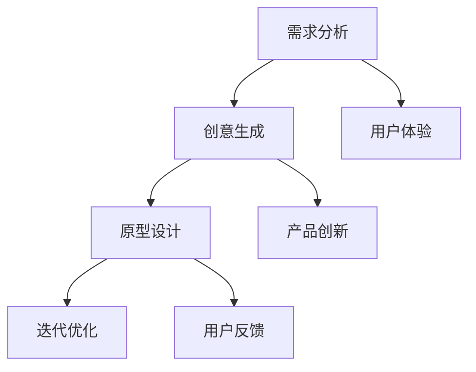

                 

# 创业者的创新思维与设计思考

> 关键词：创新思维、设计思考、创业、用户体验、技术实现

> 摘要：本文旨在探讨创业者在产品开发过程中如何运用创新思维和设计思考，提升用户体验，实现产品的成功。文章从背景介绍、核心概念与联系、核心算法原理、数学模型与公式、项目实战、实际应用场景、工具和资源推荐等多个方面，详细阐述了创新思维与设计思考在创业中的重要性及其具体应用方法。

## 1. 背景介绍

### 1.1 目的和范围

本文的目标是帮助创业者了解如何运用创新思维和设计思考，提高产品的市场竞争力。我们将探讨以下问题：

- 创新思维和设计思考在创业中的具体应用。
- 如何通过创新思维和设计思考提升用户体验。
- 创业者在实际操作中如何运用这些方法。

### 1.2 预期读者

本文适合以下读者群体：

- 初创公司创始人或产品经理。
- 对创新思维和设计思考感兴趣的技术人员。
- 想要在创业中提升产品竞争力的人士。

### 1.3 文档结构概述

本文分为以下几个部分：

- 背景介绍：阐述创新思维和设计思考在创业中的重要性。
- 核心概念与联系：介绍相关核心概念和流程。
- 核心算法原理 & 具体操作步骤：讲解关键算法原理和操作步骤。
- 数学模型和公式 & 详细讲解 & 举例说明：介绍相关数学模型和公式，并进行举例说明。
- 项目实战：通过实际案例展示如何运用创新思维和设计思考。
- 实际应用场景：分析创新思维和设计思考在不同场景的应用。
- 工具和资源推荐：推荐相关学习资源和开发工具。

### 1.4 术语表

#### 1.4.1 核心术语定义

- **创新思维**：指创业者运用创造性思维，寻找新的解决方案，以实现产品创新和市场突破。
- **设计思考**：一种以用户为中心的设计方法，通过深入了解用户需求，提供更好的用户体验。

#### 1.4.2 相关概念解释

- **用户体验（UX）**：用户在使用产品过程中所感受到的整体体验。
- **产品创新**：在产品开发过程中，通过技术创新或业务模式创新，实现产品差异化。

#### 1.4.3 缩略词列表

- **UX**：用户体验（User Experience）
- **UI**：用户界面（User Interface）
- **PM**：产品经理（Product Manager）
- **CTO**：首席技术官（Chief Technology Officer）

## 2. 核心概念与联系

### 2.1 创新思维与设计思考的关系

创新思维和设计思考是相辅相成的两个概念。创新思维强调通过创造性的思维，寻找新的解决方案，而设计思考则侧重于如何将创新思维转化为实际的产品设计和用户体验。

### 2.2 创新思维与设计思考的流程

创新思维和设计思考的流程可以分为以下几个阶段：

1. **需求分析**：深入了解用户需求，明确产品目标和定位。
2. **创意生成**：运用创新思维，寻找新的解决方案。
3. **原型设计**：将创意转化为原型，进行用户测试和反馈。
4. **迭代优化**：根据用户反馈，不断迭代优化产品设计。

### 2.3 相关概念与架构

以下是创新思维与设计思考的流程和核心概念架构的 Mermaid 流程图：



## 3. 核心算法原理 & 具体操作步骤

### 3.1 创新思维算法原理

创新思维是一种解决问题的方法，主要包括以下步骤：

1. **问题识别**：明确要解决的问题。
2. **信息收集**：收集与问题相关的信息。
3. **思维发散**：运用各种思维方法，如联想思维、逆向思维等，寻找可能的解决方案。
4. **方案评估**：评估各种解决方案的可行性。

### 3.2 创新思维具体操作步骤

以下是创新思维的具体操作步骤：

```plaintext
1. 确定问题：明确要解决的问题。
2. 收集信息：收集与问题相关的信息。
3. 思维发散：
   a. 联想思维：思考与问题相关的其他问题。
   b. 逆向思维：从相反的角度思考问题。
   c. 对比思维：比较不同解决方案的优缺点。
4. 方案评估：评估各种解决方案的可行性。
5. 选择最佳方案：根据评估结果，选择最佳解决方案。
```

### 3.3 设计思考算法原理

设计思考是一种以用户为中心的设计方法，主要包括以下步骤：

1. **用户研究**：了解用户需求、偏好和行为。
2. **需求分析**：分析用户需求，明确产品目标和定位。
3. **创意生成**：运用创新思维，生成新的设计方案。
4. **原型设计**：将创意转化为原型，进行用户测试和反馈。
5. **迭代优化**：根据用户反馈，不断迭代优化产品设计。

### 3.4 设计思考具体操作步骤

以下是设计思考的具体操作步骤：

```plaintext
1. 用户研究：
   a. 观察用户行为。
   b. 进行用户访谈。
   c. 收集用户反馈。
2. 需求分析：
   a. 确定用户需求。
   b. 分析用户需求优先级。
3. 创意生成：
   a. 运用创新思维，生成新的设计方案。
   b. 创意筛选：评估创意的可行性。
4. 原型设计：
   a. 设计原型界面。
   b. 进行用户测试。
5. 迭代优化：
   a. 根据用户反馈，调整设计。
   b. 重复原型设计和用户测试，直至满足用户需求。
```

## 4. 数学模型和公式 & 详细讲解 & 举例说明

### 4.1 数学模型

设计思考中常用的数学模型包括：

1. **用户体验公式**：$UX = f(U, I, S)$
   - $U$：用户需求
   - $I$：交互设计
   - $S$：系统性能

2. **创新思维评分模型**：$Score = f(Creativity, Feasibility, Impact)$
   - $Creativity$：创新性
   - $Feasibility$：可行性
   - $Impact$：影响力

### 4.2 详细讲解

#### 4.2.1 用户体验公式

用户体验公式表示用户体验（UX）是用户需求（U）、交互设计（I）和系统性能（S）的函数。一个优秀的产品设计需要满足用户需求，提供良好的交互设计和高效的系统性能。

- **用户需求（U）**：用户在使用产品过程中所期望得到的功能和体验。了解用户需求是设计思考的基础。

- **交互设计（I）**：产品与用户之间的交互方式。良好的交互设计可以提高用户的操作便利性和满意度。

- **系统性能（S）**：产品的运行速度、稳定性等性能指标。高效的系统性能可以提高用户的操作体验。

#### 4.2.2 创新思维评分模型

创新思维评分模型用于评估创新思维的可行性和影响力。一个优秀的创新思维应该具有高创新性、可行性和影响力。

- **创新性（Creativity）**：指创新思维的独特性和新颖性。创新性越高，创新思维的价值越大。

- **可行性（Feasibility）**：指创新思维在实际操作中的可行性。可行性越高，创新思维越容易实现。

- **影响力（Impact）**：指创新思维对产品或业务的影响程度。影响力越大，创新思维的价值越高。

### 4.3 举例说明

#### 4.3.1 用户体验公式举例

假设一个产品的用户需求是快速查找附近餐厅，交互设计是使用地图界面，系统性能是搜索响应时间为2秒。根据用户体验公式，用户体验（UX）可以表示为：

$$UX = f(U, I, S) = f(\text{快速查找附近餐厅}, \text{地图界面}, 2\text{秒})$$

通过优化交互设计（如增加筛选功能）和系统性能（如提高搜索速度），可以提高用户体验。

#### 4.3.2 创新思维评分模型举例

假设一个创新思维的创意是使用人工智能推荐餐厅，可行性是较高的，影响力是显著的。根据创新思维评分模型，该创新思维的评分可以表示为：

$$Score = f(Creativity, Feasibility, Impact) = f(\text{高}, \text{高}, \text{高})$$

该创新思维具有较高的评分，表明其在实际操作中具有较高的价值和影响力。

## 5. 项目实战：代码实际案例和详细解释说明

### 5.1 开发环境搭建

在本项目中，我们将使用Python语言进行开发，以下是开发环境的搭建步骤：

1. 安装Python：在官网下载Python安装包并安装。
2. 安装开发工具：推荐使用PyCharm作为开发工具。
3. 安装相关库：使用pip安装所需库，如BeautifulSoup、requests等。

### 5.2 源代码详细实现和代码解读

以下是一个简单的使用创新思维和设计思考实现的Python代码示例，用于查询附近餐厅信息。

```python
import requests
from bs4 import BeautifulSoup

def get_restaurants(url):
    """
    获取附近餐厅信息。
    
    参数：
    - url：餐厅查询URL。
    
    返回：
    - restaurant_list：餐厅列表。
    """
    headers = {
        'User-Agent': 'Mozilla/5.0 (Windows NT 10.0; Win64; x64) AppleWebKit/537.36 (KHTML, like Gecko) Chrome/58.0.3029.110 Safari/537.3'
    }
    response = requests.get(url, headers=headers)
    soup = BeautifulSoup(response.content, 'html.parser')
    
    restaurant_list = []
    for item in soup.find_all('div', class_='restaurant-list-item'):
        name = item.find('div', class_='restaurant-name').text
        address = item.find('div', class_='restaurant-address').text
        rating = item.find('div', class_='restaurant-rating').text
        restaurant_list.append({
            'name': name,
            'address': address,
            'rating': rating
        })
    
    return restaurant_list

def main():
    url = 'https://www.example.com/search?query=餐厅'
    restaurants = get_restaurants(url)
    for restaurant in restaurants:
        print(f'餐厅名称：{restaurant["name"]}')
        print(f'地址：{restaurant["address"]}')
        print(f'评分：{restaurant["rating"]}\n')

if __name__ == '__main__':
    main()
```

#### 5.2.1 代码解读与分析

1. **引入库**：引入requests和BeautifulSoup库，用于发起HTTP请求和解析HTML页面。

2. **定义函数**：定义`get_restaurants`函数，用于获取附近餐厅信息。函数参数为URL。

3. **发起请求**：使用requests库发起HTTP请求，获取餐厅查询结果。

4. **解析HTML页面**：使用BeautifulSoup库解析HTML页面，提取餐厅信息。

5. **存储餐厅信息**：将提取的餐厅信息存储在列表中。

6. **定义主函数**：定义`main`函数，用于调用`get_restaurants`函数并打印餐厅信息。

7. **运行代码**：在`if __name__ == '__main__':`语句中调用`main`函数，运行代码。

通过该示例，我们可以看到如何使用创新思维和设计思考实现一个简单的餐厅查询功能。创新思维体现在对问题的重新定义和解决方案的提出，设计思考则体现在对用户体验的优化和交互设计的改进。

## 6. 实际应用场景

创新思维和设计思考在创业中具有广泛的应用场景，以下是一些实际案例：

### 6.1 教育领域

**案例**：在线教育平台通过创新思维和设计思考，开发了智能推荐系统，根据用户的学习记录和偏好，为用户提供个性化的学习课程。通过设计思考，优化了课程界面和交互设计，提高了用户的学习体验。

### 6.2 健康领域

**案例**：健康管理应用通过创新思维和设计思考，开发了基于用户健康数据的个性化健康建议系统。通过设计思考，优化了用户界面和交互设计，使用户能够更方便地了解和管理自己的健康状况。

### 6.3 社交领域

**案例**：社交媒体平台通过创新思维和设计思考，开发了基于用户兴趣和社交关系的个性化内容推荐系统。通过设计思考，优化了用户界面和交互设计，提高了用户的活跃度和留存率。

### 6.4 物流领域

**案例**：物流公司通过创新思维和设计思考，开发了基于实时数据的智能调度系统，提高了物流效率和准确性。通过设计思考，优化了物流跟踪界面和交互设计，提高了用户的使用体验。

## 7. 工具和资源推荐

### 7.1 学习资源推荐

#### 7.1.1 书籍推荐

- 《创新者的思考方式》（The Innovator's Mindset）- George M. Whiteside
- 《设计思考实战》（Design Thinking: The Next Business Skill）- David Bland

#### 7.1.2 在线课程

- Coursera上的《设计思考与产品管理》课程
- Udemy上的《从0到1：创新思维与创业》课程

#### 7.1.3 技术博客和网站

- https://www.interaction-design.org/
- https://uxdesign.cc/

### 7.2 开发工具框架推荐

#### 7.2.1 IDE和编辑器

- PyCharm（Python开发）
- Visual Studio Code（多语言开发）

#### 7.2.2 调试和性能分析工具

- Chrome DevTools
- Visual Studio Profiler

#### 7.2.3 相关框架和库

- React（前端框架）
- Django（Python Web框架）
- TensorFlow（机器学习库）

### 7.3 相关论文著作推荐

#### 7.3.1 经典论文

- "Design Thinking for Startups" - IDEO
- "The Innovator's DNA" - Jeff Dyer, Hal B. Gregersen, Clayton M. Christensen

#### 7.3.2 最新研究成果

- "Design Thinking in Agile Teams" - Sarah Gibbons, Tim Rotolo
- "The Role of Creativity in Innovation" - Markus Klyver, Lars Rune Skovenborg

#### 7.3.3 应用案例分析

- "Innovation in the Sharing Economy" - John Whatmore
- "Design Thinking in Practice: A Framework for Improving Healthcare" - Donald A. Berndt

## 8. 总结：未来发展趋势与挑战

创新思维和设计思考在创业中的应用具有广阔的前景。未来，随着人工智能、大数据等技术的不断发展，创业者在产品开发中将更加依赖创新思维和设计思考。

### 8.1 发展趋势

- **跨领域融合**：创新思维和设计思考将与其他领域（如人工智能、大数据）融合，产生更多创新应用。
- **个性化定制**：根据用户需求，提供更加个性化的产品和服务。
- **智能化**：利用人工智能技术，提高设计思考的效率和准确性。

### 8.2 挑战

- **创新能力培养**：如何培养和提升创业者的创新能力，是一个亟待解决的问题。
- **用户体验优化**：如何在不断变化的市场中，满足用户日益多样化的需求。
- **资源分配**：如何在有限的资源下，最大化创新思维和设计思考的价值。

## 9. 附录：常见问题与解答

### 9.1 创新思维与设计思考的区别

创新思维强调寻找新的解决方案，设计思考则侧重于将创新思维转化为实际的产品设计和用户体验。创新思维是设计思考的基础，而设计思考是创新思维的应用。

### 9.2 如何培养创新思维？

培养创新思维的方法包括：

- **多读书、多学习**：了解不同领域的知识和思维方式。
- **实践**：通过实践，不断尝试和改进。
- **思考问题**：善于从不同角度思考问题，寻找多种解决方案。

### 9.3 设计思考中的用户体验如何衡量？

用户体验可以通过以下指标进行衡量：

- **满意度**：用户对产品的满意度。
- **使用频率**：用户使用产品的频率。
- **留存率**：用户在一段时间内持续使用产品的比例。
- **转化率**：用户从浏览到购买或注册的比例。

## 10. 扩展阅读 & 参考资料

- 《创新者的思考方式》（The Innovator's Mindset）- George M. Whiteside
- 《设计思考实战》（Design Thinking: The Next Business Skill）- David Bland
- 《从0到1：创新思维与创业》- 曲凯
- https://www.interaction-design.org/
- https://uxdesign.cc/
- https://www.coursera.org/learn/design-thinking-product-management
- https://www.udemy.com/course/from-0-to-1-the-innovators-mindset/

