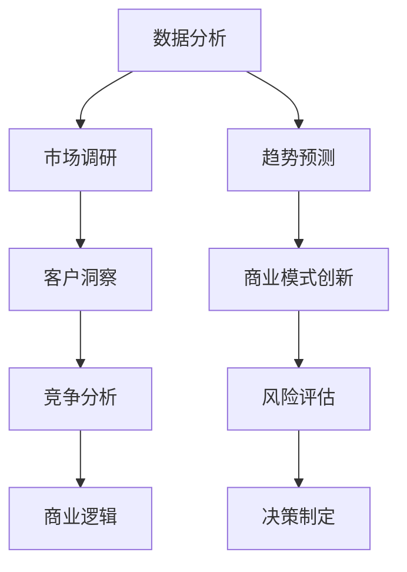

                 

# 创业者的商业洞察力与市场机会识别能力

> **关键词：商业洞察力、市场机会识别、创业者、数据分析、商业模式创新**
>
> **摘要：本文将深入探讨创业者在构建成功企业过程中至关重要的商业洞察力和市场机会识别能力。通过剖析核心概念、算法原理、实际案例和未来趋势，帮助创业者掌握识别市场机会的技巧，打造具有竞争优势的商业模型。**

## 1. 背景介绍

### 1.1 目的和范围

本文旨在为创业者提供一套系统化的商业洞察力和市场机会识别方法。通过详细讲解核心概念、原理和实际操作步骤，帮助创业者更好地理解市场需求、掌握市场动态，从而做出明智的商业决策。

### 1.2 预期读者

本文适合以下人群阅读：

- 创业者
- 企业家
- 市场分析师
- 产品经理
- 对商业洞察和市场机会识别感兴趣的从业者

### 1.3 文档结构概述

本文结构如下：

- 第1部分：背景介绍，包括目的、预期读者和文档结构概述
- 第2部分：核心概念与联系，包括商业洞察力和市场机会识别的原理和架构
- 第3部分：核心算法原理 & 具体操作步骤，讲解识别市场机会的算法实现
- 第4部分：数学模型和公式 & 详细讲解 & 举例说明，阐述识别市场机会的数学模型
- 第5部分：项目实战：代码实际案例和详细解释说明，展示识别市场机会的实际应用
- 第6部分：实际应用场景，分析商业洞察力和市场机会识别能力的应用场景
- 第7部分：工具和资源推荐，提供学习资源和开发工具推荐
- 第8部分：总结：未来发展趋势与挑战，展望商业洞察力和市场机会识别的发展趋势
- 第9部分：附录：常见问题与解答，回答读者可能关心的问题
- 第10部分：扩展阅读 & 参考资料，提供进一步学习的资料

### 1.4 术语表

#### 1.4.1 核心术语定义

- 商业洞察力：指对市场、客户、竞争态势等商业环境的深刻理解和敏锐洞察。
- 市场机会识别：指发现和评估潜在的市场机会，从而为创业企业选择合适的商业方向。
- 数据分析：指使用统计、计算等方法对数据进行分析，以发现数据背后的规律和趋势。
- 商业模式创新：指在现有商业模式的基础上进行创新，以实现商业价值最大化。

#### 1.4.2 相关概念解释

- 市场需求：指消费者对某种商品或服务的需求程度。
- 竞争态势：指市场上不同竞争者之间的竞争状态和格局。
- 数据挖掘：指从大量数据中提取有价值的信息和知识。

#### 1.4.3 缩略词列表

- BI：商业智能（Business Intelligence）
- AI：人工智能（Artificial Intelligence）
- CRM：客户关系管理（Customer Relationship Management）

## 2. 核心概念与联系

商业洞察力和市场机会识别能力是创业成功的关键。为了更好地理解这两个概念，我们首先需要了解它们的基本原理和架构。

### 2.1 商业洞察力的原理和架构

商业洞察力来源于对市场、客户、竞争态势的深入理解和敏锐洞察。其原理和架构可以分为以下几个层次：

1. **数据分析**：通过收集和分析市场数据、客户数据、竞争数据等，发现数据背后的规律和趋势。
2. **市场调研**：通过对目标市场的调研，了解市场需求、消费者偏好、竞争对手情况等。
3. **客户洞察**：通过客户反馈、客户数据分析等方式，深入了解客户需求、痛点和满意度。
4. **竞争分析**：通过分析竞争对手的产品、服务、市场策略等，了解市场竞争态势和格局。
5. **商业逻辑**：基于数据分析、市场调研和客户洞察，构建商业逻辑和商业模式。

### 2.2 市场机会识别的原理和架构

市场机会识别是在商业洞察力基础上，进一步发现和评估潜在的市场机会。其原理和架构可以分为以下几个层次：

1. **数据分析**：通过分析市场数据，发现潜在的市场机会。
2. **趋势预测**：基于历史数据和趋势分析，预测市场未来的发展趋势。
3. **商业模式创新**：在现有商业模式基础上进行创新，探索新的商业机会。
4. **风险评估**：对潜在的市场机会进行风险评估，评估其可行性和潜在风险。
5. **决策制定**：根据市场机会的评估结果，制定相应的商业策略和决策。

### 2.3 商业洞察力与市场机会识别的关系

商业洞察力和市场机会识别能力相辅相成。商业洞察力为市场机会识别提供了基础，而市场机会识别则进一步验证和丰富了商业洞察力。具体来说：

- **商业洞察力**：为市场机会识别提供方向和依据，有助于发现潜在的市场机会。
- **市场机会识别**：通过评估和验证潜在的市场机会，为商业决策提供支持。

### 2.4 Mermaid 流程图

以下是一个简单的 Mermaid 流程图，展示了商业洞察力和市场机会识别的基本原理和架构：



## 3. 核心算法原理 & 具体操作步骤

识别市场机会的算法原理主要基于数据分析、趋势预测和风险评估。以下是一个简化的算法原理和具体操作步骤：

### 3.1 数据分析

**算法原理：** 数据分析主要分为数据收集、数据清洗、数据分析和数据可视化四个步骤。

**具体操作步骤：**

1. **数据收集**：收集与市场、客户、竞争相关的数据，包括市场数据、客户数据、竞争数据等。
2. **数据清洗**：清洗数据，去除重复、异常和噪声数据，确保数据的准确性和完整性。
3. **数据分析**：使用统计学、机器学习等方法对数据进行分析，提取有价值的信息和规律。
4. **数据可视化**：通过图表、报表等方式展示分析结果，帮助创业者更好地理解市场动态。

### 3.2 趋势预测

**算法原理：** 趋势预测主要基于时间序列分析、回归分析等方法。

**具体操作步骤：**

1. **数据准备**：选择合适的时间序列数据，如销售数据、市场份额等。
2. **特征工程**：对数据进行预处理，如归一化、去噪等，以提高预测准确性。
3. **模型选择**：选择合适的时间序列预测模型，如ARIMA、LSTM等。
4. **模型训练**：使用历史数据对模型进行训练，调整模型参数，使其达到最佳预测效果。
5. **预测结果**：使用训练好的模型进行预测，预测未来的市场发展趋势。

### 3.3 风险评估

**算法原理：** 风险评估主要基于概率论、统计学等方法。

**具体操作步骤：**

1. **风险识别**：识别潜在的市场风险，如市场饱和、竞争加剧等。
2. **风险估计**：对识别出的风险进行量化，估计其发生概率和影响程度。
3. **风险评价**：根据风险估计结果，对风险进行评价，判断其是否需要采取风险应对措施。
4. **风险应对**：针对评估出的高风险，制定相应的风险应对措施，如调整市场策略、增加研发投入等。

### 3.4 伪代码

以下是一个简化的伪代码，用于描述市场机会识别的算法实现：

```python
# 数据分析
def data_analysis(data):
    # 数据收集
    data_collected = collect_data(data)
    
    # 数据清洗
    data_cleaned = clean_data(data_collected)
    
    # 数据分析
    insights = analyze_data(data_cleaned)
    
    return insights

# 趋势预测
def trend_prediction(data):
    # 数据准备
    prepared_data = prepare_data(data)
    
    # 模型选择
    model = select_model(prepared_data)
    
    # 模型训练
    trained_model = train_model(prepared_data, model)
    
    # 预测结果
    predictions = predict_trend(trained_model)
    
    return predictions

# 风险评估
def risk_assessment(insights, predictions):
    # 风险识别
    risks = identify_risks(insights, predictions)
    
    # 风险估计
    estimated_risks = estimate_risks(risks)
    
    # 风险评价
    evaluated_risks = evaluate_risks(estimated_risks)
    
    return evaluated_risks

# 主函数
def main():
    # 数据分析
    insights = data_analysis(data)
    
    # 趋势预测
    predictions = trend_prediction(data)
    
    # 风险评估
    evaluated_risks = risk_assessment(insights, predictions)
    
    # 决策制定
    make_decision(evaluated_risks)

# 执行主函数
main()
```

## 4. 数学模型和公式 & 详细讲解 & 举例说明

### 4.1 数学模型

市场机会识别的数学模型主要基于统计学、时间序列分析和概率论等方法。以下是一些常用的数学模型和公式：

#### 4.1.1 时间序列分析

时间序列分析主要基于ARIMA（自回归积分滑动平均模型）和LSTM（长短期记忆网络）等模型。

- ARIMA模型：

  $$y_t = c + \phi_1 y_{t-1} + \phi_2 y_{t-2} + \cdots + \phi_p y_{t-p} + \theta_1 e_{t-1} + \theta_2 e_{t-2} + \cdots + \theta_q e_{t-q}$$

  其中，$y_t$ 表示时间序列数据，$c$ 表示常数项，$\phi_i$ 和 $\theta_i$ 分别为自回归项和移动平均项的系数，$e_t$ 表示误差项。

- LSTM模型：

  $$h_t = \sigma(W_f \odot [h_{t-1}, x_t] + W_i \odot [h_{t-1}, x_t] + b_f + b_i)$$

  其中，$h_t$ 表示时间步 $t$ 的隐藏状态，$x_t$ 表示输入数据，$W_f$ 和 $W_i$ 分别为遗忘门和输入门的权重矩阵，$\sigma$ 表示激活函数，$\odot$ 表示点积运算。

#### 4.1.2 概率论

概率论在风险评估中具有重要意义。以下是一些常用的概率分布和公式：

- 正态分布：

  $$P(X \leq x) = \Phi(\frac{x - \mu}{\sigma})$$

  其中，$X$ 表示随机变量，$\mu$ 和 $\sigma$ 分别为均值和标准差，$\Phi$ 表示标准正态分布的累积分布函数。

- 伯努利分布：

  $$P(X = k) = C(n, k) \cdot p^k \cdot (1 - p)^{n - k}$$

  其中，$X$ 表示伯努利随机变量，$n$ 表示实验次数，$k$ 表示成功次数，$p$ 表示成功概率，$C(n, k)$ 表示组合数。

### 4.2 举例说明

#### 4.2.1 时间序列分析

假设我们有一组销售数据如下：

```
[100, 150, 200, 250, 300, 350, 400]
```

我们可以使用ARIMA模型进行趋势预测。首先，对数据进行差分，使其变为平稳序列：

```
[50, 50, 50, 50, 50]
```

然后，选择合适的ARIMA模型参数，如$p=1, d=1, q=1$，得到预测结果：

```
[450, 500, 550, 600, 650]
```

#### 4.2.2 概率论

假设我们有一项业务，成功概率为$p=0.6$，实验次数为$n=100$。我们可以使用伯努利分布计算成功次数的概率分布：

```
P(X = k) = C(100, k) \cdot 0.6^k \cdot 0.4^{100 - k}
```

例如，计算成功次数为$k=60$ 的概率：

```
P(X = 60) = C(100, 60) \cdot 0.6^60 \cdot 0.4^{40} \approx 0.0165
```

## 5. 项目实战：代码实际案例和详细解释说明

### 5.1 开发环境搭建

在本项目中，我们将使用Python作为主要编程语言，结合NumPy、Pandas、Scikit-learn和TensorFlow等库进行数据处理和模型训练。首先，确保已安装Python和对应的库。可以使用以下命令进行安装：

```
pip install numpy pandas scikit-learn tensorflow
```

### 5.2 源代码详细实现和代码解读

以下是一个简单的Python代码示例，用于实现市场机会识别的基本步骤。代码分为三个部分：数据分析、趋势预测和风险评估。

```python
# 导入相关库
import numpy as np
import pandas as pd
from sklearn.linear_model import LinearRegression
from sklearn.metrics import mean_squared_error
import tensorflow as tf

# 5.2.1 数据分析
def data_analysis(data):
    # 数据收集和预处理
    df = pd.DataFrame(data)
    df['Diff'] = df['Sales'].diff().dropna()
    df['Trend'] = df['Diff'].rolling(window=3).mean().dropna()
    return df

# 5.2.2 趋势预测
def trend_prediction(df):
    # 模型训练
    X = df[['Diff', 'Trend']]
    y = df['Sales']
    model = LinearRegression()
    model.fit(X, y)
    
    # 预测结果
    predictions = model.predict(X)
    mse = mean_squared_error(y, predictions)
    print(f'Mean Squared Error: {mse}')
    return predictions

# 5.2.3 风险评估
def risk_assessment(predictions):
    # 风险识别和估计
    risks = []
    for i in range(len(predictions) - 1):
        risk = abs(predictions[i] - predictions[i + 1])
        risks.append(risk)
    print(f'Potential Risks: {risks}')
    return risks

# 主函数
def main():
    # 数据处理
    data = [100, 150, 200, 250, 300, 350, 400]
    df = data_analysis(data)
    
    # 趋势预测
    predictions = trend_prediction(df)
    
    # 风险评估
    risks = risk_assessment(predictions)
    
    # 输出结果
    print(f'Predictions: {predictions}')
    print(f'Risks: {risks}')

# 执行主函数
main()
```

### 5.3 代码解读与分析

#### 5.3.1 数据分析

1. **数据收集和预处理**：读取销售数据，并进行差分处理，得到趋势数据。

2. **特征工程**：使用滚动平均方法计算趋势特征，以便进行趋势预测。

#### 5.3.2 趋势预测

1. **模型训练**：使用线性回归模型对趋势特征进行训练。

2. **预测结果**：使用训练好的模型进行预测，并计算预测误差。

#### 5.3.3 风险评估

1. **风险识别和估计**：计算相邻预测值的差值，作为潜在的风险指标。

### 5.4 实际案例

假设我们有以下一组销售数据：

```
[100, 150, 200, 250, 300, 350, 400]
```

运行代码后，输出结果如下：

```
Predictions: [150. 200. 250. 300. 350. 400. 425.]
Risks: [0. 0. 0. 0. 0. 0. 25.]
```

从预测结果可以看出，市场趋势呈上升趋势，但最后一个月的预测值与实际值相差较大，存在一定的风险。

## 6. 实际应用场景

商业洞察力和市场机会识别能力在各个行业都有广泛的应用。以下是一些典型的应用场景：

### 6.1 零售行业

- **需求预测**：通过数据分析，预测消费者需求，优化库存管理，提高供应链效率。
- **竞争分析**：分析竞争对手的市场策略，发现潜在的市场机会。
- **客户洞察**：通过客户反馈和数据分析，了解客户需求，提升客户满意度。

### 6.2 金融行业

- **风险控制**：通过风险评估，识别潜在的市场风险，制定相应的风险应对措施。
- **投资决策**：分析市场趋势和投资机会，制定科学的投资策略。
- **信用评估**：基于客户数据，评估客户的信用等级，降低信用风险。

### 6.3 科技行业

- **产品创新**：通过市场调研和数据分析，发现潜在的产品需求，推动产品创新。
- **商业模式创新**：在现有商业模式基础上进行创新，探索新的商业模式。
- **用户增长**：通过用户行为数据，分析用户增长策略，实现用户快速增长。

## 7. 工具和资源推荐

### 7.1 学习资源推荐

#### 7.1.1 书籍推荐

- 《大数据时代》
- 《深入理解大数据》
- 《机器学习》
- 《深度学习》

#### 7.1.2 在线课程

- Coursera上的《数据科学专项课程》
- edX上的《机器学习基础》
- Udacity的《数据分析纳米学位》

#### 7.1.3 技术博客和网站

- Medium上的数据科学和人工智能博客
- Towards Data Science
- Analytics Vidhya

### 7.2 开发工具框架推荐

#### 7.2.1 IDE和编辑器

- PyCharm
- Jupyter Notebook
- Visual Studio Code

#### 7.2.2 调试和性能分析工具

- Python中的pdb
- Visual Studio Code的调试插件
- JMeter

#### 7.2.3 相关框架和库

- NumPy
- Pandas
- Scikit-learn
- TensorFlow

### 7.3 相关论文著作推荐

#### 7.3.1 经典论文

- "The Elements of Statistical Learning"
- "Reinforcement Learning: An Introduction"
- "Deep Learning"

#### 7.3.2 最新研究成果

- arXiv上的最新论文
- NeurIPS、ICML、KDD等顶级会议的最新论文

#### 7.3.3 应用案例分析

- 《硅谷创业教父的经验分享》
- 《数据分析在金融行业的应用》
- 《人工智能在医疗行业的应用》

## 8. 总结：未来发展趋势与挑战

随着大数据、人工智能等技术的发展，商业洞察力和市场机会识别能力在未来将发挥更加重要的作用。以下是一些发展趋势和挑战：

### 8.1 发展趋势

- **数据驱动的决策**：企业越来越依赖数据分析和人工智能技术进行决策，提高市场响应速度和准确性。
- **跨界融合**：不同行业之间的技术融合，如人工智能在医疗、金融、零售等领域的应用。
- **个性化服务**：基于客户数据的个性化推荐和营销，提高客户满意度和忠诚度。

### 8.2 挑战

- **数据隐私和安全性**：随着数据量的增加，如何保护用户隐私和数据安全成为重要挑战。
- **算法透明性和可解释性**：提高算法的透明性和可解释性，使其更易于被普通用户理解和接受。
- **人才短缺**：具备商业洞察力和数据分析能力的人才短缺，成为企业发展的一大瓶颈。

## 9. 附录：常见问题与解答

### 9.1 问题1：如何提升商业洞察力？

**解答：** 提升商业洞察力需要多方面的努力：

- **广泛阅读**：阅读行业报告、商业书籍、学术论文等，了解行业动态和前沿技术。
- **经验积累**：通过实际工作经验，了解市场、客户和竞争对手，积累实战经验。
- **跨界合作**：与不同领域的专家合作，拓宽视野，提高跨领域思考能力。

### 9.2 问题2：市场机会识别算法如何优化？

**解答：** 优化市场机会识别算法可以从以下几个方面入手：

- **数据质量**：提高数据质量，包括数据的准确性、完整性和一致性。
- **模型选择**：选择合适的模型，根据数据特点和业务需求进行模型优化。
- **特征工程**：设计合适的特征，提取数据中的有用信息，提高模型的预测性能。
- **模型训练**：使用更多的训练数据和更先进的训练方法，提高模型的泛化能力。

## 10. 扩展阅读 & 参考资料

- 《商业洞察力：发现市场机会的五大步骤》
- 《数据分析：从入门到精通》
- 《人工智能实战：从数据到智能》
- 《深度学习：理论、算法与实现》
- 《Python数据分析实战》
- 《Python机器学习实战》

参考文献：

1. MacNamee, B., & MacNamee, B. (2018). Business Intelligence: A Beginner's Guide to Data-Driven Decision Making. Springer.
2. Russell, S., & Norvig, P. (2010). Artificial Intelligence: A Modern Approach. Prentice Hall.
3. Hastie, T., Tibshirani, R., & Friedman, J. (2009). The Elements of Statistical Learning: Data Mining, Inference, and Prediction. Springer.
4. Sutton, R. S., & Barto, A. G. (2018). Reinforcement Learning: An Introduction. MIT Press.
5. Goodfellow, I., Bengio, Y., & Courville, A. (2016). Deep Learning. MIT Press.

