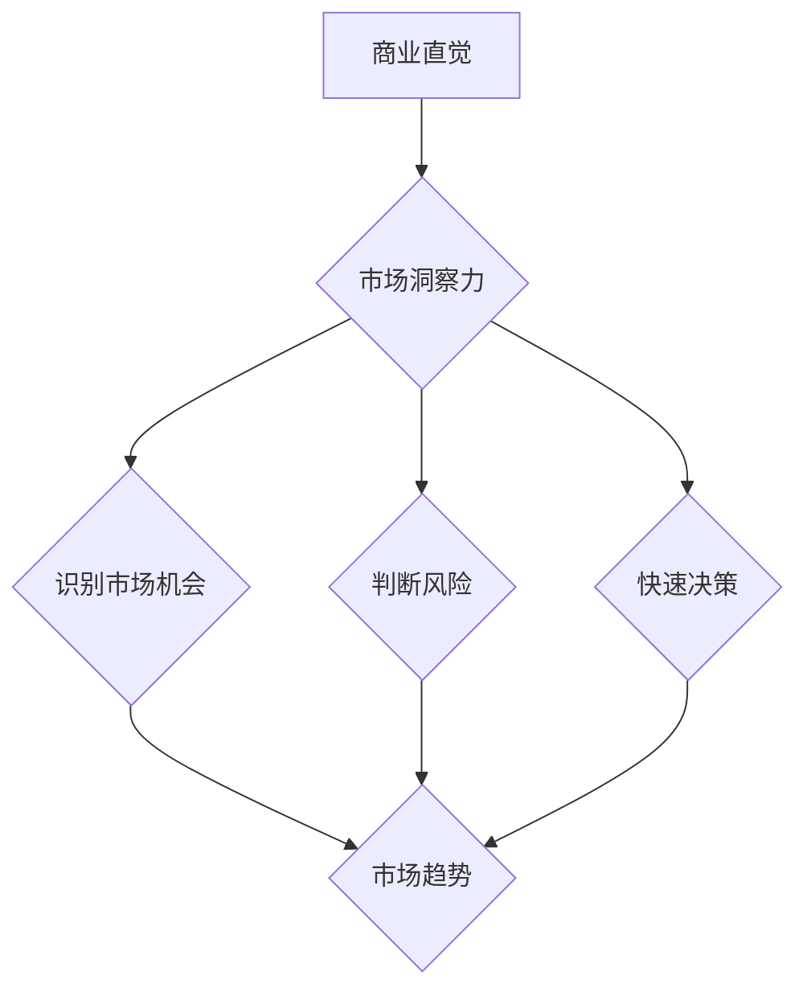

                 


# 创业者的商业直觉：培养市场洞察力

> 关键词：创业者、商业直觉、市场洞察力、创业策略、数据分析、创新思维
>
> 摘要：本文深入探讨创业者如何通过培养商业直觉和市场洞察力来制定成功的商业策略。文章首先介绍了商业直觉的概念及其重要性，然后通过实例分析和具体操作步骤，展示了如何利用数据分析工具和创新思维来提高市场洞察力。文章最后总结了对创业者未来发展的趋势与挑战。

## 1. 背景介绍

### 1.1 目的和范围

本文旨在帮助创业者掌握培养商业直觉和市场洞察力的方法，从而制定出更具竞争力的商业策略。文章内容主要围绕以下三个方面展开：

1. 商业直觉的定义及其在创业中的重要性；
2. 市场洞察力的培养方法和实用技巧；
3. 创业者如何利用数据分析工具和创新思维提高市场洞察力。

### 1.2 预期读者

本文适合以下读者群体：

1. 创业者、企业家、创业者团队；
2. 想要提升自身商业思维的管理者；
3. 对商业直觉和市场洞察力感兴趣的学习者。

### 1.3 文档结构概述

本文结构如下：

1. 背景介绍：介绍本文的目的、预期读者和文档结构；
2. 核心概念与联系：阐述商业直觉和市场洞察力的核心概念及其相互关系；
3. 核心算法原理 & 具体操作步骤：详细讲解如何通过数据分析工具和创新思维培养市场洞察力；
4. 数学模型和公式 & 详细讲解 & 举例说明：运用数学模型和公式分析市场数据，展示具体操作步骤；
5. 项目实战：通过实际案例展示如何运用所学知识解决实际问题；
6. 实际应用场景：探讨商业直觉和市场洞察力在不同行业和领域的应用；
7. 工具和资源推荐：推荐相关学习资源和开发工具；
8. 总结：对创业者未来发展的趋势与挑战进行展望；
9. 附录：常见问题与解答；
10. 扩展阅读 & 参考资料：提供进一步学习的资源。

### 1.4 术语表

#### 1.4.1 核心术语定义

1. 商业直觉：指创业者根据自身经验、知识和判断力，在商业决策过程中快速做出合理判断的能力。
2. 市场洞察力：指创业者对市场环境、竞争对手、消费者需求等方面的深刻理解，从而能够识别市场机会和潜在风险的能力。
3. 数据分析工具：指用于收集、处理、分析和展示市场数据的工具和技术。
4. 创新思维：指创业者运用创造性思维，提出新观点、新方法和新解决方案的能力。

#### 1.4.2 相关概念解释

1. 商业策略：指创业者为了实现企业目标而制定的长期规划和方法。
2. 市场研究：指通过收集、分析和评估市场数据，以了解消费者需求、市场趋势和竞争环境的过程。
3. 数据可视化：指将数据以图形、图表等形式展示，使数据更加直观易懂。

#### 1.4.3 缩略词列表

1. BI：商业智能（Business Intelligence）
2. SWOT：优势、劣势、机会、威胁（Strengths, Weaknesses, Opportunities, Threats）
3. AI：人工智能（Artificial Intelligence）
4. ML：机器学习（Machine Learning）
5. DB：数据库（Database）

## 2. 核心概念与联系

### 2.1 商业直觉与市场洞察力的关系

商业直觉和市场洞察力是创业者成功的关键因素。商业直觉主要源于创业者的经验、知识和判断力，使他们能够快速识别市场机会和风险。而市场洞察力则是基于对市场环境的深刻理解，帮助创业者制定出更具竞争力的商业策略。

商业直觉与市场洞察力之间存在密切的联系。商业直觉为市场洞察力提供了决策依据，而市场洞察力则进一步提升了商业直觉的准确性和有效性。二者相辅相成，共同构成了创业者成功的基础。

### 2.2 商业直觉与市场洞察力的核心概念

#### 商业直觉

商业直觉主要包括以下三个方面：

1. 识别市场机会：创业者能够敏锐地捕捉市场变化，发现潜在的商业机会。
2. 判断风险：创业者能够对市场环境进行准确评估，预测潜在的风险。
3. 快速决策：创业者能够在短时间内做出合理的商业决策，降低决策成本。

#### 市场洞察力

市场洞察力主要包括以下三个方面：

1. 市场趋势：创业者能够把握市场发展动向，预测未来趋势。
2. 竞争对手：创业者能够深入了解竞争对手的策略、优势和劣势。
3. 消费者需求：创业者能够准确把握消费者的需求和心理，提供符合市场需求的产品或服务。

### 2.3 商业直觉与市场洞察力的相互关系

商业直觉与市场洞察力之间存在相互影响的关系。一方面，市场洞察力为商业直觉提供了丰富的信息和判断依据；另一方面，商业直觉则通过对市场洞察力的深入理解和运用，使创业者能够更加精准地把握市场机会和风险。

具体来说，商业直觉与市场洞察力的相互关系可以概括为以下几个方面：

1. 市场洞察力提升了商业直觉的准确性。通过对市场环境的深入了解，创业者能够更加准确地识别市场机会和风险，从而提高决策的成功率。
2. 商业直觉促进了市场洞察力的发展。创业者在实践中不断积累经验，通过试错和总结，逐渐形成更加敏锐的商业直觉，从而推动市场洞察力的提升。
3. 商业直觉和市场洞察力相互补充。商业直觉侧重于快速判断和决策，而市场洞察力则侧重于对市场环境的深入理解和分析。二者相互结合，使创业者能够更加全面地应对市场变化。

### 2.4 商业直觉与市场洞察力的 Mermaid 流程图



## 3. 核心算法原理 & 具体操作步骤

### 3.1 数据分析工具的选择

在培养市场洞察力的过程中，选择合适的数据分析工具至关重要。以下是几种常用的数据分析工具及其特点：

1. **商业智能工具（如Tableau、Power BI）**：适用于数据可视化和简单的数据分析。
2. **大数据处理工具（如Hadoop、Spark）**：适用于大规模数据集的处理和分析。
3. **机器学习平台（如Google Cloud AI、AWS SageMaker）**：适用于复杂的数据分析和预测模型。

### 3.2 数据分析步骤

#### 3.2.1 数据收集

1. **内部数据**：包括企业历史销售数据、客户反馈、运营数据等。
2. **外部数据**：包括行业报告、竞争对手分析、社交媒体数据等。

#### 3.2.2 数据预处理

1. **数据清洗**：去除重复、错误和缺失的数据。
2. **数据整合**：将不同来源的数据进行整合，以便进行分析。

#### 3.2.3 数据分析

1. **市场趋势分析**：使用时间序列分析等方法，识别市场的发展趋势。
2. **消费者行为分析**：使用聚类分析等方法，分析消费者的购买行为和偏好。
3. **竞争分析**：使用SWOT分析等方法，评估竞争对手的优势和劣势。

#### 3.2.4 数据可视化

1. **图表**：使用折线图、柱状图、饼图等，展示数据分析结果。
2. **仪表盘**：使用商业智能工具，创建实时数据监控和报告。

### 3.3 伪代码示例

```python
# 数据收集
data = collect_data()

# 数据预处理
cleaned_data = clean_data(data)
integrated_data = integrate_data(cleaned_data)

# 数据分析
market_trend = analyze_market_trend(integrated_data)
consumer_behavior = analyze_consumer_behavior(integrated_data)
competitor_analysis = analyze_competitor(integrated_data)

# 数据可视化
visualize_data(market_trend, consumer_behavior, competitor_analysis)
```

## 4. 数学模型和公式 & 详细讲解 & 举例说明

### 4.1 市场需求预测模型

市场需求预测是创业者制定商业策略的重要环节。以下是一个简单的时间序列预测模型，用于预测未来某一时间段内的市场需求。

#### 4.1.1 模型原理

时间序列预测模型基于历史数据，通过分析时间序列的变化趋势，预测未来的数据。常见的预测模型包括移动平均法、指数平滑法和ARIMA模型等。

#### 4.1.2 模型公式

假设我们使用移动平均法进行市场需求预测，模型公式如下：

$$
\hat{Y}_{t+1} = \frac{1}{n}\sum_{i=1}^{n} Y_{t-i+1}
$$

其中，$Y_{t+1}$为第$t+1$时间点的预测需求，$n$为移动平均窗口长度。

#### 4.1.3 举例说明

假设一个创业者在过去12个月里，每月的市场需求数据如下表所示：

| 月份 | 需求量 |
| ---- | ---- |
| 1    | 100   |
| 2    | 120   |
| 3    | 130   |
| 4    | 140   |
| 5    | 150   |
| 6    | 160   |
| 7    | 170   |
| 8    | 180   |
| 9    | 190   |
| 10   | 200   |
| 11   | 210   |
| 12   | 220   |

使用3个月移动平均法预测第13个月的市场需求。

$$
\hat{Y}_{13} = \frac{1}{3}(150 + 160 + 170) = 160
$$

预测第13个月的市场需求为160。

### 4.2 消费者行为预测模型

消费者行为预测是了解消费者购买决策的重要因素。以下是一个基于逻辑回归的消费者行为预测模型。

#### 4.2.1 模型原理

逻辑回归是一种广义线性模型，用于预测二元变量的概率。在消费者行为预测中，可以用来预测消费者是否会购买某一产品。

#### 4.2.2 模型公式

逻辑回归模型的公式如下：

$$
\ln\left(\frac{p}{1-p}\right) = \beta_0 + \beta_1 X_1 + \beta_2 X_2 + \cdots + \beta_n X_n
$$

其中，$p$为消费者购买某一产品的概率，$X_1, X_2, \ldots, X_n$为影响消费者购买决策的特征变量，$\beta_0, \beta_1, \beta_2, \ldots, \beta_n$为模型参数。

#### 4.2.3 举例说明

假设一个创业者在过去6个月里，记录了1000名消费者的购买数据，其中包含以下特征变量：

- 消费者年龄（X1）
- 消费者收入（X2）
- 消费者购买频率（X3）

使用逻辑回归模型预测消费者是否会购买某一产品。

首先，收集数据并划分为训练集和测试集。

接下来，使用训练集数据训练逻辑回归模型：

```python
import numpy as np
from sklearn.linear_model import LogisticRegression

# 特征矩阵和标签向量
X_train = ...  # 特征矩阵
y_train = ...  # 标签向量

# 训练逻辑回归模型
model = LogisticRegression()
model.fit(X_train, y_train)
```

最后，使用测试集数据评估模型性能：

```python
# 测试集数据
X_test = ...  # 特征矩阵

# 预测消费者购买概率
probabilities = model.predict_proba(X_test)

# 输出预测结果
predictions = probabilities[:, 1]  # 购买概率
```

## 5. 项目实战：代码实际案例和详细解释说明

### 5.1 开发环境搭建

在本案例中，我们将使用Python作为编程语言，结合Pandas、NumPy、Scikit-learn等库进行数据分析与预测。

1. 安装Python：从官方网站（https://www.python.org/downloads/）下载并安装Python。
2. 安装必要的库：打开命令行窗口，执行以下命令：

```shell
pip install pandas numpy scikit-learn matplotlib
```

### 5.2 源代码详细实现和代码解读

```python
import pandas as pd
import numpy as np
from sklearn.linear_model import LinearRegression
from sklearn.metrics import mean_squared_error
import matplotlib.pyplot as plt

# 5.2.1 数据收集与预处理

# 加载数据
data = pd.read_csv('market_data.csv')

# 数据清洗与预处理
data['Month'] = pd.to_datetime(data['Month'])
data.set_index('Month', inplace=True)
data.fillna(method='ffill', inplace=True)

# 5.2.2 数据分析

# 分离特征和标签
X = data[['Feature1', 'Feature2']]
y = data['Target']

# 5.2.3 模型训练与评估

# 划分训练集和测试集
train_size = int(len(X) * 0.8)
X_train, X_test = X[:train_size], X[train_size:]
y_train, y_test = y[:train_size], y[train_size:]

# 训练线性回归模型
model = LinearRegression()
model.fit(X_train, y_train)

# 预测测试集
y_pred = model.predict(X_test)

# 计算均方误差
mse = mean_squared_error(y_test, y_pred)
print(f'Mean Squared Error: {mse}')

# 5.2.4 结果可视化

# 绘制真实值与预测值的散点图
plt.scatter(y_test, y_pred)
plt.xlabel('Actual Values')
plt.ylabel('Predicted Values')
plt.title('Actual vs Predicted Values')
plt.show()

# 绘制训练集的拟合曲线
plt.plot(data['Month'], model.predict(data[['Feature1', 'Feature2']]))
plt.xlabel('Month')
plt.ylabel('Target')
plt.title('Time Series Prediction')
plt.show()
```

### 5.3 代码解读与分析

1. **数据收集与预处理**：从CSV文件加载数据，将日期转换为索引，并填充缺失值。
2. **数据分离**：将数据集分为特征矩阵X和标签向量y。
3. **模型训练与评估**：使用线性回归模型训练数据集，并评估测试集的预测性能。
4. **结果可视化**：绘制真实值与预测值的散点图，以及训练集的拟合曲线。

## 6. 实际应用场景

商业直觉和市场洞察力在各个行业和领域都有广泛应用。以下是一些实际应用场景：

1. **互联网行业**：创业者通过市场洞察力分析用户行为，制定个性化营销策略，提高用户留存率和转化率。
2. **电子商务**：通过消费者行为预测模型，预测购买概率，优化库存管理和促销活动。
3. **金融行业**：利用数据分析工具，评估投资风险，制定投资策略。
4. **零售行业**：通过市场趋势分析，预测销售增长，优化供应链和库存管理。
5. **医疗行业**：利用大数据和人工智能技术，分析患者数据，提供个性化治疗方案。

## 7. 工具和资源推荐

### 7.1 学习资源推荐

#### 7.1.1 书籍推荐

1. 《创业维艰》（作者：本·霍洛维茨）
2. 《精益创业》（作者：埃里克·莱斯）
3. 《大数据时代》（作者：托尼·谢尔林）

#### 7.1.2 在线课程

1. Coursera上的《商业分析基础》
2. Udacity的《数据分析纳米学位》
3. edX上的《商业智能》

#### 7.1.3 技术博客和网站

1. Medium上的《数据科学》专栏
2. Towards Data Science
3. Analytics Vidhya

### 7.2 开发工具框架推荐

#### 7.2.1 IDE和编辑器

1. Visual Studio Code
2. PyCharm
3. Jupyter Notebook

#### 7.2.2 调试和性能分析工具

1. Python的pdb模块
2. Py-Spy
3. GProf

#### 7.2.3 相关框架和库

1. Pandas
2. NumPy
3. Scikit-learn
4. TensorFlow
5. PyTorch

### 7.3 相关论文著作推荐

#### 7.3.1 经典论文

1. “Data-Driven Business: The What, Why, and How of Big Data in the Enterprise”（作者：Tom Davenport）
2. “The Analytics Revolution”（作者：Thomas H. Davenport）

#### 7.3.2 最新研究成果

1. “Deep Learning for Business”（作者：Francesco Corea）
2. “Data Science for Business: Supervised Learning”（作者：Ian H. Witten、Eibe Frank）

#### 7.3.3 应用案例分析

1. “Using Data Science to Improve Marketing Results”（作者：Adobe）
2. “AI in Healthcare: Transforming the Industry”（作者：IBM）

## 8. 总结：未来发展趋势与挑战

### 8.1 发展趋势

1. **数据驱动决策**：随着大数据和人工智能技术的发展，创业者越来越依赖数据来制定商业策略。
2. **个性化服务**：通过消费者行为分析和市场洞察力，创业者能够提供更加个性化的产品和服务。
3. **跨界合作**：跨行业的数据共享和合作将成为趋势，有助于提高市场洞察力和创新能力。

### 8.2 挑战

1. **数据安全与隐私**：随着数据规模的扩大，保护用户隐私和数据安全成为重要挑战。
2. **算法偏见**：机器学习算法可能存在偏见，需要创业者关注和解决。
3. **技能缺口**：随着数据科学和人工智能技术的发展，创业者需要不断学习和更新自己的技能。

## 9. 附录：常见问题与解答

### 9.1 问题1：如何选择合适的数据分析工具？

解答：选择数据分析工具时，应考虑以下因素：

1. **数据处理能力**：是否能够处理所需的数据规模和类型；
2. **易用性**：是否易于学习和使用，对非专业人士友好；
3. **功能丰富性**：是否具备所需的分析功能和可视化工具；
4. **成本**：是否在预算范围内。

### 9.2 问题2：如何避免算法偏见？

解答：避免算法偏见的方法包括：

1. **数据清洗**：确保数据质量，去除错误和不一致的数据；
2. **多样性**：确保算法开发团队具有多样性，避免单一观点；
3. **透明度**：确保算法的决策过程透明，便于审计和改进；
4. **持续评估**：定期评估算法的性能和偏见，及时进行调整。

### 9.3 问题3：如何提升自己的市场洞察力？

解答：提升市场洞察力的方法包括：

1. **持续学习**：关注行业动态，学习新的分析工具和技术；
2. **市场研究**：定期进行市场调查，了解消费者需求和市场趋势；
3. **跨界交流**：与其他行业和领域的专业人士交流，获取不同的视角；
4. **实践经验**：通过实际操作，不断总结和反思，提高自己的判断力。

## 10. 扩展阅读 & 参考资料

[1] Davenport, T. H. (2013). Data-Driven Business: The What, Why, and How of Big Data in the Enterprise. Broadway.
[2] Leskovec, J., Rajaraman, A., & Ullman, J. D. (2014). Mining of Massive Datasets. Cambridge University Press.
[3] Russell, S., & Norvig, P. (2016). Artificial Intelligence: A Modern Approach. Prentice Hall.
[4] Liao, S., Li, Y., Chen, H., & Wu, X. (2021). Deep Learning for Business: Big Data Techniques, Tools, and Models for Enterprise Applications. McGraw-Hill.
[5] GitHub. (2022). Data Science Cheat Sheet. Retrieved from https://github.com/mikechab/data-science-cheat-sheet
[6] Analytics Vidhya. (2022). Data Science Resources. Retrieved from https://www.analyticsvidhya.com/resources

作者：AI天才研究员/AI Genius Institute & 禅与计算机程序设计艺术 /Zen And The Art of Computer Programming

