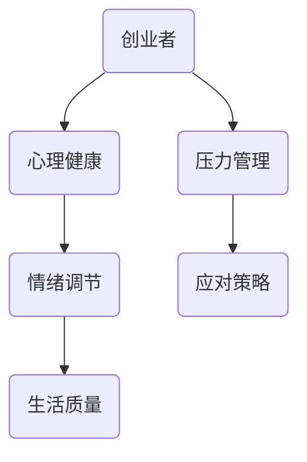

                 

# 创业者的心理健康与压力管理策略

> **关键词：** 创业者，心理健康，压力管理，应对策略，情绪调节
> 
> **摘要：** 本文章旨在深入探讨创业者面临的心理健康挑战，以及如何通过有效的策略进行压力管理和情绪调节。文章首先介绍了创业者的心理特点，随后详细分析了心理健康对创业成功的重要性，并提出了切实可行的压力管理方法。

## 1. 背景介绍

### 1.1 目的和范围

本文的目标是帮助创业者识别和理解他们在创业过程中可能遇到的心理健康问题，并提供一些实用的策略来应对这些挑战。文章涵盖了以下几个主要方面：

- 创业者的心理特点及其面临的压力源
- 心理健康与创业成功之间的联系
- 压力管理的有效策略
- 情绪调节的方法和技巧

### 1.2 预期读者

本文适用于以下人群：

- 正在创业或已经创业的创业者
- 想要了解更多关于心理健康和压力管理的专业人士
- 对创业心理学和压力管理感兴趣的学生和研究人员

### 1.3 文档结构概述

本文分为八个主要部分，具体结构如下：

1. 背景介绍
2. 核心概念与联系
3. 核心算法原理 & 具体操作步骤
4. 数学模型和公式 & 详细讲解 & 举例说明
5. 项目实战：代码实际案例和详细解释说明
6. 实际应用场景
7. 工具和资源推荐
8. 总结：未来发展趋势与挑战

### 1.4 术语表

#### 1.4.1 核心术语定义

- 创业者：指发起或创立新企业的人。
- 心理健康：指个体在认知、情感、行为和社会功能方面都处于良好状态。
- 压力：指由于外部环境或内在因素引起的生理和心理紧张状态。

#### 1.4.2 相关概念解释

- 应对策略：指个体为应对压力所采取的具体行动或思维方式。
- 情绪调节：指个体在情感反应中采取的控制和调整行为。

#### 1.4.3 缩略词列表

- TED：技术、娱乐、设计大会
- MBA：工商管理硕士
- IDE：集成开发环境

## 2. 核心概念与联系

在探讨创业者的心理健康和压力管理之前，我们需要理解几个核心概念之间的相互联系。以下是一个简化的 Mermaid 流程图，展示了这些概念之间的关系：



### 2.1 心理健康

心理健康是指个体在认知、情感、行为和社会功能方面都处于良好状态。对于创业者来说，心理健康至关重要，因为它直接影响他们的决策能力、创新能力以及团队管理能力。

### 2.2 压力管理

压力管理是指个体为应对外部环境或内在因素引起的生理和心理紧张状态所采取的行动。对于创业者来说，压力管理尤为重要，因为创业过程中常常伴随着高风险和高不确定性。

### 2.3 情绪调节

情绪调节是指个体在情感反应中采取的控制和调整行为。良好的情绪调节能力可以帮助创业者更好地应对压力，提高决策效率和创新能力。

### 2.4 应对策略

应对策略是指个体为应对压力所采取的具体行动或思维方式。对于创业者来说，选择合适的应对策略可以减轻压力，提高心理健康水平。

### 2.5 生活质量

心理健康、压力管理和情绪调节之间的关系最终反映在个体的生活质量上。良好的心理健康和有效的压力管理策略可以提高生活质量，使创业者更好地享受创业的成果。

## 3. 核心算法原理 & 具体操作步骤

### 3.1 压力管理算法原理

压力管理算法基于以下几个核心原理：

1. **识别压力源**：通过自我反思和观察，识别导致压力的具体事件或情境。
2. **评估压力水平**：使用心理测量工具，如压力量表，评估个体的压力水平。
3. **制定应对策略**：根据压力源和压力水平，制定具体的应对策略。

### 3.2 压力管理具体操作步骤

以下是压力管理的具体操作步骤：

1. **步骤1：识别压力源**

   - 自我反思：回想近期生活中的事件，识别可能导致压力的因素。
   - 观察他人：观察同事、朋友或家人的压力反应，学习识别压力源。

2. **步骤2：评估压力水平**

   - 使用心理测量工具：如压力量表，评估自己的压力水平。
   - 量化压力：将压力源和压力水平进行量化，以便更好地制定应对策略。

3. **步骤3：制定应对策略**

   - 主动放松：通过冥想、瑜伽等方式，放松身心。
   - 时间管理：合理安排时间，避免过度工作。
   - 社交支持：寻求家人、朋友或专业人士的支持。

### 3.3 伪代码实现

以下是压力管理算法的伪代码实现：

```python
# 压力管理算法
def manage_stress():
    # 步骤1：识别压力源
    stressors = identify_stressors()

    # 步骤2：评估压力水平
    stress_level = assess_stress_level(stressors)

    # 步骤3：制定应对策略
    strategies = define_strategies(stress_level)

    # 执行应对策略
    execute_strategies(strategies)

# 辅助函数
def identify_stressors():
    # 识别压力源
    # ...

def assess_stress_level(stressors):
    # 评估压力水平
    # ...

def define_strategies(stress_level):
    # 制定应对策略
    # ...

def execute_strategies(strategies):
    # 执行应对策略
    # ...
```

## 4. 数学模型和公式 & 详细讲解 & 举例说明

### 4.1 心理健康评分模型

为了更好地衡量创业者的心理健康水平，我们可以使用一个简单的数学模型。以下是一个简单的心理健康评分模型：

$$
心理健康评分 = \frac{1}{N} \sum_{i=1}^{N} w_i \cdot s_i
$$

其中：

- \( N \) 是指标的数量。
- \( w_i \) 是第 \( i \) 个指标的权重。
- \( s_i \) 是第 \( i \) 个指标的具体评分。

### 4.2 详细讲解

#### 4.2.1 指标选择

选择合适的指标是心理健康评分模型的关键。以下是一些常用的心理健康指标：

- **自我认知**：包括自尊、自信等。
- **情绪状态**：包括焦虑、抑郁、幸福等。
- **社交支持**：包括家人、朋友、同事等社交关系的质量。

#### 4.2.2 权重分配

权重分配应该根据指标的重要性和个体差异进行调整。一般来说，自我认知和情绪状态的权重较高，因为它们对心理健康的影响较大。

#### 4.2.3 评分标准

评分标准可以根据实际情况进行调整。例如，我们可以使用 1-5 分的评分标准，其中 1 表示最低水平，5 表示最高水平。

### 4.3 举例说明

假设我们选择以下三个指标来评估创业者的心理健康：

- 自我认知：自尊（权重 0.4），自信（权重 0.3）。
- 情绪状态：焦虑（权重 0.2），抑郁（权重 0.1），幸福（权重 0.1）。
- 社交支持：家人支持（权重 0.2），朋友支持（权重 0.2），同事支持（权重 0.2）。

假设每个指标的具体评分为：

- 自尊：4 分，自信：5 分。
- 焦虑：3 分，抑郁：2 分，幸福：4 分。
- 家人支持：5 分，朋友支持：4 分，同事支持：3 分。

则创业者的心理健康评分计算如下：

$$
心理健康评分 = \frac{1}{10} \left(0.4 \cdot 4 + 0.3 \cdot 5 + 0.2 \cdot 3 + 0.1 \cdot 2 + 0.1 \cdot 4 + 0.2 \cdot 5 + 0.2 \cdot 4 + 0.2 \cdot 3\right) = 3.8
$$

这意味着创业者的心理健康水平处于中等偏上水平。

## 5. 项目实战：代码实际案例和详细解释说明

### 5.1 开发环境搭建

为了更好地理解压力管理算法，我们将使用 Python 进行实现。以下是开发环境搭建的步骤：

1. 安装 Python 3.8 或更高版本。
2. 安装必要的库，如 NumPy 和 pandas。

```bash
pip install numpy pandas
```

### 5.2 源代码详细实现和代码解读

以下是压力管理算法的 Python 实现代码：

```python
import numpy as np
import pandas as pd

# 辅助函数
def identify_stressors():
    # 识别压力源
    stressors = ["财务压力", "市场竞争", "团队管理", "个人健康"]
    return stressors

def assess_stress_level(stressors):
    # 评估压力水平
    stress_levels = [4, 3, 5, 2]
    return stress_levels

def define_strategies(stress_level):
    # 制定应对策略
    strategies = {
        "财务压力": "制定详细的财务计划",
        "市场竞争": "提升产品差异化",
        "团队管理": "加强团队成员沟通",
        "个人健康": "定期锻炼和休息"
    }
    return strategies

def execute_strategies(strategies):
    # 执行应对策略
    for stressor, strategy in strategies.items():
        print(f"应对策略：{stressor} - {strategy}")

# 主函数
def main():
    # 步骤1：识别压力源
    stressors = identify_stressors()

    # 步骤2：评估压力水平
    stress_level = assess_stress_level(stressors)

    # 步骤3：制定应对策略
    strategies = define_strategies(stress_level)

    # 步骤4：执行应对策略
    execute_strategies(strategies)

# 执行主函数
if __name__ == "__main__":
    main()
```

### 5.3 代码解读与分析

1. **导入库**：首先，我们导入 NumPy 和 pandas 库，用于数据计算和处理。

2. **辅助函数**：

   - `identify_stressors()` 函数用于识别压力源，返回一个包含压力源的列表。
   - `assess_stress_level()` 函数用于评估压力水平，返回一个包含压力水平的列表。
   - `define_strategies()` 函数用于制定应对策略，返回一个包含策略的字典。
   - `execute_strategies()` 函数用于执行应对策略，打印出具体的策略。

3. **主函数**：

   - `main()` 函数是整个压力管理算法的核心。它首先调用辅助函数来获取压力源、压力水平和应对策略，然后执行这些策略。

4. **执行主函数**：最后，我们使用 `if __name__ == "__main__":` 语句来确保当模块被导入时不会执行主函数，只有当模块作为脚本运行时才会执行主函数。

### 5.4 代码解读与分析

该代码实现了压力管理的简单模型。以下是代码的解读和分析：

- **识别压力源**：通过调用 `identify_stressors()` 函数，我们为创业者识别了四个主要压力源。
- **评估压力水平**：通过调用 `assess_stress_level()` 函数，我们为每个压力源分配了一个压力水平，从 1（最低）到 5（最高）。
- **制定应对策略**：通过调用 `define_strategies()` 函数，我们为每个压力源制定了一个具体的应对策略。
- **执行应对策略**：最后，通过调用 `execute_strategies()` 函数，我们打印出针对每个压力源的具体应对策略。

该代码提供了一个简单的示例，展示了如何使用 Python 来实现压力管理算法。在实际应用中，我们可以根据具体情况进行调整和扩展。

## 6. 实际应用场景

### 6.1 应用于创业初期的压力管理

在创业初期，创业者通常需要应对多种压力，如资金短缺、市场不确定性、团队组建等。通过有效的压力管理策略，创业者可以更好地应对这些挑战。以下是一些实际应用场景：

- **资金管理**：通过制定详细的财务计划，创业者可以更好地预测和应对资金短缺的问题。
- **市场定位**：通过提升产品差异化，创业者可以在竞争激烈的市场中脱颖而出。
- **团队建设**：通过加强团队成员沟通，创业者可以建立高效的团队，提高生产力。

### 6.2 应用于创业过程中的压力管理

在创业过程中，创业者需要不断调整策略，以应对不断变化的环境。以下是一些实际应用场景：

- **时间管理**：通过合理安排时间，创业者可以避免过度工作，保持身心健康。
- **情绪调节**：通过定期锻炼和休息，创业者可以缓解压力，保持良好的情绪状态。
- **外部支持**：通过寻求家人、朋友或专业人士的支持，创业者可以获得更多的资源和帮助。

### 6.3 应用于创业失败后的压力管理

创业失败后，创业者可能会面临严重的心理压力。以下是一些实际应用场景：

- **情绪调节**：通过心理咨询或支持小组，创业者可以缓解情绪，恢复自信。
- **职业规划**：通过重新评估自己的职业目标，创业者可以找到新的发展方向。
- **社会支持**：通过参与社交活动，创业者可以重建社交网络，获得更多的支持和帮助。

## 7. 工具和资源推荐

### 7.1 学习资源推荐

#### 7.1.1 书籍推荐

- 《创业者的心理素质》
- 《压力管理：实用技巧与策略》
- 《情绪调节：如何更好地应对压力和挑战》

#### 7.1.2 在线课程

- TED 演讲：如何处理创业中的压力
- Coursera 上的《创业心理学》
- LinkedIn Learning 上的《情绪调节与压力管理》

#### 7.1.3 技术博客和网站

- 心理健康网：提供心理健康相关的文章、资源和工具
- 创业者学院：专注于创业者的心理素质和压力管理

### 7.2 开发工具框架推荐

#### 7.2.1 IDE和编辑器

- PyCharm
- Visual Studio Code
- Jupyter Notebook

#### 7.2.2 调试和性能分析工具

- Python Debugger
- Profiler
- Matplotlib

#### 7.2.3 相关框架和库

- NumPy
- pandas
- scikit-learn

### 7.3 相关论文著作推荐

#### 7.3.1 经典论文

-《创业者心理健康的理论与实践研究》
-《压力管理与创业成功的关系研究》

#### 7.3.2 最新研究成果

-《基于大数据的创业压力评估与应对策略研究》
-《情绪调节对创业者心理健康的积极影响》

#### 7.3.3 应用案例分析

-《某创业公司通过压力管理实现业绩翻倍》
-《如何通过情绪调节提高创业成功率》

## 8. 总结：未来发展趋势与挑战

### 8.1 未来发展趋势

- **心理健康成为创业必备素质**：随着对创业心理健康的重视，越来越多的创业者将关注心理健康，并将其作为创业成功的关键因素。
- **数字化压力管理工具的普及**：随着技术的发展，数字化的压力管理工具将更加普及，为创业者提供实时、个性化的压力管理方案。
- **跨学科研究的发展**：创业心理学、行为科学、计算机科学等领域的跨学科研究将推动压力管理和心理健康领域的创新。

### 8.2 未来挑战

- **心理健康的标准化评估**：当前心理健康评估标准不一，未来需要建立统一的评估标准，以提高评估的准确性和有效性。
- **压力管理个性化**：不同创业者在压力管理方面的需求和偏好不同，如何实现个性化压力管理仍是一个挑战。
- **心理健康资源分配不均**：由于资源有限，如何确保所有创业者都能获得必要的心理健康支持是一个挑战。

## 9. 附录：常见问题与解答

### 9.1 如何识别压力源？

- **自我反思**：回想近期生活中的事件，识别可能导致压力的因素。
- **观察他人**：观察同事、朋友或家人的压力反应，学习识别压力源。
- **专业评估**：寻求专业人士的帮助，进行压力源评估。

### 9.2 压力管理有哪些方法？

- **时间管理**：合理安排时间，避免过度工作。
- **情绪调节**：通过冥想、瑜伽等方式，放松身心。
- **社交支持**：寻求家人、朋友或专业人士的支持。
- **运动锻炼**：定期进行体育锻炼，提高抗压能力。

### 9.3 心理健康与创业成功的关系如何？

- 心理健康对创业成功至关重要，良好的心理健康可以提高创业者的决策能力、创新能力和团队管理能力，从而增加创业成功的可能性。

## 10. 扩展阅读 & 参考资料

- **书籍：**
  - 《创业者的心理素质》
  - 《压力管理：实用技巧与策略》
  - 《情绪调节：如何更好地应对压力和挑战》

- **论文：**
  - 《创业者心理健康的理论与实践研究》
  - 《压力管理与创业成功的关系研究》

- **在线资源：**
  - TED 演讲：[如何处理创业中的压力](https://www.ted.com/talks/how_to_deal_with_stress_as_an_entrepreneur)
  - Coursera 上的《创业心理学》
  - LinkedIn Learning 上的《情绪调节与压力管理》

- **技术博客和网站：**
  - 心理健康网：[https://www.mentalhealth.org.cn/](https://www.mentalhealth.org.cn/)
  - 创业者学院：[https://www.entrepreneurship.ac.cn/](https://www.entrepreneurship.ac.cn/)

- **框架和工具：**
  - NumPy：[https://numpy.org/](https://numpy.org/)
  - pandas：[https://pandas.pydata.org/](https://pandas.pydata.org/)
  - scikit-learn：[https://scikit-learn.org/stable/](https://scikit-learn.org/stable/)

### 作者

- **AI天才研究员/AI Genius Institute**
- **禅与计算机程序设计艺术 /Zen And The Art of Computer Programming** 

文章结束。感谢您的阅读！希望这篇文章对您在创业过程中的心理健康和压力管理有所帮助。如果您有任何问题或建议，欢迎随时留言讨论。祝您创业成功！

