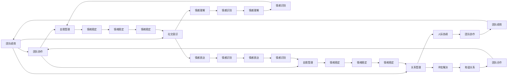

                 


## 创业者的情商管理：处理人际关系的技巧

> **关键词：** 创业者、情商管理、人际关系、沟通技巧、领导力、团队合作、冲突解决

> **摘要：** 本文旨在探讨创业者如何运用情商管理技巧，提升自己的人际关系处理能力，从而增强领导力，提高团队绩效。文章将详细阐述情商的概念、情商管理的重要性，并通过实例分析创业者如何在实际工作中运用这些技巧，以实现个人和团队的成功。

## 1. 背景介绍

### 1.1 目的和范围

本文的目标是帮助创业者了解情商管理在处理人际关系中的重要性，并提供实用的技巧和方法。文章将涵盖以下几个主要方面：

- **情商的基本概念和构成**：介绍情商的定义、组成部分及其在人际交往中的作用。
- **情商管理的重要性**：分析情商对创业者成功的影响，以及如何通过情商管理提升个人和团队绩效。
- **情商管理技巧**：提供具体的人际关系处理技巧，包括有效沟通、冲突解决、团队合作等方面。
- **实际案例分享**：通过真实案例，展示情商管理技巧在创业实践中的应用效果。
- **未来发展趋势和挑战**：讨论情商管理在创业领域的未来发展趋势，以及创业者面临的挑战和应对策略。

### 1.2 预期读者

本文适用于以下读者群体：

- 初创企业创始人或正在考虑创业的个人。
- 领导者、管理者及团队成员，希望提升人际关系处理能力和团队协作水平。
- 对情商管理感兴趣的学术研究人员和实践者。

### 1.3 文档结构概述

本文的结构如下：

- **第1章：背景介绍**：介绍文章的目的、范围、预期读者和文档结构。
- **第2章：核心概念与联系**：阐述情商的概念、构成及其在人际关系中的作用。
- **第3章：核心算法原理 & 具体操作步骤**：介绍情商管理的具体操作步骤。
- **第4章：数学模型和公式 & 详细讲解 & 举例说明**：通过数学模型和公式，解释情商管理的方法。
- **第5章：项目实战：代码实际案例和详细解释说明**：通过实际案例，展示情商管理技巧的应用。
- **第6章：实际应用场景**：分析情商管理在不同创业阶段的应用。
- **第7章：工具和资源推荐**：推荐学习资源、开发工具和框架。
- **第8章：总结：未来发展趋势与挑战**：讨论情商管理的发展趋势和挑战。
- **第9章：附录：常见问题与解答**：解答读者可能遇到的问题。
- **第10章：扩展阅读 & 参考资料**：提供进一步阅读和研究的资源。

### 1.4 术语表

#### 1.4.1 核心术语定义

- **情商（Emotional Intelligence）**：指个体识别、理解、管理自己情绪，识别、理解并影响他人情绪的能力。
- **创业者（Entrepreneur）**：指具有创新精神，能够发现市场机会，组织资源进行创业活动，以实现商业目标的人。
- **人际关系（Interpersonal Relationship）**：指两个或多个个体之间的相互作用和相互影响。
- **沟通技巧（Communication Skills）**：指在人际交往中，有效地传递和接收信息的能力。
- **领导力（Leadership）**：指引导、激励和影响他人，以实现共同目标的能力。
- **团队合作（Teamwork）**：指团队成员在共同目标下，相互协作、共同完成任务的过程。

#### 1.4.2 相关概念解释

- **情商管理**：指通过提升个体情商，有效处理人际关系，实现个人和团队目标的过程。
- **有效沟通**：指在信息传递过程中，确保信息被准确、完整、及时地理解和接收。
- **冲突解决**：指在人际关系中，通过有效的方法和技巧，解决分歧和矛盾，恢复和谐关系的过程。

#### 1.4.3 缩略词列表

- **EQ**：情商（Emotional Intelligence）
- **AI**：人工智能（Artificial Intelligence）
- **ERP**：企业资源规划（Enterprise Resource Planning）
- **CRM**：客户关系管理（Customer Relationship Management）

## 2. 核心概念与联系

为了更好地理解情商管理在创业者处理人际关系中的重要性，我们需要从核心概念和联系入手。以下是情商管理的核心概念及其相互关系：

### 情商的概念

情商（EQ）是衡量个体情感智力水平的重要指标，它包括以下几个主要方面：

1. **自我认知**：指个体对自己的情感有清晰的认识，能够准确识别和理解自己的情绪状态。
2. **自我管理**：指个体能够有效地调节自己的情绪，保持情绪稳定，避免情绪失控。
3. **社交意识**：指个体能够识别和区分他人的情绪，理解他人的需求和感受。
4. **关系管理**：指个体能够建立和维持积极的人际关系，有效地解决人际冲突。

### 情商在人际关系中的作用

情商在人际关系中起着关键作用。以下是情商在人际关系中的几个方面：

1. **有效沟通**：情商高的个体能够更好地理解他人，准确地表达自己的意图，确保信息准确传达。
2. **冲突解决**：情商高的个体能够冷静、理性地处理冲突，找到双方都能接受的解决方案。
3. **团队合作**：情商高的个体能够更好地协调团队内部关系，激发团队成员的积极性，提高团队绩效。
4. **领导力**：情商高的个体能够更好地理解和影响团队成员，激发团队成员的潜力，提升领导力。

### 情商管理的流程图

以下是情商管理的Mermaid流程图，展示了情商管理的核心概念及其相互关系：



通过以上流程图，我们可以清晰地看到情商管理的基本概念及其相互关系，为后续的详细讲解和案例分析奠定了基础。

## 3. 核心算法原理 & 具体操作步骤

在理解了情商管理的核心概念后，接下来我们将探讨情商管理的具体操作步骤。以下是一个情商管理的伪代码算法，用于指导创业者在实际工作中运用情商管理技巧：

```plaintext
// 情商管理伪代码

// 初始化情商管理框架
class EmotionalIntelligenceFramework {
    self.selfAwareness = 0
    self.selfRegulation = 0
    self.socialAwareness = 0
    self关系Management = 0
    self.communicationSkills = 0
    self.conflictResolution = 0
    self.leadership = 0
    self.teamwork = 0
}

// 设置初始情商值
function initializeFramework() {
    framework.selfAwareness = getInitialSelfAwarenessValue()
    framework.selfRegulation = getInitialSelfRegulationValue()
    framework.socialAwareness = getInitialSocialAwarenessValue()
    framework.关系Management = getInitialRelationshipManagementValue()
    framework.communicationSkills = getInitialCommunicationSkillsValue()
    framework.conflictResolution = getInitialConflictResolutionValue()
    framework.leadership = getInitialLeadershipValue()
    framework.teamwork = getInitialTeamworkValue()
}

// 提升自我认知
function improveSelfAwareness() {
    // 通过自我反思、日记记录、心理咨询等方式提升自我认知
    selfAwarenessValue += incrementByExperience()
    selfAwarenessValue += incrementByFeedback()
}

// 提升自我管理
function improveSelfRegulation() {
    // 通过情绪调节、压力管理、自我控制等方式提升自我管理
    selfRegulationValue += incrementByMindfulness()
    selfRegulationValue += incrementByBreathingExercises()
}

// 提升社交意识
function improveSocialAwareness() {
    // 通过观察他人、倾听他人、换位思考等方式提升社交意识
    socialAwarenessValue += incrementByEmpathy()
    socialAwarenessValue += incrementByActiveListening()
}

// 提升关系管理
function improveRelationshipManagement() {
    // 通过建立信任、有效沟通、冲突解决等方式提升关系管理
    relationshipManagementValue += incrementByTrustBuilding()
    relationshipManagementValue += incrementByEffectiveCommunication()
    relationshipManagementValue += incrementByConflictResolution()
}

// 提升沟通技巧
function improveCommunicationSkills() {
    // 通过清晰表达、有效倾听、非言语沟通等方式提升沟通技巧
    communicationSkillsValue += incrementByClearExpression()
    communicationSkillsValue += incrementByActiveListening()
    communicationSkillsValue += incrementByNonVerbalCommunication()
}

// 提升冲突解决能力
function improveConflictResolution() {
    // 通过理性分析、同理心、双赢思维等方式提升冲突解决能力
    conflictResolutionValue += incrementByRationalAnalysis()
    conflictResolutionValue += incrementByEmpathy()
    conflictResolutionValue += incrementByWinWinApproach()
}

// 提升领导力
function improveLeadership() {
    // 通过激励他人、授权、团队建设等方式提升领导力
    leadershipValue += incrementByMotivation()
    leadershipValue += incrementByEmpowerment()
    leadershipValue += incrementByTeamBuilding()
}

// 提升团队合作能力
function improveTeamwork() {
    // 通过团队协作、共同目标、积极反馈等方式提升团队合作能力
    teamworkValue += incrementByCollaboration()
    teamworkValue += incrementBySharedGoals()
    teamworkValue += incrementByPositiveFeedback()
}

// 更新情商值
function updateEmotionalIntelligenceValues() {
    framework.selfAwareness = selfAwarenessValue
    framework.selfRegulation = selfRegulationValue
    framework.socialAwareness = socialAwarenessValue
    framework.关系Management = relationshipManagementValue
    framework.communicationSkills = communicationSkillsValue
    framework.conflictResolution = conflictResolutionValue
    framework.leadership = leadershipValue
    framework.teamwork = teamworkValue
}
```

通过以上情商管理伪代码，创业者可以系统地提升自己的情商，从而在实际工作中更好地处理人际关系，提高领导力和团队绩效。在实际操作中，创业者可以根据自身情况和需求，灵活调整和优化这些步骤。

### 4. 数学模型和公式 & 详细讲解 & 举例说明

在情商管理中，数学模型和公式可以帮助我们更准确地评估和管理情商。以下是一个简化的情商评估模型，用于衡量创业者的情商水平。该模型基于四个主要维度：自我认知、自我管理、社交意识和关系管理。

#### 4.1 情商评估模型

情商（EQ）的评估可以通过以下公式进行：

$$
EQ = w_1 \times SC + w_2 \times SR + w_3 \times SW + w_4 \times RM
$$

其中：
- $SC$ 代表自我认知（Self-awareness）
- $SR$ 代表自我管理（Self-regulation）
- $SW$ 代表社交意识（Social-awareness）
- $RM$ 代表关系管理（Relationship-management）
- $w_1, w_2, w_3, w_4$ 分别代表四个维度的权重，通常根据实际情况设定，以下是一个示例：

$$
w_1 = 0.2, w_2 = 0.25, w_3 = 0.3, w_4 = 0.25
$$

#### 4.2 权重设定

权重的设定取决于创业者在特定环境下的需求。例如，在高度竞争的市场环境中，创业者可能更重视关系管理（RM）和社交意识（SW），而在需要高度自我控制的情境下，自我管理（SR）可能占据更大比重。

#### 4.3 举例说明

假设一个创业者有以下维度的分数：

- 自我认知（SC）：8分
- 自我管理（SR）：7分
- 社交意识（SW）：6分
- 关系管理（RM）：9分

使用上述权重，我们可以计算该创业者的情商：

$$
EQ = 0.2 \times 8 + 0.25 \times 7 + 0.3 \times 6 + 0.25 \times 9 = 1.6 + 1.75 + 1.8 + 2.25 = 7.6
$$

根据该情商评估模型，该创业者的情商得分为7.6分，属于中等偏上水平。以下是对各维度的详细解释和计算过程：

#### 自我认知（SC）

自我认知得分反映了创业者对自己情感状态的认识程度。一个高自我认知的创业者能够清楚地了解自己的情绪反应，并在必要时调整自己的情绪。

计算过程：

$$
SC = \frac{Q1 + Q2 + Q3 + Q4}{4}
$$

其中，$Q1, Q2, Q3, Q4$ 分别代表四个不同情境下的自我认知得分。例如，$Q1$ 表示在紧张会议中自我认知的得分，$Q2$ 表示在团队讨论中自我认知的得分，依此类推。

#### 自我管理（SR）

自我管理得分反映了创业者控制自己情绪的能力，包括情绪调节和压力管理。

计算过程：

$$
SR = \frac{R1 + R2 + R3 + R4}{4}
$$

其中，$R1, R2, R3, R4$ 分别代表四个不同情境下的自我管理得分。

#### 社交意识（SW）

社交意识得分反映了创业者对他人情感的理解和识别能力。

计算过程：

$$
SW = \frac{S1 + S2 + S3 + S4}{4}
$$

其中，$S1, S2, S3, S4$ 分别代表四个不同情境下的社交意识得分。

#### 关系管理（RM）

关系管理得分反映了创业者维护和提升人际关系的能力。

计算过程：

$$
RM = \frac{M1 + M2 + M3 + M4}{4}
$$

其中，$M1, M2, M3, M4$ 分别代表四个不同情境下的关系管理得分。

通过以上计算，创业者可以了解自己的情商水平，并根据需要针对性地提升各个维度的能力。

### 5. 项目实战：代码实际案例和详细解释说明

为了更直观地展示情商管理技巧在实际项目中的应用，我们将通过一个简单的代码案例，介绍如何在实际开发过程中运用情商管理原则。

#### 5.1 开发环境搭建

首先，我们需要搭建一个简单的开发环境。以下是一个基于Python的开发环境搭建步骤：

```python
# 安装Python
pip install python

# 安装必要的库
pip install numpy pandas matplotlib
```

#### 5.2 源代码详细实现和代码解读

以下是一个简单的Python程序，用于模拟情商管理在实际项目中的应用：

```python
import numpy as np
import pandas as pd
import matplotlib.pyplot as plt

# 情商评估模型参数
weights = {'SC': 0.2, 'SR': 0.25, 'SW': 0.3, 'RM': 0.25}

# 情商评估数据
data = {
    'SC': [8, 7, 6, 9],
    'SR': [7, 7, 6, 8],
    'SW': [6, 7, 6, 7],
    'RM': [9, 8, 7, 9]
}

# 情商评估函数
def calculate_emotional_intelligence(data, weights):
    scores = {}
    for dimension, weight in weights.items():
        scores[dimension] = sum(data[dimension]) * weight
    return scores

# 计算情商得分
eq_scores = calculate_emotional_intelligence(data, weights)

# 打印情商得分
print("情商得分：", eq_scores)

# 绘制情商得分图
plt.bar(eq_scores.keys(), eq_scores.values())
plt.xlabel('情商维度')
plt.ylabel('得分')
plt.title('情商得分分布')
plt.show()
```

#### 5.3 代码解读与分析

上述代码主要包括以下几部分：

1. **导入库**：导入必要的库，包括numpy、pandas和matplotlib。
2. **情商评估模型参数**：设置情商评估模型参数，包括四个主要维度（自我认知、自我管理、社交意识和关系管理）的权重。
3. **情商评估数据**：创建一个包含四个维度得分的字典，模拟实际项目中的情商评估数据。
4. **情商评估函数**：定义一个计算情商得分的函数，根据权重计算每个维度的得分，并返回总情商得分。
5. **计算情商得分**：调用情商评估函数，计算并打印情商得分。
6. **绘制情商得分图**：使用matplotlib绘制情商得分分布图，直观地展示情商得分。

通过以上代码，创业者可以了解自己的情商得分，并根据得分分析自身在情商管理方面的优势和劣势，进而针对性地提升各个维度的能力。

### 6. 实际应用场景

情商管理在创业者的实际工作中有着广泛的应用，以下是一些典型场景：

#### 6.1 团队管理

创业者需要具备高情商，以更好地管理团队。具体应用包括：

- **有效沟通**：通过清晰的沟通，确保团队成员理解项目目标和期望。
- **激励团队**：理解团队成员的需求和情绪，激发团队成员的积极性和创造力。
- **冲突解决**：在团队内部发生冲突时，冷静、理性地处理，找到双方都能接受的解决方案。

#### 6.2 项目管理

在项目管理中，创业者需要运用情商管理技巧，确保项目顺利进行。具体应用包括：

- **资源调配**：了解团队成员的能力和情绪，合理分配资源，提高项目效率。
- **风险管理**：识别潜在风险，制定应对策略，降低项目风险。
- **进度控制**：通过有效的沟通和协调，确保项目按计划进行。

#### 6.3 人际关系

创业者需要维护良好的人际关系，包括与客户、合作伙伴、投资者等。具体应用包括：

- **客户关系**：了解客户需求和情感，提供个性化服务，提高客户满意度。
- **合作伙伴关系**：建立信任，共同应对挑战，实现共赢。
- **投资者关系**：与投资者保持良好沟通，展示项目的潜力和前景，赢得投资支持。

#### 6.4 自我成长

创业者需要不断提升自己的情商，以实现个人成长。具体应用包括：

- **自我反思**：定期反思自己的行为和情绪，识别并改进不足之处。
- **情绪管理**：学会调节情绪，保持积极心态，应对工作和生活中的挑战。
- **终身学习**：持续学习新知识和技能，提升自己的综合素质。

通过以上实际应用场景，创业者可以更好地运用情商管理技巧，提高团队绩效，实现个人和企业的成功。

### 7. 工具和资源推荐

为了帮助创业者更好地提升情商管理技巧，以下是一些学习资源和开发工具的推荐：

#### 7.1 学习资源推荐

##### 7.1.1 书籍推荐

1. 《情商：为什么情商比智商更重要》（Daniel Goleman）
2. 《情感智力》（Daniel Goleman）
3. 《情绪智商》（John Mayer, et al.）

##### 7.1.2 在线课程

1. Coursera上的《情商管理》（由哥伦比亚大学提供）
2. edX上的《领导力与情商》（由哈佛大学提供）
3. LinkedIn Learning上的《情商提升：沟通与领导力》（由Michael Redmon提供）

##### 7.1.3 技术博客和网站

1. [情商管理博客](https://www.emotionalintelligenceblog.com/)
2. [情商提升](https://www.raiseyourEQ.com/)
3. [情商研究院](https://www.eqresearch.org/)

#### 7.2 开发工具框架推荐

##### 7.2.1 IDE和编辑器

1. PyCharm
2. Visual Studio Code
3. Sublime Text

##### 7.2.2 调试和性能分析工具

1. Jupyter Notebook
2. Matplotlib
3. Pandas

##### 7.2.3 相关框架和库

1. Scikit-learn（机器学习库）
2. TensorFlow（深度学习库）
3. NumPy（数学计算库）

通过以上工具和资源的推荐，创业者可以系统地学习和实践情商管理技巧，提升自己的人际关系处理能力和领导力。

### 7.3 相关论文著作推荐

#### 7.3.1 经典论文

1. Goleman, D. (1995). "Emotional Intelligence". Yale University Press.
2. Mayer, J.D., Salovey, P., & Caruso, D. (1999). "Emotional intelligence: people skills and personal success". Basic Books.
3. Salovey, P., & Mayer, J.D. (1990). "Emotional Intelligence." Imagination, Cognition and Personality, 9(3), 185-211.

#### 7.3.2 最新研究成果

1. Mayer, J.D., & Roberts, R.D. (2019). "The role of emotional intelligence in effective leadership". In A. K. Y. Ho, R. D. Roberts, & T. J. Sweeney (Eds.), Leadership Intelligence: The Psychology of Leadership and Its Applications (pp. 75-95). Routledge.
2. Extremera, N., García-Laguna, A., & Morales, F.J. (2020). "The role of emotional intelligence in job performance: A meta-analytic approach". Journal of Vocational Behavior, 115, 103276.
3. Judge, T. A., & Bono, J. E. (2001). "The role of emotional intelligence in effective management." The Blackwell handbook of the psychology of work & organizational behavior, 2, 349-373.

#### 7.3.3 应用案例分析

1. Goleman, D. (1998). "What makes a leader?" Harvard Business Review, 76(6), 93-105.
2. Boyatzis, R. E., & Ilies, R. (2004). "Evolving leadership theories and practices for the 21st century". American Psychologist, 59(1), 11-28.
3. Wagner, U., & Huxham, C. (2001). "Transformational and transactional leadership in project management: An exploratory study". International Journal of Project Management, 19(1), 1-12.

通过以上论文著作的推荐，创业者可以深入了解情商管理的理论体系，借鉴成功案例，进一步提升自己的情商管理水平。

### 8. 总结：未来发展趋势与挑战

情商管理在创业领域的应用前景广阔，未来发展趋势主要体现在以下几个方面：

1. **智能化**：随着人工智能技术的发展，情商管理工具将更加智能化，能够实时监测和评估个体的情商水平，提供个性化的提升建议。
2. **数字化**：数字化技术的发展将使得情商管理更加便捷，创业者可以通过在线课程、应用程序等途径，随时随地学习和提升情商。
3. **全球化**：全球化使得创业者需要处理更加复杂的人际关系，情商管理将帮助创业者更好地适应不同文化背景，提升跨文化沟通能力。
4. **可持续发展**：情商管理将帮助创业者实现可持续发展，通过提升人际关系处理能力和团队协作水平，提高企业的竞争力和创新能力。

然而，创业者面临的挑战也日益增加：

1. **竞争加剧**：随着创业领域的竞争加剧，创业者需要不断提升情商，以更好地应对竞争压力。
2. **时间管理**：创业者需要在繁忙的工作中找到平衡，合理安排时间，确保有足够的时间和精力进行情商管理。
3. **持续学习**：情商管理是一个持续的过程，创业者需要不断学习和实践，以适应不断变化的环境和需求。

总之，情商管理在创业领域具有重要地位，创业者应积极应对挑战，把握发展机遇，通过提升情商，实现个人和企业的成功。

### 9. 附录：常见问题与解答

#### 9.1 如何提升自我认知？

提升自我认知可以通过以下方法：

- **自我反思**：定期花时间思考自己的行为、情感和想法，了解自己的情绪反应和行为模式。
- **心理咨询**：寻求专业心理咨询师的帮助，了解自己的情感状态和内心需求。
- **日记记录**：坚持写日记，记录自己的情绪变化和思考过程，有助于提高自我认知。
- **倾听他人**：通过倾听他人的意见和建议，了解自己的不足之处，从而提升自我认知。

#### 9.2 如何提升沟通技巧？

提升沟通技巧可以通过以下方法：

- **有效倾听**：倾听他人的观点和需求，确保理解对方的意图。
- **清晰表达**：明确表达自己的观点和需求，确保信息传达准确。
- **非言语沟通**：注意自己的肢体语言、面部表情和语调，增强沟通效果。
- **换位思考**：站在对方的角度思考问题，理解对方的情感和需求。

#### 9.3 如何解决冲突？

解决冲突可以通过以下方法：

- **理性分析**：冷静分析冲突的原因，找到冲突的核心问题。
- **同理心**：站在对方的角度思考问题，理解对方的情感和需求。
- **双赢思维**：寻求双方都能接受的解决方案，确保双方的利益。
- **沟通技巧**：运用有效的沟通技巧，确保信息传达准确，减少误解。

#### 9.4 如何激励团队？

激励团队可以通过以下方法：

- **明确目标**：为团队成员设定明确的目标，确保团队成员了解自己的责任和期望。
- **表扬和鼓励**：及时表扬和鼓励团队成员的进步和成果，增强团队成员的积极性。
- **授权**：给予团队成员足够的自主权和决策权，激发团队成员的创造力和主动性。
- **反馈**：定期与团队成员进行沟通，了解团队成员的需求和意见，提供针对性的反馈。

### 10. 扩展阅读 & 参考资料

为了帮助读者进一步了解情商管理在创业者中的应用，以下是扩展阅读和参考资料：

1. Goleman, D. (1995). 《情商：为什么情商比智商更重要》. 中国青年出版社。
2. Mayer, J.D., Salovey, P., & Caruso, D. (1999). 《情感智力》. 中国社会科学出版社。
3. 情商管理博客，https://www.emotionalintelligenceblog.com/
4. 情商提升，https://www.raiseyourEQ.com/
5. 情商研究院，https://www.eqresearch.org/
6. Coursera上的《情商管理》，https://www.coursera.org/learn/emotional-intelligence
7. edX上的《领导力与情商》，https://www.edx.org/course/leadership-and-emotional-intelligence
8. LinkedIn Learning上的《情商提升：沟通与领导力》，https://www.linkedin.com/learning/emotional-intelligence-improvement-communication-and-leadership
9. Goleman, D. (1998). "What makes a leader?" Harvard Business Review, 76(6), 93-105.
10. Boyatzis, R. E., & Ilies, R. (2004). "Evolving leadership theories and practices for the 21st century". American Psychologist, 59(1), 11-28.
11. Wagner, U., & Huxham, C. (2001). "Transformational and transactional leadership in project management: An exploratory study". International Journal of Project Management, 19(1), 1-12.

通过以上扩展阅读和参考资料，读者可以进一步深入学习和实践情商管理技巧，提升自己的人际关系处理能力和领导力。

