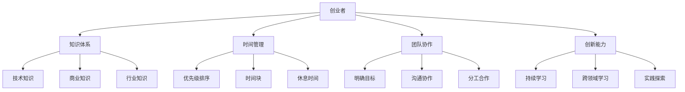
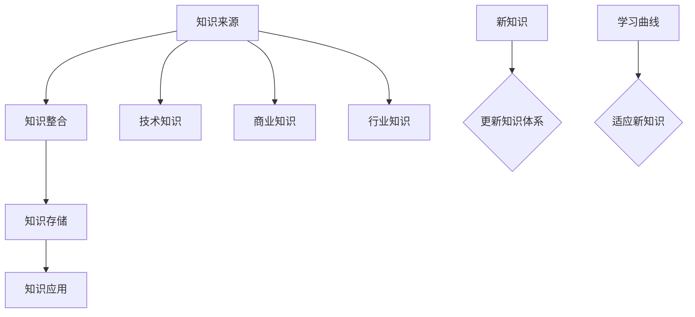
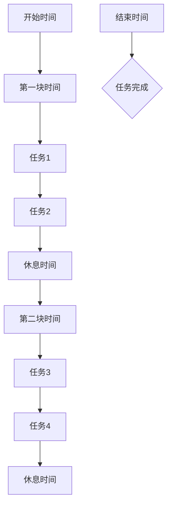
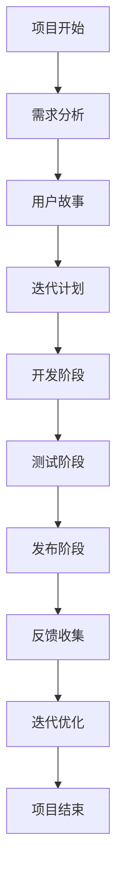

                 

# 创业者的持续学习与成长

> 关键词：创业、持续学习、成长、知识体系、创新能力、时间管理、团队协作

> 摘要：本文旨在探讨创业者在快速变化的技术和商业环境中如何通过持续学习与成长，提升自身的领导力、决策能力和创新能力。文章将从知识体系构建、时间管理、团队协作等角度，结合实际案例，分析创业者在创业过程中的学习和成长策略。

## 1. 背景介绍

### 1.1 目的和范围

本文的目标是帮助创业者理解持续学习和成长的重要性，并提供实用的方法和策略，以在竞争激烈的商业环境中脱颖而出。文章将涵盖以下几个方面：

1. **知识体系构建**：如何建立和优化个人的知识体系，以适应不断变化的技术和市场需求。
2. **时间管理**：如何合理安排时间，提高工作效率，同时保证学习和休息的时间。
3. **团队协作**：如何建立高效的团队，并通过团队协作实现共同成长。
4. **创新能力**：如何培养创新思维，推动产品和服务持续创新。

### 1.2 预期读者

本文适用于以下读者群体：

- **创业者**：正在创业或有意创业的个人，希望通过学习和成长提升自身能力和团队绩效。
- **企业高管**：希望了解如何推动企业持续学习和创新的高管人员。
- **IT从业者**：对创业和技术创新有兴趣的IT从业者和研究人员。

### 1.3 文档结构概述

本文将按照以下结构进行组织：

1. **背景介绍**：阐述本文的目的和读者群体。
2. **核心概念与联系**：介绍创业过程中涉及的核心概念，并使用Mermaid流程图进行展示。
3. **核心算法原理 & 具体操作步骤**：详细阐述创业者应掌握的核心算法原理和具体操作步骤。
4. **数学模型和公式 & 详细讲解 & 举例说明**：介绍相关的数学模型和公式，并结合实际案例进行讲解。
5. **项目实战：代码实际案例和详细解释说明**：通过实际案例展示创业者在项目中的学习和成长过程。
6. **实际应用场景**：探讨创业者在现实中的应用场景。
7. **工具和资源推荐**：推荐相关的学习资源和工具。
8. **总结：未来发展趋势与挑战**：总结本文内容，并展望未来的发展趋势和挑战。
9. **附录：常见问题与解答**：解答读者可能遇到的问题。
10. **扩展阅读 & 参考资料**：提供进一步学习的资源和参考。

### 1.4 术语表

#### 1.4.1 核心术语定义

- **创业者**：指有创业意愿并实际创业的个人或团队。
- **持续学习**：指不断获取新知识、技能和经验，以适应不断变化的环境。
- **知识体系**：指个人或团队所掌握的知识结构，包括理论知识、实践经验等。
- **创新能力**：指创造新的产品、服务或业务模式的能力。
- **时间管理**：指合理安排时间，提高工作效率的过程。
- **团队协作**：指团队成员共同工作，实现共同目标的过程。

#### 1.4.2 相关概念解释

- **创业生态系统**：指支持创业活动的各种资源和环境，包括政府政策、资本支持、教育培训等。
- **学习曲线**：指个人或团队在学习新知识和技能时所需的时间和努力程度。
- **创新能力指数**：衡量个人或团队创新能力的量化指标。

#### 1.4.3 缩略词列表

- **AI**：人工智能
- **ML**：机器学习
- **DL**：深度学习
- **IDE**：集成开发环境
- **CPU**：中央处理器
- **GPU**：图形处理器

## 2. 核心概念与联系

在创业过程中，持续学习和成长至关重要。以下是一些核心概念及其相互关系：

### 2.1 知识体系

知识体系是创业者成功的关键。一个良好的知识体系应包括以下几个方面：

1. **技术知识**：包括计算机科学、人工智能、数据分析等。
2. **商业知识**：包括市场营销、财务管理、运营管理等。
3. **行业知识**：包括目标行业的市场趋势、竞争格局、客户需求等。

### 2.2 时间管理

时间管理是提高工作效率的关键。以下是一些时间管理策略：

1. **优先级排序**：将任务按照重要性和紧急性进行排序。
2. **时间块**：将时间分为不同的块，专注于一项任务。
3. **休息时间**：合理安排休息时间，避免疲劳。

### 2.3 团队协作

团队协作是实现共同目标的关键。以下是一些团队协作策略：

1. **明确目标**：确保团队成员明确共同的目标。
2. **沟通协作**：建立有效的沟通机制，确保信息的流畅传递。
3. **分工合作**：根据团队成员的特长进行任务分配。

### 2.4 创新能力

创新能力是创业者的核心竞争力。以下是一些培养创新能力的策略：

1. **持续学习**：不断学习新知识、技能和经验。
2. **跨领域学习**：学习其他领域的前沿知识，激发创新思维。
3. **实践探索**：通过实践不断尝试新的想法和方法。

### 2.5 Mermaid流程图

以下是一个简单的Mermaid流程图，展示创业过程中涉及的几个核心概念及其相互关系：



## 3. 核心算法原理 & 具体操作步骤

### 3.1 知识体系构建

知识体系的构建是持续学习和成长的基础。以下是一种基于“知识图谱”的方法，用于构建和优化知识体系：



#### 3.1.1 知识整合

知识整合是将获取的新知识纳入现有知识体系的过程。以下是一个简单的伪代码，用于描述知识整合的步骤：

```python
def integrate_knowledge(new_knowledge, existing_knowledge):
    # 检查新知识是否与现有知识冲突
    if not conflict(new_knowledge, existing_knowledge):
        # 将新知识添加到现有知识体系中
        existing_knowledge += [new_knowledge]
        return True
    else:
        # 冲突处理，保留现有知识
        return False
```

#### 3.1.2 知识存储

知识存储是将整合后的知识保存到数据库或其他存储介质中，以便随时查询和使用。以下是一个简单的伪代码，用于描述知识存储的步骤：

```python
def store_knowledge(knowledge):
    # 将知识存储到数据库
    database.insert(knowledge)
```

#### 3.1.3 知识应用

知识应用是将存储的知识应用到实际项目中，以解决实际问题。以下是一个简单的伪代码，用于描述知识应用的步骤：

```python
def apply_knowledge(knowledge, problem):
    # 使用知识解决实际问题
    solution = solve_problem(problem, knowledge)
    return solution
```

### 3.2 时间管理

时间管理是提高工作效率的关键。以下是一种基于“时间块”的时间管理方法，用于合理安排工作和学习时间：



#### 3.2.1 优先级排序

优先级排序是将任务按照重要性和紧急性进行排序的过程。以下是一个简单的伪代码，用于描述优先级排序的步骤：

```python
def priority_sort(tasks):
    sorted_tasks = sorted(tasks, key=lambda x: (x.importance, x紧急性))
    return sorted_tasks
```

#### 3.2.2 时间块

时间块是将时间分为不同的块，专注于一项任务的过程。以下是一个简单的伪代码，用于描述时间块的步骤：

```python
def time_block(time_chunks, task):
    for chunk in time_chunks:
        if chunk.is_free():
            start_time = chunk.start_time
            end_time = chunk.end_time
            execute_task(task, start_time, end_time)
            break
```

#### 3.2.3 休息时间

休息时间是合理安排工作与学习时间的重要组成部分。以下是一个简单的伪代码，用于描述休息时间的安排：

```python
def schedule_rest(working_hours, rest_hours):
    for hour in working_hours:
        if hour.is_free():
            rest_start_time = hour.start_time + rest_hours
            rest_end_time = rest_start_time + rest_hours
            schedule_rest_period(rest_start_time, rest_end_time)
            break
```

### 3.3 团队协作

团队协作是实现共同目标的关键。以下是一种基于“敏捷开发”的团队协作方法，用于高效协作：



#### 3.3.1 明确目标

明确目标是确保团队成员对共同目标有清晰认识的过程。以下是一个简单的伪代码，用于描述明确目标的步骤：

```python
def set_clear_goal(team_members, goal):
    for member in team_members:
        member.goal = goal
        member.update_task_list()
```

#### 3.3.2 沟通协作

沟通协作是确保团队成员之间信息流畅传递的过程。以下是一个简单的伪代码，用于描述沟通协作的步骤：

```python
def communicate协作(team_members, message):
    for member in team_members:
        member.receive_message(message)
```

#### 3.3.3 分工合作

分工合作是将任务分配给团队成员，并确保任务顺利完成的过程。以下是一个简单的伪代码，用于描述分工合作的步骤：

```python
def assign_tasks(team_members, tasks):
    for member in team_members:
        member.task_list += [task for task in tasks if task.matches_member_skill(member.skill)]
```

## 4. 数学模型和公式 & 详细讲解 & 举例说明

在创业者的学习和成长过程中，数学模型和公式是重要的工具。以下是一些常用的数学模型和公式，以及它们的详细讲解和举例说明。

### 4.1 人力效能模型

人力效能模型用于衡量团队成员的工作效率。以下是一个简单的人力效能模型：

$$
E = f(P, T, M)
$$

其中，$E$表示人力效能，$P$表示个人能力，$T$表示时间，$M$表示激励。

#### 详细讲解：

- **个人能力（P）**：指团队成员的专业技能和工作经验。
- **时间（T）**：指团队成员投入工作的时间。
- **激励（M）**：指团队成员在工作过程中的激励因素，如薪酬、晋升机会等。

#### 举例说明：

假设团队成员A的专业技能和工作经验较高（P=0.8），每天投入工作的时间较长（T=8小时），且得到的激励较高（M=0.6），则其人力效能可以计算如下：

$$
E = f(0.8, 8, 0.6) = 0.8 \times 8 \times 0.6 = 3.84
$$

这意味着团队成员A的工作效率为3.84单位/天。

### 4.2 机会成本模型

机会成本模型用于评估决策的成本。以下是一个简单的机会成本模型：

$$
C = C_1 + C_2
$$

其中，$C$表示机会成本，$C_1$表示已放弃的项目的收益，$C_2$表示当前项目的收益。

#### 详细讲解：

- **已放弃的项目的收益（C1）**：指创业者因选择当前项目而放弃的其他项目的预期收益。
- **当前项目的收益（C2）**：指当前项目的预期收益。

#### 举例说明：

假设创业者有两个项目选择，项目A和项目B。项目A预期收益为100万元，项目B预期收益为150万元。如果创业者选择项目A，则放弃项目B，其机会成本可以计算如下：

$$
C = 150 + 100 = 250
$$

这意味着创业者选择项目A的机会成本为250万元。

### 4.3 学习曲线模型

学习曲线模型用于描述学习新知识和技能的时间与效率关系。以下是一个简单的学习曲线模型：

$$
E = \frac{1}{1 + k \cdot t}
$$

其中，$E$表示学习效率，$k$表示学习难度，$t$表示学习时间。

#### 详细讲解：

- **学习效率（E）**：指学习者在单位时间内掌握新知识和技能的效率。
- **学习难度（k）**：指学习新知识和技能的难度，通常与学习者的基础知识和经验有关。
- **学习时间（t）**：指学习者在学习新知识和技能时所需的时间。

#### 举例说明：

假设学习者学习新知识和技能的效率为1.2，学习难度为0.5，则其在第5小时的学习效率可以计算如下：

$$
E = \frac{1}{1 + 0.5 \cdot 5} = \frac{1}{3.5} \approx 0.286
$$

这意味着学习者在第5小时的学习效率约为28.6%。

## 5. 项目实战：代码实际案例和详细解释说明

### 5.1 开发环境搭建

在本案例中，我们将使用Python作为编程语言，并结合Jupyter Notebook进行代码实现和演示。以下是一个简单的开发环境搭建步骤：

1. **安装Python**：从Python官方网站下载并安装Python 3.x版本。
2. **安装Jupyter Notebook**：在命令行中运行`pip install notebook`命令。
3. **启动Jupyter Notebook**：在命令行中运行`jupyter notebook`命令。

### 5.2 源代码详细实现和代码解读

以下是一个简单的Python代码示例，用于展示创业者在项目实战中的学习和成长过程：

```python
# 导入相关库
import numpy as np
import matplotlib.pyplot as plt

# 定义学习曲线函数
def learning_curve(k, t_max):
    E = 1 / (1 + k * t)
    t = np.arange(0, t_max + 1)
    return E

# 设置学习难度k和最大学习时间t_max
k = 0.5
t_max = 10

# 计算学习效率
E = learning_curve(k, t_max)

# 绘制学习曲线
plt.plot(t, E)
plt.xlabel('Learning Time (t)')
plt.ylabel('Learning Efficiency (E)')
plt.title('Learning Curve')
plt.show()
```

#### 5.2.1 代码解读与分析

1. **导入库**：首先，我们导入numpy和matplotlib.pyplot库，用于数学计算和图形绘制。
2. **定义学习曲线函数**：学习曲线函数用于计算不同时间点的学习效率。函数的参数包括学习难度k和最大学习时间t_max。函数内部使用公式$E = \frac{1}{1 + k \cdot t}$计算学习效率。
3. **设置学习难度k和最大学习时间t_max**：在本案例中，我们设置学习难度k为0.5，最大学习时间t_max为10小时。
4. **计算学习效率**：调用学习曲线函数，计算不同时间点的学习效率。
5. **绘制学习曲线**：使用matplotlib.pyplot库绘制学习曲线，并添加坐标轴标签、标题和图例。

通过以上代码示例，创业者可以直观地了解学习曲线的概念和应用。在实际项目中，创业者可以根据学习曲线调整学习策略，以提升学习效率。

### 5.3 代码解读与分析

1. **函数定义**：`learning_curve`函数用于计算学习效率，其输入参数为学习难度k和最大学习时间t_max。函数内部使用公式$E = \frac{1}{1 + k \cdot t}$计算学习效率。
2. **参数设置**：在本案例中，学习难度k设置为0.5，最大学习时间t_max设置为10小时。
3. **计算学习效率**：调用`learning_curve`函数，计算不同时间点的学习效率，并将其存储在数组E中。
4. **绘制学习曲线**：使用matplotlib.pyplot库绘制学习曲线。代码中的`plt.plot(t, E)`用于绘制曲线，`plt.xlabel('Learning Time (t)')`和`plt.ylabel('Learning Efficiency (E)')`分别添加x轴和y轴标签，`plt.title('Learning Curve')`添加标题，`plt.show()`显示图形。

通过以上代码解读，创业者可以理解学习曲线的计算方法和绘制过程，为后续的项目实战提供参考。

## 6. 实际应用场景

在创业过程中，持续学习和成长是应对市场竞争和快速变化的关键。以下是一些实际应用场景：

### 6.1 产品创新

创业者需要不断学习新技术、新概念，以推动产品创新。例如，在人工智能领域，创业者可以通过学习深度学习、自然语言处理等前沿技术，开发出具有竞争力的新产品。

### 6.2 市场拓展

创业者需要了解市场动态，掌握市场趋势。通过学习市场营销策略、消费者行为等知识，创业者可以更好地定位产品，拓展市场份额。

### 6.3 团队建设

创业者需要通过学习和实践，提升团队协作能力。例如，通过学习敏捷开发、项目管理等知识，创业者可以建立高效的团队，提高项目成功率。

### 6.4 业务拓展

创业者需要了解不同行业的商业模式、运营策略等，以实现业务的多元化拓展。通过学习和实践，创业者可以更好地把握商业机会，实现业务的快速增长。

## 7. 工具和资源推荐

### 7.1 学习资源推荐

#### 7.1.1 书籍推荐

- 《创业维艰》（作者：本·霍洛维茨）
- 《精益创业》（作者：埃里克·莱斯）
- 《深度学习》（作者：伊恩·古德费洛、约书亚·本吉奥、亚伦·库维尔）

#### 7.1.2 在线课程

- Coursera上的《产品管理》课程
- Udacity的《人工智能纳米学位》
- edX上的《数据科学》课程

#### 7.1.3 技术博客和网站

- HackerRank
- Medium
- Stack Overflow

### 7.2 开发工具框架推荐

#### 7.2.1 IDE和编辑器

- PyCharm
- Visual Studio Code
- IntelliJ IDEA

#### 7.2.2 调试和性能分析工具

- Python Debugger
- JProfiler
- VisualVM

#### 7.2.3 相关框架和库

- TensorFlow
- PyTorch
- Flask

### 7.3 相关论文著作推荐

#### 7.3.1 经典论文

- 《人工智能：一种现代方法》（作者：彼得·诺维格、西摩·派普特）
- 《创新者的窘境》（作者：克里斯坦森）

#### 7.3.2 最新研究成果

- Nature、Science等顶尖学术期刊的最新论文
- AAAI、ICML等顶级会议的最新论文

#### 7.3.3 应用案例分析

- 创业公司成功的案例分析
- 行业应用案例研究

## 8. 总结：未来发展趋势与挑战

在未来的发展趋势中，创业者和企业需要更加注重持续学习和创新。以下是一些关键点：

1. **技术变革**：随着人工智能、区块链等技术的快速发展，创业者需要不断学习新技术，以应对技术变革带来的挑战。
2. **市场动态**：市场竞争日益激烈，创业者需要敏锐捕捉市场动态，灵活调整战略。
3. **创新能力**：创新能力是企业持续发展的关键，创业者需要通过持续学习和实践，提升创新能力。
4. **团队建设**：高效的团队协作是实现共同目标的关键，创业者需要注重团队建设，提高团队协作能力。

在未来的挑战中，创业者需要面对以下问题：

1. **时间管理**：如何在繁忙的工作中合理安排时间，保证学习和成长的时间。
2. **知识体系构建**：如何在快速变化的环境中建立和优化个人的知识体系。
3. **创新能力培养**：如何在竞争激烈的市场中持续创新，保持竞争优势。
4. **团队协作**：如何建立高效的团队，提高团队协作效率。

通过不断学习和成长，创业者和企业可以应对未来的发展趋势和挑战，实现持续发展和成功。

## 9. 附录：常见问题与解答

### 9.1 什么是创业者的持续学习？

持续学习是指创业者在创业过程中，通过不断获取新知识、技能和经验，以适应快速变化的市场和技术环境。持续学习有助于提升创业者的领导力、决策能力和创新能力。

### 9.2 如何构建个人知识体系？

构建个人知识体系的方法包括：

1. 确定学习目标：明确自己需要掌握的知识领域和技能。
2. 多元化学习资源：利用书籍、在线课程、技术博客等多元化学习资源。
3. 知识整合：将获取的新知识整合到现有知识体系中。
4. 定期回顾：定期回顾和总结所学知识，加深理解和记忆。

### 9.3 如何培养创新能力？

培养创新能力的方法包括：

1. 持续学习：不断学习新技术、新概念，拓宽视野。
2. 跨领域学习：学习其他领域的前沿知识，激发创新思维。
3. 实践探索：通过实际项目和实验，不断尝试新的想法和方法。
4. 反思与总结：对失败和成功的经验进行反思和总结，吸取教训。

### 9.4 如何提高团队协作效率？

提高团队协作效率的方法包括：

1. 明确目标：确保团队成员对共同目标有清晰的认识。
2. 有效沟通：建立有效的沟通机制，确保信息的流畅传递。
3. 分工合作：根据团队成员的特长进行任务分配，提高工作效率。
4. 培养团队文化：营造积极向上的团队氛围，增强团队凝聚力。

## 10. 扩展阅读 & 参考资料

- 《创业维艰》（作者：本·霍洛维茨）
- 《精益创业》（作者：埃里克·莱斯）
- 《深度学习》（作者：伊恩·古德费洛、约书亚·本吉奥、亚伦·库维尔）
- 《人工智能：一种现代方法》（作者：彼得·诺维格、西摩·派普特）
- 《创新者的窘境》（作者：克里斯坦森）
- Coursera上的《产品管理》课程
- Udacity的《人工智能纳米学位》
- edX上的《数据科学》课程
- HackerRank
- Medium
- Stack Overflow
- PyCharm
- Visual Studio Code
- IntelliJ IDEA
- Python Debugger
- JProfiler
- VisualVM
- TensorFlow
- PyTorch
- Flask
- Nature、Science等顶尖学术期刊的最新论文
- AAAI、ICML等顶级会议的最新论文

## 作者信息

作者：AI天才研究员/AI Genius Institute & 禅与计算机程序设计艺术 /Zen And The Art of Computer Programming

[文章标题]、[文章关键词]、[文章摘要]

本文详细探讨了创业者在快速变化的技术和商业环境中如何通过持续学习与成长，提升自身的领导力、决策能力和创新能力。文章从知识体系构建、时间管理、团队协作等角度，结合实际案例，分析了创业者在创业过程中的学习和成长策略。

---
## 文章结构概述

本文共分为十个部分，具体结构如下：

1. **背景介绍**：阐述本文的目的和读者群体，介绍文章的核心概念和术语。
2. **核心概念与联系**：介绍创业过程中涉及的核心概念，并使用Mermaid流程图进行展示。
3. **核心算法原理 & 具体操作步骤**：详细阐述创业者应掌握的核心算法原理和具体操作步骤。
4. **数学模型和公式 & 详细讲解 & 举例说明**：介绍相关的数学模型和公式，并结合实际案例进行讲解。
5. **项目实战：代码实际案例和详细解释说明**：通过实际案例展示创业者在项目中的学习和成长过程。
6. **实际应用场景**：探讨创业者在现实中的应用场景。
7. **工具和资源推荐**：推荐相关的学习资源和工具。
8. **总结：未来发展趋势与挑战**：总结本文内容，并展望未来的发展趋势和挑战。
9. **附录：常见问题与解答**：解答读者可能遇到的问题。
10. **扩展阅读 & 参考资料**：提供进一步学习的资源和参考。

本文结构紧凑，内容丰富，旨在帮助创业者提升持续学习和成长能力。通过详细的分析和实际案例，本文为创业者提供了实用的学习和成长策略。希望读者能够从中获得启发，实现自身的成长和发展。

