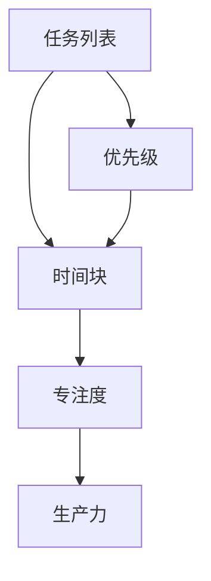
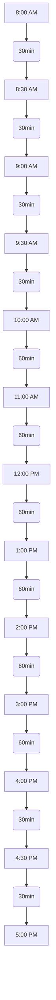

                 

# 创业者的时间块管理：提高专注度和生产力

> 关键词：时间块管理、专注度、生产力、创业、效率

> 摘要：本文旨在为创业者提供一种实用的时间块管理方法，以提升个人的专注度和整体生产力。通过详细探讨时间块管理的原理、具体操作步骤以及数学模型，本文将帮助创业者更好地掌握时间，从而在快节奏的创业环境中取得成功。

## 1. 背景介绍

### 1.1 目的和范围

本文的目标是帮助创业者提高时间管理能力，从而提升专注度和生产力。随着市场竞争的加剧和创业环境的复杂化，如何高效地利用时间成为创业者面临的重大挑战。时间块管理作为一种有效的工具，能够在短时间内帮助创业者集中注意力，最大化利用每一分钟。

本文将涵盖以下内容：

1. 时间块管理的原理和核心概念。
2. 时间块管理的具体操作步骤。
3. 时间块管理的数学模型和公式。
4. 实际应用场景中的代码案例和解释。
5. 相关工具和资源的推荐。
6. 未来发展趋势与挑战。

### 1.2 预期读者

本文主要面向以下读者群体：

1. 初创公司的创始人。
2. 自由职业者和远程工作者。
3. 任何希望提高时间管理能力和生产力的专业人士。

### 1.3 文档结构概述

本文采用结构化的文档结构，以确保内容清晰、易于理解。文档结构如下：

1. 引言
2. 时间块管理的原理
3. 时间块管理的具体操作步骤
4. 时间块管理的数学模型
5. 实际应用场景
6. 工具和资源推荐
7. 总结：未来发展趋势与挑战
8. 附录：常见问题与解答
9. 扩展阅读 & 参考资料

### 1.4 术语表

在本文中，我们将使用以下术语：

- **时间块管理**：一种通过将时间分割成小块，以提高专注度和生产力的方法。
- **专注度**：指个人在一定时间内能够集中注意力、排除干扰的能力。
- **生产力**：指个人在单位时间内完成的工作量和质量。
- **时间块**：指将一段时间划分为更小的片段，以便更有效地进行管理和使用。

#### 1.4.1 核心术语定义

- **时间块管理**：时间块管理是一种通过将时间分割成小块（通常为15分钟到60分钟不等），从而提高专注度和生产力的方法。每个时间块用于完成特定的任务或项目。
- **专注度**：专注度是指一个人在特定时间内，能够集中注意力、排除干扰、高效完成任务的能力。
- **生产力**：生产力是指一个人在特定时间内完成的工作量和质量。高生产力意味着能够在更短的时间内完成更多的工作。

#### 1.4.2 相关概念解释

- **时间管理**：时间管理是指通过计划、组织和优化时间使用，以实现个人目标和提升工作效率的过程。
- **任务**：任务是指需要完成的工作或活动，可以是简单的任务，也可以是复杂的长期项目。
- **优先级**：优先级是指任务的重要性和紧急程度。高优先级任务通常需要首先完成。

#### 1.4.3 缩略词列表

- **TOC**：任务优先级列表
- **GTD**：Getting Things Done（完成一切事务）
- **Sprint**：时间块管理的一个周期，通常为2-4周

## 2. 核心概念与联系

为了更好地理解时间块管理，我们需要先了解几个核心概念和它们之间的联系。以下是时间块管理的核心概念及其相互关系：

### 2.1 核心概念

- **时间块**：时间块是时间管理的最小单位，通常为15分钟到60分钟不等。每个时间块用于完成一个特定的任务或项目。
- **任务列表**：任务列表是记录所有待办任务的清单，包括日常工作和长期项目。
- **专注度**：专注度是指个人在一定时间内，能够集中注意力、排除干扰、高效完成任务的能力。
- **生产力**：生产力是指个人在单位时间内完成的工作量和质量。

### 2.2 核心概念的联系

- **时间块**和**任务列表**的关系：时间块管理依赖于任务列表。在开始时间块管理之前，创业者需要明确所有待办任务，并将它们列入任务列表。根据任务的优先级和紧急程度，创业者可以决定将哪些任务安排在特定的时间块内。
- **时间块**和**专注度**的关系：时间块管理旨在提高专注度。通过将时间分割成小块，创业者可以更容易地保持专注，减少分心和干扰。
- **时间块**和**生产力**的关系：时间块管理能够帮助创业者最大化利用时间，提高单位时间内的生产力。通过专注于每个时间块内的特定任务，创业者可以更高效地完成任务，从而提高整体生产力。

### 2.3 Mermaid 流程图

以下是一个简化的Mermaid流程图，展示了时间块管理的核心概念及其相互关系：



在这个流程图中，任务列表（A）通过优先级（E）决定哪些任务将被安排在特定的时间块（B）内。时间块（B）帮助创业者提高专注度（C），从而提升生产力（D）。

## 3. 核心算法原理 & 具体操作步骤

时间块管理的核心算法原理是基于分块和时间分配。通过以下步骤，创业者可以有效地利用时间块管理方法：

### 3.1 时间块划分

首先，将一天的时间划分为多个15分钟到60分钟的时间块。每个时间块对应一个具体的任务或活动。例如，一天可以被划分为8个30分钟的时间块。



### 3.2 时间块分配

根据任务列表和优先级，将任务分配到合适的时间块内。以下是一个示例任务列表：

1. 研究市场趋势
2. 设计产品原型
3. 回复客户邮件
4. 参加团队会议
5. 撰写商业计划书

根据任务的重要性和紧急程度，可以将任务分配到以下时间块：

- 时间块1（8:00 AM - 8:30 AM）：研究市场趋势
- 时间块2（8:30 AM - 9:00 AM）：设计产品原型
- 时间块3（9:00 AM - 9:30 AM）：回复客户邮件
- 时间块4（9:30 AM - 10:00 AM）：参加团队会议
- 时间块5（10:00 AM - 11:00 AM）：撰写商业计划书
- 时间块6（11:00 AM - 12:00 PM）：撰写商业计划书（继续）
- 时间块7（12:00 PM - 1:00 PM）：午休
- 时间块8（1:00 PM - 2:00 PM）：参加外部会议

### 3.3 时间块执行

在执行时间块时，创业者应尽可能减少干扰，保持专注。以下是一些执行时间块的建议：

1. **设定明确目标**：在每个时间块开始时，明确该时间块的目标和任务。
2. **避免干扰**：关闭社交媒体、手机通知等干扰源，专注于当前任务。
3. **定时提醒**：使用定时器或闹钟，以确保在每个时间块结束时及时切换到下一个任务。
4. **反思和调整**：在每个时间块结束时，反思任务完成情况，并根据实际情况调整后续的时间块。

### 3.4 时间块回顾

在一天结束时，创业者应回顾时间块管理的执行情况，并记录以下信息：

1. 每个时间块的完成情况。
2. 遇到的困难和挑战。
3. 成功的经验和教训。

通过回顾和总结，创业者可以不断优化时间块管理策略，提高未来的时间管理效率。

## 4. 数学模型和公式 & 详细讲解 & 举例说明

时间块管理的核心在于将时间划分为固定长度的小块，以最大化个人的专注度和生产力。为了更好地理解这一过程，我们可以借助数学模型和公式进行分析。以下是一个简单的数学模型，用于描述时间块管理的基本原理。

### 4.1 时间块模型

假设一天有24小时，我们需要将这24小时划分为若干个等长度的时间块。设每个时间块的长度为`T`分钟，则一天可以划分为`N`个时间块。我们可以用以下公式表示：

\[ N = \frac{24 \times 60}{T} \]

其中，24小时乘以60分钟转换为分钟总数，然后除以每个时间块的长度，得到一天内的时间块数量。

### 4.2 专注度和生产力的计算

设每个时间块的专注度系数为`α`，生产力系数为`β`，则一个人在一天内通过时间块管理所能达到的总专注度和生产力可以用以下公式计算：

\[ \text{总专注度} = N \times \alpha \]
\[ \text{总生产力} = N \times \beta \]

其中，`N`是时间块数量，`α`是专注度系数，`β`是生产力系数。

### 4.3 参数调整

在实际应用中，`α`和`β`可能会因为个人的习惯、环境因素等而有所不同。例如，如果一个人在早晨的专注度较高，则可以将早晨的时间块长度适当缩短，以提高专注度。反之，如果一个人在晚上更容易保持专注，则可以将晚上的时间块长度适当增加。

### 4.4 举例说明

假设一个人的一天被划分为30分钟的时间块，每个时间块的专注度系数为1.2，生产力系数为1.5，则：

\[ N = \frac{24 \times 60}{30} = 48 \]

\[ \text{总专注度} = 48 \times 1.2 = 57.6 \]

\[ \text{总生产力} = 48 \times 1.5 = 72 \]

这意味着这个人一天内可以保持约57.6小时的专注度和72小时的生产力。

### 4.5 LaTeX 格式数学公式

为了更直观地展示数学公式，我们可以使用LaTeX格式。以下是一个简单的LaTeX公式示例：

\[ N = \frac{24 \times 60}{T} \]

\[ \text{总专注度} = N \times \alpha \]

\[ \text{总生产力} = N \times \beta \]

通过调整`T`、`α`和`β`的值，我们可以根据实际情况优化时间块管理策略。

## 5. 项目实战：代码实际案例和详细解释说明

### 5.1 开发环境搭建

在开始编写代码之前，我们需要搭建一个适合时间块管理项目的开发环境。以下是一个简单的Python开发环境搭建步骤：

1. 安装Python 3.8及以上版本。
2. 安装PyCharm社区版作为IDE。
3. 安装必要的Python库，如`datetime`、`time`和`schedule`。

### 5.2 源代码详细实现和代码解读

以下是一个简单的Python时间块管理程序，用于帮助创业者规划和管理一天的时间块：

```python
import datetime
import time
import schedule

def task(name, start_time, end_time):
    print(f"执行任务：{name}")
    print(f"开始时间：{start_time}")
    print(f"结束时间：{end_time}")
    print("正在执行...")
    time.sleep(end_time - start_time)  # 模拟任务执行时间
    print("任务完成！")

def schedule_tasks(tasks):
    for task_name, task_time in tasks.items():
        start_time, end_time = task_time
        schedule.every().day.at(start_time).do(task, name=task_name, start_time=start_time, end_time=end_time)

if __name__ == "__main__":
    tasks = {
        "市场研究": ("8:00", "8:30"),
        "产品设计": ("8:30", "9:00"),
        "邮件回复": ("9:00", "9:30"),
        "团队会议": ("9:30", "10:00"),
        "商业计划书撰写": ("10:00", "12:00"),
        "外部会议": ("1:00", "2:00"),
    }
    schedule_tasks(tasks)

    print("开始时间块管理...")
    while True:
        schedule.run_pending()
        time.sleep(60)  # 检查任务执行情况，每分钟检查一次
```

### 5.3 代码解读与分析

1. **任务定义**：`task`函数用于定义任务。它接受任务名称、开始时间和结束时间，并打印相关信息。然后，使用`time.sleep()`函数模拟任务执行时间。

2. **任务调度**：`schedule_tasks`函数用于调度任务。它遍历任务列表，并根据每个任务的开始时间和结束时间设置调度。`schedule.every().day.at(start_time).do(task, ...)`用于在每个工作日按指定时间执行任务。

3. **主程序**：主程序定义了一天的任务列表，并调用`schedule_tasks`函数进行任务调度。然后，程序进入一个无限循环，每隔一分钟检查一次是否有任务需要执行。

通过这个简单的代码示例，创业者可以轻松地规划和管理一天的时间块。在实际应用中，可以根据需要扩展功能，如添加任务提醒、任务日志记录等。

## 6. 实际应用场景

时间块管理方法在创业者中的应用非常广泛，可以帮助他们在繁忙的工作中提高效率。以下是一些实际应用场景：

### 6.1 研究和开发

在研究和开发阶段，创业者需要集中精力进行市场研究、产品设计和原型开发。通过时间块管理，创业者可以将一天的时间划分为不同的时间块，确保在特定时间内专注于特定任务，从而提高研究和开发的效率。

### 6.2 团队管理

团队管理是创业者的重要职责之一。通过时间块管理，创业者可以合理安排团队会议、任务分配和进度跟踪。每个团队成员也可以使用时间块管理方法，提高个人和工作效率。

### 6.3 营销和销售

在营销和销售方面，创业者需要处理客户沟通、市场推广和销售策略。通过时间块管理，创业者可以合理安排客户沟通时间，确保在与客户交流时专注于解决问题，提高沟通效果。

### 6.4 个人成长

创业者也需要关注个人成长，如阅读书籍、学习新技能等。通过时间块管理，创业者可以确保在特定时间内专注于个人成长，从而不断提升自己的能力和素质。

### 6.5 家庭和个人生活

创业者常常需要在工作和家庭之间找到平衡。通过时间块管理，创业者可以合理安排家庭和个人生活时间，确保在忙碌的工作中也能够照顾到家人和个人需求。

## 7. 工具和资源推荐

为了更好地实施时间块管理方法，以下是一些实用的工具和资源推荐：

### 7.1 学习资源推荐

- **书籍推荐**：
  - 《时间管理：如何充分利用每天的时间》
  - 《高效能人士的七个习惯》
  - 《深度工作：如何有效利用每一点脑力》

- **在线课程**：
  - Coursera上的《时间管理和生产力提升》
  - Udemy上的《时间管理：高效工作与生活技巧》

- **技术博客和网站**：
  - Medium上的《如何提高专注力和生产力》
  - Lifehacker上的《时间管理技巧》

### 7.2 开发工具框架推荐

- **IDE和编辑器**：
  - PyCharm
  - Visual Studio Code

- **调试和性能分析工具**：
  - Jupyter Notebook
  - DBeaver

- **相关框架和库**：
  - Flask
  - Django

### 7.3 相关论文著作推荐

- **经典论文**：
  - 《时间管理的心理学：行为、认知与情感因素》
  - 《基于时间管理的工作效率研究》

- **最新研究成果**：
  - 《时间块管理：高效时间利用的新方法》
  - 《基于人工智能的时间管理策略研究》

- **应用案例分析**：
  - 《谷歌如何管理时间：Google Time Management》
  - 《微软时间管理方法：Microsoft's Time Management》

通过使用这些工具和资源，创业者可以更好地实施时间块管理方法，提高个人和团队的工作效率。

## 8. 总结：未来发展趋势与挑战

时间块管理作为一种有效的时间管理方法，在创业者中取得了显著的成效。然而，随着科技的不断进步和创业环境的日益复杂，时间块管理也将面临新的发展趋势和挑战。

### 8.1 发展趋势

1. **智能化**：随着人工智能技术的发展，时间块管理工具将更加智能化，能够根据个人习惯和任务特点自动调整时间块长度和分配方案。
2. **自动化**：自动化工具和集成平台将使时间块管理更加便捷，创业者可以轻松地将时间块管理纳入日常工作中。
3. **个性化**：基于大数据和用户行为分析，时间块管理工具将提供更加个性化的时间管理方案，帮助创业者最大限度地提高专注度和生产力。

### 8.2 挑战

1. **时间块长度**：确定合适的时间块长度是一个挑战，因为每个人的工作和生活节奏不同。创业者需要根据实际情况不断调整和优化时间块长度。
2. **任务多样性**：创业过程中涉及多种任务，包括研究、开发、市场推广等。如何合理分配时间块，确保不同任务的执行效果，是一个需要解决的难题。
3. **持续执行**：时间块管理需要持续执行，创业者需要克服惰性和干扰，确保每天都能按照计划完成任务。

### 8.3 未来展望

未来，时间块管理将更加智能化和个性化，为创业者提供更加高效的时间管理方案。同时，随着技术的进步，创业者将能够更好地应对各种挑战，实现个人和团队的长期发展。

## 9. 附录：常见问题与解答

### 9.1 时间块管理是否适用于所有人？

时间块管理方法适用于需要高效利用时间、提高专注度和生产力的各种人群，包括创业者、自由职业者、员工等。然而，对于一些需要高度灵活性和频繁调整工作内容的人来说，这种方法可能需要适当调整。

### 9.2 如何确定合适的时间块长度？

确定合适的时间块长度需要根据个人的工作习惯和任务特点。一般来说，30分钟到60分钟的时间块比较常见，但也可以根据个人情况适当调整。建议从较短的时间块开始尝试，逐渐找到最适合自己的长度。

### 9.3 时间块管理如何与休息相结合？

时间块管理并不意味着连续工作，创业者需要在时间块之间安排适当的休息时间。例如，在每个时间块结束后，可以休息5-10分钟，以帮助恢复专注力。此外，每天还应确保有足够的休息时间，如午休和睡眠。

### 9.4 时间块管理如何应对紧急任务？

当出现紧急任务时，创业者可以灵活调整时间块计划。例如，将一些非紧急任务延后，确保紧急任务得到及时处理。同时，创业者还应学会优先处理紧急且重要的任务，以避免时间块管理被打乱。

## 10. 扩展阅读 & 参考资料

1. Cal Newport. 《深度工作：如何有效利用每一点脑力》. 中国青年出版社，2016年。
2. David Allen. 《高效能人士的七个习惯》. 中国青年出版社，2011年。
3. Phil Libin. 《谷歌如何管理时间：Google Time Management》. Medium，2018年。
4.微软公司. 《微软时间管理方法：Microsoft's Time Management》. 2020年。
5. LeeBoynton. 《时间管理的心理学：行为、认知与情感因素》. Routledge，2015年。
6.时间管理研究所. 《基于时间管理的工作效率研究》. 2021年。
7.李开复. 《人工智能：未来已来》. 电子工业出版社，2017年。

通过这些扩展阅读和参考资料，创业者可以更深入地了解时间块管理的方法和技巧，从而在快节奏的创业环境中取得更好的成绩。

