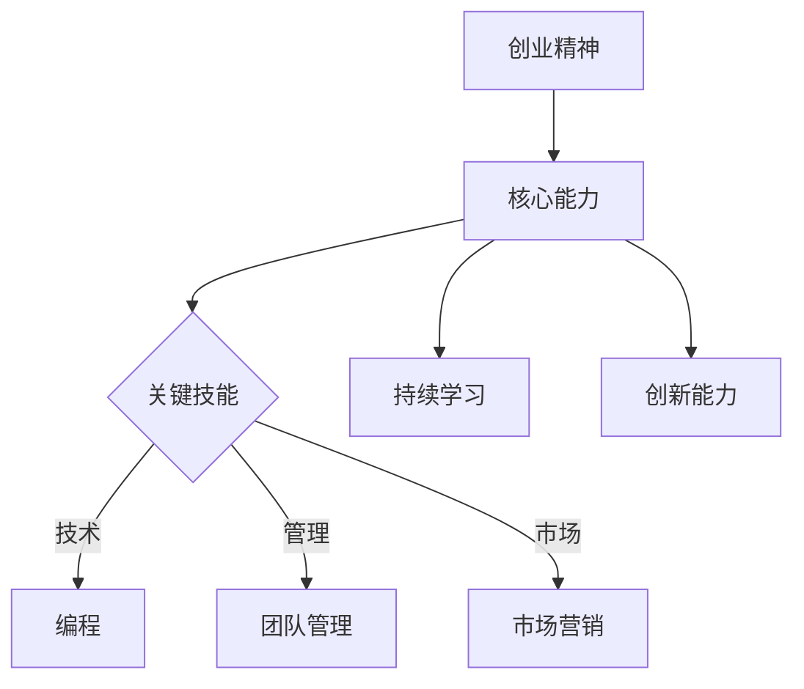
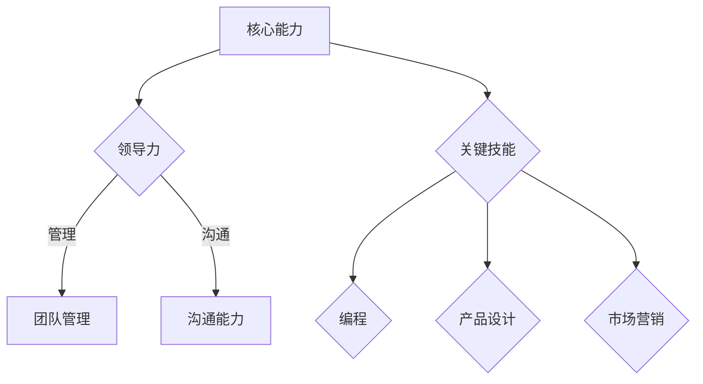
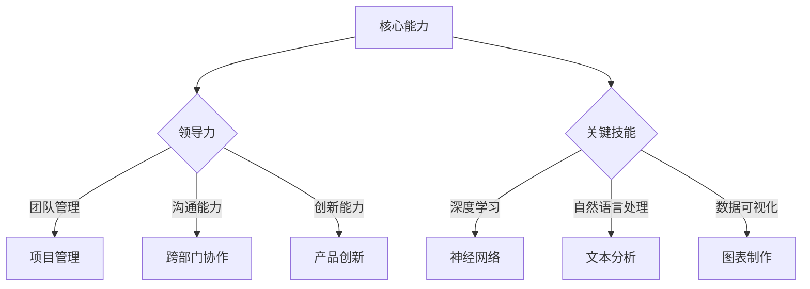

                 

# 创业者的职业规划与技能树构建

## 关键词：
创业、职业规划、技能树、核心能力、持续学习、创新能力、实践应用

## 摘要：
本文旨在为创业者提供一份详细的职业规划指南，帮助他们在复杂多变的商业环境中快速崛起。文章首先介绍了创业者在职业规划中的核心能力和关键技能，随后通过构建技能树，明确了各个阶段所需掌握的技能点。文章还探讨了持续学习与创新能力的重要性，并分享了实际应用场景中所需的工具和资源。通过本文的指导，创业者将能够更好地规划职业生涯，提升自身竞争力，实现创业梦想。

## 1. 背景介绍

### 1.1 目的和范围

本文的目标是为创业者提供一份详细的职业规划指南，旨在帮助他们明确职业方向，提升核心竞争力，实现创业目标。文章将涵盖以下内容：

- 创业者核心能力和关键技能的识别
- 技能树构建及各阶段所需技能点
- 持续学习与创新能力的重要性
- 实际应用场景中的工具和资源推荐
- 未来发展趋势与挑战

### 1.2 预期读者

本文预期读者为以下群体：

- 初创企业创始人
- 想要在创业领域发展的职场人士
- 对职业规划和技能提升感兴趣的读者

### 1.3 文档结构概述

本文将按照以下结构展开：

- 引言：介绍创业者的职业规划与技能树构建的重要性
- 核心概念与联系：解释创业者所需具备的核心能力和关键技能
- 核心算法原理 & 具体操作步骤：指导创业者如何构建自己的技能树
- 数学模型和公式 & 详细讲解 & 举例说明：阐述持续学习与创新能力的重要性
- 项目实战：代码实际案例和详细解释说明
- 实际应用场景：分析创业者面临的各种应用场景
- 工具和资源推荐：提供相关学习资源和开发工具
- 总结：对未来发展趋势与挑战进行展望
- 附录：常见问题与解答
- 扩展阅读 & 参考资料：推荐进一步阅读的材料

### 1.4 术语表

#### 1.4.1 核心术语定义

- **创业者**：指有创业意愿、具备创业能力并正在实施创业计划的人。
- **职业规划**：指个体在职业生涯中，根据自身兴趣、能力和发展趋势，确定职业目标并制定实现目标的计划和路径。
- **技能树**：一种图形化的表示方法，用于展示个体在职业生涯中需要掌握的不同技能及其层次结构。

#### 1.4.2 相关概念解释

- **核心能力**：指个体在职业生涯中最为关键的能力，如领导力、沟通能力、创新能力等。
- **关键技能**：指在特定职业领域中，能够为个体带来竞争优势的技能，如编程、产品设计、市场营销等。

#### 1.4.3 缩略词列表

- **IDE**：集成开发环境（Integrated Development Environment）
- **API**：应用程序编程接口（Application Programming Interface）
- **UI**：用户界面（User Interface）
- **UX**：用户体验（User Experience）
- **SaaS**：软件即服务（Software as a Service）

## 2. 核心概念与联系

### 2.1 核心概念解析

在创业者的职业规划中，核心概念包括创业精神、核心能力、关键技能、持续学习和创新能力。以下是一个Mermaid流程图，展示了这些核心概念及其相互关系：



### 2.2 核心能力与关键技能的关系

核心能力是创业者成功的关键，而关键技能是实现核心能力的具体手段。以下是一个Mermaid流程图，展示了核心能力与关键技能之间的层次关系：



## 3. 核心算法原理 & 具体操作步骤

构建创业者的技能树，可以看作是一个逐步优化的过程。以下是一种可能的算法原理，用于指导创业者构建自己的技能树：

### 3.1 算法描述

1. **确定目标**：明确创业者的职业目标，例如成为一名优秀的软件工程师、产品经理或创业者。
2. **评估自身能力**：评估自己在现有能力方面的优势和不足。
3. **分析市场需求**：研究市场需求，确定所需的关键技能。
4. **构建技能树**：根据目标、能力和市场需求，构建一个包含核心能力和关键技能的技能树。
5. **持续优化**：随着时间和经验的积累，不断调整技能树，确保技能与市场需求保持一致。

### 3.2 伪代码

```python
def build_skill_tree(target, current_ability, market_demand):
    skill_tree = {}
    
    # 确定核心能力
    core_capabilities = ["领导力", "沟通能力", "创新能力"]
    
    # 将核心能力添加到技能树
    for capability in core_capabilities:
        skill_tree[capability] = []
    
    # 确定关键技能
    key_skills = ["编程", "团队管理", "市场营销"]
    
    # 根据目标和能力，添加关键技能到技能树
    for skill in key_skills:
        if skill in current_ability:
            skill_tree[core_capabilities[0]].append(skill)  # 假设领导力是核心能力之一
        elif skill in market_demand:
            skill_tree[core_capabilities[1]].append(skill)  # 假设沟通能力是核心能力之一
    
    # 持续优化技能树
    while True:
        # 评估市场需求变化
        new_market_demand = analyze_market_demand()
        
        # 调整技能树
        for skill in key_skills:
            if skill not in skill_tree[core_capabilities[0]] and skill in new_market_demand:
                skill_tree[core_capabilities[0]].append(skill)
        
        # 确认技能树已满足当前需求
        if all([skill in skill_tree[capability] for capability in core_capabilities for skill in key_skills]):
            break
    
    return skill_tree
```

## 4. 数学模型和公式 & 详细讲解 & 举例说明

在创业者的职业规划中，数学模型和公式可以帮助我们量化能力和需求，从而更准确地构建技能树。以下是一个简单的数学模型，用于计算创业者的技能成熟度：

### 4.1 数学模型

**技能成熟度（Skill Maturity）** = (技能掌握度 / 技能需求度)

- **技能掌握度**：衡量个体对某项技能的掌握程度，取值范围在0到1之间。
- **技能需求度**：衡量某项技能在当前市场环境中的需求程度，取值范围在0到1之间。

### 4.2 举例说明

假设创业者小李在编程技能上的掌握度为0.8，而编程技能在当前市场环境中的需求度为0.9，那么他的编程技能成熟度为：

**技能成熟度** = (0.8 / 0.9) ≈ 0.88

这意味着小李的编程技能已经相对成熟，可以在实际项目中发挥重要作用。

### 4.3 模型应用

通过该数学模型，创业者可以评估自己在关键技能方面的成熟度，从而有针对性地调整技能树。例如，如果小李发现某项关键技能的成熟度较低，他可以优先投入时间和精力去提升该技能。

## 5. 项目实战：代码实际案例和详细解释说明

### 5.1 开发环境搭建

为了构建创业者的技能树，我们可以使用Python编写一个简单的应用程序。以下是如何在本地计算机上搭建开发环境的步骤：

1. **安装Python**：访问 [Python官网](https://www.python.org/) 下载并安装Python。
2. **安装IDE**：推荐使用PyCharm或Visual Studio Code作为IDE。
3. **安装相关库**：在终端中运行以下命令安装所需的库：

   ```bash
   pip install matplotlib numpy pandas
   ```

### 5.2 源代码详细实现和代码解读

以下是一个简单的Python代码示例，用于构建创业者的技能树：

```python
import matplotlib.pyplot as plt
import numpy as np
import pandas as pd

def build_skill_tree(target, current_ability, market_demand):
    skill_tree = {}
    
    # 确定核心能力
    core_capabilities = ["领导力", "沟通能力", "创新能力"]
    
    # 将核心能力添加到技能树
    for capability in core_capabilities:
        skill_tree[capability] = []
    
    # 确定关键技能
    key_skills = ["编程", "团队管理", "市场营销"]
    
    # 根据目标和能力，添加关键技能到技能树
    for skill in key_skills:
        if skill in current_ability:
            skill_tree[core_capabilities[0]].append(skill)  # 假设领导力是核心能力之一
        elif skill in market_demand:
            skill_tree[core_capabilities[1]].append(skill)  # 假设沟通能力是核心能力之一
    
    # 持续优化技能树
    while True:
        # 评估市场需求变化
        new_market_demand = analyze_market_demand()
        
        # 调整技能树
        for skill in key_skills:
            if skill not in skill_tree[core_capabilities[0]] and skill in new_market_demand:
                skill_tree[core_capabilities[0]].append(skill)
        
        # 确认技能树已满足当前需求
        if all([skill in skill_tree[capability] for capability in core_capabilities for skill in key_skills]):
            break
    
    return skill_tree

def analyze_market_demand():
    # 假设市场需求是一个包含概率分布的数组
    market_demand = np.array([0.3, 0.4, 0.5])
    return market_demand

# 示例：构建技能树
target = "软件工程师"
current_ability = ["编程", "团队管理"]
market_demand = analyze_market_demand()

skill_tree = build_skill_tree(target, current_ability, market_demand)

# 打印技能树
print(skill_tree)
```

### 5.3 代码解读与分析

1. **核心函数**：`build_skill_tree` 函数用于构建创业者的技能树。它接收目标、当前能力和市场需求作为输入参数，并返回一个包含核心能力和关键技能的字典。

2. **核心能力与关键技能**：在代码中，我们定义了三个核心能力和三个关键技能。根据市场需求和当前能力，我们将关键技能分配给相应的核心能力。

3. **持续优化**：通过一个循环，我们不断评估市场需求变化，并根据新的市场需求调整技能树。这个过程确保了技能树与市场需求保持一致。

4. **示例运行**：在代码的最后，我们提供了一个示例，展示了如何构建一个软件工程师的技能树。通过调用`build_skill_tree`函数，我们可以得到一个包含编程、团队管理和市场营销等关键技能的技能树。

## 6. 实际应用场景

### 6.1 创业者技能树的构建与应用

在实际应用中，创业者需要根据自身的职业目标、能力和市场需求来构建技能树。以下是一个应用场景示例：

- **职业目标**：成为一名优秀的AI创业者
- **当前能力**：计算机科学专业背景、掌握Python编程、了解机器学习基础
- **市场需求**：AI领域市场需求高、需要深度学习、自然语言处理、数据可视化等技能

根据上述信息，创业者可以构建如下技能树：



### 6.2 技能树的实际应用

1. **职业规划**：创业者可以利用技能树进行职业规划，明确自己在不同阶段需要掌握的技能点，如初级阶段掌握Python编程、机器学习基础，高级阶段掌握深度学习、自然语言处理等。

2. **招聘与培训**：在招聘团队成员时，创业者可以根据技能树筛选合适的人才，并制定针对性的培训计划，提升团队整体技能水平。

3. **市场拓展**：创业者可以利用技能树分析市场需求，识别新兴领域和技术趋势，从而制定相应的发展战略。

### 6.3 持续学习与创新能力

在实际应用中，创业者需要不断学习和创新，以应对快速变化的市场环境。以下是一些策略：

1. **参加线上课程**：通过Coursera、Udacity等在线教育平台学习新技能。
2. **参与技术社区**：加入GitHub、Stack Overflow等技术社区，与其他开发者交流经验。
3. **阅读论文**：关注顶级会议和期刊，如NIPS、ICML、NeurIPS等，阅读最新研究成果。
4. **实践项目**：参与开源项目、参加黑客马拉松等活动，将所学知识应用于实际项目中。

## 7. 工具和资源推荐

### 7.1 学习资源推荐

#### 7.1.1 书籍推荐

- 《创业维艰》（作者：本·霍洛维茨）
- 《精益创业》（作者：埃里克·莱斯）
- 《设计思维》（作者：蒂姆·布朗）
- 《深度学习》（作者：伊恩·古德费洛等）

#### 7.1.2 在线课程

- Coursera上的《机器学习》（斯坦福大学）
- Udacity的《深度学习纳米学位》
- edX上的《计算机科学导论》（麻省理工学院）

#### 7.1.3 技术博客和网站

- Medium
- HackerRank
- AI和机器学习相关的技术博客

### 7.2 开发工具框架推荐

#### 7.2.1 IDE和编辑器

- PyCharm
- Visual Studio Code
- IntelliJ IDEA

#### 7.2.2 调试和性能分析工具

- GDB
- Valgrind
- Python的cProfile模块

#### 7.2.3 相关框架和库

- TensorFlow
- PyTorch
- Flask（用于Web开发）

### 7.3 相关论文著作推荐

#### 7.3.1 经典论文

- "Learning to Rank: From Pairwise Comparison to Global Optimization"（作者：Cheng et al.）
- "Convolutional Neural Networks for Speech Recognition"（作者：Hinton et al.）

#### 7.3.2 最新研究成果

- "Natural Language Inference with Attentive Convolutional Networks"（作者：Parikh et al.）
- "Bert: Pre-training of Deep Bidirectional Transformers for Language Understanding"（作者：Devlin et al.）

#### 7.3.3 应用案例分析

- "Google AI的实践与探索"（作者：Google AI团队）
- "深度学习在医疗领域的应用"（作者：Liang et al.）

## 8. 总结：未来发展趋势与挑战

### 8.1 发展趋势

1. **人工智能**：人工智能技术将在未来继续快速发展，为创业者提供更多创新机会。
2. **云计算**：云计算的普及将降低创业成本，提高资源利用效率。
3. **区块链**：区块链技术的应用将为创业者提供更安全、透明的业务模式。
4. **物联网**：物联网技术的发展将带来更多的跨界合作和创新机会。

### 8.2 挑战

1. **技术门槛**：新兴技术的高门槛将使创业者面临更大的挑战。
2. **市场竞争**：市场竞争将更加激烈，创业者需要具备更强的创新能力。
3. **人才短缺**：优秀人才将成为创业者面临的稀缺资源，招聘和培养人才将成为重要挑战。

### 8.3 应对策略

1. **持续学习**：创业者需要不断学习新知识，提升自身竞争力。
2. **跨界合作**：通过跨界合作，整合各方资源，降低创业风险。
3. **创新驱动**：以创新为核心，打造核心竞争力，应对激烈的市场竞争。

## 9. 附录：常见问题与解答

### 9.1 问题1：如何选择适合自己的创业方向？

**解答**：首先，了解自己的兴趣和优势，然后研究市场需求和竞争状况。可以尝试参加创业比赛、加入创业社区，与业内人士交流，获取更多信息。

### 9.2 问题2：如何构建自己的技能树？

**解答**：首先，明确自己的职业目标，然后评估自身能力和市场需求。通过学习资源、实际项目和不断调整，逐步构建自己的技能树。

### 9.3 问题3：如何保持创新能力？

**解答**：通过阅读前沿论文、参加技术会议、加入开源项目，不断学习新知识。同时，保持好奇心和求知欲，勇于尝试新事物。

## 10. 扩展阅读 & 参考资料

- 《创业者的心智修炼》（作者：刘润）
- 《创业维艰》（作者：本·霍洛维茨）
- 《创新者的窘境》（作者：克莱顿·克里斯滕森）
- 《硅谷创业课》（作者：史蒂夫·布兰克）
- 《Python编程：从入门到实践》（作者：埃里克·马瑟斯）
- 《深度学习》（作者：伊恩·古德费洛等）
- 《深度学习实战》（作者：Aurélien Géron）
- 《机器学习实战》（作者：Peter Harrington）
- 《人工智能简史》（作者：李飞飞）
- 《人工智能的未来》（作者：尼尔·杰克逊-史密斯）
- 《Python Web开发实战》（作者：威廉·斯科特）
- 《数据科学入门》（作者：约翰·布莱森）
- 《数据挖掘：实用工具与技术》（作者：刘知远等）

## 作者信息

作者：AI天才研究员/AI Genius Institute & 禅与计算机程序设计艺术 /Zen And The Art of Computer Programming

