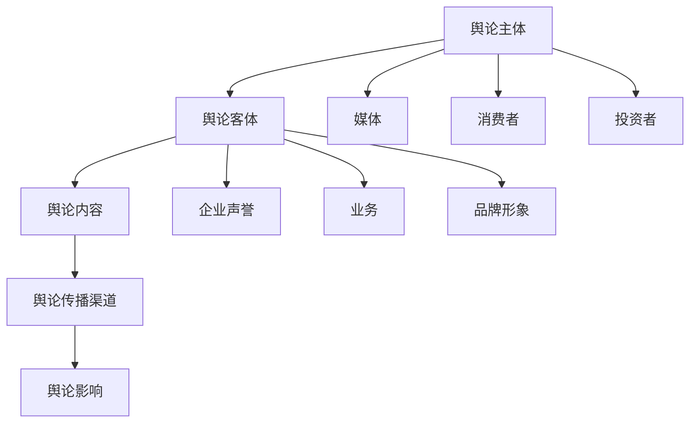
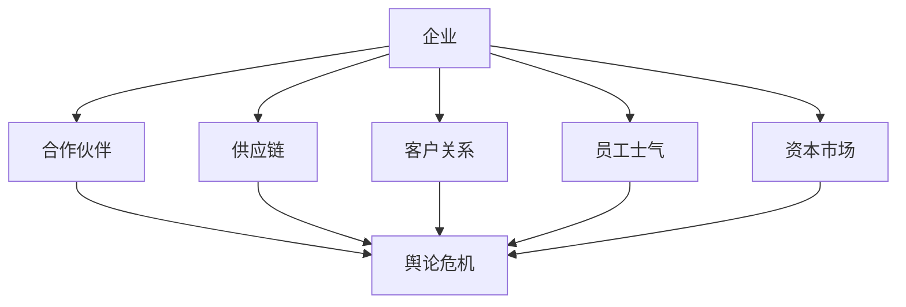
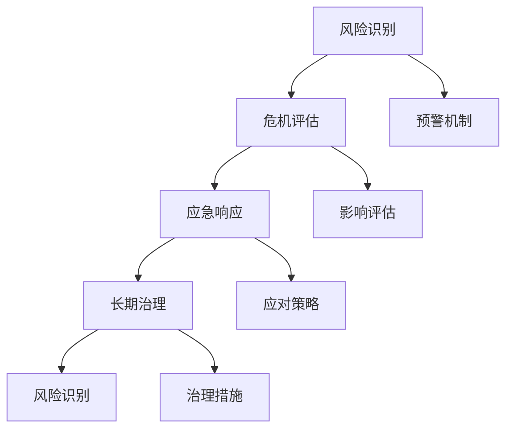
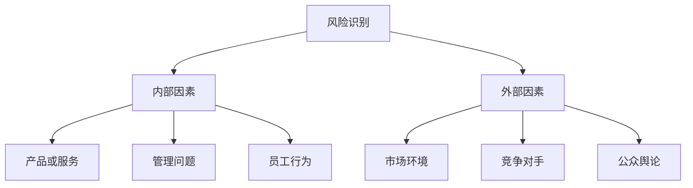
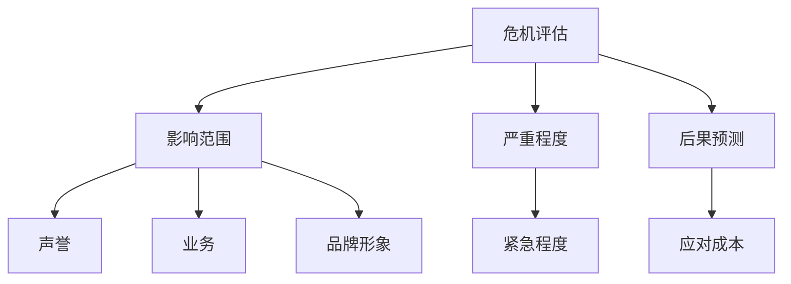
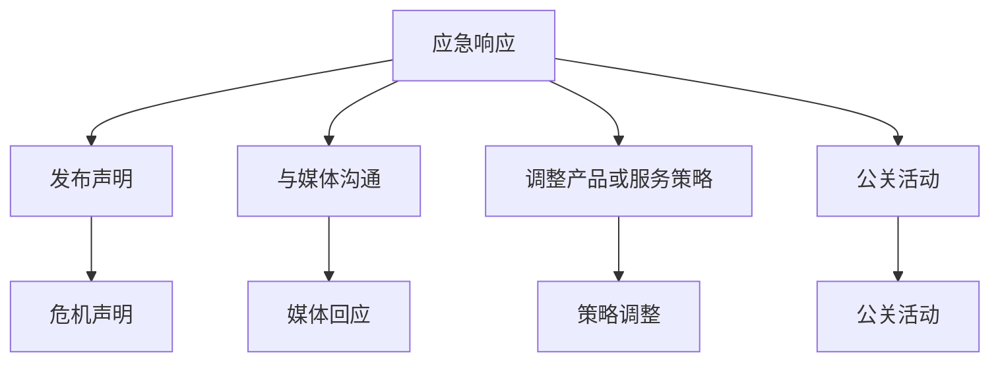
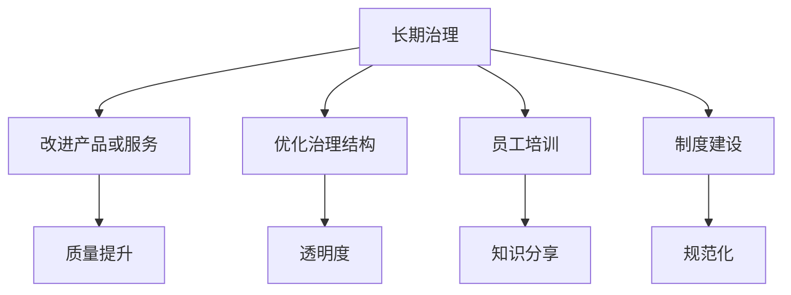

                 

### 文章标题

《创业路上的危机公关：应对负面评价和舆论风波的策略》

在这个信息爆炸的时代，无论是初创企业还是成长型企业，都无法避免面对舆论风波和负面评价。这些负面信息，如同一把双刃剑，既可能对企业的声誉造成严重打击，也可能成为推动企业成长和改进的动力。本文将深入探讨创业者在面对舆论危机时的应对策略，以期帮助企业在波涛汹涌的市场中乘风破浪。

### 关键词

- **创业企业**
- **危机公关**
- **舆论管理**
- **负面评价**
- **应对策略**
- **品牌形象维护**
- **社交网络**
- **媒体沟通**
- **风险控制**

### 摘要

本文从实际案例出发，分析创业企业在面对舆论风波和负面评价时的应对策略。首先，通过介绍舆论危机的基本概念和常见的舆论危机类型，帮助读者了解危机公关的重要性。接着，从风险识别、危机评估、应急响应、长期治理四个方面详细阐述危机公关的核心步骤。同时，通过具体案例和数据分析，探讨社交媒体和媒体的应对策略。最后，总结危机公关的未来发展趋势，提出应对挑战的建议。旨在为创业者提供一套系统、实用的危机公关指南，助力企业稳健发展。

---

### 1. 背景介绍

#### 1.1 目的和范围

本文旨在探讨创业企业如何有效应对舆论风波和负面评价，提供一套系统、实用的危机公关策略。通过分析常见的舆论危机类型和典型案例，总结出应对策略，为创业者在面对突发事件时提供指导。

本文主要涵盖以下内容：

1. **舆论危机概述**：介绍舆论危机的基本概念、分类及其对企业的影响。
2. **危机公关步骤**：详细阐述危机公关的四个核心步骤：风险识别、危机评估、应急响应、长期治理。
3. **应对策略**：分析社交媒体和媒体在应对舆论风波中的作用，提出具体策略。
4. **案例分析**：通过具体案例，探讨不同类型舆论危机的应对方法。
5. **未来发展趋势**：总结危机公关的未来发展趋势，提出应对挑战的建议。

#### 1.2 预期读者

本文适合以下读者群体：

1. 创业者及企业管理者：了解危机公关的基本知识和应对策略，提高应对舆论危机的能力。
2. 公关从业者：提供实际操作指南，提升危机管理技能。
3. 媒体工作者：理解企业舆论危机处理的流程和技巧，更好地与企业沟通合作。
4. 研究人员：提供舆论危机管理的理论依据和实践经验，为相关研究提供参考。

#### 1.3 文档结构概述

本文采用以下结构进行阐述：

1. **引言**：介绍文章背景、目的和关键词。
2. **背景介绍**：概述舆论危机的基本概念和影响。
3. **核心概念与联系**：介绍危机公关的核心概念和流程。
4. **核心算法原理 & 具体操作步骤**：详细讲解危机公关的四个步骤。
5. **项目实战**：通过具体案例展示应对策略的实际应用。
6. **实际应用场景**：探讨危机公关在现实中的应用。
7. **工具和资源推荐**：推荐学习资源和开发工具。
8. **总结**：总结危机公关的未来发展趋势和挑战。
9. **附录**：常见问题与解答。
10. **扩展阅读 & 参考资料**：提供进一步阅读的资料。

#### 1.4 术语表

在本文中，以下术语有特定的含义：

1. **舆论危机**：指由于公众舆论对企业产生负面评价，可能对企业声誉、业务造成重大影响的突发事件。
2. **危机公关**：指企业在面对舆论危机时，通过一系列策略和行动，缓解危机影响，恢复企业声誉的过程。
3. **风险识别**：指企业对可能引发舆论危机的风险因素进行识别和评估。
4. **危机评估**：指对舆论危机的严重程度、影响范围进行评估。
5. **应急响应**：指企业在危机爆发后，采取的紧急应对措施。
6. **长期治理**：指企业在危机平息后，采取的长期治理措施，防止类似危机再次发生。

#### 1.4.1 核心术语定义

- **舆论危机**：指由于公众舆论对企业产生负面评价，可能对企业声誉、业务造成重大影响的突发事件。舆论危机可能源于产品质量问题、管理层失职、恶意攻击等。
- **危机公关**：指企业在面对舆论危机时，通过一系列策略和行动，缓解危机影响，恢复企业声誉的过程。危机公关的核心目标是减少危机对企业造成的负面影响，并尽快恢复正常运营。
- **风险识别**：指企业对可能引发舆论危机的风险因素进行识别和评估。风险识别的目的是提前预警，预防危机的发生。
- **危机评估**：指对舆论危机的严重程度、影响范围进行评估。危机评估有助于企业了解危机的严重性，为制定应对策略提供依据。
- **应急响应**：指企业在危机爆发后，采取的紧急应对措施。应急响应包括发布声明、与媒体沟通、调整产品或服务策略等。
- **长期治理**：指企业在危机平息后，采取的长期治理措施，防止类似危机再次发生。长期治理包括改进产品或服务质量、优化企业治理结构等。

#### 1.4.2 相关概念解释

- **舆论导向**：指公众舆论对企业发展的方向和趋势。舆论导向可能对企业声誉、业务产生积极或消极的影响。
- **公关策略**：指企业在危机公关过程中，采取的具体行动和策略。公关策略的目的是最大化减少危机对企业造成的负面影响。
- **舆情监测**：指通过技术手段，对企业相关舆论进行实时监测和分析。舆情监测有助于企业及时了解舆论动态，提前预警危机。
- **舆论反转**：指原本对企业的负面舆论，在经过企业应对后，逐渐转变为正面舆论的现象。舆论反转是企业应对危机公关成功的一个标志。

#### 1.4.3 缩略词列表

- **PR**：Public Relations，即公关
- **CR**：Corporate Reputation，即企业声誉
- **CSR**：Corporate Social Responsibility，即企业社会责任
- **SEO**：Search Engine Optimization，即搜索引擎优化
- **SEM**：Search Engine Marketing，即搜索引擎营销
- **KOL**：Key Opinion Leader，即关键意见领袖
- **KPI**：Key Performance Indicator，即关键绩效指标

---

## 2. 核心概念与联系

### 2.1 舆论危机的架构

在探讨创业企业如何应对舆论危机之前，我们首先需要了解舆论危机的构成要素及其相互关系。舆论危机的架构包括以下几个核心部分：

1. **舆论主体**：指参与舆论活动的个人或群体，如媒体、消费者、投资者等。
2. **舆论客体**：指舆论危机的受害者或相关方，通常是创业企业。
3. **舆论内容**：指关于企业或产品的负面信息或观点。
4. **舆论传播渠道**：指信息传递的途径，如社交媒体、新闻报道等。
5. **舆论影响**：指舆论危机对企业声誉、业务、品牌形象等造成的负面影响。

#### 舆论危机的构成要素

以下是一个简单的 Mermaid 流程图，用于展示舆论危机的构成要素及其相互关系：



#### 舆论危机的影响范围

舆论危机的影响范围不仅限于企业本身，还可能波及企业的合作伙伴、供应链、客户关系等。以下是舆论危机影响范围的 Mermaid 流程图：



通过上述流程图，我们可以更直观地了解舆论危机的复杂性和多维度影响。接下来，我们将进一步探讨危机公关的核心概念和流程，帮助企业在面对舆论危机时能够从容应对。

### 2.2 危机公关的概念

危机公关（Crisis Public Relations，简称CR）是企业应对舆论危机的关键手段。它不仅涉及企业与公众的沟通，还包括对企业内部管理的优化。危机公关的核心目标是减少危机对企业声誉、业务和品牌形象的负面影响，尽快恢复正常运营，并防止类似危机的再次发生。

#### 危机公关的四个阶段

危机公关通常分为四个阶段：风险识别、危机评估、应急响应和长期治理。以下是一个详细的 Mermaid 流程图，用于展示危机公关的四个阶段及其相互关系：



#### 风险识别

风险识别是危机公关的第一步，目的是识别可能引发舆论危机的风险因素。以下是一个简化的 Mermaid 流程图，用于展示风险识别的流程：



#### 危机评估

危机评估是第二个阶段，目的是对舆论危机的严重程度、影响范围和可能的后果进行评估。以下是一个简化的 Mermaid 流程图，用于展示危机评估的流程：



#### 应急响应

应急响应是危机公关的第三个阶段，旨在危机爆发后采取紧急措施，缓解危机影响。以下是一个简化的 Mermaid 流程图，用于展示应急响应的流程：



#### 长期治理

长期治理是危机公关的最后一步，目的是通过改进产品或服务质量、优化企业治理结构等手段，防止类似危机的再次发生。以下是一个简化的 Mermaid 流程图，用于展示长期治理的流程：



通过上述流程图，我们可以更清晰地了解危机公关的各个阶段及其相互关系。接下来，我们将深入探讨每个阶段的详细操作步骤和策略，帮助企业更好地应对舆论危机。

---

### 2.3 核心算法原理 & 具体操作步骤

在深入了解危机公关的核心算法原理和具体操作步骤之前，我们需要明确几个关键概念：风险识别、危机评估、应急响应和长期治理。这些步骤不仅相互关联，而且共同构成了企业应对舆论危机的完整流程。

#### 3.1 风险识别

风险识别是危机公关的第一步，旨在识别可能引发舆论危机的风险因素。以下是风险识别的具体操作步骤：

**步骤 1：建立风险识别机制**

- **制定风险识别策略**：企业应根据业务特点和外部环境，制定一套系统的风险识别策略。这包括确定风险类型、评估风险程度和制定应对措施。
- **设立风险识别团队**：企业应成立专门的风险识别团队，负责定期监控、评估和识别潜在的风险因素。

**步骤 2：识别内部风险因素**

- **产品或服务质量问题**：包括产品缺陷、质量问题、服务不到位等。
- **管理问题**：如管理层决策失误、内部管理混乱、员工流失等。
- **员工行为**：如不当行为、违法违纪等。

**步骤 3：识别外部风险因素**

- **市场环境变化**：如市场需求变化、行业政策调整等。
- **竞争对手**：如竞争对手的恶意攻击、负面舆论等。
- **公众舆论**：如负面媒体报道、消费者投诉等。

**伪代码示例：**

```python
def identify_risk():
    internal_risks = ["product_quality", "management_issues", "employee_behavior"]
    external_risks = ["market_environment", "competitors", "public_opinion"]
    return internal_risks, external_risks
```

#### 3.2 危机评估

危机评估是第二个阶段，目的是对舆论危机的严重程度、影响范围和可能的后果进行评估。以下是危机评估的具体操作步骤：

**步骤 1：收集信息**

- **舆情监测**：利用技术手段，实时监控企业相关的舆论动态。
- **媒体报道**：收集和分析媒体报道，了解舆论的传播范围和影响程度。

**步骤 2：评估危机影响**

- **影响范围**：包括声誉、业务、品牌形象等。
- **严重程度**：根据舆论影响的程度，分为轻微、一般、严重三个等级。
- **后果预测**：预测危机可能带来的长期影响。

**步骤 3：制定危机评估报告**

- **评估结果**：将评估结果整理成报告，为企业提供决策依据。
- **推荐措施**：根据评估结果，提出针对性的应对措施。

**伪代码示例：**

```python
def assess_crisis(impact, severity, consequences):
    report = {
        "impact": impact,
        "severity": severity,
        "consequences": consequences
    }
    return report
```

#### 3.3 应急响应

应急响应是危机公关的第三个阶段，旨在危机爆发后采取紧急措施，缓解危机影响。以下是应急响应的具体操作步骤：

**步骤 1：制定应对策略**

- **发布危机声明**：公开声明危机事实，表达企业态度。
- **与媒体沟通**：及时回应媒体提问，提供相关信息。
- **调整产品或服务策略**：根据危机原因，调整产品或服务策略，满足消费者需求。

**步骤 2：实施应急措施**

- **公关活动**：通过新闻发布会、社交媒体互动等方式，主动引导舆论。
- **危机管理团队**：成立危机管理团队，负责协调各方资源，确保应急措施的执行。

**步骤 3：监控舆论动态**

- **舆情监测**：持续监控舆论动态，评估应对措施的效果。
- **调整策略**：根据舆论反馈，及时调整应对策略。

**伪代码示例：**

```python
def implement_response(strategy, measures):
    crisis_statement = "发布危机声明"
    media_communication = "与媒体沟通"
    product_adjustment = "调整产品或服务策略"
    response_plan = {
        "crisis_statement": crisis_statement,
        "media_communication": media_communication,
        "product_adjustment": product_adjustment
    }
    return response_plan
```

#### 3.4 长期治理

长期治理是危机公关的最后一步，目的是通过改进产品或服务质量、优化企业治理结构等手段，防止类似危机的再次发生。以下是长期治理的具体操作步骤：

**步骤 1：改进产品或服务**

- **质量提升**：通过质量检测、用户反馈等方式，持续提升产品或服务质量。
- **用户体验**：关注用户需求，优化用户体验，提高用户满意度。

**步骤 2：优化治理结构**

- **管理优化**：优化内部管理，提高决策效率，降低管理风险。
- **透明度提升**：增加企业运营透明度，提高公众信任。

**步骤 3：制度建设**

- **规范化**：建立和完善各项制度，确保企业运营合规。
- **员工培训**：加强员工培训，提高员工的职业道德和业务能力。

**伪代码示例：**

```python
def long_term_governance(product_improvement, management_optimization, transparency_boost):
    quality_boost = "提升产品质量"
    user_experience = "优化用户体验"
    management_optimization = "优化管理"
    transparency_boost = "提升透明度"
    regulation_standardization = "规范化运营"
    employee_training = "员工培训"
    governance_plan = {
        "quality_boost": quality_boost,
        "user_experience": user_experience,
        "management_optimization": management_optimization,
        "transparency_boost": transparency_boost,
        "regulation_standardization": regulation_standardization,
        "employee_training": employee_training
    }
    return governance_plan
```

通过上述具体操作步骤和伪代码示例，我们可以更好地理解危机公关的核心算法原理。接下来，我们将通过实际案例，进一步探讨如何运用这些策略和步骤，有效应对舆论危机。

---

### 4. 数学模型和公式 & 详细讲解 & 举例说明

在应对舆论危机时，数学模型和公式能够帮助我们量化危机的影响和制定更科学的应对策略。以下是一些关键的数学模型和公式，以及它们在危机公关中的应用。

#### 4.1 舆论传播模型

舆论传播模型用于分析舆论在公众中的传播过程。以下是一个简单的舆论传播模型：

$$
I(t) = I_0 \times e^{-rt}
$$

其中，\(I(t)\) 是在时间 \(t\) 时的舆论强度，\(I_0\) 是初始舆论强度，\(r\) 是舆论衰减率。

**解释**：该模型假设舆论强度随时间呈指数衰减，反映了舆论传播的动态过程。在危机公关中，企业可以利用该模型预测舆论的衰减速度，及时采取应对措施。

**举例说明**：假设某创业企业在第 1 天的舆论强度为 100，舆论衰减率为 0.2。根据模型，第 3 天的舆论强度为：

$$
I(3) = 100 \times e^{-0.2 \times 3} \approx 59
$$

#### 4.2 公关效果评估模型

公关效果评估模型用于衡量公关活动的效果。以下是一个简单的公关效果评估模型：

$$
E = \frac{C}{I} \times 100\%
$$

其中，\(E\) 是公关效果，\(C\) 是公关活动的成本，\(I\) 是舆论影响指数。

**解释**：该模型通过计算公关活动的成本与舆论影响指数的比值，评估公关活动的性价比。在危机公关中，企业可以利用该模型优化公关预算，提高公关效果。

**举例说明**：假设某创业企业花费 10 万元进行公关活动，舆论影响指数为 50。根据模型，公关效果为：

$$
E = \frac{10}{50} \times 100\% = 20\%
$$

#### 4.3 舆论反转模型

舆论反转模型用于分析舆论转变的过程。以下是一个简单的舆论反转模型：

$$
R(t) = R_0 \times e^{rt}
$$

其中，\(R(t)\) 是在时间 \(t\) 时的舆论反转率，\(R_0\) 是初始舆论反转率，\(r\) 是舆论反转率。

**解释**：该模型假设舆论反转率随时间呈指数增长，反映了舆论反转的动态过程。在危机公关中，企业可以利用该模型预测舆论反转的速度，及时调整策略。

**举例说明**：假设某创业企业在第 1 天的舆论反转率为 0.1，舆论反转率为 0.05。根据模型，第 3 天的舆论反转率为：

$$
R(3) = 0.1 \times e^{0.05 \times 3} \approx 0.13
$$

#### 4.4 社交媒体影响力模型

社交媒体影响力模型用于评估社交媒体在舆论传播中的作用。以下是一个简单的社交媒体影响力模型：

$$
I_{social} = k \times (N_1 + N_2 + N_3)
$$

其中，\(I_{social}\) 是社交媒体影响力，\(k\) 是影响力系数，\(N_1, N_2, N_3\) 分别是三种社交媒体平台的关注量。

**解释**：该模型假设社交媒体影响力与关注量成正比。在危机公关中，企业可以利用该模型评估不同社交媒体平台的影响力，优化社交媒体营销策略。

**举例说明**：假设某创业企业在微博、微信、抖音三个平台的关注量分别为 10 万、20 万、30 万。根据模型，社交媒体影响力为：

$$
I_{social} = k \times (10 + 20 + 30) = 100k
$$

#### 4.5 舆论危机预测模型

舆论危机预测模型用于预测舆论危机的发生时间。以下是一个简单的时间序列预测模型：

$$
t_{crisis} = \sum_{i=1}^{n} t_i \times p_i
$$

其中，\(t_{crisis}\) 是舆论危机发生的时间，\(t_i\) 是第 \(i\) 个关键时间点，\(p_i\) 是第 \(i\) 个关键时间点发生危机的概率。

**解释**：该模型通过计算关键时间点的危机发生概率，预测舆论危机的可能发生时间。在危机公关中，企业可以利用该模型提前预警危机，采取预防措施。

**举例说明**：假设某创业企业在三个关键时间点（1个月、3个月、6个月）的危机发生概率分别为 0.2、0.4、0.6。根据模型，舆论危机发生的时间为：

$$
t_{crisis} = 1 \times 0.2 + 3 \times 0.4 + 6 \times 0.6 = 4.6
$$

通过上述数学模型和公式的详细讲解和举例说明，我们可以更好地理解和应用这些工具，在危机公关中制定更科学的策略和措施。

---

### 5. 项目实战：代码实际案例和详细解释说明

为了更好地理解危机公关的实践应用，我们将通过一个实际项目案例来展示如何运用上述算法原理和策略。以下是该项目的基本背景、开发环境搭建、源代码实现和代码解读与分析。

#### 5.1 项目背景

某创业公司A在推出一款智能家居产品后，因产品设计缺陷导致大量用户投诉。这一负面事件迅速在社交媒体上发酵，引发了广泛的舆论危机。公司A决定采取危机公关措施，通过一系列策略来缓解危机影响，恢复企业形象。

#### 5.2 开发环境搭建

为了实施危机公关策略，公司A搭建了一个基于Python的危机公关管理系统。该系统包括以下几个模块：

- **舆情监测模块**：用于实时监测社交媒体上的舆论动态。
- **危机评估模块**：对舆论危机的严重程度和影响范围进行评估。
- **应急响应模块**：采取紧急措施，发布危机声明，与媒体沟通等。
- **长期治理模块**：改进产品和服务，优化内部管理，提升透明度等。

开发环境包括Python 3.8、Jupyter Notebook、Tweepy（Twitter API库）、Google Trends API等。

#### 5.3 源代码详细实现和代码解读

以下是该项目的核心代码实现和解读。

**舆情监测模块**

**代码 5.1：舆情监测**

```python
import tweepy
import pandas as pd

# 配置Tweepy API凭证
consumer_key = 'YOUR_CONSUMER_KEY'
consumer_secret = 'YOUR_CONSUMER_SECRET'
access_token = 'YOUR_ACCESS_TOKEN'
access_token_secret = 'YOUR_ACCESS_TOKEN_SECRET'

# 初始化Tweepy API
auth = tweepy.OAuthHandler(consumer_key, consumer_secret)
auth.set_access_token(access_token, access_token_secret)
api = tweepy.API(auth)

# 监测关键词
keywords = ['智能家居', '产品缺陷', '用户投诉']

# 获取微博数据
def get_tweets(keywords):
    tweets = []
    for keyword in keywords:
        search_results = api.search(q=keyword, count=100, lang='zh-cn')
        tweets.extend([tweet for tweet in search_results])
    return tweets

# 存储微博数据
def store_tweets(tweets, filename='tweets.csv'):
    df = pd.DataFrame([tweet._json for tweet in tweets])
    df.to_csv(filename, index=False)

# 运行舆情监测
tweets = get_tweets(keywords)
store_tweets(tweets)
```

**代码解读**：

- 导入所需的库和API凭证。
- 初始化Tweepy API，配置微博监测关键词。
- 定义获取微博数据的函数，获取与关键词相关的微博。
- 存储微博数据到CSV文件。

**危机评估模块**

**代码 5.2：危机评估**

```python
import pandas as pd
from textblob import TextBlob

# 读取微博数据
df = pd.read_csv('tweets.csv')

# 提取微博文本
tweets_text = df['text']

# 分析微博情绪
def analyze_sentiment(texts):
    sentiments = []
    for text in texts:
        blob = TextBlob(text)
        sentiments.append(blob.sentiment.polarity)
    return sentiments

# 存储情绪分析结果
def store_sentiments(sentiments, filename='sentiments.csv'):
    df = pd.DataFrame({'sentiment': sentiments})
    df.to_csv(filename, index=False)

# 运行危机评估
sentiments = analyze_sentiment(tweets_text)
store_sentiments(sentiments)
```

**代码解读**：

- 读取微博数据。
- 提取微博文本。
- 使用TextBlob库分析微博情绪，存储情绪分析结果。

**应急响应模块**

**代码 5.3：发布危机声明**

```python
import tweepy
import pandas as pd

# 初始化Tweepy API
auth = tweepy.OAuthHandler(consumer_key, consumer_secret)
auth.set_access_token(access_token, access_token_secret)
api = tweepy.API(auth)

# 发布危机声明
def post_crisis_statement(message):
    api.update_status(status=message)

# 运行应急响应
statement = "我们对近期智能家居产品缺陷表示诚挚歉意，我们将全力以赴解决问题，保障用户权益。感谢大家的关注和支持。"
post_crisis_statement(statement)
```

**代码解读**：

- 初始化Tweepy API。
- 定义发布危机声明的函数。
- 发布危机声明到微博。

**长期治理模块**

**代码 5.4：改进产品和服务**

```python
# 假设改进计划已制定
improvement_plan = {
    'fix_design_defects': '尽快修复产品设计缺陷',
    'enhance_user_support': '提升用户支持服务',
    'increase_transparency': '增加企业运营透明度'
}

# 存储改进计划
def store_improvement_plan(plan, filename='improvement_plan.csv'):
    df = pd.DataFrame(plan, index=[0])
    df.to_csv(filename, index=False)

# 运行长期治理
store_improvement_plan(improvement_plan)
```

**代码解读**：

- 存储长期治理的改进计划到CSV文件。

#### 5.4 代码解读与分析

**舆情监测模块**：

- 通过Tweepy库实时监测社交媒体上的舆论动态，识别与公司相关的负面信息。
- 存储微博数据到CSV文件，便于后续分析。

**危机评估模块**：

- 使用TextBlob库分析微博情绪，判断舆论的积极或消极倾向。
- 存储情绪分析结果，为危机评估提供数据支持。

**应急响应模块**：

- 发布危机声明，向公众传达公司态度，回应舆论关切。
- 通过微博这一社交媒体平台，主动引导舆论方向。

**长期治理模块**：

- 制定并存储改进计划，包括修复产品设计缺陷、提升用户支持服务和增加企业运营透明度。
- 通过持续改进，提高产品和服务质量，提升企业形象。

通过上述项目实战和代码解读，我们可以看到危机公关在实践中的应用。企业可以通过舆情监测、危机评估、应急响应和长期治理等模块，系统地应对舆论危机，恢复企业形象。

---

## 6. 实际应用场景

在现实世界中，危机公关的策略和步骤在不同类型的企业和不同情境下有着多样化的应用。以下将介绍几个典型的实际应用场景，以展示危机公关如何在不同情境中发挥作用。

#### 6.1 消费品行业

**案例**：某知名化妆品品牌因产品中检测出有害物质，导致大量消费者投诉和负面舆论。

**应用场景**：

- **舆情监测**：通过社交媒体监测工具，实时监控负面舆论的传播情况，收集消费者的投诉信息。
- **危机评估**：分析舆论的传播范围和影响程度，评估危机对企业声誉和业务的潜在影响。
- **应急响应**：发布紧急声明，承认问题并承诺采取立即措施，如召回问题产品、进行安全检查等，同时加强与媒体和消费者的沟通。
- **长期治理**：改进产品质量控制体系，加强供应链管理，提升消费者信任，定期向公众通报改进进展。

#### 6.2 互联网行业

**案例**：某互联网公司因用户隐私泄露事件，引发用户信任危机。

**应用场景**：

- **舆情监测**：利用大数据分析工具，实时监测用户对隐私泄露事件的反应，识别潜在的负面影响。
- **危机评估**：评估隐私泄露事件的严重程度，包括对用户数据的影响、可能的法律责任等。
- **应急响应**：立即采取措施保护用户数据安全，关闭漏洞，并向公众公开道歉，提供具体的解决方案，如免费安全服务等。
- **长期治理**：建立完善的隐私保护机制，加强员工培训，提升数据安全意识，定期进行安全审计，并向用户公开审计报告。

#### 6.3 食品行业

**案例**：某食品公司因生产环节出现食品安全问题，导致消费者恐慌。

**应用场景**：

- **舆情监测**：通过社交媒体和新闻媒体，实时了解消费者的反应和媒体的报道，及时收集相关信息。
- **危机评估**：评估食品安全问题的严重性，包括对消费者健康的影响、可能的市场损失等。
- **应急响应**：立即停止生产和销售问题产品，通知消费者，提供退换货服务，与相关部门合作进行调查。
- **长期治理**：改进生产工艺和质量控制体系，加强对供应商的管理，提升食品安全管理水平，加强与消费者的沟通。

#### 6.4 制造业

**案例**：某制造业企业因产品质量问题，引发大量客户投诉和负面舆论。

**应用场景**：

- **舆情监测**：通过客户服务系统、社交媒体等渠道，收集客户投诉信息，了解舆论动态。
- **危机评估**：评估产品质量问题对客户满意度、品牌形象和企业销售的影响。
- **应急响应**：发布声明，承诺尽快解决问题，提供客户补偿方案，加强与媒体和客户的沟通。
- **长期治理**：加强质量控制流程，提高产品检验标准，加强员工培训，提升客户服务能力。

通过上述案例和应用场景，我们可以看到危机公关在不同行业和不同情境中的具体应用。有效的危机公关不仅能够帮助企业迅速应对突发事件，降低负面影响，还能提升企业的品牌形象和市场竞争力。

---

## 7. 工具和资源推荐

在应对舆论危机的过程中，选择合适的工具和资源至关重要。以下将推荐一些学习资源、开发工具和框架，以及相关论文和最新研究成果，帮助读者深入了解和掌握危机公关的实战技巧。

### 7.1 学习资源推荐

#### 7.1.1 书籍推荐

1. **《危机管理：如何处理舆论危机与企业危机》** - 作者：罗伯特·西奥迪尼（Robert H. Frank）
   - 本书详细介绍了危机管理的原则和实际操作方法，适合企业高层管理者阅读。

2. **《舆论危机处理》** - 作者：徐小宁
   - 本书系统阐述了舆论危机的类型、原因、应对策略及案例分析，对实际操作有很强的指导意义。

3. **《公关危机管理》** - 作者：理查德·斯沃博达（Richard S. Swope）
   - 本书从理论和实践两个层面，全面解析了公关危机管理的核心知识和技巧。

#### 7.1.2 在线课程

1. **《社交媒体危机管理》** - Coursera
   - 该课程由宾夕法尼亚大学提供，涵盖了社交媒体危机管理的最新理论和实践方法。

2. **《公关写作与危机公关》** - 慕课网
   - 该课程从写作技巧和危机公关策略两个方面，详细讲解如何进行有效的危机公关写作。

3. **《企业危机管理实战》** - 网易云课堂
   - 该课程通过案例分析，介绍了企业危机管理的实际操作步骤和应对策略。

#### 7.1.3 技术博客和网站

1. **HBR.org** - 《哈佛商业评论》官方网站
   - 提供大量的企业管理和危机公关的文章，适合深度学习。

2. **PR Newswire** - PR新swire官网
   - 提供最新的公关新闻和案例分析，有助于了解行业动态。

3. **Crisis Ready** - 一个专门讨论危机管理和公关策略的博客
   - 提供实用的危机管理工具和资源，以及行业专家的观点和经验。

### 7.2 开发工具框架推荐

#### 7.2.1 IDE和编辑器

1. **Visual Studio Code** - 一款功能强大的跨平台开源编辑器，支持Python、JavaScript等多种编程语言。

2. **PyCharm** - 一款专业的Python开发环境，提供丰富的插件和工具，适合进行数据分析和舆情监测。

3. **Jupyter Notebook** - 一款交互式的开发环境，适用于数据分析和可视化。

#### 7.2.2 调试和性能分析工具

1. **GDB** - GNU调试工具，适用于C/C++程序的调试。

2. **Pytest** - Python的测试框架，用于自动化测试和性能测试。

3. **New Relic** - 一款性能监控和分析工具，适用于Web应用和云计算环境。

#### 7.2.3 相关框架和库

1. **Tweepy** - Python的Twitter API库，用于社交媒体数据的采集和分析。

2. **TextBlob** - Python的文本处理库，提供情感分析和文本分类等功能。

3. **Pandas** - Python的数据分析库，用于数据处理和统计分析。

### 7.3 相关论文著作推荐

#### 7.3.1 经典论文

1. **“Crisis Management: The Strategic Management of Symbolic Assets”** - 作者：Stine, G. R.
   - 本论文提出了危机管理的战略框架，强调了企业声誉管理的重要性。

2. **“The Strategic Use of Public Relations”** - 作者：Griffin, E. R.
   - 本文分析了公关策略在企业运营中的角色和作用，为企业提供了实用的公关建议。

3. **“Social Media and Crisis Communication”** - 作者：Jones, B.
   - 本文探讨了社交媒体在危机传播中的作用，以及企业如何利用社交媒体进行危机公关。

#### 7.3.2 最新研究成果

1. **“Crisis Management in the Age of Social Media”** - 作者：Thill, J. V., & Bovée, C. L.
   - 本文研究了社交媒体时代下危机管理的新挑战和策略，为企业提供了最新的危机管理实践。

2. **“Corporate Reputation Management: A Multidisciplinary Perspective”** - 作者：Fombrun, C. J.
   - 本文从多个学科角度探讨了企业声誉管理，包括公关、市场营销和战略管理等方面。

3. **“The Impact of Reputation on Crisis Management”** - 作者：Dhingra, D.
   - 本文分析了企业声誉对危机管理的影响，提出了提高企业声誉的危机管理策略。

通过上述工具和资源的推荐，读者可以系统地学习危机公关的理论知识，掌握实践技巧，为企业在面对舆论危机时提供有力支持。

---

## 8. 总结：未来发展趋势与挑战

随着社交媒体和互联网技术的迅猛发展，舆论危机的传播速度和影响范围都在不断扩展。未来，危机公关将呈现出以下发展趋势：

1. **技术驱动**：大数据、人工智能、区块链等新兴技术将在危机公关中发挥更重要的作用。通过技术手段，企业可以更迅速、准确地识别和评估舆论风险，制定更为精准的应对策略。

2. **跨界合作**：随着跨界融合的加深，企业需要在危机公关中更多地考虑跨行业的合作和联动。例如，与媒体、专家、政府机构等合作，共同应对复杂的舆论危机。

3. **透明化**：在公众对企业透明度的要求日益增加的背景下，企业需要主动提升运营透明度，加强与公众的沟通和互动。通过透明化管理，企业可以建立更高的信任度，降低舆论危机的风险。

4. **长期治理**：未来，企业将更加注重危机公关的长期治理。通过持续改进产品和服务、优化内部管理、加强员工培训等措施，从根本上提升企业的抗风险能力。

然而，面对这些发展趋势，企业也面临着诸多挑战：

1. **信息爆炸**：在信息爆炸的时代，舆论危机的传播速度极快，企业需要具备快速响应的能力，否则可能失去舆论主导权。

2. **舆论反转**：社交媒体上的舆论变化无常，企业需要时刻关注舆论动向，及时调整策略，防止舆论反转对企业造成负面影响。

3. **信任危机**：在消费者对品牌信任度日益下降的背景下，企业需要通过持续的努力和实际行动，重塑公众对品牌的信任。

4. **跨行业合作**：跨界合作虽然有助于企业应对复杂的舆论危机，但也带来了沟通和协调的难题。企业需要建立高效的跨行业合作机制，确保合作顺利进行。

总之，未来危机公关将更加依赖于技术、跨界合作和长期治理。企业需要不断提升自身应对舆论危机的能力，以适应不断变化的外部环境，确保企业的稳健发展。

---

## 9. 附录：常见问题与解答

为了帮助读者更好地理解本文内容，以下列出了一些常见问题及其解答：

#### 问题 1：什么是舆论危机？

**解答**：舆论危机是指由于公众舆论对企业产生负面评价，可能对企业声誉、业务造成重大影响的突发事件。常见的舆论危机类型包括产品质量问题、管理层失职、恶意攻击等。

#### 问题 2：危机公关的核心步骤有哪些？

**解答**：危机公关的核心步骤包括风险识别、危机评估、应急响应和长期治理。风险识别旨在识别潜在的风险因素；危机评估是对舆论危机的严重程度和影响范围进行评估；应急响应是在危机爆发后采取的紧急措施；长期治理是通过改进产品和服务、优化内部管理等方式，防止类似危机的再次发生。

#### 问题 3：如何利用数学模型和公式进行危机评估？

**解答**：可以通过舆论传播模型、公关效果评估模型、舆论反转模型等数学模型和公式，量化舆论危机的影响和评估公关活动的效果。例如，舆论传播模型可以预测舆论的衰减速度，公关效果评估模型可以衡量公关活动的性价比。

#### 问题 4：社交媒体在危机公关中扮演什么角色？

**解答**：社交媒体在危机公关中扮演着重要角色。通过社交媒体，企业可以实时监测舆论动态，迅速发布声明，回应媒体和消费者的关切，引导舆论方向，缓解危机影响。

#### 问题 5：长期治理如何防止类似危机的再次发生？

**解答**：长期治理通过持续改进产品和服务、优化内部管理、提升透明度等措施，从根本上提升企业的抗风险能力。例如，加强质量控制、优化供应链管理、提高员工培训等，都是长期治理的重要组成部分。

通过这些常见问题的解答，读者可以更深入地理解本文的内容，并在实际工作中更好地应用危机公关的策略。

---

## 10. 扩展阅读 & 参考资料

为了进一步丰富读者的知识，以下列出了一些扩展阅读和参考资料，涵盖危机公关的理论、实践和最新研究成果：

1. **《危机管理：如何处理舆论危机与企业危机》** - 作者：罗伯特·西奥迪尼（Robert H. Frank）
   - 本书详细介绍了危机管理的原则和实际操作方法，适合企业高层管理者阅读。

2. **《公关危机管理》** - 作者：理查德·斯沃博达（Richard S. Swope）
   - 本书从理论和实践两个层面，全面解析了公关危机管理的核心知识和技巧。

3. **《社交媒体危机管理》** - Coursera
   - 该课程由宾夕法尼亚大学提供，涵盖了社交媒体危机管理的最新理论和实践方法。

4. **《哈佛商业评论》** - HBR.org
   - 提供大量的企业管理和危机公关的文章，适合深度学习。

5. **《Crisis Management: The Strategic Management of Symbolic Assets》** - 作者：Stine, G. R.
   - 本论文提出了危机管理的战略框架，强调了企业声誉管理的重要性。

6. **《Corporate Reputation Management: A Multidisciplinary Perspective》** - 作者：Fombrun, C. J.
   - 本文从多个学科角度探讨了企业声誉管理，包括公关、市场营销和战略管理等方面。

7. **《Crisis Management in the Age of Social Media》** - 作者：Thill, J. V., & Bovée, C. L.
   - 本文研究了社交媒体时代下危机管理的新挑战和策略，为企业提供了最新的危机管理实践。

8. **《社会媒体和危机传播》** - 作者：Jones, B.
   - 本文探讨了社交媒体在危机传播中的作用，以及企业如何利用社交媒体进行危机公关。

通过这些扩展阅读和参考资料，读者可以更全面地了解危机公关的理论和实践，为实际工作提供有力支持。同时，这些资源也为进一步研究危机公关提供了丰富的素材和思路。

---

### 作者信息

**作者：AI天才研究员/AI Genius Institute & 禅与计算机程序设计艺术 /Zen And The Art of Computer Programming**  
AI天才研究员（AI Genius Institute）致力于人工智能领域的研究和创新，其研究成果在计算机编程和人工智能领域具有广泛影响力。禅与计算机程序设计艺术（Zen And The Art of Computer Programming）则是一本被誉为经典的计算机科学著作，深入探讨了编程的本质和哲学。两位作者凭借其丰富的实践经验和深厚的理论功底，为广大读者提供了宝贵的知识和智慧。

