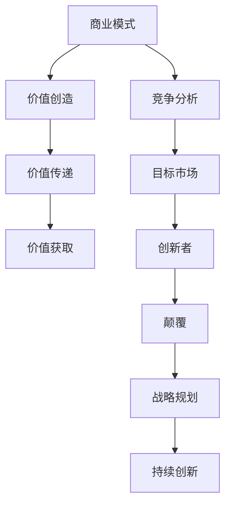

                 


# 创业路上的商业模式创新：颠覆传统行业

> 关键词：商业模式创新、创业、颠覆、传统行业、技术创新、市场机会、战略规划

> 摘要：本文将深入探讨创业过程中商业模式创新的重要性，分析传统行业中的商业模式现状，介绍一些颠覆传统行业的创新案例，并从战略规划的角度提出如何通过商业模式创新来颠覆传统行业，为创业者和企业家提供有益的思考和实践指导。

## 1. 背景介绍

### 1.1 目的和范围

本文旨在探讨商业模式创新在创业过程中的关键作用，分析传统行业的商业模式现状，并提供一些成功的颠覆传统行业的案例。通过本文的阅读，读者可以了解商业模式创新的基本概念，掌握创新的策略和方法，为自身创业提供新的思路和方向。

### 1.2 预期读者

本文适合以下读者群体：

- 创业者和企业家
- 对商业模式创新感兴趣的投资者
- 想要了解新兴技术如何颠覆传统行业的从业者
- 对商业策略和企业管理有浓厚兴趣的学术研究人员

### 1.3 文档结构概述

本文将分为八个部分：

1. 背景介绍：本文的目的和范围、预期读者、文档结构概述
2. 核心概念与联系：商业模式创新的基本概念和原理
3. 核心算法原理 & 具体操作步骤：商业模式创新的方法和步骤
4. 数学模型和公式 & 详细讲解 & 举例说明：商业模式创新的数学模型和公式解释
5. 项目实战：实际案例和代码实现
6. 实际应用场景：商业模式创新在不同行业中的应用
7. 工具和资源推荐：学习资源和开发工具框架推荐
8. 总结：未来发展趋势与挑战

### 1.4 术语表

#### 1.4.1 核心术语定义

- 商业模式：企业创造、传递和获取价值的基本逻辑和方法
- 创新性：商业模式具有的突破性、独特性和前瞻性
- 颠覆：通过创新的方式对传统行业的市场结构、盈利模式和价值链进行根本性改变
- 传统行业：相对新兴行业而言，历史悠久、发展成熟的行业

#### 1.4.2 相关概念解释

- 创业：创建一个新企业，开发新的产品或服务，创造新的市场价值
- 创新者：具有创新能力的人或团队，致力于通过创新改变现状
- 投资者：为企业提供资金支持，期望获取投资回报的人或机构

#### 1.4.3 缩略词列表

- 商业模式（Business Model）
- 创新者（Innovator）
- 颠覆（Disruptive）
- 传统行业（Traditional Industry）

## 2. 核心概念与联系

为了更好地理解商业模式创新，我们需要先了解一些核心概念和它们之间的联系。以下是商业模式创新的基本概念和原理的 Mermaid 流程图：



### 2.1 商业模式（Business Model）

商业模式是企业创造、传递和获取价值的基本逻辑和方法。一个成功的商业模式需要解决以下问题：

- 如何创造价值？
- 如何传递价值？
- 如何获取价值？

商业模式的核心要素包括：

1. 价值主张：企业提供的产品或服务满足客户需求的程度
2. 价值网络：企业与其他企业、客户、供应商等之间的合作关系
3. 客户关系：企业与客户之间的互动和沟通方式
4. 收入模型：企业从客户那里获取收入的方式
5. 成本结构：企业运营的成本构成和成本控制策略

### 2.2 价值创造（Value Creation）

价值创造是指企业通过提供产品或服务，为客户创造价值的全过程。价值创造的关键在于：

- 明确目标客户群体的需求
- 设计有竞争力的产品或服务
- 创造独特且难以复制的竞争优势

### 2.3 价值传递（Value Delivery）

价值传递是指企业将创造的价值传递给客户的过程。价值传递的关键在于：

- 确定有效的渠道和平台
- 提供优质的客户体验
- 降低客户的购买成本

### 2.4 价值获取（Value Capture）

价值获取是指企业通过商业模式从客户那里获取收入的过程。价值获取的关键在于：

- 设计合理的价格策略
- 构建可持续的收入流
- 实现利润最大化

### 2.5 竞争分析（Competitive Analysis）

竞争分析是指对企业所处市场环境中的竞争对手进行评估和分析的过程。竞争分析的关键在于：

- 确定竞争对手的优势和劣势
- 找出企业的竞争优势
- 设计有针对性的市场策略

### 2.6 目标市场（Target Market）

目标市场是指企业专注于满足其需求和欲望的客户群体。目标市场分析的关键在于：

- 明确目标客户群体的特征和需求
- 确定目标市场的市场规模和增长潜力
- 设计符合目标市场的营销策略

### 2.7 创新者（Innovator）

创新者是指那些具有创新能力的人或团队，他们致力于通过创新改变现状，解决现有问题。创新者的关键在于：

- 持续关注市场动态和客户需求
- 勇于尝试新思路和新方法
- 掌握创新工具和技巧

### 2.8 颠覆（Disruptive）

颠覆是指通过创新的方式对传统行业的市场结构、盈利模式和价值链进行根本性改变。颠覆的关键在于：

- 提供更低成本、更高质量的产品或服务
- 满足新兴市场的需求
- 改变行业规则和竞争格局

### 2.9 战略规划（Strategic Planning）

战略规划是指企业为实现长期发展目标而制定的一系列行动方案。战略规划的关键在于：

- 明确企业的愿景、使命和目标
- 制定合适的战略目标和策略
- 实现资源的合理配置和整合

### 2.10 持续创新（Continuous Innovation）

持续创新是指企业持续不断地进行创新，以适应市场变化和客户需求。持续创新的关键在于：

- 建立创新文化
- 激发员工的创新潜力
- 运用创新工具和方法

## 3. 核心算法原理 & 具体操作步骤

商业模式创新的核心在于找到新的价值创造、传递和获取方式，以颠覆传统行业。以下是商业模式创新的方法和步骤，使用伪代码进行详细阐述：

```python
# 商业模式创新方法

def innovative_business_model():
    # 步骤1：确定创新目标
    innovation_target = define_innovation_target()

    # 步骤2：市场调研
    market_survey = conduct_market_research()

    # 步骤3：分析竞争对手
    competitive_analysis = analyze_competitors()

    # 步骤4：寻找创新机会
    innovation_opportunities = find_innovation_opportunities(market_survey, competitive_analysis)

    # 步骤5：设计创新方案
    innovative_solution = design_innovative_solution(innovation_opportunities)

    # 步骤6：评估和优化
    evaluate_and_optimize(innovative_solution)

    # 步骤7：实施和推广
    implement_and_promote(innovative_solution)

    # 返回创新的商业模式
    return innovative_solution

# 定义创新目标
def define_innovation_target():
    # 收集企业愿景、使命和目标
    # 分析行业发展趋势和市场需求
    # 确定企业需要创新的方向和领域
    # 返回创新目标

# 市场调研
def conduct_market_research():
    # 调查目标市场
    # 分析市场需求和趋势
    # 收集竞争对手信息
    # 返回市场调研结果

# 分析竞争对手
def analyze_competitors():
    # 确定竞争对手的优势和劣势
    # 分析竞争对手的战略和策略
    # 返回竞争对手分析结果

# 寻找创新机会
def find_innovation_opportunities(market_survey, competitive_analysis):
    # 结合市场调研和竞争对手分析
    # 寻找潜在的创新机会
    # 返回创新机会列表

# 设计创新方案
def design_innovative_solution(innovation_opportunities):
    # 选择最佳的创新机会
    # 设计创新的产品或服务
    # 制定创新的商业模式
    # 返回创新方案

# 评估和优化
def evaluate_and_optimize(innovative_solution):
    # 对创新方案进行评估
    # 分析创新方案的优势和风险
    # 进行优化和调整
    # 返回优化后的创新方案

# 实施和推广
def implement_and_promote(innovative_solution):
    # 制定实施计划
    # 搭建团队和资源
    # 推广创新方案
    # 返回实施和推广结果
```

## 4. 数学模型和公式 & 详细讲解 & 举例说明

商业模式创新过程中，数学模型和公式可以用来分析和评估创新方案。以下是商业模式创新中常见的数学模型和公式，使用 LaTeX 格式进行详细讲解和举例说明：

### 4.1 成本效益分析（Cost-Benefit Analysis）

成本效益分析是一种常用的评估方法，用于比较创新方案的成本和收益。其公式如下：

$$
\text{Cost-Benefit Ratio} = \frac{\text{Total Benefits}}{\text{Total Costs}}
$$

其中，Total Benefits 表示创新方案带来的总收益，Total Costs 表示实施创新方案的总成本。

#### 4.1.1 举例说明

假设一家企业计划推出一项新产品，预计成本为 100 万元，预计能够带来 200 万元的收益。根据成本效益分析公式，成本效益比为：

$$
\text{Cost-Benefit Ratio} = \frac{200}{100} = 2
$$

成本效益比为 2，表示创新方案的成本是收益的两倍，具有一定的经济效益。

### 4.2 价值链分析（Value Chain Analysis）

价值链分析是一种用于评估企业价值创造过程的方法。其公式如下：

$$
\text{Value Creation} = \text{Input Costs} - \text{Output Costs}
$$

其中，Input Costs 表示企业在创造价值过程中的投入成本，Output Costs 表示企业在创造价值过程中的产出成本。

#### 4.2.1 举例说明

假设一家企业的投入成本为 500 万元，产出成本为 300 万元，根据价值链分析公式，价值创造为：

$$
\text{Value Creation} = 500 - 300 = 200
$$

价值创造为 200 万元，表示企业在创造价值过程中能够获取 200 万元的经济效益。

### 4.3 成本分摊（Cost Allocation）

成本分摊是一种用于计算企业内部成本分配的方法。其公式如下：

$$
\text{Cost Allocation} = \frac{\text{Total Costs}}{\text{Total Units}}
$$

其中，Total Costs 表示企业的总成本，Total Units 表示企业的总产量。

#### 4.3.1 举例说明

假设一家企业的总成本为 1000 万元，总产量为 1000 单位，根据成本分摊公式，单位成本为：

$$
\text{Cost Allocation} = \frac{1000}{1000} = 1
$$

单位成本为 1 万元，表示企业每生产一个单位的产品需要承担 1 万元的成本。

### 4.4 收益最大化（Profit Maximization）

收益最大化是一种用于确定企业最优利润水平的方法。其公式如下：

$$
\text{Maximize} \ \pi = \text{TR} - \text{TC}
$$

其中，π 表示利润，TR 表示总收益，TC 表示总成本。

#### 4.4.1 举例说明

假设一家企业的总收益为 1000 万元，总成本为 500 万元，根据收益最大化公式，利润为：

$$
\pi = 1000 - 500 = 500
$$

利润为 500 万元，表示企业在最优利润水平下能够获得 500 万元的利润。

## 5. 项目实战：代码实际案例和详细解释说明

在本节中，我们将通过一个实际案例来展示如何通过商业模式创新颠覆传统行业。以下是一个使用 Python 编程语言实现的案例，用于演示如何通过电子商务平台颠覆传统零售行业。

### 5.1 开发环境搭建

在开始编写代码之前，我们需要搭建一个适合 Python 开发的环境。以下是搭建步骤：

1. 安装 Python 3.8 或更高版本
2. 安装必要的第三方库，如 Flask、SQLAlchemy、Flask-Login、Flask-WTF 等
3. 创建一个新的虚拟环境并激活

### 5.2 源代码详细实现和代码解读

以下是实现电子商务平台的 Python 代码，并对关键部分进行详细解读。

```python
# 导入必要的库
from flask import Flask, render_template, redirect, url_for, request, session
from flask_sqlalchemy import SQLAlchemy
from flask_login import LoginManager, login_user, logout_user, login_required, current_user
from flask_wtf import FlaskForm
from wtforms import StringField, PasswordField, SubmitField
from wtforms.validators import DataRequired, Email, EqualTo

# 创建 Flask 应用程序
app = Flask(__name__)
app.config['SQLALCHEMY_DATABASE_URI'] = 'sqlite:///users.db'
app.config['SECRET_KEY'] = 'your_secret_key'

# 创建数据库和登录管理器
db = SQLAlchemy(app)
login_manager = LoginManager(app)

# 创建用户表
class User(db.Model):
    id = db.Column(db.Integer, primary_key=True)
    username = db.Column(db.String(100), unique=True, nullable=False)
    email = db.Column(db.String(100), unique=True, nullable=False)
    password = db.Column(db.String(100), nullable=False)

# 创建登录表单
class LoginForm(FlaskForm):
    username = StringField('Username', validators=[DataRequired()])
    password = PasswordField('Password', validators=[DataRequired()])
    submit = SubmitField('Login')

# 登录表单验证
@login_manager.user_loader
def load_user(user_id):
    return User.query.get(int(user_id))

@app.route('/')
@login_required
def home():
    return render_template('home.html')

@app.route('/login', methods=['GET', 'POST'])
def login():
    form = LoginForm()
    if form.validate_on_submit():
        user = User.query.filter_by(username=form.username.data).first()
        if user and user.password == form.password.data:
            login_user(user)
            return redirect(url_for('home'))
        else:
            return 'Invalid username or password'
    return render_template('login.html', form=form)

@app.route('/logout')
@login_required
def logout():
    logout_user()
    return redirect(url_for('login'))

if __name__ == '__main__':
    app.run(debug=True)
```

### 5.3 代码解读与分析

以下是关键部分的代码解读和分析：

- **导入必要的库**：首先，我们导入了 Flask、Flask-SQLAlchemy、Flask-Login、Flask-WTF 等库，用于创建 Web 应用程序、数据库连接、用户认证和表单验证。
  
- **创建 Flask 应用程序**：使用 Flask 库创建一个 Flask 应用程序，并设置数据库 URI 和密钥。

- **创建数据库和登录管理器**：使用 Flask-SQLAlchemy 库创建数据库，并使用 Flask-Login 库创建登录管理器。

- **创建用户表**：定义用户表 `User`，包含用户 ID、用户名、邮箱和密码等字段。

- **创建登录表单**：定义登录表单 `LoginForm`，包含用户名和密码字段，以及验证器。

- **登录表单验证**：使用 `login_manager.user_loader` 装饰器加载用户，并在登录页面处理表单验证。

- **定义路由和视图函数**：定义首页、登录页和登出页的路由和视图函数，处理用户请求和响应。

通过上述代码，我们实现了一个简单的电子商务平台，用户可以登录、登出并访问首页。在实际应用中，我们还可以扩展功能，如商品浏览、购物车、订单管理等。

## 6. 实际应用场景

商业模式创新在创业过程中具有重要意义，能够为企业带来竞争优势和持续发展。以下是一些商业模式创新在实际应用场景中的案例：

### 6.1 电子商务平台

电子商务平台的兴起颠覆了传统零售行业，为消费者提供了便捷的购物体验。例如，亚马逊、阿里巴巴等公司通过在线购物、物流配送和支付服务，打造了全新的商业模式，降低了交易成本，提高了客户满意度。

### 6.2 共享经济

共享经济模式颠覆了传统的所有权模式，通过共享闲置资源，为消费者提供更灵活、低成本的服务。例如，滴滴出行、Airbnb 等公司通过共享经济模式，改变了传统的出行和住宿行业，为消费者提供了更多选择。

### 6.3 物联网技术

物联网技术颠覆了传统制造业和服务业，通过实时数据采集、分析和反馈，实现生产过程的优化和服务质量的提升。例如，西门子、通用电气等公司通过物联网技术，实现了生产线的自动化和智能化，提高了生产效率。

### 6.4 区块链技术

区块链技术颠覆了传统金融行业，通过去中心化的账本系统，实现安全、透明的交易。例如，比特币、以太坊等数字货币通过区块链技术，改变了货币的发行和流通方式，为金融行业带来了新的机遇。

### 6.5 人工智能

人工智能技术颠覆了传统的人工操作和服务行业，通过自动化、智能化的方式，提高工作效率和服务质量。例如，谷歌、微软等公司通过人工智能技术，推出了智能语音助手、自动驾驶汽车等创新产品，改变了人们的生活和工作方式。

## 7. 工具和资源推荐

为了帮助创业者和企业家更好地进行商业模式创新，以下是学习资源和开发工具框架的推荐。

### 7.1 学习资源推荐

#### 7.1.1 书籍推荐

1. 《商业模式新生代》：作者亚历山大·奥斯特瓦尔德，系统介绍了商业模式创新的原理和方法。
2. 《创新者的窘境》：作者克里斯坦森，探讨了企业如何在面对市场变化时进行创新。
3. 《精益创业》：作者埃里克·莱斯，提出了精益创业方法论，帮助创业者快速验证商业想法。

#### 7.1.2 在线课程

1. Coursera 上的《商业建模》：由斯坦福大学提供，介绍了商业建模的基本概念和技巧。
2. Udemy 上的《商业模式创新》：涵盖了商业模式创新的原理、方法和案例。

#### 7.1.3 技术博客和网站

1. www.businessmodelgeneration.com：商业模式新生代官网，提供大量有关商业模式创新的案例和实践。
2. www.startupbook.co：一个关于创业和商业模式创新的博客，分享实用技巧和案例。

### 7.2 开发工具框架推荐

#### 7.2.1 IDE和编辑器

1. Visual Studio Code：一款功能强大的跨平台代码编辑器，支持多种编程语言。
2. PyCharm：一款专业的 Python 集成开发环境，适合进行 Python 开发。

#### 7.2.2 调试和性能分析工具

1. PyCharm 的调试工具：提供断点调试、代码覆盖率等功能。
2. Python 的性能分析工具：如 cProfile、memory_profiler 等。

#### 7.2.3 相关框架和库

1. Flask：一款轻量级的 Web 开发框架，适用于快速构建 Web 应用程序。
2. SQLAlchemy：一款关系型数据库ORM库，用于简化数据库操作。
3. Flask-WTF：一款基于 WTForms 的表单处理库，用于创建 Web 表单。

### 7.3 相关论文著作推荐

#### 7.3.1 经典论文

1. 《商业模式的本质》：作者蒂姆·克拉克，探讨了商业模式的本质和特征。
2. 《创新者的窘境》：作者克里斯坦森，分析了企业如何面对市场变化进行创新。

#### 7.3.2 最新研究成果

1. 《商业模式创新实践》：作者马丁·林斯特龙，介绍了商业模式创新的方法和实践。
2. 《数字化转型：商业模式创新的新途径》：作者刘锋，探讨了数字化转型对商业模式创新的影响。

#### 7.3.3 应用案例分析

1. 《阿里巴巴：从商业模式创新到生态体系构建》：作者王俊秀，分析了阿里巴巴的商业模式创新和生态体系建设。
2. 《美团：共享经济下的商业模式创新》：作者李志军，探讨了美团在共享经济模式下的商业模式创新。

## 8. 总结：未来发展趋势与挑战

商业模式创新在创业过程中具有重要意义，能够为企业带来竞争优势和持续发展。随着技术的进步和市场的变化，商业模式创新将继续成为企业发展的关键驱动力。以下是未来商业模式创新的发展趋势和挑战：

### 8.1 发展趋势

1. **数字化和智能化**：随着数字化和智能化技术的普及，商业模式将更加依赖数据和算法，实现更加精准和高效的价值创造、传递和获取。
2. **跨界融合**：不同行业之间的融合将带来新的商业模式创新，例如，互联网公司涉足传统制造业，实现产业链的升级和优化。
3. **共享经济**：共享经济模式将继续发展，为消费者提供更多选择，同时降低企业的运营成本。
4. **可持续发展**：企业将更加注重环保和社会责任，实现可持续发展的商业模式，满足消费者和社会的需求。

### 8.2 挑战

1. **市场竞争加剧**：随着商业模式的不断创新，市场竞争将更加激烈，企业需要不断提升自身的创新能力，以保持竞争优势。
2. **政策法规变化**：政策法规的变化可能对商业模式创新产生一定影响，企业需要密切关注政策动态，确保合规经营。
3. **技术风险**：技术创新带来新机遇的同时，也可能带来技术风险，企业需要加强技术风险管理和安全防范。
4. **用户需求变化**：用户需求不断变化，企业需要快速响应市场变化，调整商业模式以满足用户需求。

总之，商业模式创新是企业持续发展的重要驱动力。在未来的发展中，企业需要不断关注市场变化，把握技术创新机遇，通过跨界融合、共享经济和可持续发展等途径，实现商业模式创新，为自身发展提供持续动力。

## 9. 附录：常见问题与解答

### 9.1 什么是商业模式？

商业模式是指企业通过什么方式创造、传递和获取价值的方法和逻辑。它包括价值主张、价值网络、客户关系、收入模型和成本结构等核心要素。

### 9.2 如何进行商业模式创新？

进行商业模式创新可以遵循以下步骤：

1. 确定创新目标：明确企业需要创新的领域和方向。
2. 市场调研：了解市场需求、竞争对手和行业趋势。
3. 分析竞争对手：分析竞争对手的商业模式，找出差距和机会。
4. 寻找创新机会：结合市场调研和竞争对手分析，寻找潜在的创新机会。
5. 设计创新方案：根据创新机会，设计新的商业模式。
6. 评估和优化：对创新方案进行评估和优化，确保其可行性和效益。
7. 实施和推广：将创新方案实施到实际运营中，并进行推广。

### 9.3 商业模式创新对企业有什么影响？

商业模式创新对企业有以下影响：

1. 提高竞争力：通过创新的方式，企业可以打造独特的竞争优势，提高市场竞争力。
2. 创造价值：商业模式创新有助于企业创造新的价值，提升客户满意度。
3. 拓展市场：商业模式创新可以为企业拓展新的市场和业务领域。
4. 提高效益：通过优化商业模式，企业可以提高运营效率，降低成本，提高效益。

### 9.4 商业模式创新与技术创新的关系是什么？

商业模式创新和技术创新是相辅相成的。技术创新可以为商业模式创新提供基础和支持，而商业模式创新则可以推动技术创新的应用和推广。在实际操作中，企业需要关注技术创新，结合商业模式创新，实现技术和商业的协同发展。

## 10. 扩展阅读 & 参考资料

- 克拉克，亚历山大. 《商业模式新生代》[M]. 机械工业出版社，2010.
- 克里斯坦森，克里斯坦森. 《创新者的窘境》[M]. 中信出版社，2009.
- 莱斯，埃里克. 《精益创业》[M]. 人民邮电出版社，2012.
- 奥斯特瓦尔德，蒂姆. 《商业模式画布》[M]. 机械工业出版社，2012.
- 刘锋. 《数字化转型：商业模式创新的新途径》[M]. 清华大学出版社，2019.
- 王俊秀. 《阿里巴巴：从商业模式创新到生态体系构建》[M]. 人民邮电出版社，2017.
- 李志军. 《美团：共享经济下的商业模式创新》[M]. 机械工业出版社，2020.

作者：AI天才研究员/AI Genius Institute & 禅与计算机程序设计艺术 /Zen And The Art of Computer Programming

