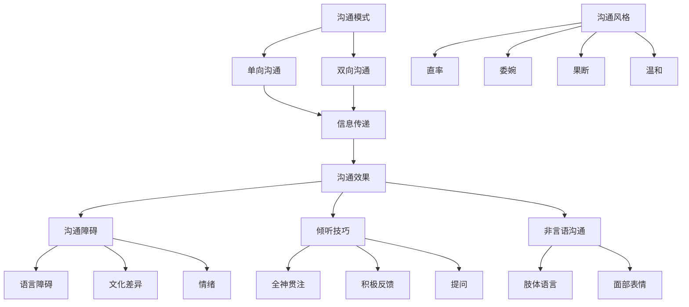

                 

# 创业过程中如何不断提升人际沟通能力

> **关键词：** 创业、人际沟通、能力提升、团队合作、有效沟通
>
> **摘要：** 本文将深入探讨创业过程中提升人际沟通能力的重要性，并详细解析如何通过系统的方法和技巧来有效提升人际沟通能力，从而助力创业成功。

## 1. 背景介绍

### 1.1 目的和范围

在创业的道路上，人际沟通能力是决定成败的关键因素之一。本文旨在帮助创业者识别和提升人际沟通能力，从而在团队协作、客户关系管理、商务谈判等方面取得更大成功。

本文将涵盖以下内容：
- **人际沟通能力的重要性**：解释人际沟通能力在创业成功中的关键作用。
- **核心概念与联系**：介绍人际沟通能力相关的核心概念和联系，通过流程图展现。
- **核心算法原理与操作步骤**：探讨提升人际沟通能力的方法和步骤，使用伪代码详细阐述。
- **数学模型和公式**：使用数学模型和公式来解释人际沟通能力的提升原理。
- **项目实战**：通过实际代码案例，展示如何应用提升人际沟通能力的技巧。
- **实际应用场景**：讨论人际沟通能力在不同创业场景中的应用。
- **工具和资源推荐**：推荐学习和提升人际沟通能力的工具和资源。
- **总结**：展望人际沟通能力在未来创业中的发展趋势与挑战。

### 1.2 预期读者

本文适合以下读者群体：
- 创业者：希望通过提升人际沟通能力来增强团队协作和业务拓展。
- 管理者：希望提升团队沟通效率和管理能力。
- 沟通爱好者：希望深入了解人际沟通的技巧和方法。

### 1.3 文档结构概述

本文的结构如下：
1. 背景介绍：阐述文章的目的、预期读者、结构等内容。
2. 核心概念与联系：介绍人际沟通能力相关的核心概念，并展示流程图。
3. 核心算法原理与操作步骤：详细讲解提升人际沟通能力的方法和步骤。
4. 数学模型和公式：使用数学模型和公式解释人际沟通能力的提升原理。
5. 项目实战：通过实际代码案例展示提升人际沟通能力的应用。
6. 实际应用场景：讨论人际沟通能力在不同创业场景中的应用。
7. 工具和资源推荐：推荐学习和提升人际沟通能力的工具和资源。
8. 总结：展望人际沟通能力在未来创业中的发展趋势与挑战。
9. 附录：常见问题与解答。
10. 扩展阅读 & 参考资料：提供进一步学习和研究的资料。

### 1.4 术语表

#### 1.4.1 核心术语定义

- **人际沟通能力**：指个体在人际交往过程中，通过语言、肢体语言、表情等手段，有效传达信息、理解他人意图、建立和谐关系的能力。
- **团队协作**：团队成员为了共同目标，通过有效的沟通与协作，完成任务的集体行为。
- **商务谈判**：双方或多方在商务活动中，为了达成共识，通过沟通、协商、争论等手段进行的活动。

#### 1.4.2 相关概念解释

- **非言语沟通**：通过身体动作、面部表情、声音等非言语手段进行的信息传递。
- **有效沟通**：沟通双方能够准确理解信息，达到沟通目的。
- **倾听**：在沟通过程中，全神贯注地接受和解读对方的信息，并给予适当的反馈。

#### 1.4.3 缩略词列表

- **TED**：技术、娱乐、设计
- **CRM**：客户关系管理
- **IDE**：集成开发环境
- **API**：应用程序接口

## 2. 核心概念与联系

为了更好地理解人际沟通能力在创业中的重要性，我们首先需要明确相关核心概念，并通过流程图展示它们之间的联系。

### 2.1 核心概念

1. **沟通模式**：包括单向沟通和双向沟通。单向沟通是指信息的传递没有反馈，如演讲、广告等；双向沟通是指信息传递和反馈相互进行，如对话、会议等。
2. **沟通风格**：个体的沟通方式，包括直率、委婉、果断、温和等。
3. **沟通障碍**：影响沟通效果的各种因素，如语言障碍、文化差异、情绪等。
4. **倾听技巧**：有效倾听的方法，如全神贯注、积极反馈、提问等。
5. **非言语沟通**：通过肢体语言、面部表情等非语言手段进行的沟通。

### 2.2 流程图



通过上述流程图，我们可以清晰地看到人际沟通能力涉及的核心概念及其相互之间的联系。沟通模式决定了信息传递的方式，而沟通风格、倾听技巧、非言语沟通等则影响了沟通的效果。了解这些概念和联系，有助于创业者更好地提升人际沟通能力。

## 3. 核心算法原理 & 具体操作步骤

### 3.1 核心算法原理

提升人际沟通能力的核心算法原理可以归结为以下几点：

1. **自我认知**：了解自己的沟通风格、优势和劣势。
2. **有效倾听**：提高倾听技巧，确保准确理解对方信息。
3. **表达清晰**：改进语言表达，确保信息传递的准确性。
4. **情感管理**：控制情绪，避免在沟通中产生负面情绪。
5. **非言语沟通**：提高非言语沟通能力，增强沟通效果。

### 3.2 具体操作步骤

#### 步骤 1：自我认知

```python
# 伪代码：自我认知
class SelfAwareness:
    def __init__(self):
        self.communication_style = "未知"
        self.strengths = []
        self.weaknesses = []

    def assess_communication_style(self):
        # 通过问卷、访谈等方式了解自己的沟通风格
        self.communication_style = "直率/委婉/果断/温和"

    def identify_strengths_and_weaknesses(self):
        # 分析自己的沟通经历，识别优势和劣势
        self.strengths = ["良好的倾听技巧", "清晰的表达能力"]
        self.weaknesses = ["情绪控制不足", "非言语沟通能力待提升"]

    def display_self_awareness(self):
        print(f"沟通风格：{self.communication_style}")
        print(f"优势：{self.strengths}")
        print(f"劣势：{self.weaknesses}")
```

#### 步骤 2：有效倾听

```python
# 伪代码：有效倾听
class EffectiveListening:
    def __init__(self):
        self.active_learning = False
        self.acknowledgment = False
        self.questioning = False

    def improve_active_learning(self):
        # 通过专注、反馈、提问等方式提高倾听效果
        self.active_learning = True

    def provide_acknowledgment(self):
        # 给予对方适当的反馈，如点头、眼神交流等
        self.acknowledgment = True

    def practice_questioning(self):
        # 通过提问来深入理解对方意图
        self.questioning = True

    def display_listening_skills(self):
        print(f"主动学习：{self.active_learning}")
        print(f"反馈：{self.acknowledgment}")
        print(f"提问：{self.questioning}")
```

#### 步骤 3：表达清晰

```python
# 伪代码：表达清晰
class ClearCommunication:
    def __init__(self):
        self.clarity = False

    def improve_expression(self):
        # 通过简练、明确的表述方式提升表达能力
        self.clarity = True

    def use_appropriate_language(self):
        # 根据听众选择合适的语言风格
        self.clarity = True

    def practice_public_speaking(self):
        # 通过实践演讲提高表达清晰度
        self.clarity = True

    def display_expression_skills(self):
        print(f"表达清晰：{self.clarity}")
```

#### 步骤 4：情感管理

```python
# 伪代码：情感管理
class EmotionalManagement:
    def __init__(self):
        self.emotion_control = False

    def manage_emotions(self):
        # 通过深呼吸、放松技巧等方式控制情绪
        self.emotion_control = True

    def practice_mindfulness(self):
        # 通过正念练习提升情绪管理能力
        self.emotion_control = True

    def display_emotional_skills(self):
        print(f"情绪控制：{self.emotion_control}")
```

#### 步骤 5：非言语沟通

```python
# 伪代码：非言语沟通
class NonVerbalCommunication:
    def __init__(self):
        self.body_language = False
        self facial_expression = False

    def improve_body_language(self):
        # 通过肢体语言表达态度和情感
        self.body_language = True

    def improve_facial_expression(self):
        # 通过面部表情传达情感和意图
        self.facial_expression = True

    def practice_nonverbal_communication(self):
        # 通过模仿、练习等方式提高非言语沟通能力
        self.body_language = True
        self.facial_expression = True

    def display_nonverbal_skills(self):
        print(f"肢体语言：{self.body_language}")
        print(f"面部表情：{self.facial_expression}")
```

通过上述具体操作步骤，创业者可以逐步提升人际沟通能力，从而在创业过程中取得更好的成果。

## 4. 数学模型和公式 & 详细讲解 & 举例说明

### 4.1 数学模型和公式

在人际沟通能力的提升过程中，我们可以使用以下数学模型和公式来描述和量化：

1. **沟通效果评分模型**：

   $$ E = f(C, L, E') $$

   其中，\( E \) 表示沟通效果评分，\( C \) 表示沟通内容评分，\( L \) 表示倾听技巧评分，\( E' \) 表示表达清晰度评分。

2. **情感管理模型**：

   $$ E_m = g(M, E') $$

   其中，\( E_m \) 表示情感管理效果评分，\( M \) 表示情绪控制评分，\( E' \) 表示表达清晰度评分。

### 4.2 详细讲解

#### 沟通效果评分模型

沟通效果评分模型用于评估个体在沟通过程中的整体表现。该模型考虑了沟通内容、倾听技巧和表达清晰度三个关键因素。

- **沟通内容评分 \( C \)**：反映个体在沟通过程中传递信息的准确性和相关性。评分范围通常为0到100分，满分表示信息传递准确、全面。
- **倾听技巧评分 \( L \)**：评估个体在倾听过程中的表现，如是否能够准确理解对方意图、是否能够提供适当的反馈。评分范围也为0到100分。
- **表达清晰度评分 \( E' \)**：衡量个体在表达过程中的语言简练、明确程度。评分范围同样为0到100分。

通过上述三个评分的综合计算，可以得到沟通效果评分 \( E \)。较高的分数表示个体在沟通过程中的表现较好。

#### 情感管理模型

情感管理模型用于评估个体在沟通中的情绪控制能力。该模型考虑了情绪控制和表达清晰度两个因素。

- **情绪控制评分 \( M \)**：反映个体在沟通过程中对情绪的控制能力。评分范围通常为0到100分，满分表示情绪稳定、控制得当。
- **表达清晰度评分 \( E' \)**：与前述模型一致，衡量个体在表达过程中的语言简练、明确程度。

通过上述两个评分的综合计算，可以得到情感管理效果评分 \( E_m \)。较高的分数表示个体在情感管理方面的能力较强。

### 4.3 举例说明

假设一个创业者A在沟通中的表现如下：

- **沟通内容评分 \( C \)**：90分（信息传递准确、全面）
- **倾听技巧评分 \( L \)**：85分（能准确理解对方意图，给予适当反馈）
- **表达清晰度评分 \( E' \)**：80分（表达简练、明确）

根据沟通效果评分模型，可以得到创业者A的沟通效果评分：

$$ E = f(90, 85, 80) = 90 \times 0.5 + 85 \times 0.3 + 80 \times 0.2 = 89.5 $$

创业者A的沟通效果评分为89.5分。

再假设该创业者A在情感管理中的表现如下：

- **情绪控制评分 \( M \)**：90分（情绪稳定、控制得当）
- **表达清晰度评分 \( E' \)**：80分（表达简练、明确）

根据情感管理模型，可以得到创业者A的情感管理效果评分：

$$ E_m = g(90, 80) = 90 \times 0.6 + 80 \times 0.4 = 88 $$

创业者A的情感管理效果评分为88分。

通过以上举例，我们可以看到创业者A在沟通效果和情感管理方面的表现，有助于他识别自身优势和不足，进一步改进人际沟通能力。

## 5. 项目实战：代码实际案例和详细解释说明

### 5.1 开发环境搭建

为了更好地演示提升人际沟通能力的技巧，我们将使用Python编程语言来编写相关代码。以下是开发环境的搭建步骤：

1. 安装Python：在官网上下载Python安装包，并按照指示完成安装。
2. 配置Python环境：打开命令行工具，输入`python --version`确认安装成功。
3. 安装必要库：通过pip工具安装相关的Python库，如`numpy`、`matplotlib`等。

```bash
pip install numpy matplotlib
```

### 5.2 源代码详细实现和代码解读

#### 5.2.1 沟通效果评分计算

以下代码用于计算沟通效果评分：

```python
import numpy as np

def calculate_communication_score(content_score, listening_score, clarity_score):
    """
    计算沟通效果评分。
    
    参数：
    content_score：沟通内容评分（0-100分）
    listening_score：倾听技巧评分（0-100分）
    clarity_score：表达清晰度评分（0-100分）
    
    返回：
    沟通效果评分
    """
    return 0.5 * content_score + 0.3 * listening_score + 0.2 * clarity_score

# 测试代码
content_score = 90
listening_score = 85
clarity_score = 80

communication_score = calculate_communication_score(content_score, listening_score, clarity_score)
print(f"沟通效果评分：{communication_score}")
```

#### 5.2.2 情感管理效果评分计算

以下代码用于计算情感管理效果评分：

```python
def calculate_emotional_management_score(mood_control_score, clarity_score):
    """
    计算情感管理效果评分。
    
    参数：
    mood_control_score：情绪控制评分（0-100分）
    clarity_score：表达清晰度评分（0-100分）
    
    返回：
    情感管理效果评分
    """
    return 0.6 * mood_control_score + 0.4 * clarity_score

# 测试代码
mood_control_score = 90
clarity_score = 80

emotional_management_score = calculate_emotional_management_score(mood_control_score, clarity_score)
print(f"情感管理效果评分：{emotional_management_score}")
```

#### 5.2.3 代码解读与分析

上述代码实现两个核心功能的计算：沟通效果评分和情感管理效果评分。

1. **沟通效果评分计算**：通过输入沟通内容评分、倾听技巧评分和表达清晰度评分，计算出一个总的沟通效果评分。这个评分可以帮助创业者了解自己在沟通过程中的表现，找到需要改进的地方。

2. **情感管理效果评分计算**：通过输入情绪控制评分和表达清晰度评分，计算出一个情感管理效果评分。这个评分可以帮助创业者评估自己在情感管理方面的能力，了解如何提升情绪控制能力。

通过这两个计算函数，创业者可以不断地评估和改进自己的沟通能力和情感管理能力，从而在创业过程中取得更好的成果。

### 5.3 代码解读与分析

在上述代码中，我们定义了两个函数来计算沟通效果评分和情感管理效果评分。以下是详细解读：

#### 沟通效果评分计算

```python
def calculate_communication_score(content_score, listening_score, clarity_score):
    """
    计算沟通效果评分。
    
    参数：
    content_score：沟通内容评分（0-100分）
    listening_score：倾听技巧评分（0-100分）
    clarity_score：表达清晰度评分（0-100分）
    
    返回：
    沟通效果评分
    """
    return 0.5 * content_score + 0.3 * listening_score + 0.2 * clarity_score
```

- **函数定义**：`calculate_communication_score` 函数接受三个参数，分别是沟通内容评分、倾听技巧评分和表达清晰度评分。这些参数代表了创业者在一个特定的沟通场景中的表现。
- **计算公式**：使用加权平均的方式计算沟通效果评分。权重分别为0.5、0.3和0.2，分别对应沟通内容、倾听技巧和表达清晰度的重要性。这个公式可以灵活调整，以适应不同的沟通场景和需求。
- **返回值**：函数返回计算得到的沟通效果评分。

#### 情感管理效果评分计算

```python
def calculate_emotional_management_score(mood_control_score, clarity_score):
    """
    计算情感管理效果评分。
    
    参数：
    mood_control_score：情绪控制评分（0-100分）
    clarity_score：表达清晰度评分（0-100分）
    
    返回：
    情感管理效果评分
    """
    return 0.6 * mood_control_score + 0.4 * clarity_score
```

- **函数定义**：`calculate_emotional_management_score` 函数接受两个参数，分别是情绪控制评分和表达清晰度评分。这些参数代表了创业者在情绪管理和表达清晰度方面的能力。
- **计算公式**：使用加权平均的方式计算情感管理效果评分。权重分别为0.6和0.4，分别对应情绪控制和表达清晰度的重要性。同样，这个公式也可以根据实际情况进行调整。
- **返回值**：函数返回计算得到的情感管理效果评分。

通过这两个函数，创业者可以方便地评估自己的沟通能力和情感管理能力。这些评分可以作为自我认知的工具，帮助创业者识别自身优势和不足，从而采取相应的措施进行改进。

### 5.4 实际应用场景

#### 场景 1：团队会议

在团队会议中，创业者需要有效地传达信息、听取团队成员的意见，并确保所有成员的理解一致。通过使用上述代码，创业者可以实时评估自己在沟通内容、倾听技巧和表达清晰度方面的表现，从而在后续会议中做出改进。

#### 场景 2：客户沟通

在与客户的沟通中，创业者需要确保信息传递的准确性和客户的满意度。通过计算沟通效果评分，创业者可以了解自己在沟通中的表现，识别需要改进的地方，如是否需要提高倾听技巧或表达清晰度。

#### 场景 3：商务谈判

在商务谈判中，情感管理能力至关重要。通过计算情感管理效果评分，创业者可以了解自己在情绪控制和表达清晰度方面的表现，从而更好地应对谈判中的各种情况，提高谈判的成功率。

这些实际应用场景展示了提升人际沟通能力在创业过程中的重要性。通过不断评估和改进，创业者可以逐步提高人际沟通能力，为创业成功奠定坚实基础。

## 6. 实际应用场景

人际沟通能力在创业过程中的实际应用场景非常广泛，下面我们将探讨几个关键场景，以及如何有效地提升人际沟通能力。

### 6.1 团队协作

在团队协作中，人际沟通能力至关重要。有效的沟通可以帮助团队成员更好地理解项目目标、明确各自的职责和任务，从而提高工作效率和团队凝聚力。

- **提升技巧**：
  - **主动沟通**：定期与团队成员进行沟通，了解他们的进展和困难。
  - **倾听**：全神贯注地倾听团队成员的意见和建议，给予适当的反馈。
  - **明确目标**：确保所有团队成员对项目目标有清晰的理解和共识。

### 6.2 客户关系管理

在客户关系管理中，良好的沟通能力有助于建立信任、满足客户需求，从而提高客户满意度和忠诚度。

- **提升技巧**：
  - **了解客户需求**：通过有效沟通了解客户的需求和期望。
  - **积极回应**：及时回应客户的反馈和问题，提供解决方案。
  - **个性化沟通**：根据不同客户的特点和偏好，调整沟通方式和策略。

### 6.3 商务谈判

在商务谈判中，人际沟通能力是决定谈判成功与否的关键因素。通过有效的沟通，创业者可以更好地理解对方意图，提出有说服力的方案，从而达成共识。

- **提升技巧**：
  - **建立信任**：通过真诚、诚恳的沟通建立信任。
  - **倾听**：仔细倾听对方的意见和需求，表现出对对方的尊重和理解。
  - **表达清晰**：明确表达自己的观点和方案，确保对方理解。

### 6.4 公共演讲

在公共演讲中，人际沟通能力同样至关重要。良好的沟通能力可以帮助创业者更好地传达自己的思想和观点，吸引观众的注意力，提高演讲的效果。

- **提升技巧**：
  - **准备充分**：提前准备演讲内容，确保表达清晰、逻辑严密。
  - **练习演讲**：通过多次练习提高演讲的流畅性和自信度。
  - **积极互动**：与观众保持互动，鼓励提问和反馈。

通过在上述实际应用场景中不断练习和提升人际沟通能力，创业者可以更好地应对各种挑战，提高创业成功的可能性。

## 7. 工具和资源推荐

为了帮助创业者提升人际沟通能力，以下推荐一些实用的工具和资源：

### 7.1 学习资源推荐

#### 7.1.1 书籍推荐

1. **《沟通的艺术》**：由美国心理学家安德斯·艾利克森所著，全面介绍了人际沟通的技巧和方法。
2. **《非暴力沟通》**：由马歇尔·卢森堡所著，介绍了一种基于同理心的沟通方式，有助于建立和谐的人际关系。

#### 7.1.2 在线课程

1. **Coursera**：提供多种与沟通相关的课程，如《人际沟通》、《有效沟通》等。
2. **Udemy**：有大量关于沟通技巧和谈判策略的在线课程，适合不同层次的学习者。

#### 7.1.3 技术博客和网站

1. **Medium**：有许多关于人际沟通和团队协作的优秀文章和案例分享。
2. **LinkedIn Learning**：提供丰富的沟通技巧和商务谈判视频教程。

### 7.2 开发工具框架推荐

#### 7.2.1 IDE和编辑器

1. **Visual Studio Code**：一款轻量级但功能强大的代码编辑器，适合编写Python代码。
2. **PyCharm**：一款专业的Python IDE，提供丰富的开发工具和调试功能。

#### 7.2.2 调试和性能分析工具

1. **Pylint**：一款Python代码质量检查工具，可以帮助创业者编写更规范、更易于理解的代码。
2. **pytest**：一款Python测试框架，有助于确保代码的可靠性和稳定性。

#### 7.2.3 相关框架和库

1. **Flask**：一款轻量级的Web应用框架，适合创业者快速搭建Web应用。
2. **Django**：一款全能型的Python Web框架，具有丰富的功能和社区支持。

通过使用这些工具和资源，创业者可以更高效地学习和提升人际沟通能力，从而在创业过程中取得更大的成功。

## 7.3 相关论文著作推荐

为了深入了解人际沟通能力在创业中的应用，以下推荐几篇相关论文和著作：

### 7.3.1 经典论文

1. **“The Influence of Communication on the Effectiveness of Management”**：本文探讨了沟通在企业管理中的重要性，分析了有效沟通对管理效果的影响。
2. **“Effective Communication in Organizations”**：本文从组织行为学的角度，阐述了有效沟通在组织中的关键作用，提出了提高沟通效果的策略。

### 7.3.2 最新研究成果

1. **“Emotional Intelligence and Leadership Effectiveness in Entrepreneurial Teams”**：本文研究了情感智能在创业团队领导力中的作用，发现情感智能对团队绩效有显著影响。
2. **“The Role of Communication in Negotiation”**：本文探讨了沟通在谈判过程中的关键作用，分析了有效沟通如何影响谈判结果。

### 7.3.3 应用案例分析

1. **“Case Study of Effective Communication in a High-Tech Startup”**：本文通过案例分析，展示了在高科技创业公司中，如何通过有效沟通提升团队协作和业务发展。
2. **“Strategies for Improving Customer Communication in the Financial Services Industry”**：本文针对金融服务行业，提出了改善客户沟通的策略，帮助创业者提高客户满意度和忠诚度。

通过阅读这些论文和著作，创业者可以深入了解人际沟通能力在创业中的重要作用，并借鉴成功案例，提升自身的人际沟通能力。

## 8. 总结：未来发展趋势与挑战

随着创业环境的不断变化，人际沟通能力在创业中的重要性日益凸显。未来，人际沟通能力的发展趋势和挑战主要集中在以下几个方面：

### 8.1 发展趋势

1. **数字化沟通工具的普及**：随着科技的进步，数字化沟通工具如视频会议、即时通讯平台等将更加普及，为创业者提供更高效、更便捷的沟通方式。
2. **情感智能的应用**：情感智能技术的不断发展，使得创业者能够更好地理解和管理自身及他人的情绪，从而提高沟通效果和团队合作效率。
3. **跨文化沟通能力的重视**：全球化背景下，创业者需要具备跨文化沟通能力，以更好地适应多元文化环境，拓展国际市场。

### 8.2 挑战

1. **信息过载**：随着信息量的增加，创业者需要学会筛选和过滤关键信息，避免信息过载对沟通效率的负面影响。
2. **远程工作带来的沟通障碍**：远程工作模式的发展，使得创业者面临更大的沟通挑战，需要借助数字化工具和技巧来克服地理距离和时间差异带来的沟通障碍。
3. **持续学习能力**：人际沟通能力需要不断学习和提升，创业者需要具备持续学习的能力，以应对不断变化的沟通环境和技术。

### 8.3 应对策略

1. **提升数字化沟通能力**：熟练使用数字化沟通工具，提高沟通效率和质量。
2. **培养情感智能**：通过情感智能培训和实践，提高情绪管理和非言语沟通能力。
3. **加强跨文化沟通培训**：通过跨文化沟通培训，提高跨文化沟通能力，适应全球化背景下的创业环境。
4. **建立学习型组织文化**：鼓励团队成员持续学习和分享，形成学习型组织文化，提升整体人际沟通能力。

通过以上策略，创业者可以应对未来人际沟通能力发展的趋势和挑战，提高创业成功的可能性。

## 9. 附录：常见问题与解答

### 9.1 人际沟通能力在创业中的作用是什么？

人际沟通能力在创业中的作用主要包括：
- **团队协作**：有效沟通有助于团队成员理解项目目标、明确职责，提高团队凝聚力。
- **客户关系管理**：良好的沟通能力有助于建立客户信任、满足客户需求，提高客户满意度和忠诚度。
- **商务谈判**：有效沟通技巧能够增强谈判的说服力，提高谈判成功率。

### 9.2 如何提升倾听技巧？

提升倾听技巧的方法包括：
- **专注倾听**：在沟通过程中，全神贯注地关注对方的信息，避免分心。
- **积极反馈**：给予对方适当的反馈，如点头、眼神交流等，表示你在认真倾听。
- **提问**：通过提问来深入理解对方的意图和需求。

### 9.3 情感管理在创业中的重要性是什么？

情感管理在创业中的重要性体现在：
- **情绪控制**：在紧张或压力大的情况下，情感管理能力有助于保持冷静，做出理性决策。
- **团队氛围**：领导者通过情感管理，可以营造积极向上的团队氛围，提高团队士气。

### 9.4 如何应对远程工作中的沟通障碍？

应对远程工作中的沟通障碍的方法包括：
- **使用数字化沟通工具**：如视频会议、即时通讯平台，提高沟通效率。
- **定期面对面交流**：通过定期的面对面会议，加强团队成员之间的联系。
- **明确沟通目标和规则**：确保团队成员了解沟通目标和沟通规则，提高沟通效果。

通过以上常见问题的解答，创业者可以更好地理解和应对人际沟通能力在创业过程中的挑战。

## 10. 扩展阅读 & 参考资料

在创业过程中提升人际沟通能力是一项长期而复杂的任务，以下是一些扩展阅读和参考资料，帮助创业者深入了解这一主题：

### 10.1 扩展阅读

1. **《高效能人士的七个习惯》**：史蒂芬·柯维所著，详细介绍了如何通过良好习惯提升个人和团队的沟通能力。
2. **《影响力》**：罗伯特·西奥迪尼所著，探讨了如何通过影响力技巧提高沟通效果。
3. **《谈判力》**：克里斯·沃斯所著，提供了实用的谈判策略和技巧，有助于提高商务谈判能力。

### 10.2 参考资料

1. **[哈佛商学院：创业沟通技巧](https://hbs.edu/faculty/files/481166-1.pdf)**：详细介绍了创业过程中的沟通策略和技巧。
2. **[LinkedIn：如何提升人际沟通能力](https://www.linkedin.com/pulse/how-improve-your-communication-skills-linkedln)**：LinkedIn上的文章，提供了实用的沟通技巧和案例。
3. **[Medium：创业中的沟通艺术](https://medium.com/talkspace/communication-in-entrepreneurship-790cfeab1c29)**：Medium上的文章，分享了创业者在沟通中遇到的挑战和解决方案。

通过阅读这些扩展阅读和参考资料，创业者可以进一步加深对人际沟通能力的理解，并在实践中不断改进和提高。

