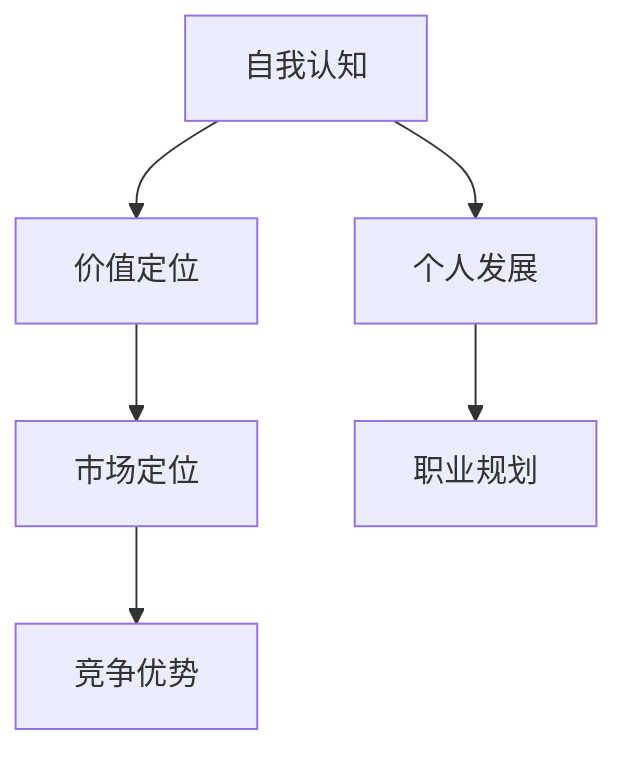

                 

# 创业过程中如何不断提升自我认知和价值定位

## 关键词
- 创业
- 自我认知
- 价值定位
- 成长
- 策略
- 资源整合

## 摘要
创业过程中，如何准确地进行自我认知并找到合适的价值定位，是决定创业者能否成功的关键因素之一。本文将深入探讨这一过程，包括核心概念、核心算法原理、数学模型和公式、实战案例，以及实际应用场景。通过一步步的逻辑推理，帮助读者理解自我认知与价值定位的内在联系，并提供实用的策略和方法，以提升创业者在竞争激烈的市场中脱颖而出的能力。

---

## 1. 背景介绍

### 1.1 目的和范围
本文旨在为创业者在创业过程中提供系统化的自我认知和价值定位策略。我们将从理论到实践，逐步分析如何通过不断提升自我认知来准确定位个人价值，从而在市场中找到立足点。

### 1.2 预期读者
本篇文章主要面向希望了解创业过程中自我认知与价值定位重要性的创业者、企业高管以及准备踏入创业领域的人士。

### 1.3 文档结构概述
本文将分为以下几个部分：
1. 背景介绍
2. 核心概念与联系
3. 核心算法原理与具体操作步骤
4. 数学模型和公式与详细讲解
5. 项目实战：代码实际案例和详细解释说明
6. 实际应用场景
7. 工具和资源推荐
8. 总结：未来发展趋势与挑战
9. 附录：常见问题与解答
10. 扩展阅读与参考资料

### 1.4 术语表

#### 1.4.1 核心术语定义
- **自我认知**：个体对自己心理状态、能力、动机、需求等的认知过程。
- **价值定位**：确定个体在市场中的独特价值和竞争优势。
- **成长策略**：为实现自我认知和价值定位所采取的一系列行动。

#### 1.4.2 相关概念解释
- **市场定位**：企业针对特定消费者群体和市场竞争环境，设计并传达其产品或服务的独特价值和特点。
- **资源整合**：整合企业内外部资源，以实现整体效益最大化。

#### 1.4.3 缩略词列表
- **AI**：人工智能
- **CRM**：客户关系管理
- **SaaS**：软件即服务

---

## 2. 核心概念与联系

为了更好地理解自我认知和价值定位的重要性，我们需要先了解这两个概念及其相互关系。

### 2.1 自我认知
自我认知是个人对自己内在特质、能力、价值观等信息的综合理解。它不仅影响个体行为和决策，还是实现价值定位的前提。

#### 2.1.1 自我认知的重要性
- **个人发展**：自我认知帮助个体明确自身优势和劣势，从而进行有针对性的提升。
- **职业规划**：准确自我认知有助于选择适合自己的职业路径。

### 2.2 价值定位
价值定位是指企业在市场中确定其产品或服务的独特价值和竞争优势。这一过程依赖于对市场的深刻理解和自身资源的分析。

#### 2.2.1 价值定位的重要性
- **竞争优势**：明确的定位有助于企业脱颖而出，赢得市场份额。
- **营销策略**：价值定位是制定营销策略的核心，直接影响企业品牌形象和客户认知。

### 2.3 自我认知与价值定位的关系
自我认知和价值定位是相辅相成的。通过自我认知，个体能够更清晰地了解自身价值，从而在市场中找到定位。反之，通过价值定位，个体可以更深入地认识自我，不断调整和优化自我认知。

#### 2.3.1 Mermaid 流程图

---

在下一部分，我们将探讨如何通过核心算法原理来不断提升自我认知和价值定位。敬请期待。

