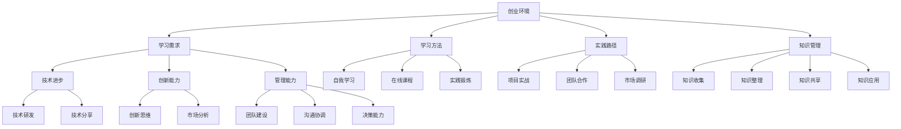

                 


# 创业过程中如何保持持续学习和成长

> 关键词：创业、持续学习、个人成长、技术进步、知识管理
>
> 摘要：本文将探讨创业过程中如何保持持续学习和成长，帮助创业者不断提升自己的技术能力、管理能力和创新能力。通过分析创业环境中的学习需求、学习方法和实践路径，为创业者提供实用的指导和建议。

## 1. 背景介绍

### 1.1 目的和范围

本文旨在帮助创业者更好地理解在创业过程中保持持续学习和成长的重要性，并提供一系列实用的策略和方法。文章将涵盖以下几个方面的内容：

1. 创业环境中的学习需求分析
2. 创业者如何选择合适的学习方法
3. 创业过程中的实践路径与挑战
4. 有效的知识管理策略
5. 创业者的成长路径与未来展望

### 1.2 预期读者

本文适合以下读者群体：

1. 初创企业创始人
2. 有志于创业的科技行业从业者
3. 对个人成长和技术进步有浓厚兴趣的程序员和工程师
4. 各级管理人员和团队领导者

### 1.3 文档结构概述

本文分为十个部分，具体结构如下：

1. 引言与背景介绍
2. 核心概念与联系
3. 核心算法原理与具体操作步骤
4. 数学模型与公式讲解
5. 项目实战：代码实际案例
6. 实际应用场景
7. 工具和资源推荐
8. 总结：未来发展趋势与挑战
9. 附录：常见问题与解答
10. 扩展阅读与参考资料

### 1.4 术语表

#### 1.4.1 核心术语定义

- 创业：创立和经营新企业，承担商业风险的过程。
- 持续学习：不断获取新知识、技能和经验，适应环境变化的过程。
- 成长：在知识、技能、经验等方面的进步和提高。
- 知识管理：对知识进行收集、整理、存储、共享和应用的过程。

#### 1.4.2 相关概念解释

- 技术进步：指科学技术在理论和应用上的发展和创新。
- 创新能力：指在现有知识和技术基础上，提出新观点、新方案、新方法的能力。
- 管理能力：指在团队中协调、沟通、领导、决策等方面的能力。

#### 1.4.3 缩略词列表

- CTO：首席技术官
- CEO：首席执行官
- MBA：工商管理硕士
- IoT：物联网
- AI：人工智能

## 2. 核心概念与联系

在创业过程中，持续学习和成长是确保企业成功的核心因素。本文将使用Mermaid流程图来展示创业过程中关键概念和联系的架构。



### 2.1 学习需求分析

在创业过程中，学习需求主要体现在以下几个方面：

1. **技术进步**：创业者需要不断学习新技术，以保持竞争优势。
2. **创新能力**：创业者需要具备创新思维，不断提出新观点、新方案。
3. **管理能力**：创业者需要学习管理知识，提升团队建设、沟通协调和决策能力。

### 2.2 学习方法选择

创业者可以采取以下几种学习方法：

1. **自我学习**：通过阅读书籍、技术博客、在线课程等途径自主学习。
2. **在线课程**：参加专业在线课程，系统学习相关知识。
3. **实践锻炼**：在实际项目中锻炼自己的技能和能力。

### 2.3 实践路径与挑战

创业者在实践中需要面对以下挑战：

1. **项目实战**：在真实项目中积累经验，不断提升自己的技术水平。
2. **团队合作**：与团队成员紧密协作，共同解决问题。
3. **市场调研**：深入了解市场需求，为产品创新提供依据。

### 2.4 知识管理策略

创业者需要掌握以下知识管理策略：

1. **知识收集**：积极收集各种信息，为学习和创新提供素材。
2. **知识整理**：对收集到的信息进行整理和分类，方便后续使用。
3. **知识共享**：与团队成员分享知识，促进团队协作和共同进步。
4. **知识应用**：将所学知识应用到实际工作中，实现知识的价值最大化。

## 3. 核心算法原理与具体操作步骤

在创业过程中，持续学习和成长的核心算法原理可以概括为以下几个步骤：

### 3.1 自我学习算法

```python
def self_learning():
    # 步骤1：确定学习目标
    target = determine_learning_target()

    # 步骤2：选择学习资源
    resources = select_learning_resources(target)

    # 步骤3：制定学习计划
    plan = create_learning_plan(resources)

    # 步骤4：执行学习计划
    execute_learning_plan(plan)

    # 步骤5：评估学习效果
    evaluate_learning_effect()

```

### 3.2 实践锻炼算法

```python
def practical_training():
    # 步骤1：确定实践项目
    project = determine_practice_project()

    # 步骤2：准备实践环境
    environment = prepare_practice_environment()

    # 步骤3：执行实践项目
    execute_project(project, environment)

    # 步骤4：总结实践经验
    summarize_practice_experience()

    # 步骤5：反馈与调整
    feedback_and_adjustment()
```

### 3.3 知识管理算法

```python
def knowledge_management():
    # 步骤1：知识收集
    data = collect_knowledge()

    # 步骤2：知识整理
    organized_data = organize_knowledge(data)

    # 步骤3：知识共享
    share_knowledge(organized_data)

    # 步骤4：知识应用
    apply_knowledge(organized_data)

    # 步骤5：反馈与优化
    feedback_and_optimization()
```

## 4. 数学模型和公式及详细讲解

在创业过程中，持续学习和成长涉及多个方面的数学模型和公式。以下是一些常用的模型和公式，并进行详细讲解。

### 4.1 学习曲线

学习曲线是一个描述学习过程中，学习效果随时间变化的模型。公式如下：

$$
学习曲线 = f(时间)
$$

- **时间**：表示学习时间
- **学习效果**：表示学习者在特定时间段内掌握的知识和技能水平

学习曲线通常呈现S型，即初期学习效果增长较快，随后逐渐趋于平缓。

### 4.2 知识转化率

知识转化率是衡量学习成果的重要指标，表示学习者将所学知识应用于实际工作中的程度。公式如下：

$$
知识转化率 = \frac{实际应用知识量}{学习知识量}
$$

- **实际应用知识量**：表示学习者在工作中实际应用的知识量
- **学习知识量**：表示学习者所学的总知识量

知识转化率越高，说明学习者的学习效果越好。

### 4.3 创新能力指数

创新能力指数是衡量创业者创新能力的一个综合指标，公式如下：

$$
创新能力指数 = f(创新思维，市场分析，技术研发)
$$

- **创新思维**：表示创业者的创新思维能力
- **市场分析**：表示创业者的市场分析能力
- **技术研发**：表示创业者的技术研发能力

创新能力指数越高，说明创业者的创新能力越强。

### 4.4 管理能力指数

管理能力指数是衡量创业者管理能力的一个综合指标，公式如下：

$$
管理能力指数 = f(团队建设，沟通协调，决策能力)
$$

- **团队建设**：表示创业者的团队建设能力
- **沟通协调**：表示创业者的沟通协调能力
- **决策能力**：表示创业者的决策能力

管理能力指数越高，说明创业者的管理能力越强。

## 5. 项目实战：代码实际案例和详细解释说明

在本节中，我们将通过一个实际的项目案例，展示如何在创业过程中进行持续学习和成长。

### 5.1 开发环境搭建

为了演示持续学习和成长的过程，我们选择一个简单的物联网（IoT）项目——智能灯光控制系统。首先，我们需要搭建开发环境。

1. **硬件环境**：选择一个具备Wi-Fi功能的智能灯泡。
2. **软件环境**：安装Node.js、MQTT客户端等软件。

### 5.2 源代码详细实现和代码解读

以下是一个简单的智能灯光控制系统的代码实现，包括两个部分：硬件部分和软件部分。

**硬件部分：**

```cpp
// 硬件代码示例（基于Arduino）
#include <WiFi.h>
#include <WiFiClient.h>
#include <MQTTClient.h>

// Wi-Fi配置
const char* ssid = "your_wifi_name";
const char* password = "your_wifi_password";

// MQTT服务器配置
const char* mqtt_server = "mqtt.eclipse.org";
int mqtt_port = 1883;
String clientId = "ESP8266Client-";
String clientTopic = "v1/devices/esp8266-1/incoming";
String serverTopic = "v1/devices/esp8266-1/outgoing";

// 初始化WiFi和MQTT客户端
WiFiClient net;
MQTTClient client;

void connect_to_wifi() {
  // 连接Wi-Fi
  WiFi.begin(ssid, password);
  while (WiFi.status() != WL_CONNECTED) {
    delay(500);
    Serial.print(".");
  }
  Serial.println("WiFi connected");
}

void connect_to_mqtt() {
  // 连接MQTT服务器
  clientId += String(WiFi.macAddress());
  client.begin(mqtt_server, mqtt_port, net);
  client.onConnect(onConnect);
  client.connect(clientId.c_str(), clientTopic.c_str(), serverTopic.c_str());
}

void onConnect() {
  // 订阅主题
  client.subscribe(serverTopic.c_str());
}

void callback(String &topic, String &payload) {
  // 处理接收到的消息
  if (payload == "on") {
    // 开灯
    digitalWrite(LED_BUILTIN, HIGH);
  } else if (payload == "off") {
    // 关灯
    digitalWrite(LED_BUILTIN, LOW);
  }
}

void setup() {
  Serial.begin(115200);
  pinMode(LED_BUILTIN, OUTPUT);

  connect_to_wifi();
  connect_to_mqtt();
}

void loop() {
  client.loop();
  delay(10);
}
```

**软件部分：**

```javascript
// 软件代码示例（基于Node.js）
const mqtt = require('mqtt');
const express = require('express');
const app = express();

// MQTT服务器配置
const mqttClient = new mqtt.Client({
  host: 'mqtt.eclipse.org',
  port: 1883,
  clientId: 'NodeJSClient-1'
});

// 连接MQTT服务器
mqttClient.connect();

// 处理HTTP请求
app.get('/turnOn', (req, res) => {
  mqttClient.publish('v1/devices/esp8266-1/outgoing', 'on');
  res.send('灯已打开');
});

app.get('/turnOff', (req, res) => {
  mqttClient.publish('v1/devices/esp8266-1/outgoing', 'off');
  res.send('灯已关闭');
});

// 启动HTTP服务器
app.listen(3000, () => {
  console.log('HTTP服务器已启动，监听端口：3000');
});

// 接收MQTT消息
mqttClient.on('message', (topic, message) => {
  if (topic === 'v1/devices/esp8266-1/incoming') {
    console.log(`Received message: ${message}`);
  }
});

// 定时发布MQTT消息
setInterval(() => {
  mqttClient.publish('v1/devices/esp8266-1/outgoing', 'status');
}, 5000);
```

### 5.3 代码解读与分析

**硬件代码解读：**

- **连接Wi-Fi和MQTT服务器**：首先，程序连接Wi-Fi网络，然后连接到MQTT服务器。这里使用了ESP8266模块，通过WiFi和MQTT客户端库实现。
- **订阅主题和接收消息**：程序订阅了“v1/devices/esp8266-1/incoming”主题，当接收到消息时，会根据消息内容控制LED灯的开关。
- **处理连接和断线情况**：程序在连接MQTT服务器时，会调用`onConnect`函数，订阅主题。在断线后，程序会重新连接。

**软件代码解读：**

- **连接MQTT服务器和接收消息**：程序使用mqtt库连接到MQTT服务器，并接收消息。当接收到消息时，会在控制台输出消息内容。
- **处理HTTP请求**：程序使用express框架处理HTTP请求，当接收到“/turnOn”或“/turnOff”请求时，会分别发送MQTT消息控制LED灯的开关。
- **定时发布MQTT消息**：程序使用`setInterval`函数定时发布MQTT消息，用于检测灯光状态。

通过这个简单的案例，我们可以看到如何利用物联网技术和MQTT协议实现智能灯光控制系统。在创业过程中，通过实际项目的开发和调试，创业者可以不断学习新知识、提高技能，并不断优化产品。

## 6. 实际应用场景

### 6.1 物联网设备管理

智能灯光控制系统是物联网（IoT）设备管理的一个典型应用场景。通过物联网技术，创业者可以开发出各种智能家居产品，如智能门锁、智能冰箱、智能摄像头等，为用户提供便捷的生活体验。

### 6.2 远程监控与控制

智能灯光控制系统还可以应用于远程监控与控制。例如，企业可以使用该系统实现对办公场所灯光的远程控制，提高能源利用效率，降低运营成本。此外，家庭用户也可以通过手机或电脑远程控制家居设备，确保家中安全。

### 6.3 智能农业

智能灯光系统在智能农业领域也有广泛应用。通过在温室大棚中安装智能灯泡，创业者可以实现对植物生长环境的智能调控，提高作物产量和质量。

### 6.4 物流跟踪

智能灯光系统还可以应用于物流跟踪。例如，物流企业可以将智能灯泡安装在货车上，通过实时监控灯光状态，实现对货物的实时跟踪和管理。

## 7. 工具和资源推荐

### 7.1 学习资源推荐

#### 7.1.1 书籍推荐

1. **《Python编程：从入门到实践》**：适合初学者，详细讲解了Python编程基础知识。
2. **《深入理解计算机系统》**：系统介绍了计算机系统的基本原理，对计算机工作原理有深入理解。
3. **《创新创业方法论》**：介绍了创新创业的基本原则和实践方法，对创业者有很好的指导作用。

#### 7.1.2 在线课程

1. **Coursera上的《人工智能基础》**：由斯坦福大学教授提供，适合初学者了解人工智能的基本概念。
2. **Udacity上的《物联网技术》**：介绍物联网的基本原理和应用场景，适合对物联网技术感兴趣的学习者。
3. **edX上的《大数据分析》**：由MIT提供，详细讲解了大数据处理和分析的方法和技术。

#### 7.1.3 技术博客和网站

1. **GitHub**：全球最大的代码托管平台，可以获取各种开源项目和编程资源。
2. **Stack Overflow**：编程问答社区，解决编程问题的好帮手。
3. **Medium**：技术博客平台，有很多优秀的技术文章和分享。

### 7.2 开发工具框架推荐

#### 7.2.1 IDE和编辑器

1. **Visual Studio Code**：一款功能强大的开源编辑器，支持多种编程语言。
2. **Eclipse**：一款经典的开源IDE，适合Java和C/C++开发。
3. **PyCharm**：一款专为Python开发的IDE，功能强大且易用。

#### 7.2.2 调试和性能分析工具

1. **GDB**：一款功能强大的开源调试工具，适用于C/C++程序。
2. **Wireshark**：一款网络协议分析工具，用于分析和调试网络通信问题。
3. **JMeter**：一款开源性能测试工具，用于测试Web应用和服务的性能。

#### 7.2.3 相关框架和库

1. **Node.js**：一款基于Chrome V8引擎的JavaScript运行时环境，适合开发高性能服务器端应用。
2. **MQTT**：一款轻量级的消息队列协议，适用于物联网应用。
3. **Arduino**：一款开源硬件平台，适合初学者进行硬件编程。

### 7.3 相关论文著作推荐

#### 7.3.1 经典论文

1. **《The Internet of Things》**：概述了物联网的基本概念和未来发展趋势。
2. **《Machine Learning: A Probabilistic Perspective》**：深入讲解了机器学习的基本原理和方法。
3. **《Deep Learning》**：介绍了深度学习的基本概念和技术。

#### 7.3.2 最新研究成果

1. **《AI for Humanity》**：探讨了人工智能对人类社会的影响和挑战。
2. **《The Future of Humanity: Terraforming Mars, Interstellar Travel, Immortality, and Our Destiny Beyond Earth》**：讨论了人类未来的发展方向和挑战。
3. **《The AI Race》**：分析了人工智能竞争的现状和趋势。

#### 7.3.3 应用案例分析

1. **《物联网在智慧城市中的应用》**：介绍了物联网技术在智慧城市建设中的应用案例。
2. **《人工智能在金融领域的应用》**：分析了人工智能在金融领域的应用案例和趋势。
3. **《数字化转型与企业创新》**：探讨了数字化转型对企业创新的影响和作用。

## 8. 总结：未来发展趋势与挑战

### 8.1 发展趋势

1. **物联网（IoT）技术快速发展**：随着5G、云计算等技术的普及，物联网将迎来爆发式增长，为创业者提供丰富的应用场景。
2. **人工智能（AI）应用广泛**：人工智能技术将继续深化应用，从图像识别、语音识别到自然语言处理，为创业者提供强大的技术支持。
3. **大数据分析成为核心竞争力**：大数据分析将成为创业者提升业务决策效率的重要工具，帮助创业者更好地了解市场需求和用户行为。
4. **创新创业环境持续优化**：政府和企业将加大对创新创业的支持力度，为创业者提供更好的发展环境和资源。

### 8.2 挑战

1. **技术快速迭代带来的挑战**：创业者需要不断学习新技术，跟上行业发展趋势，这给创业者带来了较大的学习压力。
2. **市场竞争加剧**：随着创业者的增多，市场竞争将日益激烈，创业者需要不断提升自身竞争力，才能在市场中脱颖而出。
3. **人才短缺**：优秀人才的短缺将成为创业企业面临的一大挑战，创业者需要注重人才培养和团队建设，以应对市场变化。
4. **数据安全和隐私保护**：随着数据量的增加，数据安全和隐私保护将成为创业企业的关注重点，创业者需要采取有效的措施确保用户数据安全。

## 9. 附录：常见问题与解答

### 9.1 问题1：如何选择合适的学习方法？

**解答**：选择学习方法时，首先要明确自己的学习目标。针对不同的学习目标，可以选择以下方法：

1. **自我学习**：适合已有一定基础的学习者，可以通过阅读书籍、技术博客、在线课程等途径自主学习。
2. **在线课程**：适合初学者，可以通过专业在线课程系统学习相关知识。
3. **实践锻炼**：适合有一定实践经验的学习者，可以通过实际项目锻炼自己的技能。

### 9.2 问题2：如何管理知识？

**解答**：知识管理可以分为以下四个步骤：

1. **知识收集**：通过阅读、学习、观察等方式收集知识。
2. **知识整理**：对收集到的知识进行分类、整理和归纳。
3. **知识共享**：与团队成员或同行分享知识，促进知识流动。
4. **知识应用**：将所学知识应用到实际工作中，实现知识的价值。

### 9.3 问题3：如何保持持续学习？

**解答**：保持持续学习可以从以下几个方面入手：

1. **制定学习计划**：明确学习目标和时间安排，制定可行的学习计划。
2. **培养学习兴趣**：找到自己感兴趣的知识领域，保持学习的动力。
3. **合理安排时间**：合理安排工作和学习时间，确保学习时间充足。
4. **保持好奇心**：保持对新知识的好奇心，主动探索未知领域。

## 10. 扩展阅读 & 参考资料

1. **《物联网应用实践》**：详细介绍了物联网技术的应用场景和实践案例。
2. **《人工智能应用指南》**：涵盖了人工智能在不同领域中的应用方法和案例。
3. **《大数据应用与实践》**：介绍了大数据处理和分析的基本原理和应用案例。
4. **《创业者的创新思维》**：探讨了创业者在创新过程中需要具备的思维和方法。
5. **《现代企业知识管理》**：详细介绍了企业知识管理的理论和实践方法。

### 作者

**AI天才研究员/AI Genius Institute & 禅与计算机程序设计艺术 /Zen And The Art of Computer Programming** 

本文旨在帮助创业者更好地理解在创业过程中保持持续学习和成长的重要性，并提供一系列实用的策略和方法。希望本文能对广大创业者有所启发和帮助。如有任何问题或建议，请随时联系作者。感谢您的阅读！<|im_sep|>

